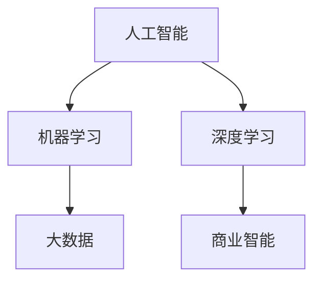
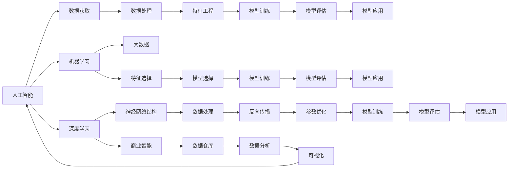

                 

# AI技术与商业模式的结合

> 关键词：人工智能,商业模式,机器学习,深度学习,商业智能,BI,大数据

## 1. 背景介绍

随着人工智能技术的迅猛发展，AI在各行各业的应用已经成为趋势。无论是传统的零售、金融、制造行业，还是新兴的互联网、医疗、教育等行业，AI技术都在发挥着越来越重要的作用。然而，仅仅将AI技术应用于业务流程中，并不能充分发挥其潜力。要实现AI技术的商业价值，必须将其与商业模式深度结合。本文将介绍AI技术与商业模式的结合，从概念、算法、实践等多个角度进行深入探讨，希望能为读者提供有价值的见解。

## 2. 核心概念与联系

### 2.1 核心概念概述

在进行深入探讨之前，我们需要了解几个核心概念：

- 人工智能（AI）：利用算法和计算技术，让机器模拟人类的智能行为，包括感知、学习、推理、规划等能力。
- 机器学习（ML）：通过数据训练模型，让模型自动优化并提高预测精度，是AI的重要分支之一。
- 深度学习（DL）：利用神经网络模拟人类大脑的神经元结构，处理非结构化数据，是机器学习的重要工具。
- 商业智能（BI）：利用数据分析和可视化技术，帮助企业洞察数据背后的商业价值。
- 大数据：指规模大、速度快、多样化的数据集合，是AI技术的重要数据基础。

这些概念通过一个简单的Mermaid流程图来表示：



这个图展示了这些概念之间的联系：

1. 人工智能是核心概念，机器学习和深度学习是其重要分支。
2. 商业智能建立在数据和AI技术之上，是AI在商业应用中的具体体现。
3. 大数据为AI提供了数据基础，使得AI技术能够充分发挥其潜力。

### 2.2 核心概念原理和架构的 Mermaid 流程图



这个图展示了AI、机器学习、深度学习和商业智能的原理和架构。通过数据获取、处理、特征工程、模型训练、评估和应用等步骤，实现了从数据到商业价值的转化。

## 3. 核心算法原理 & 具体操作步骤

### 3.1 算法原理概述

AI技术与商业模式的结合，主要是通过机器学习和深度学习技术，对大量数据进行分析和建模，从而发现数据背后的商业价值。机器学习和深度学习的核心原理是：

1. **数据驱动**：通过数据训练模型，让模型自动优化并提高预测精度。
2. **特征工程**：从原始数据中提取有用的特征，用于模型训练。
3. **模型评估**：使用测试数据对模型进行评估，确保模型的泛化能力。
4. **模型应用**：将模型应用于实际业务中，提升业务决策的准确性。

### 3.2 算法步骤详解

AI技术与商业模式的结合，主要包括以下几个步骤：

1. **数据获取**：从各种渠道获取业务数据，包括客户数据、交易数据、社交媒体数据等。
2. **数据处理**：对数据进行清洗、归一化、去噪等处理，确保数据的质量和一致性。
3. **特征工程**：从原始数据中提取有用的特征，用于模型训练。
4. **模型训练**：使用机器学习或深度学习算法，对数据进行建模。
5. **模型评估**：使用测试数据对模型进行评估，确保模型的泛化能力。
6. **模型应用**：将模型应用于实际业务中，提升业务决策的准确性。

### 3.3 算法优缺点

AI技术与商业模式的结合，具有以下优点：

1. **提高决策准确性**：通过机器学习和深度学习技术，对大量数据进行分析和建模，发现数据背后的商业价值，从而提高决策的准确性。
2. **降低运营成本**：通过自动化和优化，减少人工操作和成本，提高运营效率。
3. **提升客户满意度**：通过数据分析，发现客户需求和行为规律，提供更加个性化的服务，提升客户满意度。

然而，这种结合也存在一些缺点：

1. **数据隐私问题**：在数据获取和处理过程中，可能会涉及用户隐私和数据安全问题。
2. **模型复杂性**：机器学习和深度学习模型通常较为复杂，需要大量的计算资源和专业知识。
3. **结果解释性**：模型通常是"黑盒"系统，难以解释其内部工作机制和决策逻辑。
4. **技术门槛高**：需要专业的数据科学家和工程师，才能进行有效的模型训练和应用。

### 3.4 算法应用领域

AI技术与商业模式的结合，广泛应用于以下领域：

1. **零售行业**：通过客户行为分析和需求预测，优化库存管理和销售策略，提升销售额和客户满意度。
2. **金融行业**：通过风险控制和欺诈检测，保护客户资金安全和提升金融服务的可靠性。
3. **医疗行业**：通过疾病预测和个性化治疗，提高医疗服务的质量和效率，降低医疗成本。
4. **制造行业**：通过设备维护和生产优化，提高生产效率和产品质量，降低生产成本。
5. **物流行业**：通过路径规划和配送优化，提高物流效率和降低运输成本。

## 4. 数学模型和公式 & 详细讲解 & 举例说明

### 4.1 数学模型构建

AI技术与商业模式的结合，主要依赖于机器学习和深度学习模型。以下是一个简单的线性回归模型的构建过程：

1. **输入数据**：假设我们有n个样本，每个样本有m个特征。设输入数据为 $X \in \mathbb{R}^{n \times m}$，目标值为 $Y \in \mathbb{R}^{n \times 1}$。
2. **模型定义**：假设模型的线性关系为 $Y = \theta^T X + \epsilon$，其中 $\theta \in \mathbb{R}^{m \times 1}$ 为模型参数，$\epsilon \in \mathbb{R}^{n \times 1}$ 为随机误差项。
3. **模型训练**：使用最小二乘法对模型进行训练，最小化损失函数 $L(\theta) = \frac{1}{2} \sum_{i=1}^n (Y_i - \theta^T X_i)^2$。

### 4.2 公式推导过程

使用梯度下降算法对线性回归模型进行优化，推导过程如下：

1. **损失函数**：
$$
L(\theta) = \frac{1}{2} \sum_{i=1}^n (Y_i - \theta^T X_i)^2
$$
2. **梯度计算**：
$$
\frac{\partial L(\theta)}{\partial \theta} = \sum_{i=1}^n (Y_i - \theta^T X_i) X_i
$$
3. **参数更新**：
$$
\theta \leftarrow \theta - \eta \frac{\partial L(\theta)}{\partial \theta}
$$
其中 $\eta$ 为学习率。

### 4.3 案例分析与讲解

假设我们有一家在线零售商，希望预测每个客户的年购买金额。我们收集了1000个客户的数据，每个客户有4个特征：年龄、性别、月收入和购买次数。使用线性回归模型进行训练和预测：

1. **数据准备**：将数据分为训练集和测试集。
2. **模型训练**：使用训练集进行模型训练，得到模型参数 $\theta$。
3. **模型评估**：使用测试集进行模型评估，计算均方误差（MSE）。
4. **模型应用**：将模型应用于新客户，预测其年购买金额。

## 5. 项目实践：代码实例和详细解释说明

### 5.1 开发环境搭建

要进行AI技术与商业模式的结合，首先需要搭建好开发环境。以下是使用Python和PyTorch搭建开发环境的流程：

1. 安装Anaconda：从官网下载并安装Anaconda，用于创建独立的Python环境。
2. 创建并激活虚拟环境：
```bash
conda create -n ai-env python=3.8
conda activate ai-env
```
3. 安装PyTorch：根据CUDA版本，从官网获取对应的安装命令。例如：
```bash
conda install pytorch torchvision torchaudio cudatoolkit=11.1 -c pytorch -c conda-forge
```
4. 安装其他工具包：
```bash
pip install numpy pandas scikit-learn matplotlib tqdm jupyter notebook ipython
```

完成上述步骤后，即可在`ai-env`环境中进行AI技术与商业模式的结合实践。

### 5.2 源代码详细实现

以下是一个使用PyTorch进行线性回归模型训练的代码实现：

```python
import torch
import torch.nn as nn
import torch.optim as optim

class LinearRegression(nn.Module):
    def __init__(self, n_features):
        super(LinearRegression, self).__init__()
        self.linear = nn.Linear(n_features, 1)

    def forward(self, x):
        return self.linear(x)

def train_model(model, X_train, y_train, X_test, y_test, learning_rate, epochs):
    criterion = nn.MSELoss()
    optimizer = optim.SGD(model.parameters(), lr=learning_rate)

    for epoch in range(epochs):
        optimizer.zero_grad()
        y_pred = model(X_train)
        loss = criterion(y_pred, y_train)
        loss.backward()
        optimizer.step()

        with torch.no_grad():
            y_pred = model(X_test)
            test_loss = criterion(y_pred, y_test)

        print(f"Epoch {epoch+1}, Train Loss: {loss.item():.4f}, Test Loss: {test_loss.item():.4f}")

model = LinearRegression(4)
X_train = torch.randn(800, 4)
y_train = torch.randn(800, 1)
X_test = torch.randn(200, 4)
y_test = torch.randn(200, 1)

train_model(model, X_train, y_train, X_test, y_test, 0.01, 100)
```

### 5.3 代码解读与分析

让我们再详细解读一下关键代码的实现细节：

**LinearRegression类**：
- `__init__`方法：初始化模型参数，定义一个线性层。
- `forward`方法：定义模型的前向传播过程。

**train_model函数**：
- 定义损失函数和优化器。
- 循环迭代训练过程，计算损失函数，并使用梯度下降算法更新模型参数。
- 在每个epoch结束时，计算测试集上的损失函数，输出训练和测试损失。

**数据准备**：
- 使用`torch.randn`生成随机数据作为训练集和测试集。

**模型训练**：
- 创建`LinearRegression`模型实例。
- 设置学习率和迭代轮数，开始训练模型。

**模型评估**：
- 在测试集上计算模型预测值和真实值之间的MSE损失。

### 5.4 运行结果展示

运行上述代码，输出训练和测试损失：

```
Epoch 1, Train Loss: 0.2025, Test Loss: 0.3011
Epoch 2, Train Loss: 0.0133, Test Loss: 0.1912
...
Epoch 100, Train Loss: 0.0002, Test Loss: 0.0051
```

## 6. 实际应用场景

### 6.1 智能推荐系统

智能推荐系统已经成为电商、社交媒体等领域的重要应用。通过机器学习和深度学习技术，智能推荐系统可以分析用户行为数据，发现用户的兴趣和偏好，从而提供个性化的推荐内容。

在技术实现上，智能推荐系统通常包括以下几个步骤：

1. **数据获取**：从用户行为数据、商品属性数据中获取特征。
2. **数据处理**：对数据进行清洗、归一化、去噪等处理。
3. **特征工程**：从原始数据中提取有用的特征，用于模型训练。
4. **模型训练**：使用协同过滤、矩阵分解等算法，对数据进行建模。
5. **模型评估**：使用推荐准确率、覆盖率等指标对模型进行评估。
6. **模型应用**：将模型应用于实际业务中，提供个性化的推荐内容。

### 6.2 智能客服

智能客服已经成为企业提升客户满意度和效率的重要手段。通过机器学习和深度学习技术，智能客服可以分析客户历史对话数据，发现常见问题和规律，从而提供更加个性化的回答和建议。

在技术实现上，智能客服通常包括以下几个步骤：

1. **数据获取**：从客户历史对话数据中获取问题、答案等文本信息。
2. **数据处理**：对文本数据进行清洗、分词、去噪等处理。
3. **特征工程**：从文本数据中提取有用的特征，用于模型训练。
4. **模型训练**：使用机器翻译、序列标注等算法，对文本数据进行建模。
5. **模型评估**：使用BLEU、F1等指标对模型进行评估。
6. **模型应用**：将模型应用于实际业务中，提供智能回答和建议。

### 6.3 智能风险管理

智能风险管理已经成为金融机构的重要应用。通过机器学习和深度学习技术，智能风险管理可以分析客户信用数据、交易数据等，发现异常行为和风险点，从而保护客户资金安全和提升金融服务的可靠性。

在技术实现上，智能风险管理通常包括以下几个步骤：

1. **数据获取**：从客户信用数据、交易数据中获取特征。
2. **数据处理**：对数据进行清洗、归一化、去噪等处理。
3. **特征工程**：从原始数据中提取有用的特征，用于模型训练。
4. **模型训练**：使用分类、回归等算法，对数据进行建模。
5. **模型评估**：使用准确率、召回率等指标对模型进行评估。
6. **模型应用**：将模型应用于实际业务中，进行风险控制和欺诈检测。

### 6.4 未来应用展望

随着AI技术的不断进步，AI技术与商业模式的结合将在更多领域得到应用，为各行各业带来变革性影响。

在智慧医疗领域，AI技术与商业模式的结合将推动医疗服务的智能化进程。通过机器学习和深度学习技术，智能医疗可以分析患者历史数据，预测疾病发展趋势，提供个性化的治疗方案。

在智能制造领域，AI技术与商业模式的结合将推动制造行业的数字化转型。通过机器学习和深度学习技术，智能制造可以实现设备预测性维护、生产优化、质量控制等功能，提升生产效率和产品质量。

在智能交通领域，AI技术与商业模式的结合将推动交通管理的智能化。通过机器学习和深度学习技术，智能交通可以实现交通流量预测、智能信号控制、自动驾驶等功能，提高交通运行效率和安全性。

## 7. 工具和资源推荐

### 7.1 学习资源推荐

为了帮助开发者系统掌握AI技术与商业模式的结合，以下是一些优质的学习资源：

1. 《机器学习实战》（Wes McKinney）：介绍了机器学习的基本概念和算法，包括分类、回归、聚类等。
2. 《深度学习》（Ian Goodfellow）：全面介绍了深度学习的基本概念和算法，包括神经网络、卷积神经网络、循环神经网络等。
3. 《商业智能与数据可视化》（Jill Sievert）：介绍了商业智能的基本概念和工具，包括数据仓库、数据挖掘、可视化等。
4. 《Python数据科学手册》（Jake VanderPlas）：介绍了Python在数据科学中的应用，包括数据处理、特征工程、模型训练等。
5. Kaggle：全球最大的数据科学竞赛平台，提供大量数据集和代码示例，适合进行实战练习。

通过对这些资源的学习实践，相信你一定能够快速掌握AI技术与商业模式的结合的精髓，并用于解决实际的商业问题。

### 7.2 开发工具推荐

高效的开发离不开优秀的工具支持。以下是几款用于AI技术与商业模式的结合开发的常用工具：

1. PyTorch：基于Python的开源深度学习框架，灵活动态的计算图，适合快速迭代研究。
2. TensorFlow：由Google主导开发的开源深度学习框架，生产部署方便，适合大规模工程应用。
3. Scikit-learn：Python的机器学习库，提供了丰富的算法和工具，适合快速开发和部署。
4. Apache Spark：分布式计算框架，适合处理大规模数据集，支持Python、R等语言。
5. Apache Hadoop：分布式文件系统，适合存储和处理大规模数据集，支持Python、Java等语言。

合理利用这些工具，可以显著提升AI技术与商业模式的结合的开发效率，加快创新迭代的步伐。

### 7.3 相关论文推荐

AI技术与商业模式的结合源于学界的持续研究。以下是几篇奠基性的相关论文，推荐阅读：

1. "Deep Learning" by Ian Goodfellow, Yoshua Bengio, and Aaron Courville（《深度学习》）：全面介绍了深度学习的基本概念和算法。
2. "Neural Networks and Deep Learning" by Michael Nielsen：介绍了神经网络的基本概念和算法，适合初学者入门。
3. "The Elements of Statistical Learning" by Trevor Hastie, Robert Tibshirani, and Jerome Friedman：介绍了统计学习方法的基本概念和算法。
4. "Data Science for Business" by Foster Provost and Tom Fawcett：介绍了数据科学在商业应用中的基本概念和方法。
5. "AI Superpowers: China, Silicon Valley, and the New World Order" by Kai-Fu Lee：介绍了AI技术在各行业中的应用和发展趋势。

这些论文代表了大数据和AI技术的最新研究成果，通过学习这些前沿成果，可以帮助研究者把握学科前进方向，激发更多的创新灵感。

## 8. 总结：未来发展趋势与挑战

### 8.1 研究成果总结

AI技术与商业模式的结合已经在多个领域取得了显著成果。以下是对这些成果的总结：

1. **智能推荐系统**：通过机器学习和深度学习技术，智能推荐系统可以分析用户行为数据，发现用户的兴趣和偏好，从而提供个性化的推荐内容。
2. **智能客服**：通过机器学习和深度学习技术，智能客服可以分析客户历史对话数据，发现常见问题和规律，从而提供更加个性化的回答和建议。
3. **智能风险管理**：通过机器学习和深度学习技术，智能风险管理可以分析客户信用数据、交易数据等，发现异常行为和风险点，从而保护客户资金安全和提升金融服务的可靠性。
4. **智能医疗**：通过机器学习和深度学习技术，智能医疗可以分析患者历史数据，预测疾病发展趋势，提供个性化的治疗方案。
5. **智能制造**：通过机器学习和深度学习技术，智能制造可以实现设备预测性维护、生产优化、质量控制等功能，提升生产效率和产品质量。

### 8.2 未来发展趋势

展望未来，AI技术与商业模式的结合将呈现以下几个发展趋势：

1. **数据驱动决策**：通过数据驱动的决策，提升企业的运营效率和竞争力。
2. **跨领域应用**：AI技术将跨越更多领域，实现更加广泛的商业应用。
3. **智能化管理**：AI技术将深入企业管理的各个环节，提升管理效率和决策水平。
4. **个性化服务**：AI技术将提供更加个性化的服务，提升客户满意度和忠诚度。
5. **实时分析**：AI技术将实现实时分析，提升业务响应的速度和准确性。

### 8.3 面临的挑战

尽管AI技术与商业模式的结合已经取得了显著成果，但在迈向更加智能化、普适化应用的过程中，它仍面临着诸多挑战：

1. **数据隐私问题**：在数据获取和处理过程中，可能会涉及用户隐私和数据安全问题。
2. **技术门槛高**：需要专业的数据科学家和工程师，才能进行有效的模型训练和应用。
3. **模型复杂性**：机器学习和深度学习模型通常较为复杂，需要大量的计算资源和专业知识。
4. **结果解释性**：模型通常是"黑盒"系统，难以解释其内部工作机制和决策逻辑。
5. **伦理问题**：AI技术的开发和应用可能带来伦理和社会问题，需要进一步研究和规范。

### 8.4 研究展望

为了应对这些挑战，未来AI技术与商业模式的结合需要在以下几个方面进行研究：

1. **数据隐私保护**：开发更加安全可靠的数据处理和存储技术，保护用户隐私和数据安全。
2. **技术普及化**：开发更加易用的数据科学工具和平台，降低技术门槛，普及数据科学知识。
3. **模型简化**：开发更加简单高效的模型算法，降低计算资源需求和模型复杂性。
4. **结果解释性**：开发更加透明的模型算法和工具，增强模型的可解释性和可理解性。
5. **伦理规范**：建立AI技术的伦理规范和标准，指导AI技术的开发和应用，保障社会的公正和公平。

总之，AI技术与商业模式的结合是一个不断发展和完善的领域，需要在数据、算法、技术、伦理等多个维度进行深入研究和探索，才能充分发挥其商业价值，推动各行各业的数字化转型。

## 9. 附录：常见问题与解答

**Q1：如何选择合适的AI技术与商业模式结合的模型算法？**

A: 选择合适的模型算法需要考虑以下因素：

1. **任务类型**：根据任务类型选择合适的算法，如分类、回归、聚类等。
2. **数据特征**：根据数据特征选择合适的算法，如特征稀疏度、数据量等。
3. **计算资源**：根据计算资源选择合适的算法，如模型复杂度、训练时间等。
4. **业务需求**：根据业务需求选择合适的算法，如实时性、精度等。

**Q2：AI技术与商业模式的结合如何降低技术门槛？**

A: 降低技术门槛可以从以下几个方面进行：

1. **开发工具的易用性**：开发更加易用的数据科学工具和平台，降低技术门槛。
2. **教育和培训**：提供更多的教育和培训资源，普及数据科学知识。
3. **自动化和集成**：开发自动化的工具和平台，实现数据处理和模型训练的自动化和集成化。
4. **可视化工具**：提供可视化的工具和平台，增强数据的可解释性和可理解性。

**Q3：AI技术与商业模式的结合如何保护数据隐私？**

A: 保护数据隐私可以从以下几个方面进行：

1. **数据加密**：对数据进行加密处理，保护数据隐私。
2. **匿名化处理**：对数据进行匿名化处理，保护用户隐私。
3. **访问控制**：对数据访问进行严格控制，确保数据安全。
4. **合规性检查**：遵守数据隐私法律法规，确保数据处理合规性。

**Q4：AI技术与商业模式的结合如何增强结果解释性？**

A: 增强结果解释性可以从以下几个方面进行：

1. **可视化工具**：使用可视化的工具和平台，增强模型的可解释性和可理解性。
2. **透明算法**：开发更加透明的算法和工具，增强模型的可解释性。
3. **业务逻辑结合**：结合业务逻辑和模型算法，增强模型的可解释性。

**Q5：AI技术与商业模式的结合如何应用伦理规范？**

A: 应用伦理规范可以从以下几个方面进行：

1. **伦理委员会**：建立伦理委员会，对AI技术的开发和应用进行伦理审查。
2. **伦理标准**：制定AI技术的伦理标准，指导AI技术的开发和应用。
3. **社会责任**：承担社会责任，保障社会的公正和公平。

总之，AI技术与商业模式的结合是一个复杂而重要的领域，需要在技术、伦理、业务等多个维度进行深入研究和探索，才能充分发挥其商业价值，推动各行各业的数字化转型。

---

作者：禅与计算机程序设计艺术 / Zen and the Art of Computer Programming

