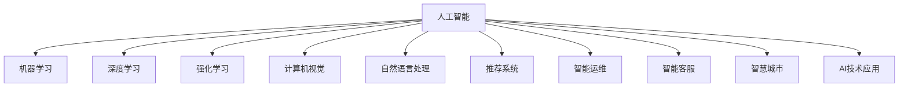

                 

# AI技术在商业中的应用前景

## 1. 背景介绍

### 1.1 问题由来

随着人工智能(AI)技术的迅猛发展，其商业应用场景越来越广泛，从金融、零售、医疗、制造到农业、教育等行业，AI都在发挥着越来越重要的作用。从最初的自动客服到智能推荐系统，再到智能运维、智慧城市，AI的商业应用已经从单一领域逐步渗透到多个垂直行业，并展现出巨大的市场潜力。

然而，尽管AI技术在商业领域的实际应用日益增多，但其发展仍面临诸多挑战。如何更好地理解AI技术的商业应用前景，如何构建AI驱动的商业解决方案，成为当前研究的热点和企业关注的焦点。本文将从核心概念、算法原理、实际应用场景等多个维度，深入探讨AI技术在商业中的应用前景。

### 1.2 问题核心关键点

AI技术在商业应用中的核心关键点包括以下几点：

1. **技术融合**：AI技术与现有业务流程、管理体系的深度融合，是商业应用成功的关键。

2. **数据驱动**：高质量的数据是AI技术的基础，AI的商业应用离不开数据的支持。

3. **业务场景匹配**：AI技术在不同行业的应用需要考虑特定的业务场景和需求。

4. **模型性能优化**：在商业环境中，模型的性能优化是实现商业目标的重要手段。

5. **业务效益评估**：AI技术的商业应用最终需要以提高业务效益、降低运营成本为目标。

6. **法律与伦理**：AI技术的商业应用需遵守相关法律法规，并确保道德伦理。

## 2. 核心概念与联系

### 2.1 核心概念概述

为更好地理解AI技术在商业应用中的前景，本文将介绍几个密切相关的核心概念：

- **人工智能(AI)**：利用计算机模拟人类智能过程，包括学习、推理、自然语言理解、图像识别等。

- **机器学习(ML)**：一种通过数据驱动模型训练，实现自动识别和决策的技术。

- **深度学习(Deep Learning, DL)**：一种基于多层神经网络的机器学习范式，用于处理复杂的非线性关系。

- **强化学习(RL)**：通过奖励机制指导模型行为，不断优化决策策略的机器学习技术。

- **计算机视觉(Computer Vision, CV)**：AI在图像处理、物体识别、视频分析等视觉任务中的应用。

- **自然语言处理(Natural Language Processing, NLP)**：AI在语音识别、文本处理、情感分析等语言任务中的应用。

- **推荐系统(Recommendation System, RS)**：通过用户行为和偏好，智能推荐商品或服务。

- **智能运维(Smart Operations)**：利用AI技术对企业的IT基础设施进行自动化管理和监控。

- **智能客服(Smart Customer Service)**：通过AI技术实现自动化客服和客户关系管理。

- **智慧城市(Smart City)**：利用AI技术优化城市管理和公共服务。

这些核心概念之间的逻辑关系可以通过以下Mermaid流程图来展示：



这个流程图展示了大AI技术的核心概念及其之间的关系：

1. AI技术通过多个子领域，如机器学习、深度学习、强化学习等，实现自动化的数据处理、模式识别和决策。
2. 计算机视觉和自然语言处理是AI技术的重要应用领域，分别用于图像和语言数据的理解和生成。
3. 推荐系统和智能运维是AI技术在商业领域的重要应用，通过提升用户体验和降低运营成本，实现商业目标。
4. 智能客服和智慧城市则是AI技术在具体业务场景中的应用，提升服务效率和城市管理水平。
5. AI技术的各个子领域相互协同，共同构建起一个完整的AI技术生态系统。

这些概念共同构成了AI技术的商业应用框架，使其能够在各个行业中发挥强大的智能驱动作用。通过理解这些核心概念，我们可以更好地把握AI技术的发展趋势和应用方向。

## 3. 核心算法原理 & 具体操作步骤
### 3.1 算法原理概述

AI技术在商业应用中的核心算法原理主要包括机器学习、深度学习和强化学习等。本文将重点介绍这些算法的原理和在商业中的应用。

**机器学习(ML)**：通过训练模型，使其能够从历史数据中学习规律，并应用于新数据预测。

**深度学习(DL)**：基于多层神经网络，通过反向传播算法优化模型参数，实现对复杂非线性关系的建模。

**强化学习(RL)**：通过奖励机制，不断调整模型行为，优化决策策略，适用于需要动态优化的问题。

### 3.2 算法步骤详解

AI技术在商业应用中通常包括以下几个关键步骤：

**Step 1: 数据准备**

1. 收集商业领域的业务数据，如销售数据、客户数据、服务数据等。

2. 清洗和处理数据，包括去重、补全、转换数据格式等。

3. 划分数据集，分为训练集、验证集和测试集，以保证模型的泛化性能。

**Step 2: 模型选择与设计**

1. 根据业务需求和数据特点选择合适的模型，如线性回归、决策树、神经网络等。

2. 设计模型的输入输出，确定模型参数和结构。

3. 设计评估指标，如准确率、召回率、F1值等，以评估模型性能。

**Step 3: 模型训练与优化**

1. 使用训练集对模型进行训练，通过迭代优化算法不断调整模型参数。

2. 在验证集上进行模型调参，选择最优的模型参数组合。

3. 在测试集上评估模型性能，确保模型泛化良好。

**Step 4: 模型部署与监控**

1. 将训练好的模型部署到商业应用中，如网站、APP、服务端等。

2. 监控模型运行状态，收集反馈数据，不断优化模型性能。

3. 定期更新模型，以适应业务数据的变化。

### 3.3 算法优缺点

AI技术在商业应用中的优缺点如下：

**优点：**

1. **自动化决策**：通过机器学习模型，实现自动化决策，减少人为干预。

2. **数据驱动**：基于数据驱动的模型训练，能够提高决策的客观性和准确性。

3. **实时响应**：AI技术可以实现实时数据处理和响应，提升服务效率。

4. **可扩展性强**：AI模型具有较强的可扩展性，能够应对复杂和动态的业务需求。

5. **提高业务效益**：AI技术可以提升业务效率，降低运营成本，提高企业竞争力。

**缺点：**

1. **数据依赖**：AI模型的训练和应用依赖于高质量的数据，数据获取成本高。

2. **模型复杂性**：复杂的模型训练和优化需要大量计算资源和经验。

3. **模型解释性差**：部分AI模型如深度学习模型，其内部工作机制难以解释，缺乏透明性。

4. **技术门槛高**：需要具备一定的AI技术知识和经验，才能进行模型构建和优化。

5. **法律与伦理**：AI技术的应用需遵守相关法律法规，并确保数据隐私和伦理。

### 3.4 算法应用领域

AI技术在商业中的应用领域非常广泛，包括但不限于以下几个方面：

1. **金融行业**：利用AI进行风险评估、欺诈检测、信用评分、投资分析等。

2. **零售行业**：利用AI进行销售预测、库存管理、个性化推荐、客户细分等。

3. **医疗行业**：利用AI进行疾病诊断、患者预测、药物研发、医疗影像分析等。

4. **制造行业**：利用AI进行设备预测维护、质量控制、供应链优化、自动化生产等。

5. **物流行业**：利用AI进行路径规划、运输调度、库存管理、物流成本优化等。

6. **人力资源管理**：利用AI进行员工招聘、绩效评估、员工福利管理等。

7. **智慧城市**：利用AI进行城市管理、智能交通、公共安全、环境监测等。

这些应用领域涵盖了金融、零售、医疗、制造等多个行业，展示了AI技术在商业中的巨大潜力和广泛应用前景。

## 4. 数学模型和公式 & 详细讲解 & 举例说明
### 4.1 数学模型构建

本文将以机器学习模型为例，展示其数学模型构建和应用。

假设我们需要构建一个线性回归模型，用于预测销售量。设模型为 $y = \theta_0 + \theta_1 x_1 + \theta_2 x_2 + \ldots + \theta_n x_n$，其中 $y$ 为销售量，$x_i$ 为第 $i$ 个特征，$\theta_i$ 为第 $i$ 个特征的系数。

模型训练的目标是找到最优参数 $\theta_i$，使得预测值与实际值之间的误差最小化。假设训练数据集为 $D = \{(x_i, y_i)\}_{i=1}^N$，则均方误差(MSE)损失函数为：

$$
L(\theta) = \frac{1}{N}\sum_{i=1}^N (y_i - \theta_0 - \sum_{j=1}^n \theta_j x_{ij})^2
$$

其中 $x_{ij}$ 表示第 $i$ 个样本的第 $j$ 个特征值。

### 4.2 公式推导过程

通过梯度下降等优化算法，求解最优参数 $\theta_i$，使得损失函数最小化。假设学习率为 $\eta$，则参数更新的公式为：

$$
\theta_i \leftarrow \theta_i - \eta \frac{\partial L(\theta)}{\partial \theta_i}
$$

其中 $\frac{\partial L(\theta)}{\partial \theta_i}$ 为损失函数对参数 $\theta_i$ 的梯度，可通过链式法则求导得到：

$$
\frac{\partial L(\theta)}{\partial \theta_i} = -\frac{2}{N}\sum_{i=1}^N (y_i - \theta_0 - \sum_{j=1}^n \theta_j x_{ij})
$$

在得到损失函数的梯度后，即可带入参数更新公式，完成模型的迭代优化。重复上述过程直至收敛，最终得到适应商业场景的最优模型参数 $\theta^*$。

### 4.3 案例分析与讲解

以智能推荐系统为例，利用协同过滤算法进行推荐。设推荐系统中有 $N$ 个用户和 $M$ 个商品，每个用户 $u_i$ 对商品 $m_j$ 的评分 $r_{ij}$ 组成评分矩阵 $R$。

假设我们需要为用户 $u_i$ 推荐商品 $m_j$，模型为 $p_{ij} = \theta_0 + \sum_{k=1}^K \theta_k \sum_{l=1}^L r_{lk} x_{ikl}$，其中 $x_{ikl}$ 表示用户 $u_i$ 在商品 $m_l$ 上的评分，$K$ 为特征维度，$L$ 为用户在商品上的评分维度。

模型训练的目标是找到最优参数 $\theta_i$，使得预测评分与实际评分之间的误差最小化。假设训练数据集为 $D = \{(u_i, m_j, r_{ij})\}_{i=1}^N$，则均方误差(MSE)损失函数为：

$$
L(\theta) = \frac{1}{N}\sum_{i=1}^N (r_{ij} - \theta_0 - \sum_{k=1}^K \theta_k \sum_{l=1}^L r_{lk} x_{ikl})^2
$$

通过梯度下降等优化算法，求解最优参数 $\theta_i$，使得损失函数最小化。假设学习率为 $\eta$，则参数更新的公式为：

$$
\theta_i \leftarrow \theta_i - \eta \frac{\partial L(\theta)}{\partial \theta_i}
$$

其中 $\frac{\partial L(\theta)}{\partial \theta_i}$ 为损失函数对参数 $\theta_i$ 的梯度，可通过链式法则求导得到：

$$
\frac{\partial L(\theta)}{\partial \theta_i} = -\frac{2}{N}\sum_{i=1}^N (r_{ij} - \theta_0 - \sum_{k=1}^K \theta_k \sum_{l=1}^L r_{lk} x_{ikl})
$$

在得到损失函数的梯度后，即可带入参数更新公式，完成模型的迭代优化。重复上述过程直至收敛，最终得到适应商业场景的最优模型参数 $\theta^*$。

## 5. 项目实践：代码实例和详细解释说明
### 5.1 开发环境搭建

在进行商业应用开发前，我们需要准备好开发环境。以下是使用Python进行Scikit-Learn开发的环境配置流程：

1. 安装Anaconda：从官网下载并安装Anaconda，用于创建独立的Python环境。

2. 创建并激活虚拟环境：
```bash
conda create -n sklearn-env python=3.8 
conda activate sklearn-env
```

3. 安装Scikit-Learn：
```bash
pip install scikit-learn
```

4. 安装各类工具包：
```bash
pip install numpy pandas scikit-learn matplotlib tqdm jupyter notebook ipython
```

完成上述步骤后，即可在`sklearn-env`环境中开始商业应用开发。

### 5.2 源代码详细实现

下面我们以销售预测模型为例，给出使用Scikit-Learn对线性回归模型进行训练和预测的Python代码实现。

首先，定义数据处理函数：

```python
import numpy as np
import pandas as pd
from sklearn.model_selection import train_test_split
from sklearn.linear_model import LinearRegression

def load_data(file_path):
    data = pd.read_csv(file_path)
    X = data.drop('sales', axis=1)
    y = data['sales']
    return X, y

def train_model(X_train, y_train, X_test, y_test):
    model = LinearRegression()
    model.fit(X_train, y_train)
    preds = model.predict(X_test)
    print('R^2:', model.score(X_test, y_test))
    print('RMSE:', np.sqrt(np.mean((y_test - preds)**2)))
    return model
```

然后，定义数据集并训练模型：

```python
X, y = load_data('sales_data.csv')
X_train, X_test, y_train, y_test = train_test_split(X, y, test_size=0.2, random_state=42)

model = train_model(X_train, y_train, X_test, y_test)
```

最后，在测试集上进行模型评估：

```python
print('R^2:', model.score(X_test, y_test))
print('RMSE:', np.sqrt(np.mean((y_test - model.predict(X_test))**2)))
```

以上就是使用Scikit-Learn对线性回归模型进行销售预测的完整代码实现。可以看到，Scikit-Learn的强大封装使得模型构建和训练过程非常简洁高效。

### 5.3 代码解读与分析

让我们再详细解读一下关键代码的实现细节：

**load_data函数**：
- `load_data`方法：读取CSV文件，将数据集分为特征和标签。

**train_model函数**：
- `train_model`方法：实例化线性回归模型，使用训练集数据进行模型训练，并在测试集上进行模型评估和预测。

**train_model函数的具体实现**：
- `LinearRegression`：Scikit-Learn提供的线性回归模型，方便用户进行模型训练和预测。
- `model.fit(X_train, y_train)`：使用训练集数据进行模型训练。
- `model.predict(X_test)`：在测试集上进行模型预测。
- `model.score(X_test, y_test)`：计算模型在测试集上的R^2系数。
- `np.sqrt(np.mean((y_test - preds)**2))`：计算模型在测试集上的均方误差。

**train_model函数的使用**：
- 通过调用`train_model`函数，我们实例化线性回归模型，并使用训练集数据进行模型训练。
- 在训练完成后，调用`score`方法和`predict`方法，计算模型在测试集上的R^2系数和均方误差。

通过上述代码，我们完成了线性回归模型在商业领域的实际应用，展示了AI技术在商业场景中的简单高效。

当然，商业应用的开发还需要考虑更多因素，如模型选择、数据预处理、模型优化等。但核心的算法流程基本与此类似。

## 6. 实际应用场景

### 6.1 智能推荐系统

智能推荐系统是AI技术在商业应用中的典型场景之一。推荐系统通过用户行为数据和商品信息，为每个用户推荐个性化的商品，提升用户体验和满意度，增加销售额。

在技术实现上，推荐系统通常采用协同过滤、矩阵分解等算法，对用户行为和商品信息进行建模，在模型训练和预测过程中实现推荐。以协同过滤算法为例，通过计算用户之间的相似度，推荐与目标用户兴趣相似的其他用户喜欢的商品，从而实现个性化推荐。

### 6.2 智能客服系统

智能客服系统通过AI技术实现自动化客户服务，减轻人工客服的工作负担，提升客户服务效率和质量。智能客服系统通常由自然语言处理、机器学习和情感分析等技术组成，能够理解和回答客户问题，进行订单处理、故障诊断等工作。

在实际应用中，智能客服系统通常采用监督学习、迁移学习等方法，对预训练语言模型进行微调，使其能够理解客户自然语言，并提供满意的回复。通过不断积累用户交互数据，智能客服系统可以不断优化模型，提高服务质量。

### 6.3 智能运维系统

智能运维系统利用AI技术对企业的IT基础设施进行自动化管理和监控，提升系统可靠性和效率。智能运维系统通常由设备监控、故障预测、自动化部署等模块组成，能够实时监测系统状态，预测设备故障，自动部署新服务，从而实现自动化运维。

在技术实现上，智能运维系统通常采用异常检测、预测模型、强化学习等技术，对设备运行数据进行建模和分析，在模型训练和预测过程中实现自动化运维。例如，利用异常检测算法对系统告警进行分类，预测设备故障，自动部署新服务，从而实现高效、可靠的自动化运维。

### 6.4 未来应用展望

随着AI技术的不断发展，其在商业应用中的前景将更加广阔。未来AI技术将在以下几个方面继续拓展其应用范围：

1. **自动化决策**：AI技术将在更多商业决策场景中发挥作用，如自动化交易、自动化风险管理等。

2. **个性化服务**：AI技术将进一步提升个性化服务的精准度和用户体验，如个性化推荐、智能客服等。

3. **实时分析**：AI技术将实现实时数据分析和处理，提升企业运营效率和决策速度。

4. **智能运维**：AI技术将提升IT基础设施的自动化管理水平，降低运维成本，提高系统可靠性。

5. **智慧城市**：AI技术将推动智慧城市建设，提升城市管理水平和公共服务质量。

6. **新业务模式**：AI技术将催生新的商业模式和业务场景，如无人零售、无人驾驶、智能制造等。

总之，未来AI技术将在商业应用中发挥越来越重要的作用，成为推动企业数字化转型的重要引擎。

## 7. 工具和资源推荐
### 7.1 学习资源推荐

为了帮助开发者系统掌握AI技术在商业应用的理论基础和实践技巧，这里推荐一些优质的学习资源：

1. **Coursera《Machine Learning by Stanford》课程**：斯坦福大学开设的机器学习课程，系统讲解了机器学习的基本概念和算法。

2. **Udacity《Deep Learning Nanodegree》课程**：Udacity的深度学习课程，详细介绍了深度学习模型的构建和优化。

3. **Kaggle数据科学竞赛平台**：Kaggle提供了大量真实数据集和机器学习竞赛，帮助开发者提升实战能力。

4. **PyTorch官方文档**：PyTorch的官方文档，提供了详细的API和示例代码，方便开发者使用。

5. **TensorFlow官方文档**：TensorFlow的官方文档，提供了丰富的API和示例代码，方便开发者使用。

通过学习这些资源，相信你一定能够快速掌握AI技术在商业应用的理论基础和实践技巧。

### 7.2 开发工具推荐

高效的开发离不开优秀的工具支持。以下是几款用于AI技术商业应用开发的常用工具：

1. **PyTorch**：基于Python的开源深度学习框架，灵活动态的计算图，适合快速迭代研究。

2. **TensorFlow**：由Google主导开发的开源深度学习框架，生产部署方便，适合大规模工程应用。

3. **Scikit-Learn**：Python机器学习库，提供了丰富的机器学习算法和工具，方便开发者使用。

4. **Jupyter Notebook**：用于编写、执行和分享机器学习代码的在线编辑器，支持实时可视化展示。

5. **Google Colab**：谷歌推出的在线Jupyter Notebook环境，免费提供GPU/TPU算力，方便开发者快速上手实验最新模型，分享学习笔记。

6. **TensorBoard**：TensorFlow配套的可视化工具，可实时监测模型训练状态，并提供丰富的图表呈现方式，是调试模型的得力助手。

合理利用这些工具，可以显著提升AI技术在商业应用的开发效率，加快创新迭代的步伐。

### 7.3 相关论文推荐

AI技术在商业应用中的发展离不开学界的持续研究。以下是几篇奠基性的相关论文，推荐阅读：

1. **《TensorFlow: A System for Large-Scale Machine Learning》**：Google论文，介绍了TensorFlow的架构和实现，是深度学习框架的代表之作。

2. **《Deep Learning》**：Ian Goodfellow的深度学习书籍，全面介绍了深度学习的原理和实践。

3. **《A Survey on Deep Learning-Based Recommender Systems》**：系统综述了基于深度学习的推荐系统，展示了其在商业应用中的广泛应用。

4. **《Deep Reinforcement Learning for Large-Scale Atari Games》**：OpenAI论文，展示了深度强化学习在智能游戏中的应用。

5. **《Adversarial Robustness in Deep Learning》**：探讨了深度学习模型的鲁棒性问题，提出了对抗训练等方法。

这些论文代表了大AI技术在商业应用中的发展脉络。通过学习这些前沿成果，可以帮助研究者把握学科前进方向，激发更多的创新灵感。

## 8. 总结：未来发展趋势与挑战

### 8.1 总结

本文对AI技术在商业应用中的前景进行了全面系统的介绍。首先，阐述了AI技术在商业领域的应用背景和重要意义，明确了其在提升业务效率、降低运营成本、优化用户体验等方面的价值。其次，从核心概念、算法原理、实际应用等多个维度，详细讲解了AI技术在商业应用中的理论基础和实践技巧。最后，对AI技术在商业应用中的未来发展趋势和面临的挑战进行了探讨，为未来研究提供了方向。

通过本文的系统梳理，可以看到，AI技术在商业应用中已经取得了显著进展，但仍有许多挑战需要克服。未来，伴随AI技术的不断进步，其在商业领域的应用将更加广泛，有望成为推动企业数字化转型的重要力量。

### 8.2 未来发展趋势

展望未来，AI技术在商业应用中的发展趋势将主要体现在以下几个方面：

1. **自动化决策**：AI技术将在更多商业决策场景中发挥作用，如自动化交易、自动化风险管理等。

2. **个性化服务**：AI技术将进一步提升个性化服务的精准度和用户体验，如个性化推荐、智能客服等。

3. **实时分析**：AI技术将实现实时数据分析和处理，提升企业运营效率和决策速度。

4. **智能运维**：AI技术将提升IT基础设施的自动化管理水平，降低运维成本，提高系统可靠性。

5. **智慧城市**：AI技术将推动智慧城市建设，提升城市管理水平和公共服务质量。

6. **新业务模式**：AI技术将催生新的商业模式和业务场景，如无人零售、无人驾驶、智能制造等。

以上趋势凸显了AI技术在商业领域的应用前景，将推动企业向更加智能化、自动化、高效化的方向发展。

### 8.3 面临的挑战

尽管AI技术在商业应用中已经取得了显著进展，但在迈向更加智能化、普适化应用的过程中，仍面临诸多挑战：

1. **技术门槛高**：AI技术的应用需要具备一定的技术知识和经验，对技术门槛的降低仍需持续努力。

2. **数据隐私和安全**：AI技术的应用需关注数据隐私和安全问题，确保数据的合法使用和保护。

3. **模型鲁棒性**：AI模型在实际应用中需具备较高的鲁棒性和泛化能力，避免因数据偏差导致的模型失效。

4. **伦理和道德**：AI技术的应用需遵守相关法律法规，并确保算法的公平、透明和可解释性。

5. **算力资源**：AI技术的应用需投入大量算力资源，如GPU/TPU等，成本较高。

6. **模型解释性**：AI模型在商业应用中需具备较好的解释性，方便用户理解和信任。

7. **系统集成**：AI技术的应用需与现有业务系统进行有效集成，确保业务流程的顺畅和稳定。

### 8.4 研究展望

面对AI技术在商业应用中面临的挑战，未来的研究需要在以下几个方面寻求新的突破：

1. **可解释性**：通过引入可解释性算法，如LIME、SHAP等，提升AI模型的透明性和可解释性。

2. **自监督学习**：通过自监督学习，降低对标注数据的依赖，提升数据处理效率和模型鲁棒性。

3. **联邦学习**：通过联邦学习，实现数据在本地处理，保护用户隐私，提升数据安全。

4. **强化学习**：通过强化学习，提升AI模型的适应能力和决策能力，实现智能运维等场景下的自动化决策。

5. **知识图谱**：通过引入知识图谱，提升AI模型的认知能力和推理能力，实现智能客服、智能推荐等场景下的高效应用。

6. **混合模型**：通过混合模型，结合符号计算和深度学习，提升AI模型的泛化能力和适用性。

这些研究方向的探索，将推动AI技术在商业应用中的进一步发展，提升企业的智能化水平和业务效益。

## 9. 附录：常见问题与解答

**Q1：AI技术在商业应用中是否具有广泛适用性？**

A: AI技术在商业应用中具有广泛适用性。不同行业的业务需求和数据特点有所不同，AI技术可以根据具体需求进行调整和优化，实现高效、精准的商业解决方案。

**Q2：AI技术在商业应用中需要注意哪些风险？**

A: AI技术在商业应用中需注意以下风险：

1. 数据隐私和安全：AI技术的应用需关注数据隐私和安全问题，确保数据的合法使用和保护。

2. 模型鲁棒性：AI模型在实际应用中需具备较高的鲁棒性和泛化能力，避免因数据偏差导致的模型失效。

3. 伦理和道德：AI技术的应用需遵守相关法律法规，并确保算法的公平、透明和可解释性。

**Q3：AI技术在商业应用中如何进行数据处理？**

A: AI技术在商业应用中进行数据处理主要包括以下步骤：

1. 数据收集：从多个数据源收集数据，包括历史数据、实时数据、用户行为数据等。

2. 数据清洗：去除重复数据、缺失数据、异常数据，保证数据质量。

3. 数据转换：将原始数据转换为机器学习模型所需的格式，如特征提取、归一化等。

4. 数据标注：对数据进行标注，为机器学习模型提供训练样本。

5. 数据划分：将数据集划分为训练集、验证集和测试集，保证模型的泛化能力。

6. 数据增强：通过数据增强技术，如数据扩充、合成数据等，提升模型的鲁棒性和泛化能力。

**Q4：AI技术在商业应用中如何进行模型训练？**

A: AI技术在商业应用中进行模型训练主要包括以下步骤：

1. 模型选择：根据具体业务需求和数据特点选择合适的模型，如线性回归、决策树、神经网络等。

2. 模型设计：设计模型的输入输出，确定模型参数和结构。

3. 模型训练：使用训练集数据进行模型训练，通过迭代优化算法不断调整模型参数。

4. 模型评估：在验证集上对模型进行评估，选择最优的模型参数组合。

5. 模型优化：通过超参数调整、正则化等方法对模型进行优化，提升模型性能。

6. 模型部署：将训练好的模型部署到商业应用中，进行实时预测和决策。

**Q5：AI技术在商业应用中如何进行持续学习和优化？**

A: AI技术在商业应用中进行持续学习和优化主要包括以下步骤：

1. 数据持续收集：不断收集新的数据，更新模型训练样本。

2. 模型定期更新：根据新数据和业务需求，定期更新模型，提升模型性能。

3. 模型评估和调优：在持续学习过程中，不断评估模型性能，调整模型参数和结构。

4. 模型监控和反馈：实时监控模型运行状态，收集反馈数据，优化模型性能。

通过上述步骤，可以确保AI技术在商业应用中保持高效、精准和智能。

---

作者：禅与计算机程序设计艺术 / Zen and the Art of Computer Programming

