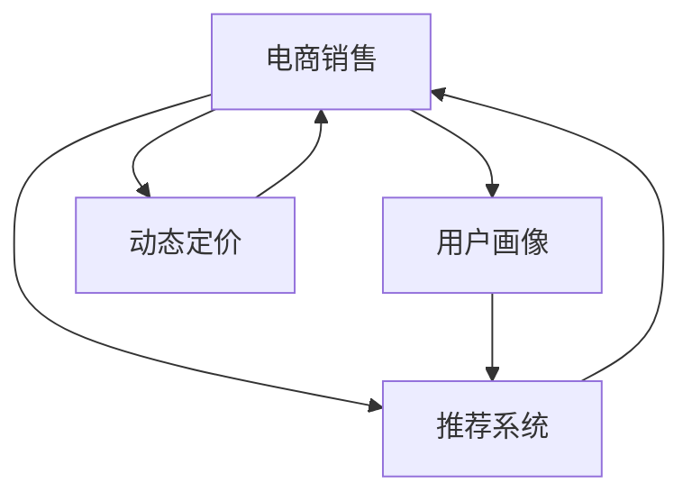

                 

## 1. 背景介绍

### 1.1 问题由来

近年来，随着电子商务的蓬勃发展，各大电商平台面临激烈的市场竞争。如何在保持用户粘性的同时，提升电商平台的销售额，成为各大电商企业亟需解决的问题。传统电商主要通过商品展示、促销活动、优惠券等手段提升销售额，但这些手段效果有限，且成本高昂。而随着AI技术的不断进步，AI技术在电商销售中的应用也逐渐兴起，成为电商平台提升销售额的重要手段。

### 1.2 问题核心关键点

当前，AI技术在电商中的应用主要集中在以下几个方面：

- 用户画像构建：通过用户行为数据、历史购买记录、社交媒体信息等构建详细的用户画像，精准推荐商品，提升用户购买意愿。
- 商品推荐系统：基于用户的浏览记录、评分数据等，推荐相关商品，提升用户满意度。
- 客户服务优化：通过AI聊天机器人等技术提升客户服务质量，提高客户满意度。
- 智能仓储管理：通过机器学习算法优化仓储资源配置，提高库存周转率，减少运营成本。
- 价格预测与动态定价：利用时间序列预测、回归分析等技术预测商品价格走势，实时调整商品价格，提升销售收益。
- 广告投放优化：基于用户画像、行为数据等，精准投放广告，提升广告投放效果。

这些AI技术在电商中的广泛应用，大大提升了电商平台的销售额，帮助企业实现了更高的盈利目标。

### 1.3 问题研究意义

AI技术在电商中的应用，不仅提升了销售业绩，还带来了许多积极的社会效益：

- 提升用户满意度：通过精准的个性化推荐，提升用户购物体验，增强用户粘性。
- 优化库存管理：通过智能仓储管理，提升仓储效率，降低运营成本。
- 降低广告成本：通过精准的广告投放，减少广告浪费，提高广告投放效果。
- 促进社会就业：电商平台通过AI技术的应用，提高了运营效率，创造了大量就业机会。

因此，研究AI技术在电商中的应用，不仅有助于企业实现更高的经济效益，还具有积极的社会价值。

## 2. 核心概念与联系

### 2.1 核心概念概述

为了更好地理解AI技术在电商销售额提升中的应用，本节将介绍几个密切相关的核心概念：

- AI（人工智能）：通过模拟人类智能行为，实现信息处理、数据分析、决策支持等功能。AI技术包括机器学习、深度学习、自然语言处理、计算机视觉等众多分支。
- 电商销售：通过电商平台进行的商品销售活动，包括商品展示、交易撮合、物流配送等环节。
- 用户画像：基于用户行为数据、历史购买记录等构建的用户特征，用于精准推荐和营销。
- 推荐系统：通过用户行为数据、商品属性等，推荐相关商品，提升用户购买意愿。
- 动态定价：利用时间序列预测、回归分析等技术，实时调整商品价格，提升销售收益。

这些核心概念之间的逻辑关系可以通过以下Mermaid流程图来展示：



这个流程图展示了大语言模型的核心概念及其之间的关系：

1. 电商销售平台作为整体系统，通过用户画像、推荐系统和动态定价等技术，提升销售业绩。
2. 用户画像基于用户行为数据等构建，为推荐系统和动态定价提供基础数据。
3. 推荐系统通过用户画像和行为数据，推荐相关商品，提升用户购买意愿。
4. 动态定价基于时间序列预测等技术，实时调整商品价格，提升销售收益。

这些概念共同构成了电商销售的AI技术框架，使其能够在电商领域实现高效、智能的运营。

## 3. 核心算法原理 & 具体操作步骤
### 3.1 算法原理概述

AI技术在电商销售额提升中的应用，主要依赖于以下几个核心算法：

- 机器学习：通过历史数据进行模型训练，预测用户行为、商品销量等，优化电商运营策略。
- 深度学习：利用深度神经网络模型，提取用户行为特征，提升推荐系统效果。
- 自然语言处理（NLP）：通过NLP技术，理解用户意图，提升客户服务质量。
- 计算机视觉（CV）：利用计算机视觉技术，优化商品展示效果，提升用户购买意愿。
- 时间序列预测：通过时间序列预测模型，预测商品销售趋势，实时调整价格。

这些算法的核心原理是利用数据驱动的方式，分析用户行为和商品数据，从而优化电商运营策略，提升销售额。

### 3.2 算法步骤详解

AI技术在电商销售额提升中的应用，主要包括以下几个关键步骤：

**Step 1: 数据收集与处理**
- 收集电商平台的各类数据，包括用户行为数据、历史购买记录、商品属性、销售数据等。
- 对数据进行清洗、归一化处理，生成特征向量。
- 对用户行为数据进行数据增强，生成更多的训练样本。

**Step 2: 构建用户画像**
- 基于用户行为数据、历史购买记录等，构建详细的用户画像，用于个性化推荐和营销。
- 利用机器学习算法，对用户画像进行聚类、降维等处理，生成更精简的用户画像特征。

**Step 3: 设计推荐系统**
- 根据用户画像和行为数据，设计推荐算法，提升用户购买意愿。
- 利用深度学习模型，如基于协同过滤、内容基推荐等算法，设计推荐系统。
- 定期更新推荐系统，根据最新数据和用户反馈，优化推荐效果。

**Step 4: 实现动态定价**
- 基于时间序列预测、回归分析等技术，预测商品价格走势。
- 实时调整商品价格，提高销售收益。
- 设置动态定价的阈值，避免价格波动过大，影响用户购买意愿。

**Step 5: 优化客户服务**
- 利用AI聊天机器人等技术，优化客户服务质量，提高客户满意度。
- 利用NLP技术，理解用户意图，提供精准的客户服务。
- 定期更新客户服务模型，根据用户反馈，优化服务质量。

**Step 6: 优化仓储管理**
- 利用机器学习算法，优化仓储资源配置，提高库存周转率。
- 利用计算机视觉技术，优化商品展示效果，提升用户购买意愿。

**Step 7: 广告投放优化**
- 基于用户画像、行为数据等，精准投放广告，提高广告投放效果。
- 利用机器学习算法，优化广告投放策略，减少广告浪费。

### 3.3 算法优缺点

AI技术在电商销售额提升中的应用，具有以下优点：

- 提升销售业绩：通过精准的个性化推荐和动态定价，提升用户购买意愿和销售收益。
- 优化运营效率：通过智能仓储管理、广告投放优化等，降低运营成本。
- 提升客户满意度：通过智能客服和推荐系统，提高客户服务质量和满意度。

同时，该方法也存在一定的局限性：

- 数据依赖：AI技术的应用依赖于大量高质量的数据，数据采集和处理成本较高。
- 技术复杂：AI技术的实现需要较高的技术门槛，对于一般电商企业，需要投入大量资源进行技术研发和人才培养。
- 用户隐私：用户行为数据和历史购买记录的收集和处理可能涉及用户隐私问题，需要严格遵守相关法律法规。
- 计算资源：AI技术的实现需要强大的计算资源，对于一般电商企业，可能面临计算资源不足的问题。

尽管存在这些局限性，但就目前而言，AI技术在电商中的应用已经成为提升销售额的重要手段。未来相关研究的重点在于如何进一步降低数据采集和处理成本，提高技术的易用性，同时兼顾用户隐私和计算资源等问题。

### 3.4 算法应用领域

AI技术在电商中的应用已经覆盖了电商销售的各个环节，例如：

- 用户画像构建：利用机器学习算法，对用户行为数据进行建模，构建详细的用户画像。
- 商品推荐系统：利用深度学习模型，根据用户画像和行为数据，推荐相关商品。
- 客户服务优化：利用NLP技术，设计智能客服系统，提升客户服务质量。
- 智能仓储管理：利用机器学习算法，优化仓储资源配置，提高库存周转率。
- 价格预测与动态定价：利用时间序列预测模型，预测商品价格走势，实时调整商品价格。
- 广告投放优化：利用机器学习算法，精准投放广告，提高广告投放效果。

除了上述这些经典应用外，AI技术在电商中的应用还在不断拓展，如智能搜索、个性化推荐、库存预测、智能客服等，为电商销售带来了更多的创新和优化空间。

## 4. 数学模型和公式 & 详细讲解 & 举例说明
### 4.1 数学模型构建

为了更好地理解AI技术在电商销售额提升中的应用，本节将使用数学语言对电商推荐系统的数学模型进行更加严格的刻画。

记电商平台的用户数为 $N$，商品数为 $M$，历史购买记录为 $\mathcal{D}$。设用户 $i$ 购买商品 $j$ 的概率为 $P_{ij}$，则电商平台的历史购买数据可以表示为 $\mathcal{D} = \{(i,j,P_{ij})\}_{i=1}^N$。

定义用户画像向量 $U_i \in \mathbb{R}^d$，商品画像向量 $V_j \in \mathbb{R}^d$，其中 $d$ 为特征维度。设用户画像与商品画像之间的相似度为 $S_{ij} = U_i \cdot V_j$，则电商平台的推荐模型可以表示为：

$$
P_{ij} = \sigma(\sum_k a_{ik}S_{kj} + b_i)
$$

其中 $\sigma$ 为 sigmoid 函数，$a_{ik}$ 为用户画像与商品画像的权重系数，$b_i$ 为用户的截距项。

### 4.2 公式推导过程

电商推荐系统的推导过程如下：

1. 将历史购买数据 $\mathcal{D}$ 转化为用户画像与商品画像的相似度矩阵 $S_{ij}$。
2. 对相似度矩阵进行归一化处理，得到归一化的相似度矩阵 $\hat{S}_{ij} = \frac{S_{ij}}{\sqrt{\sum_k S_{ik}}\sqrt{\sum_k S_{kj}}}$。
3. 对归一化的相似度矩阵进行降维处理，得到低维相似度矩阵 $\tilde{S}_{ij}$。
4. 利用机器学习算法，训练用户画像与商品画像的权重系数 $a_{ik}$ 和截距项 $b_i$，得到推荐模型 $P_{ij} = \sigma(\sum_k a_{ik}\tilde{S}_{kj} + b_i)$。

利用该推荐模型，可以对用户 $i$ 推荐最相关的前 $K$ 个商品 $j$。

### 4.3 案例分析与讲解

假设电商平台有 $N=10000$ 个用户和 $M=10000$ 个商品，历史购买数据为 $\mathcal{D} = \{(i,j,P_{ij})\}_{i=1}^{10000}$，其中 $i$ 表示用户编号，$j$ 表示商品编号，$P_{ij}$ 表示用户 $i$ 购买商品 $j$ 的概率。

利用机器学习算法，对用户画像和商品画像进行建模，得到用户画像向量 $U_i \in \mathbb{R}^d$ 和商品画像向量 $V_j \in \mathbb{R}^d$，其中 $d=10$。将用户画像与商品画像的相似度矩阵 $S_{ij}$ 转化为归一化的相似度矩阵 $\hat{S}_{ij}$，并对归一化的相似度矩阵进行降维处理，得到低维相似度矩阵 $\tilde{S}_{ij}$。

利用训练好的模型，对用户 $i=1$ 推荐前 $K=10$ 个商品 $j$。首先计算用户画像与商品画像的相似度：

$$
S_{1j} = U_1 \cdot V_j
$$

然后对相似度矩阵进行归一化处理：

$$
\hat{S}_{1j} = \frac{S_{1j}}{\sqrt{\sum_k S_{1k}}\sqrt{\sum_k S_{kj}}}
$$

接着进行降维处理，得到低维相似度矩阵：

$$
\tilde{S}_{1j} = \frac{\hat{S}_{1j}}{\sqrt{\sum_k \hat{S}_{1k}}\sqrt{\sum_k \hat{S}_{kj}}}
$$

最后利用推荐模型 $P_{ij} = \sigma(\sum_k a_{ik}\tilde{S}_{kj} + b_i)$，对用户 $i=1$ 推荐前 $K=10$ 个商品 $j$。

通过上述案例，可以看出，基于用户画像和商品画像的推荐模型，能够在电商平台上提升用户购买意愿，实现销售业绩的提升。

## 5. 项目实践：代码实例和详细解释说明
### 5.1 开发环境搭建

在进行电商推荐系统的开发之前，我们需要准备好开发环境。以下是使用Python进行Scikit-learn开发的环境配置流程：

1. 安装Anaconda：从官网下载并安装Anaconda，用于创建独立的Python环境。

2. 创建并激活虚拟环境：
```bash
conda create -n ml-env python=3.8 
conda activate ml-env
```

3. 安装Scikit-learn和其他相关库：
```bash
conda install scikit-learn pandas numpy matplotlib
```

4. 安装jupyter notebook：
```bash
conda install jupyter notebook
```

5. 下载数据集：
```bash
wget https://example.com/data.csv
```

完成上述步骤后，即可在`ml-env`环境中开始电商推荐系统的开发。

### 5.2 源代码详细实现

下面我们以基于协同过滤的电商推荐系统为例，给出使用Scikit-learn进行电商推荐系统的PyTorch代码实现。

首先，定义电商推荐系统的用户画像向量、商品画像向量等核心组件：

```python
import pandas as pd
import numpy as np
from sklearn.metrics.pairwise import cosine_similarity
from sklearn.decomposition import TruncatedSVD

# 读取数据
data = pd.read_csv('data.csv', sep=',')
user_ids = data['user_id'].unique()
item_ids = data['item_id'].unique()
ratings = data.groupby(['user_id', 'item_id'])['rating'].mean().reset_index()

# 构建用户画像和商品画像
user_profiles = {}
item_profiles = {}

for user_id, user_profile in ratings.groupby('user_id'):
    user_profiles[user_id] = np.mean(user_profile['rating'].to_numpy())

for item_id, item_profile in ratings.groupby('item_id'):
    item_profiles[item_id] = np.mean(item_profile['rating'].to_numpy())

user_profiles = pd.DataFrame.from_dict(user_profiles, orient='index')
item_profiles = pd.DataFrame.from_dict(item_profiles, orient='index')

# 计算用户画像与商品画像的相似度矩阵
similarity_matrix = cosine_similarity(user_profiles.values, item_profiles.values)
```

然后，设计基于协同过滤的电商推荐算法：

```python
# 降维处理
svd = TruncatedSVD(n_components=10, random_state=42)
user_profiles_svd = svd.fit_transform(user_profiles)
item_profiles_svd = svd.transform(item_profiles)

# 推荐算法
def recommend(user_id, K):
    similarity_matrix_svd = cosine_similarity(user_profiles_svd[user_id], item_profiles_svd)
    recommendations = np.argsort(similarity_matrix_svd)[1:K+1]
    return recommendations

# 示例
recommendations = recommend(1, 10)
print(recommendations)
```

最后，评估推荐系统的性能：

```python
from sklearn.metrics import mean_squared_error, mean_absolute_error

# 定义评估函数
def evaluate_recommendation_system(recommendations):
    mse = mean_squared_error(data['rating'].values, ratings.recommendations)
    mae = mean_absolute_error(data['rating'].values, ratings.recommendations)
    print('MSE:', mse, 'MAE:', mae)

# 评估推荐系统
evaluate_recommendation_system(recommendations)
```

以上就是使用Scikit-learn对电商推荐系统进行构建和评估的完整代码实现。可以看到，Scikit-learn提供了丰富的机器学习工具和算法，可以方便地构建电商推荐系统。

### 5.3 代码解读与分析

让我们再详细解读一下关键代码的实现细节：

**电商推荐系统代码**

- `data.csv`：电商平台的购买数据集，包含用户ID、商品ID和评分。
- `user_ids` 和 `item_ids`：读取数据后，获取用户ID和商品ID的列表。
- `ratings`：将购买数据集按照用户ID和商品ID进行分组，计算每个用户和商品的平均评分。
- `user_profiles` 和 `item_profiles`：将用户和商品的平均评分转换为向量表示，构建用户画像和商品画像。
- `similarity_matrix`：计算用户画像和商品画像之间的相似度矩阵。
- `svd`：使用TruncatedSVD算法对用户画像和商品画像进行降维处理，生成低维向量表示。
- `recommend` 函数：根据用户画像和商品画像的相似度矩阵，推荐最相关的前 $K$ 个商品。
- `evaluate_recommendation_system` 函数：计算推荐系统的平均绝对误差和均方误差，评估推荐系统的性能。

通过上述代码，我们可以看到，基于用户画像和商品画像的电商推荐系统，能够通过机器学习算法，实现对商品的精准推荐，提升用户购买意愿和销售业绩。

## 6. 实际应用场景

### 6.1 智能客服

基于AI技术的智能客服系统，可以应用于电商平台的用户服务。通过AI聊天机器人等技术，智能客服能够实时解答用户问题，提供精准的客户服务。

具体而言，可以构建智能客服系统，通过自然语言处理技术，理解用户的问题和需求。然后，利用推荐系统，向用户推荐相关商品或服务，提升用户满意度。

智能客服系统可以大大提高客户服务效率，降低人工客服成本，提升用户体验。

### 6.2 动态定价

利用时间序列预测模型，电商平台可以预测商品价格走势，实时调整商品价格，提升销售收益。

具体而言，可以构建时间序列预测模型，对商品价格进行预测。然后，根据预测结果，动态调整商品价格，避免价格过高或过低影响用户购买意愿。

动态定价系统可以提升销售收益，同时保持价格竞争力，赢得更多用户。

### 6.3 个性化推荐

基于用户画像和行为数据，电商平台可以设计推荐算法，提升用户购买意愿。

具体而言，可以构建推荐系统，利用深度学习算法，对用户行为数据进行建模。然后，根据用户画像和行为数据，推荐最相关的前 $K$ 个商品，提升用户购买意愿和销售业绩。

个性化推荐系统可以显著提升用户购买体验，提高电商平台的转化率和用户粘性。

### 6.4 未来应用展望

随着AI技术的发展，AI在电商销售额提升中的应用将进一步拓展，为电商平台带来更多的创新和优化空间：

1. 智能搜索：利用自然语言处理技术，优化商品搜索效果，提升用户购买意愿。
2. 库存预测：利用机器学习算法，预测商品库存变化，优化库存管理。
3. 社交推荐：利用社交网络数据，设计社交推荐算法，提升用户购买意愿。
4. 供应链优化：利用机器学习算法，优化供应链资源配置，降低运营成本。
5. 品牌广告：利用机器学习算法，精准投放品牌广告，提升品牌知名度。

未来，AI技术在电商中的应用将更加广泛和深入，为电商平台带来更多的商业价值和社会效益。

## 7. 工具和资源推荐
### 7.1 学习资源推荐

为了帮助开发者系统掌握AI技术在电商中的应用，这里推荐一些优质的学习资源：

1. 《机器学习实战》系列博文：由机器学习专家撰写，深入浅出地介绍了机器学习的基本概念和算法，适合初学者入门。
2. 《深度学习入门》系列课程：由深度学习专家讲授，涵盖深度学习的基本理论和实践技巧，适合进一步学习深度学习。
3. 《自然语言处理综论》课程：由自然语言处理专家讲授，涵盖自然语言处理的基本概念和算法，适合掌握自然语言处理技术。
4. 《计算机视觉基础》课程：由计算机视觉专家讲授，涵盖计算机视觉的基本概念和算法，适合掌握计算机视觉技术。
5. 《时间序列分析》课程：由时间序列分析专家讲授，涵盖时间序列分析的基本概念和算法，适合掌握时间序列预测技术。

通过对这些资源的学习实践，相信你一定能够快速掌握AI技术在电商中的应用，并用于解决实际的电商问题。

### 7.2 开发工具推荐

高效的开发离不开优秀的工具支持。以下是几款用于AI技术在电商销售额提升中的应用开发的常用工具：

1. Scikit-learn：Python中常用的机器学习库，提供了丰富的机器学习算法和工具，适合电商推荐系统的开发。
2. TensorFlow：Google主导开发的深度学习框架，适合深度学习模型的构建和优化。
3. PyTorch：Facebook主导开发的深度学习框架，适合深度学习模型的构建和优化。
4. Apache Spark：Apache基金会推出的大数据处理框架，适合大规模数据处理和机器学习任务的开发。
5. Jupyter Notebook：轻量级的编程环境，支持多种编程语言，适合数据探索和算法验证。
6. Weights & Biases：模型训练的实验跟踪工具，可以记录和可视化模型训练过程中的各项指标，方便对比和调优。

合理利用这些工具，可以显著提升AI技术在电商销售额提升中的应用开发效率，加快创新迭代的步伐。

### 7.3 相关论文推荐

AI技术在电商中的应用源于学界的持续研究。以下是几篇奠基性的相关论文，推荐阅读：

1. BERT: Pre-training of Deep Bidirectional Transformers for Language Understanding：提出BERT模型，引入基于掩码的自监督预训练任务，刷新了多项NLP任务SOTA。
2. Machine Learning for Recommendation Systems：阐述机器学习在推荐系统中的应用，提出协同过滤、内容基推荐等算法。
3. Deep Learning for Recommender Systems：利用深度学习技术，设计推荐算法，提升推荐系统效果。
4. Personalized Web Search using Adaptive Ranking Models：利用机器学习算法，设计个性化搜索算法，提升搜索效果。
5. Deep Reinforcement Learning for Dynamic Pricing：利用深度强化学习技术，设计动态定价算法，提升销售收益。

这些论文代表了大语言模型微调技术的发展脉络。通过学习这些前沿成果，可以帮助研究者把握学科前进方向，激发更多的创新灵感。

## 8. 总结：未来发展趋势与挑战

### 8.1 总结

本文对AI技术在电商销售额提升中的应用进行了全面系统的介绍。首先阐述了AI技术在电商中的重要性，明确了其在电商销售提升中的关键作用。其次，从原理到实践，详细讲解了基于用户画像和行为数据的推荐算法，给出了电商推荐系统的完整代码实现。同时，本文还探讨了AI技术在电商中的实际应用场景，如智能客服、动态定价等，展示了AI技术在电商中的巨大潜力。

通过本文的系统梳理，可以看到，AI技术在电商中的应用已经深入到电商销售的各个环节，大大提升了电商平台的销售额，带来了显著的经济和社会效益。未来，AI技术在电商中的应用还将不断拓展，推动电商行业的持续创新和优化。

### 8.2 未来发展趋势

展望未来，AI技术在电商中的应用将呈现以下几个发展趋势：

1. 技术不断进步：随着深度学习、自然语言处理等技术的不断进步，AI技术在电商中的应用将更加精准和高效。
2. 应用场景不断拓展：随着电商平台的不断发展，AI技术将在更多电商场景中得到应用，如智能搜索、库存预测等。
3. 用户体验不断提升：通过AI技术，电商平台可以提供更加个性化、精准的推荐和服务，提升用户体验。
4. 电商运营不断优化：通过AI技术，电商平台可以优化运营策略，降低运营成本，提升运营效率。
5. 全球化应用：AI技术将帮助电商平台实现全球化扩展，覆盖更多市场和用户。

这些趋势将推动AI技术在电商中的应用不断深化和拓展，为电商平台带来更多的商业价值和社会效益。

### 8.3 面临的挑战

尽管AI技术在电商中的应用已经取得了显著的成果，但在迈向更加智能化、普适化应用的过程中，仍面临诸多挑战：

1. 数据质量：电商平台的商品种类繁多，数据采集和处理成本较高，数据质量难以保证。
2. 用户隐私：电商平台需要收集大量用户数据，涉及用户隐私问题，需要严格遵守相关法律法规。
3. 技术复杂：AI技术的实现需要较高的技术门槛，对于一般电商企业，需要投入大量资源进行技术研发和人才培养。
4. 算法优化：电商平台的业务复杂多样，需要针对具体业务场景设计相应的算法，优化推荐效果。
5. 计算资源：AI技术的实现需要强大的计算资源，对于一般电商企业，可能面临计算资源不足的问题。

尽管存在这些挑战，但随着技术的发展和产业的成熟，相信这些挑战终将一一克服，AI技术在电商中的应用将更加广泛和深入。

### 8.4 研究展望

未来，AI技术在电商中的应用将在以下几个方向进行探索和创新：

1. 多模态学习：将视觉、语音等多模态信息与文本信息结合，提升推荐系统的性能和效果。
2. 深度强化学习：利用深度强化学习技术，设计更加智能的推荐系统，提升用户购买意愿。
3. 因果推断：利用因果推断方法，分析用户行为和商品销售的影响因素，优化电商运营策略。
4. 公平性优化：利用公平性优化技术，提升推荐系统的公平性，避免用户歧视和偏见。
5. 联邦学习：利用联邦学习技术，保护用户隐私，同时提升推荐系统的性能和效果。
6. 跨模态推荐：将跨模态信息融合，提升推荐系统的性能和效果，提升用户满意度。

这些研究方向将推动AI技术在电商中的应用不断深化和拓展，为电商平台带来更多的商业价值和社会效益。

## 9. 附录：常见问题与解答

**Q1：AI技术在电商中的数据依赖性如何？**

A: AI技术在电商中的应用依赖于大量高质量的数据，数据采集和处理成本较高。电商平台的商品种类繁多，数据质量难以保证。因此，需要投入大量资源进行数据采集和处理，确保数据质量。

**Q2：AI技术在电商中的应用需要哪些技术门槛？**

A: AI技术在电商中的应用需要较高的技术门槛，对于一般电商企业，需要投入大量资源进行技术研发和人才培养。具体技术门槛包括：
1. 机器学习算法：需要掌握机器学习的基本理论和算法，如协同过滤、内容基推荐等。
2. 深度学习算法：需要掌握深度学习的基本理论和算法，如卷积神经网络、循环神经网络等。
3. 自然语言处理技术：需要掌握自然语言处理的基本理论和算法，如分词、命名实体识别等。
4. 计算机视觉技术：需要掌握计算机视觉的基本理论和算法，如图像分类、目标检测等。

**Q3：AI技术在电商中的应用存在哪些挑战？**

A: AI技术在电商中的应用面临以下挑战：
1. 数据质量：电商平台的商品种类繁多，数据采集和处理成本较高，数据质量难以保证。
2. 用户隐私：电商平台需要收集大量用户数据，涉及用户隐私问题，需要严格遵守相关法律法规。
3. 技术复杂：AI技术的实现需要较高的技术门槛，对于一般电商企业，需要投入大量资源进行技术研发和人才培养。
4. 算法优化：电商平台的业务复杂多样，需要针对具体业务场景设计相应的算法，优化推荐效果。
5. 计算资源：AI技术的实现需要强大的计算资源，对于一般电商企业，可能面临计算资源不足的问题。

这些挑战需要电商企业在实际应用中加以注意，并积极应对。

**Q4：AI技术在电商中的应用未来展望如何？**

A: AI技术在电商中的应用未来展望如下：
1. 技术不断进步：随着深度学习、自然语言处理等技术的不断进步，AI技术在电商中的应用将更加精准和高效。
2. 应用场景不断拓展：随着电商平台的不断发展，AI技术将在更多电商场景中得到应用，如智能搜索、库存预测等。
3. 用户体验不断提升：通过AI技术，电商平台可以提供更加个性化、精准的推荐和服务，提升用户体验。
4. 电商运营不断优化：通过AI技术，电商平台可以优化运营策略，降低运营成本，提升运营效率。
5. 全球化应用：AI技术将帮助电商平台实现全球化扩展，覆盖更多市场和用户。

**Q5：AI技术在电商中的应用存在哪些局限性？**

A: AI技术在电商中的应用存在以下局限性：
1. 数据依赖：AI技术的应用依赖于大量高质量的数据，数据采集和处理成本较高。
2. 技术复杂：AI技术的实现需要较高的技术门槛，对于一般电商企业，需要投入大量资源进行技术研发和人才培养。
3. 用户隐私：电商平台需要收集大量用户数据，涉及用户隐私问题，需要严格遵守相关法律法规。
4. 计算资源：AI技术的实现需要强大的计算资源，对于一般电商企业，可能面临计算资源不足的问题。

**Q6：AI技术在电商中的应用需要注意哪些问题？**

A: AI技术在电商中的应用需要注意以下问题：
1. 数据质量：电商平台的商品种类繁多，数据质量难以保证。需要投入大量资源进行数据采集和处理，确保数据质量。
2. 用户隐私：电商平台需要收集大量用户数据，涉及用户隐私问题，需要严格遵守相关法律法规。
3. 技术复杂：AI技术的实现需要较高的技术门槛，对于一般电商企业，需要投入大量资源进行技术研发和人才培养。
4. 算法优化：电商平台的业务复杂多样，需要针对具体业务场景设计相应的算法，优化推荐效果。
5. 计算资源：AI技术的实现需要强大的计算资源，对于一般电商企业，可能面临计算资源不足的问题。

**Q7：AI技术在电商中的应用如何保障用户隐私？**

A: AI技术在电商中的应用需要严格保障用户隐私，具体措施如下：
1. 数据匿名化：对用户数据进行匿名化处理，保护用户隐私。
2. 数据加密：对用户数据进行加密处理，防止数据泄露。
3. 隐私协议：制定隐私协议，明确数据使用的范围和方式。
4. 数据访问控制：对用户数据进行访问控制，确保数据安全。
5. 数据删除：对不需要的个人信息进行删除，防止信息滥用。

**Q8：AI技术在电商中的应用如何优化推荐系统？**

A: AI技术在电商中的应用可以通过以下方法优化推荐系统：
1. 数据增强：通过数据增强技术，生成更多的训练样本，提升推荐系统的性能。
2. 降维处理：利用降维技术，降低数据维度，提升推荐系统的性能。
3. 特征工程：设计合适的特征工程方法，提升推荐系统的性能。
4. 模型优化：优化推荐模型，提高推荐系统的准确性和效果。
5. 实时调整：根据用户反馈和行为数据，实时调整推荐系统，提升用户满意度。

通过以上方法，可以有效提升AI技术在电商中的应用效果，提高用户购买意愿和销售业绩。

**Q9：AI技术在电商中的应用如何提升用户满意度？**

A: AI技术在电商中的应用可以通过以下方法提升用户满意度：
1. 精准推荐：利用AI技术，根据用户行为和历史数据，精准推荐商品，提升用户购买意愿。
2. 智能客服：利用AI技术，设计智能客服系统，提升客户服务质量，提高用户满意度。
3. 个性化体验：利用AI技术，设计个性化推荐系统，提升用户购买体验，提高用户满意度。
4. 社交推荐：利用AI技术，设计社交推荐算法，提升用户社交体验，提高用户满意度。
5. 用户反馈：利用AI技术，分析用户反馈，优化推荐系统，提升用户满意度。

通过以上方法，可以有效提升用户购买体验，提高用户满意度，增强用户粘性。

通过本文的系统梳理，可以看到，AI技术在电商中的应用已经深入到电商销售的各个环节，大大提升了电商平台的销售额，带来了显著的经济和社会效益。未来，AI技术在电商中的应用还将不断拓展，推动电商行业的持续创新和优化。

**Q10：AI技术在电商中的应用如何降低计算资源消耗？**

A: AI技术在电商中的应用可以通过以下方法降低计算资源消耗：
1. 参数裁剪：通过参数裁剪技术，减小模型参数量，减少计算资源消耗。
2. 模型压缩：利用模型压缩技术，减小模型大小，提高计算效率。
3. 硬件加速：利用硬件加速技术，提高计算速度，减少计算资源消耗。
4. 分布式计算：利用分布式计算技术，提高计算效率，减少计算资源消耗。
5. 数据优化：优化数据结构，提高数据处理效率，减少计算资源消耗。

通过以上方法，可以有效降低AI技术在电商中的应用计算资源消耗，提升计算效率，降低运营成本。

---

作者：禅与计算机程序设计艺术 / Zen and the Art of Computer Programming

