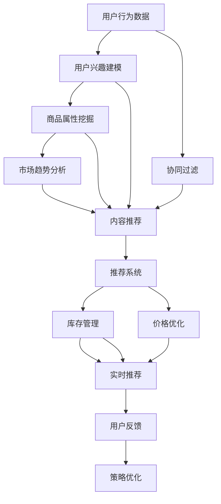
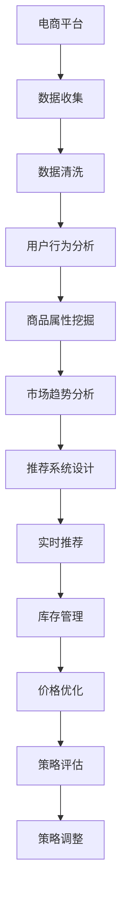

                 

## 1. 背景介绍

### 1.1 问题由来
随着电商行业的高速发展，越来越多的企业投入大量资源在商品推荐、库存管理、价格优化等关键环节。传统的数据驱动决策方法往往需要多轮人工分析，耗费大量时间和人力成本，且效果难以确保。而AI驱动的数据决策优化技术，以自动化、智能化的方式，大幅提升了电商决策的效率和准确性。

AI技术，尤其是深度学习、自然语言处理等方法，已经成为电商企业决策优化的重要工具。特别是在数据驱动的电商推荐系统中，通过分析用户行为数据、商品属性数据、市场趋势数据等，AI系统可以自动生成推荐模型，显著提高了用户购物体验和商家销售额。

### 1.2 问题核心关键点
电商策略优化通常包括以下几个关键点：
- **用户行为分析**：通过分析用户的浏览记录、购买记录等行为数据，挖掘用户的兴趣和偏好。
- **商品属性挖掘**：提取商品的关键属性信息，用于商品推荐和搜索排序。
- **市场趋势分析**：利用自然语言处理技术，从评论、新闻、社交媒体等非结构化数据中获取市场趋势和用户反馈。
- **推荐系统设计**：基于用户行为和商品属性构建推荐模型，实时推荐个性化商品。
- **库存管理和价格优化**：通过预测市场需求和用户购买意愿，自动调整库存和商品价格。

这些核心点围绕电商平台的运营目标，帮助商家更好地理解市场，提升用户体验和收益。

## 2. 核心概念与联系

### 2.1 核心概念概述
以下是一些电商策略优化中的关键概念：

- **推荐系统**：通过分析用户行为和商品属性，自动生成个性化推荐。
- **协同过滤**：利用用户间的相似性，进行推荐。
- **内容推荐**：利用商品标签、评论等文本信息进行推荐。
- **深度学习**：通过神经网络模型学习复杂的用户行为和商品特征。
- **强化学习**：通过模型和环境的交互，优化推荐策略。
- **大数据分析**：利用大规模数据集进行用户行为和市场趋势分析。
- **自然语言处理**：从非结构化文本数据中提取有价值信息。
- **异常检测**：识别异常行为，防范欺诈和风险。
- **A/B测试**：通过对比实验评估策略效果。

这些概念之间存在密切联系，通过合理组合和应用，可以构建高效、智能的电商策略优化系统。

### 2.2 核心概念原理和架构的 Mermaid 流程图



该流程图展示了电商策略优化的主要流程：
1. **用户行为数据**：收集用户的浏览、点击、购买等行为数据。
2. **用户兴趣建模**：利用机器学习方法，构建用户兴趣模型。
3. **商品属性挖掘**：提取商品的关键属性信息，如价格、品牌、分类等。
4. **市场趋势分析**：利用NLP技术，从非结构化数据中提取市场趋势。
5. **协同过滤**：通过用户行为相似性，推荐个性化商品。
6. **内容推荐**：利用商品文本信息，提升推荐多样性。
7. **深度学习推荐**：使用神经网络模型学习复杂特征，提升推荐效果。
8. **强化学习优化**：通过与环境的互动，不断优化推荐策略。
9. **库存管理**：利用预测模型，自动调整库存水平。
10. **价格优化**：通过市场需求预测，动态调整商品价格。
11. **实时推荐**：结合用户行为和市场趋势，实时生成推荐。
12. **用户反馈**：通过A/B测试等手段，获取用户反馈，持续优化策略。

### 2.3 核心概念联系的 Mermaid 流程图


该流程图展示了电商策略优化的完整流程：
1. **电商平台**：作为数据收集和策略实施的核心。
2. **数据收集**：收集用户行为、商品属性、市场趋势等数据。
3. **数据清洗**：处理缺失值、异常值等数据问题。
4. **用户行为分析**：分析用户行为数据，构建用户画像。
5. **商品属性挖掘**：提取商品属性信息，提升商品展示效果。
6. **市场趋势分析**：利用NLP等技术，分析市场趋势。
7. **推荐系统设计**：构建推荐模型，实时生成推荐。
8. **实时推荐**：结合用户行为和市场趋势，实时推荐商品。
9. **库存管理**：通过预测模型，自动调整库存水平。
10. **价格优化**：利用市场需求预测，动态调整商品价格。
11. **策略评估**：通过A/B测试等手段，评估策略效果。
12. **策略调整**：根据评估结果，不断优化推荐策略。

## 3. 核心算法原理 & 具体操作步骤
### 3.1 算法原理概述

电商策略优化中的关键算法包括推荐系统、协同过滤、深度学习等，下面简要介绍这些算法的原理：

- **推荐系统**：基于用户行为和商品属性，自动生成个性化推荐。算法主要分为基于协同过滤的推荐和基于内容的推荐。
- **协同过滤**：通过分析用户间的相似性，推荐用户可能喜欢的商品。协同过滤算法包括基于用户的协同过滤和基于项目的协同过滤。
- **深度学习**：利用神经网络模型学习复杂的用户行为和商品特征，提升推荐精度。常用的模型包括深度矩阵分解和序列模型。
- **强化学习**：通过与环境的互动，优化推荐策略，提高推荐效果。算法包括Q-learning、Deep Q-Network等。

### 3.2 算法步骤详解

电商策略优化的核心算法步骤如下：

**Step 1: 数据收集与清洗**
- 收集用户行为数据、商品属性数据、市场趋势数据等。
- 处理缺失值、异常值等数据问题。
- 构建数据集，供后续分析和模型训练使用。

**Step 2: 用户兴趣建模**
- 通过用户行为数据，构建用户兴趣模型。
- 常用的模型包括协同过滤、基于内容的推荐、深度学习等。
- 使用机器学习方法，如矩阵分解、决策树、神经网络等，提取用户兴趣特征。

**Step 3: 商品属性挖掘**
- 提取商品的关键属性信息，如价格、品牌、分类等。
- 通过文本挖掘技术，提取商品标签、描述等文本信息。
- 使用词嵌入技术，将文本信息转换为数值特征。

**Step 4: 市场趋势分析**
- 利用NLP技术，从评论、新闻、社交媒体等非结构化数据中提取市场趋势。
- 常用的技术包括情感分析、主题建模、实体识别等。
- 使用机器学习方法，如LSTM、BERT等，对文本进行建模和分析。

**Step 5: 推荐系统设计**
- 构建推荐模型，实现个性化推荐。
- 常用的推荐系统算法包括基于协同过滤的推荐、基于内容的推荐、深度学习推荐等。
- 设计推荐策略，结合用户行为、商品属性、市场趋势等，生成推荐结果。

**Step 6: 实时推荐与库存管理**
- 结合用户行为和市场趋势，实时生成推荐。
- 使用缓存和队列技术，提高推荐系统的响应速度。
- 通过预测模型，自动调整库存水平，保证库存合理性。

**Step 7: 价格优化**
- 利用市场需求预测，动态调整商品价格。
- 使用时间序列模型、回归模型等，预测市场需求。
- 根据市场需求预测结果，自动调整商品价格，优化收益。

**Step 8: 策略评估与调整**
- 通过A/B测试等手段，评估推荐策略效果。
- 使用统计学方法，如卡方检验、t-test等，评估推荐效果。
- 根据评估结果，不断优化推荐策略，提升用户满意度。

### 3.3 算法优缺点
电商策略优化中的算法主要优点包括：
- **自动化程度高**：通过算法自动化处理数据，减少人工干预，提升效率。
- **个性化推荐**：利用用户行为和商品属性，生成个性化推荐，提升用户满意度。
- **实时响应**：结合实时数据，生成实时推荐，提高用户体验。
- **动态调整**：通过预测模型，动态调整库存和价格，优化收益。

然而，这些算法也存在一些缺点：
- **数据依赖**：算法的性能依赖高质量数据，数据收集和清洗难度较大。
- **模型复杂**：深度学习和强化学习算法较为复杂，模型训练和调参难度较大。
- **过拟合风险**：模型可能过度拟合训练数据，导致泛化性能下降。
- **计算资源消耗**：高复杂度的算法需要大量计算资源，可能导致性能瓶颈。

### 3.4 算法应用领域

电商策略优化中的算法主要应用于以下几个领域：
- **个性化推荐**：通过分析用户行为和商品属性，生成个性化推荐。
- **库存管理**：利用预测模型，自动调整库存水平，保证库存合理性。
- **价格优化**：通过市场需求预测，动态调整商品价格，优化收益。
- **市场趋势分析**：利用NLP技术，从非结构化数据中提取市场趋势。
- **异常检测**：识别异常行为，防范欺诈和风险。

这些算法在电商平台的运营中具有广泛的应用，通过提升用户体验和优化运营策略，帮助商家提高销售额和客户满意度。

## 4. 数学模型和公式 & 详细讲解  
### 4.1 数学模型构建

电商策略优化中的数学模型通常包括以下几个部分：

- **用户兴趣建模**：用户行为数据 $D_u = \{x_i, y_i\}_{i=1}^N$，其中 $x_i$ 为行为数据，$y_i$ 为兴趣标签。
- **商品属性挖掘**：商品属性数据 $D_p = \{p_j, a_j\}_{j=1}^M$，其中 $p_j$ 为商品，$a_j$ 为属性。
- **市场趋势分析**：市场趋势数据 $D_t = \{t_k, w_k\}_{k=1}^K$，其中 $t_k$ 为文本，$w_k$ 为情感/主题标签。
- **推荐系统设计**：构建推荐模型 $M$，输入为 $x_i$ 和 $a_j$，输出为推荐结果 $r_i$。
- **实时推荐与库存管理**：市场需求预测模型 $F$，输入为时间序列 $t_{k-1}$ 和 $t_k$，输出为市场需求 $d_k$。
- **价格优化**：需求预测模型 $G$，输入为市场需求 $d_k$，输出为商品价格 $p_j$。

### 4.2 公式推导过程

以下以协同过滤算法为例，推导推荐系统的具体公式。

协同过滤算法基于用户间的相似性，计算用户对商品的评分。假设用户 $u_i$ 对商品 $p_j$ 的评分 $r_{ij}$ 为 $0$ 或 $1$，用户 $u_i$ 对商品 $p_j$ 的评分 $r_{ij}$ 可表示为：

$$
r_{ij} = \frac{\sum_{k=1}^N a_{ik}p_{kj}}{\sqrt{\sum_{k=1}^N a_{ik}^2}\sqrt{\sum_{k=1}^N p_{kj}^2}}
$$

其中 $a_{ik}$ 和 $p_{kj}$ 分别为用户 $u_i$ 对商品 $p_j$ 的评分和用户 $u_i$ 对商品 $p_j$ 的评分。

假设用户 $u_i$ 对商品 $p_j$ 的评分 $r_{ij}$ 为 $0$ 或 $1$，则协同过滤推荐算法如下：

1. 计算用户间的相似度：
$$
s_{ij} = \frac{\sum_{k=1}^N a_{ik}p_{kj}}{\sqrt{\sum_{k=1}^N a_{ik}^2}\sqrt{\sum_{k=1}^N p_{kj}^2}}
$$
2. 计算商品 $p_j$ 的评分预测值：
$$
r_{i'} = \sum_{j=1}^M s_{ij}r_{i'j}
$$
3. 生成推荐结果：
$$
\hat{y}_i = \arg\max_j r_{i'}
$$

### 4.3 案例分析与讲解

以某电商平台的推荐系统为例，展示协同过滤算法的应用过程。

**Step 1: 数据收集与清洗**
- 收集用户行为数据 $D_u = \{x_i, y_i\}_{i=1}^N$，其中 $x_i$ 为行为数据，$y_i$ 为兴趣标签。
- 处理缺失值、异常值等数据问题。
- 构建用户行为数据集 $D_u$。

**Step 2: 用户兴趣建模**
- 通过协同过滤算法，计算用户间的相似度。
- 使用sklearn库实现协同过滤算法，得到用户间的相似度矩阵 $S$。

**Step 3: 商品属性挖掘**
- 提取商品的关键属性信息，如价格、品牌、分类等。
- 构建商品属性数据集 $D_p$。

**Step 4: 市场趋势分析**
- 利用NLP技术，从评论、新闻、社交媒体等非结构化数据中提取市场趋势。
- 使用BERT等模型，对文本进行建模和分析。

**Step 5: 推荐系统设计**
- 构建推荐模型 $M$，输入为 $x_i$ 和 $a_j$，输出为推荐结果 $r_i$。
- 使用协同过滤算法，结合用户行为和商品属性，生成推荐结果 $r_i$。

**Step 6: 实时推荐与库存管理**
- 结合用户行为和市场趋势，实时生成推荐。
- 使用缓存和队列技术，提高推荐系统的响应速度。
- 通过预测模型，自动调整库存水平，保证库存合理性。

**Step 7: 价格优化**
- 利用市场需求预测模型 $F$，预测市场需求 $d_k$。
- 结合市场需求预测结果，动态调整商品价格 $p_j$，优化收益。

**Step 8: 策略评估与调整**
- 通过A/B测试等手段，评估推荐策略效果。
- 使用统计学方法，如卡方检验、t-test等，评估推荐效果。
- 根据评估结果，不断优化推荐策略，提升用户满意度。

## 5. 项目实践：代码实例和详细解释说明
### 5.1 开发环境搭建

在进行电商策略优化实践前，我们需要准备好开发环境。以下是使用Python进行TensorFlow开发的环境配置流程：

1. 安装Anaconda：从官网下载并安装Anaconda，用于创建独立的Python环境。

2. 创建并激活虚拟环境：
```bash
conda create -n tf-env python=3.8 
conda activate tf-env
```

3. 安装TensorFlow：根据CUDA版本，从官网获取对应的安装命令。例如：
```bash
conda install tensorflow -c pytorch -c conda-forge
```

4. 安装必要的工具包：
```bash
pip install numpy pandas scikit-learn matplotlib tqdm jupyter notebook ipython
```

完成上述步骤后，即可在`tf-env`环境中开始电商策略优化的实践。

### 5.2 源代码详细实现

下面我们以电商平台个性化推荐系统为例，给出使用TensorFlow实现协同过滤算法的PyTorch代码实现。

```python
import tensorflow as tf
from tensorflow.keras.layers import Embedding, DotProduct, Dense, Input, Concatenate
from tensorflow.keras.models import Model
from tensorflow.keras.optimizers import Adam
from sklearn.metrics import precision_recall_fscore_support
import pandas as pd
import numpy as np

# 用户行为数据
user_data = pd.read_csv('user_data.csv')
# 商品属性数据
item_data = pd.read_csv('item_data.csv')
# 市场趋势数据
trend_data = pd.read_csv('trend_data.csv')

# 用户行为数据处理
user_data = user_data.dropna(subset=['behavior'])
user_data['interest'] = 1
user_data = user_data.set_index('user_id')

# 商品属性数据处理
item_data = item_data.dropna(subset=['attributes'])
item_data = item_data.set_index('item_id')

# 市场趋势数据处理
trend_data = trend_data.dropna(subset=['text'])
trend_data['label'] = 1
trend_data = trend_data.set_index('text_id')

# 构建协同过滤模型
user_input = Input(shape=(1,), name='user')
item_input = Input(shape=(1,), name='item')

user_embed = Embedding(input_dim=user_data.shape[0], output_dim=128)(user_input)
item_embed = Embedding(input_dim=item_data.shape[0], output_dim=128)(item_input)
dot_product = DotProduct(name='dot_product')([user_embed, item_embed])
dot_product = tf.keras.layers.Reshape((1,))(dot_product)
dot_product = Dense(1, activation='sigmoid')(dot_product)
recommender = Model(inputs=[user_input, item_input], outputs=dot_product)

# 模型编译和训练
recommender.compile(optimizer=Adam(), loss='binary_crossentropy', metrics=['accuracy'])
recommender.fit([user_data, item_data], user_data['interest'], epochs=10, batch_size=32)

# 生成推荐结果
user_input = np.array(['user_id1', 'user_id2'])
item_input = np.array(['item_id1', 'item_id2'])
predictions = recommender.predict([user_input, item_input])
print(predictions)
```

以上代码实现了使用TensorFlow构建协同过滤推荐系统，通过用户行为和商品属性生成个性化推荐。

### 5.3 代码解读与分析

让我们再详细解读一下关键代码的实现细节：

**数据处理**：
- 使用pandas库读取用户行为数据、商品属性数据和市场趋势数据。
- 处理缺失值、异常值等数据问题。
- 构建用户行为数据集、商品属性数据集和市场趋势数据集。

**模型构建**：
- 定义用户输入和商品输入。
- 使用Embedding层将用户和商品表示为向量。
- 使用DotProduct层计算用户和商品的相似度。
- 使用Dense层生成推荐结果。
- 构建推荐模型。

**模型编译和训练**：
- 使用Adam优化器编译模型。
- 设置损失函数和评估指标。
- 训练模型，设置训练轮数和批大小。

**生成推荐结果**：
- 使用模型生成推荐结果。
- 输出预测结果。

可以看到，使用TensorFlow构建推荐系统相对简单，开发者可以专注于算法和模型设计，而将具体的实现细节交给TensorFlow。

当然，在工业级的系统实现中，还需要考虑更多因素，如模型的保存和部署、超参数的自动搜索、更灵活的任务适配层等。但核心的算法和模型构建思路基本与此类似。

## 6. 实际应用场景
### 6.1 智能推荐系统
基于深度学习和大数据的推荐系统，已经成为电商平台的标配。通过分析用户行为数据、商品属性数据、市场趋势数据等，AI系统可以自动生成推荐模型，显著提高了用户购物体验和商家销售额。

在技术实现上，可以构建基于协同过滤的推荐系统，通过分析用户间的相似性，推荐用户可能喜欢的商品。同时，可以利用商品标签、评论等文本信息进行内容推荐，提升推荐多样性。

### 6.2 库存管理优化
库存管理是电商运营的重要环节，库存过高或过低都会导致运营成本增加。通过市场需求预测模型，电商可以动态调整库存水平，避免库存积压或断货。

在技术实现上，可以构建时间序列预测模型，结合市场需求、商品价格、季节性因素等，预测未来需求量。同时，利用预测结果自动调整库存水平，优化库存成本。

### 6.3 价格优化策略
价格是电商运营的重要杠杆，通过合理的价格调整，可以提升销售额和市场竞争力。通过市场需求预测模型，电商可以动态调整商品价格，优化收益。

在技术实现上，可以构建回归模型，结合市场需求、商品属性、市场趋势等，预测商品的市场需求。同时，利用预测结果自动调整商品价格，优化收益。

### 6.4 未来应用展望
随着深度学习和大数据技术的不断发展，基于数据驱动的电商策略优化将呈现以下几个发展趋势：

1. **多模态数据融合**：未来的推荐系统将不仅依赖于用户行为和商品属性，还会结合视觉、语音等多模态数据，提升推荐精度。
2. **个性化推荐系统**：通过深度学习算法，个性化推荐系统将能够更好地理解和满足用户需求，提升用户体验。
3. **实时推荐系统**：通过实时数据处理和预测，实时推荐系统将能够及时响应用户需求，提升推荐效果。
4. **智能决策优化**：通过智能算法和决策优化，电商策略优化将能够自动化、智能化，提升运营效率。
5. **异常检测和风险管理**：通过异常检测和风险管理技术，电商策略优化将能够识别欺诈行为和风险，保障运营安全。

以上趋势凸显了数据驱动的电商策略优化的广阔前景，这些方向的探索发展，必将进一步提升电商平台的运营效率和客户满意度。

## 7. 工具和资源推荐
### 7.1 学习资源推荐

为了帮助开发者系统掌握电商策略优化理论基础和实践技巧，这里推荐一些优质的学习资源：

1. **《深度学习与电商推荐系统》书籍**：系统讲解了电商推荐系统的构建和优化，深入浅出地介绍了电商推荐系统的核心算法和实践方法。
2. **CS229《机器学习》课程**：斯坦福大学开设的机器学习课程，涵盖了电商推荐系统的经典模型和优化方法。
3. **Kaggle电商推荐竞赛**：通过实际竞赛，学习电商推荐系统的构建和优化，积累实战经验。
4. **Coursera电商推荐课程**：Coursera开设的电商推荐系统课程，系统讲解了电商推荐系统的理论基础和实践方法。
5. **arXiv电商推荐论文**：最新发布的电商推荐论文，涵盖各种前沿算法和优化方法。

通过对这些资源的学习实践，相信你一定能够快速掌握电商策略优化的精髓，并用于解决实际的电商问题。
###  7.2 开发工具推荐

高效的开发离不开优秀的工具支持。以下是几款用于电商策略优化开发的常用工具：

1. **TensorFlow**：基于Python的开源深度学习框架，灵活动态的计算图，适合快速迭代研究。
2. **PyTorch**：基于Python的开源深度学习框架，灵活高效的自动微分系统，适合科研和生产应用。
3. **Keras**：基于TensorFlow和Theano的高级神经网络API，简化了模型构建和训练过程。
4. **Pandas**：强大的数据处理库，适合电商数据清洗和处理。
5. **Scikit-learn**：Python机器学习库，适合电商模型训练和评估。
6. **TensorBoard**：TensorFlow配套的可视化工具，可实时监测模型训练状态，提供丰富的图表呈现方式。

合理利用这些工具，可以显著提升电商策略优化任务的开发效率，加快创新迭代的步伐。

### 7.3 相关论文推荐

电商策略优化中的算法研究已经在学界取得了诸多成果，以下是几篇奠基性的相关论文，推荐阅读：

1. **《基于协同过滤的推荐系统》**：介绍了协同过滤算法的原理和应用，展示了协同过滤算法在电商推荐系统中的效果。
2. **《深度学习在电商推荐系统中的应用》**：探讨了深度学习在电商推荐系统中的应用，展示了深度学习算法在电商推荐中的潜力。
3. **《电商推荐系统的异常检测》**：介绍了异常检测算法在电商推荐系统中的应用，展示了异常检测算法在电商推荐中的效果。
4. **《时间序列预测在电商库存管理中的应用》**：探讨了时间序列预测在电商库存管理中的应用，展示了时间序列预测在电商库存管理中的效果。
5. **《电商推荐系统的实时推荐技术》**：介绍了实时推荐技术在电商推荐系统中的应用，展示了实时推荐技术在电商推荐中的效果。

这些论文代表了大电商推荐系统的发展脉络。通过学习这些前沿成果，可以帮助研究者把握学科前进方向，激发更多的创新灵感。

## 8. 总结：未来发展趋势与挑战
### 8.1 总结

本文对基于数据驱动的电商策略优化方法进行了全面系统的介绍。首先阐述了电商策略优化的背景和意义，明确了推荐系统、库存管理、价格优化等核心任务。其次，从原理到实践，详细讲解了电商策略优化的数学模型和关键算法，给出了电商策略优化的完整代码实例。同时，本文还广泛探讨了电商策略优化在智能推荐、库存管理、价格优化等诸多领域的应用前景，展示了电商策略优化技术的广阔前景。

通过本文的系统梳理，可以看到，基于数据驱动的电商策略优化技术正在成为电商平台的必备工具，显著提升了电商运营的效率和客户满意度。未来，伴随深度学习和大数据技术的持续演进，电商策略优化技术还将不断进化，推动电商平台的智能化、个性化发展。

### 8.2 未来发展趋势

电商策略优化中的技术将呈现以下几个发展趋势：

1. **深度学习算法的普及**：深度学习算法在电商推荐系统中的应用将越来越广泛，提升推荐精度和多样化。
2. **实时推荐系统的普及**：实时推荐系统将成为电商平台的标配，提升推荐的时效性和用户满意度。
3. **多模态数据融合**：未来的推荐系统将不仅依赖于用户行为和商品属性，还会结合视觉、语音等多模态数据，提升推荐精度。
4. **个性化推荐系统的普及**：通过深度学习算法，个性化推荐系统将能够更好地理解和满足用户需求，提升用户体验。
5. **智能决策优化**：通过智能算法和决策优化，电商策略优化将能够自动化、智能化，提升运营效率。
6. **异常检测和风险管理**：通过异常检测和风险管理技术，电商策略优化将能够识别欺诈行为和风险，保障运营安全。

以上趋势凸显了数据驱动的电商策略优化的广阔前景，这些方向的探索发展，必将进一步提升电商平台的运营效率和客户满意度。

### 8.3 面临的挑战

尽管电商策略优化技术已经取得了瞩目成就，但在迈向更加智能化、普适化应用的过程中，它仍面临着诸多挑战：

1. **数据隐私问题**：电商数据涉及用户隐私，如何保护用户隐私，同时获取高质量数据，是数据驱动决策优化面临的首要挑战。
2. **数据偏差问题**：电商数据可能存在偏差，如何识别和纠正数据偏差，提升模型公平性和鲁棒性，是模型训练中的重要问题。
3. **计算资源消耗**：高复杂度的算法需要大量计算资源，可能导致性能瓶颈，如何优化计算资源使用，提高系统效率，是实际应用中的关键问题。
4. **模型可解释性问题**：电商推荐系统的复杂性，可能导致模型难以解释，如何提高模型的可解释性，增强用户信任，是应用中的重要问题。
5. **模型公平性问题**：电商推荐系统可能存在偏见，如何保障模型公平性，避免对特定用户群体的不公平对待，是应用中的重要问题。

解决这些问题，需要技术、法律、伦理等多方面的协同努力，才能真正实现电商策略优化的公平、透明和可持续。

### 8.4 研究展望

未来，电商策略优化技术还需要在以下几个方面寻求新的突破：

1. **无监督和半监督学习**：摆脱对大规模标注数据的依赖，利用无监督和半监督学习，利用更多的非结构化数据，提升模型的泛化能力和公平性。
2. **多模态数据融合**：结合视觉、语音、文本等多模态数据，提升推荐精度和多样性。
3. **个性化推荐系统**：通过深度学习算法，个性化推荐系统将能够更好地理解和满足用户需求，提升用户体验。
4. **实时推荐系统**：通过实时数据处理和预测，实时推荐系统将能够及时响应用户需求，提升推荐效果。
5. **异常检测和风险管理**：通过异常检测和风险管理技术，电商策略优化将能够识别欺诈行为和风险，保障运营安全。

这些研究方向的探索发展，必将进一步提升电商平台的运营效率和客户满意度，推动电商平台的智能化、个性化发展。

## 9. 附录：常见问题与解答

**Q1：电商推荐系统如何处理冷启动问题？**

A: 电商推荐系统可以通过多种方式处理冷启动问题：
1. **协同过滤推荐**：通过分析用户间相似性，推荐用户可能喜欢的商品。对于新用户，可以推荐与已注册用户相似的商品。
2. **基于内容的推荐**：利用商品标签、评论等文本信息进行推荐。对于新商品，可以使用其描述信息进行推荐。
3. **深度学习推荐**：使用神经网络模型学习复杂特征，生成个性化推荐。对于新用户和商品，可以通过预测模型生成推荐。
4. **多模态推荐**：结合视觉、语音等多模态数据，提升推荐精度。对于新用户和商品，可以利用其多模态数据进行推荐。

这些方法可以结合使用，最大程度利用用户行为和商品属性，生成个性化推荐。

**Q2：电商推荐系统如何优化用户满意度？**

A: 电商推荐系统可以通过多种方式优化用户满意度：
1. **个性化推荐**：通过分析用户行为和商品属性，生成个性化推荐，提升用户满意度。
2. **多样性推荐**：引入多样性因素，避免推荐过度集中，提升推荐多样性。
3. **实时推荐**：结合实时数据，生成实时推荐，提高推荐的时效性和用户满意度。
4. **多模态推荐**：结合视觉、语音等多模态数据，提升推荐精度和多样性。
5. **用户反馈**：通过A/B测试等手段，获取用户反馈，不断优化推荐策略。

这些方法可以结合使用，提升用户的购物体验和满意度。

**Q3：电商库存管理如何优化库存水平？**

A: 电商库存管理可以通过多种方式优化库存水平：
1. **需求预测模型**：利用时间序列模型、回归模型等，预测市场需求。结合预测结果，自动调整库存水平，优化库存成本。
2. **库存调整策略**：根据市场需求预测结果，动态调整库存水平，保证库存合理性。
3. **供应链优化**：优化供应链管理，提升供应链效率，减少库存积压和断货。
4. **库存预警机制**：设置库存预警阈值，及时发现库存异常，采取应急措施。

这些方法可以结合使用，提升库存管理效率，减少库存积压和断货。

**Q4：电商价格优化如何调整商品价格？**

A: 电商价格优化可以通过多种方式调整商品价格：
1. **市场需求预测**：利用时间序列模型、回归模型等，预测市场需求。结合预测结果，动态调整商品价格，优化收益。
2. **价格调整策略**：根据市场需求预测结果，动态调整商品价格，保证价格竞争力。
3. **动态定价模型**：结合市场竞争、商品属性等因素，构建动态定价模型，优化价格策略。
4. **价格促销策略**：根据市场需求，进行价格促销，提升销量和市场竞争力。

这些方法可以结合使用，优化商品价格，提升收益和市场竞争力。

**Q5：电商策略优化如何应对数据偏差问题？**

A: 电商策略优化可以通过多种方式应对数据偏差问题：
1. **数据清洗**：处理缺失值、异常值等数据问题，保证数据质量。
2. **数据增强**：通过数据增强技术，扩充训练集，减少数据偏差。
3. **正则化技术**：引入正则化技术，防止模型过度拟合训练数据。
4. **公平性算法**：使用公平性算法，提升模型公平性和鲁棒性。
5. **对抗性训练**：引入对抗性训练，提升模型的鲁棒性，减少数据偏差。

这些方法可以结合使用，提升模型的泛化能力和公平性。

---

作者：禅与计算机程序设计艺术 / Zen and the Art of Computer Programming

