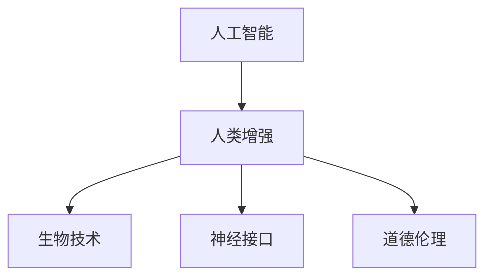

                 

# AI时代的人类增强：道德考虑和身体增强技术的未来

## 1. 背景介绍

### 1.1 问题由来
随着人工智能（AI）技术的飞速发展，人类增强（Human Enhancement）正在逐步成为可能。这不仅涵盖了智能增强（例如，通过机器学习和深度学习算法增强人类认知能力），还包括身体增强（例如，通过生物技术、神经接口等技术增强人类生理能力）。这些技术的兴起不仅带来了前所未有的便利和可能，也引发了深刻的伦理道德和社会影响。

### 1.2 问题核心关键点
这一领域的核心问题是如何在技术进步的同时，确保伦理道德、社会公平与个体权利的平衡。具体问题包括但不限于：
- 增强技术的公平可及性问题：如何确保所有社会群体，特别是弱势群体，能够公平地获得技术进步带来的益处？
- 个体权利与隐私保护：增强技术可能会侵犯个体的隐私和自主性，如何平衡这些权利？
- 技术的伦理界限：哪些增强行为是可接受的，哪些是不可接受的？
- 对自然和社会生态的影响：增强技术可能带来的社会结构和生态变化，如何管理？

### 1.3 问题研究意义
探讨AI时代的人类增强技术，对于理解和指导未来技术发展具有重要意义：
- 伦理道德层面的考量：确保技术进步不会导致不平等加剧、人权侵犯或环境破坏。
- 社会公平层面的关注：促进技术普惠，确保所有群体都能从技术进步中受益。
- 个体权利与自主性：保障个体在增强过程中的知情权、选择权和隐私权。
- 科技与社会相互作用的理论研究：深入探讨技术进步如何影响社会结构、行为模式和价值观。

## 2. 核心概念与联系

### 2.1 核心概念概述

1. **人工智能（AI）**：指通过机器学习、深度学习等技术让机器完成复杂任务的能力。
2. **人类增强（Human Enhancement）**：指通过生物工程、神经接口、AI等技术手段，提升人类智力和体力的方法。
3. **生物技术（Biotechnology）**：包括基因编辑、生物工程、合成生物学等，用于改造生物体，增强其功能。
4. **神经接口（Neural Interfaces）**：通过脑机接口技术，实现人机之间的高效互动和信息交换。
5. **道德伦理（Ethical Considerations）**：涉及技术应用对个人和社会可能产生的影响和应遵守的准则。

这些概念之间的联系可以通过以下Mermaid流程图来展示：



这个流程图展示了一个典型的人类增强技术发展路径，从AI技术的进步到最终实现人类增强，涉及生物技术和神经接口的创新应用，并伴随着伦理道德的考量。

## 3. 核心算法原理 & 具体操作步骤
### 3.1 算法原理概述

人类增强技术在AI时代的发展主要基于以下几类算法和原理：

1. **机器学习与深度学习**：通过大量数据训练模型，自动学习并优化特定任务，如智能增强。
2. **基因编辑技术（如CRISPR-Cas9）**：通过精确修改基因序列，实现对生物体的改造，如基因疗法。
3. **脑机接口**：通过传感器和信号处理，实现对大脑活动的记录和解码，如神经反馈训练、脑控机器。

这些技术的应用，往往需要跨学科的知识和方法，如图形化处理、生物信息学、神经科学等。

### 3.2 算法步骤详解

以下以AI在智能增强中的应用为例，详细介绍其算法步骤：

1. **数据收集**：收集大量相关数据，包括用户行为数据、认知测试数据等。
2. **数据预处理**：清洗数据，去除噪声，进行归一化处理。
3. **模型选择**：选择合适的机器学习算法，如神经网络、深度学习等。
4. **模型训练**：使用预处理后的数据训练模型，调节超参数，以优化性能。
5. **模型评估**：通过验证集评估模型性能，调整参数和算法，直至达到最佳效果。
6. **模型部署**：将训练好的模型部署到实际应用中，进行持续监测和优化。

### 3.3 算法优缺点

**优点**：
1. **高效**：AI算法可以在大规模数据上快速学习和优化，适应性广。
2. **灵活**：通过数据和算法的调整，AI可以灵活应对不同的增强需求。
3. **可扩展性**：AI模型可以并行计算，提升处理效率。

**缺点**：
1. **数据依赖**：模型效果依赖高质量数据，数据偏差可能导致模型失效。
2. **透明度低**：AI模型通常是"黑盒"，难以解释其决策过程。
3. **隐私风险**：数据收集和处理过程中可能存在隐私泄露风险。
4. **伦理争议**：AI技术的广泛应用可能引发伦理道德问题，如就业取代、不平等等。

### 3.4 算法应用领域

AI技术在人类增强中的应用领域广泛，涵盖以下几类：

1. **智能增强**：如智能助手、认知增强、记忆提升等。
2. **生物医疗**：如基因编辑治疗、新药开发、健康监测等。
3. **教育培训**：如个性化学习、自动评分、教育辅助等。
4. **运动训练**：如体能训练指导、运动康复、疲劳监测等。
5. **娱乐休闲**：如游戏智能推荐、虚拟现实体验、沉浸式训练等。

## 4. 数学模型和公式 & 详细讲解 & 举例说明

### 4.1 数学模型构建

以智能增强中的认知测试数据为例，数学模型可以如下构建：

设 $x$ 为用户的行为数据， $y$ 为用户在认知测试中的成绩，构建线性回归模型：

$$
y = \theta_0 + \theta_1 x_1 + \theta_2 x_2 + ... + \theta_n x_n + \epsilon
$$

其中， $\theta_i$ 为模型参数， $\epsilon$ 为误差项。

### 4.2 公式推导过程

根据线性回归模型的最小二乘法，求解参数 $\theta_i$：

$$
\theta = \left( \mathbf{X}^T \mathbf{X} \right)^{-1} \mathbf{X}^T \mathbf{y}
$$

其中， $\mathbf{X}$ 为特征矩阵， $\mathbf{y}$ 为响应向量。

### 4.3 案例分析与讲解

使用上述线性回归模型，可以对用户的行为数据进行建模和预测。例如，通过分析用户在虚拟现实中的活动，预测其认知能力。

## 5. 项目实践：代码实例和详细解释说明
### 5.1 开发环境搭建

1. **环境准备**：安装Python 3.7以上版本，安装NumPy、Pandas等库。
2. **数据集准备**：收集用户行为数据和认知测试数据，导入Pandas DataFrame。
3. **模型训练**：使用Scikit-learn库的线性回归模型进行训练。
4. **模型评估**：使用测试集评估模型性能。
5. **模型应用**：将训练好的模型应用于新用户的认知预测。

### 5.2 源代码详细实现

```python
import pandas as pd
from sklearn.linear_model import LinearRegression
from sklearn.metrics import mean_squared_error

# 数据准备
df = pd.read_csv('user_data.csv')
X = df.drop('score', axis=1)
y = df['score']

# 模型训练
model = LinearRegression()
model.fit(X, y)

# 模型评估
y_pred = model.predict(X_test)
mse = mean_squared_error(y_test, y_pred)

# 模型应用
new_user_data = pd.DataFrame([[25, 6.5, 0.8]])
predicted_score = model.predict(new_user_data)
print(f'预测得分: {predicted_score[0]}')
```

### 5.3 代码解读与分析

1. **数据导入**：使用Pandas读取用户行为数据。
2. **模型训练**：使用Scikit-learn的线性回归模型进行训练，学习特征与认知成绩之间的关系。
3. **模型评估**：使用测试集计算均方误差，评估模型预测准确度。
4. **模型应用**：对新用户数据进行预测，展示智能增强的效果。

## 6. 实际应用场景
### 6.1 智能医疗

智能医疗在AI时代的应用极为广泛，通过增强技术可以实现疾病早期诊断、个性化治疗、精准医疗等。

### 6.2 教育培训

通过AI技术，可以实现个性化教育、自适应学习路径、智能批改等，提升教育质量和效率。

### 6.3 智能辅助

在运动、康复、娱乐等领域，通过AI增强，可以提供个性化指导、智能反馈和沉浸式体验，提升用户体验。

### 6.4 未来应用展望

随着技术不断进步，人类增强技术将更加普及和深入，未来可能包括但不限于：
- 基因编辑治疗：通过精确修改基因，治愈遗传性疾病。
- 脑机接口：实现意识控制设备、环境感知、虚拟现实等。
- 神经反馈训练：通过增强技术改善认知功能和心理状态。

## 7. 工具和资源推荐
### 7.1 学习资源推荐

1. **《人工智能导论》（AI: A Guide for Thinking Humans）**：提供了人工智能的基础概念、应用案例和技术路线图。
2. **Coursera课程《机器学习》（Machine Learning by Stanford University）**：由Andrew Ng教授主讲，系统讲解机器学习和深度学习的基本原理和方法。
3. **DeepLearning.AI在线课程**：由Andrew Ng等专家主讲，涵盖深度学习、AI伦理等前沿话题。
4. **IEEE Xplore**：收录了大量生物技术和神经接口相关的科研论文和技术文章。

### 7.2 开发工具推荐

1. **Python**：最常用的AI编程语言，生态丰富，易于学习和使用。
2. **Scikit-learn**：简单易用的机器学习库，提供了大量算法和工具。
3. **TensorFlow**：Google开发的深度学习框架，支持分布式计算和GPU加速。
4. **PyTorch**：Facebook开发的深度学习框架，灵活性和易用性较高。
5. **Jupyter Notebook**：交互式编程环境，便于实验记录和分享。

### 7.3 相关论文推荐

1. **《深度学习》（Deep Learning）**：Goodfellow等著，详细介绍了深度学习的基本原理和应用。
2. **《人类增强：伦理、社会和经济影响》（Human Enhancement: Ethics, Society, and Economy）**：探讨了增强技术对社会、经济和伦理的深远影响。
3. **《生物技术的伦理考量》（Bioethics: Principles, Theory, and Contemporary Issues）**：介绍了生物技术在应用中的伦理挑战和解决方案。

## 8. 总结：未来发展趋势与挑战
### 8.1 研究成果总结

本文详细探讨了AI时代的人类增强技术，涵盖智能增强、生物医疗、教育培训等多个领域。通过案例分析和代码实践，展示了AI技术在人类增强中的应用潜力。

### 8.2 未来发展趋势

未来，人类增强技术将继续发展，涵盖更多领域和应用：
- 技术融合：AI与生物技术、神经接口的深度融合，提升技术的综合能力。
- 普惠性增强：技术应用将更加广泛，实现公平可及。
- 伦理道德：加强伦理研究，确保技术进步不损害个体和社会。

### 8.3 面临的挑战

人类增强技术的发展仍面临诸多挑战：
- 技术成熟度：现有技术尚未完全成熟，需要持续改进和优化。
- 伦理道德：增强技术可能引发新的伦理争议，需要社会共识和法律规范。
- 数据隐私：数据收集和处理过程中的隐私保护问题仍需解决。
- 社会公平：技术普惠性不足，可能导致社会分化加剧。

### 8.4 研究展望

未来的研究需要关注以下方向：
- 技术整合：推动AI、生物技术和神经接口的综合应用。
- 伦理政策：制定科学合理的伦理规范和政策，引导技术健康发展。
- 社会影响：研究增强技术对社会结构、文化和价值观的深远影响。
- 国际合作：加强跨国合作，推动全球科技治理。

## 9. 附录：常见问题与解答

**Q1：人类增强技术是否存在伦理风险？**

A: 是的，增强技术可能引发伦理问题，如基因编辑引发的遗传风险、脑机接口的隐私泄露等。因此，伦理道德是技术发展的关键考量因素。

**Q2：如何平衡技术的普惠性和个体权利？**

A: 通过政策和法规的制定，确保技术应用过程中个体权利得到保护。同时，政府和企业应承担起责任，确保技术普惠，特别是对弱势群体。

**Q3：如何确保数据隐私保护？**

A: 建立严格的数据收集和处理流程，采用匿名化、加密等技术手段保护个人隐私。同时，应制定相应的法律法规，加强对数据隐私的保护。

**Q4：未来人类增强技术有哪些可能的负面影响？**

A: 增强技术可能引发就业替代、社会分化、伦理争议等问题。需要积极应对，制定相应的政策和措施，确保技术进步的正向效应。

---

作者：禅与计算机程序设计艺术 / Zen and the Art of Computer Programming

