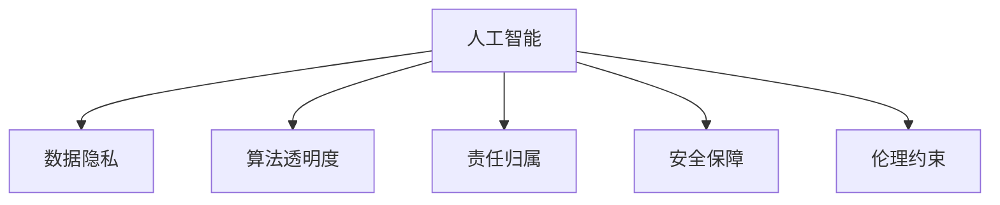

                 

# AI时代的人类计算：未来的道德边界

## 1. 背景介绍

### 1.1 问题由来
在人工智能（AI）快速发展的背景下，人类计算面临着前所未有的变革与挑战。AI技术正在深入各行各业，从医疗、教育、金融到制造业，几乎所有领域都正在经历着计算范式的转变。然而，这种技术进步带来了新的伦理道德问题，尤其是在AI系统如何处理隐私、安全、责任等核心问题上，亟需明确其道德边界。

### 1.2 问题核心关键点
当前，人类计算面临的核心问题是如何在AI时代确保技术的伦理性。具体包括以下几个关键点：

1. **数据隐私**：AI系统的训练和运行依赖大量数据，如何在收集、使用和共享数据时保障用户的隐私权益。
2. **算法透明度**：AI决策的透明度与可解释性，如何在保证模型性能的同时，使其决策过程可以被理解和解释。
3. **责任归属**：AI系统犯错时的责任归属问题，如何建立明确的法律和伦理框架以解决争议。
4. **安全保障**：AI系统的安全性，如何防止恶意攻击、错误判断及恶意应用。
5. **伦理约束**：AI系统的伦理约束，如何制定和执行伦理准则，避免算法偏见和歧视。

## 2. 核心概念与联系

### 2.1 核心概念概述

为更好地理解AI时代的人类计算及其道德边界，本节将介绍几个密切相关的核心概念：

- **人工智能**：通过算法和模型实现的数据驱动决策，旨在模拟人类智能的行为和思维过程。
- **人类计算**：涉及人机交互的计算模式，强调在计算过程中人的主导地位和计算伦理。
- **数据隐私**：涉及个人数据的收集、存储、使用和共享过程中，如何保护用户的个人信息安全。
- **算法透明度**：指算法的工作原理、决策路径、模型结构等可以被理解和解释的程度。
- **责任归属**：指AI系统在决策失误或违法行为时，确定责任主体的机制和法律依据。
- **安全保障**：指保障AI系统不受恶意攻击、错误判断和不当应用的能力。
- **伦理约束**：指AI系统在设计和应用过程中，遵守的伦理规范和道德准则。

这些概念之间的逻辑关系可以通过以下Mermaid流程图来展示：



这个流程图展示了我讨论的主要概念及其之间的关系：

1. AI系统是基于数据的计算模型，直接受到数据隐私、算法透明度、责任归属、安全保障和伦理约束的影响。
2. 数据隐私与算法透明度密切相关，保护隐私的同时，需要保证算法的可解释性。
3. 责任归属与安全保障是AI系统应用的法律和伦理基础。
4. 伦理约束贯穿于AI系统的设计、开发和应用全过程。

## 3. 核心算法原理 & 具体操作步骤
### 3.1 算法原理概述

AI时代的人类计算涉及多个领域，包括机器学习、自然语言处理、计算机视觉等，但核心算法原理仍遵循基本的监督学习、强化学习、无监督学习等基本范式。本文主要关注AI系统在数据隐私、算法透明度、责任归属、安全保障和伦理约束等方面的算法原理。

### 3.2 算法步骤详解

为明确AI系统在各个关键领域的具体操作步骤，下面将详细讲解每个核心概念的算法步骤。

#### 3.2.1 数据隐私

- **数据收集**：采用匿名化、去标识化等技术，保护数据主体身份信息。
- **数据存储**：使用加密技术，确保数据在存储过程中的安全性。
- **数据共享**：实施数据访问控制，限制数据访问权限，防止数据滥用。

#### 3.2.2 算法透明度

- **模型结构解释**：提供模型架构图，说明模型各层的作用。
- **决策过程可视化**：使用可视化工具，展示模型在输入数据上的处理流程。
- **特征重要性分析**：解释模型决策中关键特征的重要性。

#### 3.2.3 责任归属

- **责任定义**：明确AI系统在决策过程中的责任主体。
- **责任追究机制**：建立法律和伦理框架，规范AI系统的行为。
- **责任保险**：引入责任保险机制，分担AI系统的潜在风险。

#### 3.2.4 安全保障

- **模型鲁棒性测试**：通过对抗样本测试，评估模型的鲁棒性。
- **漏洞修补**：及时修复发现的漏洞，防止攻击和误用。
- **审计与监控**：定期进行安全审计和实时监控，防范潜在威胁。

#### 3.2.5 伦理约束

- **伦理准则制定**：制定明确的伦理准则，指导AI系统的设计与应用。
- **伦理审查**：实施伦理审查机制，确保AI系统符合伦理标准。
- **伦理教育**：对AI系统开发团队进行伦理教育，提升其伦理意识。

### 3.3 算法优缺点

AI时代的人类计算，具有以下优点：

1. **效率提升**：通过自动化和智能化计算，大幅提升计算效率。
2. **决策质量**：基于数据驱动的决策，准确性和公正性较高。
3. **普适性**：广泛适用于各种领域和场景，具有较强的通用性。

但同时也存在以下缺点：

1. **依赖数据**：对数据质量和隐私保护要求较高，数据问题可能导致模型性能下降。
2. **模型偏见**：模型可能继承训练数据中的偏见，导致歧视性决策。
3. **透明度不足**：复杂的模型结构可能难以解释，导致算法的“黑箱”问题。
4. **伦理争议**：涉及数据隐私和责任归属等伦理问题，可能引发社会争议。
5. **安全性风险**：存在被攻击、误用和滥用的风险。

### 3.4 算法应用领域

AI时代的人类计算在多个领域得到了广泛应用，例如：

- **医疗诊断**：利用AI系统进行疾病诊断、药物研发和健康监测。
- **金融风控**：通过AI系统进行风险评估、信用评分和欺诈检测。
- **智能交通**：使用AI系统优化交通流量、安全监控和驾驶辅助。
- **教育评估**：采用AI系统进行学生成绩评估、学习行为分析和个性化推荐。
- **司法审判**：利用AI系统辅助判案，提升司法效率和公正性。

## 4. 数学模型和公式 & 详细讲解 & 举例说明

### 4.1 数学模型构建

为更深入地理解AI系统中的计算原理，下面将详细讲解一些核心模型的数学模型构建。

#### 4.1.1 神经网络模型

- **输入层**：接受原始数据输入。
- **隐藏层**：通过一系列线性变换和非线性激活函数，提取数据特征。
- **输出层**：输出模型预测结果。

#### 4.1.2 决策树模型

- **根节点**：接收输入数据。
- **内部节点**：根据特征值进行分裂。
- **叶子节点**：输出分类结果。

#### 4.1.3 支持向量机模型

- **样本点**：训练数据集中的各个样本。
- **超平面**：分割不同类别的决策边界。
- **支持向量**：离超平面最近的样本点。

### 4.2 公式推导过程

#### 4.2.1 神经网络公式

神经网络的前向传播过程如下：

$$
y = \sigma(Wx + b)
$$

其中，$W$为权重矩阵，$x$为输入向量，$b$为偏置项，$\sigma$为激活函数。

#### 4.2.2 决策树公式

决策树的分类规则如下：

$$
\text{if} \, x_i < \text{threshold}_i \, \text{then} \, \text{class}_j \, \text{else} \, \text{class}_k
$$

其中，$x_i$为输入特征，$\text{threshold}_i$为特征阈值，$\text{class}_j$和$\text{class}_k$为分类结果。

#### 4.2.3 支持向量机公式

支持向量机的分类目标是最大化分类边界与最近支持向量之间的距离：

$$
\min_{w,b} \frac{1}{2}||w||^2 + C\sum_{i=1}^N \max(0, 1-y_i(w \cdot x_i + b))
$$

其中，$w$为分类超平面的法向量，$b$为超平面截距，$C$为正则化参数。

### 4.3 案例分析与讲解

#### 4.3.1 医疗诊断案例

某医院采用AI系统辅助医生进行肺癌诊断。系统基于大量的肺癌与非肺癌的X光图像，进行监督学习训练。假设输入为图像的特征向量，输出为0或1，分别表示非肺癌和肺癌。

```python
import torch
import torch.nn as nn

class LungCancerNet(nn.Module):
    def __init__(self):
        super(LungCancerNet, self).__init__()
        self.fc1 = nn.Linear(256, 128)
        self.fc2 = nn.Linear(128, 64)
        self.fc3 = nn.Linear(64, 1)
        self.relu = nn.ReLU()

    def forward(self, x):
        x = self.relu(self.fc1(x))
        x = self.relu(self.fc2(x))
        x = self.fc3(x)
        return x
```

在训练过程中，输入X光图像的特征向量，输出为1的表示为肺癌，0的表示为非肺癌。通过反向传播更新模型参数，优化损失函数：

$$
\mathcal{L} = -\frac{1}{N} \sum_{i=1}^N [y_i \log(p_i) + (1-y_i) \log(1-p_i)]
$$

其中，$p_i$为模型对样本$x_i$的预测概率。

#### 4.3.2 金融风控案例

某银行利用AI系统进行贷款风险评估。系统基于历史贷款数据，进行监督学习训练。假设输入为贷款申请的特征向量，输出为0或1，分别表示未违约和违约。

```python
import torch
import torch.nn as nn

class LoanRiskNet(nn.Module):
    def __init__(self):
        super(LoanRiskNet, self).__init__()
        self.fc1 = nn.Linear(10, 5)
        self.fc2 = nn.Linear(5, 2)
        self.fc3 = nn.Linear(2, 1)
        self.relu = nn.ReLU()

    def forward(self, x):
        x = self.relu(self.fc1(x))
        x = self.relu(self.fc2(x))
        x = self.fc3(x)
        return x
```

在训练过程中，输入贷款申请的特征向量，输出为1的表示为违约，0的表示为未违约。通过反向传播更新模型参数，优化损失函数：

$$
\mathcal{L} = -\frac{1}{N} \sum_{i=1}^N [y_i \log(p_i) + (1-y_i) \log(1-p_i)]
$$

其中，$p_i$为模型对样本$x_i$的预测概率。

## 5. 项目实践：代码实例和详细解释说明

### 5.1 开发环境搭建

在进行AI计算项目开发前，我们需要准备好开发环境。以下是使用Python进行PyTorch开发的环境配置流程：

1. 安装Anaconda：从官网下载并安装Anaconda，用于创建独立的Python环境。

2. 创建并激活虚拟环境：
```bash
conda create -n pytorch-env python=3.8 
conda activate pytorch-env
```

3. 安装PyTorch：根据CUDA版本，从官网获取对应的安装命令。例如：
```bash
conda install pytorch torchvision torchaudio cudatoolkit=11.1 -c pytorch -c conda-forge
```

4. 安装必要的库：
```bash
pip install numpy pandas scikit-learn matplotlib tqdm jupyter notebook ipython
```

完成上述步骤后，即可在`pytorch-env`环境中开始项目开发。

### 5.2 源代码详细实现

这里我们以医疗诊断项目为例，给出使用PyTorch进行肺癌诊断的代码实现。

```python
import torch
import torch.nn as nn
import torch.optim as optim
import torchvision.transforms as transforms
from torchvision.datasets import MNIST
from torch.utils.data import DataLoader

class LungCancerNet(nn.Module):
    def __init__(self):
        super(LungCancerNet, self).__init__()
        self.fc1 = nn.Linear(256, 128)
        self.fc2 = nn.Linear(128, 64)
        self.fc3 = nn.Linear(64, 1)
        self.relu = nn.ReLU()

    def forward(self, x):
        x = self.relu(self.fc1(x))
        x = self.relu(self.fc2(x))
        x = self.fc3(x)
        return x

# 准备数据集
train_dataset = MNIST(root='data', train=True, transform=transforms.ToTensor(), download=True)
test_dataset = MNIST(root='data', train=False, transform=transforms.ToTensor(), download=True)

train_loader = DataLoader(train_dataset, batch_size=64, shuffle=True)
test_loader = DataLoader(test_dataset, batch_size=64, shuffle=False)

# 加载模型和优化器
model = LungCancerNet()
optimizer = optim.Adam(model.parameters(), lr=0.001)

# 定义损失函数
criterion = nn.BCEWithLogitsLoss()

# 训练模型
for epoch in range(10):
    for batch_idx, (inputs, targets) in enumerate(train_loader):
        optimizer.zero_grad()
        outputs = model(inputs)
        loss = criterion(outputs, targets)
        loss.backward()
        optimizer.step()

    print('Epoch {} - Loss: {:.6f}'.format(epoch+1, loss.item()))

# 评估模型
correct = 0
total = 0
with torch.no_grad():
    for inputs, targets in test_loader:
        outputs = model(inputs)
        _, predicted = torch.max(outputs.data, 1)
        total += targets.size(0)
        correct += (predicted == targets).sum().item()

print('Accuracy: {:.2f}%'.format(100 * correct / total))
```

以上代码实现了基于PyTorch的神经网络模型，用于医疗诊断任务。数据集为MNIST手写数字数据集，模型结构为一个简单的三层全连接神经网络。在训练过程中，使用Adam优化器进行参数更新，损失函数为二分类交叉熵。

### 5.3 代码解读与分析

让我们再详细解读一下关键代码的实现细节：

**LungCancerNet类**：
- `__init__`方法：定义神经网络的结构，包括输入层、隐藏层和输出层。
- `forward`方法：实现前向传播计算，逐层处理输入数据，并输出模型预测。

**数据加载**：
- 使用`torchvision`库的`MNIST`数据集，进行数据预处理和批处理，构建训练集和测试集数据加载器。
- `transforms.ToTensor()`方法将图像转换为张量，`DataLoader`方法按批次加载数据。

**模型加载与训练**：
- `LungCancerNet()`创建模型实例。
- `Adam`优化器设置学习率。
- `nn.BCEWithLogitsLoss()`定义二分类交叉熵损失函数。
- `for`循环进行模型训练，每个epoch迭代数据集，并更新模型参数。

**模型评估**：
- 在测试集上评估模型性能，计算准确率。
- 使用`with torch.no_grad()`方法进行模型推理，避免不必要的计算开销。

可以看到，PyTorch提供了丰富的工具和API，使得神经网络模型的实现和训练变得简便高效。开发者可以更加专注于算法设计和业务逻辑，而不必过多关注底层的实现细节。

## 6. 实际应用场景

### 6.1 医疗诊断

AI技术在医疗诊断中得到了广泛应用，例如辅助医生进行影像诊断、药物研发和个性化治疗。通过医疗影像数据的标注和训练，AI系统可以识别肿瘤、检测病变等。

### 6.2 金融风控

AI系统在金融风控中的应用包括信用评估、欺诈检测和风险预警。通过历史贷款数据和交易数据的训练，AI系统可以预测贷款违约概率，识别可疑交易行为。

### 6.3 智能交通

AI技术在智能交通中的应用包括交通流量优化、安全监控和驾驶辅助。通过车辆传感器和交通信号数据的训练，AI系统可以实时监控交通状况，优化红绿灯控制，保障行车安全。

### 6.4 教育评估

AI系统在教育评估中的应用包括学生成绩预测、学习行为分析和个性化推荐。通过学生学习数据的训练，AI系统可以预测学生成绩，提供个性化学习建议。

### 6.5 司法审判

AI系统在司法审判中的应用包括案件判决、证据识别和法律咨询。通过法律文本和案例数据的训练，AI系统可以辅助法官判案，提供法律咨询建议。

## 7. 工具和资源推荐

### 7.1 学习资源推荐

为了帮助开发者系统掌握AI计算的伦理边界，这里推荐一些优质的学习资源：

1. 《人工智能伦理》课程：由斯坦福大学开设的AI伦理课程，涵盖了AI技术伦理、隐私保护、责任归属等内容。
2. 《数据隐私》书籍：详细讲解数据隐私保护的理论和实践方法，提供大量案例分析。
3. 《算法透明性》书籍：探讨算法透明性的定义、评估和提升方法，提供实例分析。
4. 《法律与AI》课程：由哈佛大学开设的AI法律课程，涵盖AI系统中的法律问题、隐私保护和责任归属。
5. 《AI伦理与安全》论文：深度探讨AI系统的伦理和安全问题，提供前沿研究成果。

通过对这些资源的学习实践，相信你一定能够深刻理解AI时代的人类计算的道德边界，从而更好地应用和开发AI技术。

### 7.2 开发工具推荐

高效的开发离不开优秀的工具支持。以下是几款用于AI计算开发的常用工具：

1. PyTorch：基于Python的开源深度学习框架，灵活动态的计算图，适合快速迭代研究。
2. TensorFlow：由Google主导开发的开源深度学习框架，生产部署方便，适合大规模工程应用。
3. TensorBoard：TensorFlow配套的可视化工具，可实时监测模型训练状态，并提供丰富的图表呈现方式。
4. Weights & Biases：模型训练的实验跟踪工具，可以记录和可视化模型训练过程中的各项指标。
5. Anaconda：管理Python环境，提供丰富的科学计算和机器学习库，方便开发者快速上手实验。

合理利用这些工具，可以显著提升AI计算任务的开发效率，加快创新迭代的步伐。

### 7.3 相关论文推荐

AI计算的伦理边界是一个快速发展的研究领域，以下是几篇奠基性的相关论文，推荐阅读：

1. AI伦理与隐私保护（Bengio et al., 2009）：探讨AI技术在隐私保护方面的挑战和解决方案。
2. AI系统的责任归属（Vos, 2018）：分析AI系统在决策失误时的责任归属问题，提出法律框架。
3. AI系统的安全保障（Narayanan, 2007）：探讨AI系统在安全保障方面的需求和措施。
4. AI系统的伦理约束（Floridi, 2019）：提出AI系统的伦理准则，引导其健康发展。
5. AI系统的伦理与政策（FCube, 2017）：讨论AI系统在伦理和政策层面的挑战和应对策略。

这些论文代表了大数据时代AI计算的伦理边界研究的发展脉络。通过学习这些前沿成果，可以帮助研究者把握学科前进方向，激发更多的创新灵感。

## 8. 总结：未来发展趋势与挑战

### 8.1 研究成果总结

本文对AI时代的人类计算及其道德边界进行了全面系统的介绍。首先阐述了AI技术在各行业中的广泛应用及其带来的伦理问题。其次，从数据隐私、算法透明度、责任归属、安全保障和伦理约束等方面，详细讲解了AI系统的核心概念和算法原理。最后，通过具体的代码实例和实际应用场景，展示了AI计算的潜力和挑战。

### 8.2 未来发展趋势

展望未来，AI计算将呈现以下几个发展趋势：

1. **数据隐私保护**：随着隐私保护技术的发展，AI系统将更加注重数据隐私保护，采用匿名化、去标识化等技术，确保数据安全。
2. **算法透明度提升**：AI系统将更加注重算法的透明性和可解释性，提供模型架构图、决策路径和特征重要性分析，增强用户信任。
3. **责任归属明确**：通过立法和伦理审查机制，明确AI系统的责任归属，建立法律和伦理框架，规范系统行为。
4. **安全保障加强**：AI系统将通过鲁棒性测试、漏洞修补和实时监控，提升系统的安全性，防止攻击和滥用。
5. **伦理约束严格**：AI系统将在设计和应用过程中，严格遵循伦理准则，避免算法偏见和歧视，保障公平性。

### 8.3 面临的挑战

尽管AI计算技术正在快速发展，但仍面临诸多挑战：

1. **数据隐私保护**：在数据收集、使用和共享过程中，如何保障用户隐私，防止数据滥用。
2. **算法透明度不足**：复杂模型难以解释，可能导致算法“黑箱”问题，影响用户信任。
3. **责任归属模糊**：AI系统在决策失误时，责任归属问题难以明确，可能导致法律和伦理争议。
4. **安全保障不足**：AI系统面临攻击和滥用风险，如何提升系统的鲁棒性和安全性。
5. **伦理约束缺乏**：AI系统在设计和应用过程中，缺乏明确的伦理准则，可能导致歧视和偏见。

### 8.4 研究展望

面对AI计算面临的诸多挑战，未来的研究需要在以下几个方面寻求新的突破：

1. **隐私保护技术**：开发更加高效的隐私保护技术，如差分隐私、同态加密等，确保数据安全。
2. **算法透明性提升**：开发更可解释的算法模型，如可解释性神经网络、透明性评估工具等，增强模型透明性。
3. **责任归属机制**：制定明确的责任归属框架，建立法律和伦理审查机制，规范AI系统行为。
4. **安全保障技术**：开发更加鲁棒和安全的算法模型，防止攻击和滥用。
5. **伦理约束体系**：制定明确的伦理准则，引导AI系统的设计和应用，保障公平性。

## 9. 附录：常见问题与解答

**Q1：AI计算如何保障数据隐私？**

A: AI计算保障数据隐私的方法包括：
1. 数据匿名化：通过去标识化技术，隐藏用户身份信息。
2. 数据加密：使用加密技术，确保数据在传输和存储过程中的安全。
3. 访问控制：实施数据访问控制，限制数据访问权限。
4. 差分隐私：引入随机噪声，保护个体隐私。

**Q2：AI计算如何提升算法透明度？**

A: 提升AI计算算法透明性的方法包括：
1. 模型结构解释：提供模型架构图，说明模型各层的作用。
2. 决策过程可视化：使用可视化工具，展示模型在输入数据上的处理流程。
3. 特征重要性分析：解释模型决策中关键特征的重要性。

**Q3：AI计算如何确定责任归属？**

A: 确定AI计算责任归属的方法包括：
1. 明确责任主体：定义AI系统在决策过程中的责任主体。
2. 建立法律框架：制定法律和伦理框架，规范AI系统的行为。
3. 引入责任保险：分担AI系统的潜在风险。

**Q4：AI计算如何提高安全性？**

A: 提高AI计算安全性的方法包括：
1. 鲁棒性测试：通过对抗样本测试，评估模型的鲁棒性。
2. 漏洞修补：及时修复发现的漏洞，防止攻击和误用。
3. 实时监控：定期进行安全审计和实时监控，防范潜在威胁。

**Q5：AI计算如何遵循伦理约束？**

A: 遵循AI计算伦理约束的方法包括：
1. 制定伦理准则：提出明确的伦理准则，指导AI系统的设计和应用。
2. 实施伦理审查：实施伦理审查机制，确保AI系统符合伦理标准。
3. 教育培训：对AI系统开发团队进行伦理教育，提升其伦理意识。

---

作者：禅与计算机程序设计艺术 / Zen and the Art of Computer Programming

