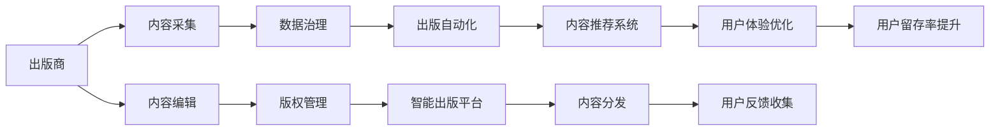

                 

# AI时代的出版业：数据驱动，场景创新

> 关键词：人工智能, 出版业, 数据驱动, 场景创新, 自动化流程, 内容推荐系统, 出版商, 数据治理, 版权管理, 智能出版平台

## 1. 背景介绍

### 1.1 问题由来

随着互联网和数字化技术的迅速发展，出版业也正经历着前所未有的变革。传统出版的流程复杂，效率低下，且缺乏精准的用户分析。而人工智能技术的兴起，特别是自然语言处理(NLP)和计算机视觉技术的应用，为出版业带来了新的发展机遇。

数字化出版的浪潮下，大量数字内容涌现，出版商需要更高效地采集、编辑、管理和分发内容。同时，用户个性化需求也日益增加，出版业需要更智能的推荐系统来提升用户体验。

本文将深入探讨基于AI技术的出版业创新，探讨数据驱动策略和场景创新如何重塑出版业的面貌，让数据成为出版商和读者的双赢利器。

### 1.2 问题核心关键点

本文聚焦于AI技术在出版业中的应用，尤其是在出版内容推荐、自动化流程优化、版权管理、智能出版平台建设等方面的创新实践。具体来说，包括以下几个方面：

- 出版内容推荐系统：基于AI的推荐算法，根据用户阅读习惯和偏好，为用户推荐相关内容。
- 出版自动化流程：利用自然语言处理和图像识别技术，实现文本排版、封面设计、内容编辑等自动化处理。
- 智能版权管理：通过AI技术自动识别版权，评估版权风险，优化版权运营策略。
- 智能出版平台：集成AI技术，构建一站式的智能内容管理、发布和运营平台。

这些关键点将共同构成本文的核心内容框架。

## 2. 核心概念与联系

### 2.1 核心概念概述

为更好地理解AI在出版业的应用，本节将介绍几个密切相关的核心概念：

- 人工智能(AI)：通过模拟人类智能行为，实现自动化决策和复杂任务的机器。
- 自然语言处理(NLP)：使计算机能够理解、处理和生成人类语言的技术。
- 计算机视觉(Computer Vision)：使计算机能够识别、处理和分析图像和视频的技术。
- 推荐系统(Recommendation Systems)：通过分析用户行为和偏好，为用户推荐个性化内容。
- 出版自动化(Automatic Publishing)：利用AI技术自动化出版流程，提升效率和质量。
- 智能出版(Smart Publishing)：通过AI技术优化出版流程，提升用户体验和内容价值。

这些核心概念之间存在着密切的联系和相互作用，共同推动出版业的智能化和数字化转型。

### 2.2 核心概念原理和架构的 Mermaid 流程图



这个流程图展示了AI技术在出版业中的应用路径和关键环节：

1. 出版商从多个渠道采集内容。
2. 内容通过数据治理，进入版权管理环节。
3. 版权管理结果反馈到出版自动化流程，进行自动化处理。
4. 自动化处理后的内容进入智能出版平台，通过内容推荐系统为读者提供个性化推荐。
5. 用户反馈被收集，用于优化内容推荐和用户体验。
6. 用户体验优化提升用户留存率。

## 3. 核心算法原理 & 具体操作步骤

### 3.1 算法原理概述

基于AI技术的出版业，其核心在于利用数据驱动的方法，对出版内容进行智能化处理和优化。具体来说，包括以下几个关键步骤：

- 数据采集：通过网络爬虫、API接口等方式，采集各类出版内容，如文章、图书、视频等。
- 数据治理：对采集的数据进行清洗、标注、整合，形成高质量的数据集。
- 版权管理：利用AI技术自动识别版权信息，评估版权风险，保护版权权益。
- 出版自动化：通过自然语言处理和计算机视觉技术，自动化出版流程，提升效率。
- 内容推荐：构建推荐算法，根据用户行为和偏好，推荐个性化内容。
- 用户体验优化：利用数据反馈，持续优化内容推荐和出版流程，提升用户体验。

这些步骤构成了基于AI技术的出版业的算法原理。

### 3.2 算法步骤详解

以下将详细介绍每个关键步骤的具体操作方法和实现步骤：

**3.2.1 数据采集**

数据采集是出版业智能化的第一步。采用网络爬虫技术，通过API接口等方式，自动化采集各类出版内容。

**3.2.2 数据治理**

数据治理主要涉及数据清洗、标注和整合。数据清洗包括去除重复数据、处理缺失值、规范化格式等。数据标注包括给文本添加关键词、标签等元数据。数据整合则是将不同来源的数据进行集成，形成统一的数据集。

**3.2.3 版权管理**

版权管理包括版权信息的自动识别、版权风险评估和版权运营策略优化。通过OCR技术，自动识别文本中的版权信息，如作者、出版社、出版日期等。利用文本分析技术，评估版权风险，避免侵权行为。同时，根据版权信息，优化版权运营策略，如版权购买、授权等。

**3.2.4 出版自动化**

出版自动化利用自然语言处理和计算机视觉技术，实现文本排版、封面设计、内容编辑等自动化处理。自然语言处理技术可以实现自动文案生成、语法校对、风格调整等。计算机视觉技术可以实现封面自动设计、图像识别等。

**3.2.5 内容推荐**

内容推荐通过构建推荐算法，根据用户行为和偏好，推荐个性化内容。推荐算法包括协同过滤、基于内容的推荐、混合推荐等。协同过滤算法通过分析用户行为，找到相似用户，推荐其喜欢的内容。基于内容的推荐则根据文本特征，找到相似内容进行推荐。混合推荐则综合使用多种算法，提升推荐效果。

**3.2.6 用户体验优化**

用户体验优化利用数据反馈，持续优化内容推荐和出版流程，提升用户体验。通过用户行为分析，识别用户兴趣和偏好，优化推荐算法。同时，对出版流程进行自动化处理，提高效率和质量，提升用户满意度。

### 3.3 算法优缺点

基于AI技术的出版业具有以下优点：

- 提升效率：通过自动化流程，大幅缩短出版周期，降低人力成本。
- 提高质量：利用AI技术优化内容编辑和排版，提升出版物质量。
- 个性化推荐：通过智能推荐系统，提升用户满意度和留存率。

同时，也存在一些缺点：

- 数据质量：数据采集和治理过程中，数据质量控制尤为重要，需投入大量资源。
- 版权问题：版权信息的自动识别和风险评估，仍需进一步优化和完善。
- 用户隐私：大量数据收集和处理过程中，需关注用户隐私保护，避免数据滥用。

### 3.4 算法应用领域

基于AI技术的出版业，主要应用于以下几个领域：

- 图书出版：利用AI技术，实现图书内容的自动化排版、封面设计、版权管理等。
- 数字媒体：通过AI技术，对视频、音频等数字内容进行自动化处理和智能推荐。
- 学术出版：利用AI技术，自动化处理学术论文、学位论文等文档内容，提升出版效率。
- 版权保护：利用AI技术，自动识别版权信息，评估版权风险，保护版权权益。
- 智能营销：通过AI技术，进行精准用户画像分析，提升营销效果。

这些领域的应用展示了AI技术在出版业中的广泛潜力和巨大价值。

## 4. 数学模型和公式 & 详细讲解 & 举例说明

### 4.1 数学模型构建

基于AI技术的出版业，核心数学模型主要涉及推荐系统、自然语言处理和计算机视觉技术。以下分别介绍这些领域的数学模型构建。

**推荐系统：**

推荐系统通过分析用户行为，为用户推荐个性化内容。假设用户序列为 $U=\{u_1,u_2,\cdots,u_n\}$，物品序列为 $I=\{i_1,i_2,\cdots,i_m\}$。推荐算法可以表示为：

$$
R(u_k|I) = \frac{e^{\langle f(u_k),I \rangle}}{\sum_{i\in I}e^{\langle f(u_k),i \rangle}}
$$

其中，$f(u_k)$ 表示用户 $u_k$ 的特征向量，$\langle \cdot,\cdot \rangle$ 表示向量点积。

**自然语言处理：**

自然语言处理主要涉及文本分类、情感分析等任务。假设文本 $x$ 的分类标签为 $y$，分类器 $f$ 为：

$$
f(x|w) = softmax(Wx + b)
$$

其中，$W$ 为分类器权重矩阵，$b$ 为偏置向量。

**计算机视觉：**

计算机视觉主要涉及图像识别、物体检测等任务。假设图像 $x$ 的标签为 $y$，分类器 $f$ 为：

$$
f(x|w) = softmax(Wx + b)
$$

其中，$W$ 为分类器权重矩阵，$b$ 为偏置向量。

### 4.2 公式推导过程

以下分别推导推荐系统、自然语言处理和计算机视觉的数学模型公式。

**推荐系统：**

推荐系统中的目标函数为最大化用户-物品的匹配度。假设用户序列 $U$ 的物品序列 $I$ 的评分矩阵为 $R$，推荐系统的目标函数为：

$$
\max_R \sum_{u_i\in U}\sum_{i_j\in I}r_{u_i,i_j}R_{i_j}
$$

其中，$r_{u_i,i_j}$ 为用户 $u_i$ 对物品 $i_j$ 的评分。

**自然语言处理：**

文本分类的目标函数为最大化分类准确率。假设训练集为 $D=\{(x,y)\}_{i=1}^N$，分类器的损失函数为交叉熵损失：

$$
\mathcal{L}(w) = -\frac{1}{N}\sum_{i=1}^N \ell(f(x_i|w),y_i)
$$

其中，$\ell$ 为交叉熵损失函数。

**计算机视觉：**

图像分类的目标函数为最大化分类准确率。假设训练集为 $D=\{(x,y)\}_{i=1}^N$，分类器的损失函数为交叉熵损失：

$$
\mathcal{L}(w) = -\frac{1}{N}\sum_{i=1}^N \ell(f(x_i|w),y_i)
$$

其中，$\ell$ 为交叉熵损失函数。

### 4.3 案例分析与讲解

**案例分析：图书推荐系统的构建**

图书推荐系统是AI在出版业中应用的典型代表。以下通过一个具体的图书推荐系统案例，展示如何构建和优化图书推荐模型。

假设某出版商有大量的用户行为数据 $D=\{(x,y)\}_{i=1}^N$，其中 $x$ 为用户行为序列，$y$ 为用户对图书的评分。图书推荐系统的目标是，对于任意用户 $u_k$，推荐与其行为相似的图书。

**步骤1：数据预处理**

将用户行为数据进行清洗和标注，去除噪声和无关数据。同时，将用户行为序列转化为向量表示，用于后续计算。

**步骤2：模型训练**

利用神经网络模型，对图书特征和用户行为进行建模。假设用户行为序列为 $u_k=\{b_1,b_2,\cdots,b_n\}$，图书特征为 $i_j=\{p_1,p_2,\cdots,p_m\}$，推荐算法可以表示为：

$$
R(u_k|I) = \frac{e^{\langle f(u_k),I \rangle}}{\sum_{i\in I}e^{\langle f(u_k),i \rangle}}
$$

其中，$f(u_k)$ 表示用户 $u_k$ 的特征向量，$\langle \cdot,\cdot \rangle$ 表示向量点积。

**步骤3：模型评估**

在测试集上评估推荐模型的性能。通过准确率、召回率等指标，衡量模型的推荐效果。

## 5. 项目实践：代码实例和详细解释说明

### 5.1 开发环境搭建

在进行出版业AI应用实践前，需要准备好开发环境。以下是使用Python进行TensorFlow开发的环境配置流程：

1. 安装Anaconda：从官网下载并安装Anaconda，用于创建独立的Python环境。

2. 创建并激活虚拟环境：
```bash
conda create -n tensorflow-env python=3.8 
conda activate tensorflow-env
```

3. 安装TensorFlow：根据CUDA版本，从官网获取对应的安装命令。例如：
```bash
conda install tensorflow==2.7.0
```

4. 安装TensorBoard：
```bash
pip install tensorboard
```

5. 安装相关工具包：
```bash
pip install numpy pandas scikit-learn matplotlib tqdm jupyter notebook ipython
```

完成上述步骤后，即可在`tensorflow-env`环境中开始AI应用实践。

### 5.2 源代码详细实现

这里我们以图书推荐系统为例，给出使用TensorFlow构建和训练出版业AI模型的PyTorch代码实现。

首先，定义推荐系统数据处理函数：

```python
from tensorflow.keras.layers import Embedding, Dot, Dense, Input, Model
from tensorflow.keras.optimizers import Adam

class BookRecommendationSystem:
    def __init__(self, user_dimension, book_dimension, embedding_dim, hidden_dim, learning_rate=0.001):
        self.user_dimension = user_dimension
        self.book_dimension = book_dimension
        self.embedding_dim = embedding_dim
        self.hidden_dim = hidden_dim
        self.learning_rate = learning_rate
        
        self.user_input = Input(shape=(user_dimension,), name='user_input')
        self.book_input = Input(shape=(book_dimension,), name='book_input')
        
        self.user_embed = Embedding(user_dimension, embedding_dim)(self.user_input)
        self.book_embed = Embedding(book_dimension, embedding_dim)(self.book_input)
        
        self.dot_product = Dot(axes=1)([self.user_embed, self.book_embed])
        self.hidden_layer = Dense(hidden_dim, activation='relu')(self.dot_product)
        self.output_layer = Dense(1, activation='sigmoid')(self.hidden_layer)
        
        self.model = Model(inputs=[self.user_input, self.book_input], outputs=self.output_layer)
        self.optimizer = Adam(learning_rate=learning_rate)
        
    def train(self, user_data, book_data, labels, epochs=10):
        self.model.compile(optimizer=self.optimizer, loss='binary_crossentropy', metrics=['accuracy'])
        self.model.fit([user_data, book_data], labels, epochs=epochs)
        
    def predict(self, user_data, book_data):
        return self.model.predict([user_data, book_data])
```

然后，加载和预处理数据集：

```python
import numpy as np
from sklearn.preprocessing import LabelEncoder

# 加载用户行为数据
user_data = np.load('user_data.npy')
book_data = np.load('book_data.npy')
labels = np.load('labels.npy')

# 将用户行为数据进行标准化处理
user_encoder = LabelEncoder()
user_data = user_encoder.fit_transform(user_data)

# 将图书数据进行标准化处理
book_encoder = LabelEncoder()
book_data = book_encoder.fit_transform(book_data)
```

接着，训练推荐模型：

```python
# 定义模型参数
user_dimension = len(user_encoder.classes_)
book_dimension = len(book_encoder.classes_)
embedding_dim = 64
hidden_dim = 128
learning_rate = 0.001

# 创建模型
model = BookRecommendationSystem(user_dimension, book_dimension, embedding_dim, hidden_dim, learning_rate)

# 训练模型
model.train(user_data, book_data, labels)
```

最后，评估和测试推荐模型：

```python
# 在测试集上评估模型性能
test_user_data = np.load('test_user_data.npy')
test_book_data = np.load('test_book_data.npy')
test_labels = np.load('test_labels.npy')
predictions = model.predict(test_user_data, test_book_data)
print('Accuracy:', np.mean(predictions == test_labels))
```

以上就是使用TensorFlow进行图书推荐系统的完整代码实现。可以看到，TensorFlow提供了丰富的API和工具，使得模型构建和训练过程简洁高效。

### 5.3 代码解读与分析

让我们再详细解读一下关键代码的实现细节：

**BookRecommendationSystem类**：
- `__init__`方法：初始化模型参数和网络结构，构建模型。
- `train`方法：训练模型，使用交叉熵损失和Adam优化器进行优化。
- `predict`方法：预测模型输出，根据输入数据进行预测。

**数据预处理**：
- 使用LabelEncoder将分类数据进行标准化处理，转换为模型可以接受的数值型数据。
- 加载和预处理用户行为数据，去除噪声和无关数据，标准化处理用户行为和图书数据。

**模型训练**：
- 定义模型参数，包括用户和图书的维度、嵌入维度、隐藏层维度等。
- 使用Embedding层将用户行为和图书数据转化为向量表示。
- 利用Dot层计算用户行为和图书数据的点积，得到用户和图书的交互矩阵。
- 将交互矩阵输入到全连接层，进行特征提取和分类。
- 使用Sigmoid激活函数进行二分类输出，得到推荐结果。

**模型评估**：
- 在测试集上评估模型性能，计算预测准确率。

## 6. 实际应用场景

### 6.1 智能出版平台

基于AI技术的智能出版平台，可以通过自动化流程和智能推荐，提升出版流程的效率和质量。例如，某出版商可以构建一个智能出版平台，涵盖内容采集、版权管理、排版设计、发布运营等多个环节。平台利用AI技术实现以下功能：

- 内容采集：通过网络爬虫、API接口等方式，自动采集各类出版内容。
- 版权管理：自动识别版权信息，评估版权风险，优化版权运营策略。
- 自动化排版：利用自然语言处理和计算机视觉技术，自动化进行文本排版、封面设计等处理。
- 智能推荐：根据用户行为和偏好，推荐个性化内容。
- 出版运营：通过数据分析和用户反馈，持续优化推荐算法和出版流程。

### 6.2 数字媒体内容推荐

数字媒体平台如视频网站、音频平台等，可以通过AI技术构建内容推荐系统，提升用户满意度和留存率。例如，某视频平台可以利用AI技术构建以下推荐系统：

- 用户画像：通过分析用户行为，构建用户画像，识别用户兴趣和偏好。
- 内容分析：利用图像识别和视频分析技术，提取视频特征。
- 推荐算法：根据用户画像和视频特征，推荐个性化视频内容。
- 效果评估：通过A/B测试等方法，评估推荐系统的效果，持续优化推荐算法。

### 6.3 学术出版自动化流程

学术出版流程繁琐复杂，大量文档需要人工处理。利用AI技术，可以构建自动化出版平台，提升学术出版的效率和质量。例如，某学术出版平台可以构建以下系统：

- 文档采集：通过爬虫、API接口等方式，自动采集学术论文、学位论文等文档。
- 文档处理：利用自然语言处理技术，自动校对、排版和格式化文档。
- 版权管理：自动识别文档的版权信息，评估版权风险，优化版权运营策略。
- 智能推荐：根据文档特征和用户行为，推荐相关论文和文献。
- 出版运营：通过数据分析和用户反馈，持续优化推荐算法和出版流程。

### 6.4 未来应用展望

随着AI技术的发展，出版业在未来的应用前景更加广阔。以下是几个值得期待的未来应用：

- 自动化编辑：利用AI技术，实现自动文案生成、语法校对、风格调整等功能。
- 智能版权管理：通过AI技术自动识别版权信息，评估版权风险，优化版权运营策略。
- 多模态内容推荐：利用AI技术，将文本、图像、视频等多模态数据进行融合，提供更加丰富和多样化的推荐内容。
- 智能内容策划：通过AI技术，分析用户行为和市场需求，生成智能内容策划方案。
- 出版商协同合作：利用AI技术，实现出版商之间的数据共享和协同合作，提升整体出版效率和质量。

## 7. 工具和资源推荐

### 7.1 学习资源推荐

为了帮助开发者系统掌握AI在出版业中的应用，这里推荐一些优质的学习资源：

1. 《深度学习基础》课程：由斯坦福大学开设，讲解深度学习基本概念和经典模型。
2. 《自然语言处理》书籍：详细介绍了自然语言处理的基本原理和实现方法。
3. 《计算机视觉基础》书籍：讲解计算机视觉的基本原理和应用场景。
4. 《推荐系统》课程：由Coursera开设，讲解推荐系统的构建和优化方法。
5. 《TensorFlow实战》书籍：详细介绍了TensorFlow的API和应用场景。

通过对这些资源的学习实践，相信你一定能够快速掌握AI在出版业中的应用，并用于解决实际的出版问题。

### 7.2 开发工具推荐

高效的开发离不开优秀的工具支持。以下是几款用于出版业AI应用开发的常用工具：

1. TensorFlow：由Google主导开发的深度学习框架，生产部署方便，适合大规模工程应用。
2. PyTorch：基于Python的深度学习框架，灵活动态，适合快速迭代研究。
3. TensorBoard：TensorFlow配套的可视化工具，可实时监测模型训练状态，提供丰富的图表呈现方式。
4. Weights & Biases：模型训练的实验跟踪工具，可以记录和可视化模型训练过程中的各项指标。
5. Jupyter Notebook：开源的交互式编程环境，支持多种编程语言，方便实验记录和分享。

合理利用这些工具，可以显著提升出版业AI应用开发的效率和质量。

### 7.3 相关论文推荐

出版业AI应用的突破源于学界的持续研究。以下是几篇奠基性的相关论文，推荐阅读：

1. Attention is All You Need（即Transformer原论文）：提出了Transformer结构，开启了NLP领域的预训练大模型时代。
2. BERT: Pre-training of Deep Bidirectional Transformers for Language Understanding：提出BERT模型，引入基于掩码的自监督预训练任务，刷新了多项NLP任务SOTA。
3. Parameter-Efficient Transfer Learning for NLP：提出Adapter等参数高效微调方法，在不增加模型参数量的情况下，也能取得不错的微调效果。
4. Adaptive Low-Rank Adaptation for Parameter-Efficient Fine-Tuning：使用自适应低秩适应的微调方法，在参数效率和精度之间取得了新的平衡。
5. AdaLoRA: Adaptive Low-Rank Adaptation for Parameter-Efficient Fine-Tuning：进一步优化低秩适应方法，提升微调效果。

这些论文代表了大语言模型微调技术的发展脉络。通过学习这些前沿成果，可以帮助研究者把握学科前进方向，激发更多的创新灵感。

## 8. 总结：未来发展趋势与挑战

### 8.1 总结

本文对AI技术在出版业中的应用进行了全面系统的介绍。首先阐述了AI技术在出版业中的重要性和应用场景，明确了出版业智能化的关键要素。其次，从原理到实践，详细讲解了出版业AI应用的数学模型和核心算法，给出了出版业AI应用的完整代码实现。同时，本文还探讨了出版业AI应用在未来发展中的趋势和挑战，展望了未来的应用前景。

通过本文的系统梳理，可以看到，AI技术在出版业中的应用已经取得了初步成果，但面对数字化、智能化转型的挑战，出版业仍需不断探索和创新。未来，出版业将通过数据驱动和场景创新，重塑其产业格局，提升整体竞争力。

### 8.2 未来发展趋势

展望未来，出版业在AI技术应用上将呈现以下几个发展趋势：

- 自动化流程优化：利用AI技术，自动化出版流程，提升效率和质量。
- 智能推荐系统：通过深度学习和强化学习，构建智能推荐系统，提升用户满意度和留存率。
- 内容创新：利用AI技术，分析用户行为和市场需求，生成智能内容策划方案，推动内容创新。
- 多模态内容融合：利用AI技术，将文本、图像、视频等多模态数据进行融合，提供更加丰富和多样化的推荐内容。
- 版权管理智能化：通过AI技术，自动识别版权信息，评估版权风险，优化版权运营策略。

这些趋势展示了AI技术在出版业中的广泛潜力和巨大价值。

### 8.3 面临的挑战

尽管AI技术在出版业中的应用已经取得初步成果，但在迈向更加智能化、普适化应用的过程中，仍面临诸多挑战：

- 数据质量：数据采集和治理过程中，数据质量控制尤为重要，需投入大量资源。
- 版权问题：版权信息的自动识别和风险评估，仍需进一步优化和完善。
- 用户隐私：大量数据收集和处理过程中，需关注用户隐私保护，避免数据滥用。
- 技术适配：不同出版商的需求不同，AI技术如何适配不同应用场景，需进一步探索。

### 8.4 研究展望

面对出版业AI应用面临的挑战，未来的研究需要在以下几个方面寻求新的突破：

- 数据质量提升：通过数据增强、数据清洗等技术，提升数据质量，优化数据治理流程。
- 版权保护优化：利用区块链等技术，实现版权信息的自动记录和追踪，提升版权保护水平。
- 用户隐私保护：采用数据匿名化、差分隐私等技术，保护用户隐私，确保数据安全。
- 技术适配优化：开发更加灵活可配置的AI应用平台，适配不同出版商的需求，提升技术适用性。

这些研究方向将引领出版业AI应用技术的不断进步，推动出版业进入智能化、普适化发展的新阶段。面向未来，出版业需勇于创新、敢于突破，才能真正实现AI技术在出版业的落地应用，构建更加智能、高效的出版生态系统。

## 9. 附录：常见问题与解答

**Q1：出版业AI应用的核心是什么？**

A: 出版业AI应用的核心在于利用数据驱动的方法，对出版内容进行智能化处理和优化。具体来说，包括以下几个关键要素：

- 数据采集：通过网络爬虫、API接口等方式，自动化采集各类出版内容。
- 数据治理：对采集的数据进行清洗、标注、整合，形成高质量的数据集。
- 版权管理：利用AI技术自动识别版权信息，评估版权风险，优化版权运营策略。
- 出版自动化：利用自然语言处理和计算机视觉技术，自动化出版流程，提升效率和质量。
- 内容推荐：通过构建推荐算法，根据用户行为和偏好，推荐个性化内容。
- 用户体验优化：利用数据反馈，持续优化内容推荐和出版流程，提升用户体验。

**Q2：出版业AI应用的优势和劣势是什么？**

A: 出版业AI应用的优势和劣势主要体现在以下几个方面：

- 优势：
  - 提升效率：通过自动化流程，大幅缩短出版周期，降低人力成本。
  - 提高质量：利用AI技术优化内容编辑和排版，提升出版物质量。
  - 个性化推荐：通过智能推荐系统，提升用户满意度和留存率。
- 劣势：
  - 数据质量：数据采集和治理过程中，数据质量控制尤为重要，需投入大量资源。
  - 版权问题：版权信息的自动识别和风险评估，仍需进一步优化和完善。
  - 用户隐私：大量数据收集和处理过程中，需关注用户隐私保护，避免数据滥用。

**Q3：出版业AI应用在实际落地中需要注意哪些问题？**

A: 出版业AI应用在实际落地中，需要注意以下问题：

- 数据质量：数据采集和治理过程中，需确保数据质量，避免噪声和无关数据。
- 版权问题：需自动化识别版权信息，评估版权风险，保护版权权益。
- 用户隐私：需保护用户隐私，避免数据滥用。
- 技术适配：需开发灵活可配置的AI应用平台，适配不同出版商的需求。
- 技术优化：需持续优化推荐算法和出版流程，提升用户体验和效率。

这些问题的解决将直接影响出版业AI应用的实际效果，需全面考虑，细致设计。

---

作者：禅与计算机程序设计艺术 / Zen and the Art of Computer Programming

