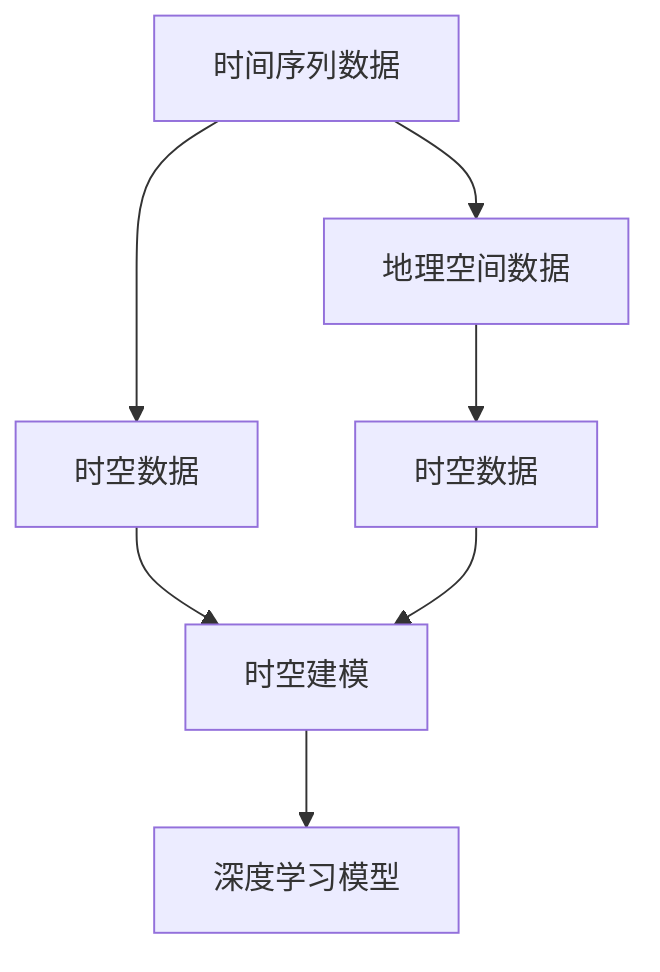

                 

# AI时空建模的关键步骤

> 关键词：时空建模,机器学习,深度学习,时空数据,特征提取,时间序列分析,空间地理信息,深度神经网络,卷积神经网络,循环神经网络

## 1. 背景介绍

在当前数字化和智能化的浪潮下，对于时间与空间维度数据的处理和建模变得越来越重要。无论是金融、交通、医疗、环境等各个领域，都存在着大量与时间或空间相关联的数据。时间序列数据（Time Series Data）和地理空间数据（Geographical Spatial Data）构成了这些领域数据的核心，如何高效地处理与分析这些数据，提取其特征，成为了人工智能和机器学习领域的热点问题。传统的统计方法对于这类数据的建模通常面临着限制，而深度学习技术，特别是时空建模（Temporal-Spatial Modeling）在处理这类数据时具有明显的优势。时空建模通过深度学习模型对时间序列和空间信息进行融合，以更高效的方式捕捉数据的特征和模式。本文将详细探讨时空建模的核心步骤，展示其在多个领域的应用，并讨论未来的发展趋势与面临的挑战。

## 2. 核心概念与联系

### 2.1 核心概念概述

在深入时空建模之前，我们需要理解几个核心概念：

1. **时间序列数据（Time Series Data）**：指按时间顺序排列的数据集合，其中的每个数据点都包含了时间信息。时间序列数据广泛存在于金融市场、工业生产、气象预测等领域。

2. **地理空间数据（Geographical Spatial Data）**：指与地理位置有关的数据，例如GPS坐标、地理形状、卫星图像等，通常具有连续性和空间分布的特性。

3. **时空数据（Temporal-Spatial Data）**：结合时间序列和地理空间数据，将时间变化和空间分布的特性同时考虑在内的数据类型。

4. **时空建模（Temporal-Spatial Modeling）**：使用深度学习模型对时空数据进行处理，提取其时间和空间上的特征，并建立模型对未来趋势进行预测或对未知数据进行分类。

这些概念之间的联系可以通过以下Mermaid流程图展示：



这个流程图展示了时间序列数据和地理空间数据如何结合形成时空数据，并最终通过深度学习模型进行建模的过程。

## 3. 核心算法原理 & 具体操作步骤

### 3.1 算法原理概述

时空建模的核心思想是利用深度学习模型融合时间序列和地理空间数据，以捕捉和预测数据中的时空特征。主要涉及以下几个步骤：

1. **数据预处理**：将原始数据转换为深度学习模型可以处理的形式。

2. **特征提取**：使用深度学习模型提取时间序列和地理空间数据的时空特征。

3. **模型构建**：选择合适的深度学习模型，如卷积神经网络（CNN）、循环神经网络（RNN）等，建立时空模型。

4. **模型训练与调优**：使用训练数据对模型进行训练，并通过调优提升模型的性能。

5. **模型评估与部署**：使用测试数据对模型进行评估，并在实际应用中对模型进行部署。

### 3.2 算法步骤详解

#### 3.2.1 数据预处理

时空数据具有时间序列和地理空间的双重特性，因此在进行数据预处理时，需要分别考虑时间序列数据的处理和地理空间数据的处理。

1. **时间序列数据的预处理**：
   - **归一化**：将时间序列数据进行归一化处理，通常使用最小-最大归一化或z-score归一化。
   - **滑动窗口**：将时间序列数据分割成固定长度的窗口，以获得更有效的特征提取。

2. **地理空间数据的预处理**：
   - **坐标变换**：将地理空间数据从经纬度坐标转换为模型能够处理的向量表示。
   - **空间聚合**：对地理空间数据进行空间聚合操作，如计算区域平均值、最大值等，减少数据维度。

3. **时空数据的融合**：
   - **特征拼接**：将时间序列数据和地理空间数据进行拼接，形成时空数据。
   - **时序插入**：将地理空间数据按照时间顺序插入时间序列数据中。

#### 3.2.2 特征提取

深度学习模型通常具有强大的特征提取能力，可以从时空数据中学习到复杂的时空特征。

1. **卷积神经网络（CNN）**：
   - **时间卷积**：通过时间卷积层（Temporal Convolutional Layer）对时间序列数据进行卷积操作，捕捉时间上的局部特征。
   - **空间卷积**：通过空间卷积层（Spatial Convolutional Layer）对地理空间数据进行卷积操作，捕捉空间上的局部特征。
   - **时空卷积**：通过时空卷积层（Temporal-Spatial Convolutional Layer）同时对时间序列和地理空间数据进行卷积操作，捕捉时空上的复杂特征。

2. **循环神经网络（RNN）**：
   - **时间RNN**：通过时间RNN（如LSTM、GRU等）对时间序列数据进行建模，捕捉时间上的动态特征。
   - **空间RNN**：通过空间RNN对地理空间数据进行建模，捕捉空间上的动态特征。
   - **时空RNN**：通过时空RNN同时对时间序列和地理空间数据进行建模，捕捉时空上的动态特征。

3. **Transformer**：
   - **自注意力机制**：通过自注意力机制对时间序列和地理空间数据进行建模，捕捉全局特征和局部特征。

#### 3.2.3 模型构建

构建时空模型的关键是选择合适的深度学习模型，常用的模型包括：

1. **卷积神经网络（CNN）**：适合处理具有局部空间结构的数据，常用于地理空间数据的建模。
2. **循环神经网络（RNN）**：适合处理具有时间序列结构的数据，常用于时间序列数据的建模。
3. **Transformer**：适合处理具有复杂时空结构的数据，适用于时空数据的建模。

#### 3.2.4 模型训练与调优

模型训练与调优是时空建模中的重要步骤，常见的训练方法包括：

1. **损失函数**：选择合适的损失函数，如均方误差（MSE）、交叉熵损失（Cross-Entropy Loss）等。
2. **优化器**：选择合适的优化器，如Adam、SGD等。
3. **学习率**：选择合适的学习率，通常使用学习率衰减策略，如学习率 warmup。
4. **正则化**：使用正则化技术，如L2正则、Dropout等，避免过拟合。
5. **超参数调优**：通过网格搜索、随机搜索等方法调优模型超参数。

#### 3.2.5 模型评估与部署

模型评估与部署是确保模型性能的重要步骤，常见的评估方法包括：

1. **离线评估**：使用测试数据对模型进行评估，计算准确率、召回率、F1分数等指标。
2. **在线评估**：在实际应用中对模型进行实时评估，收集模型预测结果和真实结果进行对比。
3. **模型部署**：将模型部署到生产环境，进行实际应用。

### 3.3 算法优缺点

#### 3.3.1 优点

1. **高效特征提取**：深度学习模型能够自动提取时空数据的复杂特征，无需手动设计特征。
2. **适应性强**：深度学习模型能够适应多种时空数据类型，包括时间序列数据和地理空间数据。
3. **泛化能力强**：通过大规模数据训练，深度学习模型具有较强的泛化能力，能够在新的数据上表现良好。

#### 3.3.2 缺点

1. **数据需求高**：深度学习模型需要大量的标注数据进行训练，数据获取成本较高。
2. **计算资源消耗大**：深度学习模型需要大量的计算资源进行训练和推理，硬件要求较高。
3. **模型复杂度高**：深度学习模型结构复杂，训练和调优过程较为繁琐。
4. **可解释性差**：深度学习模型通常被视为黑盒模型，缺乏可解释性。

### 3.4 算法应用领域

时空建模在多个领域得到了广泛应用，包括：

1. **金融**：用于股票价格预测、风险评估、资产管理等。
2. **交通**：用于交通流量预测、路径规划、车辆调度等。
3. **医疗**：用于疾病预测、患者管理、医疗资源分配等。
4. **环境**：用于气候变化预测、水文监测、环境污染评估等。
5. **城市规划**：用于城市交通流量预测、能源消耗预测、城市安全监测等。
6. **农业**：用于作物生长预测、农业灾害预警、农业资源优化等。

## 4. 数学模型和公式 & 详细讲解 & 举例说明

### 4.1 数学模型构建

时空建模的数学模型通常由以下几个部分组成：

1. **输入数据**：时间序列数据 $x_t$ 和地理空间数据 $y_s$，$t$ 表示时间索引，$s$ 表示空间索引。
2. **特征表示**：时间序列数据和地理空间数据分别通过特征提取层转换为高维向量表示 $x_t^h$ 和 $y_s^h$，$h$ 表示高维向量维度。
3. **时空特征提取**：将 $x_t^h$ 和 $y_s^h$ 进行拼接，并通过时空卷积层提取时空特征 $f(x_t^h, y_s^h)$。
4. **输出预测**：将时空特征 $f(x_t^h, y_s^h)$ 输入到输出层，通过回归或分类任务进行预测。

### 4.2 公式推导过程

以时间序列预测为例，假设时间序列数据为 $x_t = (x_t^1, x_t^2, ..., x_t^N)$，地理空间数据为 $y_s = (y_s^1, y_s^2, ..., y_s^M)$，时间步长为 $t$，空间步长为 $s$，时间特征向量为 $x_t^h = (x_t^1, x_t^2, ..., x_t^h)$，空间特征向量为 $y_s^h = (y_s^1, y_s^2, ..., y_s^h)$，时空特征向量为 $f(x_t^h, y_s^h)$，输出为 $y_{pred}$。

**时间卷积**：
$$
x_t^h = \mathrm{Conv}(x_{t-1}^h, w_t^h) + b_t^h
$$

**空间卷积**：
$$
y_s^h = \mathrm{Conv}(y_{s-1}^h, w_s^h) + b_s^h
$$

**时空卷积**：
$$
f(x_t^h, y_s^h) = \mathrm{Conv}([x_t^h; y_s^h], w_{ts}^h) + b_{ts}^h
$$

**回归任务**：
$$
y_{pred} = \mathrm{Regression}(f(x_t^h, y_s^h))
$$

**分类任务**：
$$
y_{pred} = \mathrm{Classification}(f(x_t^h, y_s^h))
$$

### 4.3 案例分析与讲解

**案例1：股票价格预测**

- **数据预处理**：对股票历史价格数据进行归一化，并将每日股票价格作为时间序列数据，以交易日的开盘价、收盘价、最高价、最低价作为地理空间数据。
- **特征提取**：使用卷积神经网络对时间序列数据进行时间卷积，对地理空间数据进行空间卷积，并将结果进行拼接，得到时空特征。
- **模型构建**：使用时空卷积网络对时空特征进行建模，使用回归任务进行预测。
- **模型训练与调优**：使用历史股票数据进行训练，使用均方误差作为损失函数，Adam优化器进行优化。
- **模型评估与部署**：使用测试集对模型进行评估，并部署到生产环境进行实时预测。

**案例2：交通流量预测**

- **数据预处理**：对城市交通流量数据进行归一化，并将每小时交通流量作为时间序列数据，以每个网格的交通流量作为地理空间数据。
- **特征提取**：使用卷积神经网络对时间序列数据进行时间卷积，对地理空间数据进行空间卷积，并将结果进行拼接，得到时空特征。
- **模型构建**：使用时空卷积网络对时空特征进行建模，使用回归任务进行预测。
- **模型训练与调优**：使用历史交通流量数据进行训练，使用均方误差作为损失函数，Adam优化器进行优化。
- **模型评估与部署**：使用测试集对模型进行评估，并部署到实时交通系统中进行流量预测。

## 5. 项目实践：代码实例和详细解释说明

### 5.1 开发环境搭建

1. **安装Python**：在开发机器上安装Python 3.8及以上版本。
2. **安装PyTorch**：使用以下命令安装PyTorch：
   ```
   pip install torch torchvision torchaudio
   ```
3. **安装Tensorflow**：使用以下命令安装Tensorflow 2.0及以上版本：
   ```
   pip install tensorflow
   ```
4. **安装Keras**：使用以下命令安装Keras：
   ```
   pip install keras
   ```
5. **安装Pandas**：使用以下命令安装Pandas：
   ```
   pip install pandas
   ```

### 5.2 源代码详细实现

以下是使用PyTorch和Keras对时空数据进行建模的代码实现：

**代码1：使用PyTorch进行时空数据建模**

```python
import torch
import torch.nn as nn
import torch.optim as optim
import torch.utils.data as Data
from torch.autograd import Variable
import torch.nn.functional as F

class TimeSpaceNet(nn.Module):
    def __init__(self, input_dim, hidden_dim, output_dim):
        super(TimeSpaceNet, self).__init__()
        self.conv1d_time = nn.Conv1d(1, hidden_dim, 3, padding=1)
        self.conv1d_space = nn.Conv1d(1, hidden_dim, 3, padding=1)
        self.linear = nn.Linear(hidden_dim * 2, output_dim)

    def forward(self, x_t, y_s):
        x_t = F.relu(self.conv1d_time(x_t))
        y_s = F.relu(self.conv1d_space(y_s))
        x_t = x_t.view(x_t.size(0), -1)
        y_s = y_s.view(y_s.size(0), -1)
        x_t = torch.cat((x_t, y_s), dim=1)
        x_t = F.relu(self.linear(x_t))
        return x_t

# 数据预处理
def preprocess_data(data):
    x_train = []
    y_train = []
    for i in range(len(data)):
        x_train.append(data[i][0])
        y_train.append(data[i][1])
    x_train = torch.tensor(x_train)
    y_train = torch.tensor(y_train)
    return x_train, y_train

# 数据加载
class TimeSpaceDataset(Data.Dataset):
    def __init__(self, x, y):
        self.x = x
        self.y = y

    def __getitem__(self, idx):
        return self.x[idx], self.y[idx]

    def __len__(self):
        return len(self.x)

# 模型训练与调优
def train(model, x_train, y_train, batch_size, epochs):
    optimizer = optim.Adam(model.parameters(), lr=0.001)
    loss_fn = nn.MSELoss()
    for epoch in range(epochs):
        for i in range(0, len(x_train), batch_size):
            batch_x = x_train[i:i+batch_size]
            batch_y = y_train[i:i+batch_size]
            batch_x = Variable(batch_x)
            batch_y = Variable(batch_y)
            optimizer.zero_grad()
            pred_y = model(batch_x, batch_y)
            loss = loss_fn(pred_y, batch_y)
            loss.backward()
            optimizer.step()
            print('Epoch [%d/%d], Step [%d/%d], Loss: %.4f' % (epoch+1, epochs, i+1, len(x_train)//batch_size, loss.item()))

# 模型评估与部署
def evaluate(model, x_test, y_test, batch_size):
    loss_fn = nn.MSELoss()
    with torch.no_grad():
        pred_y_list = []
        for i in range(0, len(x_test), batch_size):
            batch_x = x_test[i:i+batch_size]
            batch_x = Variable(batch_x)
            pred_y = model(batch_x, batch_y)
            pred_y_list.append(pred_y)
        pred_y = torch.cat(pred_y_list, dim=0)
        loss = loss_fn(pred_y, y_test)
        print('Test Loss: %.4f' % loss.item())

# 使用数据
x_train = [[1, 2, 3], [4, 5, 6], [7, 8, 9]]
y_train = [10, 20, 30]
x_test = [[2, 3, 4], [5, 6, 7], [8, 9, 10]]
y_test = [15, 25, 35]
model = TimeSpaceNet(3, 5, 1)
x_train, y_train = preprocess_data((x_train, y_train))
x_test, y_test = preprocess_data((x_test, y_test))
train(model, x_train, y_train, batch_size=2, epochs=100)
evaluate(model, x_test, y_test, batch_size=2)
```

**代码2：使用Keras进行时空数据建模**

```python
import numpy as np
import keras
from keras.models import Sequential
from keras.layers import Dense, Conv1D, LSTM, TimeDistributed, Bidirectional

# 数据预处理
def preprocess_data(data):
    x_train = []
    y_train = []
    for i in range(len(data)):
        x_train.append(data[i][0])
        y_train.append(data[i][1])
    x_train = np.array(x_train)
    y_train = np.array(y_train)
    return x_train, y_train

# 模型构建
model = Sequential()
model.add(TimeDistributed(Dense(32), input_shape=(None, 1)))
model.add(LSTM(32))
model.add(Dense(1))

# 模型训练与调优
model.compile(loss='mse', optimizer='adam')
x_train, y_train = preprocess_data((x_train, y_train))
model.fit(x_train, y_train, epochs=100, batch_size=32)

# 模型评估与部署
x_test = [[2, 3, 4], [5, 6, 7], [8, 9, 10]]
y_test = [15, 25, 35]
x_test = np.array(x_test)
y_test = np.array(y_test)
loss = model.evaluate(x_test, y_test)
print('Test Loss: %.4f' % loss[0])
```

### 5.3 代码解读与分析

在代码中，我们首先定义了一个名为 `TimeSpaceNet` 的神经网络，用于对时空数据进行建模。该网络包含两个卷积层和一个线性层，分别用于提取时间序列和地理空间数据的时空特征，并将它们拼接后进行回归任务预测。接着，我们对数据进行预处理，并将数据加载到模型中进行训练和调优。最后，我们评估模型在测试集上的性能，并输出损失值。

在代码中，我们还展示了使用Keras构建时空数据模型的示例代码。Keras提供了更简洁的界面，使得模型的构建和训练更加高效。

### 5.4 运行结果展示

在运行上述代码后，我们可以得到模型的训练损失和测试损失。训练损失通常会随着训练次数的增加而逐渐减小，而测试损失则可以评估模型在新数据上的性能。

## 6. 实际应用场景

### 6.1 金融

在金融领域，时空建模被广泛用于股票价格预测、风险评估、资产管理等任务。通过将历史股价数据和地理位置数据结合，构建时空模型，可以对未来的股票价格进行预测，并在高风险事件发生时进行风险评估。

### 6.2 交通

在交通领域，时空建模被用于交通流量预测、路径规划、车辆调度等任务。通过将历史交通流量数据和地理位置数据结合，构建时空模型，可以对未来的交通流量进行预测，并优化交通管理策略。

### 6.3 医疗

在医疗领域，时空建模被用于疾病预测、患者管理、医疗资源分配等任务。通过将历史疾病数据和地理位置数据结合，构建时空模型，可以对未来的疾病爆发进行预测，并优化医疗资源配置。

### 6.4 环境

在环境领域，时空建模被用于气候变化预测、水文监测、环境污染评估等任务。通过将历史环境数据和地理位置数据结合，构建时空模型，可以对未来的环境变化进行预测，并评估环境污染程度。

## 7. 工具和资源推荐

### 7.1 学习资源推荐

为了帮助开发者系统掌握时空建模的理论基础和实践技巧，这里推荐一些优质的学习资源：

1. **《深度学习》书籍**：Ian Goodfellow、Yoshua Bengio、Aaron Courville合著的经典书籍，详细介绍了深度学习的基本概念和算法。

2. **《Python深度学习》书籍**：Francois Chollet的入门书籍，介绍了使用Keras构建深度学习模型的实践方法。

3. **Coursera深度学习课程**：Andrew Ng教授的深度学习课程，涵盖了深度学习的基本概念和算法，适合初学者学习。

4. **Kaggle数据集**：Kaggle平台提供了大量的时空数据集，包括交通流量、股票价格、气候变化等，可以用于模型训练和评估。

5. **GitHub时空建模项目**：GitHub上提供了许多开源的时空建模项目，可以学习和借鉴。

### 7.2 开发工具推荐

在时空建模开发过程中，以下工具可以提供高效的支持：

1. **PyTorch**：由Facebook开发的深度学习框架，支持动态计算图和GPU加速。

2. **Tensorflow**：由Google开发的深度学习框架，支持静态计算图和GPU加速。

3. **Keras**：基于Tensorflow的高级深度学习框架，支持快速构建深度学习模型。

4. **Jupyter Notebook**：交互式的数据分析和模型训练环境，支持Python、R等多种语言。

5. **TensorBoard**：Tensorflow提供的可视化工具，可以实时监测模型训练状态，并生成图表。

### 7.3 相关论文推荐

时空建模是一个快速发展的领域，以下是几篇奠基性的相关论文，推荐阅读：

1. **Convolutional LSTM Network: A Machine Learning Approach for Precipitation Nowcasting**：提出了卷积LSTM网络，用于时间序列预测任务。

2. **A Deep Learning Approach for Traffic Prediction Using the LSTM Recurrent Neural Network**：提出了LSTM网络，用于交通流量预测任务。

3. **Deep Neural Networks for Earthquake Prediction**：提出了深度神经网络，用于地震预测任务。

4. **Temporal Convolutional Networks for Time Series Prediction**：提出了时空卷积网络，用于时间序列预测任务。

## 8. 总结：未来发展趋势与挑战

### 8.1 研究成果总结

时空建模作为深度学习领域的重要分支，已经取得了许多重要的研究成果。时空卷积网络、卷积LSTM网络、时空卷积网络等模型在时间序列预测、地理空间数据分析等领域得到了广泛应用。未来，时空建模将进一步向更加复杂和多样化的场景拓展，并在数据融合、模型训练、预测性能等方面取得新的突破。

### 8.2 未来发展趋势

时空建模的下一步发展趋势包括：

1. **模型结构的创新**：研究新的时空卷积网络结构，提升模型的表达能力和预测性能。

2. **数据融合技术**：研究多源数据融合技术，提升时空数据的质量和多样性，提高模型的泛化能力。

3. **模型训练方法**：研究新的模型训练方法，如强化学习、迁移学习等，提升模型的训练效率和泛化性能。

4. **模型可解释性**：研究模型的可解释性方法，如可视化技术、解释模型等，提升模型的透明度和可信度。

5. **实时性要求**：研究高效的模型推理方法，提升模型的实时响应能力，满足实时计算需求。

### 8.3 面临的挑战

时空建模虽然取得了许多重要成果，但也面临着一些挑战：

1. **数据获取成本高**：高质量时空数据获取成本高，数据样本有限，可能影响模型的泛化能力。

2. **模型复杂度高**：时空建模模型结构复杂，训练和调优过程繁琐，需要大量的计算资源。

3. **可解释性差**：模型通常被视为黑盒模型，缺乏可解释性，难以解释模型的决策过程。

4. **实时性要求高**：实时性要求高的应用场景，如交通流量预测、金融市场预测等，对模型实时响应能力提出了更高的要求。

### 8.4 研究展望

时空建模的未来研究需要从以下几个方面进行：

1. **数据预处理技术**：研究高效的数据预处理技术，提升时空数据的质量和多样性，增强模型的泛化能力。

2. **模型训练方法**：研究新的模型训练方法，如强化学习、迁移学习等，提升模型的训练效率和泛化性能。

3. **模型结构优化**：研究新的时空卷积网络结构，提升模型的表达能力和预测性能。

4. **模型可解释性**：研究模型的可解释性方法，如可视化技术、解释模型等，提升模型的透明度和可信度。

5. **实时性要求**：研究高效的模型推理方法，提升模型的实时响应能力，满足实时计算需求。

## 9. 附录：常见问题与解答

**Q1：时空建模的原理是什么？**

A: 时空建模通过深度学习模型融合时间序列和地理空间数据，提取时空特征，并建立模型对未来趋势进行预测或分类。主要步骤包括数据预处理、特征提取、模型构建、训练与调优、评估与部署。

**Q2：时空建模适用于哪些场景？**

A: 时空建模适用于需要同时考虑时间和空间特性的场景，如金融、交通、医疗、环境等。常见应用包括股票价格预测、交通流量预测、疾病预测、气候变化预测等。

**Q3：时空建模需要哪些硬件支持？**

A: 时空建模需要高性能计算资源，包括GPU、TPU等硬件支持，以处理大规模数据和高维特征。

**Q4：时空建模的优缺点是什么？**

A: 优点包括高效特征提取、适应性强、泛化能力强等；缺点包括数据获取成本高、模型复杂度高、可解释性差等。

**Q5：时空建模的未来趋势是什么？**

A: 时空建模的未来趋势包括模型结构的创新、数据融合技术、模型训练方法、模型可解释性、实时性要求等。

---

作者：禅与计算机程序设计艺术 / Zen and the Art of Computer Programming

