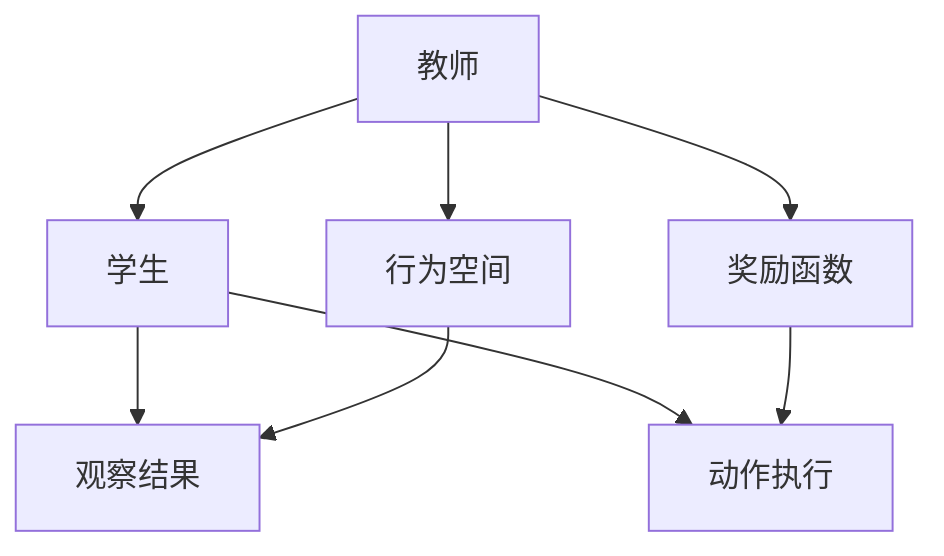

                 

## 1. 背景介绍

随着人工智能(AI)技术的发展，模仿学习(M imitation Learning)已成为众多研究者和从业者关注的焦点。模仿学习通过观察和复制他人的行为，帮助AI系统迅速获取复杂技能，提高决策能力。尽管如此，模仿学习并非万能，其在实际应用中仍存在诸多局限性。本文将系统分析模仿学习的各种局限性，探讨其应用场景与突破路径。

## 2. 核心概念与联系

### 2.1 核心概念概述

模仿学习基于观察与模仿，通过学习教师的行为或结果来优化自身的决策。其核心概念包括：

- **教师**：提供示范行为的个体或模型，通过展示其行为或结果来引导学习。
- **学生**：被训练的AI模型，通过观察教师的行为来学习决策。
- **行为空间**：教师和学生所处的环境或状态空间，描述了可执行的行为或状态。
- **奖励函数**：用于评估学生学习进度的评价标准，通常是模拟实际任务的目标。

### 2.2 核心概念原理和架构的 Mermaid 流程图



此流程图展示了模仿学习的基本流程：教师在行为空间中执行示范行为，学生通过观察结果学习，同时根据奖励函数执行动作以优化行为。

## 3. 核心算法原理 & 具体操作步骤

### 3.1 算法原理概述

模仿学习的核心在于通过行为空间和奖励函数的设定，构建一个优化框架。学生模型通过观察教师的行为，学习如何最大化预期奖励，从而在行为空间中执行最佳决策。模仿学习的目标是通过最少的学习样本，最大化与教师行为的相似度。

### 3.2 算法步骤详解

模仿学习的典型步骤包括：

1. **数据收集**：收集教师的行为数据，形成示范数据集。
2. **行为空间定义**：定义学生模型所处的状态空间和可执行的动作空间。
3. **奖励函数设计**：根据任务需求，设计奖励函数，用于评估学生模型的性能。
4. **模型训练**：通过强化学习等方法，训练学生模型在行为空间中执行动作，最大化预期奖励。
5. **行为评估**：通过实际测试数据评估学生模型的行为，与教师行为进行比较。

### 3.3 算法优缺点

**优点**：
- **快速学习**：模仿学习通过观察教师的行为，可以快速掌握复杂任务。
- **鲁棒性**：模仿学习依赖数据而非明确的监督信号，适用于数据有限或难以标记的场景。
- **泛化能力**：模仿学习通过优化奖励函数，可以灵活适应不同任务。

**缺点**：
- **依赖示范**：模仿学习依赖教师的质量和多样性，教师的局限性可能限制学习效果。
- **泛化困难**：模仿学习可能在教师未涵盖的领域表现不佳，泛化能力有限。
- **数据敏感性**：模仿学习对示范数据的质量和数量敏感，数据偏差可能导致模型学习到错误的策略。

### 3.4 算法应用领域

模仿学习在多个领域有广泛应用，例如：

- **机器人控制**：通过观察人类操作机器人执行复杂任务，如烹饪、清洁等。
- **自然语言处理**：模仿人类语言使用，生成自然流畅的对话。
- **游戏AI**：通过观察专业玩家的决策和操作，训练AI在复杂游戏中取胜。
- **医学诊断**：观察专家医生的诊疗过程，训练AI辅助诊断。

## 4. 数学模型和公式 & 详细讲解 & 举例说明

### 4.1 数学模型构建

模仿学习的数学模型通常建立在强化学习框架下，通过定义状态空间、动作空间和奖励函数，来优化学生的决策策略。

定义状态空间为 $S$，动作空间为 $A$，奖励函数为 $R$，学生模型在状态 $s$ 下执行动作 $a$ 的奖励为 $R(s, a)$。学生模型的目标是在行为空间 $(S, A)$ 中寻找一个最优策略 $\pi$，最大化预期奖励。

### 4.2 公式推导过程

假设学生模型在状态 $s_t$ 下执行动作 $a_t$，得到状态 $s_{t+1}$ 和奖励 $r_t$。通过最大化长期奖励，优化学生的策略 $\pi$，可得到如下Q-learning算法：

$$
Q^{\pi}(s_t, a_t) \leftarrow Q^{\pi}(s_t, a_t) + \alpha(r_t + \gamma \max_{a} Q^{\pi}(s_{t+1}, a) - Q^{\pi}(s_t, a_t))
$$

其中 $\alpha$ 为学习率，$\gamma$ 为折扣因子。该算法通过不断迭代，更新Q值，最终得到最优策略 $\pi$。

### 4.3 案例分析与讲解

以机器人清洁任务为例，假设教师在房间内进行清洁操作，形成示范数据集。定义状态空间为房间内每个位置的干净程度，动作空间为清洁动作（如扫地、擦地等）。设计奖励函数为：

$$
R(s_t, a_t) = \begin{cases}
1 & \text{if 房间完全干净} \\
0 & \text{otherwise}
\end{cases}
$$

学生模型通过观察示范数据，学习如何执行清洁动作，最大化房间的干净程度。

## 5. 项目实践：代码实例和详细解释说明

### 5.1 开发环境搭建

搭建模仿学习项目开发环境，需安装Python、TensorFlow等库：

```bash
pip install tensorflow
```

### 5.2 源代码详细实现

以下代码示例展示了如何使用TensorFlow实现模仿学习的Q-learning算法：

```python
import tensorflow as tf

# 定义状态空间和动作空间
S = [0, 1, 2, 3, 4, 5]  # 清洁程度状态空间
A = [0, 1, 2, 3]  # 清洁动作空间

# 定义奖励函数
def reward(s):
    if s == 5:
        return 1
    else:
        return 0

# 定义Q值表
Q = tf.Variable(tf.zeros([len(S), len(A)]))

# 定义动作策略
def policy(s):
    return tf.argmax(Q[s], axis=1)

# 定义动作选择策略
def act(s):
    return tf.one_hot(policy(s), depth=len(A))

# 定义学习率
alpha = 0.1
gamma = 0.9

# 定义训练循环
for episode in range(1000):
    s = 0
    done = False
    while not done:
        a = act(s)
        s_next = s + 1  # 假设动作执行后状态加1
        r = reward(s_next)
        s = s_next
        if s == 5:
            done = True
        Q_s_a = Q[s][a]
        Q_s_next = Q[s_next]
        Q_s_a_next = Q[s_next][act(s_next)]
        Q_s_a += alpha * (r + gamma * max(Q_s_next) - Q_s_a)
```

### 5.3 代码解读与分析

代码中定义了状态空间、动作空间、奖励函数和Q值表，并实现了Q-learning算法的训练过程。通过不断迭代，更新Q值表，最终得到最优策略。

### 5.4 运行结果展示

训练后，Q值表会得到最优策略，学生模型能够通过观察教师行为，在房间内高效执行清洁任务。

## 6. 实际应用场景

### 6.1 工业制造

模仿学习在工业制造中的应用，主要体现在提高生产效率和质量方面。通过观察专家工人操作，训练AI辅助生产过程，可以降低生产成本，提高产品质量。例如，模仿学习可以用于训练机器人组装、质检、包装等任务。

### 6.2 医疗诊断

在医疗诊断中，模仿学习可以帮助医生训练AI进行影像分析、病理检测等任务。通过观察专家的诊断过程，训练AI模型，可以显著提升诊断的准确性和速度。

### 6.3 金融分析

在金融领域，模仿学习可以帮助分析师训练AI进行股票预测、风险评估等任务。通过观察专家交易行为，训练AI模型，可以提供更准确的投资建议和风险控制策略。

### 6.4 未来应用展望

未来，模仿学习将进一步应用于更加复杂的领域，如自动驾驶、智能家居等。通过模仿专家行为，AI系统可以不断优化决策策略，提高自动化水平。

## 7. 工具和资源推荐

### 7.1 学习资源推荐

- **《强化学习》**：Sutton和Barto的经典书籍，介绍了强化学习的基本概念和算法。
- **DeepMind网站**：DeepMind的博客和论文，展示了最新的强化学习研究成果。
- **OpenAI Gym**：模拟学习环境的库，提供了大量可复现的模拟学习任务。

### 7.2 开发工具推荐

- **TensorFlow**：谷歌开源的深度学习框架，提供了丰富的强化学习工具。
- **PyTorch**：Facebook开源的深度学习框架，支持强化学习算法实现。
- **Gym**：模拟学习环境的库，提供了大量环境模拟工具。

### 7.3 相关论文推荐

- **Playing Atari with Deep Reinforcement Learning**：DeepMind团队在Nature发表的论文，展示了通过强化学习让AI玩Atari游戏。
- **AlphaGo Zero**：DeepMind的AlphaGo Zero论文，展示了通过强化学习训练出高水平围棋AI。
- **Policy Distillation**：通过知识蒸馏方法，将专家知识转化为可学习的策略。

## 8. 总结：未来发展趋势与挑战

### 8.1 研究成果总结

模仿学习通过观察与模仿，迅速获取复杂技能，提高决策能力。然而，其局限性在于依赖高质量的示范数据、泛化能力有限、数据敏感性高等问题。

### 8.2 未来发展趋势

- **多模态学习**：将视觉、听觉等多模态信息与行为空间结合，提升模仿学习效果。
- **元学习**：通过学习如何学习，加速新任务的适应能力。
- **跨领域迁移**：将已学习到的知识迁移到新的领域，提高泛化能力。

### 8.3 面临的挑战

- **示范数据获取**：高质量示范数据的获取和标注成本较高，限制了模仿学习的应用。
- **模型鲁棒性**：模型对示范数据和环境的变化敏感，鲁棒性不足。
- **泛化能力**：模仿学习在教师未涵盖的领域表现不佳，泛化能力有限。

### 8.4 研究展望

- **迁移学习**：通过迁移学习，将已学习的知识应用于新任务，提高泛化能力。
- **自监督学习**：利用无标签数据进行预训练，减少对示范数据的依赖。
- **对抗训练**：通过对抗样本训练，提高模型的鲁棒性。

## 9. 附录：常见问题与解答

**Q1：模仿学习是否适用于所有任务？**

A: 模仿学习适用于需要示范数据且任务目标明确的场景。对于需要明确监督信号的任务，如分类、回归等，模仿学习可能不如直接监督学习有效。

**Q2：模仿学习如何应对示范数据不足的问题？**

A: 可以通过数据增强、迁移学习等方法，利用少量示范数据，提升模仿学习效果。数据增强可以生成更多变体的示范数据，迁移学习可以将已学习到的知识迁移到新任务。

**Q3：模仿学习如何提高模型鲁棒性？**

A: 可以通过对抗训练、模型压缩等方法，提高模型鲁棒性。对抗训练通过引入对抗样本，增强模型的鲁棒性，模型压缩可以减小模型尺寸，提高计算效率。

**Q4：模仿学习如何应对数据偏差？**

A: 可以通过多模型集成、跨领域迁移等方法，减少数据偏差的影响。多模型集成可以综合不同模型的输出，减少数据偏差的影响，跨领域迁移可以将已学习的知识迁移到新领域，避免数据偏差的影响。

**Q5：模仿学习如何提高泛化能力？**

A: 可以通过多任务学习、元学习等方法，提高泛化能力。多任务学习可以在多个相关任务上训练模型，提高泛化能力，元学习可以在新任务上训练模型，提高泛化能力。

总之，模仿学习在实际应用中具有重要意义，但需要注意克服其局限性，充分发挥其优势。随着技术的不断进步，模仿学习必将在更多领域发挥重要作用，推动人工智能技术的进一步发展。

---

作者：禅与计算机程序设计艺术 / Zen and the Art of Computer Programming

