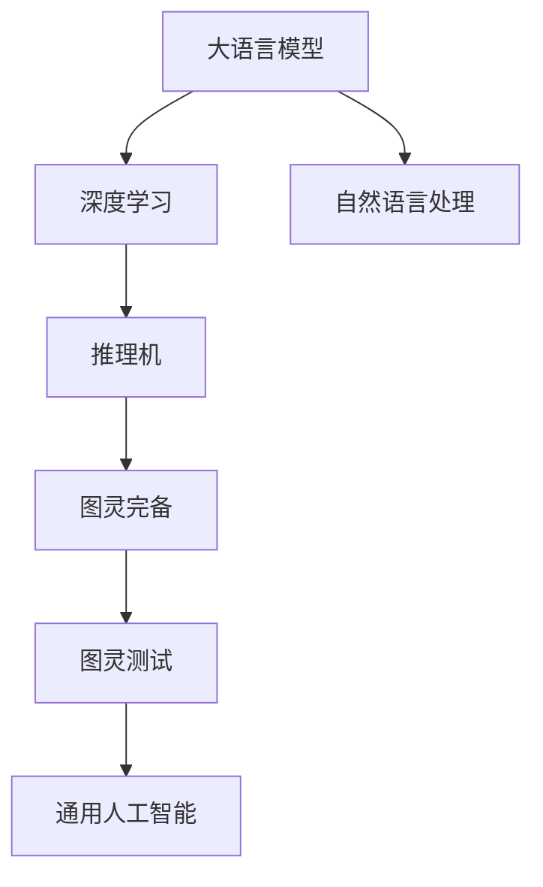

                 

# AI的全能性：LLM与图灵完备

> 关键词：大语言模型(Large Language Model, LLM), 图灵完备(Turing completeness), 深度学习(Deep Learning), 自然语言处理(Natural Language Processing, NLP), 推理机(Reasoning Machine)

## 1. 背景介绍

### 1.1 问题由来
人工智能(AI)自诞生以来，一直是人类科技发展的核心领域之一。从早期基于规则的专家系统，到后来的机器学习、深度学习，AI技术不断进步，逐步向通用人工智能(AGI)迈进。其中的大语言模型(LLM)，以其卓越的推理能力和泛化性能，正迅速成为引领AI技术发展的强大引擎。

然而，虽然LLM在诸多任务上展现了强大的表现，但人们对其是否达到了"图灵完备"这一经典AI理论的假设，仍然存在争议。图灵完备意味着一个计算系统能够模拟任何图灵可计算的算法，足以执行任何任务。由于语言具有高度的抽象性和灵活性，如何评价一个系统的语言理解能力和生成能力，成为长期以来亟待解决的问题。

## 2. 核心概念与联系

### 2.1 核心概念概述

为更好地理解LLM与图灵完备的关系，本节将介绍几个关键概念：

- 大语言模型(LLM)：以自回归(如GPT)或自编码(如BERT)模型为代表的大规模预训练语言模型。通过在大规模无标签文本语料上进行预训练，学习通用的语言表示，具备强大的语言理解和生成能力。

- 图灵完备(Turing completeness)：一个计算系统能够执行任何图灵可计算的算法，足以模拟任何计算任务。这是对计算系统的最高要求，也是AI研究的重要目标。

- 深度学习(Deep Learning)：一种基于多层神经网络的机器学习技术，能够自动提取和学习数据的高级特征。深度学习在图像、语音、自然语言处理等领域取得了突破性进展。

- 自然语言处理(NLP)：计算机科学、人工智能和语言学的交叉领域，旨在让机器理解、处理和生成自然语言。

- 推理机(Reasoning Machine)：一种能够理解、推理并生成自然语言文本的AI系统。推理机依赖于语言模型、知识库和逻辑推理器，实现对自然语言的复杂推理和生成。

- 图灵测试：由图灵提出，用于测试机器是否具备与人类智能相当的推理和理解能力。图灵测试通过对话来评估机器的能力，是人类智能与机器智能的交互界面。

这些概念之间的逻辑关系可以通过以下Mermaid流程图来展示：



这个流程图展示了LLM、深度学习、自然语言处理、推理机、图灵完备、图灵测试和通用人工智能之间的紧密联系：

1. LLM基于深度学习实现，通过预训练学习通用语言表示。
2. NLP和推理机依赖于LLM，能够处理和生成自然语言。
3. 图灵完备是推理机的理想状态，也是AGI的目标。
4. 图灵测试是评估图灵完备的标准，通过对话测试推理能力。
5. AGI是AI的终极目标，需要具备推理、理解、生成等全面能力。

这些概念共同构成了AI语言处理技术的核心框架，使得LLM在实现AGI目标的道路上不断前进。

## 3. 核心算法原理 & 具体操作步骤
### 3.1 算法原理概述

LLM的推理能力和图灵完备的联系主要体现在其如何处理自然语言任务上。LLM通过大规模无标签文本数据的预训练，学习到了语言的通用表示，能够在有监督的微调过程中，通过小规模标注数据进行适应性调整。其核心原理可以概括为以下几个步骤：

1. **数据预处理**：将原始文本数据转化为模型所需的格式，如分词、向量嵌入等。
2. **模型训练**：通过反向传播算法，最小化损失函数，调整模型参数以拟合数据。
3. **微调适配**：在特定任务的数据集上进行微调，优化模型以适应新的任务需求。
4. **推理生成**：将输入的自然语言文本转化为模型的预测结果，如生成文本、分类、匹配等。

这一过程本质上是一个深度学习模型的泛化过程，通过预训练模型学习通用的语言表示，然后在特定任务上进行微调，以充分发挥其语言处理能力。

### 3.2 算法步骤详解

下面详细阐述LLM的推理能力和图灵完备之间的操作步骤：

**Step 1: 数据预处理**
- 将原始文本数据进行分词、标点分隔、去除停用词等预处理，转化为模型所需的输入格式。
- 使用预训练的词向量或语言模型，将文本转换为模型能够理解的高维向量表示。

**Step 2: 模型训练**
- 选择合适的深度学习模型，如Transformer、RNN等，初始化模型参数。
- 使用反向传播算法，最小化损失函数，调整模型参数以拟合数据。
- 通过多轮迭代，逐渐优化模型，提高其对输入数据的拟合能力。

**Step 3: 微调适配**
- 收集目标任务的少量标注数据，用于微调。
- 在预训练模型的基础上，添加任务适配层，如分类器、解码器等。
- 使用少量标注数据，通过有监督学习训练模型，优化任务适配层的参数。
- 使用验证集评估模型性能，根据验证集上的损失函数调整超参数。

**Step 4: 推理生成**
- 将目标任务的输入文本输入微调后的模型。
- 模型对输入文本进行处理，生成输出结果。
- 输出结果根据具体任务，可以是文本、分类、匹配等。

这一过程展示了LLM如何通过预训练和微调，逐步提高其推理能力和泛化能力，逐步逼近图灵完备的目标。

### 3.3 算法优缺点

LLM在推理能力和图灵完备方面的优缺点如下：

**优点**：
- 强大的语言理解能力。LLM通过大规模预训练，学习到了语言的丰富表示，具备高度的语义理解能力。
- 高效的泛化能力。LLM能够在小规模标注数据上快速适应用户需求，进行推理和生成。
- 灵活性。LLM可以应用于各种NLP任务，如图像描述生成、文本摘要、机器翻译等。

**缺点**：
- 数据依赖。LLM的表现高度依赖于预训练数据的广泛性和多样性。
- 泛化误差。尽管LLM在预训练和微调过程中能够泛化，但在实际应用中仍可能存在泛化误差。
- 计算资源需求高。大规模的预训练和微调需要强大的计算资源，成本较高。

### 3.4 算法应用领域

LLM的应用领域广泛，涵盖了自然语言处理、计算机视觉、语音识别等多个领域。以下是几个典型的应用场景：

- 自然语言理解(NLU)：如问答系统、智能客服、机器翻译、文本摘要等。通过微调，LLM能够处理自然语言文本，回答问题、翻译文本、摘要文本等。
- 图像描述生成：将图像信息转化为自然语言文本。LLM能够理解图像内容，生成自然流畅的描述。
- 文本生成：如小说创作、文章撰写、社交媒体内容生成等。通过微调，LLM可以生成高质量的自然语言文本。
- 语音识别：将语音转化为文本。LLM能够理解语音内容，生成对应的文本转录。
- 数据增强：在数据标注过程中，利用LLM生成伪标注数据，增强训练集的多样性。

除了这些经典应用外，LLM还被创新性地应用于更多场景中，如多模态信息融合、个性化推荐、情感分析、知识图谱构建等，为各行各业带来了新的突破。

## 4. 数学模型和公式 & 详细讲解
### 4.1 数学模型构建

本节将使用数学语言对LLM的推理能力和图灵完备进行更加严格的刻画。

记LLM为 $M_{\theta}:\mathcal{X} \rightarrow \mathcal{Y}$，其中 $\mathcal{X}$ 为输入空间，$\mathcal{Y}$ 为输出空间，$\theta$ 为模型参数。假设目标任务为 $T$，其训练集为 $D=\{(x_i,y_i)\}_{i=1}^N, x_i \in \mathcal{X}, y_i \in \mathcal{Y}$。

定义模型 $M_{\theta}$ 在输入 $x$ 上的输出为 $y=M_{\theta}(x)$，即模型预测的输出结果。在目标任务 $T$ 上，模型的损失函数为：

$$
\ell(M_{\theta}(x),y) = \mathcal{L}(M_{\theta}(x),y)
$$

其中 $\mathcal{L}$ 为针对任务 $T$ 设计的损失函数，用于衡量模型预测输出与真实标签之间的差异。常见的损失函数包括交叉熵损失、均方误差损失等。

LLM在目标任务 $T$ 上的推理能力可以表示为：

$$
y^* = \mathop{\arg\min}_{y \in \mathcal{Y}} \ell(y, M_{\theta}(x))
$$

即通过最小化损失函数 $\ell$，找到最优的输出结果 $y^*$。

### 4.2 公式推导过程

以下我们以文本分类任务为例，推导交叉熵损失函数及其梯度的计算公式。

假设模型 $M_{\theta}$ 在输入 $x$ 上的输出为 $\hat{y}=M_{\theta}(x) \in [0,1]$，表示样本属于某一类别的概率。真实标签 $y \in \{1,0\}$。则二分类交叉熵损失函数定义为：

$$
\ell(M_{\theta}(x),y) = -[y\log \hat{y} + (1-y)\log (1-\hat{y})]
$$

将其代入损失函数 $\mathcal{L}$ 中，得：

$$
\mathcal{L}(M_{\theta}(x),y) = -\frac{1}{N}\sum_{i=1}^N [y_i\log M_{\theta}(x_i)+(1-y_i)\log(1-M_{\theta}(x_i))]
$$

根据链式法则，损失函数对参数 $\theta_k$ 的梯度为：

$$
\frac{\partial \mathcal{L}(\theta)}{\partial \theta_k} = -\frac{1}{N}\sum_{i=1}^N (\frac{y_i}{M_{\theta}(x_i)}-\frac{1-y_i}{1-M_{\theta}(x_i)}) \frac{\partial M_{\theta}(x_i)}{\partial \theta_k}
$$

其中 $\frac{\partial M_{\theta}(x_i)}{\partial \theta_k}$ 可进一步递归展开，利用自动微分技术完成计算。

在得到损失函数的梯度后，即可带入参数更新公式，完成模型的迭代优化。重复上述过程直至收敛，最终得到适应目标任务的最优模型参数 $\theta^*$。

## 5. 项目实践：代码实例和详细解释说明
### 5.1 开发环境搭建

在进行LLM项目实践前，我们需要准备好开发环境。以下是使用Python进行PyTorch开发的环境配置流程：

1. 安装Anaconda：从官网下载并安装Anaconda，用于创建独立的Python环境。

2. 创建并激活虚拟环境：
```bash
conda create -n pytorch-env python=3.8 
conda activate pytorch-env
```

3. 安装PyTorch：根据CUDA版本，从官网获取对应的安装命令。例如：
```bash
conda install pytorch torchvision torchaudio cudatoolkit=11.1 -c pytorch -c conda-forge
```

4. 安装Transformers库：
```bash
pip install transformers
```

5. 安装各类工具包：
```bash
pip install numpy pandas scikit-learn matplotlib tqdm jupyter notebook ipython
```

完成上述步骤后，即可在`pytorch-env`环境中开始LLM的微调实践。

### 5.2 源代码详细实现

下面我们以文本分类任务为例，给出使用Transformers库对BERT模型进行微调的PyTorch代码实现。

首先，定义文本分类任务的数据处理函数：

```python
from transformers import BertTokenizer
from torch.utils.data import Dataset
import torch

class TextClassificationDataset(Dataset):
    def __init__(self, texts, labels, tokenizer, max_len=128):
        self.texts = texts
        self.labels = labels
        self.tokenizer = tokenizer
        self.max_len = max_len
        
    def __len__(self):
        return len(self.texts)
    
    def __getitem__(self, item):
        text = self.texts[item]
        label = self.labels[item]
        
        encoding = self.tokenizer(text, return_tensors='pt', max_length=self.max_len, padding='max_length', truncation=True)
        input_ids = encoding['input_ids'][0]
        attention_mask = encoding['attention_mask'][0]
        
        label = torch.tensor(label, dtype=torch.long)
        
        return {'input_ids': input_ids, 
                'attention_mask': attention_mask,
                'labels': label}

# 标签与id的映射
label2id = {'positive': 1, 'negative': 0}
id2label = {v: k for k, v in label2id.items()}

# 创建dataset
tokenizer = BertTokenizer.from_pretrained('bert-base-cased')

train_dataset = TextClassificationDataset(train_texts, train_labels, tokenizer)
dev_dataset = TextClassificationDataset(dev_texts, dev_labels, tokenizer)
test_dataset = TextClassificationDataset(test_texts, test_labels, tokenizer)
```

然后，定义模型和优化器：

```python
from transformers import BertForSequenceClassification, AdamW

model = BertForSequenceClassification.from_pretrained('bert-base-cased', num_labels=2)

optimizer = AdamW(model.parameters(), lr=2e-5)
```

接着，定义训练和评估函数：

```python
from torch.utils.data import DataLoader
from tqdm import tqdm
from sklearn.metrics import classification_report

device = torch.device('cuda') if torch.cuda.is_available() else torch.device('cpu')
model.to(device)

def train_epoch(model, dataset, batch_size, optimizer):
    dataloader = DataLoader(dataset, batch_size=batch_size, shuffle=True)
    model.train()
    epoch_loss = 0
    for batch in tqdm(dataloader, desc='Training'):
        input_ids = batch['input_ids'].to(device)
        attention_mask = batch['attention_mask'].to(device)
        labels = batch['labels'].to(device)
        model.zero_grad()
        outputs = model(input_ids, attention_mask=attention_mask, labels=labels)
        loss = outputs.loss
        epoch_loss += loss.item()
        loss.backward()
        optimizer.step()
    return epoch_loss / len(dataloader)

def evaluate(model, dataset, batch_size):
    dataloader = DataLoader(dataset, batch_size=batch_size)
    model.eval()
    preds, labels = [], []
    with torch.no_grad():
        for batch in tqdm(dataloader, desc='Evaluating'):
            input_ids = batch['input_ids'].to(device)
            attention_mask = batch['attention_mask'].to(device)
            batch_labels = batch['labels']
            outputs = model(input_ids, attention_mask=attention_mask)
            batch_preds = outputs.logits.argmax(dim=1).to('cpu').tolist()
            batch_labels = batch_labels.to('cpu').tolist()
            for pred, label in zip(batch_preds, batch_labels):
                preds.append(id2label[pred])
                labels.append(id2label[label])
                
    print(classification_report(labels, preds))
```

最后，启动训练流程并在测试集上评估：

```python
epochs = 5
batch_size = 16

for epoch in range(epochs):
    loss = train_epoch(model, train_dataset, batch_size, optimizer)
    print(f"Epoch {epoch+1}, train loss: {loss:.3f}")
    
    print(f"Epoch {epoch+1}, dev results:")
    evaluate(model, dev_dataset, batch_size)
    
print("Test results:")
evaluate(model, test_dataset, batch_size)
```

以上就是使用PyTorch对BERT进行文本分类任务微调的完整代码实现。可以看到，得益于Transformers库的强大封装，我们可以用相对简洁的代码完成BERT模型的加载和微调。

### 5.3 代码解读与分析

让我们再详细解读一下关键代码的实现细节：

**TextClassificationDataset类**：
- `__init__`方法：初始化文本、标签、分词器等关键组件。
- `__len__`方法：返回数据集的样本数量。
- `__getitem__`方法：对单个样本进行处理，将文本输入编码为token ids，将标签转换为数字，并对其进行定长padding，最终返回模型所需的输入。

**label2id和id2label字典**：
- 定义了标签与数字id之间的映射关系，用于将预测结果解码为实际的标签。

**训练和评估函数**：
- 使用PyTorch的DataLoader对数据集进行批次化加载，供模型训练和推理使用。
- 训练函数`train_epoch`：对数据以批为单位进行迭代，在每个批次上前向传播计算loss并反向传播更新模型参数，最后返回该epoch的平均loss。
- 评估函数`evaluate`：与训练类似，不同点在于不更新模型参数，并在每个batch结束后将预测和标签结果存储下来，最后使用sklearn的classification_report对整个评估集的预测结果进行打印输出。

**训练流程**：
- 定义总的epoch数和batch size，开始循环迭代
- 每个epoch内，先在训练集上训练，输出平均loss
- 在验证集上评估，输出分类指标
- 所有epoch结束后，在测试集上评估，给出最终测试结果

可以看到，PyTorch配合Transformers库使得BERT微调的代码实现变得简洁高效。开发者可以将更多精力放在数据处理、模型改进等高层逻辑上，而不必过多关注底层的实现细节。

当然，工业级的系统实现还需考虑更多因素，如模型的保存和部署、超参数的自动搜索、更灵活的任务适配层等。但核心的微调范式基本与此类似。

## 6. 实际应用场景
### 6.1 智能客服系统

基于LLM的智能客服系统，可以广泛应用于企业客户服务部门。传统客服依赖人工接听，成本高、效率低，且无法24小时不间断服务。通过使用微调后的LLM，可以实现自动回答客户问题、解决常见问题、引导服务流程等功能，极大地提升了客户服务的响应速度和效率。

在技术实现上，可以收集企业内部的历史客服对话记录，将问题和最佳答复构建成监督数据，在此基础上对预训练的LLM进行微调。微调后的LLM能够自动理解用户意图，匹配最合适的答案模板进行回复。对于客户提出的新问题，还可以接入检索系统实时搜索相关内容，动态组织生成回答。如此构建的智能客服系统，能大幅提升客户咨询体验和问题解决效率。

### 6.2 金融舆情监测

金融机构需要实时监测市场舆论动向，以便及时应对负面信息传播，规避金融风险。传统的人工监测方式成本高、效率低，难以应对网络时代海量信息爆发的挑战。基于LLM的文本分类和情感分析技术，为金融舆情监测提供了新的解决方案。

具体而言，可以收集金融领域相关的新闻、报道、评论等文本数据，并对其进行主题标注和情感标注。在此基础上对预训练语言模型进行微调，使其能够自动判断文本属于何种主题，情感倾向是正面、中性还是负面。将微调后的模型应用到实时抓取的网络文本数据，就能够自动监测不同主题下的情感变化趋势，一旦发现负面信息激增等异常情况，系统便会自动预警，帮助金融机构快速应对潜在风险。

### 6.3 个性化推荐系统

当前的推荐系统往往只依赖用户的历史行为数据进行物品推荐，无法深入理解用户的真实兴趣偏好。基于LLM的个性化推荐系统可以更好地挖掘用户行为背后的语义信息，从而提供更精准、多样的推荐内容。

在实践中，可以收集用户浏览、点击、评论、分享等行为数据，提取和用户交互的物品标题、描述、标签等文本内容。将文本内容作为模型输入，用户的后续行为（如是否点击、购买等）作为监督信号，在此基础上微调预训练语言模型。微调后的模型能够从文本内容中准确把握用户的兴趣点。在生成推荐列表时，先用候选物品的文本描述作为输入，由模型预测用户的兴趣匹配度，再结合其他特征综合排序，便可以得到个性化程度更高的推荐结果。

### 6.4 未来应用展望

随着LLM技术的不断发展，其在各行各业的应用前景将更加广阔。

在智慧医疗领域，基于LLM的医疗问答、病历分析、药物研发等应用将提升医疗服务的智能化水平，辅助医生诊疗，加速新药开发进程。

在智能教育领域，LLM可应用于作业批改、学情分析、知识推荐等方面，因材施教，促进教育公平，提高教学质量。

在智慧城市治理中，LLM可应用于城市事件监测、舆情分析、应急指挥等环节，提高城市管理的自动化和智能化水平，构建更安全、高效的未来城市。

此外，在企业生产、社会治理、文娱传媒等众多领域，基于LLM的人工智能应用也将不断涌现，为经济社会发展注入新的动力。相信随着技术的日益成熟，LLM必将在更广阔的应用领域大放异彩，深刻影响人类的生产生活方式。

## 7. 工具和资源推荐
### 7.1 学习资源推荐

为了帮助开发者系统掌握LLM的理论基础和实践技巧，这里推荐一些优质的学习资源：

1. 《深度学习与自然语言处理》系列博文：由深度学习领域专家撰写，全面介绍了深度学习在NLP中的应用，包括LLM的原理和实践。

2. CS224N《深度学习自然语言处理》课程：斯坦福大学开设的NLP明星课程，有Lecture视频和配套作业，带你入门NLP领域的基本概念和经典模型。

3. 《自然语言处理综述》书籍：全面介绍了NLP领域的研究进展和前沿技术，涵盖了从词向量到深度学习的诸多概念。

4. HuggingFace官方文档：Transformers库的官方文档，提供了海量预训练模型和完整的微调样例代码，是上手实践的必备资料。

5. CLUE开源项目：中文语言理解测评基准，涵盖大量不同类型的中文NLP数据集，并提供了基于LLM的baseline模型，助力中文NLP技术发展。

通过对这些资源的学习实践，相信你一定能够快速掌握LLM的精髓，并用于解决实际的NLP问题。
###  7.2 开发工具推荐

高效的开发离不开优秀的工具支持。以下是几款用于LLM微调开发的常用工具：

1. PyTorch：基于Python的开源深度学习框架，灵活动态的计算图，适合快速迭代研究。大部分预训练语言模型都有PyTorch版本的实现。

2. TensorFlow：由Google主导开发的开源深度学习框架，生产部署方便，适合大规模工程应用。同样有丰富的预训练语言模型资源。

3. Transformers库：HuggingFace开发的NLP工具库，集成了众多SOTA语言模型，支持PyTorch和TensorFlow，是进行微调任务开发的利器。

4. Weights & Biases：模型训练的实验跟踪工具，可以记录和可视化模型训练过程中的各项指标，方便对比和调优。与主流深度学习框架无缝集成。

5. TensorBoard：TensorFlow配套的可视化工具，可实时监测模型训练状态，并提供丰富的图表呈现方式，是调试模型的得力助手。

6. Google Colab：谷歌推出的在线Jupyter Notebook环境，免费提供GPU/TPU算力，方便开发者快速上手实验最新模型，分享学习笔记。

合理利用这些工具，可以显著提升LLM微调的开发效率，加快创新迭代的步伐。

### 7.3 相关论文推荐

LLM的应用领域广泛，相关研究涉及诸多领域。以下是几篇奠基性的相关论文，推荐阅读：

1. Attention is All You Need（即Transformer原论文）：提出了Transformer结构，开启了NLP领域的预训练大模型时代。

2. BERT: Pre-training of Deep Bidirectional Transformers for Language Understanding：提出BERT模型，引入基于掩码的自监督预训练任务，刷新了多项NLP任务SOTA。

3. GPT-2: Language Models are Unsupervised Multitask Learners（GPT-2论文）：展示了大规模语言模型的强大zero-shot学习能力，引发了对于通用人工智能的新一轮思考。

4. T5: Exploring the Limits of Transfer Learning with a Unified Text-to-Text Transformer：提出T5模型，通过统一的目标函数，支持多种NLP任务的微调。

5. PEGASUS: Pre-training with Extractive and Generative Pre-training for Text Generation：提出PEGASUS模型，结合提取式和生成式预训练，提升了语言模型的生成能力。

6. BART: Denoising Sequence-to-Sequence Pre-training for Natural Language Processing：提出BART模型，结合自监督和监督学习，提升了语言模型的表示能力。

这些论文代表了大语言模型微调技术的发展脉络。通过学习这些前沿成果，可以帮助研究者把握学科前进方向，激发更多的创新灵感。

## 8. 总结：未来发展趋势与挑战
### 8.1 总结

本文对LLM的推理能力和图灵完备进行了全面系统的介绍。首先阐述了LLM的基本原理和微调方法，明确了其作为通用智能推理引擎的潜力。其次，从数学模型和实际应用的角度，详细讲解了LLM的推理能力和图灵完备的实现路径。最后，展示了LLM在各行各业中的应用前景，强调了其在实现通用人工智能目标中的重要地位。

通过本文的系统梳理，可以看到，LLM作为具有图灵完备能力的AI推理引擎，不仅在文本分类、情感分析、机器翻译等传统NLP任务中表现出色，还在图像描述、多模态信息融合、个性化推荐等诸多创新领域展现了强大的应用潜力。未来，随着LLM技术的进一步发展，其在实现图灵完备目标的道路上必将不断前进，为人类智能的演化提供新的动力。

### 8.2 未来发展趋势

展望未来，LLM在推理能力和图灵完备方面的发展趋势将如下：

1. 模型规模持续增大。随着算力成本的下降和数据规模的扩张，预训练语言模型的参数量还将持续增长。超大规模语言模型蕴含的丰富语言知识，有望支撑更加复杂多变的下游任务微调。

2. 微调方法日趋多样。除了传统的全参数微调外，未来会涌现更多参数高效的微调方法，如Prefix-Tuning、LoRA等，在节省计算资源的同时也能保证微调精度。

3. 持续学习成为常态。随着数据分布的不断变化，LLM也需要持续学习新知识以保持性能。如何在不遗忘原有知识的同时，高效吸收新样本信息，将成为重要的研究课题。

4. 标注样本需求降低。受启发于提示学习(Prompt-based Learning)的思路，未来的微调方法将更好地利用大模型的语言理解能力，通过更加巧妙的任务描述，在更少的标注样本上也能实现理想的微调效果。

5. 多模态微调崛起。当前的微调主要聚焦于纯文本数据，未来会进一步拓展到图像、视频、语音等多模态数据微调。多模态信息的融合，将显著提升LLM对现实世界的理解和建模能力。

6. 模型通用性增强。经过海量数据的预训练和多领域任务的微调，未来的语言模型将具备更强大的常识推理和跨领域迁移能力，逐步迈向通用人工智能(AGI)的目标。

以上趋势凸显了LLM作为通用推理引擎的潜力，为其实现图灵完备的目标提供了坚实的基础。这些方向的探索发展，必将进一步提升LLM系统的性能和应用范围，为构建更加智能的AI系统铺平道路。

### 8.3 面临的挑战

尽管LLM在推理能力和图灵完备方面的表现令人期待，但在迈向更加智能化、普适化应用的过程中，它仍面临诸多挑战：

1. 标注成本瓶颈。尽管LLM的表现高度依赖于预训练数据的广泛性和多样性，但标注样本的数量仍然是一个显著的瓶颈。如何进一步降低微调对标注样本的依赖，将是一大难题。

2. 模型鲁棒性不足。尽管LLM在预训练和微调过程中具备强大的泛化能力，但在实际应用中仍可能存在泛化误差。对于测试样本的微小扰动，LLM的预测也容易发生波动。如何提高LLM的鲁棒性，避免灾难性遗忘，还需要更多理论和实践的积累。

3. 计算资源需求高。大规模的预训练和微调需要强大的计算资源，成本较高。如何通过优化模型结构和算法，在有限的资源下提高LLM的推理能力和泛化能力，是未来需要重点解决的问题。

4. 可解释性不足。当前LLM的决策过程通常缺乏可解释性，难以对其推理逻辑进行分析和调试。对于医疗、金融等高风险应用，算法的可解释性和可审计性尤为重要。如何赋予LLM更强的可解释性，将是亟待攻克的难题。

5. 安全性有待保障。预训练语言模型难免会学习到有偏见、有害的信息，通过微调传递到下游任务，产生误导性、歧视性的输出，给实际应用带来安全隐患。如何从数据和算法层面消除模型偏见，避免恶意用途，确保输出的安全性，也将是重要的研究课题。

6. 知识整合能力不足。现有的LLM往往局限于任务内数据，难以灵活吸收和运用更广泛的先验知识。如何让LLM过程更好地与外部知识库、规则库等专家知识结合，形成更加全面、准确的信息整合能力，还有很大的想象空间。

正视LLM面临的这些挑战，积极应对并寻求突破，将是大语言模型微调走向成熟的必由之路。相信随着学界和产业界的共同努力，这些挑战终将一一被克服，LLM必将在构建安全、可靠、可解释、可控的智能系统铺平道路。

### 8.4 研究展望

面对LLM在推理能力和图灵完备方面的挑战，未来的研究需要在以下几个方面寻求新的突破：

1. 探索无监督和半监督微调方法。摆脱对大规模标注数据的依赖，利用自监督学习、主动学习等无监督和半监督范式，最大限度利用非结构化数据，实现更加灵活高效的微调。

2. 研究参数高效和计算高效的微调范式。开发更加参数高效的微调方法，在固定大部分预训练参数的同时，只更新极少量的任务相关参数。同时优化微调模型的计算图，减少前向传播和反向传播的资源消耗，实现更加轻量级、实时性的部署。

3. 融合因果和对比学习范式。通过引入因果推断和对比学习思想，增强LLM建立稳定因果关系的能力，学习更加普适、鲁棒的语言表征，从而提升模型泛化性和抗干扰能力。

4. 引入更多先验知识。将符号化的先验知识，如知识图谱、逻辑规则等，与神经网络模型进行巧妙融合，引导LLM学习更准确、合理的语言模型。同时加强不同模态数据的整合，实现视觉、语音等多模态信息与文本信息的协同建模。

5. 结合因果分析和博弈论工具。将因果分析方法引入LLM，识别出模型决策的关键特征，增强输出解释的因果性和逻辑性。借助博弈论工具刻画人机交互过程，主动探索并规避模型的脆弱点，提高系统稳定性。

6. 纳入伦理道德约束。在模型训练目标中引入伦理导向的评估指标，过滤和惩罚有偏见、有害的输出倾向。同时加强人工干预和审核，建立模型行为的监管机制，确保输出符合人类价值观和伦理道德。

这些研究方向的探索，必将引领LLM推理能力和图灵完备的进一步发展，为构建安全、可靠、可解释、可控的智能系统铺平道路。面向未来，LLM需要与其他AI技术进行更深入的融合，如知识表示、因果推理、强化学习等，多路径协同发力，共同推动自然语言理解和智能交互系统的进步。只有勇于创新、敢于突破，才能不断拓展LLM的边界，让智能技术更好地造福人类社会。

## 9. 附录：常见问题与解答

**Q1：大语言模型LLM是否具有图灵完备性？**

A: 目前，大语言模型LLM在推理能力和泛化能力上表现优异，具备强大的语言理解和生成能力。然而，是否具有图灵完备性，仍需进一步研究和验证。图灵完备性要求系统能够执行任何图灵可计算的算法，而LLM虽然在处理自然语言任务上表现出色，但在解决复杂推理、数学计算等任务时仍存在局限性。未来，通过优化模型结构和算法，引入更多先验知识，融合因果推断和对比学习，LLM有望逐步逼近图灵完备的目标。

**Q2：微调对标注数据的需求是否可以进一步降低？**

A: 微调对标注数据的需求确实可以进一步降低。当前，微调方法依赖于少量标注数据，难以处理长尾数据和噪声数据。未来，可以探索无监督和半监督微调方法，利用自监督学习、主动学习等技术，最大限度地利用非结构化数据，实现更高效的微调。例如，Prompt Learning、LoRA等方法通过巧妙的任务描述，能够在大规模无标签数据上进行微调，显著降低对标注数据的依赖。

**Q3：如何提高LLM的鲁棒性和泛化能力？**

A: 提高LLM的鲁棒性和泛化能力，可以从以下几个方面入手：
1. 数据增强：通过回译、近义替换等方式扩充训练集，增加模型对噪声和干扰的鲁棒性。
2. 正则化：使用L2正则、Dropout、Early Stopping等技术，防止模型过拟合，提升泛化能力。
3. 对抗训练：引入对抗样本，提高模型对异常输入的鲁棒性。
4. 参数高效微调：只更新极少量的任务相关参数，减小过拟合风险。
5. 多模型集成：训练多个微调模型，取平均输出，抑制过拟合。

**Q4：LLM的推理能力和可解释性不足的问题如何解决？**

A: 提高LLM的可解释性，可以通过以下方法解决：
1. 增加解释性任务：在微调过程中加入解释性任务，如可解释性生成、可解释性分类等，训练模型生成解释性信息。
2. 多模型融合：将多个不同架构的LLM进行融合，生成解释性输出。
3. 可解释性评估指标：引入可解释性评估指标，如SHAP值、LIME解释等，对模型输出进行解释。

**Q5：LLM在多模态信息融合中的应用前景如何？**

A: 多模态信息融合是LLM未来的一个重要应用方向。LLM通过预训练学习到丰富的语言表示，可以与图像、视频、语音等多模态数据进行结合，实现更全面、准确的信息整合。例如，在医疗领域，LLM可以与医学影像、病历数据等进行融合，提升诊断和治疗效果。在智能家居中，LLM可以与语音识别、图像识别等技术结合，实现更智能化的交互和控制。未来，多模态融合将使得LLM在更多领域大放异彩，推动智能系统的全面发展。

---

作者：禅与计算机程序设计艺术 / Zen and the Art of Computer Programming

