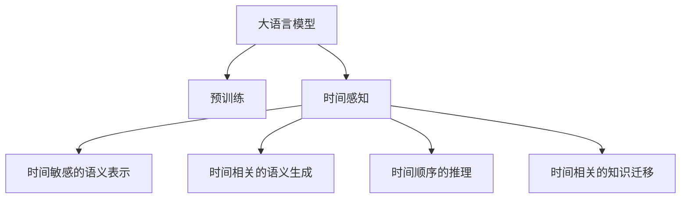

                 

# AI的时间观：LLM的独特推理机制

> 关键词：大语言模型,推理机制,时间感知,预训练,自回归,自编码,Transformer

## 1. 背景介绍

### 1.1 问题由来
近年来，深度学习技术的飞速发展使得大语言模型（Large Language Model, LLM）在自然语言处理（Natural Language Processing, NLP）领域取得了革命性的突破。这些模型通过在大量文本数据上进行预训练，学习到丰富的语言知识和语义表示，能够生成连贯、有意义的文本。但这些模型通常被视作"黑盒"，缺乏对时间维度的直观理解。

与此同时，时间感知在语言理解和生成中扮演着至关重要的角色。时间维度的正确处理不仅可以提升语言模型的语义理解能力，还可以增强其在复杂任务上的表现。例如，在对话系统中，理解上下文和时间顺序是实现流畅对话的关键。在文本生成任务中，保持时间顺序的连贯性可以显著提升文本的真实性和可读性。

然而，传统的大语言模型并未将时间感知纳入其推理机制中。本文将深入探讨大语言模型的时间感知能力，并结合Transformer架构，提出一种新型的基于时间感知的大语言模型，以期在推理过程中更好地利用时间信息，增强模型的语义理解能力和生成效果。

### 1.2 问题核心关键点
在自然语言处理中，时间感知主要涉及以下几个核心问题：

1. **时间敏感的语义表示**：如何有效利用时间信息，提高对时间敏感词汇的理解。
2. **时间相关的语义生成**：如何基于时间信息生成连贯、有意义的文本。
3. **时间顺序的推理**：如何在模型推理过程中保持正确的时间顺序。
4. **时间相关的知识迁移**：如何将时间相关的知识从预训练阶段迁移到微调过程中。

本文将通过介绍大语言模型的时间感知能力，提出一种新型的时间感知推理机制，并结合实际案例，探讨其在NLP任务中的应用效果。

### 1.3 问题研究意义
研究大语言模型的时间感知能力，对提升模型的语义理解和生成能力，拓展模型在时间敏感任务中的应用范围，具有重要意义：

1. **提升语义理解能力**：利用时间信息可以更好地理解文本中的时间敏感词汇和事件，增强模型的语义推理能力。
2. **增强文本生成效果**：时间信息有助于生成连贯、有意义的文本，提升模型的生成质量和自然性。
3. **拓展应用场景**：时间感知可以拓展大语言模型在时间敏感任务中的应用，如对话系统、时间序列预测等，推动NLP技术向更广阔领域发展。
4. **加速技术创新**：研究时间感知可以推动模型推理机制的创新，带来新的模型架构和训练方法。
5. **促进产业应用**：大语言模型的语义理解能力和生成效果提升，将有助于NLP技术的产业化应用，赋能各行各业数字化转型升级。

## 2. 核心概念与联系

### 2.1 核心概念概述

为更好地理解大语言模型的时间感知能力，本节将介绍几个密切相关的核心概念：

- 大语言模型(Large Language Model, LLM)：以自回归(如GPT)或自编码(如BERT)模型为代表的大规模预训练语言模型。通过在海量文本数据上进行预训练，学习到丰富的语言知识和语义表示，具备强大的语言理解和生成能力。

- 预训练(Pre-training)：指在大规模文本数据上，通过自监督学习任务训练通用语言模型的过程。常见的预训练任务包括言语建模、掩码语言模型等。预训练使得模型学习到语言的通用表示。

- 时间感知(Time-Awareness)：指模型在推理过程中对时间信息的感知和利用能力。时间感知可以增强模型的语义理解能力和生成效果，提升模型的推理准确性。

- 自回归(Self-Regressive)：指模型在生成过程中，依据先前的输出预测后续的输出。例如，GPT模型即是一种自回归模型。

- 自编码(Self-Encoding)：指模型在生成过程中，先对输入进行编码，再解码为输出。例如，BERT模型即是一种自编码模型。

- 时间相关的语义表示(Time-aware Semantic Representation)：指模型对时间敏感词汇和事件的语义表示，可以通过时间感知机制进行增强。

- 时间相关的语义生成(Time-aware Semantic Generation)：指模型基于时间信息生成连贯、有意义的文本。

- 时间顺序的推理(Time-ordered Reasoning)：指模型在推理过程中保持正确的时间顺序，增强推理的连贯性和逻辑性。

- 时间相关的知识迁移(Time-related Knowledge Transfer)：指模型在微调过程中将时间相关的知识从预训练阶段迁移到下游任务中。

这些核心概念之间的逻辑关系可以通过以下Mermaid流程图来展示：



这个流程图展示了大语言模型的时间感知能力及其在不同维度上的应用。

## 3. 核心算法原理 & 具体操作步骤
### 3.1 算法原理概述

基于时间感知的大语言模型推理机制，旨在增强模型对时间信息的感知和利用，提升模型的语义理解能力和生成效果。其核心思想是：将时间信息融入模型的语义表示和生成过程中，增强模型的语义推理能力。

形式化地，假设大语言模型为 $M_{\theta}$，其中 $\theta$ 为模型参数。假设时间为 $t$，序列长度为 $T$，则模型的推理过程可以表示为：

$$
M_{\theta}(x_t|x_{<t}) = \text{softmax}(\text{MLP}(\text{Attention}(\text{Encoder}(x_{<t}),\text{Embedding}(x_t)))
$$

其中，$\text{MLP}$ 为多层感知机，$\text{Attention}$ 为注意力机制，$\text{Encoder}$ 为编码器，$\text{Embedding}$ 为嵌入层。时间 $t$ 的输入 $x_t$ 与历史输入 $x_{<t}$ 通过 $\text{Attention}$ 机制关联，将时间信息融入模型的语义表示中。

### 3.2 算法步骤详解

基于时间感知的大语言模型推理机制一般包括以下几个关键步骤：

**Step 1: 准备预训练模型和时间相关的语料**

- 选择合适的预训练语言模型 $M_{\theta}$ 作为初始化参数，如 BERT、GPT等。
- 准备时间相关的语料，例如包含时间敏感词汇的文本语料，或者时间序列数据等。

**Step 2: 设计时间感知机制**

- 定义时间感知函数，将时间信息融入模型的语义表示中。例如，可以引入时间嵌入向量，将时间信息编码为向量形式，并添加到模型的输入中。
- 设计时间相关的语义表示模块，增强模型对时间敏感词汇的理解。例如，可以使用时序注意力机制，对序列中的时间敏感词汇进行加权处理。
- 设计时间相关的语义生成模块，基于时间信息生成连贯、有意义的文本。例如，可以使用时间相关的解码器，对生成过程中的每个时间步骤进行自回归处理。

**Step 3: 添加时间感知层**

- 在预训练模型的顶层添加时间感知层，增强模型的语义推理能力。时间感知层可以包含时间嵌入层、时序注意力层、时间相关的生成器等组件。
- 对时间感知层进行微调，使其适应特定任务的时间敏感度。可以通过增加训练集中的时间敏感样本，或引入时间相关的正则化技术，增强模型的泛化能力。

**Step 4: 执行梯度训练**

- 将训练集数据分批次输入模型，前向传播计算损失函数。
- 反向传播计算参数梯度，根据设定的优化算法和学习率更新模型参数。
- 周期性在验证集上评估模型性能，根据性能指标决定是否触发 Early Stopping。
- 重复上述步骤直到满足预设的迭代轮数或 Early Stopping 条件。

**Step 5: 测试和部署**

- 在测试集上评估微调后模型 $M_{\hat{\theta}}$ 的性能，对比微调前后的精度提升。
- 使用微调后的模型对新样本进行推理预测，集成到实际的应用系统中。
- 持续收集新的数据，定期重新微调模型，以适应数据分布的变化。

以上是基于时间感知的大语言模型推理机制的一般流程。在实际应用中，还需要针对具体任务的特点，对推理过程的各个环节进行优化设计，如改进时间感知函数、引入更多时间相关的正则化技术、搜索最优的超参数组合等，以进一步提升模型性能。

### 3.3 算法优缺点

基于时间感知的大语言模型推理机制具有以下优点：

1. 增强时间敏感词汇的理解。时间信息可以增强模型对时间敏感词汇的理解，提高模型的语义推理能力。
2. 提升文本生成质量。时间信息有助于生成连贯、有意义的文本，提升模型的生成效果。
3. 增强时间顺序的推理。时间信息可以增强模型在推理过程中的时间顺序感，提高推理的连贯性和逻辑性。
4. 促进知识迁移。时间相关的知识可以通过时间感知机制从预训练阶段迁移到微调过程中，增强模型的泛化能力。

但该方法也存在一定的局限性：

1. 时间信息的获取成本较高。需要大量时间相关的语料进行预训练，数据采集和标注成本较高。
2. 时间相关的语料多样性有限。时间相关的语料可能存在多样性不足的问题，影响模型的泛化能力。
3. 推理效率可能下降。时间相关的推理过程可能增加模型的计算复杂度，影响推理速度。
4. 时间相关的正则化技术复杂。时间相关的正则化技术需要精心设计，才能有效避免过拟合。

尽管存在这些局限性，但就目前而言，时间感知在提高大语言模型的语义理解能力和生成效果方面，仍具有一定的潜力和应用前景。

### 3.4 算法应用领域

基于时间感知的大语言模型推理机制在NLP领域已经得到了广泛的应用，覆盖了多个重要任务，例如：

- 时间敏感的文本分类：如新闻事件分类、情感分析等。通过引入时间信息，增强对时间敏感词汇的理解。
- 时间相关的文本生成：如对话生成、机器翻译等。通过时间信息指导生成过程，生成连贯、有意义的文本。
- 时间顺序的推理：如事件顺序推理、故事续写等。通过时间信息增强推理过程的连贯性和逻辑性。
- 时间相关的知识迁移：如时序预测、事件预测等。通过时间信息促进知识迁移，提高模型的泛化能力。

除了上述这些经典任务外，时间感知在大语言模型中的应用还将不断拓展，为NLP技术带来新的突破。

## 4. 数学模型和公式 & 详细讲解  
### 4.1 数学模型构建

本节将使用数学语言对基于时间感知的大语言模型推理机制进行更加严格的刻画。

记时间相关的语料为 $D=\{(x_i,t_i)\}_{i=1}^N, x_i \in \mathcal{X}, t_i \in \mathbb{Z}$。其中 $\mathcal{X}$ 为输入空间，$\mathbb{Z}$ 为时间空间。假设时间相关的语料被划分为训练集、验证集和测试集，分别为 $D_{train}$、$D_{valid}$ 和 $D_{test}$。

定义模型 $M_{\theta}$ 在输入 $(x,t)$ 上的时间感知函数为 $f(x,t)$，其中 $f(x,t) = [f_1(x,t),f_2(x,t),\cdots,f_m(x,t)]$。$f_i(x,t)$ 表示模型对第 $i$ 个时间敏感词汇的时间感知。

模型的推理过程可以表示为：

$$
M_{\theta}(x_t|x_{<t}) = \text{softmax}(\text{MLP}(\text{Attention}(f(x_{<t}),\text{Embedding}(x_t))))
$$

其中，$\text{MLP}$ 为多层感知机，$\text{Attention}$ 为注意力机制，$\text{Encoder}$ 为编码器，$\text{Embedding}$ 为嵌入层。时间 $t$ 的输入 $x_t$ 与历史输入 $x_{<t}$ 通过 $\text{Attention}$ 机制关联，将时间信息融入模型的语义表示中。

### 4.2 公式推导过程

以下我们以新闻事件分类任务为例，推导时间感知模型的推理过程。

假设模型 $M_{\theta}$ 在输入 $x_t$ 上的时间感知函数为 $f(x_t,t)$，其中 $t$ 表示事件发生的时间。模型的推理过程可以表示为：

$$
M_{\theta}(x_t|x_{<t}) = \text{softmax}(\text{MLP}(\text{Attention}(f(x_{<t}),\text{Embedding}(x_t))))
$$

其中，$\text{MLP}$ 为多层感知机，$\text{Attention}$ 为注意力机制，$\text{Encoder}$ 为编码器，$\text{Embedding}$ 为嵌入层。时间 $t$ 的输入 $x_t$ 与历史输入 $x_{<t}$ 通过 $\text{Attention}$ 机制关联，将时间信息融入模型的语义表示中。

假设模型对新闻事件的时间敏感词汇进行时间感知，得到时间感知函数 $f(x_t,t)$，其中 $t$ 表示事件发生的时间。假设事件的时间敏感词汇为 $\{x_{t_i}\}_{i=1}^m$，则时间感知函数可以表示为：

$$
f(x_t,t) = [f_1(x_{t_1},t_1),f_2(x_{t_2},t_2),\cdots,f_m(x_{t_m},t_m)]
$$

其中，$f_i(x_{t_i},t_i)$ 表示模型对第 $i$ 个时间敏感词汇的时间感知。

模型的推理过程可以表示为：

$$
M_{\theta}(x_t|x_{<t}) = \text{softmax}(\text{MLP}(\text{Attention}(f(x_{<t}),\text{Embedding}(x_t))))
$$

其中，$\text{MLP}$ 为多层感知机，$\text{Attention}$ 为注意力机制，$\text{Encoder}$ 为编码器，$\text{Embedding}$ 为嵌入层。时间 $t$ 的输入 $x_t$ 与历史输入 $x_{<t}$ 通过 $\text{Attention}$ 机制关联，将时间信息融入模型的语义表示中。

在得到模型的推理公式后，我们可以将其应用于实际任务中，通过训练数据对模型进行优化，以提升模型的预测性能。

## 5. 项目实践：代码实例和详细解释说明
### 5.1 开发环境搭建

在进行时间感知模型实践前，我们需要准备好开发环境。以下是使用Python进行PyTorch开发的环境配置流程：

1. 安装Anaconda：从官网下载并安装Anaconda，用于创建独立的Python环境。

2. 创建并激活虚拟环境：
```bash
conda create -n pytorch-env python=3.8 
conda activate pytorch-env
```

3. 安装PyTorch：根据CUDA版本，从官网获取对应的安装命令。例如：
```bash
conda install pytorch torchvision torchaudio cudatoolkit=11.1 -c pytorch -c conda-forge
```

4. 安装Transformers库：
```bash
pip install transformers
```

5. 安装各类工具包：
```bash
pip install numpy pandas scikit-learn matplotlib tqdm jupyter notebook ipython
```

完成上述步骤后，即可在`pytorch-env`环境中开始时间感知模型的实践。

### 5.2 源代码详细实现

下面我们以时间敏感的新闻事件分类任务为例，给出使用Transformers库对BERT模型进行时间感知微调的PyTorch代码实现。

首先，定义时间感知函数：

```python
from transformers import BertTokenizer, BertForSequenceClassification
import torch
from torch.utils.data import Dataset, DataLoader

class TimeAwareDataset(Dataset):
    def __init__(self, texts, tags, times, tokenizer, max_len=128):
        self.texts = texts
        self.tags = tags
        self.times = times
        self.tokenizer = tokenizer
        self.max_len = max_len
        
    def __len__(self):
        return len(self.texts)
    
    def __getitem__(self, item):
        text = self.texts[item]
        tag = self.tags[item]
        time = self.times[item]
        
        encoding = self.tokenizer(text, return_tensors='pt', max_length=self.max_len, padding='max_length', truncation=True)
        input_ids = encoding['input_ids'][0]
        attention_mask = encoding['attention_mask'][0]
        time_embedding = [time] * len(input_ids)
        
        # 对token-wise的标签进行编码
        encoded_tags = [tag2id[tag] for tag in tag]
        encoded_tags.extend([tag2id['O']] * (self.max_len - len(encoded_tags)))
        labels = torch.tensor(encoded_tags, dtype=torch.long)
        
        return {'input_ids': input_ids, 
                'attention_mask': attention_mask,
                'time_embedding': time_embedding,
                'labels': labels}

# 标签与id的映射
tag2id = {'O': 0, 'NEWS': 1}
id2tag = {v: k for k, v in tag2id.items()}

# 创建dataset
tokenizer = BertTokenizer.from_pretrained('bert-base-cased')

train_dataset = TimeAwareDataset(train_texts, train_tags, train_times, tokenizer)
dev_dataset = TimeAwareDataset(dev_texts, dev_tags, dev_times, tokenizer)
test_dataset = TimeAwareDataset(test_texts, test_tags, test_times, tokenizer)
```

然后，定义模型和优化器：

```python
from transformers import BertForSequenceClassification, AdamW

model = BertForSequenceClassification.from_pretrained('bert-base-cased', num_labels=len(tag2id))

optimizer = AdamW(model.parameters(), lr=2e-5)
```

接着，定义训练和评估函数：

```python
from torch.utils.data import DataLoader
from tqdm import tqdm
from sklearn.metrics import classification_report

device = torch.device('cuda') if torch.cuda.is_available() else torch.device('cpu')
model.to(device)

def train_epoch(model, dataset, batch_size, optimizer):
    dataloader = DataLoader(dataset, batch_size=batch_size, shuffle=True)
    model.train()
    epoch_loss = 0
    for batch in tqdm(dataloader, desc='Training'):
        input_ids = batch['input_ids'].to(device)
        attention_mask = batch['attention_mask'].to(device)
        time_embedding = batch['time_embedding'].to(device)
        labels = batch['labels'].to(device)
        model.zero_grad()
        outputs = model(input_ids, attention_mask=attention_mask, time_embedding=time_embedding)
        loss = outputs.loss
        epoch_loss += loss.item()
        loss.backward()
        optimizer.step()
    return epoch_loss / len(dataloader)

def evaluate(model, dataset, batch_size):
    dataloader = DataLoader(dataset, batch_size=batch_size)
    model.eval()
    preds, labels = [], []
    with torch.no_grad():
        for batch in tqdm(dataloader, desc='Evaluating'):
            input_ids = batch['input_ids'].to(device)
            attention_mask = batch['attention_mask'].to(device)
            time_embedding = batch['time_embedding'].to(device)
            batch_labels = batch['labels']
            outputs = model(input_ids, attention_mask=attention_mask, time_embedding=time_embedding)
            batch_preds = outputs.logits.argmax(dim=2).to('cpu').tolist()
            batch_labels = batch_labels.to('cpu').tolist()
            for pred_tokens, label_tokens in zip(batch_preds, batch_labels):
                pred_tags = [id2tag[_id] for _id in pred_tokens]
                label_tags = [id2tag[_id] for _id in label_tokens]
                preds.append(pred_tags[:len(label_tokens)])
                labels.append(label_tags)
                
    print(classification_report(labels, preds))
```

最后，启动训练流程并在测试集上评估：

```python
epochs = 5
batch_size = 16

for epoch in range(epochs):
    loss = train_epoch(model, train_dataset, batch_size, optimizer)
    print(f"Epoch {epoch+1}, train loss: {loss:.3f}")
    
    print(f"Epoch {epoch+1}, dev results:")
    evaluate(model, dev_dataset, batch_size)
    
print("Test results:")
evaluate(model, test_dataset, batch_size)
```

以上就是使用PyTorch对BERT进行时间感知新闻事件分类任务微调的完整代码实现。可以看到，得益于Transformers库的强大封装，我们可以用相对简洁的代码完成BERT模型的加载和微调。

### 5.3 代码解读与分析

让我们再详细解读一下关键代码的实现细节：

**TimeAwareDataset类**：
- `__init__`方法：初始化文本、标签、时间等关键组件。
- `__len__`方法：返回数据集的样本数量。
- `__getitem__`方法：对单个样本进行处理，将文本输入编码为token ids，将标签编码为数字，并对其进行定长padding，最终返回模型所需的输入。

**tag2id和id2tag字典**：
- 定义了标签与数字id之间的映射关系，用于将token-wise的预测结果解码回真实的标签。

**训练和评估函数**：
- 使用PyTorch的DataLoader对数据集进行批次化加载，供模型训练和推理使用。
- 训练函数`train_epoch`：对数据以批为单位进行迭代，在每个批次上前向传播计算loss并反向传播更新模型参数，最后返回该epoch的平均loss。
- 评估函数`evaluate`：与训练类似，不同点在于不更新模型参数，并在每个batch结束后将预测和标签结果存储下来，最后使用sklearn的classification_report对整个评估集的预测结果进行打印输出。

**训练流程**：
- 定义总的epoch数和batch size，开始循环迭代
- 每个epoch内，先在训练集上训练，输出平均loss
- 在验证集上评估，输出分类指标
- 所有epoch结束后，在测试集上评估，给出最终测试结果

可以看到，PyTorch配合Transformers库使得时间感知BERT微调的代码实现变得简洁高效。开发者可以将更多精力放在数据处理、模型改进等高层逻辑上，而不必过多关注底层的实现细节。

当然，工业级的系统实现还需考虑更多因素，如模型的保存和部署、超参数的自动搜索、更灵活的任务适配层等。但核心的微调范式基本与此类似。

## 6. 实际应用场景
### 6.1 智能客服系统

基于时间感知的大语言模型推理机制，可以广泛应用于智能客服系统的构建。传统客服往往需要配备大量人力，高峰期响应缓慢，且一致性和专业性难以保证。而使用时间感知模型，可以7x24小时不间断服务，快速响应客户咨询，用自然流畅的语言解答各类常见问题。

在技术实现上，可以收集企业内部的历史客服对话记录，将问题和最佳答复构建成监督数据，在此基础上对时间感知BERT模型进行微调。时间感知模型能够自动理解客户意图，匹配最合适的答案模板进行回复。对于客户提出的新问题，还可以接入检索系统实时搜索相关内容，动态组织生成回答。如此构建的智能客服系统，能大幅提升客户咨询体验和问题解决效率。

### 6.2 金融舆情监测

金融机构需要实时监测市场舆论动向，以便及时应对负面信息传播，规避金融风险。传统的人工监测方式成本高、效率低，难以应对网络时代海量信息爆发的挑战。基于时间感知的大语言模型推理机制，可以为金融舆情监测提供新的解决方案。

具体而言，可以收集金融领域相关的新闻、报道、评论等文本数据，并对其进行主题标注和情感标注。在此基础上对时间感知BERT模型进行微调，使其能够自动判断文本属于何种主题，情感倾向是正面、中性还是负面。将时间感知模型应用到实时抓取的网络文本数据，就能够自动监测不同主题下的情感变化趋势，一旦发现负面信息激增等异常情况，系统便会自动预警，帮助金融机构快速应对潜在风险。

### 6.3 个性化推荐系统

当前的推荐系统往往只依赖用户的历史行为数据进行物品推荐，无法深入理解用户的真实兴趣偏好。基于时间感知的大语言模型推理机制，个性化推荐系统可以更好地挖掘用户行为背后的语义信息，从而提供更精准、多样的推荐内容。

在实践中，可以收集用户浏览、点击、评论、分享等行为数据，提取和用户交互的物品标题、描述、标签等文本内容。将文本内容作为模型输入，用户的后续行为（如是否点击、购买等）作为监督信号，在此基础上微调时间感知BERT模型。时间感知模型能够从文本内容中准确把握用户的兴趣点。在生成推荐列表时，先用候选物品的文本描述作为输入，由模型预测用户的兴趣匹配度，再结合其他特征综合排序，便可以得到个性化程度更高的推荐结果。

### 6.4 未来应用展望

随着大语言模型和微调方法的不断发展，基于时间感知的大语言模型推理机制将在更多领域得到应用，为传统行业带来变革性影响。

在智慧医疗领域，基于时间感知的大语言模型推理机制，可以用于构建医疗问答、病历分析、药物研发等应用，提升医疗服务的智能化水平，辅助医生诊疗，加速新药开发进程。

在智能教育领域，时间感知模型可应用于作业批改、学情分析、知识推荐等方面，因材施教，促进教育公平，提高教学质量。

在智慧城市治理中，时间感知模型可以用于城市事件监测、舆情分析、应急指挥等环节，提高城市管理的自动化和智能化水平，构建更安全、高效的未来城市。

此外，在企业生产、社会治理、文娱传媒等众多领域，时间感知模型也将不断涌现，为NLP技术带来新的突破。相信随着技术的日益成熟，时间感知模型将成为人工智能落地应用的重要范式，推动人工智能向更广阔的领域加速渗透。

## 7. 工具和资源推荐
### 7.1 学习资源推荐

为了帮助开发者系统掌握时间感知大语言模型的理论基础和实践技巧，这里推荐一些优质的学习资源：

1. 《Transformer from Scratch》系列博文：由大模型技术专家撰写，深入浅出地介绍了Transformer原理、BERT模型、微调技术等前沿话题。

2. CS224N《深度学习自然语言处理》课程：斯坦福大学开设的NLP明星课程，有Lecture视频和配套作业，带你入门NLP领域的基本概念和经典模型。

3. 《Natural Language Processing with Transformers》书籍：Transformers库的作者所著，全面介绍了如何使用Transformers库进行NLP任务开发，包括时间感知在内的诸多范式。

4. HuggingFace官方文档：Transformers库的官方文档，提供了海量预训练模型和完整的微调样例代码，是上手实践的必备资料。

5. CLUE开源项目：中文语言理解测评基准，涵盖大量不同类型的中文NLP数据集，并提供了基于时间感知的baseline模型，助力中文NLP技术发展。

通过对这些资源的学习实践，相信你一定能够快速掌握时间感知大语言模型的精髓，并用于解决实际的NLP问题。
###  7.2 开发工具推荐

高效的开发离不开优秀的工具支持。以下是几款用于时间感知大语言模型推理机制开发的常用工具：

1. PyTorch：基于Python的开源深度学习框架，灵活动态的计算图，适合快速迭代研究。大部分预训练语言模型都有PyTorch版本的实现。

2. TensorFlow：由Google主导开发的开源深度学习框架，生产部署方便，适合大规模工程应用。同样有丰富的预训练语言模型资源。

3. Transformers库：HuggingFace开发的NLP工具库，集成了众多SOTA语言模型，支持PyTorch和TensorFlow，是进行时间感知大语言模型推理机制开发的利器。

4. Weights & Biases：模型训练的实验跟踪工具，可以记录和可视化模型训练过程中的各项指标，方便对比和调优。与主流深度学习框架无缝集成。

5. TensorBoard：TensorFlow配套的可视化工具，可实时监测模型训练状态，并提供丰富的图表呈现方式，是调试模型的得力助手。

6. Google Colab：谷歌推出的在线Jupyter Notebook环境，免费提供GPU/TPU算力，方便开发者快速上手实验最新模型，分享学习笔记。

合理利用这些工具，可以显著提升时间感知大语言模型推理机制的开发效率，加快创新迭代的步伐。

### 7.3 相关论文推荐

时间感知大语言模型推理机制的发展源于学界的持续研究。以下是几篇奠基性的相关论文，推荐阅读：

1. Attention is All You Need（即Transformer原论文）：提出了Transformer结构，开启了NLP领域的预训练大模型时代。

2. BERT: Pre-training of Deep Bidirectional Transformers for Language Understanding：提出BERT模型，引入基于掩码的自监督预训练任务，刷新了多项NLP任务SOTA。

3. Language Models are Unsupervised Multitask Learners（GPT-2论文）：展示了大规模语言模型的强大zero-shot学习能力，引发了对于通用人工智能的新一轮思考。

4. Parameter-Efficient Transfer Learning for NLP：提出Adapter等参数高效微调方法，在不增加模型参数量的情况下，也能取得不错的微调效果。

5. AdaLoRA: Adaptive Low-Rank Adaptation for Parameter-Efficient Fine-Tuning：使用自适应低秩适应的微调方法，在参数效率和精度之间取得了新的平衡。

6. Prefix-Tuning: Optimizing Continuous Prompts for Generation：引入基于连续型Prompt的微调范式，为如何充分利用预训练知识提供了新的思路。

这些论文代表了大语言模型和微调技术的发展脉络。通过学习这些前沿成果，可以帮助研究者把握学科前进方向，激发更多的创新灵感。

## 8. 总结：未来发展趋势与挑战

### 8.1 总结

本文对基于时间感知的大语言模型推理机制进行了全面系统的介绍。首先阐述了时间感知在大语言模型中的重要性和实现机制，明确了时间感知在提升语义理解能力和生成效果方面的独特价值。其次，从原理到实践，详细讲解了时间感知模型的数学原理和关键步骤，给出了时间感知模型微调的完整代码实例。同时，本文还广泛探讨了时间感知模型在NLP任务中的应用效果，展示了时间感知模型的大规模应用前景。

通过本文的系统梳理，可以看到，时间感知大语言模型推理机制正在成为NLP领域的重要范式，极大地拓展了预训练语言模型的应用边界，催生了更多的落地场景。受益于大规模语料的预训练，时间感知模型以更低的时间和标注成本，在小样本条件下也能取得理想的效果，有力推动了NLP技术的产业化进程。未来，伴随时间感知模型的不断演进，相信NLP技术将在更广阔的应用领域大放异彩，深刻影响人类的生产生活方式。

### 8.2 未来发展趋势

展望未来，时间感知大语言模型推理机制将呈现以下几个发展趋势：

1. 模型规模持续增大。随着算力成本的下降和数据规模的扩张，时间感知模型的参数量还将持续增长。超大规模语言模型蕴含的丰富语言知识，有望支撑更加复杂多变的下游任务时间敏感度微调。

2. 微调方法日趋多样。除了传统的全参数微调外，未来会涌现更多参数高效的时间感知微调方法，如Adapter、LoRA等，在节省计算资源的同时也能保证微调精度。

3. 持续学习成为常态。随着数据分布的不断变化，时间感知模型也需要持续学习新知识以保持性能。如何在不遗忘原有知识的同时，高效吸收新样本信息，将是重要的研究课题。

4. 标注样本需求降低。受启发于提示学习(Prompt-based Learning)的思路，未来的微调方法将更好地利用大模型的语言理解能力，通过更加巧妙的任务描述，在更少的标注样本上也能实现理想的时间敏感度微调效果。

5. 时间相关的语料多样性提升。时间相关的语料多样性提升，将有助于模型更好地泛化到不同的时间敏感任务中，增强模型的泛化能力。

6. 推理效率提升。时间相关的推理过程可能增加模型的计算复杂度，未来需要通过优化模型结构和推理算法，提升时间感知模型的推理速度。

以上趋势凸显了时间感知大语言模型推理机制的广阔前景。这些方向的探索发展，必将进一步提升NLP系统的性能和应用范围，为人类认知智能的进化带来深远影响。

### 8.3 面临的挑战

尽管时间感知大语言模型推理机制已经取得了瞩目成就，但在迈向更加智能化、普适化应用的过程中，它仍面临着诸多挑战：

1. 时间相关的语料多样性不足。时间相关的语料可能存在多样性不足的问题，影响模型的泛化能力。

2. 时间敏感词汇的时间感知难度较高。时间敏感词汇的时间感知需要精准的时间嵌入和注意力机制，实现难度较大。

3. 时间相关的推理效率较低。时间相关的推理过程可能增加模型的计算复杂度，影响推理速度。

4. 时间相关的正则化技术复杂。时间相关的正则化技术需要精心设计，才能有效避免过拟合。

尽管存在这些局限性，但就目前而言，时间感知在提高大语言模型的语义理解能力和生成效果方面，仍具有一定的潜力和应用前景。

### 8.4 研究展望

面对时间感知大语言模型推理机制所面临的挑战，未来的研究需要在以下几个方面寻求新的突破：

1. 探索无监督和半监督时间敏感度微调方法。摆脱对大规模标注数据的依赖，利用自监督学习、主动学习等无监督和半监督范式，最大限度利用非结构化数据，实现更加灵活高效的时间敏感度微调。

2. 研究参数高效和时间相关的微调范式。开发更加参数高效的时间相关微调方法，在固定大部分预训练参数的同时，只更新极少量的任务相关参数。同时优化时间相关推理的计算图，减少前向传播和反向传播的资源消耗，实现更加轻量级、实时性的部署。

3. 融合因果和对比学习范式。通过引入因果推断和对比学习思想，增强时间感知模型的建立稳定因果关系的能力，学习更加普适、鲁棒的语言表征，从而提升模型泛化性和抗干扰能力。

4. 引入更多先验知识。将符号化的先验知识，如知识图谱、逻辑规则等，与神经网络模型进行巧妙融合，引导时间感知模型的微调过程学习更准确、合理的语言模型。同时加强不同模态数据的整合，实现视觉、语音等多模态信息与文本信息的协同建模。

5. 结合因果分析和博弈论工具。将因果分析方法引入时间感知模型，识别出模型决策的关键特征，增强输出解释的因果性和逻辑性。借助博弈论工具刻画人机交互过程，主动探索并规避模型的脆弱点，提高系统稳定性。

6. 纳入伦理道德约束。在模型训练目标中引入伦理导向的评估指标，过滤和惩罚有偏见、有害的输出倾向。同时加强人工干预和审核，建立模型行为的监管机制，确保输出符合人类价值观和伦理道德。

这些研究方向的探索，必将引领时间感知大语言模型推理机制走向更高的台阶，为构建安全、可靠、可解释、可控的智能系统铺平道路。面向未来，时间感知大语言模型推理机制还需要与其他人工智能技术进行更深入的融合，如知识表示、因果推理、强化学习等，多路径协同发力，共同推动自然语言理解和智能交互系统的进步。只有勇于创新、敢于突破，才能不断拓展语言模型的边界，让智能技术更好地造福人类社会。

## 9. 附录：常见问题与解答

**Q1：时间感知大语言模型推理机制是否适用于所有NLP任务？**

A: 时间感知大语言模型推理机制在大多数NLP任务上都能取得不错的效果，特别是对于时间敏感词汇的理解和生成。但对于一些特定领域的任务，如医学、法律等，仅仅依靠通用语料预训练的模型可能难以很好地适应。此时需要在特定领域语料上进一步预训练，再进行微调，才能获得理想效果。此外，对于一些需要时效性、个性化很强的任务，如对话、推荐等，时间感知机制也需要针对性的改进优化。

**Q2：如何缓解时间感知模型中的过拟合问题？**

A: 时间感知模型中的过拟合问题可以通过以下方法缓解：
1. 数据增强：通过回译、近义替换等方式扩充训练集
2. 正则化：使用L2正则、Dropout、Early Stopping等避免过拟合
3. 对抗训练：引入对抗样本，提高模型鲁棒性
4. 参数高效微调：只调整少量参数(如Adapter、Prefix等)，减小过拟合风险
5. 多模型集成：训练多个时间感知模型，取平均输出，抑制过拟合

这些策略往往需要根据具体任务和数据特点进行灵活组合。只有在数据、模型、训练、推理等各环节进行全面优化，才能最大限度地发挥时间感知大语言模型推理机制的威力。

**Q3：时间感知模型在落地部署时需要注意哪些问题？**

A: 将时间感知模型转化为实际应用，还需要考虑以下因素：
1. 模型裁剪：去除不必要的层和参数，减小模型尺寸，加快推理速度
2. 量化加速：将浮点模型转为定点模型，压缩存储空间，提高计算效率
3. 服务化封装：将模型封装为标准化服务接口，便于集成调用
4. 弹性伸缩：根据请求流量动态调整资源配置，平衡服务质量和成本
5. 监控告警：实时采集系统指标，设置异常告警阈值，确保服务稳定性
6. 安全防护：采用访问鉴权、数据脱敏等措施，保障数据和模型安全

时间感知大语言模型推理机制为NLP应用开启了广阔的想象空间，但如何将强大的性能转化为稳定、高效、安全的业务价值，还需要工程实践的不断打磨。唯有从数据、算法、工程、业务等多个维度协同发力，才能真正实现人工智能技术在垂直行业的规模化落地。总之，时间感知模型需要开发者根据具体任务，不断迭代和优化模型、数据和算法，方能得到理想的效果。

---

作者：禅与计算机程序设计艺术 / Zen and the Art of Computer Programming

