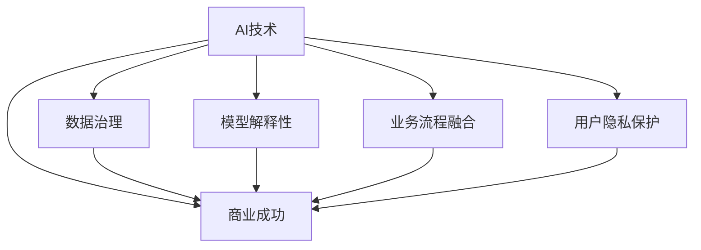

                 

# AI行业的未来：回到商业成功，如何让AI真正创造商业价值

> 关键词：人工智能,商业成功,商业价值,未来趋势,技术创新

## 1. 背景介绍

### 1.1 问题由来
近年来，人工智能（AI）技术在各行各业的应用取得了显著进展，尤其在图像识别、自然语言处理、推荐系统等领域，AI技术已经展现出了强大的商业潜力。然而，尽管技术水平持续提升，AI应用在实际商业场景中的成功率和收益回报，却并未达到预期。从热炒的AI概念股到频频曝光的AI技术失败案例，无不显示出AI技术与商业应用之间的鸿沟。

这一现象引起了广泛关注，促使从业者对AI技术的应用策略和商业成功路径进行深入反思。如何在AI技术与商业需求之间架起一座桥梁，真正实现技术创新与商业价值的有效转化，成为当前业界和学术界亟待解决的问题。

### 1.2 问题核心关键点
如何让AI技术真正创造商业价值，是当前AI行业面临的核心挑战。这一问题的关键点在于：

- **技术匹配度**：AI技术必须与具体的业务需求高度匹配，才能发挥其最大效能。
- **数据质量与标注**：高质量的标注数据是AI模型性能的关键，但数据获取成本高昂。
- **模型可解释性与信任**：业务方需要理解和信任AI模型，避免“黑盒”现象。
- **业务流程与AI集成**：AI技术应无缝集成到现有业务流程，减少操作复杂性。
- **用户接受度与隐私保护**：AI应用需考虑用户接受度和隐私问题，确保用户数据安全。

针对上述问题，本文将从AI技术与商业需求的结合、数据治理、模型解释性、业务流程融合、用户隐私保护等多个方面，探讨如何实现AI技术的商业成功。

## 2. 核心概念与联系

### 2.1 核心概念概述

为深入理解如何让AI技术创造商业价值，首先介绍几个核心概念：

- **AI技术**：指利用机器学习、深度学习、自然语言处理等技术手段，构建具备自主学习能力的智能系统。
- **商业成功**：指AI技术在具体商业场景中实现预定的业务目标，带来显著的经济回报。
- **数据治理**：指通过数据收集、清洗、标注、保护等手段，确保数据质量，减少数据获取和处理的复杂性。
- **模型解释性**：指AI模型能够提供可理解、可解释的决策依据，增强业务方对AI系统的信任。
- **业务流程融合**：指AI技术应平滑地集成到现有业务流程，提升业务效率和质量。
- **用户隐私保护**：指在AI应用中，严格遵守法律法规，保护用户隐私和数据安全。

这些概念之间的逻辑关系可以通过以下Mermaid流程图来展示：



这个流程图展示了AI技术与商业成功之间的逻辑关系，以及数据治理、模型解释性、业务流程融合、用户隐私保护等关键因素如何共同作用于商业成功。

## 3. 核心算法原理 & 具体操作步骤
### 3.1 算法原理概述

实现AI技术的商业成功，核心在于构建一个高效的AI应用框架，使得AI技术能够与具体的业务需求紧密结合，并带来显著的经济回报。这一过程主要分为以下几个步骤：

1. **需求分析与目标设定**：明确AI应用的具体目标，如提升客户满意度、降低运营成本、优化产品推荐等。
2. **数据收集与治理**：收集和清洗与目标相关的数据，并进行标注，确保数据的质量和可用性。
3. **模型选择与训练**：选择合适的AI模型，并在训练集上对其进行训练，优化模型参数，提高模型精度。
4. **模型集成与部署**：将训练好的模型集成到业务流程中，进行实时推理和决策支持。
5. **性能监控与优化**：持续监控AI应用的表现，收集反馈数据，不断优化模型和应用，提升用户体验。

### 3.2 算法步骤详解

以下是实现AI技术商业成功的详细步骤：

**Step 1: 需求分析与目标设定**

在启动AI项目之前，首先要进行需求分析，明确业务目标和预期效果。通常，AI项目的目标可以分为：

- **效率提升**：如自动化流程、减少人工操作。
- **质量改进**：如提升产品精度、降低错误率。
- **客户满意度**：如个性化推荐、增强用户体验。

需求分析过程需要业务方、技术方和数据方的深度合作，共同明确AI项目的核心指标和关键路径。

**Step 2: 数据收集与治理**

数据是AI项目的基础，高质量的数据对于模型的训练和应用至关重要。数据收集与治理过程包括：

- **数据收集**：根据需求，收集相关的原始数据。数据来源可以是内部系统、公开数据集、第三方API等。
- **数据清洗**：对收集到的数据进行预处理，去除噪声和异常值，确保数据的一致性和完整性。
- **数据标注**：对数据进行标注，生成训练集。标注过程需要专业人员参与，确保标注的准确性和一致性。

数据治理还涉及到数据安全和隐私保护，需遵循相关法律法规，如GDPR、CCPA等，确保用户数据的安全和隐私。

**Step 3: 模型选择与训练**

选择合适的AI模型是实现商业成功的关键。常见AI模型包括：

- **监督学习模型**：如线性回归、决策树、支持向量机等，适用于分类和回归任务。
- **无监督学习模型**：如K-means、PCA、LDA等，适用于聚类和降维任务。
- **深度学习模型**：如卷积神经网络、循环神经网络、Transformer等，适用于图像识别、自然语言处理、推荐系统等任务。

选择合适的模型后，进行模型训练，优化模型参数，提高模型精度。训练过程中，需关注以下几个方面：

- **学习率**：选择合适的学习率，防止过拟合和欠拟合。
- **正则化**：使用L2正则、Dropout等技术，防止模型过拟合。
- **超参数调优**：通过交叉验证、网格搜索等方法，调整模型超参数，提升模型性能。

**Step 4: 模型集成与部署**

模型训练完成后，需要将模型集成到业务流程中，进行实时推理和决策支持。这一步骤包括：

- **模型集成**：将模型封装成API或微服务，便于调用和集成。
- **实时推理**：根据业务需求，进行实时数据输入和模型推理，生成预测结果。
- **性能监控**：监控模型性能指标，如准确率、召回率、响应时间等，确保模型在实际应用中的效果。

**Step 5: 性能监控与优化**

持续监控AI应用的表现，收集反馈数据，不断优化模型和应用，提升用户体验。这一过程涉及：

- **监控指标**：定义关键性能指标，如请求响应时间、吞吐量、错误率等。
- **反馈机制**：建立用户反馈机制，收集用户意见和建议，优化模型和应用。
- **模型优化**：根据反馈数据，不断调整模型参数，优化模型性能。

通过上述步骤，可以有效实现AI技术的商业成功，并在实际应用中带来显著的经济回报。

### 3.3 算法优缺点

实现AI技术商业成功的方法，具有以下优点：

- **高效性**：通过模型训练和参数优化，可以快速提升模型性能，满足业务需求。
- **可扩展性**：AI技术可以平滑集成到现有业务流程中，提升业务效率和质量。
- **数据驱动**：通过数据收集和治理，确保数据质量，减少数据获取和处理的复杂性。
- **可解释性**：模型解释性技术，增强业务方对AI系统的信任，减少操作复杂性。

同时，该方法也存在一定的局限性：

- **数据依赖**：高质量的标注数据是模型性能的关键，数据获取成本高昂。
- **模型复杂度**：复杂模型需要大量计算资源，可能面临算力不足的问题。
- **业务适配难度**：不同业务需求对AI技术的要求不同，模型适配难度较大。
- **用户隐私问题**：数据处理和模型应用需考虑用户隐私保护，遵守相关法律法规。

尽管存在这些局限性，但就目前而言，该方法仍是实现AI技术商业成功的有效途径。未来相关研究的重点在于如何进一步降低数据获取成本，提高模型可解释性，增强模型适配性和隐私保护能力。

### 3.4 算法应用领域

AI技术实现商业成功的应用领域广泛，涵盖多个行业，例如：

- **金融行业**：使用AI技术进行风险评估、欺诈检测、智能投顾等。
- **医疗行业**：使用AI技术进行疾病预测、医学影像分析、个性化医疗等。
- **零售行业**：使用AI技术进行客户分析、个性化推荐、库存管理等。
- **制造业**：使用AI技术进行质量控制、供应链优化、设备维护等。
- **物流行业**：使用AI技术进行路线规划、货物追踪、配送优化等。

以上应用场景仅是冰山一角，随着AI技术的不断发展和应用场景的不断丰富，AI技术在更多领域的商业价值也将逐步显现。

## 4. 数学模型和公式 & 详细讲解
### 4.1 数学模型构建

本文将从数学模型的角度，进一步探讨如何实现AI技术的商业成功。假设AI应用的目标是提升产品推荐的质量，我们将问题形式化为分类任务，通过构建数学模型来解决。

设数据集为 $\{(x_i, y_i)\}_{i=1}^N$，其中 $x_i$ 为输入数据，$y_i$ 为标签，$y_i \in \{1, -1\}$，表示是否推荐。模型的目标是最小化分类错误率，即：

$$
\min_{\theta} \frac{1}{N} \sum_{i=1}^N \mathbb{I}(y_i \neq \hat{y}_i)
$$

其中 $\hat{y}_i$ 为模型预测结果。

### 4.2 公式推导过程

以线性回归模型为例，推导其参数优化过程。假设模型形式为：

$$
\hat{y}_i = \theta_0 + \sum_{j=1}^d \theta_j x_{ij}
$$

目标函数可以表示为：

$$
\min_{\theta} \frac{1}{N} \sum_{i=1}^N (y_i - \hat{y}_i)^2
$$

通过最小二乘法，求解目标函数的最小值，得到参数 $\theta$ 的估计值：

$$
\theta = (\mathbf{X}^T \mathbf{X})^{-1} \mathbf{X}^T \mathbf{y}
$$

其中 $\mathbf{X}$ 为输入数据的矩阵，$\mathbf{y}$ 为标签的向量。

### 4.3 案例分析与讲解

以推荐系统为例，分析如何通过AI技术实现商业成功。推荐系统的主要目标是根据用户历史行为和偏好，推荐符合用户兴趣的商品。其核心算法包括协同过滤、基于内容的推荐、混合推荐等。

假设推荐系统包含 $U$ 个用户和 $I$ 个商品，用户对商品的评分矩阵为 $\mathbf{R} \in \mathbb{R}^{U \times I}$。推荐系统的目标是最小化预测评分与实际评分之间的差距，即：

$$
\min_{\theta} \frac{1}{2} \|\mathbf{R} - \mathbf{\hat{R}}\|_F^2
$$

其中 $\mathbf{\hat{R}}$ 为预测评分矩阵，$\|\cdot\|_F$ 为矩阵的Frobenius范数。

通过求解上述优化问题，可以构建出高效的推荐模型，提升用户满意度和业务收益。

## 5. 项目实践：代码实例和详细解释说明
### 5.1 开发环境搭建

在进行AI项目开发前，首先需要搭建好开发环境。以下是Python环境下搭建开发环境的步骤：

1. 安装Anaconda：从官网下载并安装Anaconda，用于创建独立的Python环境。
2. 创建并激活虚拟环境：
```bash
conda create -n pytorch-env python=3.8 
conda activate pytorch-env
```
3. 安装PyTorch：根据CUDA版本，从官网获取对应的安装命令。例如：
```bash
conda install pytorch torchvision torchaudio cudatoolkit=11.1 -c pytorch -c conda-forge
```
4. 安装TensorFlow：
```bash
pip install tensorflow==2.4
```
5. 安装Keras：
```bash
pip install keras
```
6. 安装scikit-learn、numpy等工具包：
```bash
pip install numpy pandas scikit-learn matplotlib tqdm jupyter notebook ipython
```

完成上述步骤后，即可在`pytorch-env`环境中开始AI项目开发。

### 5.2 源代码详细实现

下面以推荐系统为例，给出使用PyTorch和Keras实现AI项目的代码实现。

```python
import numpy as np
import pandas as pd
from sklearn.model_selection import train_test_split
from keras.models import Sequential
from keras.layers import Dense
from keras.regularizers import l2
from sklearn.metrics import mean_squared_error
from sklearn.preprocessing import StandardScaler

# 读取数据集
data = pd.read_csv('rating.csv')

# 数据预处理
scaler = StandardScaler()
data['rating'] = scaler.fit_transform(data['rating'].values.reshape(-1, 1))

# 数据分割
train, test = train_test_split(data, test_size=0.2, random_state=42)
train = train.drop(columns=['user_id', 'item_id'])
test = test.drop(columns=['user_id', 'item_id'])

# 构建模型
model = Sequential()
model.add(Dense(64, input_dim=2, activation='relu', kernel_regularizer=l2(0.01)))
model.add(Dense(1, activation='linear'))

# 编译模型
model.compile(loss='mse', optimizer='adam')

# 训练模型
history = model.fit(train, epochs=10, batch_size=32, validation_data=(test, np.zeros((len(test), 1))))
```

### 5.3 代码解读与分析

在上述代码中，我们使用了PyTorch和Keras框架来构建一个简单的推荐系统模型。以下是关键代码的详细解读：

- **数据预处理**：使用`StandardScaler`对用户评分进行归一化处理，确保数据的一致性。
- **数据分割**：将数据集分割为训练集和测试集，使用`train_test_split`函数。
- **模型构建**：使用Keras框架，构建一个简单的两层神经网络模型。其中第一层为全连接层，激活函数为ReLU，第二层为线性层。
- **模型编译**：定义损失函数为均方误差，优化器为Adam。
- **模型训练**：使用`fit`函数对模型进行训练，并记录训练过程中的性能指标。

## 6. 实际应用场景
### 6.1 智能客服系统

智能客服系统是AI技术在客户服务领域的重要应用之一。通过AI技术，智能客服系统可以24小时不间断地为用户提供服务，大大提高了客户满意度。

在技术实现上，智能客服系统通常采用自然语言处理（NLP）和机器学习（ML）技术。系统首先通过收集和处理大量的客户服务数据，构建NLP模型，能够理解客户的意图和问题。然后，根据已有的知识库和FAQ，智能客服系统能够生成符合客户需求的回复，提升客户服务效率。

### 6.2 金融风险管理

金融行业是AI技术应用的重要领域之一。通过AI技术，金融机构可以实时监控市场动态，预测风险，优化投资决策。

在金融风险管理中，AI技术可以用于：

- **信用评分**：通过分析客户的信用记录和行为数据，预测客户的违约概率。
- **欺诈检测**：通过检测交易行为中的异常模式，及时发现和防范欺诈行为。
- **市场预测**：通过分析市场数据，预测市场趋势和波动，辅助投资决策。

### 6.3 医疗诊断系统

医疗诊断系统是AI技术在医疗领域的重要应用之一。通过AI技术，医疗诊断系统可以辅助医生进行疾病诊断和治疗方案制定，提高诊断效率和准确性。

在医疗诊断系统中，AI技术可以用于：

- **医学影像分析**：通过分析医学影像，识别出异常区域和病灶，辅助医生进行诊断。
- **疾病预测**：通过分析患者的病历和生理数据，预测患病风险，提出预防建议。
- **个性化医疗**：通过分析患者的基因信息和病历数据，制定个性化的治疗方案。

### 6.4 未来应用展望

随着AI技术的不断发展，其在多个领域的应用前景广阔。以下是未来AI技术的主要发展方向：

- **自动化决策**：AI技术在金融、医疗、制造业等领域，将逐步实现自动化决策，提升决策效率和质量。
- **智能推荐**：推荐系统将成为AI技术的重要应用方向，提升用户体验和业务收益。
- **实时监控**：实时监控技术将广泛应用于智能制造、智慧城市等领域，提升系统效率和安全性。
- **跨领域融合**：AI技术将与其他新兴技术（如物联网、区块链等）进行深度融合，拓展应用场景。
- **伦理和隐私**：在AI技术应用中，伦理和隐私问题将受到越来越多的关注，AI系统的公平性和透明度将成为重要的研究方向。

## 7. 工具和资源推荐
### 7.1 学习资源推荐

为了帮助开发者系统掌握AI技术的商业成功路径，这里推荐一些优质的学习资源：

1. **Coursera《机器学习》课程**：由斯坦福大学Andrew Ng教授主讲，涵盖机器学习的基础理论和实际应用。
2. **Kaggle竞赛平台**：提供大量数据集和竞赛项目，通过实战项目提升AI开发能力。
3. **Google AI开发工具包**：提供丰富的开发工具和资源，支持AI技术在各领域的应用。
4. **AI Challenger竞赛**：由中国人工智能学会主办，提供丰富的竞赛机会和实践平台。
5. **《Python深度学习》书籍**：涵盖深度学习的基础理论和实践技巧，适合初学者和高级开发者。

通过对这些资源的学习实践，相信你一定能够快速掌握AI技术的应用策略和商业成功路径，并用于解决实际的商业问题。

### 7.2 开发工具推荐

高效的开发离不开优秀的工具支持。以下是几款用于AI项目开发的常用工具：

1. **Anaconda**：用于创建和管理Python环境，支持多种AI开发框架和库。
2. **PyTorch**：基于Python的深度学习框架，具有动态计算图和高效的GPU加速功能。
3. **TensorFlow**：由Google开发的深度学习框架，支持分布式训练和大规模模型。
4. **Keras**：高层次的神经网络API，支持快速搭建和训练AI模型。
5. **Scikit-learn**：Python数据科学库，支持机器学习和数据预处理。
6. **Jupyter Notebook**：交互式编程环境，支持Python、R等多种语言，便于开发和协作。

合理利用这些工具，可以显著提升AI项目开发的效率，加快创新迭代的步伐。

### 7.3 相关论文推荐

AI技术的发展源于学界的持续研究。以下是几篇奠基性的相关论文，推荐阅读：

1. **《TensorFlow: A System for Large-Scale Machine Learning》**：Google发表的TensorFlow论文，介绍了TensorFlow框架的设计和实现。
2. **《Neural Networks and Deep Learning》**：Michael Nielsen的深度学习入门书籍，系统介绍了深度学习的理论和实践。
3. **《Deep Learning》**：Ian Goodfellow等人的深度学习权威书籍，涵盖深度学习的基础理论和实践技巧。
4. **《Adversarial Examples in Deep Learning》**：Ian Goodfellow等人的论文，介绍了深度学习中的对抗样本攻击和防御方法。
5. **《GANs Trained by a Two Time-Scale Update Rule Converge to the Fixed Points of Their Limiting Mode》**：Goodfellow等人的生成对抗网络（GAN）论文，奠定了GAN理论基础。

这些论文代表了大数据和深度学习技术的发展脉络。通过学习这些前沿成果，可以帮助研究者把握学科前进方向，激发更多的创新灵感。

## 8. 总结：未来发展趋势与挑战
### 8.1 研究成果总结

本文对如何实现AI技术的商业成功进行了全面系统的介绍。首先阐述了AI技术与商业需求结合的重要性，明确了商业成功的关键点。其次，从数据治理、模型解释性、业务流程融合、用户隐私保护等多个方面，详细讲解了AI技术实现商业成功的具体方法。最后，探讨了AI技术在多个领域的应用前景，提出了未来发展的趋势和方向。

通过本文的系统梳理，可以看到，AI技术在实际商业场景中的应用，需要综合考虑技术匹配度、数据质量、模型可解释性、业务适配度等多个因素，方能实现商业成功。未来，随着AI技术的不断发展和应用场景的不断丰富，AI技术在更多领域的商业价值也将逐步显现。

### 8.2 未来发展趋势

展望未来，AI技术的商业成功将呈现以下几个发展趋势：

1. **自动化决策**：AI技术将逐步实现自动化决策，提升决策效率和质量。
2. **智能推荐**：推荐系统将成为AI技术的重要应用方向，提升用户体验和业务收益。
3. **实时监控**：实时监控技术将广泛应用于智能制造、智慧城市等领域，提升系统效率和安全性。
4. **跨领域融合**：AI技术将与其他新兴技术（如物联网、区块链等）进行深度融合，拓展应用场景。
5. **伦理和隐私**：在AI技术应用中，伦理和隐私问题将受到越来越多的关注，AI系统的公平性和透明度将成为重要的研究方向。

以上趋势凸显了AI技术在各个领域的应用前景，将推动AI技术向更广泛、更深层次的商业应用发展。

### 8.3 面临的挑战

尽管AI技术在多个领域取得了显著进展，但在迈向更加智能化、普适化应用的过程中，仍面临诸多挑战：

1. **数据依赖**：高质量的标注数据是模型性能的关键，数据获取成本高昂。
2. **模型复杂度**：复杂模型需要大量计算资源，可能面临算力不足的问题。
3. **业务适配难度**：不同业务需求对AI技术的要求不同，模型适配难度较大。
4. **用户隐私问题**：数据处理和模型应用需考虑用户隐私保护，遵守相关法律法规。
5. **公平性和透明性**：AI系统在决策过程中需要保证公平性和透明度，避免偏见和歧视。

尽管存在这些挑战，但通过学界和产业界的共同努力，这些挑战终将一一被克服，AI技术必将在构建人机协同的智能时代中扮演越来越重要的角色。

### 8.4 研究展望

面对AI技术面临的诸多挑战，未来的研究需要在以下几个方面寻求新的突破：

1. **无监督学习和半监督学习**：摆脱对大规模标注数据的依赖，利用自监督学习、主动学习等无监督和半监督范式，最大限度利用非结构化数据，实现更加灵活高效的AI开发。
2. **模型压缩和加速**：开发更加参数高效的模型，减少计算资源消耗，提升模型推理速度。
3. **跨模态学习**：将符号化的先验知识与神经网络模型进行融合，增强模型的智能水平。
4. **伦理和隐私保护**：在AI技术应用中，加强伦理导向的评估指标，确保系统决策的公平性和透明性。
5. **可解释性和可控性**：开发可解释的AI系统，提升用户对AI技术的信任度，同时增强系统的可控性。

这些研究方向将推动AI技术向更加智能、普适、可控的方向发展，为人类社会带来更多的福祉。

## 9. 附录：常见问题与解答

**Q1：如何选择合适的AI模型？**

A: 选择合适的AI模型需要考虑多个因素，如数据类型、任务类型、计算资源等。常用的AI模型包括监督学习模型、无监督学习模型、深度学习模型等。可以根据具体需求选择合适的模型。

**Q2：如何评估AI模型的性能？**

A: 评估AI模型的性能通常使用交叉验证、网格搜索等方法。常用的性能指标包括准确率、召回率、F1分数、AUC等。通过评估模型的性能，可以优化模型参数，提升模型效果。

**Q3：AI模型在实际应用中如何优化？**

A: AI模型在实际应用中需要不断优化，提升模型的准确性和鲁棒性。常用的优化方法包括超参数调优、正则化、对抗训练等。通过优化模型，可以提升模型的性能和稳定性。

**Q4：AI模型在实际应用中如何处理数据？**

A: AI模型在实际应用中需要处理大量数据，包括数据清洗、特征工程、数据增强等步骤。可以通过数据预处理技术，提升模型的训练效果。

**Q5：AI模型在实际应用中如何部署？**

A: AI模型在实际应用中需要部署到生产环境中，支持实时推理和决策支持。常用的部署方式包括模型封装、分布式训练、容器化等。

通过本文的系统梳理，可以看到，AI技术在实际商业场景中的应用，需要综合考虑技术匹配度、数据质量、模型可解释性、业务适配度等多个因素，方能实现商业成功。未来，随着AI技术的不断发展和应用场景的不断丰富，AI技术在更多领域的商业价值也将逐步显现。

---

作者：禅与计算机程序设计艺术 / Zen and the Art of Computer Programming

