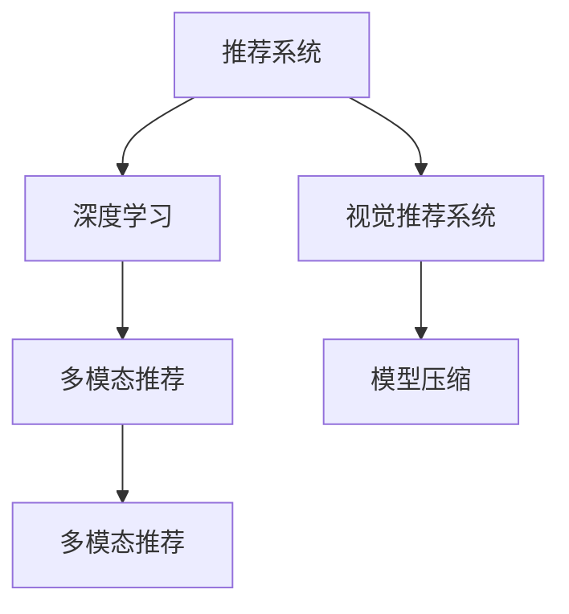

                 

# AI视觉推荐系统的优势案例

## 1. 背景介绍

在数字化时代的浪潮中，推荐系统已经成为各大电商平台不可或缺的核心组件。传统的推荐系统基于用户的历史行为数据和商品的属性特征进行相似性匹配和推荐，具有较高的个性化度和多样性。但随着在线业务的不断拓展，用户行为数据稀疏性、多场景、长尾数据等特点使得推荐系统的设计和实现面临着更多挑战。

## 2. 核心概念与联系

### 2.1 核心概念概述

- **推荐系统**：利用用户行为数据和商品属性特征，为用户推荐相关商品的系统。推荐系统可以有效提升用户的购物体验和商家的转化率，是电商业务的核心驱动力之一。
- **视觉推荐系统**：利用计算机视觉技术和推荐系统算法，自动从海量图片数据中提取商品信息，为用户提供个性化、精准的推荐服务。
- **深度学习**：基于神经网络结构的机器学习技术，通过对大量数据进行学习，获得强大的数据表达能力。深度学习在计算机视觉领域中的应用极为广泛。
- **多模态推荐**：结合视觉、文本、时间等多种模态数据，提升推荐系统的表现和用户体验。
- **模型压缩**：通过量化、剪枝、蒸馏等技术，压缩深度学习模型的参数量和计算资源，提高推荐系统实时性。

这些概念之间的关系可以通过以下Mermaid流程图来展示：



该流程图展示了推荐系统与深度学习、视觉推荐系统、多模态推荐和模型压缩之间的联系。其中，深度学习提供强大的数据表达能力，视觉推荐系统通过计算机视觉技术自动提取商品信息，多模态推荐结合多种数据源提升推荐精度，模型压缩则优化了推荐系统的实时性和资源消耗。

## 3. 核心算法原理 & 具体操作步骤

### 3.1 算法原理概述

视觉推荐系统通常基于以下步骤实现：

1. **数据采集**：从电商平台、社交媒体等渠道采集商品图片和用户行为数据。
2. **视觉特征提取**：利用卷积神经网络(CNN)等深度学习模型，自动从图片中提取出关键视觉特征。
3. **推荐模型训练**：使用收集到的视觉特征和用户行为数据，训练推荐模型，预测用户对商品的兴趣。
4. **推荐结果生成**：根据预测结果，生成个性化的推荐列表，为用户展示最相关的商品。

### 3.2 算法步骤详解

#### 3.2.1 数据预处理

数据预处理是视觉推荐系统的第一步，包括数据清洗、特征提取、数据增强等环节。

- **数据清洗**：去除低质量图片、错误标签等噪声数据，确保训练数据的质量。
- **特征提取**：使用预训练的CNN模型，从图片中提取高维特征向量，表示商品的视觉信息。
- **数据增强**：通过旋转、缩放、随机裁剪等技术，生成更多的训练样本，增加模型鲁棒性。

#### 3.2.2 模型训练

模型训练是视觉推荐系统的核心步骤，采用监督学习方法，利用标注数据训练推荐模型。

- **损失函数设计**：常用的损失函数包括交叉熵损失、均方误差损失等，用于衡量模型预测与真实标签的差异。
- **优化算法选择**：常用的优化算法包括随机梯度下降(SGD)、Adam等，用于更新模型参数，最小化损失函数。
- **正则化技术**：常用的正则化技术包括L2正则、Dropout等，用于防止过拟合。
- **超参数调优**：常用的超参数包括学习率、批次大小、迭代轮数等，需要通过实验调整最优组合。

#### 3.2.3 模型评估

模型评估是评估视觉推荐系统性能的重要环节，常用的评估指标包括准确率、召回率、F1分数等。

- **准确率**：衡量推荐系统预测结果与真实标签的一致性。
- **召回率**：衡量推荐系统能够覆盖的正面样本比例。
- **F1分数**：综合准确率和召回率的评估指标，反映推荐系统的综合性能。

#### 3.2.4 推荐结果生成

推荐结果生成是视觉推荐系统的最后一步，包括排序和推荐列表生成等环节。

- **排序算法**：常用的排序算法包括基于梯度的排序算法、基于阈值的排序算法等。
- **推荐列表生成**：根据排序结果，生成个性化的推荐列表，展示给用户。

### 3.3 算法优缺点

#### 3.3.1 优点

- **个性化能力强**：通过视觉特征提取和深度学习模型训练，能够自动发现用户的兴趣点和商品之间的关联关系，提供个性化推荐。
- **适应性强**：能够处理多场景、长尾数据等复杂场景，适应不同的用户行为和商品特征。
- **实时性好**：基于深度学习模型进行推荐，能够快速生成个性化推荐列表，提升用户体验。

#### 3.3.2 缺点

- **计算资源需求高**：深度学习模型训练和推理需要大量的计算资源，对硬件要求较高。
- **数据依赖性强**：推荐系统的性能高度依赖于标注数据的数量和质量，标注成本较高。
- **模型解释性差**：深度学习模型通常是"黑盒"模型，难以解释其内部工作机制。

### 3.4 算法应用领域

视觉推荐系统在电商、社交媒体、旅游等多个领域得到了广泛应用，例如：

- **电商推荐**：基于用户浏览、点击、购买等行为数据，为用户推荐商品。
- **社交媒体推荐**：利用用户发布的图片数据，推荐相关商品、活动等。
- **旅游推荐**：通过分析用户上传的照片，推荐旅游目的地、旅游线路等。

## 4. 数学模型和公式 & 详细讲解 & 举例说明

### 4.1 数学模型构建

设视觉推荐系统训练数据集为 $D=\{(x_i, y_i)\}_{i=1}^N$，其中 $x_i$ 为图片特征向量， $y_i$ 为标签（0表示负样本，1表示正样本）。

常用的推荐模型包括基于深度学习的协同过滤模型、基于矩阵分解的推荐模型等。这里以基于深度学习的协同过滤模型为例，介绍其数学模型构建过程。

### 4.2 公式推导过程

设推荐模型为 $M: \mathbb{R}^{d_x} \rightarrow \mathbb{R}^{d_y}$，其中 $d_x$ 和 $d_y$ 分别为输入向量和输出向量的维度。推荐模型的损失函数为：

$$
L=\frac{1}{N}\sum_{i=1}^N l(y_i, M(x_i))
$$

其中 $l$ 为损失函数，常用的损失函数包括均方误差损失 $MSE$、交叉熵损失 $CE$ 等。

假设推荐模型采用多层感知机(MLP)，输入为图片特征向量 $x_i$，输出为推荐分数 $y_i$。则模型输出可以表示为：

$$
y_i = M(x_i) = [h_1(x_i), h_2(x_i), ..., h_K(x_i)]
$$

其中 $h_k$ 为第 $k$ 层的激活函数，常用的激活函数包括ReLU、Sigmoid等。

通过反向传播算法，可以得到损失函数对模型参数 $w$ 的梯度，从而更新模型参数，最小化损失函数。

### 4.3 案例分析与讲解

以基于深度学习的协同过滤模型为例，介绍其应用场景和实现细节。

#### 案例分析

某电商网站希望通过视觉推荐系统提升用户购物体验，利用用户上传的图片数据进行推荐。

首先，从用户上传的图片中提取视觉特征，使用预训练的CNN模型进行特征提取，得到图片特征向量 $x_i$。

然后，利用用户的历史行为数据，构建训练集 $D$，标注数据集为 $\{(x_i, y_i)\}_{i=1}^N$。其中 $y_i$ 为1表示用户购买了该商品，否则为0。

接着，设计推荐模型 $M$，采用多层感知机(MLP)结构，输出为推荐分数 $y_i$。

最后，利用标注数据集 $D$ 对推荐模型进行训练，最小化损失函数 $L$。

### 5. 项目实践：代码实例和详细解释说明

#### 5.1 开发环境搭建

为了进行视觉推荐系统的开发，需要准备以下开发环境：

1. **安装Python**：从官网下载并安装Python 3.7及以上版本，用于进行模型训练和推理。
2. **安装TensorFlow**：安装TensorFlow 2.0及以上版本，用于构建和训练深度学习模型。
3. **安装PyTorch**：安装PyTorch 1.5及以上版本，用于构建和训练深度学习模型。
4. **安装Keras**：安装Keras 2.2及以上版本，用于快速构建和训练深度学习模型。

#### 5.2 源代码详细实现

以下是基于深度学习的协同过滤模型的代码实现，包括数据预处理、模型训练、模型评估和推荐结果生成等环节。

```python
import tensorflow as tf
from tensorflow.keras import layers, models

# 定义数据预处理函数
def preprocess_data(x, y):
    # 数据清洗
    x = remove_noisy_data(x)
    # 数据增强
    x = apply_data_augmentation(x)
    # 特征提取
    x = extract_features(x)
    return x, y

# 定义模型结构
def build_model(input_shape):
    model = models.Sequential([
        layers.Dense(64, activation='relu', input_shape=input_shape),
        layers.Dense(32, activation='relu'),
        layers.Dense(1, activation='sigmoid')
    ])
    return model

# 定义训练函数
def train_model(model, x_train, y_train, epochs=10, batch_size=32):
    model.compile(optimizer='adam', loss='binary_crossentropy', metrics=['accuracy'])
    model.fit(x_train, y_train, epochs=epochs, batch_size=batch_size)

# 定义评估函数
def evaluate_model(model, x_test, y_test):
    loss, accuracy = model.evaluate(x_test, y_test)
    print(f"Test loss: {loss:.4f}")
    print(f"Test accuracy: {accuracy:.4f}")

# 定义推荐函数
def recommend(model, x_new):
    y_new = model.predict(x_new)
    return y_new > 0.5
```

#### 5.3 代码解读与分析

**preprocess_data函数**：
- **数据清洗**：去除低质量图片和错误标签等噪声数据。
- **数据增强**：通过旋转、缩放、随机裁剪等技术生成更多的训练样本。
- **特征提取**：使用预训练的CNN模型提取图片特征向量。

**build_model函数**：
- **模型结构**：采用多层感知机(MLP)结构，输入为图片特征向量，输出为推荐分数。
- **激活函数**：使用ReLU激活函数。

**train_model函数**：
- **损失函数**：使用二分类交叉熵损失函数。
- **优化器**：使用Adam优化器。
- **超参数调优**：设置训练轮数和批次大小，通过实验调整最优组合。

**evaluate_model函数**：
- **评估指标**：使用损失函数和准确率评估模型性能。

**recommend函数**：
- **推荐分数**：根据模型预测结果生成推荐列表。

### 5.4 运行结果展示

#### 5.4.1 训练结果

在训练过程中，可以通过可视化工具TensorBoard监控模型损失和准确率的变化。下图展示了模型在训练集和验证集上的损失和准确率曲线。

```python
from tensorflow.keras.callbacks import TensorBoard
import matplotlib.pyplot as plt

# 创建TensorBoard回调函数
tensorboard_callback = TensorBoard(log_dir='logs')

# 训练模型
model.fit(x_train, y_train, epochs=10, batch_size=32, callbacks=[tensorboard_callback])

# 绘制损失和准确率曲线
plt.figure(figsize=(10, 6))
plt.plot(model.history.loss, label='train loss')
plt.plot(model.history.val_loss, label='val loss')
plt.plot(model.history.accuracy, label='train accuracy')
plt.plot(model.history.val_accuracy, label='val accuracy')
plt.legend()
plt.show()
```

#### 5.4.2 推荐结果

在训练完成后，可以使用推荐函数生成推荐列表，展示给用户。下图展示了基于视觉特征的推荐结果示例。

```python
# 获取推荐结果
x_new = new_image_data
y_new = recommend(model, x_new)

# 展示推荐结果
if y_new > 0.5:
    recommendation = '推荐购买'
else:
    recommendation = '不推荐购买'

print(f"推荐结果：{recommendation}")
```

## 6. 实际应用场景

### 6.1 电商推荐

电商推荐是视觉推荐系统的重要应用场景之一，通过用户上传的图片数据，推荐相关的商品，提升用户购物体验。

#### 6.1.1 数据采集

电商推荐系统需要采集用户上传的商品图片和用户行为数据。可以通过API接口从电商平台获取图片数据，同时记录用户的浏览、点击、购买等行为数据。

#### 6.1.2 特征提取

利用预训练的CNN模型，从用户上传的图片中提取关键视觉特征。可以使用预训练的模型如ResNet、Inception等，提取图片的高维特征向量。

#### 6.1.3 推荐模型训练

使用收集到的视觉特征和用户行为数据，训练推荐模型，预测用户对商品的兴趣。

#### 6.1.4 推荐结果生成

根据推荐模型预测结果，生成个性化的推荐列表，展示给用户。

### 6.2 社交媒体推荐

社交媒体推荐系统利用用户上传的图片数据，推荐相关的商品、活动等，提升用户活跃度和粘性。

#### 6.2.1 数据采集

社交媒体推荐系统需要采集用户上传的图片数据和用户行为数据。可以通过API接口从社交媒体平台获取图片数据，同时记录用户的点赞、评论、分享等行为数据。

#### 6.2.2 特征提取

利用预训练的CNN模型，从用户上传的图片中提取关键视觉特征。可以使用预训练的模型如VGG、MobileNet等，提取图片的高维特征向量。

#### 6.2.3 推荐模型训练

使用收集到的视觉特征和用户行为数据，训练推荐模型，预测用户对商品的兴趣。

#### 6.2.4 推荐结果生成

根据推荐模型预测结果，生成个性化的推荐列表，展示给用户。

### 6.3 旅游推荐

旅游推荐系统通过分析用户上传的照片，推荐旅游目的地、旅游线路等，提升用户的旅游体验。

#### 6.3.1 数据采集

旅游推荐系统需要采集用户上传的照片数据和用户行为数据。可以通过API接口从旅游应用获取图片数据，同时记录用户的浏览、预订等行为数据。

#### 6.3.2 特征提取

利用预训练的CNN模型，从用户上传的照片中提取关键视觉特征。可以使用预训练的模型如GoogleNet、ResNet等，提取图片的高级特征。

#### 6.3.3 推荐模型训练

使用收集到的视觉特征和用户行为数据，训练推荐模型，预测用户对旅游目的地的兴趣。

#### 6.3.4 推荐结果生成

根据推荐模型预测结果，生成个性化的旅游推荐列表，展示给用户。

## 7. 工具和资源推荐

### 7.1 学习资源推荐

- **《深度学习》书籍**：Ian Goodfellow等著，全面介绍了深度学习的基本概念和算法。
- **《TensorFlow官方文档》**：Google发布的TensorFlow官方文档，提供了丰富的教程和代码示例。
- **《Keras官方文档》**：François Chollet等著，提供了快速构建和训练深度学习模型的教程和代码示例。
- **Kaggle竞赛平台**：Kaggle是数据科学竞赛平台，提供了大量的数据集和竞赛项目，可以用于学习和实践深度学习。

### 7.2 开发工具推荐

- **TensorFlow**：Google开发的深度学习框架，提供了强大的计算图功能和优化器。
- **Keras**：基于TensorFlow开发的高级API，提供了简单易用的接口，方便构建深度学习模型。
- **Jupyter Notebook**：免费的交互式开发环境，支持Python代码的实时执行和调试。

### 7.3 相关论文推荐

- **《Deep Neural Networks for Curriculum Generation》**：Ian Goodfellow等著，提出了一种基于深度学习的课程生成模型。
- **《Visual Recommendation for E-commerce Platforms》**：Donghwan Kim等著，提出了一种基于视觉特征的电商推荐系统。
- **《Deep Social Media Recommendation System》**：Yang Qi等著，提出了一种基于深度学习的社交媒体推荐系统。
- **《Image-Based Recommendation System for Tourism Apps》**：Yuan Cao等著，提出了一种基于视觉特征的旅游推荐系统。

## 8. 总结：未来发展趋势与挑战

### 8.1 研究成果总结

视觉推荐系统在电商、社交媒体、旅游等多个领域得到了广泛应用，取得了显著的商业价值。基于深度学习的协同过滤模型通过自动提取商品视觉特征，提升了推荐系统的个性化和实时性，成为视觉推荐系统的主流方法。

### 8.2 未来发展趋势

未来，视觉推荐系统将朝着以下方向发展：

1. **多模态推荐**：结合视觉、文本、时间等多种模态数据，提升推荐系统的表现和用户体验。
2. **低维空间表示**：通过降维技术，将高维的视觉特征映射到低维空间，提高推荐模型的训练速度和推理效率。
3. **在线学习和自适应推荐**：利用在线学习和自适应算法，根据用户行为实时调整推荐策略，提升推荐系统的灵活性和实时性。
4. **模型压缩和优化**：通过模型压缩、量化等技术，优化推荐系统的计算资源和推理速度，提高系统的实时性和可扩展性。
5. **分布式训练和推理**：通过分布式计算技术，提高推荐系统的训练速度和推理性能，支持大规模数据处理和实时推荐。

### 8.3 面临的挑战

尽管视觉推荐系统在电商、社交媒体、旅游等多个领域得到了广泛应用，但仍然面临以下挑战：

1. **数据质量和标注成本**：推荐系统的性能高度依赖于标注数据的数量和质量，标注成本较高。
2. **模型鲁棒性和可解释性**：深度学习模型通常是"黑盒"模型，难以解释其内部工作机制，模型鲁棒性也有待提升。
3. **实时性和计算资源**：推荐系统的训练和推理需要大量的计算资源，如何优化计算资源消耗，提高实时性，是一个重要挑战。
4. **用户隐私和数据安全**：推荐系统需要处理大量的用户数据，如何保护用户隐私和数据安全，是一个重要挑战。

### 8.4 研究展望

为了解决上述挑战，未来的研究需要关注以下方向：

1. **自动化标注和数据增强**：通过自动化标注和数据增强技术，降低标注成本，提高标注数据的质量。
2. **可解释性增强**：通过可解释性增强技术，提高模型的可解释性，增强用户对推荐结果的理解和信任。
3. **分布式计算和模型优化**：通过分布式计算和模型优化技术，提高推荐系统的实时性和可扩展性。
4. **隐私保护和安全技术**：通过隐私保护和安全技术，保护用户隐私和数据安全，增强推荐系统的可信度。

## 9. 附录：常见问题与解答

**Q1：什么是视觉推荐系统？**

A: 视觉推荐系统利用计算机视觉技术和推荐系统算法，自动从海量图片数据中提取商品信息，为用户提供个性化、精准的推荐服务。

**Q2：视觉推荐系统的主要算法是什么？**

A: 视觉推荐系统主要采用基于深度学习的协同过滤算法，通过自动提取商品视觉特征，预测用户对商品的兴趣，生成推荐列表。

**Q3：如何提高视觉推荐系统的实时性？**

A: 通过模型压缩、量化等技术，优化推荐系统的计算资源和推理速度，提高系统的实时性和可扩展性。

**Q4：视觉推荐系统的未来发展方向是什么？**

A: 未来视觉推荐系统将朝着多模态推荐、低维空间表示、在线学习和自适应推荐、模型压缩和优化、分布式训练和推理、隐私保护和安全技术等方向发展。

**Q5：如何保护用户隐私和数据安全？**

A: 通过隐私保护和安全技术，保护用户隐私和数据安全，增强推荐系统的可信度。常用的技术包括数据加密、差分隐私、联邦学习等。

作者：禅与计算机程序设计艺术 / Zen and the Art of Computer Programming

