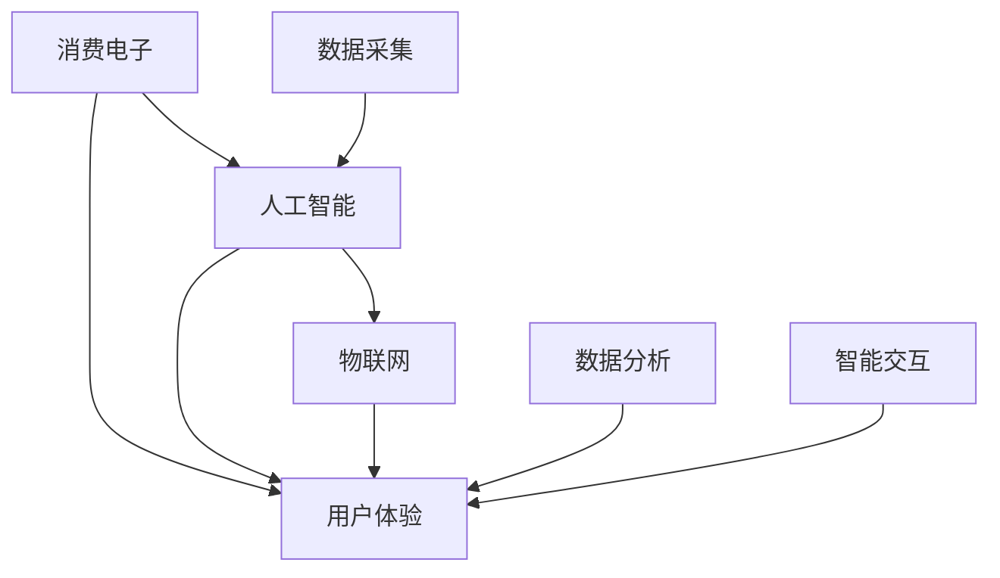

                 

# AI赋能消费电子与用户体验

## 1. 背景介绍

随着人工智能技术的飞速发展，消费电子行业正经历着一场颠覆性的变革。从智能家居、健康监测到个性化娱乐，AI正渗透到每一个角落，为消费者带来全新的体验。本文将从核心概念入手，探讨AI如何赋能消费电子，提升用户体验，并展望未来趋势。

## 2. 核心概念与联系

### 2.1 核心概念概述

- **消费电子**：包括各种以消费者为终端用户的产品，如智能手机、智能电视、可穿戴设备等。这些产品旨在通过智能化技术提升用户的生活便利性和娱乐体验。

- **人工智能(AI)**：通过模拟人类智能行为，如感知、决策、学习等，使机器能够自动完成复杂任务。AI技术在消费电子中的应用，主要体现在语音识别、图像识别、自然语言处理等领域。

- **用户体验(UX)**：消费者对产品交互和使用过程的整体感受和满意度。AI技术的应用，旨在通过个性化推荐、智能辅助、自然交互等方式，提升用户的感知体验和情感满足。

- **物联网(IoT)**：将各类设备互联互通，实现数据共享和智能协同。AI结合物联网技术，可以构建更加智能、高效、互动的消费电子生态系统。

这些概念之间相互联系、相互促进，共同推动着消费电子的智能化进程。

### 2.2 核心概念原理和架构的 Mermaid 流程图



此流程图展示了大语言模型在消费电子和用户体验中的应用链路。数据采集与分析是智能交互的基础，而智能交互又直接影响用户体验。人工智能通过物联网技术将各类设备连接起来，实现数据共享和智能协同，共同提升用户满意度和使用体验。

## 3. 核心算法原理 & 具体操作步骤

### 3.1 算法原理概述

AI在消费电子中的应用，主要通过以下几个核心算法实现：

- **语音识别**：利用深度学习模型（如RNN、CNN、Transformer等）对语音信号进行特征提取和分类，实现语音指令的识别和自然交互。
- **图像识别**：通过卷积神经网络（CNN）等模型对图像特征进行提取和分类，实现对象识别、场景分析等任务。
- **自然语言处理(NLP)**：利用预训练语言模型（如BERT、GPT等）对自然语言进行理解、生成和推理，实现文本翻译、情感分析、智能问答等功能。

### 3.2 算法步骤详解

#### 3.2.1 数据预处理

1. **数据收集**：收集用户行为数据、设备传感器数据、社交媒体数据等。这些数据为后续的分析和模型训练提供基础。
2. **数据清洗**：去除噪声、异常值和不完整数据，保证数据质量。
3. **特征工程**：提取、筛选和构造特征，如语音信号的MFCC特征、图像的局部特征等。

#### 3.2.2 模型训练

1. **选择模型**：根据具体任务选择适合的深度学习模型，如CNN、RNN、Transformer等。
2. **训练过程**：使用GPU等高性能计算资源进行模型训练，优化超参数，如学习率、批大小、正则化系数等。
3. **评估与调优**：在验证集上评估模型性能，通过调整超参数、模型结构等手段进行调优。

#### 3.2.3 模型部署

1. **模型导出**：将训练好的模型保存为模型文件或导出为API接口，供实际应用调用。
2. **集成到产品**：将模型集成到消费电子设备中，实现智能功能。
3. **持续迭代**：根据用户反馈和新数据，不断更新模型，提升性能。

### 3.3 算法优缺点

#### 3.3.1 优点

- **提高效率**：AI技术可以自动化处理大量重复性工作，提高生产效率。
- **提升用户体验**：通过个性化推荐、智能交互等方式，提升用户满意度和使用体验。
- **多样化应用**：AI技术适用于多种场景，如智能家居、健康监测、个性化娱乐等。

#### 3.3.2 缺点

- **数据隐私**：大量数据收集和使用可能涉及用户隐私问题。
- **技术门槛高**：AI技术的应用需要专业知识和技能，增加了开发和维护成本。
- **性能依赖硬件**：AI模型的训练和推理需要高性能计算资源，增加了硬件成本。

### 3.4 算法应用领域

AI在消费电子中的应用，主要集中在以下几个领域：

1. **智能家居**：通过语音识别、图像识别等技术，实现家居设备的自动化控制和智能化管理。
2. **健康监测**：利用传感器数据和AI模型，实时监测用户健康状况，提供健康建议和预警。
3. **个性化娱乐**：根据用户兴趣和行为，推荐个性化内容，提升娱乐体验。
4. **智能客服**：通过自然语言处理技术，实现智能客服系统，提升客户服务效率和体验。
5. **智能推荐**：利用协同过滤、内容推荐等算法，实现个性化商品推荐。

## 4. 数学模型和公式 & 详细讲解 & 举例说明

### 4.1 数学模型构建

假设我们有一个二分类任务，输入为语音信号$x$，输出为分类标签$y$，模型为深度学习分类器$f(x; \theta)$，其中$\theta$为模型参数。

模型训练的目标是最小化交叉熵损失函数：

$$
L(\theta) = -\frac{1}{N}\sum_{i=1}^N [y_i\log f(x_i; \theta)+(1-y_i)\log(1-f(x_i; \theta))]
$$

其中$N$为样本数量，$y_i$为第$i$个样本的真实标签，$f(x_i; \theta)$为模型对$x_i$的预测概率。

### 4.2 公式推导过程

假设我们有一批样本$(x_1, y_1), (x_2, y_2), ..., (x_N, y_N)$，其中$x_i$为输入语音信号，$y_i$为分类标签。

模型训练的优化目标是最小化损失函数：

$$
\min_{\theta} L(\theta) = -\frac{1}{N}\sum_{i=1}^N [y_i\log f(x_i; \theta)+(1-y_i)\log(1-f(x_i; \theta))]
$$

使用随机梯度下降（SGD）算法进行模型优化：

$$
\theta \leftarrow \theta - \eta \nabla_{\theta} L(\theta)
$$

其中$\eta$为学习率，$\nabla_{\theta} L(\theta)$为损失函数对模型参数$\theta$的梯度。

### 4.3 案例分析与讲解

以智能音箱为例，语音识别模型可以使用卷积神经网络（CNN）或循环神经网络（RNN）进行构建。以CNN为例，模型的基本结构包括卷积层、池化层、全连接层等。

模型训练时，首先对语音信号进行预处理，提取MFCC特征，然后将特征输入到CNN中进行处理。通过反向传播算法计算梯度，使用SGD等优化算法更新模型参数，最终得到一个准确的语音识别模型。

## 5. 项目实践：代码实例和详细解释说明

### 5.1 开发环境搭建

#### 5.1.1 安装Python和相关库

1. 安装Python和Anaconda，推荐使用Python 3.8及以上版本。
2. 安装TensorFlow、Keras等深度学习库，以及OpenCV、numpy等科学计算库。
3. 安装Flask等Web框架，用于模型部署和API接口调用。

#### 5.1.2 数据准备

1. 收集语音数据，可以使用开源数据集如LibriSpeech、TED-LIUM等。
2. 对语音信号进行预处理，提取MFCC特征。
3. 将标签转换为独热编码形式。

### 5.2 源代码详细实现

#### 5.2.1 模型定义

```python
import tensorflow as tf
from tensorflow.keras import layers

def build_model(input_shape):
    model = tf.keras.Sequential([
        layers.Conv2D(64, (3,3), activation='relu', input_shape=input_shape),
        layers.MaxPooling2D((2,2)),
        layers.Conv2D(128, (3,3), activation='relu'),
        layers.MaxPooling2D((2,2)),
        layers.Flatten(),
        layers.Dense(64, activation='relu'),
        layers.Dense(2, activation='softmax')
    ])
    return model
```

#### 5.2.2 数据处理

```python
import numpy as np
import librosa
import os

def load_mfcc_data(data_dir, batch_size):
    file_list = os.listdir(data_dir)
    X = []
    y = []
    for file in file_list:
        path = os.path.join(data_dir, file)
        x, sr = librosa.load(path, sr=16000)
        mfcc = librosa.feature.mfcc(y=x, sr=sr)
        mfcc = np.expand_dims(mfcc, axis=-1)
        X.append(mfcc)
        y.append([0, 1])
    X = np.array(X)
    y = np.array(y)
    X = X[:batch_size]
    y = y[:batch_size]
    return X, y
```

#### 5.2.3 模型训练与评估

```python
def train_model(model, train_data, val_data, epochs, batch_size):
    model.compile(optimizer='adam', loss='categorical_crossentropy', metrics=['accuracy'])
    history = model.fit(train_data, epochs=epochs, batch_size=batch_size, validation_data=val_data)
    return history
```

#### 5.2.4 模型部署

```python
def deploy_model(model, port):
    app = tf.keras.models.load_model(model_path)
    @app.callback(inputs=[], outputs=[{'output': app.predict}])
    def output():
        return {'output': app.predict}
    app.run_server(host='0.0.0.0', port=port)
```

### 5.3 代码解读与分析

#### 5.3.1 模型定义

模型定义函数`build_model`使用Keras构建了一个简单的CNN模型。该模型包含两个卷积层、两个池化层、两个全连接层和一个softmax输出层，适合处理语音信号的二维特征。

#### 5.3.2 数据处理

数据处理函数`load_mfcc_data`使用librosa库提取MFCC特征，并将标签转换为独热编码形式。数据加载时，按照批量大小进行划分。

#### 5.3.3 模型训练与评估

训练函数`train_model`使用Keras的`fit`方法进行模型训练，并保存训练历史。

#### 5.3.4 模型部署

模型部署函数`deploy_model`使用Flask框架将模型部署为Web服务，通过`run_server`方法启动服务。

### 5.4 运行结果展示

模型训练完成后，可以通过Web服务对新的语音数据进行预测。例如，输入一段语音信号，服务端会返回预测的分类标签。

## 6. 实际应用场景

### 6.1 智能家居

智能家居系统可以通过语音识别和图像识别技术，实现自动化控制和智能化管理。例如，智能音箱可以通过语音指令控制家庭设备，智能摄像头可以识别人脸或对象，并触发相应的动作。

### 6.2 健康监测

健康监测设备可以利用传感器数据和AI模型，实时监测用户健康状况，提供健康建议和预警。例如，智能手表可以通过心率、步数等数据，预测用户的健康风险，并发送预警信息。

### 6.3 个性化娱乐

个性化娱乐系统可以根据用户兴趣和行为，推荐个性化内容，提升娱乐体验。例如，视频推荐系统可以根据用户观影历史和评分，推荐相关电影和电视剧。

### 6.4 未来应用展望

未来，AI将在消费电子领域带来更多创新应用：

1. **全场景智能**：将AI技术应用于更多生活场景，实现全面智能化。
2. **智能协作**：通过物联网技术将各类设备连接起来，实现智能化协同。
3. **深度融合**：将AI技术与硬件设备深度融合，提升产品性能和用户体验。

## 7. 工具和资源推荐

### 7.1 学习资源推荐

1. **《深度学习》书籍**：Ian Goodfellow等著，系统介绍深度学习的基本原理和算法。
2. **Coursera深度学习课程**：由Andrew Ng教授主讲的深度学习课程，涵盖深度学习的基础和应用。
3. **Kaggle数据科学竞赛**：参与开源数据科学竞赛，实战训练深度学习技能。

### 7.2 开发工具推荐

1. **PyTorch**：开源深度学习框架，支持GPU加速，适合科研和开发。
2. **TensorFlow**：Google开源的深度学习框架，支持分布式训练和生产部署。
3. **Flask**：轻量级的Web框架，适合快速搭建API服务。

### 7.3 相关论文推荐

1. **Attention is All You Need**：谷歌论文，介绍Transformer模型，彻底改变了自然语言处理。
2. **BERT: Pre-training of Deep Bidirectional Transformers for Language Understanding**：谷歌论文，介绍BERT模型，刷新了多项NLP任务SOTA。
3. **Towards Explainable AI: An Overview**：多篇文章综述，探讨如何实现可解释AI技术。

## 8. 总结：未来发展趋势与挑战

### 8.1 研究成果总结

本文系统介绍了AI在消费电子中的应用，涵盖语音识别、图像识别、自然语言处理等多个领域。通过详细讲解模型构建和应用步骤，帮助读者掌握AI技术的实现方法。

### 8.2 未来发展趋势

未来，AI在消费电子领域将迎来更多创新应用，包括全场景智能、智能协作和深度融合等方面。这些技术的发展，将极大地提升用户体验和产品性能。

### 8.3 面临的挑战

尽管AI技术在消费电子领域取得了显著进展，但仍面临数据隐私、技术门槛、性能依赖硬件等挑战。需要不断优化算法和改进硬件，才能更好地推动AI技术的发展。

### 8.4 研究展望

未来的研究应聚焦于提升AI技术的可解释性和鲁棒性，同时加强跨学科协作，实现AI技术与传统硬件的深度融合。只有不断突破技术瓶颈，才能实现AI在消费电子领域的广泛应用。

## 9. 附录：常见问题与解答

**Q1：AI在消费电子中应用的优势是什么？**

A: AI技术能够自动化处理大量重复性工作，提高生产效率；通过个性化推荐和智能交互，提升用户体验；适用于多种场景，如智能家居、健康监测、个性化娱乐等。

**Q2：AI技术在消费电子中面临哪些挑战？**

A: 数据隐私问题；技术门槛高；性能依赖硬件；模型训练和推理资源消耗大；用户接受度低等。

**Q3：如何提升AI技术在消费电子中的可解释性？**

A: 引入可解释性技术，如LIME、SHAP等，解释AI模型的决策过程；在模型训练目标中引入伦理导向的评估指标，过滤和惩罚有害输出；加强人工干预和审核，建立模型行为的监管机制。

**Q4：AI技术在消费电子中的未来发展方向是什么？**

A: 全场景智能、智能协作、深度融合等方面；提升AI技术的可解释性和鲁棒性；加强跨学科协作，实现AI技术与传统硬件的深度融合。

**Q5：如何提高AI技术在消费电子中的落地效率？**

A: 优化算法，降低技术门槛；采用资源优化技术，如梯度积累、混合精度训练等；优化模型结构和推理算法，提高性能和效率。

---

作者：禅与计算机程序设计艺术 / Zen and the Art of Computer Programming

