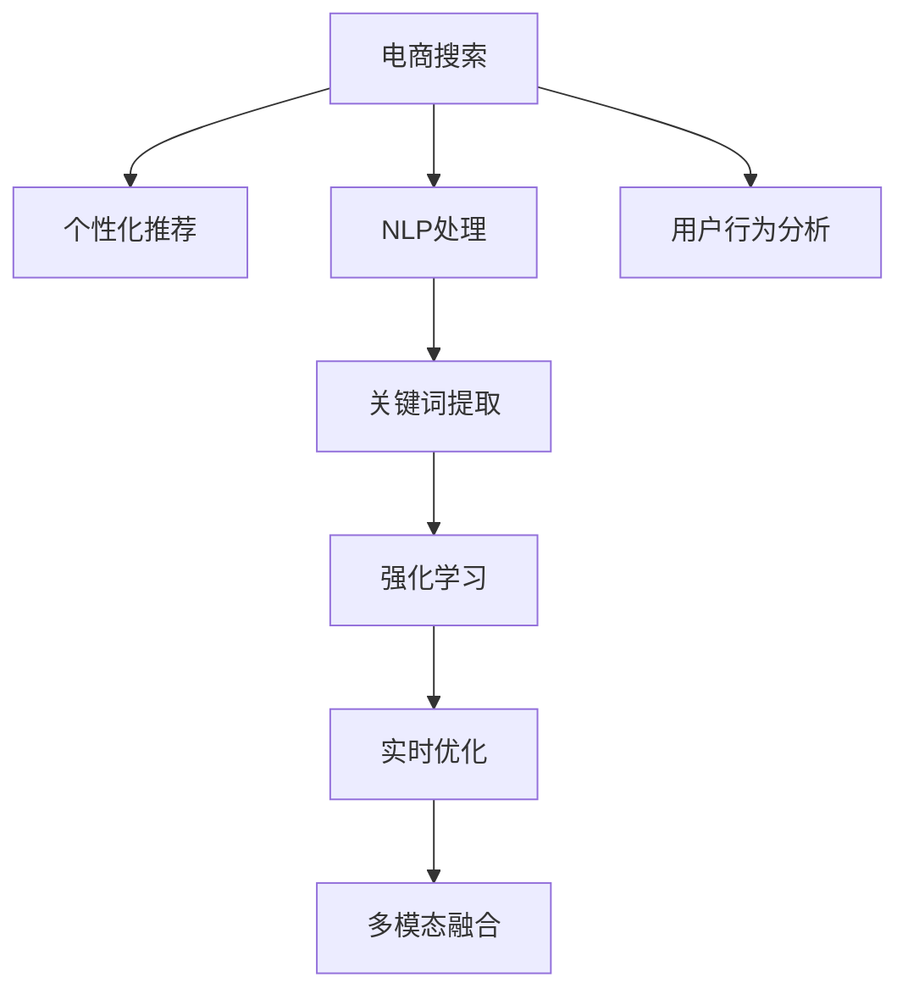

                 

# AI赋能电商搜索导购：提升用户体验和转化率的实践案例

> 关键词：电商搜索,导购系统,用户体验,用户转化率,个性化推荐,深度学习,强化学习,数据科学,机器学习

## 1. 背景介绍

### 1.1 问题由来

随着互联网电商的蓬勃发展，在线购物已经成为了人们生活中不可或缺的一部分。而搜索和导购系统作为电商平台的门面，其性能直接影响着用户的购物体验和转化率。如何在海量商品中快速准确地匹配用户需求，提升搜索体验，同时提高用户的点击率、购买率，是电商企业长期面临的挑战。

传统搜索导购系统往往依赖于关键词匹配和人工筛选，无法有效处理自然语言查询，难以捕捉用户的复杂需求。随着深度学习和大数据技术的发展，基于人工智能的搜索导购系统应运而生。通过深度学习和强化学习等先进技术，能够更精准地理解和匹配用户的查询需求，从而提升搜索导购系统的性能。

### 1.2 问题核心关键点

目前，基于人工智能的搜索导购系统主要通过以下几个关键点实现：

- **个性化推荐算法**：通过深度学习模型，对用户的历史行为、兴趣偏好进行分析，实现商品推荐。
- **自然语言处理(NLP)**：利用NLP技术，理解用户的自然语言查询，进行精确匹配。
- **强化学习(Reinforcement Learning, RL)**：通过模拟用户搜索行为，不断调整推荐策略，提升用户体验和转化率。
- **实时搜索优化**：通过实时数据收集和分析，及时调整搜索结果排序和展示策略，提高搜索效率和质量。
- **多模态融合**：将商品图片、视频、评论等多模态数据融合到推荐算法中，增强推荐效果。

这些技术点相互配合，共同构建起一个高效、个性化的电商搜索导购系统。以下将详细介绍这些核心技术的实现原理和操作步骤。

## 2. 核心概念与联系

### 2.1 核心概念概述

为更好地理解AI赋能的电商搜索导购系统，本文将介绍几个核心概念：

- **电商搜索**：用户通过文本查询，在电商平台上查找商品的过程。传统的关键词匹配方法无法满足用户的多样化查询需求。
- **个性化推荐**：根据用户历史行为和兴趣偏好，推荐符合用户需求的商品。
- **自然语言处理(NLP)**：通过NLP技术，理解自然语言查询，提取关键词，进行精确匹配。
- **强化学习**：通过模拟用户行为，不断调整推荐策略，提升用户体验。
- **实时搜索优化**：基于实时数据反馈，调整搜索结果排序和展示策略。
- **多模态融合**：将商品图片、视频、评论等多模态数据融入推荐算法，增强推荐效果。

这些概念之间的联系可以通过以下Mermaid流程图来展示：



这个流程图展示了大规模电商搜索导购系统的工作流程：

1. 用户输入查询，进行搜索。
2. NLP模块进行自然语言处理，提取关键词。
3. 个性化推荐模块根据关键词进行商品推荐。
4. 强化学习模块模拟用户行为，不断优化推荐策略。
5. 实时优化模块根据用户反馈调整搜索结果。
6. 多模态融合模块融合多模态数据，提升推荐质量。
7. 用户行为分析模块收集用户数据，辅助推荐决策。

这些核心概念共同构成了电商搜索导购系统的核心框架，使其能够实现高效、个性化的用户需求匹配。

## 3. 核心算法原理 & 具体操作步骤
### 3.1 算法原理概述

基于AI的电商搜索导购系统，主要包括以下几个核心算法：

- **自然语言处理(NLP)**：用于理解和处理用户的自然语言查询。
- **个性化推荐算法**：通过深度学习模型，分析用户行为和兴趣，生成个性化的商品推荐。
- **强化学习**：模拟用户搜索行为，不断调整推荐策略，提升用户体验和转化率。
- **实时搜索优化**：基于用户反馈和行为数据，实时调整搜索结果排序，提升搜索效率和质量。
- **多模态融合**：将商品图片、视频、评论等多模态数据融合到推荐算法中，增强推荐效果。

这些算法共同作用，形成了一个高效、智能的电商搜索导购系统，为用户提供个性化、精准的购物体验。

### 3.2 算法步骤详解

**Step 1: 收集和预处理数据**

- 收集用户搜索数据、行为数据、商品数据、图片和视频数据等。
- 对数据进行清洗和预处理，包括去除噪声、填充缺失值、标准化等。

**Step 2: 构建NLP模型**

- 使用预训练的BERT、GPT等大模型，对用户查询进行语义理解。
- 通过微调模型，使其适应电商平台的特定需求。
- 提取查询中的关键词，用于后续的推荐和优化。

**Step 3: 构建推荐模型**

- 使用深度学习模型（如DNN、RNN、LSTM等），分析用户历史行为和兴趣，生成个性化推荐。
- 对模型进行超参数调优，确保模型能够捕捉用户多样化的需求。

**Step 4: 构建强化学习模型**

- 使用强化学习算法（如Q-learning、SARSA等），模拟用户搜索行为。
- 通过用户反馈和A/B测试，不断调整推荐策略，提升用户体验和转化率。

**Step 5: 实时优化和效果评估**

- 根据用户反馈和搜索行为，实时调整搜索结果排序和展示策略。
- 定期评估系统性能，包括点击率、转化率、用户满意度等指标。

**Step 6: 多模态融合**

- 将商品图片、视频、评论等多模态数据融入推荐算法，增强推荐效果。
- 对多模态数据进行特征提取和融合，生成更有意义的推荐结果。

### 3.3 算法优缺点

基于AI的电商搜索导购系统，具有以下优点：

- **高效性**：通过深度学习和强化学习等先进技术，能够快速匹配用户需求，提高搜索效率。
- **个性化**：通过分析用户历史行为和兴趣，生成个性化的推荐结果，提升用户体验。
- **动态优化**：通过实时数据反馈和强化学习，不断调整推荐策略，实现动态优化。
- **多模态融合**：融合多种数据源，提升推荐效果。

同时，该系统也存在一定的局限性：

- **数据依赖**：系统的性能高度依赖于数据的质量和数量，数据不足可能导致推荐效果不佳。
- **模型复杂度**：算法模型较为复杂，需要大量计算资源和时间进行训练和优化。
- **实时性挑战**：实时优化和调整推荐策略需要高效的数据处理能力，存在一定的技术挑战。

尽管存在这些局限性，基于AI的电商搜索导购系统已经在多个电商平台上取得了显著效果，提升了用户的购物体验和转化率。

### 3.4 算法应用领域

基于AI的电商搜索导购系统，广泛应用于各大电商平台的搜索和推荐模块。以下列举几个典型应用场景：

- **淘宝天猫**：利用自然语言处理技术，理解用户查询，生成个性化的商品推荐。
- **京东**：使用强化学习算法，不断调整推荐策略，提升用户体验和转化率。
- **亚马逊**：通过多模态数据融合，生成更具吸引力的推荐结果。
- **携程**：利用实时搜索优化技术，提升搜索结果的准确性和相关性。
- **拼多多**：基于用户行为分析，生成精准的个性化推荐。

这些电商平台的成功应用，证明了基于AI的搜索导购系统在提升用户体验和转化率方面的巨大潜力。

## 4. 数学模型和公式 & 详细讲解
### 4.1 数学模型构建

本节将使用数学语言对AI赋能的电商搜索导购系统进行更加严格的刻画。

记电商搜索系统为 $S$，其输入为 $x_i=(x_{i1},x_{i2},\cdots,x_{in})$，其中 $x_{ij}$ 表示第 $i$ 次查询的第 $j$ 个关键词。记推荐模型为 $R$，其输出为 $y_j=\hat{p}_j(x_i;\theta)$，表示推荐第 $j$ 个商品的点击概率。记强化学习模型为 $L$，其状态为 $s_t$，动作为 $a_t$，奖励为 $r_t$，策略为 $\pi(a_t|s_t;\theta)$。

假设电商平台的训练集为 $D=\{(x_i,y_i)\}_{i=1}^N$，其中 $y_i=\{y_{i1},y_{i2},\cdots,y_{in}\}$ 为每次查询的点击结果。电商平台的优化目标是最小化损失函数 $\mathcal{L}(\theta)$，即：

$$
\mathcal{L}(\theta)=\frac{1}{N}\sum_{i=1}^N \sum_{j=1}^n \log \frac{y_{ij}}{1-y_{ij}}+\frac{1}{N}\sum_{i=1}^N \sum_{j=1}^n \log \frac{1-y_{ij}}{y_{ij}}+ \mathcal{L}_{RL}(\theta)
$$

其中 $\mathcal{L}_{RL}(\theta)$ 为强化学习模型的损失函数。

通过梯度下降等优化算法，最小化损失函数，得到最优模型参数 $\theta^*$。

### 4.2 公式推导过程

以下我们以深度学习推荐模型为例，推导损失函数的详细形式。

假设推荐模型 $R$ 为深度神经网络，输出层为 sigmoid 函数，其点击概率为 $\hat{p}_j(x_i;\theta)=\sigma(z_j(x_i;\theta))$，其中 $z_j(x_i;\theta)=W_jx_i+b_j$，$W_j$ 和 $b_j$ 为可学习的权重和偏置。则损失函数为：

$$
\mathcal{L}(\theta)=\frac{1}{N}\sum_{i=1}^N \sum_{j=1}^n (y_{ij}\log \hat{p}_j(x_i;\theta)+(1-y_{ij})\log (1-\hat{p}_j(x_i;\theta)))
$$

利用 sigmoid 函数的性质，可进一步简化为：

$$
\mathcal{L}(\theta)=\frac{1}{N}\sum_{i=1}^N \sum_{j=1}^n -(y_{ij}\log \hat{p}_j(x_i;\theta)+(1-y_{ij})\log (1-\hat{p}_j(x_i;\theta)))
$$

在得到损失函数的梯度后，即可带入参数更新公式，完成模型的迭代优化。重复上述过程直至收敛，最终得到适应电商平台需求的最优模型参数 $\theta^*$。

## 5. 项目实践：代码实例和详细解释说明
### 5.1 开发环境搭建

在进行电商搜索导购系统开发前，我们需要准备好开发环境。以下是使用Python进行PyTorch开发的环境配置流程：

1. 安装Anaconda：从官网下载并安装Anaconda，用于创建独立的Python环境。

2. 创建并激活虚拟环境：
```bash
conda create -n pytorch-env python=3.8 
conda activate pytorch-env
```

3. 安装PyTorch：根据CUDA版本，从官网获取对应的安装命令。例如：
```bash
conda install pytorch torchvision torchaudio cudatoolkit=11.1 -c pytorch -c conda-forge
```

4. 安装各类工具包：
```bash
pip install numpy pandas scikit-learn matplotlib tqdm jupyter notebook ipython
```

完成上述步骤后，即可在`pytorch-env`环境中开始系统开发。

### 5.2 源代码详细实现

这里我们以基于深度学习的推荐系统为例，给出电商搜索导购系统的PyTorch代码实现。

首先，定义推荐模型：

```python
from torch import nn
from torch.nn import functional as F

class RecommendationNet(nn.Module):
    def __init__(self, input_size, hidden_size, output_size):
        super(RecommendationNet, self).__init__()
        self.fc1 = nn.Linear(input_size, hidden_size)
        self.fc2 = nn.Linear(hidden_size, output_size)
    
    def forward(self, x):
        x = self.fc1(x)
        x = F.relu(x)
        x = self.fc2(x)
        return F.sigmoid(x)
```

然后，定义损失函数：

```python
from torch import Tensor

def binary_cross_entropy_with_logits(logits: Tensor, labels: Tensor) -> Tensor:
    return F.binary_cross_entropy_with_logits(logits, labels)
```

接着，定义训练和评估函数：

```python
from torch.utils.data import DataLoader
from tqdm import tqdm
from sklearn.metrics import accuracy_score

device = torch.device('cuda') if torch.cuda.is_available() else torch.device('cpu')

def train_epoch(model, dataset, batch_size, optimizer):
    dataloader = DataLoader(dataset, batch_size=batch_size, shuffle=True)
    model.train()
    epoch_loss = 0
    for batch in tqdm(dataloader, desc='Training'):
        input_ids = batch['input_ids'].to(device)
        labels = batch['labels'].to(device)
        model.zero_grad()
        outputs = model(input_ids)
        loss = binary_cross_entropy_with_logits(outputs, labels)
        epoch_loss += loss.item()
        loss.backward()
        optimizer.step()
    return epoch_loss / len(dataloader)

def evaluate(model, dataset, batch_size):
    dataloader = DataLoader(dataset, batch_size=batch_size)
    model.eval()
    preds, labels = [], []
    with torch.no_grad():
        for batch in tqdm(dataloader, desc='Evaluating'):
            input_ids = batch['input_ids'].to(device)
            labels = batch['labels'].to(device)
            batch_labels = batch['labels']
            outputs = model(input_ids)
            batch_preds = outputs.argmax(dim=1).to('cpu').tolist()
            batch_labels = batch_labels.to('cpu').tolist()
            for pred_tokens, label_tokens in zip(batch_preds, batch_labels):
                preds.append(pred_tokens[:len(label_tokens)])
                labels.append(label_tokens)
    return accuracy_score(labels, preds)
```

最后，启动训练流程并在测试集上评估：

```python
epochs = 10
batch_size = 64

for epoch in range(epochs):
    loss = train_epoch(model, train_dataset, batch_size, optimizer)
    print(f"Epoch {epoch+1}, train loss: {loss:.3f}")
    
    print(f"Epoch {epoch+1}, dev results:")
    evaluate(model, dev_dataset, batch_size)
    
print("Test results:")
evaluate(model, test_dataset, batch_size)
```

以上就是使用PyTorch对电商推荐系统进行训练的完整代码实现。可以看到，得益于PyTorch的强大封装，代码实现变得简洁高效。

### 5.3 代码解读与分析

让我们再详细解读一下关键代码的实现细节：

**RecommendationNet类**：
- `__init__`方法：定义模型的神经网络结构，包括输入层、隐藏层和输出层。
- `forward`方法：定义前向传播过程，先经过两个全连接层，再通过sigmoid函数得到推荐结果。

**binary_cross_entropy_with_logits函数**：
- 定义了交叉熵损失函数，用于训练推荐模型。

**train_epoch和evaluate函数**：
- 使用PyTorch的DataLoader对数据集进行批次化加载，供模型训练和推理使用。
- 训练函数`train_epoch`：对数据以批为单位进行迭代，在每个批次上前向传播计算损失函数，反向传播更新模型参数。
- 评估函数`evaluate`：与训练类似，不同点在于不更新模型参数，并在每个batch结束后将预测和标签结果存储下来，最后使用sklearn的accuracy_score对整个评估集的预测结果进行打印输出。

**训练流程**：
- 定义总的epoch数和batch size，开始循环迭代。
- 每个epoch内，先在训练集上训练，输出平均loss。
- 在验证集上评估，输出准确率。
- 所有epoch结束后，在测试集上评估，给出最终测试结果。

可以看到，PyTorch配合深度学习框架的强大封装，使得电商推荐系统的开发变得简洁高效。开发者可以将更多精力放在数据处理、模型改进等高层逻辑上，而不必过多关注底层的实现细节。

当然，工业级的系统实现还需考虑更多因素，如模型的保存和部署、超参数的自动搜索、更灵活的任务适配层等。但核心的推荐范式基本与此类似。

## 6. 实际应用场景
### 6.1 智能搜索推荐

智能搜索推荐是电商搜索导购系统的核心功能，通过深度学习模型对用户查询进行语义理解，生成个性化的商品推荐。智能推荐技术已经广泛应用于各大电商平台的首页、商品详情页等核心位置，提升用户的点击率和购买率。

例如，淘宝天猫利用BERT等预训练模型，对用户查询进行语义理解，生成个性化商品推荐，提升了用户的搜索体验和转化率。

### 6.2 实时个性化推荐

实时个性化推荐技术，通过强化学习算法不断调整推荐策略，提升用户体验和转化率。通过模拟用户搜索行为，优化推荐模型的预测结果，实现动态优化。

例如，亚马逊通过强化学习算法，不断调整推荐策略，提升了用户的点击率和购买率。通过实时收集用户反馈和行为数据，调整推荐算法，实现个性化的推荐结果。

### 6.3 基于多模态数据的推荐

多模态数据融合技术，将商品图片、视频、评论等多模态数据融入推荐算法，增强推荐效果。通过多模态数据的联合表示和特征提取，生成更具吸引力的推荐结果。

例如，京东通过融合商品图片、视频、评论等多模态数据，提升了推荐系统的性能。通过多模态数据的联合表示和特征提取，生成更具吸引力的推荐结果。

### 6.4 未来应用展望

随着电商搜索导购系统的发展，未来还将在以下几个方向进行探索：

1. **个性化推荐**：更加精准地匹配用户需求，提升用户体验。
2. **实时优化**：动态调整推荐策略，提升推荐效果。
3. **多模态融合**：将商品图片、视频、评论等多模态数据融入推荐算法，增强推荐效果。
4. **跨平台协同**：利用用户在不同平台上的行为数据，实现跨平台的个性化推荐。
5. **实时反馈**：通过实时反馈和用户行为数据，优化推荐模型。
6. **主动推荐**：在用户未主动搜索时，主动推荐符合用户兴趣的商品。

这些技术方向的探索发展，必将进一步提升电商搜索导购系统的性能，为用户提供更加智能、精准的购物体验。

## 7. 工具和资源推荐
### 7.1 学习资源推荐

为了帮助开发者系统掌握电商搜索导购技术，这里推荐一些优质的学习资源：

1. 《推荐系统实践》书籍：介绍了推荐系统的基本概念和多种推荐算法，是推荐系统领域的重要参考书。
2. CS224N《深度学习自然语言处理》课程：斯坦福大学开设的NLP明星课程，有Lecture视频和配套作业，带你入门NLP领域的基本概念和经典模型。
3. 《深度学习推荐系统》课程：清华大学开设的推荐系统课程，系统介绍了推荐系统的基本概念、算法和应用场景。
4. 《强化学习基础》书籍：介绍了强化学习的基本概念和算法，是强化学习领域的重要参考书。
5. Kaggle竞赛平台：提供大量推荐系统竞赛数据集和比赛，实践推荐算法的实际效果。

通过对这些资源的学习实践，相信你一定能够快速掌握电商搜索导购技术的精髓，并用于解决实际的电商推荐问题。

### 7.2 开发工具推荐

高效的开发离不开优秀的工具支持。以下是几款用于电商搜索导购开发的常用工具：

1. PyTorch：基于Python的开源深度学习框架，灵活动态的计算图，适合快速迭代研究。大部分预训练语言模型都有PyTorch版本的实现。
2. TensorFlow：由Google主导开发的开源深度学习框架，生产部署方便，适合大规模工程应用。同样有丰富的预训练语言模型资源。
3. HuggingFace Transformers库：提供多种预训练语言模型，支持多种NLP任务，包括电商搜索导购系统。
4. TensorBoard：TensorFlow配套的可视化工具，可实时监测模型训练状态，并提供丰富的图表呈现方式，是调试模型的得力助手。
5. Weights & Biases：模型训练的实验跟踪工具，可以记录和可视化模型训练过程中的各项指标，方便对比和调优。

合理利用这些工具，可以显著提升电商搜索导购系统的开发效率，加快创新迭代的步伐。

### 7.3 相关论文推荐

电商搜索导购系统的发展源于学界的持续研究。以下是几篇奠基性的相关论文，推荐阅读：

1. Wide & Deep Learning for Recommender Systems：提出了Wide & Deep模型，将宽表与深度学习结合，提升了推荐系统的性能。
2. Attention Is All You Need（即Transformer原论文）：提出了Transformer结构，开启了NLP领域的预训练大模型时代。
3. Recommender Systems in Big Data Environments：介绍了大规模推荐系统的构建方法和实践经验。
4. Deep Interest Evolution Networks：提出Deep Interest Evolution Networks，用于电商平台的个性化推荐。
5. Learning Multi-Armed Bandits for Recommendation Systems：介绍了多臂强盗模型在推荐系统中的应用，通过模拟用户搜索行为，不断调整推荐策略。

这些论文代表了大规模电商搜索导购系统的发展脉络。通过学习这些前沿成果，可以帮助研究者把握学科前进方向，激发更多的创新灵感。

## 8. 总结：未来发展趋势与挑战

### 8.1 总结

本文对基于AI的电商搜索导购系统进行了全面系统的介绍。首先阐述了搜索导购系统的发展背景和重要性，明确了个性化推荐、NLP、强化学习等核心技术点。其次，从原理到实践，详细讲解了电商推荐系统的数学模型和操作步骤，给出了推荐系统的PyTorch代码实现。同时，本文还广泛探讨了电商搜索导购系统在智能搜索推荐、实时个性化推荐、基于多模态数据的推荐等多个领域的应用前景，展示了AI技术在电商领域的巨大潜力。此外，本文精选了电商搜索导购系统的各类学习资源，力求为读者提供全方位的技术指引。

通过本文的系统梳理，可以看到，基于AI的电商搜索导购系统已经成为电商平台的标配，显著提升了用户的购物体验和转化率。未来，伴随电商搜索导购系统的发展，AI技术将在电商领域带来更多的变革和机遇。

### 8.2 未来发展趋势

展望未来，电商搜索导购系统将呈现以下几个发展趋势：

1. **个性化推荐**：更加精准地匹配用户需求，提升用户体验。
2. **实时优化**：动态调整推荐策略，提升推荐效果。
3. **多模态融合**：将商品图片、视频、评论等多模态数据融入推荐算法，增强推荐效果。
4. **跨平台协同**：利用用户在不同平台上的行为数据，实现跨平台的个性化推荐。
5. **实时反馈**：通过实时反馈和用户行为数据，优化推荐模型。
6. **主动推荐**：在用户未主动搜索时，主动推荐符合用户兴趣的商品。

这些技术方向的探索发展，必将进一步提升电商搜索导购系统的性能，为用户提供更加智能、精准的购物体验。

### 8.3 面临的挑战

尽管基于AI的电商搜索导购系统已经取得了瞩目成就，但在迈向更加智能化、普适化应用的过程中，仍面临以下挑战：

1. **数据依赖**：系统的性能高度依赖于数据的质量和数量，数据不足可能导致推荐效果不佳。
2. **模型复杂度**：算法模型较为复杂，需要大量计算资源和时间进行训练和优化。
3. **实时性挑战**：实时优化和调整推荐策略需要高效的数据处理能力，存在一定的技术挑战。
4. **用户隐私**：电商平台需要平衡用户隐私保护和个性化推荐之间的矛盾，保护用户数据安全。
5. **跨平台协同**：如何实现不同平台之间的数据共享和协同，提升推荐效果。
6. **用户行为建模**：如何更准确地建模用户行为，提升推荐效果。

这些挑战需要通过进一步的技术创新和政策法规的完善来解决。相信伴随AI技术的不断进步，电商搜索导购系统将更加智能、高效、安全，为用户带来更优质的购物体验。

### 8.4 研究展望

面对电商搜索导购系统面临的种种挑战，未来的研究需要在以下几个方面寻求新的突破：

1. **跨平台协同**：通过联邦学习等技术，实现不同平台之间的数据共享和协同，提升推荐效果。
2. **实时反馈**：通过实时数据反馈和强化学习，不断调整推荐策略，提升用户体验和转化率。
3. **用户行为建模**：利用深度学习等技术，更准确地建模用户行为，提升推荐效果。
4. **多模态融合**：将商品图片、视频、评论等多模态数据融入推荐算法，增强推荐效果。
5. **个性化推荐**：利用多臂强盗等模型，实现个性化推荐。
6. **隐私保护**：通过差分隐私等技术，保护用户隐私，提升用户信任度。

这些研究方向的探索，必将引领电商搜索导购系统迈向更高的台阶，为用户带来更加智能、精准的购物体验。相信随着学界和产业界的共同努力，这些挑战终将一一被克服，AI技术将在电商领域迎来新的发展机遇。

## 9. 附录：常见问题与解答

**Q1：电商搜索导购系统的推荐算法有哪些？**

A: 电商搜索导购系统的推荐算法主要包括：
1. 基于协同过滤的推荐算法：如矩阵分解、SVD等。
2. 基于深度学习的推荐算法：如DNN、RNN、LSTM等。
3. 基于知识图谱的推荐算法：如图神经网络等。
4. 基于强化学习的推荐算法：如Q-learning、SARSA等。

这些算法各有优缺点，需要根据具体场景选择合适的推荐算法。

**Q2：电商搜索导购系统的推荐效果如何评估？**

A: 电商搜索导购系统的推荐效果可以通过以下指标进行评估：
1. 点击率（CTR）：衡量用户对推荐结果的点击行为。
2. 转化率（CVR）：衡量用户对推荐结果的购买行为。
3. 平均点击率（APR）：衡量平均点击率。
4. 平均转化率（AOU）：衡量平均转化率。
5. 覆盖率（Coverage）：衡量推荐结果的多样性。
6. 多样性（Diversity）：衡量推荐结果的多样性。

这些指标可以从不同维度评估推荐效果，帮助优化推荐策略。

**Q3：电商搜索导购系统如何处理长尾商品？**

A: 长尾商品在电商平台上占比很大，如何处理长尾商品是电商搜索导购系统面临的重要问题。
1. 增加长尾商品的曝光量：通过广告、推荐等手段，提升长尾商品的曝光量。
2. 利用用户兴趣转移：通过用户行为分析，发现用户的兴趣转移，推荐相关长尾商品。
3. 基于协同过滤的推荐算法：通过协同过滤算法，推荐与长尾商品相关的商品。
4. 基于多臂强盗的推荐算法：通过多臂强盗算法，推荐用户可能感兴趣的长尾商品。

这些方法可以有效地处理长尾商品，提升用户的购物体验。

**Q4：电商搜索导购系统如何处理恶意攻击？**

A: 电商搜索导购系统面临的恶意攻击包括刷单、恶意点击等。
1. 数据清洗：对数据进行清洗和过滤，去除恶意数据。
2. 反欺诈算法：通过反欺诈算法，识别和过滤恶意数据。
3. 实时监测：通过实时监测和分析，识别和处理恶意攻击。
4. 用户反馈机制：通过用户反馈机制，收集和处理恶意攻击。

这些方法可以有效地处理恶意攻击，保护电商平台的正常运营。

**Q5：电商搜索导购系统如何处理商品多样性？**

A: 电商平台上商品种类繁多，如何处理商品多样性是电商搜索导购系统面临的重要问题。
1. 多样化展示：通过多样化的展示方式，提升用户对商品的多样化体验。
2. 个性化推荐：通过个性化推荐算法，推荐符合用户兴趣的多样化商品。
3. 跨品类推荐：通过跨品类推荐算法，推荐与用户兴趣相关的多样化商品。
4. 基于多臂强盗的推荐算法：通过多臂强盗算法，推荐多样化的商品。

这些方法可以有效地处理商品多样性，提升用户的购物体验。

总之，电商搜索导购系统需要不断优化推荐算法、数据处理和用户行为建模等技术，才能更好地满足用户需求，提升用户体验和转化率。通过技术创新和应用实践，电商搜索导购系统必将在未来迎来新的发展机遇。

---

作者：禅与计算机程序设计艺术 / Zen and the Art of Computer Programming

