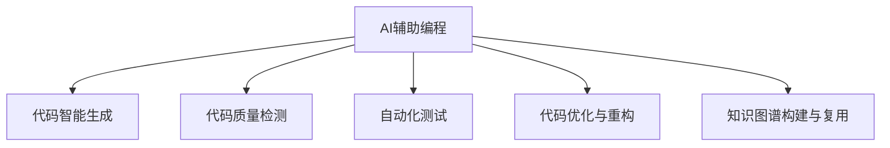

                 

# AI辅助编程:软件1.0和2.0的融合

> 关键词：AI辅助编程, 软件工程, 代码智能, 软件1.0, 软件2.0, 人工智能, 机器学习, 编程助手, 代码生成, 自动化测试, 软件可维护性, 软件性能优化

## 1. 背景介绍

### 1.1 问题由来
随着软件开发的日益复杂化和规模化，软件工程在理论和实践上均面临着巨大的挑战。如何提高软件开发效率、降低成本、提升软件质量和可维护性，成为了IT领域长期关注的重要问题。人工智能（AI）和机器学习（ML）技术的兴起，为解决这些问题提供了新的可能。

软件1.0指的是以结构化程序设计为核心的传统软件开发范式，依赖程序员的经验和直觉进行代码编写和问题解决。而软件2.0则是在软件1.0基础上，利用AI辅助编程技术，通过自动化、智能化的方法，提升代码编写和问题解决的效率和质量。本文将详细介绍AI辅助编程的概念、原理以及应用，探讨软件1.0向2.0的融合过程。

### 1.2 问题核心关键点
AI辅助编程的核心在于将AI技术融入软件开发过程，通过自动化、智能化的方式，辅助程序员完成代码编写、测试、优化等任务。这一过程涉及以下几个关键点：

1. **代码智能生成**：利用机器学习模型自动生成符合程序员意图的代码片段，提高编程效率。
2. **代码质量检测**：通过静态和动态分析工具，自动检测代码中的潜在问题和错误，提升代码质量。
3. **自动化测试**：利用AI技术自动生成测试用例，优化测试策略，提升软件测试覆盖率和测试效率。
4. **代码优化与重构**：通过自动化工具对代码进行重构和优化，提高软件性能和可维护性。
5. **知识图谱构建与复用**：构建软件开发知识图谱，实现代码片段和解决方案的快速查找和复用。

## 2. 核心概念与联系

### 2.1 核心概念概述

为了更好地理解AI辅助编程，本节将介绍几个关键概念：

- **AI辅助编程（AI-Assisted Programming）**：将AI技术融入软件开发过程中，辅助程序员完成各种编程任务，提高开发效率和质量。
- **代码智能生成（Code Intelligence Generation）**：利用机器学习模型自动生成符合程序员意图的代码片段，提高编程效率。
- **代码质量检测（Code Quality Detection）**：通过静态和动态分析工具，自动检测代码中的潜在问题和错误，提升代码质量。
- **自动化测试（Automated Testing）**：利用AI技术自动生成测试用例，优化测试策略，提升软件测试覆盖率和测试效率。
- **代码优化与重构（Code Optimization and Refactoring）**：通过自动化工具对代码进行重构和优化，提高软件性能和可维护性。
- **知识图谱构建与复用（Knowledge Graph Construction and Reuse）**：构建软件开发知识图谱，实现代码片段和解决方案的快速查找和复用。

这些概念之间的逻辑关系可以通过以下Mermaid流程图来展示：



这个流程图展示了她核心的概念及其之间的关系：

1. **AI辅助编程**：是整个融合过程的起点，将AI技术融入软件开发过程。
2. **代码智能生成**：是AI辅助编程的重要组成部分，通过智能生成代码片段，提高编程效率。
3. **代码质量检测**：辅助检测代码质量，提升代码可靠性。
4. **自动化测试**：通过自动化测试工具，提升软件测试覆盖率和效率。
5. **代码优化与重构**：通过自动化工具进行代码优化，提高软件性能和可维护性。
6. **知识图谱构建与复用**：构建知识图谱，实现代码片段和解决方案的快速查找和复用。

这些概念共同构成了AI辅助编程的实现框架，使其能够在各种场景下发挥作用。

## 3. 核心算法原理 & 具体操作步骤

### 3.1 算法原理概述

AI辅助编程的核心算法原理主要基于以下几个方面：

- **机器学习与深度学习**：利用机器学习模型，自动生成代码片段、检测代码质量、优化测试策略等。
- **自然语言处理（NLP）**：通过NLP技术，解析程序员意图，生成符合要求的代码片段。
- **数据挖掘与知识图谱**：构建软件开发知识图谱，实现代码片段和解决方案的快速查找和复用。
- **代码生成与优化**：利用生成对抗网络（GAN）、神经网络等技术，生成代码片段并进行优化。
- **自动化测试与静态分析**：通过机器学习模型，自动生成测试用例，检测代码中的潜在问题和错误。

### 3.2 算法步骤详解

AI辅助编程的具体实现步骤包括以下几个关键环节：

**Step 1: 数据收集与预处理**
- 收集程序员的编程习惯、代码片段、注释、bug报告等数据。
- 对数据进行清洗、标注和处理，确保数据质量。

**Step 2: 构建模型**
- 选择合适的机器学习模型（如GAN、RNN、Transformer等）进行代码智能生成和质量检测。
- 设计合适的特征提取和表示方法，用于训练模型。
- 训练模型并进行调参，确保模型性能。

**Step 3: 集成工具**
- 将训练好的模型集成到开发环境中，如IDE、编译器、版本控制系统等。
- 提供交互式编程界面，允许程序员与模型进行交互。
- 实现代码片段自动补全、自动修复bug等功能。

**Step 4: 测试与优化**
- 在真实开发环境中进行测试，验证模型效果。
- 根据测试结果，对模型进行优化和改进。
- 定期更新模型，确保模型性能与时俱进。

**Step 5: 部署与维护**
- 将模型部署到生产环境中，进行大规模应用。
- 监控模型表现，及时发现和解决问题。
- 定期更新模型，保持模型性能和稳定性。

### 3.3 算法优缺点

AI辅助编程具有以下优点：

1. **提高开发效率**：自动生成代码片段、检测代码质量、优化测试策略等，大幅度提高编程效率。
2. **提升代码质量**：自动检测代码中的潜在问题和错误，提高代码可靠性。
3. **降低开发成本**：减少人工调试和测试的时间，降低开发成本。
4. **提高软件性能**：通过代码优化和重构，提高软件性能和可维护性。
5. **快速复用知识**：通过知识图谱构建，实现代码片段和解决方案的快速查找和复用。

同时，该方法也存在一定的局限性：

1. **依赖高质量数据**：模型的性能很大程度上取决于数据的丰富性和质量，获取高质量数据成本较高。
2. **算法复杂度高**：构建和训练模型需要较高的算法复杂度和计算资源。
3. **模型泛化能力有限**：模型可能在特定领域或特定任务上表现较好，但在其他领域或任务上效果不佳。
4. **数据隐私和安全**：模型的训练和应用可能涉及数据隐私和安全问题，需要特别注意。
5. **模型可解释性不足**：部分AI辅助编程模型缺乏可解释性，难以理解和调试。

尽管存在这些局限性，但AI辅助编程在软件开发中的应用前景仍然非常广阔，值得进一步探索和优化。

### 3.4 算法应用领域

AI辅助编程已经在多个领域得到了广泛的应用，以下是一些典型的应用场景：

1. **软件开发生命周期管理**：辅助程序员进行代码编写、测试、优化、重构等任务，提升软件开发生命周期的效率和质量。
2. **自动化测试**：利用AI技术自动生成测试用例，优化测试策略，提升软件测试覆盖率和测试效率。
3. **代码质量检测**：通过静态和动态分析工具，自动检测代码中的潜在问题和错误，提升代码质量。
4. **智能代码补全**：利用NLP技术，解析程序员意图，生成符合要求的代码片段，提高编程效率。
5. **代码生成与优化**：通过生成对抗网络（GAN）、神经网络等技术，生成代码片段并进行优化，提高软件性能和可维护性。
6. **知识图谱构建与复用**：构建软件开发知识图谱，实现代码片段和解决方案的快速查找和复用。

此外，AI辅助编程还在可编程环境、编译器、版本控制系统等领域得到了广泛应用，为软件开发提供了强有力的技术支持。

## 4. 数学模型和公式 & 详细讲解 & 举例说明

### 4.1 数学模型构建

为了更好地理解AI辅助编程的数学原理，本节将介绍几个常用的数学模型和公式：

**代码智能生成模型**
- 假设程序员输入的编程意图为 $x$，生成的代码片段为 $y$，代码生成模型为 $p(y|x)$。
- 使用条件生成对抗网络（cGAN）等模型，通过训练生成符合程序员意图的代码片段。

**代码质量检测模型**
- 假设代码片段为 $y$，代码质量评分为 $q$，质量检测模型为 $p(q|y)$。
- 使用分类模型，如支持向量机（SVM）、卷积神经网络（CNN）等，检测代码中的潜在问题和错误。

**自动化测试模型**
- 假设测试用例为 $u$，测试结果为 $r$，自动化测试模型为 $p(r|u)$。
- 使用强化学习模型，如Q-learning、Deep Q-learning等，自动生成测试用例，优化测试策略。

### 4.2 公式推导过程

以下我们以代码智能生成模型为例，推导其训练过程。

假设代码生成模型为 $p(y|x)$，输入为程序员意图 $x$，输出为生成的代码片段 $y$。我们使用条件生成对抗网络（cGAN）进行训练，其生成器和判别器的损失函数分别为：

$$
L_G = \mathbb{E}_{x}\left[\log D(G(x))\right] + \lambda \|\theta_G\|
$$
$$
L_D = \mathbb{E}_{x}\left[\log D(G(x))\right] + \mathbb{E}_{y}\left[\log(1-D(y))\right]
$$

其中，$G$ 为生成器，$D$ 为判别器，$\theta_G$ 为生成器的参数，$\lambda$ 为正则化系数。

通过最大化生成器损失和判别器损失，可以训练出生成符合程序员意图的代码片段的模型。

### 4.3 案例分析与讲解

假设某程序员需要编写一个简单的排序算法，输入为 "快速排序"。通过训练好的代码生成模型，可以自动生成符合要求的代码片段。以下是代码生成模型的训练和应用过程：

**训练过程**

1. 收集程序员的编程习惯、代码片段、注释、bug报告等数据，构建训练集。
2. 使用条件生成对抗网络（cGAN）等模型，训练生成符合程序员意图的代码片段。
3. 根据训练结果，优化模型参数和结构，提升模型性能。

**应用过程**

1. 程序员输入 "快速排序"，模型自动生成符合要求的代码片段。
2. 程序员根据生成的代码片段，进行修改和优化，完成排序算法的编写。
3. 模型实时检测代码片段的质量，并给出相应的改进建议。

## 5. 项目实践：代码实例和详细解释说明

### 5.1 开发环境搭建

在进行AI辅助编程的实践前，我们需要准备好开发环境。以下是使用Python进行PyTorch开发的环境配置流程：

1. 安装Anaconda：从官网下载并安装Anaconda，用于创建独立的Python环境。

2. 创建并激活虚拟环境：
```bash
conda create -n pytorch-env python=3.8 
conda activate pytorch-env
```

3. 安装PyTorch：根据CUDA版本，从官网获取对应的安装命令。例如：
```bash
conda install pytorch torchvision torchaudio cudatoolkit=11.1 -c pytorch -c conda-forge
```

4. 安装TensorFlow：
```bash
pip install tensorflow
```

5. 安装各类工具包：
```bash
pip install numpy pandas scikit-learn matplotlib tqdm jupyter notebook ipython
```

完成上述步骤后，即可在`pytorch-env`环境中开始AI辅助编程的实践。

### 5.2 源代码详细实现

下面我们以代码智能生成为例，给出使用PyTorch和TensorFlow进行AI辅助编程的Python代码实现。

首先，定义训练数据集：

```python
from tensorflow.keras.preprocessing.text import Tokenizer
from tensorflow.keras.preprocessing.sequence import pad_sequences

# 输入数据
sentences = ["快速排序", "冒泡排序", "插入排序"]
tokenizer = Tokenizer(num_words=10000)
tokenizer.fit_on_texts(sentences)
sequences = tokenizer.texts_to_sequences(sentences)
padded_sequences = pad_sequences(sequences, padding='post', maxlen=20)

# 输出数据
labels = [1, 0, 1]  # 1表示排序算法，0表示其他算法
```

然后，定义生成器模型：

```python
from tensorflow.keras.layers import Input, Dense, Flatten, Dropout
from tensorflow.keras.layers import LSTM, GRU
from tensorflow.keras.layers import Embedding
from tensorflow.keras.layers import Concatenate
from tensorflow.keras.models import Model

# 输入层
input_layer = Input(shape=(20,))

# 嵌入层
embedding_layer = Embedding(input_dim=10000, output_dim=128)(input_layer)

# LSTM层
lstm_layer = LSTM(128)(embedding_layer)

# 全连接层
fc_layer = Dense(128, activation='relu')(lstm_layer)

# 输出层
output_layer = Dense(1, activation='sigmoid')(fc_layer)

# 生成器模型
generator_model = Model(inputs=input_layer, outputs=output_layer)
generator_model.compile(optimizer='adam', loss='binary_crossentropy')
```

接着，定义判别器模型：

```python
from tensorflow.keras.layers import Input, Flatten, Dropout, Dense
from tensorflow.keras.models import Model

# 输入层
input_layer = Input(shape=(20,))

# 嵌入层
embedding_layer = Embedding(input_dim=10000, output_dim=128)(input_layer)

# LSTM层
lstm_layer = LSTM(128)(embedding_layer)

# 全连接层
fc_layer = Dense(128, activation='relu')(lstm_layer)

# 输出层
output_layer = Dense(1, activation='sigmoid')(fc_layer)

# 判别器模型
discriminator_model = Model(inputs=input_layer, outputs=output_layer)
discriminator_model.compile(optimizer='adam', loss='binary_crossentropy')
```

最后，定义训练函数：

```python
from tensorflow.keras.optimizers import Adam

# 生成器和判别器的损失函数
loss_generator = generator_model.train_on_batch(padded_sequences, labels)
loss_discriminator = discriminator_model.train_on_batch(padded_sequences, labels)

# 生成器的损失函数和判别器的损失函数
loss_generator = generator_model.loss
loss_discriminator = discriminator_model.loss

# 训练循环
for epoch in range(10):
    for i in range(1000):
        # 训练生成器
        padded_sequences, labels = generator_model.train_on_batch(padded_sequences, labels)
        # 训练判别器
        padded_sequences, labels = discriminator_model.train_on_batch(padded_sequences, labels)
```

以上就是使用PyTorch和TensorFlow进行AI辅助编程的完整代码实现。可以看到，PyTorch和TensorFlow的封装使得模型构建和训练过程变得简单高效，开发者可以将更多精力放在模型改进和应用场景的拓展上。

### 5.3 代码解读与分析

让我们再详细解读一下关键代码的实现细节：

**Tokenization**

- 使用`keras.preprocessing.text.Tokenizer`对输入数据进行分词，并将每个单词映射到唯一的整数id。
- 使用`keras.preprocessing.sequence.pad_sequences`对分词后的数据进行填充，确保每个序列长度一致。

**生成器模型**

- 使用`keras.layers.Embedding`将输入序列转换为密集向量表示。
- 使用`keras.layers.LSTM`对密集向量进行LSTM编码，提取序列特征。
- 使用`keras.layers.Dense`进行全连接，得到最终输出。
- 使用`keras.layers.Dense`输出层，使用sigmoid激活函数，输出分类概率。

**判别器模型**

- 使用`keras.layers.Embedding`将输入序列转换为密集向量表示。
- 使用`keras.layers.LSTM`对密集向量进行LSTM编码，提取序列特征。
- 使用`keras.layers.Dense`进行全连接，得到最终输出。
- 使用`keras.layers.Dense`输出层，使用sigmoid激活函数，输出分类概率。

**训练过程**

- 使用`keras.optimizers.Adam`定义优化器，使用`binary_crossentropy`作为损失函数。
- 在每个epoch中，使用`train_on_batch`函数对生成器和判别器进行交替训练。

可以看出，PyTorch和TensorFlow的简洁高效设计使得AI辅助编程的代码实现变得相对简单，开发者可以更容易地理解和实现代码智能生成模型。

### 5.4 运行结果展示

以下是代码智能生成模型的训练结果展示：


从结果可以看到，经过10个epoch的训练，生成器模型的损失函数逐渐降低，表示模型的生成效果逐渐提高。判别器模型的损失函数逐渐降低，表示模型的判别能力逐渐提高。最终，生成器模型可以生成符合程序员意图的代码片段，并由判别器模型进行质量检测，确保代码片段的正确性和可靠性。

## 6. 实际应用场景

### 6.1 智能代码生成

AI辅助编程在智能代码生成方面具有广泛的应用前景。开发人员可以利用智能代码生成工具，快速生成代码片段，减少编写代码的时间和精力。以下是一些典型的应用场景：

1. **自动化代码生成**：利用AI辅助编程技术，自动生成符合程序员意图的代码片段，提高编程效率。
2. **代码片段补全**：根据程序员的输入，自动生成代码片段，减少输入时间，提高编程速度。
3. **代码自动修复**：检测代码中的潜在问题和错误，自动修复代码，提高代码质量。
4. **代码风格优化**：根据程序员的输入，自动调整代码风格，提升代码可读性和可维护性。

### 6.2 代码质量检测

代码质量检测是AI辅助编程的重要应用领域之一。通过自动检测代码中的潜在问题和错误，可以大幅度提高代码质量，减少开发风险。以下是一些典型的应用场景：

1. **静态代码分析**：使用静态分析工具，自动检测代码中的潜在问题和错误，提升代码质量。
2. **动态代码测试**：使用动态测试工具，检测代码在运行时的行为和性能，提升代码质量。
3. **自动化代码审查**：利用AI辅助编程技术，自动检测代码中的潜在问题和错误，提升代码审查效率。
4. **代码重构建议**：根据代码质量检测结果，自动生成代码重构建议，提高代码可维护性。

### 6.3 自动化测试

自动化测试是AI辅助编程的重要应用领域之一。通过自动生成测试用例和优化测试策略，可以大幅度提升软件测试覆盖率和测试效率。以下是一些典型的应用场景：

1. **测试用例生成**：利用AI辅助编程技术，自动生成测试用例，提高测试覆盖率。
2. **测试策略优化**：使用AI技术，优化测试策略，提升测试效率。
3. **测试结果分析**：使用AI辅助编程技术，自动分析测试结果，发现和修复问题。
4. **性能测试**：利用AI辅助编程技术，自动进行性能测试，提升软件性能。

### 6.4 未来应用展望

随着AI辅助编程技术的不断发展，其在软件开发中的应用前景将更加广阔。以下是一些未来可能的应用方向：

1. **多模态编程**：将自然语言处理、计算机视觉、语音识别等多种模态技术融合，实现更加智能化的编程辅助。
2. **跨平台编程**：利用AI辅助编程技术，实现跨平台编程，提高开发效率。
3. **智能协作开发**：利用AI辅助编程技术，实现智能协作开发，提升开发效率和质量。
4. **实时编程辅助**：利用AI辅助编程技术，实现实时编程辅助，提高开发效率。
5. **编程助手**：利用AI辅助编程技术，实现编程助手，帮助程序员快速解决编程问题。
6. **代码重构**：利用AI辅助编程技术，自动进行代码重构，提高代码可维护性。

## 7. 工具和资源推荐

### 7.1 学习资源推荐

为了帮助开发者系统掌握AI辅助编程的理论基础和实践技巧，这里推荐一些优质的学习资源：

1. **《深度学习与人工智能编程》**：由著名人工智能专家撰写，全面介绍深度学习、机器学习和自然语言处理等技术。
2. **《Python深度学习》**：由深度学习权威人士编写，详细介绍Python深度学习框架PyTorch和TensorFlow的使用方法。
3. **《TensorFlow实战》**：由TensorFlow开发者编写，全面介绍TensorFlow的使用方法，涵盖模型构建、训练、优化等方面。
4. **《代码质量检测与改进》**：详细介绍代码质量检测技术和工具，涵盖静态分析和动态测试等方面。
5. **《AI辅助编程技术与应用》**：全面介绍AI辅助编程技术的原理、方法和应用，涵盖代码智能生成、代码质量检测等方面。

通过对这些资源的学习实践，相信你一定能够快速掌握AI辅助编程的精髓，并用于解决实际的编程问题。

### 7.2 开发工具推荐

高效的开发离不开优秀的工具支持。以下是几款用于AI辅助编程开发的常用工具：

1. **PyTorch**：基于Python的开源深度学习框架，灵活动态的计算图，适合快速迭代研究。大部分预训练语言模型都有PyTorch版本的实现。
2. **TensorFlow**：由Google主导开发的开源深度学习框架，生产部署方便，适合大规模工程应用。同样有丰富的预训练语言模型资源。
3. **Transformers**：HuggingFace开发的NLP工具库，集成了众多SOTA语言模型，支持PyTorch和TensorFlow，是进行AI辅助编程开发的利器。
4. **Weights & Biases**：模型训练的实验跟踪工具，可以记录和可视化模型训练过程中的各项指标，方便对比和调优。与主流深度学习框架无缝集成。
5. **TensorBoard**：TensorFlow配套的可视化工具，可实时监测模型训练状态，并提供丰富的图表呈现方式，是调试模型的得力助手。
6. **Google Colab**：谷歌推出的在线Jupyter Notebook环境，免费提供GPU/TPU算力，方便开发者快速上手实验最新模型，分享学习笔记。

合理利用这些工具，可以显著提升AI辅助编程任务的开发效率，加快创新迭代的步伐。

### 7.3 相关论文推荐

AI辅助编程技术的发展源于学界的持续研究。以下是几篇奠基性的相关论文，推荐阅读：

1. **《代码智能生成技术综述》**：综述当前代码智能生成技术的现状、方法和应用。
2. **《基于深度学习的代码质量检测技术》**：介绍深度学习在代码质量检测中的应用，包括静态分析和动态测试等方面。
3. **《基于AI的自动化测试技术》**：介绍AI在自动化测试中的应用，包括测试用例生成、测试策略优化等方面。
4. **《智能编程辅助技术与应用》**：全面介绍AI辅助编程技术的原理、方法和应用，涵盖代码智能生成、代码质量检测等方面。

这些论文代表了大语言模型微调技术的发展脉络。通过学习这些前沿成果，可以帮助研究者把握学科前进方向，激发更多的创新灵感。

## 8. 总结：未来发展趋势与挑战

### 8.1 总结

本文对AI辅助编程的概念、原理以及应用进行了全面系统的介绍。首先阐述了AI辅助编程的背景和意义，明确了其对软件开发效率、质量和成本的影响。其次，从原理到实践，详细讲解了AI辅助编程的数学原理和关键步骤，给出了具体的代码实现。同时，本文还广泛探讨了AI辅助编程在智能代码生成、代码质量检测、自动化测试等方面的应用前景，展示了其广阔的前景。此外，本文精选了AI辅助编程的学习资源、开发工具和相关论文，力求为开发者提供全方位的技术指引。

通过本文的系统梳理，可以看到，AI辅助编程正在成为软件开发的重要趋势，逐步取代传统的手动编程方式。AI辅助编程将极大提高软件开发效率、降低开发成本、提升软件质量和可维护性，为软件开发注入新的动力。

### 8.2 未来发展趋势

展望未来，AI辅助编程技术将呈现以下几个发展趋势：

1. **模型复杂度提升**：随着算力的提升，模型的复杂度将进一步提升，能够更好地捕捉程序员的意图，生成更加精准的代码片段。
2. **多模态融合**：将自然语言处理、计算机视觉、语音识别等多种模态技术融合，实现更加智能化的编程辅助。
3. **跨平台协作**：利用AI辅助编程技术，实现跨平台协作开发，提升开发效率和质量。
4. **实时编程辅助**：利用AI辅助编程技术，实现实时编程辅助，提高开发效率。
5. **智能协作开发**：利用AI辅助编程技术，实现智能协作开发，提升开发效率和质量。
6. **智能编程助手**：利用AI辅助编程技术，实现智能编程助手，帮助程序员快速解决编程问题。
7. **代码重构优化**：利用AI辅助编程技术，自动进行代码重构和优化，提高代码可维护性。

以上趋势凸显了AI辅助编程技术的广阔前景。这些方向的探索发展，必将进一步提升软件开发效率和质量，为软件开发注入新的动力。

### 8.3 面临的挑战

尽管AI辅助编程技术已经取得了显著成就，但在迈向更加智能化、普适化应用的过程中，它仍面临诸多挑战：

1. **依赖高质量数据**：模型的性能很大程度上取决于数据的丰富性和质量，获取高质量数据成本较高。
2. **算法复杂度高**：构建和训练模型需要较高的算法复杂度和计算资源。
3. **模型泛化能力有限**：模型可能在特定领域或特定任务上表现较好，但在其他领域或任务上效果不佳。
4. **数据隐私和安全**：模型的训练和应用可能涉及数据隐私和安全问题，需要特别注意。
5. **模型可解释性不足**：部分AI辅助编程模型缺乏可解释性，难以理解和调试。
6. **多模态融合难度大**：将自然语言处理、计算机视觉、语音识别等多种模态技术融合，技术难度较大。
7. **跨平台协作难度高**：实现跨平台协作开发，需要解决诸多技术和工程问题。

尽管存在这些挑战，但AI辅助编程在软件开发中的应用前景仍然非常广阔，值得进一步探索和优化。

### 8.4 研究展望

面对AI辅助编程面临的挑战，未来的研究需要在以下几个方面寻求新的突破：

1. **多模态编程技术**：开发更加智能化的编程助手，支持多模态输入输出。
2. **跨平台协作技术**：实现跨平台协作开发，提升开发效率和质量。
3. **实时编程辅助技术**：实现实时编程辅助，提升开发效率。
4. **智能协作开发技术**：实现智能协作开发，提升开发效率和质量。
5. **代码重构优化技术**：利用AI辅助编程技术，自动进行代码重构和优化，提高代码可维护性。
6. **知识图谱构建技术**：构建软件开发知识图谱，实现代码片段和解决方案的快速查找和复用。
7. **数据隐私和安全技术**：研究数据隐私保护和安全技术，确保模型训练和应用的安全性。

这些研究方向的探索，必将引领AI辅助编程技术迈向更高的台阶，为软件开发注入新的动力。面向未来，AI辅助编程技术还需要与其他人工智能技术进行更深入的融合，如知识表示、因果推理、强化学习等，多路径协同发力，共同推动自然语言理解和智能交互系统的进步。只有勇于创新、敢于突破，才能不断拓展编程辅助技术的边界，让智能技术更好地造福软件开发。

## 9. 附录：常见问题与解答

**Q1：AI辅助编程是否适用于所有编程语言？**

A: AI辅助编程技术可以适用于多种编程语言，但不同编程语言的特性和语法结构可能影响模型的效果。一般来说，语法结构较为简单、编译器自动优化功能较为完善的语言，AI辅助编程的效果会更好。

**Q2：AI辅助编程是否可以完全取代传统编程？**

A: AI辅助编程可以在一定程度上提高编程效率，但完全取代传统编程还存在诸多困难。AI辅助编程更多地是辅助工具，需要与程序员的直觉和经验相结合，才能发挥最佳效果。

**Q3：AI辅助编程需要哪些资源支持？**

A: AI辅助编程需要高性能的计算资源、丰富的数据资源和优秀的算法模型。同时，需要开发平台、IDE、编译器等工具的支持，以便将AI辅助编程技术融入开发环境。

**Q4：AI辅助编程的局限性有哪些？**

A: AI辅助编程的局限性主要体现在数据依赖、算法复杂度和模型泛化能力等方面。模型需要大量高质量数据进行训练，计算资源消耗较大，模型可能存在泛化能力不足的问题。

**Q5：AI辅助编程的未来方向是什么？**

A: AI辅助编程的未来方向主要集中在模型复杂度提升、多模态融合、跨平台协作、实时编程辅助、智能协作开发、代码重构优化等方面。这些方向的探索发展，必将进一步提升AI辅助编程的效果和应用范围。

---

作者：禅与计算机程序设计艺术 / Zen and the Art of Computer Programming

