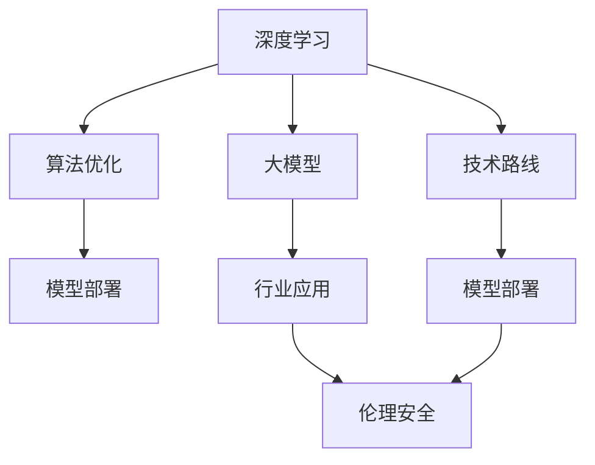

                 

# AI长期发展：贾扬清思考，AI行业更长远走下去

> 关键词：人工智能,机器学习,深度学习,大模型,算法优化,模型部署,技术路线,行业应用,伦理安全

## 1. 背景介绍

### 1.1 问题由来

人工智能（AI）作为引领未来技术发展的核心力量，正快速渗透到各个行业和领域，从金融、医疗、教育到零售、制造、交通，几乎无处不在。然而，随着AI技术的广泛应用，行业也面临前所未有的挑战和风险，比如技术壁垒、数据隐私、伦理安全等问题。如何在技术和伦理的框架下，确保AI行业健康、可持续的发展，成为当下重要的课题。

### 1.2 问题核心关键点

在探讨AI长期发展策略时，关键点包括：

1. **算法优化**：随着模型规模的不断增大，如何提升训练效率，降低计算成本，成为核心问题。
2. **模型部署**：如何在云原生、边缘计算等不同环境下，进行模型的高效部署和推理。
3. **技术路线**：如何从基于传统机器学习算法，过渡到深度学习、大模型等先进技术，提升模型性能。
4. **行业应用**：AI在金融、医疗、自动驾驶等垂直领域的深度应用，带来的商业价值和潜在风险。
5. **伦理安全**：在保障数据隐私、防止模型偏见、确保AI应用透明可解释的同时，维护社会公平。

## 2. 核心概念与联系

### 2.1 核心概念概述

为更好地理解AI长期发展的策略，本节将介绍几个密切相关的核心概念：

- **深度学习**：一种基于多层神经网络的机器学习方法，通过多层次的特征提取和分类，实现复杂模式的识别和预测。
- **大模型**：指具有数亿或数十亿参数的深度学习模型，如BERT、GPT系列等，能够学习并表示海量的数据，具备更强的泛化能力和知识提取能力。
- **算法优化**：通过改进训练算法、加速模型计算、优化模型架构等手段，提高模型性能和训练效率。
- **模型部署**：将训练好的模型部署到不同的应用场景和计算环境，实现高效的推理和预测。
- **技术路线**：从简单的线性回归到复杂的深度学习，再到最新的模型和算法，技术发展轨迹的演变过程。
- **行业应用**：AI在金融、医疗、自动驾驶等垂直行业的应用，带来的创新和商业价值。
- **伦理安全**：在AI应用过程中，关注数据隐私、模型公平性、决策透明度等方面的伦理和安全性问题。

这些概念之间的逻辑关系可以通过以下Mermaid流程图来展示：



这个流程图展示了大模型从深度学习演进到应用部署，再到伦理安全的整体框架，描绘了AI技术从理论到实践，再到应用的完整路径。

## 3. 核心算法原理 & 具体操作步骤
### 3.1 算法原理概述

在AI长期发展的策略中，算法优化是核心的技术手段之一。以下是深度学习和大模型优化的一些基本原理和步骤：

**深度学习**：
深度学习模型通过多层非线性变换，可以学习和提取输入数据的复杂特征，适用于处理非线性模式识别、自然语言处理、计算机视觉等任务。其核心是反向传播算法，通过链式法则，求解模型参数的梯度，优化损失函数，最小化预测误差。

**大模型**：
大模型通过超大规模参数训练，能够更好地捕捉数据中的复杂结构，具备更强的泛化能力和知识提取能力。大模型的训练通常采用分布式训练、混合精度计算、模型并行等技术，以提升训练效率和可扩展性。

### 3.2 算法步骤详解

以下是对深度学习和优化算法的一些详细步骤：

**深度学习算法步骤**：

1. **数据准备**：收集并预处理数据，分为训练集、验证集和测试集，进行归一化、特征提取等处理。
2. **模型选择**：选择适合的深度学习模型，如卷积神经网络（CNN）、循环神经网络（RNN）、Transformer等。
3. **初始化参数**：随机初始化模型参数，进行预训练或微调，以获得更好的初始化点。
4. **训练模型**：在训练集上，使用反向传播算法，通过损失函数更新模型参数。
5. **模型评估**：在验证集上评估模型性能，防止过拟合，调整超参数。
6. **测试模型**：在测试集上评估模型最终性能，用于实际应用。

**算法优化步骤**：

1. **选择优化器**：如Adam、SGD等，设置学习率和正则化参数。
2. **数据增强**：通过数据增强，如随机裁剪、翻转、旋转等，丰富训练集的多样性。
3. **模型压缩**：如剪枝、量化、知识蒸馏等，减少模型参数和计算量。
4. **模型并行**：通过分布式训练和模型并行，提升训练效率和可扩展性。
5. **混合精度计算**：使用16位浮点数（FP16）代替32位浮点数（FP32），提高计算效率和内存利用率。

### 3.3 算法优缺点

深度学习和优化算法具有以下优点：

1. **高精度**：深度学习模型通常能够达到较高的精度，适用于复杂的模式识别和预测任务。
2. **泛化能力强**：大模型能够学习和表示更丰富的特征，具备更强的泛化能力，适应不同场景。
3. **计算效率高**：通过优化算法和计算技术，深度学习模型能够在较短时间内训练和部署。

但同时，这些算法也存在一些缺点：

1. **数据依赖性强**：深度学习模型的性能依赖大量高质量标注数据，数据获取成本高。
2. **计算资源需求高**：大规模模型的训练和推理需要大量计算资源，对硬件要求高。
3. **模型复杂度高**：深度学习模型的结构复杂，难以解释和调试，存在黑箱问题。
4. **泛化性不足**：模型容易受到训练数据分布的影响，泛化性能不稳定。

## 4. 数学模型和公式 & 详细讲解  
### 4.1 数学模型构建

以下是对深度学习和大模型优化的一些数学模型的详细构建和推导。

**深度学习模型**：

1. **线性回归模型**：$y = wx + b$，其中$y$为输出，$x$为输入，$w$和$b$为模型参数。
2. **逻辑回归模型**：$y = \sigma(wx + b)$，其中$\sigma$为sigmoid函数。
3. **多层感知机（MLP）模型**：$y = \sigma(W^{[1]}x + b^{[1]})$，$y = \sigma(W^{[2]}y + b^{[2]})$，$\cdots$，$y = \sigma(W^{[L]}y + b^{[L]})$，其中$W$和$b$为各层权重和偏置，$L$为层数。

**大模型优化算法**：

1. **Adam算法**：
$$m_t = \beta_1m_{t-1} + (1-\beta_1)g_t$$
$$v_t = \beta_2v_{t-1} + (1-\beta_2)g_t^2$$
$$\hat{m}_t = \frac{m_t}{1-\beta_1^t}$$
$$\hat{v}_t = \frac{v_t}{1-\beta_2^t}$$
$$\theta_{t+1} = \theta_t - \alpha \frac{\hat{m}_t}{\sqrt{\hat{v}_t} + \epsilon}$$
其中$g_t = \frac{\partial L}{\partial \theta}$为梯度，$m_t$和$v_t$为动量和梯度平方的指数移动平均，$\alpha$为学习率，$\beta_1$和$\beta_2$为衰减率，$\epsilon$为正则项，防止除数为零。

### 4.2 公式推导过程

以下是深度学习模型和优化算法的推导过程：

**线性回归模型推导**：
$$y = wx + b$$
$$\text{MSE loss} = \frac{1}{N}\sum_{i=1}^N (y_i - wx_i - b)^2$$
$$\nabla_{\theta}L = \frac{1}{N}\sum_{i=1}^N (2(x_iy_i - wx_i^2 - bx_i))$$
$$w \leftarrow w - \eta\nabla_{\theta}L$$
$$b \leftarrow b - \eta\nabla_{\theta}L$$

**Adam算法推导**：
$$m_t = \beta_1m_{t-1} + (1-\beta_1)g_t$$
$$v_t = \beta_2v_{t-1} + (1-\beta_2)g_t^2$$
$$\hat{m}_t = \frac{m_t}{1-\beta_1^t}$$
$$\hat{v}_t = \frac{v_t}{1-\beta_2^t}$$
$$\theta_{t+1} = \theta_t - \alpha \frac{\hat{m}_t}{\sqrt{\hat{v}_t} + \epsilon}$$

通过推导，可以看到深度学习模型和优化算法的基本数学原理，进一步理解其计算过程和优化目标。

### 4.3 案例分析与讲解

以BERT模型为例，解释其训练过程和优化策略：

BERT模型基于Transformer结构，在大量无标注语料上进行预训练，学习语言表示。其训练过程包括预训练和微调两个阶段：

**预训练阶段**：
1. **掩码语言模型（Masked Language Modeling）**：
$$\text{Masked Loss} = -\frac{1}{N}\sum_{i=1}^N \log \frac{\exp(\hat{y}_i)}{\sum_{k=1}^K\exp(\hat{y}_{ik})}$$
其中$\hat{y}_i = \text{MLP}(\text{Attention}(\text{Transformer}(x_i)))$，$\text{MLP}$为多层感知机，$\text{Attention}$和$\text{Transformer}$为注意力机制和自注意力机制。
2. **下一句预测（Next Sentence Prediction）**：
$$\text{Next Sentence Loss} = -\frac{1}{N}\sum_{i=1}^N y_i\log\hat{y}_i + (1-y_i)\log(1-\hat{y}_i)$$

**微调阶段**：
1. **选择优化器**：AdamW优化器，设置小学习率。
2. **数据准备**：选择下游任务数据集，如情感分析、命名实体识别等。
3. **模型初始化**：使用预训练的BERT模型，只微调顶层或特定层。
4. **训练模型**：在训练集上，使用微调数据进行有监督训练，更新模型参数。
5. **模型评估**：在验证集上评估模型性能，调整超参数。
6. **测试模型**：在测试集上测试模型，评估最终性能。

## 5. 项目实践：代码实例和详细解释说明
### 5.1 开发环境搭建

在进行AI长期发展的项目实践时，需要一个高效、灵活的开发环境。以下是使用PyTorch搭建环境的步骤：

1. **安装Anaconda**：
```bash
sudo apt-get install anaconda3
```

2. **创建并激活虚拟环境**：
```bash
conda create -n ai-env python=3.7
conda activate ai-env
```

3. **安装PyTorch**：
```bash
conda install pytorch torchvision torchaudio
```

4. **安装相关库**：
```bash
pip install numpy pandas scikit-learn matplotlib tensorboard
```

5. **启动Jupyter Notebook**：
```bash
jupyter notebook
```

### 5.2 源代码详细实现

以BERT微调为例，实现一个简单的情感分析模型：

```python
import torch
import torch.nn as nn
from transformers import BertTokenizer, BertForSequenceClassification
from torch.utils.data import DataLoader, Dataset

# 数据集准备
class SentimentDataset(Dataset):
    def __init__(self, texts, labels):
        self.tokenizer = BertTokenizer.from_pretrained('bert-base-uncased')
        self.texts = texts
        self.labels = labels
        
    def __len__(self):
        return len(self.texts)
    
    def __getitem__(self, index):
        text = self.texts[index]
        label = self.labels[index]
        encoding = self.tokenizer(text, return_tensors='pt', truncation=True, padding='max_length')
        return {'input_ids': encoding['input_ids'], 
                'attention_mask': encoding['attention_mask'],
                'labels': torch.tensor(label, dtype=torch.long)}

# 模型训练
class SentimentModel(nn.Module):
    def __init__(self, num_labels):
        super(SentimentModel, self).__init__()
        self.bert = BertForSequenceClassification.from_pretrained('bert-base-uncased', num_labels=num_labels)
        self.dropout = nn.Dropout(0.1)
        self.fc = nn.Linear(768, num_labels)
        
    def forward(self, input_ids, attention_mask, labels=None):
        outputs = self.bert(input_ids, attention_mask=attention_mask)
        pooled_output = outputs.pooler_output
        pooled_output = self.dropout(pooled_output)
        logits = self.fc(pooled_output)
        if labels is not None:
            loss_fct = nn.CrossEntropyLoss()
            loss = loss_fct(logits.view(-1, logits.size(-1)), labels.view(-1))
            return loss
        return logits

# 训练函数
def train(model, train_loader, optimizer, num_epochs):
    model.train()
    for epoch in range(num_epochs):
        total_loss = 0
        for batch in train_loader:
            input_ids = batch['input_ids']
            attention_mask = batch['attention_mask']
            labels = batch['labels']
            optimizer.zero_grad()
            outputs = model(input_ids, attention_mask, labels)
            loss = outputs[0]
            loss.backward()
            optimizer.step()
            total_loss += loss.item()
        print(f'Epoch {epoch+1}, train loss: {total_loss/len(train_loader)}')

# 测试函数
def evaluate(model, test_loader):
    model.eval()
    total_correct = 0
    for batch in test_loader:
        input_ids = batch['input_ids']
        attention_mask = batch['attention_mask']
        labels = batch['labels']
        with torch.no_grad():
            logits = model(input_ids, attention_mask)[0]
            _, predicted = torch.max(logits, dim=1)
        total_correct += (predicted == labels).sum().item()
    accuracy = total_correct / len(test_loader.dataset)
    print(f'Test accuracy: {accuracy*100:.2f}%')

# 使用预训练模型微调
tokenizer = BertTokenizer.from_pretrained('bert-base-uncased')
model = SentimentModel(num_labels=2)
optimizer = AdamW(model.parameters(), lr=2e-5)
train_loader = DataLoader(SentimentDataset(train_texts, train_labels), batch_size=16)
test_loader = DataLoader(SentimentDataset(test_texts, test_labels), batch_size=16)
train(model, train_loader, optimizer, num_epochs=3)
evaluate(model, test_loader)
```

### 5.3 代码解读与分析

通过对代码的详细解读，可以更好地理解BERT微调的过程：

1. **数据集准备**：定义SentimentDataset类，将文本和标签转换为BERT模型可接受的输入格式。
2. **模型定义**：定义SentimentModel类，继承nn.Module，并定义BERT、Dropout和全连接层。
3. **训练函数**：定义train函数，在每个epoch内对模型进行前向传播、计算损失、反向传播和参数更新。
4. **测试函数**：定义evaluate函数，在测试集上评估模型的准确率。
5. **使用预训练模型微调**：加载预训练模型，使用AdamW优化器，在训练集上进行微调，并在测试集上评估模型性能。

## 6. 实际应用场景
### 6.1 智能客服系统

智能客服系统作为AI应用的典型场景，通过微调BERT等大模型，能够实现自然语言处理、对话理解和智能回复等功能。在实际应用中，智能客服系统能够24小时不间断地处理客户咨询，提高响应速度和服务质量，同时收集用户反馈数据，进一步优化模型。

### 6.2 金融舆情监测

金融舆情监测系统利用BERT等大模型，实现对金融新闻、评论、社交媒体数据的分析和处理。通过微调模型，能够识别舆情变化趋势，及时预警金融风险，帮助金融机构快速应对市场波动，保护投资者利益。

### 6.3 个性化推荐系统

个性化推荐系统通过微调BERT等大模型，能够更好地理解用户兴趣和行为模式，从而提供更加精准和多样化的推荐内容。在电商、视频、音乐等垂直领域，通过微调模型，能够显著提升用户满意度和转化率，增强用户粘性。

## 7. 工具和资源推荐
### 7.1 学习资源推荐

为了深入理解AI长期发展的策略，推荐以下学习资源：

1. **《深度学习》教材**：Ian Goodfellow、Yoshua Bengio和Aaron Courville的深度学习教材，全面介绍了深度学习的基本概念、算法和应用。
2. **CS231n课程**：斯坦福大学开设的计算机视觉课程，涵盖图像分类、目标检测、图像生成等深度学习应用。
3. **《TensorFlow实战》书籍**：王毅的TensorFlow实战书籍，详细讲解了TensorFlow框架的使用和优化技巧。
4. **Coursera课程**：Google、斯坦福大学等机构提供的机器学习和深度学习课程，系统学习AI基础理论和技术。
5. **Arxiv预印本**：访问arxiv.org，了解最新的AI研究论文和进展，跟踪前沿技术。

### 7.2 开发工具推荐

在AI长期发展的项目实践过程中，需要使用一些高效的工具和框架。以下是一些常用的开发工具：

1. **PyTorch**：基于Python的深度学习框架，灵活高效，支持GPU加速。
2. **TensorFlow**：由Google开发的深度学习框架，功能强大，适合大规模工程应用。
3. **Jupyter Notebook**：交互式编程环境，支持Python、R等多种编程语言，便于快速开发和调试。
4. **TensorBoard**：可视化工具，可以实时监测模型训练和推理过程，提供图表和指标分析。
5. **GitHub**：代码托管平台，支持版本控制和协作开发，方便项目管理和共享。

### 7.3 相关论文推荐

以下是一些前沿的AI长期发展相关论文，推荐阅读：

1. **《Transformer is All You Need》**：Transformer论文，提出了自注意力机制，推动了NLP领域的预训练大模型研究。
2. **《BERT: Pre-training of Deep Bidirectional Transformers for Language Understanding》**：BERT论文，介绍了大规模预训练语言模型和掩码语言模型任务，刷新了多项NLP任务SOTA。
3. **《GPT-2: Language Models are Unsupervised Multitask Learners》**：GPT-2论文，展示了大语言模型的强大零样本学习能力。
4. **《AdaLoRA: Adaptive Low-Rank Adaptation for Parameter-Efficient Fine-Tuning》**：AdaLoRA论文，提出了参数高效微调方法，在固定大部分预训练参数的情况下，只更新极少量的任务相关参数。
5. **《Prefix-Tuning: Optimizing Continuous Prompts for Generation》**：Prefix-Tuning论文，引入基于连续型Prompt的微调范式，为模型提供了更好的理解路径。

这些论文代表了大模型微调技术的发展脉络，对理解AI长期发展策略具有重要参考价值。

## 8. 总结：未来发展趋势与挑战
### 8.1 研究成果总结

AI长期发展的策略主要围绕算法优化、模型部署、技术路线、行业应用和伦理安全等方面展开。在算法优化方面，深度学习和大模型训练效率的提升，将带来更广泛的应用场景；在模型部署方面，云原生、边缘计算等新型架构将提升模型推理速度和可扩展性；在技术路线方面，深度学习、大模型等先进技术将引领AI技术的发展方向；在行业应用方面，AI在金融、医疗、自动驾驶等垂直领域的应用，将带来巨大的商业价值；在伦理安全方面，AI模型的透明性和公平性问题，将引发更多的关注和探讨。

### 8.2 未来发展趋势

未来AI长期发展的趋势包括：

1. **算法的不断优化**：通过改进训练算法、优化模型架构、应用混合精度计算等手段，提升模型训练效率和推理速度。
2. **模型部署的广泛应用**：通过云原生、边缘计算等新型架构，实现模型的高效部署和推理。
3. **技术路线的持续演进**：从传统机器学习算法，过渡到深度学习、大模型等先进技术，推动AI技术的不断发展。
4. **行业应用的深入探索**：AI在金融、医疗、自动驾驶等垂直领域的应用将进一步深化，带来更多的创新和商业价值。
5. **伦理安全的全面保障**：关注数据隐私、模型公平性、决策透明度等方面的伦理和安全性问题，确保AI应用的透明和可解释。

### 8.3 面临的挑战

尽管AI长期发展取得了一定的成果，但仍面临以下挑战：

1. **数据依赖性强**：深度学习模型依赖大量高质量标注数据，数据获取成本高。
2. **计算资源需求高**：大规模模型的训练和推理需要大量计算资源，对硬件要求高。
3. **模型复杂度高**：深度学习模型结构复杂，难以解释和调试，存在黑箱问题。
4. **泛化性不足**：模型容易受到训练数据分布的影响，泛化性能不稳定。
5. **伦理安全问题**：AI模型的透明性和公平性问题，引发更多的关注和探讨。

### 8.4 研究展望

未来的研究需要在以下几个方面寻求新的突破：

1. **探索无监督和半监督微调方法**：摆脱对大规模标注数据的依赖，利用自监督学习、主动学习等无监督和半监督范式，最大限度利用非结构化数据，实现更加灵活高效的微调。
2. **研究参数高效和计算高效的微调范式**：开发更加参数高效的微调方法，在固定大部分预训练参数的同时，只更新极少量的任务相关参数。
3. **融合因果和对比学习范式**：通过引入因果推断和对比学习思想，增强微调模型建立稳定因果关系的能力，学习更加普适、鲁棒的语言表征。
4. **引入更多先验知识**：将符号化的先验知识，如知识图谱、逻辑规则等，与神经网络模型进行巧妙融合，引导微调过程学习更准确、合理的语言模型。
5. **结合因果分析和博弈论工具**：将因果分析方法引入微调模型，识别出模型决策的关键特征，增强输出解释的因果性和逻辑性。
6. **纳入伦理道德约束**：在模型训练目标中引入伦理导向的评估指标，过滤和惩罚有偏见、有害的输出倾向，确保AI应用透明和可解释。

这些研究方向的探索，将引领AI长期发展的技术演进，推动AI技术的普及和应用，为构建更加安全、可靠、智能的AI系统提供有力保障。

## 9. 附录：常见问题与解答

**Q1: 如何提升深度学习模型的训练效率？**

A: 提升深度学习模型的训练效率可以从以下几个方面入手：

1. **数据增强**：通过数据增强技术，如旋转、翻转、裁剪等，丰富训练集的多样性，提升模型的泛化能力。
2. **模型压缩**：如剪枝、量化、知识蒸馏等，减少模型参数和计算量，提高训练和推理效率。
3. **分布式训练**：通过分布式训练，利用多个GPU或TPU并行计算，提升训练速度和可扩展性。
4. **混合精度计算**：使用16位浮点数（FP16）代替32位浮点数（FP32），提高计算效率和内存利用率。
5. **模型并行**：通过模型并行，将模型拆分为多个部分，并行计算，加速训练过程。

**Q2: 如何在AI应用中保障数据隐私和公平性？**

A: 在AI应用中保障数据隐私和公平性，可以从以下几个方面入手：

1. **数据匿名化**：通过数据脱敏、去标识化等手段，保护用户隐私，防止数据泄露。
2. **隐私计算**：利用差分隐私、联邦学习等隐私计算技术，在不共享原始数据的情况下，进行模型训练和推理。
3. **公平性评估**：在模型训练过程中，引入公平性指标，如均衡误差、均衡样本量等，确保模型不偏向某一群体。
4. **透明可解释**：使用可解释性工具，如LIME、SHAP等，对模型进行解释和分析，确保决策过程透明可控。
5. **伦理审查**：建立AI应用的伦理审查机制，确保模型应用的透明性和公平性，防止偏见和歧视。

**Q3: 如何评估AI模型的泛化性能？**

A: 评估AI模型的泛化性能可以从以下几个方面入手：

1. **交叉验证**：使用交叉验证技术，如k-fold验证，确保模型在多个数据集上的表现一致。
2. **留出验证集**：在模型训练过程中，留出一部分数据作为验证集，监测模型在未见过的数据上的表现。
3. **正则化技术**：使用L2正则、Dropout等正则化技术，防止模型过拟合，提高泛化性能。
4. **域外测试**：在模型训练过程中，收集并使用域外数据进行测试，评估模型在不同分布下的表现。
5. **对抗样本测试**：利用对抗样本生成技术，测试模型对扰动样本的鲁棒性，确保模型在各种场景下表现稳定。

通过对这些问题的回答，可以更好地理解AI长期发展的策略，把握技术演进方向，确保AI应用的可靠性和安全性。

