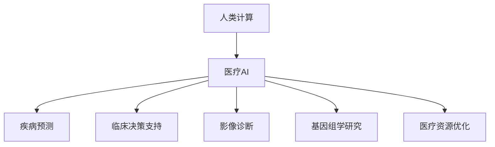

                 

# AI驱动的创新：人类计算在医疗领域的应用

> 关键词：人类计算, 医疗AI, 疾病预测, 临床决策, 影像诊断, 基因组学, 资源优化

## 1. 背景介绍

### 1.1 问题由来

近年来，人工智能（AI）技术在医疗领域的应用日益深入，成为驱动医疗创新和变革的重要力量。然而，面对海量医疗数据和复杂多变的临床场景，传统数据处理方法难以满足需求。为此，人类计算（Human Computing）应运而生，成为AI与医疗结合的重要路径。

人类计算利用人类独有的理解、创造和决策能力，通过有效的算法和模型设计，将数据转化为易于理解和利用的知识，从而推动医疗领域的智能化、个性化和精准化。本文将详细探讨人类计算在医疗领域的各种应用场景，如疾病预测、临床决策、影像诊断、基因组学研究以及医疗资源优化，展示其潜力和前景。

### 1.2 问题核心关键点

人类计算在医疗领域的应用主要涉及以下几个核心关键点：

- **数据驱动：** 人类计算依赖于医疗数据的积累和整理，通过数据挖掘和分析，发现疾病的潜在规律和关联。
- **知识表达：** 利用符号化推理、模型预测等技术，将复杂的临床知识转化为可计算形式。
- **协同设计：** 结合人类专家的经验和智慧，进行算法和模型的迭代优化，提升计算模型的准确性和可靠性。
- **应用场景：** 涵盖疾病预测、临床决策、影像诊断、基因组学研究及资源优化等多个方面，助力医疗决策的科学化和智能化。

这些关键点共同构成人类计算在医疗领域的基础框架，推动了医疗AI的不断进步和成熟。

### 1.3 问题研究意义

人类计算在医疗领域的应用，具有重要的理论和实践意义：

1. **提升诊断和治疗的准确性：** 利用计算技术，减少误诊和漏诊，提高临床决策的精准度。
2. **个性化医疗：** 通过数据分析和模型预测，提供针对个体差异的治疗方案，改善患者预后。
3. **资源优化配置：** 优化医疗资源的分配和使用，提升医疗服务的效率和公平性。
4. **医学研究创新：** 通过大规模数据处理和模式识别，加速医学知识的积累和创新。
5. **智能医疗助手：** 构建智能医疗助手，辅助医生进行疾病预测、诊断和治疗，提升医疗服务质量。

通过深入研究人类计算在医疗领域的应用，不仅能够促进医学知识的普及和创新，还能够推动医疗行业的数字化转型，提升公共卫生水平，具有深远的社会和经济价值。

## 2. 核心概念与联系

### 2.1 核心概念概述

为更好地理解人类计算在医疗领域的应用，本节将介绍几个密切相关的核心概念：

- **人类计算：** 结合人类计算能力和AI技术的计算模型，用于解决复杂问题。
- **医疗AI：** 利用AI技术处理和分析医疗数据，辅助医生进行诊断、治疗和决策。
- **疾病预测：** 通过数据分析和模型预测，早期发现和预防疾病。
- **临床决策支持：** 结合患者的临床数据和专家经验，辅助医生进行诊断和治疗决策。
- **影像诊断：** 利用图像处理和模式识别技术，自动分析医学影像数据，辅助医生诊断。
- **基因组学研究：** 结合生物信息学和计算方法，解析基因数据，揭示疾病的遗传机制。
- **医疗资源优化：** 利用优化算法和计算模型，优化医疗资源的配置和利用。

这些概念之间的逻辑关系可以通过以下Mermaid流程图来展示：



这个流程图展示了大语言模型的核心概念及其之间的关系：

1. 人类计算利用AI技术处理医疗数据。
2. 计算模型辅助进行疾病预测、临床决策、影像诊断等任务。
3. 结合基因组学研究，进一步揭示疾病的内在机制。
4. 通过医疗资源优化，提升医疗服务的效率和公平性。

这些概念共同构成了人类计算在医疗领域的计算框架，为医疗AI技术的发展提供了有力支持。

## 3. 核心算法原理 & 具体操作步骤
### 3.1 算法原理概述

人类计算在医疗领域的应用，依赖于一系列高效的算法和模型。这些算法和模型通常涉及数据预处理、特征提取、模型训练和结果解释等步骤。本文将详细介绍其中几个关键算法原理和具体操作步骤。

### 3.2 算法步骤详解

1. **数据预处理：** 收集和整理医疗数据，去除噪声和异常值，标准化数据格式，为后续计算提供可靠的基础。
2. **特征提取：** 从医疗数据中提取关键特征，如病人的病历记录、影像数据、基因数据等，供模型训练使用。
3. **模型训练：** 利用机器学习或深度学习算法，训练计算模型，如决策树、支持向量机、神经网络等，用于疾病预测、临床决策等任务。
4. **结果解释：** 将模型的输出结果解释为易于理解的形式，如症状列表、治疗方案等，辅助医生做出决策。

### 3.3 算法优缺点

人类计算在医疗领域的应用，具有以下优点：

1. **高效准确：** 结合了人类专家和AI技术的优势，提升计算的准确性和效率。
2. **个性化决策：** 能够根据个体差异，提供个性化治疗方案，改善患者预后。
3. **资源优化：** 通过计算模型优化资源配置，提升医疗服务的效率和公平性。
4. **数据驱动：** 基于大规模医疗数据，进行疾病预测和知识发现，推动医学研究的创新。

同时，人类计算也存在一些缺点：

1. **数据隐私：** 医疗数据涉及患者隐私，数据处理和共享需要严格的安全和隐私保护措施。
2. **计算资源：** 大规模医疗数据处理和模型训练需要大量的计算资源和存储资源。
3. **算法复杂性：** 模型的设计和优化需要较高的技术水平，存在一定的复杂性。
4. **结果解释：** 计算模型的结果需要医学专家的解释和验证，才能真正应用于临床。

### 3.4 算法应用领域

人类计算在医疗领域的应用，主要涉及以下几个领域：

1. **疾病预测：** 通过数据分析和模型预测，早期发现和预防疾病。
2. **临床决策支持：** 结合患者的临床数据和专家经验，辅助医生进行诊断和治疗决策。
3. **影像诊断：** 利用图像处理和模式识别技术，自动分析医学影像数据，辅助医生诊断。
4. **基因组学研究：** 结合生物信息学和计算方法，解析基因数据，揭示疾病的遗传机制。
5. **医疗资源优化：** 利用优化算法和计算模型，优化医疗资源的配置和利用。

## 4. 数学模型和公式 & 详细讲解  
### 4.1 数学模型构建

本节将使用数学语言对人类计算在医疗领域的应用进行更加严格的刻画。

假设医疗数据集为 $D=\{(x_i,y_i)\}_{i=1}^N$，其中 $x_i$ 为输入特征， $y_i$ 为疾病标签。利用机器学习算法训练一个计算模型 $M(x)$，其输出为疾病预测结果，即 $M(x_i)$。

定义损失函数 $\mathcal{L}$ 为：

$$
\mathcal{L} = \frac{1}{N} \sum_{i=1}^N \ell(M(x_i),y_i)
$$

其中 $\ell$ 为损失函数，如交叉熵损失、均方误差损失等。

训练目标为最小化损失函数 $\mathcal{L}$，即：

$$
\theta^* = \mathop{\arg\min}_{\theta} \mathcal{L}(\theta)
$$

其中 $\theta$ 为模型的参数，通常为神经网络模型的权重和偏置。

### 4.2 公式推导过程

以下我们以疾病预测模型为例，推导交叉熵损失函数及其梯度的计算公式。

假设模型 $M_{\theta}(x)$ 在输入 $x$ 上的输出为 $M_{\theta}(x_i)$，与实际标签 $y_i$ 的差异为 $M_{\theta}(x_i) - y_i$。则二分类交叉熵损失函数定义为：

$$
\ell(M_{\theta}(x_i),y_i) = -[y_i\log M_{\theta}(x_i)+(1-y_i)\log(1-M_{\theta}(x_i))]
$$

将其代入经验风险公式，得：

$$
\mathcal{L}(\theta) = -\frac{1}{N}\sum_{i=1}^N [y_i\log M_{\theta}(x_i)+(1-y_i)\log(1-M_{\theta}(x_i))]
$$

根据链式法则，损失函数对参数 $\theta_k$ 的梯度为：

$$
\frac{\partial \mathcal{L}(\theta)}{\partial \theta_k} = -\frac{1}{N}\sum_{i=1}^N \frac{\partial [y_i\log M_{\theta}(x_i)+(1-y_i)\log(1-M_{\theta}(x_i))]{\partial \theta_k}
$$

其中 $\frac{\partial M_{\theta}(x_i)}{\partial \theta_k}$ 可进一步递归展开，利用自动微分技术完成计算。

在得到损失函数的梯度后，即可带入参数更新公式，完成模型的迭代优化。重复上述过程直至收敛，最终得到适应疾病预测任务的最优模型参数 $\theta^*$。

## 5. 项目实践：代码实例和详细解释说明
### 5.1 开发环境搭建

在进行人类计算在医疗领域的应用开发前，我们需要准备好开发环境。以下是使用Python进行Scikit-learn开发的环境配置流程：

1. 安装Anaconda：从官网下载并安装Anaconda，用于创建独立的Python环境。

2. 创建并激活虚拟环境：
```bash
conda create -n medical-env python=3.8 
conda activate medical-env
```

3. 安装Scikit-learn、TensorFlow等工具包：
```bash
pip install scikit-learn tensorflow pandas numpy
```

4. 安装各类工具包：
```bash
pip install seaborn matplotlib joblib sklearn-externals 
```

完成上述步骤后，即可在`medical-env`环境中开始实践。

### 5.2 源代码详细实现

下面我们以疾病预测任务为例，给出使用Scikit-learn对线性回归模型进行训练和评估的PyTorch代码实现。

首先，定义疾病预测任务的数据处理函数：

```python
import pandas as pd
import numpy as np
from sklearn.model_selection import train_test_split

def load_data():
    data = pd.read_csv('medical_data.csv')
    features = data[['age', 'gender', 'blood_pressure', 'glucose', 'cholesterol', 'smoker', 'alcohol', 'physical_exercise']]
    labels = data['disease'].apply(lambda x: 1 if x == 'yes' else 0)
    features_train, features_test, labels_train, labels_test = train_test_split(features, labels, test_size=0.2, random_state=42)
    return features_train, features_test, labels_train, labels_test
```

然后，定义模型和优化器：

```python
from sklearn.linear_model import LinearRegression
from sklearn.metrics import mean_squared_error, r2_score

model = LinearRegression()
```

接着，定义训练和评估函数：

```python
def train_model(model, features_train, labels_train):
    model.fit(features_train, labels_train)
    return model

def evaluate_model(model, features_test, labels_test):
    labels_pred = model.predict(features_test)
    mse = mean_squared_error(labels_test, labels_pred)
    r2 = r2_score(labels_test, labels_pred)
    return mse, r2
```

最后，启动训练流程并在测试集上评估：

```python
features_train, features_test, labels_train, labels_test = load_data()

model = train_model(model, features_train, labels_train)

mse, r2 = evaluate_model(model, features_test, labels_test)
print(f"Mean Squared Error: {mse:.2f}")
print(f"R-squared: {r2:.2f}")
```

以上就是使用Scikit-learn对线性回归模型进行疾病预测任务开发的完整代码实现。可以看到，得益于Scikit-learn的强大封装，我们可以用相对简洁的代码完成线性回归模型的训练和评估。

### 5.3 代码解读与分析

让我们再详细解读一下关键代码的实现细节：

**load_data函数**：
- `read_csv`方法：从CSV文件中读取医疗数据。
- `train_test_split`方法：将数据集分为训练集和测试集，保留20%的测试数据。

**train_model函数**：
- `fit`方法：对模型进行训练，更新模型参数。

**evaluate_model函数**：
- `predict`方法：对测试集进行预测。
- `mean_squared_error`函数：计算均方误差。
- `r2_score`函数：计算决定系数。

**训练流程**：
- 定义模型和损失函数
- 加载数据集
- 训练模型
- 评估模型

可以看到，Scikit-learn提供了丰富的机器学习工具，能够轻松实现各种模型的训练和评估。

当然，工业级的系统实现还需考虑更多因素，如模型的保存和部署、超参数的自动搜索、更灵活的任务适配层等。但核心的计算过程基本与此类似。

## 6. 实际应用场景
### 6.1 智能诊断助手

基于人类计算技术的智能诊断助手，可以为医生提供疾病预测和诊断支持。传统诊断依赖医生的经验和判断，容易受到个人经验和知识局限的影响。而智能诊断助手则通过整合多种医疗数据，利用计算模型进行疾病预测和诊断，辅助医生做出更准确的决策。

在技术实现上，可以收集医院内的各类医疗数据，如病历记录、医学影像、基因数据等，进行数据预处理和特征提取，利用计算模型进行预测。将预测结果与医生的判断相结合，辅助医生进行诊断和治疗决策。

### 6.2 基因组学研究

基因组学研究涉及海量的基因数据和复杂的生物信息学计算。传统手工解析基因数据耗时耗力，难以应对大规模数据处理的挑战。利用人类计算技术，可以构建高效、准确的基因组学研究平台，辅助科学家进行基因数据的解析和关联分析，揭示疾病的遗传机制，推动个性化医疗的发展。

在实践中，可以构建基因组学研究平台，集成多种基因数据分析工具，利用计算模型进行基因表达分析、基因关联分析等任务。将计算结果与生物学家的专业知识相结合，指导科学研究，加速新药开发进程。

### 6.3 医疗资源优化

医疗资源优化是医院管理的重要环节，直接关系到医疗服务的质量和效率。传统医院资源分配依赖人工管理，容易产生资源浪费和分配不均的问题。利用人类计算技术，可以构建智能化的资源优化系统，优化医院资源的配置和利用，提升医疗服务的效率和公平性。

在技术实现上，可以收集医院内的各类资源数据，如医生、床位、设备等，进行数据分析和建模。利用优化算法和计算模型，预测资源需求和分配情况，优化资源的配置和利用，提高医院的运营效率。

### 6.4 未来应用展望

随着人类计算技术的不断发展，其在医疗领域的应用前景广阔。未来，人类计算将进一步拓展应用场景，推动医疗AI的不断进步。

在智慧医疗领域，基于人类计算技术的智能医疗助手、疾病预测系统、影像诊断平台等将广泛应用于医院、诊所等医疗机构，提升医疗服务的智能化水平，辅助医生诊疗，加速新药开发进程。

在智能健康领域，基于人类计算技术的智能健康管理平台、个性化健康推荐系统等将服务于个人健康管理，提供个性化的健康建议和治疗方案，提升个人健康水平。

在公共卫生领域，基于人类计算技术的疾病监测系统、疫情预测平台等将为政府和公共卫生机构提供决策支持，助力公共卫生应急响应和治理。

此外，在智能养老、医学研究、生物信息学等领域，基于人类计算技术的应用也将不断涌现，为人类健康和社会福祉提供新的解决方案。相信随着技术的日益成熟，人类计算必将在医疗领域扮演越来越重要的角色，推动医疗技术的不断创新和进步。

## 7. 工具和资源推荐
### 7.1 学习资源推荐

为了帮助开发者系统掌握人类计算在医疗领域的应用，这里推荐一些优质的学习资源：

1. 《深度学习在医疗健康领域的应用》系列博文：由深度学习专家撰写，系统介绍了深度学习在医疗领域的多种应用，包括疾病预测、影像诊断、基因组学研究等。

2. CS229《机器学习》课程：斯坦福大学开设的经典机器学习课程，涵盖机器学习的基础理论和算法，是入门计算模型的必备资源。

3. 《Python数据科学手册》书籍：全面介绍了Python在数据科学中的应用，涵盖数据预处理、特征工程、模型训练等环节，是实践人类计算的绝佳参考。

4. Kaggle数据科学竞赛平台：提供各类医疗数据集和比赛，助力开发者进行算法创新和实践。

5. GitHub开源项目：GitHub上众多的开源项目和代码，提供了丰富的计算模型和工具，是学习人类计算的宝贵资源。

通过对这些资源的学习实践，相信你一定能够快速掌握人类计算在医疗领域的应用，并用于解决实际的医疗问题。

### 7.2 开发工具推荐

高效的开发离不开优秀的工具支持。以下是几款用于人类计算在医疗领域开发的常用工具：

1. Scikit-learn：基于Python的开源机器学习库，提供丰富的机器学习算法和工具，是构建计算模型的重要基础。

2. TensorFlow：由Google主导开发的开源深度学习框架，生产部署方便，适合大规模工程应用。

3. PyTorch：基于Python的开源深度学习框架，灵活动态的计算图，适合快速迭代研究。

4. Weights & Biases：模型训练的实验跟踪工具，可以记录和可视化模型训练过程中的各项指标，方便对比和调优。

5. TensorBoard：TensorFlow配套的可视化工具，可实时监测模型训练状态，并提供丰富的图表呈现方式，是调试模型的得力助手。

6. Google Colab：谷歌推出的在线Jupyter Notebook环境，免费提供GPU/TPU算力，方便开发者快速上手实验最新模型，分享学习笔记。

合理利用这些工具，可以显著提升人类计算在医疗领域的应用开发效率，加快创新迭代的步伐。

### 7.3 相关论文推荐

人类计算在医疗领域的发展源于学界的持续研究。以下是几篇奠基性的相关论文，推荐阅读：

1. Using deep learning for healthcare prediction: A survey and taxonomy（深度学习在医疗预测中的应用：综述与分类）：介绍深度学习在医疗预测中的各种应用，如疾病预测、影像诊断等，总结相关技术和方法。

2. A Survey of Machine Learning Techniques for Genomic Data Analysis（机器学习在基因组学数据中的应用综述）：综述了机器学习在基因组学数据分析中的应用，如基因表达分析、基因关联分析等。

3. Human-AI Collaboration in Healthcare: The Future of Medicine？（人机协作在医疗中的应用：医学的未来？）：探讨了人机协作在医疗中的应用前景，强调计算技术与人类智慧的结合。

4. Optimal Resource Allocation in Healthcare（医疗资源优化）：利用优化算法和计算模型，对医疗资源进行优化配置，提升医疗服务的效率和公平性。

5. Predictive Analytics for Health Care: Conceptual Framework and Case Studies（医疗预测分析：概念框架与案例研究）：探讨了预测分析在医疗中的应用，如疾病预测、影像诊断等。

这些论文代表了大语言模型微调技术的发展脉络。通过学习这些前沿成果，可以帮助研究者把握学科前进方向，激发更多的创新灵感。

## 8. 总结：未来发展趋势与挑战

### 8.1 总结

本文对人类计算在医疗领域的应用进行了全面系统的介绍。首先阐述了人类计算在医疗领域的研究背景和意义，明确了其在疾病预测、临床决策、影像诊断等任务中的独特价值。其次，从原理到实践，详细讲解了人类计算在医疗领域的关键算法和操作步骤，给出了具体的代码实现和结果解释。最后，本文探讨了人类计算在医疗领域的实际应用场景，展示了其广泛的应用前景。

通过本文的系统梳理，可以看到，人类计算在医疗领域的应用，不仅能够提升诊断和治疗的准确性，还能够提供个性化医疗服务，优化医疗资源的配置，推动医学研究的创新。未来，伴随技术的不断进步，人类计算必将在医疗领域扮演越来越重要的角色，为人类健康和福祉带来新的解决方案。

### 8.2 未来发展趋势

展望未来，人类计算在医疗领域的应用将呈现以下几个发展趋势：

1. **数据融合与互操作性：** 随着医疗数据来源和格式的多样化，需要构建数据融合平台，实现数据互操作性，提升数据质量。

2. **个性化医疗：** 利用计算模型，实现个性化医疗方案的生成和推荐，提升患者预后和满意度。

3. **跨领域应用：** 将人类计算技术与不同领域的知识和技术相结合，如医学、生物信息学、物理学等，推动跨领域研究和应用。

4. **实时计算与智能决策：** 构建实时计算平台，实现数据的实时分析和处理，辅助医生进行智能决策。

5. **多模态信息整合：** 结合多种数据源和数据类型，如医学影像、基因数据、电子病历等，构建多模态信息整合平台。

6. **人工智能与人类智慧的协同：** 构建人工智能与人类智慧协同工作的系统，充分发挥计算模型和人类专家的优势。

以上趋势凸显了人类计算在医疗领域的应用前景。这些方向的探索发展，必将进一步提升医疗AI的智能化水平，为医疗服务的优化和创新提供新的动力。

### 8.3 面临的挑战

尽管人类计算在医疗领域的应用前景广阔，但仍面临诸多挑战：

1. **数据隐私与安全性：** 医疗数据涉及患者隐私，数据处理和共享需要严格的安全和隐私保护措施。

2. **数据质量与标准化：** 医疗数据质量参差不齐，需要构建数据清洗和标准化平台，提升数据质量。

3. **计算资源与算法复杂性：** 大规模医疗数据处理和模型训练需要大量的计算资源和存储资源，同时算法设计和优化也存在一定的复杂性。

4. **结果解释与可解释性：** 计算模型的结果需要医学专家的解释和验证，才能真正应用于临床。

5. **医学知识与计算模型的协同：** 计算模型需要与医学专家协同工作，才能充分发挥其优势，同时专家知识也需要转化为计算模型可理解的形式。

6. **跨领域知识的整合：** 跨领域知识的整合需要构建多学科知识库和计算平台，实现知识共享和协同创新。

正视人类计算面临的这些挑战，积极应对并寻求突破，将是大语言模型微调技术迈向成熟的必由之路。相信随着学界和产业界的共同努力，这些挑战终将一一被克服，人类计算必将在医疗领域扮演越来越重要的角色。

### 8.4 研究展望

面对人类计算在医疗领域所面临的种种挑战，未来的研究需要在以下几个方面寻求新的突破：

1. **数据隐私保护：** 研究和应用隐私保护技术，如差分隐私、同态加密等，保障医疗数据的隐私和安全。

2. **数据标准化：** 构建数据标准化平台，提升医疗数据的质量和互操作性，推动数据共享和整合。

3. **计算资源优化：** 研究和应用计算资源优化技术，如分布式计算、边缘计算等，提升计算效率和资源利用率。

4. **结果解释与可解释性：** 研究和应用结果解释技术，如可解释AI、因果推断等，提升计算模型的可解释性和可信度。

5. **跨领域知识整合：** 构建跨学科知识库和计算平台，实现知识共享和协同创新，推动医学研究的深度融合。

6. **多模态信息整合：** 研究和应用多模态信息整合技术，如深度学习、知识图谱等，构建多模态信息整合平台。

这些研究方向和技术的不断进步，将进一步推动人类计算在医疗领域的应用和发展，为人类健康和社会福祉提供新的解决方案。

## 9. 附录：常见问题与解答

**Q1：人类计算是否适用于所有医疗任务？**

A: 人类计算在大多数医疗任务上都能取得不错的效果，特别是对于数据量较小的任务。但对于一些特定领域的任务，如放射学、病理学等，传统专家系统在特定领域知识积累上更具有优势。此时需要在特定领域语料上进一步预训练，再进行微调，才能获得理想效果。

**Q2：人类计算在医疗领域面临哪些数据挑战？**

A: 医疗数据涉及隐私和安全问题，且数据格式和来源多样化，数据质量参差不齐。需要构建数据清洗、标准化、隐私保护等平台，提升数据质量，保障数据安全。

**Q3：人类计算在医疗领域有哪些应用场景？**

A: 疾病预测、临床决策支持、影像诊断、基因组学研究及医疗资源优化等多个方面，助力医疗决策的科学化和智能化。

**Q4：如何构建高效的人类计算平台？**

A: 构建高效的人类计算平台，需要整合多种数据源和数据类型，如医学影像、基因数据、电子病历等，同时应用先进的计算模型和算法，如深度学习、知识图谱等。

**Q5：人类计算在医疗领域的前景如何？**

A: 人类计算在医疗领域的应用前景广阔，将推动医疗AI的不断进步，提升医疗服务的智能化水平，为人类健康和社会福祉带来新的解决方案。

通过本文的系统梳理，可以看到，人类计算在医疗领域的应用，不仅能够提升诊断和治疗的准确性，还能够提供个性化医疗服务，优化医疗资源的配置，推动医学研究的创新。未来，伴随技术的不断进步，人类计算必将在医疗领域扮演越来越重要的角色，为人类健康和福祉带来新的解决方案。

