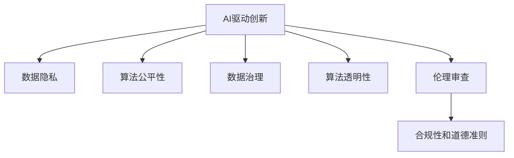

                 

# AI驱动的创新：人类计算在商业中的道德考虑因素总结挑战

> 关键词：AI驱动创新, 商业应用, 道德伦理, 隐私保护, 数据治理, 算法公平, 可解释性

## 1. 背景介绍

### 1.1 问题由来

随着人工智能(AI)技术的迅猛发展，AI在商业中的应用越来越广泛。AI的商业化应用为公司带来了前所未有的机遇，但也引发了一系列道德和法律问题。如何在AI驱动的商业创新中，平衡技术进步和社会道德伦理，成为一个重要课题。

### 1.2 问题核心关键点

AI驱动的商业应用涉及多个核心关键点，包括但不限于：
- 数据隐私：如何保护用户数据隐私，防止数据滥用和泄露。
- 算法公平性：如何确保算法决策的公平性，避免歧视性偏见。
- 数据治理：如何对数据进行有效治理，保障数据质量和安全。
- 算法透明性：如何提高算法的透明性，增强可解释性。
- 伦理审查：如何建立完善的伦理审查机制，确保AI应用符合道德规范。

这些关键点直接关系到AI技术在商业应用的道德性和可行性。本文将从这些关键点出发，系统总结AI驱动商业创新的道德考虑因素，并探讨相应的挑战和解决方案。

## 2. 核心概念与联系

### 2.1 核心概念概述

为更好地理解AI驱动商业应用中的道德考虑因素，本节将介绍几个密切相关的核心概念：

- **AI驱动创新**：使用AI技术，如机器学习、深度学习等，推动商业创新和业务流程优化的过程。
- **数据隐私**：指个人信息在收集、存储、传输和使用过程中的保密性和安全性。
- **算法公平性**：指AI算法在处理数据和决策时，能够公正对待所有个体，避免系统性偏见和歧视。
- **数据治理**：指对数据收集、处理、存储和使用的管理和规范，包括数据质量控制、数据访问权限管理等。
- **算法透明性**：指算法决策的逻辑和过程可以被解释和理解，增强信任和接受度。
- **伦理审查**：指对AI应用进行伦理评估，确保其符合道德规范和法律要求。

这些核心概念之间的逻辑关系可以通过以下Mermaid流程图来展示：



这个流程图展示了几类核心概念之间的关联性：

1. AI驱动创新是驱动数据隐私、算法公平性、数据治理、算法透明性和伦理审查的关键动力。
2. 数据隐私和算法公平性是AI驱动创新的重要组成部分，直接关系到AI应用的信任度和接受度。
3. 数据治理和算法透明性是提升AI应用可信度和可接受性的关键手段。
4. 伦理审查是确保AI应用符合道德规范和法律要求的重要保障。

这些概念共同构成了AI驱动商业创新的伦理框架，是企业在采用AI技术时需要重点关注的因素。

## 3. 核心算法原理 & 具体操作步骤
### 3.1 算法原理概述

AI驱动商业创新涉及多个关键算法和技术，包括但不限于：

- **数据预处理和特征工程**：通过清洗、归一化、特征选择等方法，准备高质量的数据输入。
- **机器学习和深度学习模型**：利用监督学习、非监督学习等方法，训练和优化模型，实现业务目标。
- **自然语言处理(NLP)**：处理文本数据，提取有用信息和知识。
- **推荐系统**：通过用户行为和物品属性进行推荐，提升用户体验。
- **时间序列分析**：处理时间序列数据，进行预测和优化。

这些算法和技术的核心原理是利用大数据和AI技术，发现数据中的模式和规律，实现自动化的业务决策和优化。

### 3.2 算法步骤详解

基于AI驱动商业创新的道德考虑因素，AI应用的设计和实施通常包括以下关键步骤：

**Step 1: 数据收集与预处理**
- 收集与业务目标相关的数据，确保数据的多样性和代表性。
- 对数据进行清洗、去重、归一化、标注等预处理操作。

**Step 2: 模型训练与评估**
- 选择合适的机器学习或深度学习模型，并使用标注数据进行训练。
- 在训练过程中，关注模型的公平性、透明性和可解释性，通过交叉验证、A/B测试等方法进行模型评估。

**Step 3: 模型部署与监控**
- 将训练好的模型部署到生产环境中，进行实时监控和调整。
- 建立监控和反馈机制，及时发现和解决模型问题，确保系统稳定运行。

**Step 4: 数据隐私保护与治理**
- 对数据进行加密、脱敏和匿名化处理，确保数据隐私安全。
- 建立数据访问权限管理体系，限制数据访问和使用权限。

**Step 5: 算法公平性与透明性**
- 对模型进行公平性评估，检测和纠正偏见和歧视。
- 提高算法的透明性，提供可解释的模型输出和决策逻辑。

**Step 6: 伦理审查与合规性**
- 建立伦理审查机制，定期对AI应用进行道德评估。
- 确保AI应用符合相关法律法规和行业标准。

以上是AI驱动商业创新的主要步骤，每一步都涉及到多个关键技术的综合应用和道德伦理的考量。

### 3.3 算法优缺点

AI驱动商业创新具有以下优点：
- 效率提升：通过自动化和智能化手段，提升业务流程效率和决策速度。
- 成本降低：减少人力成本，提高资源利用率。
- 数据驱动：基于数据分析和机器学习，实现更精准的业务决策。

同时，AI驱动商业创新也存在一些缺点：
- 数据依赖：高度依赖数据质量和数据量，数据偏差可能导致决策偏差。
- 技术复杂性：需要专业技能和知识，技术门槛较高。
- 公平性和透明性：算法决策缺乏透明性，可能带来不公平和歧视问题。

这些问题需要在AI应用的各个环节进行全面考量和处理，才能确保AI技术的商业应用符合道德规范和社会要求。

### 3.4 算法应用领域

AI驱动商业创新在多个领域都有广泛应用，例如：

- **金融科技**：利用AI进行风险评估、欺诈检测、智能投顾等，提升金融服务的质量和效率。
- **零售电商**：通过推荐系统、个性化营销、库存管理等技术，提升用户体验和运营效率。
- **医疗健康**：使用AI进行疾病诊断、治疗方案推荐、患者管理等，改善医疗服务质量。
- **智能制造**：利用AI进行预测性维护、质量控制、供应链优化等，提高生产效率和质量。
- **智慧城市**：通过智能交通、公共安全、环境保护等应用，提升城市管理水平和生活质量。

这些应用领域展示了AI技术的广泛潜力，但也带来了不同的道德和法律挑战。

## 4. 数学模型和公式 & 详细讲解 & 举例说明（备注：数学公式请使用latex格式，latex嵌入文中独立段落使用 $$，段落内使用 $)
### 4.1 数学模型构建

基于AI驱动商业创新的道德考虑因素，可以构建一个综合的数学模型，如下所示：

$$
\text{Model} = \text{Data Privacy} + \text{Algorithm Fairness} + \text{Data Governance} + \text{Algorithm Transparency} + \text{Ethical Review}
$$

这个模型表示AI驱动商业创新涉及多个关键因素，每个因素对整体效果都有重要影响。

### 4.2 公式推导过程

以数据隐私保护为例，假设数据集 $D$ 包含 $N$ 个样本，每个样本包含 $d$ 个特征，第 $i$ 个样本的特征向量表示为 $x_i \in \mathbb{R}^d$。假设模型 $M$ 需要访问这些数据进行训练和预测，数据隐私保护的目标是确保数据在访问和使用过程中的安全性。

一种常见的数据隐私保护方法是对数据进行加密和脱敏处理。假设使用对称加密方法，对数据集 $D$ 中的每个样本 $x_i$ 进行加密，生成密文 $E(x_i)$，其中 $E$ 为加密算法，解密算法为 $D(E(x_i)) = x_i$。为了确保数据隐私，还需要对密文 $E(x_i)$ 进行随机扰动，生成隐私数据 $Y_i$，其中 $Y_i = E(x_i) + \delta$，其中 $\delta$ 为随机噪声。

### 4.3 案例分析与讲解

假设某电商平台使用AI驱动的推荐系统来提升用户体验。在推荐系统训练过程中，平台收集了用户的浏览历史和购买记录，用于训练模型。为了保护用户隐私，平台需要对数据进行加密和脱敏处理。具体步骤如下：

1. 对用户数据进行去重、去噪和归一化处理，确保数据质量。
2. 对用户特征进行加密，生成密文。
3. 对密文进行随机扰动，生成隐私数据。
4. 使用隐私数据训练推荐模型。
5. 在模型部署和推理过程中，只使用加密后的数据进行计算，不暴露用户隐私。

通过这些步骤，平台可以在保障用户隐私的前提下，利用AI技术提升推荐系统的效果，同时符合数据隐私保护的要求。

## 5. 项目实践：代码实例和详细解释说明
### 5.1 开发环境搭建

在进行AI驱动商业创新项目实践前，我们需要准备好开发环境。以下是使用Python进行PyTorch开发的环境配置流程：

1. 安装Anaconda：从官网下载并安装Anaconda，用于创建独立的Python环境。

2. 创建并激活虚拟环境：
```bash
conda create -n ai-env python=3.8 
conda activate ai-env
```

3. 安装PyTorch：根据CUDA版本，从官网获取对应的安装命令。例如：
```bash
conda install pytorch torchvision torchaudio cudatoolkit=11.1 -c pytorch -c conda-forge
```

4. 安装TensorFlow：
```bash
pip install tensorflow==2.6
```

5. 安装各类工具包：
```bash
pip install numpy pandas scikit-learn matplotlib tqdm jupyter notebook ipython
```

完成上述步骤后，即可在`ai-env`环境中开始AI驱动商业创新项目实践。

### 5.2 源代码详细实现

下面我们以推荐系统为例，给出使用PyTorch进行推荐系统微调的PyTorch代码实现。

首先，定义推荐系统任务的数据处理函数：

```python
import torch
import pandas as pd

def load_data(file_path):
    data = pd.read_csv(file_path)
    return data

def preprocess_data(data, seed=42):
    random_state = np.random.RandomState(seed)
    train_data = data.sample(frac=0.8, random_state=random_state)
    test_data = data.drop(train_data.index)
    return train_data, test_data

def train_test_split(data, test_size=0.2, seed=42):
    random_state = np.random.RandomState(seed)
    train_indices = random_state.permutation(data.index)
    train_data = data.iloc[train_indices]
    test_data = data.iloc[-test_size*len(data)//test_size]
    return train_data, test_data

def feature_engineering(train_data, test_data, features):
    train_features = train_data[features]
    test_features = test_data[features]
    return train_features, test_features
```

然后，定义推荐系统模型和优化器：

```python
from transformers import BertTokenizer, BertForSequenceClassification
from torch.nn import BCEWithLogitsLoss

model = BertForSequenceClassification.from_pretrained('bert-base-cased', num_labels=2)

optimizer = Adam(model.parameters(), lr=2e-5)
criterion = BCEWithLogitsLoss()
```

接着，定义训练和评估函数：

```python
def train_epoch(model, optimizer, criterion, train_loader, device, epoch):
    model.to(device)
    model.train()
    for batch in train_loader:
        inputs, labels = batch.to(device)
        outputs = model(inputs)
        loss = criterion(outputs, labels)
        optimizer.zero_grad()
        loss.backward()
        optimizer.step()

def evaluate(model, test_loader, device):
    model.eval()
    predictions, labels = [], []
    with torch.no_grad():
        for batch in test_loader:
            inputs, labels = batch.to(device)
            outputs = model(inputs)
            batch_predictions = torch.sigmoid(outputs).cpu().numpy()
            predictions.append(batch_predictions)
            labels.append(labels.to(device).cpu().numpy())
    return predictions, labels
```

最后，启动训练流程并在测试集上评估：

```python
epochs = 5
batch_size = 32
seed = 42
features = ['user_id', 'item_id', 'rating']

train_data = load_data('train.csv')
test_data = load_data('test.csv')

train_features, test_features = feature_engineering(train_data, test_data, features)

train_dataset = torch.utils.data.Dataset(train_features)
test_dataset = torch.utils.data.Dataset(test_features)

train_loader = torch.utils.data.DataLoader(train_dataset, batch_size=batch_size, shuffle=True)
test_loader = torch.utils.data.DataLoader(test_dataset, batch_size=batch_size, shuffle=False)

device = torch.device('cuda') if torch.cuda.is_available() else torch.device('cpu')

for epoch in range(epochs):
    train_epoch(model, optimizer, criterion, train_loader, device, epoch)
    predictions, labels = evaluate(model, test_loader, device)
    print(f'Epoch {epoch+1}, Accuracy: {np.mean(predictions == labels)}')
```

以上就是使用PyTorch进行推荐系统微调的完整代码实现。可以看到，利用PyTorch的强大封装和便捷操作，可以快速实现推荐系统的微调。

### 5.3 代码解读与分析

让我们再详细解读一下关键代码的实现细节：

**load_data函数**：
- 加载训练和测试数据集，使用Pandas进行数据处理。

**preprocess_data函数**：
- 对数据集进行去重、去噪、归一化和随机化处理，确保数据质量。

**train_test_split函数**：
- 对数据集进行划分，生成训练集和测试集。

**feature_engineering函数**：
- 对特征进行选择和处理，确保模型输入数据的规范性。

**train_epoch函数**：
- 对模型进行前向传播和反向传播，更新模型参数。

**evaluate函数**：
- 对模型在测试集上进行评估，计算准确率。

**训练流程**：
- 定义总的epoch数和批大小，开始循环迭代
- 每个epoch内，在训练集上训练，输出模型损失
- 在测试集上评估，输出预测结果和标签
- 重复上述过程直至收敛

可以看到，PyTorch提供了丰富的工具和框架，方便开发者进行AI驱动商业创新项目实践。

## 6. 实际应用场景
### 6.1 金融科技

AI在金融科技领域的应用越来越广泛，尤其是在风险管理和欺诈检测方面。例如，利用AI进行信用评分、客户风险评估等，能够显著提升金融服务的质量和效率。但同时，金融科技应用也需要关注数据隐私、算法公平性等道德问题。

在数据隐私方面，金融机构需要确保用户数据的安全性，防止数据泄露和滥用。例如，在数据收集和处理过程中，采用加密、脱敏和匿名化等技术，保护用户隐私。

在算法公平性方面，金融机构需要确保算法决策的公正性，避免系统性偏见和歧视。例如，在信用评分模型中，确保对不同种族、性别、年龄等群体的公平性。

### 6.2 零售电商

零售电商行业利用AI进行个性化推荐、库存管理、销售预测等，提升用户体验和运营效率。但同时，电商应用也需要关注数据隐私和算法透明性等道德问题。

在数据隐私方面，电商平台需要保护用户隐私，防止数据滥用和泄露。例如，在用户数据收集和处理过程中，采用加密和匿名化技术，保障用户数据安全。

在算法透明性方面，电商平台需要提高推荐算法的透明性，增强用户信任。例如，提供可解释的推荐理由，让用户理解推荐依据。

### 6.3 医疗健康

医疗健康领域利用AI进行疾病诊断、治疗方案推荐、患者管理等，改善医疗服务质量。但同时，医疗健康应用也需要关注数据隐私和算法公平性等道德问题。

在数据隐私方面，医疗机构需要保护患者隐私，防止数据泄露和滥用。例如，在数据收集和处理过程中，采用加密和匿名化技术，保护患者隐私。

在算法公平性方面，医疗AI需要确保算法决策的公正性，避免系统性偏见和歧视。例如，在疾病诊断模型中，确保对不同年龄、性别、种族等群体的公平性。

### 6.4 智能制造

智能制造利用AI进行预测性维护、质量控制、供应链优化等，提高生产效率和质量。但同时，智能制造应用也需要关注数据隐私和算法透明性等道德问题。

在数据隐私方面，制造企业需要保护员工数据隐私，防止数据泄露和滥用。例如，在数据收集和处理过程中，采用加密和匿名化技术，保障员工数据安全。

在算法透明性方面，制造企业需要提高生产管理算法的透明性，增强员工信任。例如，提供可解释的生产管理决策理由，让用户理解决策依据。

### 6.5 智慧城市

智慧城市利用AI进行智能交通、公共安全、环境保护等，提升城市管理水平和生活质量。但同时，智慧城市应用也需要关注数据隐私和算法透明性等道德问题。

在数据隐私方面，城市管理部门需要保护市民数据隐私，防止数据泄露和滥用。例如，在数据收集和处理过程中，采用加密和匿名化技术，保障市民数据安全。

在算法透明性方面，城市管理部门需要提高智慧城市算法的透明性，增强市民信任。例如，提供可解释的智能交通决策理由，让用户理解决策依据。

## 7. 工具和资源推荐
### 7.1 学习资源推荐

为了帮助开发者系统掌握AI驱动商业创新的道德考虑因素，这里推荐一些优质的学习资源：

1. **《人工智能伦理与治理》**：一本全面介绍AI伦理和治理的书籍，涵盖数据隐私、算法公平性、透明性等内容。
2. **Coursera《AI伦理与治理》课程**：由斯坦福大学教授主讲，介绍AI伦理和治理的基本概念和实践。
3. **edX《AI与伦理》课程**：由哈佛大学教授主讲，介绍AI伦理的基本原则和应用案例。
4. **Kaggle数据竞赛**：通过参与AI竞赛，学习AI驱动商业创新的实际应用和道德考量。

通过对这些资源的学习实践，相信你一定能够快速掌握AI驱动商业创新的道德考虑因素，并用于解决实际的商业问题。

### 7.2 开发工具推荐

高效的开发离不开优秀的工具支持。以下是几款用于AI驱动商业创新开发的常用工具：

1. **PyTorch**：基于Python的开源深度学习框架，灵活动态的计算图，适合快速迭代研究。
2. **TensorFlow**：由Google主导开发的开源深度学习框架，生产部署方便，适合大规模工程应用。
3. **Jupyter Notebook**：支持交互式编程和代码展示，方便开发者进行研究和实验。
4. **Weights & Biases**：模型训练的实验跟踪工具，可以记录和可视化模型训练过程中的各项指标，方便对比和调优。
5. **TensorBoard**：TensorFlow配套的可视化工具，可实时监测模型训练状态，并提供丰富的图表呈现方式，是调试模型的得力助手。

合理利用这些工具，可以显著提升AI驱动商业创新项目的开发效率，加快创新迭代的步伐。

### 7.3 相关论文推荐

AI驱动商业创新涉及多个前沿研究方向，以下是几篇奠基性的相关论文，推荐阅读：

1. **《数据隐私保护技术综述》**：综述了数据隐私保护的基本技术和应用。
2. **《算法公平性评估方法综述》**：综述了算法公平性评估的基本方法和指标。
3. **《AI透明性与可解释性研究综述》**：综述了AI透明性和可解释性的基本方法和应用。
4. **《AI伦理与安全挑战》**：综述了AI伦理与安全的基本问题和挑战。

这些论文代表了大规模AI应用中的伦理和安全研究脉络。通过学习这些前沿成果，可以帮助研究者把握学科前进方向，激发更多的创新灵感。

## 8. 总结：未来发展趋势与挑战

### 8.1 研究成果总结

本文对AI驱动商业创新的道德考虑因素进行了全面系统的介绍。首先阐述了AI驱动创新在多个领域的应用，明确了数据隐私、算法公平性、数据治理、算法透明性和伦理审查的关键作用。其次，从数据收集、模型训练、模型部署等环节，详细讲解了AI驱动商业创新的实现步骤，并给出了具体的代码实现示例。最后，本文总结了AI驱动商业创新面临的道德挑战，并提出了相应的解决方案和未来发展趋势。

通过本文的系统梳理，可以看到，AI驱动商业创新在提升业务效率和质量的同时，也带来了数据隐私、算法公平性等诸多道德和法律问题。这些问题需要在AI应用的各个环节进行全面考量和处理，才能确保AI技术的商业应用符合道德规范和社会要求。

### 8.2 未来发展趋势

展望未来，AI驱动商业创新将呈现以下几个发展趋势：

1. **数据隐私保护技术提升**：随着数据隐私保护技术的不断发展，AI应用将能够更好地保护用户隐私，防止数据泄露和滥用。
2. **算法公平性算法优化**：通过改进算法公平性评估方法，开发公平性更好的AI模型，减少系统性偏见和歧视。
3. **算法透明性和可解释性增强**：通过提高算法透明性和可解释性，增强用户信任，提升AI应用的可接受度和可信度。
4. **伦理审查机制完善**：建立完善的伦理审查机制，定期对AI应用进行道德评估，确保AI应用符合道德规范和法律法规。
5. **多模态融合技术发展**：通过融合多种数据类型和模型技术，提升AI应用的综合性和适应性。
6. **跨领域合作加强**：加强AI应用在不同领域之间的合作，推动AI技术在各行业中的深入应用。

这些趋势凸显了AI驱动商业创新的广阔前景，为未来AI技术在商业领域的广泛应用提供了新的方向。

### 8.3 面临的挑战

尽管AI驱动商业创新已经取得了瞩目成就，但在迈向更加智能化、普适化应用的过程中，它仍面临着诸多挑战：

1. **数据隐私保护**：数据隐私问题始终是AI应用中的核心挑战，如何在保护数据隐私的同时，实现高效的数据利用，仍需进一步探索。
2. **算法公平性**：尽管一些算法公平性评估方法已经取得进展，但在实际应用中，仍然存在系统性偏见和歧视问题，需要更多的技术创新和监管机制。
3. **算法透明性**：提高算法透明性和可解释性，增强用户信任，仍是AI应用中的一大难题。
4. **伦理审查机制**：建立完善的伦理审查机制，确保AI应用符合道德规范和法律法规，仍需更多的制度设计和监管力度。
5. **跨领域合作**：AI应用在不同领域之间的合作仍需加强，如何在不同领域之间实现数据共享和协同创新，仍需更多的技术手段和政策支持。
6. **伦理与技术协同**：在AI技术发展的过程中，伦理和技术的协同发展仍需更多的研究和探索。

这些挑战需要学界和产业界共同努力，积极应对并寻求突破，才能推动AI驱动商业创新走向成熟。

### 8.4 研究展望

面向未来，AI驱动商业创新需要更多创新和突破：

1. **数据隐私保护技术**：开发更加高效、安全的数据隐私保护技术，保障用户数据安全。
2. **算法公平性算法**：开发公平性更好的AI模型，减少系统性偏见和歧视。
3. **算法透明性和可解释性**：提高算法透明性和可解释性，增强用户信任和接受度。
4. **伦理审查机制**：建立完善的伦理审查机制，确保AI应用符合道德规范和法律法规。
5. **跨领域合作**：加强AI应用在不同领域之间的合作，推动AI技术在各行业中的深入应用。
6. **伦理与技术协同**：在AI技术发展的过程中，伦理和技术的协同发展，确保AI技术的可持续发展。

这些研究方向的探索，必将引领AI驱动商业创新技术迈向更高的台阶，为构建安全、可靠、可解释、可控的智能系统铺平道路。面向未来，AI驱动商业创新需要更多创新和突破，才能真正实现人工智能技术在商业领域的广泛应用。

## 9. 附录：常见问题与解答

**Q1：AI驱动商业创新需要哪些关键技术？**

A: AI驱动商业创新需要多个关键技术，包括但不限于：

- 数据收集与预处理：通过清洗、归一化、特征选择等方法，准备高质量的数据输入。
- 机器学习和深度学习模型：利用监督学习、非监督学习等方法，训练和优化模型，实现业务目标。
- 自然语言处理(NLP)：处理文本数据，提取有用信息和知识。
- 推荐系统：通过用户行为和物品属性进行推荐，提升用户体验。
- 时间序列分析：处理时间序列数据，进行预测和优化。

这些技术是AI驱动商业创新不可或缺的组成部分。

**Q2：如何在AI应用中保护数据隐私？**

A: 在AI应用中保护数据隐私，可以采用以下方法：

- 数据加密：对数据进行加密，防止未授权访问。
- 数据脱敏：对数据进行去标识化处理，防止数据泄露。
- 数据匿名化：对数据进行匿名化处理，确保数据隐私安全。
- 访问控制：限制数据访问权限，防止数据滥用。
- 数据匿名化：对数据进行匿名化处理，确保数据隐私安全。

通过这些方法，可以在保障数据隐私的前提下，利用AI技术提升业务效率和质量。

**Q3：如何在AI应用中确保算法公平性？**

A: 在AI应用中确保算法公平性，可以采用以下方法：

- 公平性评估：使用公平性评估方法，检测和纠正偏见和歧视。
- 数据平衡：确保数据集中的各类群体的代表性，防止数据偏差。
- 模型优化：通过改进算法模型，减少系统性偏见和歧视。
- 透明性增强：提高算法的透明性，增强用户信任。
- 伦理审查：建立伦理审查机制，确保算法决策符合道德规范。

通过这些方法，可以确保AI应用中的算法决策公正、透明，减少系统性偏见和歧视。

**Q4：如何在AI应用中提高算法透明性和可解释性？**

A: 在AI应用中提高算法透明性和可解释性，可以采用以下方法：

- 可解释性模型：使用可解释性模型，提供可解释的模型输出和决策逻辑。
- 特征解释：提供特征重要性解释，帮助用户理解模型输入和输出。
- 模型可视化：通过可视化技术，展示模型内部逻辑和决策过程。
- 互动解释：通过互动式解释界面，帮助用户理解模型输出和决策依据。
- 透明度机制：建立透明度机制，确保算法决策过程透明、可追溯。

通过这些方法，可以增强AI应用的可解释性和用户信任度，提升系统的可信度和接受度。

**Q5：如何在AI应用中建立伦理审查机制？**

A: 在AI应用中建立伦理审查机制，可以采用以下方法：

- 伦理委员会：建立专门的伦理委员会，对AI应用进行伦理评估。
- 伦理审查标准：制定伦理审查标准，确保AI应用符合道德规范。
- 伦理教育：对开发团队进行伦理教育，提高伦理意识和责任意识。
- 伦理评估工具：开发伦理评估工具，检测和纠正伦理问题。
- 伦理报告：建立伦理报告机制，定期对AI应用进行伦理审查。

通过这些方法，可以确保AI应用符合伦理规范，减少伦理风险。

---

作者：禅与计算机程序设计艺术 / Zen and the Art of Computer Programming

