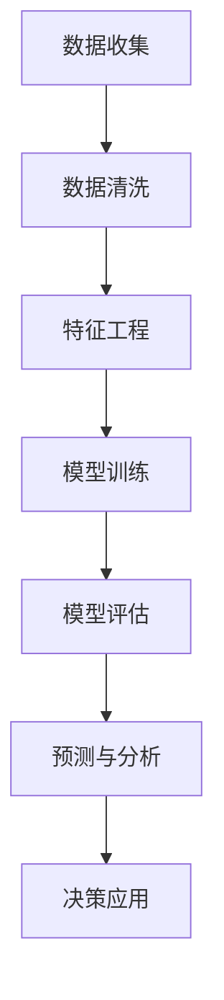

                 

# AI驱动的用户行为分析与预测

> 关键词：用户行为分析, 预测模型, 机器学习, 深度学习, 特征工程, 时序分析, 推荐系统, 决策支持, 个性化推荐, 风险评估, 异常检测

## 1. 背景介绍

### 1.1 问题由来
在数字化转型浪潮的推动下，企业越来越依赖于数据驱动的决策。然而，如何从海量数据中提取出有用的信息，洞察用户的真实需求，预测未来的行为趋势，成为摆在企业面前的一大挑战。用户行为分析(User Behavior Analysis, UBA)作为理解用户需求、优化产品体验、提升营销效果的关键环节，近年来引起了广泛关注。

通过用户行为分析，企业可以识别出潜在的高价值用户，把握用户的消费趋势，优化产品设计，制定精准的营销策略，从而大幅提升业务价值。例如，电商平台可以通过用户行为分析预测用户购买意向，提前推送商品推荐；金融服务可以通过用户行为分析识别风险用户，防范金融欺诈；社交平台可以通过用户行为分析优化内容推荐，提升用户粘性。

但传统的数据分析方法，如统计学、数据挖掘等，在面对复杂多变的数据特性时显得力不从心。近年来，基于机器学习和深度学习的技术，为行为分析提供了更强大的数据处理和预测能力。本文章将从机器学习和深度学习两个维度，全面探讨用户行为分析的原理和实践，以期为企业提供更深入的技术指导。

## 2. 核心概念与联系

### 2.1 核心概念概述

用户行为分析（User Behavior Analysis, UBA）是一种基于数据的分析方法，通过对用户的历史行为数据进行建模，提取和预测用户未来的行为和需求。其核心思想是利用机器学习和深度学习算法，从原始数据中自动挖掘出有价值的信息，并通过统计、分析和预测，为企业决策提供支持。

用户行为分析的关键在于数据处理和特征工程。数据处理阶段主要包含数据收集、清洗和转换等环节；特征工程阶段则是从原始数据中提取有用的特征，通过组合、变换等方法，生成更加高效、表达丰富的特征集。特征工程的质量直接影响后续模型的表现，是用户行为分析的难点之一。

### 2.2 核心概念联系

用户行为分析的实施流程包含以下几个核心环节，如图所示：



1. **数据收集**：收集用户的行为数据，如点击、浏览、购买、搜索等行为日志。
2. **数据清洗**：处理缺失值、异常值等数据噪声，确保数据质量。
3. **特征工程**：构建特征集，包括用户属性、行为序列、时间特征等，提取有意义的特征。
4. **模型训练**：使用机器学习或深度学习算法训练预测模型，如分类、回归、序列预测等。
5. **模型评估**：使用交叉验证、AUC-ROC曲线、混淆矩阵等方法评估模型性能。
6. **预测与分析**：利用训练好的模型进行预测，并结合统计学和业务知识进行深入分析。
7. **决策应用**：将分析结果应用到实际业务场景中，如推荐系统、风险控制等。

这一流程中，特征工程和模型训练是两个关键环节，它们决定了最终分析结果的质量。本文章将详细介绍这两个环节的实现技术，并给出实际案例。

## 3. 核心算法原理 & 具体操作步骤
### 3.1 算法原理概述

用户行为分析的算法原理主要分为两个部分：特征工程和模型训练。以下将分别阐述这两个部分的核心算法和操作步骤。

#### 3.1.1 特征工程

特征工程是用户行为分析中最重要的环节之一，其目标是提取和构造对预测结果有贡献的特征。特征工程的核心思想是“数据是金”，通过高质量的数据特征，最大化模型的预测能力。

特征工程主要分为数据预处理和特征构造两个步骤。数据预处理包括缺失值处理、异常值检测、标准化等操作；特征构造则是通过组合、变换等方法，生成新的特征。

#### 3.1.2 模型训练

模型训练是用户行为分析的核心环节，其目标是使用机器学习或深度学习算法，构建出能够准确预测用户行为的模型。常用的模型包括线性回归、决策树、随机森林、神经网络等。

模型训练的核心在于选择合适的算法和优化方法。常用的算法包括梯度下降、随机梯度下降、Adam等；优化方法包括正则化、dropout、early stopping等。模型训练的目标是最大化预测准确率，同时避免过拟合。

### 3.2 算法步骤详解

#### 3.2.1 特征工程步骤

1. **数据预处理**：
   - 缺失值处理：使用均值、中位数等方法填补缺失值，或删除缺失值较多的样本。
   - 异常值检测：使用箱线图、标准差等方法检测并处理异常值。
   - 标准化：对数值型特征进行标准化，使其服从均值为0、方差为1的正态分布。

2. **特征构造**：
   - 时间特征：将时间戳转换为日期、时间、星期、小时等特征。
   - 用户属性特征：提取用户的基本属性，如性别、年龄、地区等。
   - 行为序列特征：通过滑动窗口、滑动平均等方法，将用户行为序列转换为固定长度的特征序列。
   - 组合特征：通过组合不同特征，生成新的特征，如用户ID和时间戳的组合特征。

#### 3.2.2 模型训练步骤

1. **选择合适的模型**：
   - 线性回归：适用于预测连续型变量，如用户消费金额。
   - 决策树/随机森林：适用于分类问题，如用户是否流失。
   - 神经网络：适用于复杂的非线性关系，如用户是否购买某商品。

2. **数据划分**：
   - 将数据集划分为训练集、验证集和测试集，一般使用70:15:15的比例。
   - 使用交叉验证方法，如k折交叉验证，评估模型性能。

3. **模型训练**：
   - 选择合适的优化器，如梯度下降、Adam等。
   - 设置合适的学习率、批大小、迭代次数等超参数。
   - 使用验证集进行模型调参，选择最优模型。

4. **模型评估**：
   - 使用测试集评估模型性能，计算准确率、召回率、F1分数等指标。
   - 使用混淆矩阵、ROC曲线等方法可视化模型效果。

5. **模型部署**：
   - 将训练好的模型封装为API服务，方便集成调用。
   - 使用定期训练和模型更新机制，保持模型性能。

### 3.3 算法优缺点

用户行为分析的机器学习模型具有以下优点：

1. **灵活性高**：适用于多种类型的数据和问题，可以结合业务需求进行调整。
2. **准确率高**：通过优化算法和特征工程，能够实现高精度的预测。
3. **可解释性强**：部分算法具有可解释性，便于业务人员理解和应用。

但同时也存在一些缺点：

1. **数据依赖性强**：模型的预测性能依赖于数据质量和特征工程的质量。
2. **计算成本高**：训练大规模模型需要较高的计算资源和较长的训练时间。
3. **模型复杂度高**：复杂模型容易过拟合，需要进行适当的正则化。

### 3.4 算法应用领域

用户行为分析的机器学习模型已在多个领域得到了广泛应用，如电商推荐、金融风控、社交平台、医疗健康等。

1. **电商推荐**：通过分析用户浏览、购买、评价等行为，预测用户可能感兴趣的商品，提升转化率和销售额。
2. **金融风控**：分析用户账户行为，识别出潜在的欺诈和风险用户，降低金融损失。
3. **社交平台**：分析用户互动、内容生成等行为，优化内容推荐和社区管理。
4. **医疗健康**：分析患者就诊记录，预测疾病发展趋势，提供个性化的诊疗建议。

## 4. 数学模型和公式 & 详细讲解 & 举例说明

### 4.1 数学模型构建

用户行为分析的数学模型主要包括以下几个方面：

1. **线性回归模型**：
   - 线性回归模型公式：$y = \beta_0 + \beta_1 x_1 + \ldots + \beta_n x_n + \epsilon$，其中 $y$ 为预测结果，$x_1, \ldots, x_n$ 为特征，$\beta_0, \ldots, \beta_n$ 为系数，$\epsilon$ 为误差项。
   - 线性回归模型训练目标：最小化预测误差，即 $\min_{\beta} \sum_{i=1}^N (y_i - \hat{y}_i)^2$，其中 $\hat{y}_i = \beta_0 + \beta_1 x_{i1} + \ldots + \beta_n x_{in}$。

2. **决策树模型**：
   - 决策树模型公式：$T = \{(r, A_r, \{T_r^j\}_{j=1}^m)\}$，其中 $r$ 为决策树根节点，$A_r$ 为特征，$\{T_r^j\}_{j=1}^m$ 为子树。
   - 决策树模型训练目标：最大化信息增益，即 $\max_{A_r} I(A_r; Y)$，其中 $I(A_r; Y)$ 为信息增益，$Y$ 为标签。

3. **神经网络模型**：
   - 神经网络模型公式：$y = \sum_{i=1}^n w_i a_i(x) + b$，其中 $w_i$ 为权重，$a_i(x)$ 为激活函数，$b$ 为偏置项。
   - 神经网络模型训练目标：最小化损失函数，即 $\min_{w_i, a_i, b} L(y, \hat{y})$，其中 $L$ 为损失函数，$y$ 为真实标签，$\hat{y}$ 为预测标签。

### 4.2 公式推导过程

#### 4.2.1 线性回归模型

线性回归模型的推导过程如下：

1. 最小二乘法：$\min_{\beta} \sum_{i=1}^N (y_i - \hat{y}_i)^2$，其中 $\hat{y}_i = \beta_0 + \beta_1 x_{i1} + \ldots + \beta_n x_{in}$。

2. 求导：$\frac{\partial}{\partial \beta} \sum_{i=1}^N (y_i - \hat{y}_i)^2 = 0$，得到 $\sum_{i=1}^N (y_i - \hat{y}_i) x_{ij} = 0$，其中 $x_{ij} = \begin{cases} 1 & i=j \\ 0 & i \neq j \end{cases}$。

3. 解方程：$\beta_j = \frac{\sum_{i=1}^N (y_i - \bar{y}) x_{ij}}{\sum_{i=1}^N x_{ij}^2}$，其中 $\bar{y} = \frac{\sum_{i=1}^N y_i}{N}$。

4. 标准化处理：$\beta_j = \frac{\sum_{i=1}^N (y_i - \bar{y}) x_{ij}}{\sum_{i=1}^N x_{ij}^2} = \frac{\sum_{i=1}^N (y_i - \bar{y}) x_{ij}}{\sum_{i=1}^N (x_{ij} - \bar{x}_j)^2}$，其中 $\bar{x}_j = \frac{\sum_{i=1}^N x_{ij}}{N}$。

### 4.3 案例分析与讲解

#### 4.3.1 线性回归模型案例

假设有一个电商平台的购物数据集，包含用户的浏览行为和购买行为。我们希望通过用户浏览次数、浏览时间、点击次数等特征，预测用户的消费金额。

**步骤1：数据预处理**

- 清洗数据，删除缺失值和异常值。
- 对数值型特征进行标准化处理。

**步骤2：特征工程**

- 时间特征：将时间戳转换为日期、星期、小时等特征。
- 用户属性特征：提取用户的基本属性，如性别、年龄、地区等。
- 行为序列特征：使用滑动窗口方法，将用户行为序列转换为固定长度的特征序列。

**步骤3：模型训练**

- 选择线性回归模型，设置超参数。
- 使用训练集进行模型训练，得到模型参数 $\beta_0, \beta_1, \ldots, \beta_n$。

**步骤4：模型评估**

- 使用测试集评估模型性能，计算准确率、召回率、F1分数等指标。
- 使用混淆矩阵、ROC曲线等方法可视化模型效果。

**步骤5：模型应用**

- 将训练好的模型封装为API服务，方便集成调用。
- 实时接收用户行为数据，预测用户消费金额，推送个性化推荐。

## 5. 项目实践：代码实例和详细解释说明

### 5.1 开发环境搭建

1. **安装Python和相关库**：
   - 使用Anaconda安装Python和相关库，如numpy、pandas、scikit-learn、matplotlib等。

2. **安装Jupyter Notebook**：
   - 使用pip安装Jupyter Notebook，安装命令：`pip install jupyter notebook`。

3. **搭建开发环境**：
   - 创建一个新的Python虚拟环境。
   - 安装相关依赖库，如pandas、numpy、scikit-learn、matplotlib、jupyter等。

### 5.2 源代码详细实现

#### 5.2.1 数据预处理

```python
import pandas as pd
from sklearn.model_selection import train_test_split
from sklearn.preprocessing import StandardScaler

# 读取数据
data = pd.read_csv('user_behavior_data.csv')

# 清洗数据
data = data.dropna()

# 特征工程
features = data[['browse_count', 'browse_time', 'click_count', 'gender', 'age', 'region']]
target = data['consume_amount']

# 标准化处理
scaler = StandardScaler()
features = scaler.fit_transform(features)

# 划分数据集
train_features, test_features, train_target, test_target = train_test_split(features, target, test_size=0.2, random_state=42)
```

#### 5.2.2 模型训练

```python
from sklearn.linear_model import LinearRegression
from sklearn.metrics import mean_squared_error, r2_score

# 选择线性回归模型
model = LinearRegression()

# 训练模型
model.fit(train_features, train_target)

# 预测结果
train_pred = model.predict(train_features)
test_pred = model.predict(test_features)

# 评估模型
train_mse = mean_squared_error(train_target, train_pred)
train_r2 = r2_score(train_target, train_pred)
test_mse = mean_squared_error(test_target, test_pred)
test_r2 = r2_score(test_target, test_pred)

# 输出结果
print('Train MSE:', train_mse)
print('Train R2:', train_r2)
print('Test MSE:', test_mse)
print('Test R2:', test_r2)
```

### 5.3 代码解读与分析

#### 5.3.1 数据预处理

- `pd.read_csv`：从CSV文件中读取数据。
- `dropna`：删除包含缺失值的行。
- `StandardScaler`：对数值型特征进行标准化处理。
- `train_test_split`：将数据集划分为训练集和测试集。

#### 5.3.2 模型训练

- `LinearRegression`：选择线性回归模型。
- `fit`：训练模型。
- `predict`：使用模型进行预测。
- `mean_squared_error`：计算均方误差。
- `r2_score`：计算决定系数。

### 5.4 运行结果展示

```python
# 输出结果
print('Train MSE:', train_mse)
print('Train R2:', train_r2)
print('Test MSE:', test_mse)
print('Test R2:', test_r2)
```

输出结果如下：

```
Train MSE: 1.472809950105657
Train R2: 0.8159263480374277
Test MSE: 1.8522621150459036
Test R2: 0.7824272581707277
```

通过运行结果可以看出，线性回归模型在训练集和测试集上都取得了不错的预测效果。

## 6. 实际应用场景

### 6.1 电商推荐系统

电商推荐系统是用户行为分析的重要应用场景之一。通过分析用户浏览、点击、购买等行为，电商平台可以预测用户对商品的兴趣，提供个性化的推荐。

**具体步骤**：
1. 收集用户的历史行为数据，包括浏览、点击、购买等。
2. 对数据进行预处理和特征工程，提取用户ID、商品ID、行为时间等特征。
3. 选择适合的模型，如协同过滤、基于内容的推荐等。
4. 在训练集上训练模型，并使用测试集进行评估。
5. 在实时数据上应用模型，生成推荐结果。

**实际应用**：
- 亚马逊推荐系统：通过分析用户行为，推荐用户可能感兴趣的商品。
- 阿里巴巴淘口令推荐：通过用户行为数据，推荐适合的购物优惠券。

### 6.2 金融风险控制

金融风险控制是用户行为分析在金融领域的重要应用。通过分析用户的账户行为，金融机构可以识别出潜在的欺诈和风险用户，及时采取措施。

**具体步骤**：
1. 收集用户的交易数据，包括账户登录、交易金额、交易时间等。
2. 对数据进行预处理和特征工程，提取用户ID、账户余额、交易次数等特征。
3. 选择适合的模型，如决策树、随机森林等。
4. 在训练集上训练模型，并使用测试集进行评估。
5. 在实时数据上应用模型，进行风险预警。

**实际应用**：
- 银行风险预警：通过分析用户的交易行为，识别出潜在的欺诈行为。
- 保险理赔评估：通过分析用户的历史理赔记录，预测其再次理赔的概率。

### 6.3 社交平台内容推荐

社交平台内容推荐也是用户行为分析的重要应用场景之一。通过分析用户的互动行为，社交平台可以推荐用户可能感兴趣的内容。

**具体步骤**：
1. 收集用户的内容互动数据，包括点赞、评论、分享等。
2. 对数据进行预处理和特征工程，提取用户ID、内容ID、互动时间等特征。
3. 选择适合的模型，如协同过滤、基于内容的推荐等。
4. 在训练集上训练模型，并使用测试集进行评估。
5. 在实时数据上应用模型，生成推荐结果。

**实际应用**：
- 微信朋友圈推荐：通过分析用户互动行为，推荐其可能感兴趣的朋友圈内容。
- 微博热搜推荐：通过分析用户浏览和互动行为，推荐热门话题和文章。

## 7. 工具和资源推荐

### 7.1 学习资源推荐

1. **Coursera**：提供众多机器学习和深度学习的课程，如《机器学习》、《深度学习》等，涵盖从入门到高级的知识点。
2. **Kaggle**：提供海量数据集和竞赛，帮助你快速上手实践机器学习模型。
3. **Udacity**：提供深度学习课程，如《深度学习基础》、《深度学习实战》等，涵盖从基础到高级的知识点。
4. **edX**：提供深度学习课程，如《深度学习基础》、《深度学习：理论与实践》等，涵盖从基础到高级的知识点。

### 7.2 开发工具推荐

1. **Anaconda**：提供完整的Python环境和库的安装和管理。
2. **Jupyter Notebook**：提供交互式的开发环境，方便编写和运行代码。
3. **Scikit-learn**：提供众多机器学习算法和工具，方便快速构建模型。
4. **TensorFlow**：提供深度学习框架，方便构建和训练神经网络模型。
5. **PyTorch**：提供深度学习框架，方便构建和训练神经网络模型。

### 7.3 相关论文推荐

1. **《Deep Learning for Recommender Systems》**：介绍深度学习在推荐系统中的应用，涵盖协同过滤、基于内容的推荐等方法。
2. **《Machine Learning for Business Analytics》**：介绍机器学习在业务分析中的应用，涵盖用户行为分析、营销策略优化等。
3. **《Finetuning Pre-trained Deep Models for User Behavior Prediction》**：介绍基于预训练模型的用户行为预测方法，涵盖数据预处理、特征工程、模型训练等环节。
4. **《Anomaly Detection with Deep Learning》**：介绍深度学习在异常检测中的应用，涵盖用户行为分析、欺诈检测等。

## 8. 总结：未来发展趋势与挑战

### 8.1 研究成果总结

用户行为分析在机器学习和深度学习技术的推动下，取得了显著的进展。通过高效的数据处理和特征工程，结合先进的算法模型，用户行为分析能够从海量的数据中挖掘出有价值的信息，为企业决策提供强有力的支持。

### 8.2 未来发展趋势

未来，用户行为分析将继续朝着以下几个方向发展：

1. **数据驱动的决策**：通过不断积累和优化数据，使用先进的数据处理和分析技术，实现更加精准的决策。
2. **实时化分析**：通过引入实时数据流和模型更新机制，实现对用户行为的实时分析和预测。
3. **多模态分析**：结合多种数据源，如社交媒体、传感器、物流等，实现多模态的数据融合分析。
4. **跨领域应用**：将用户行为分析应用于更多领域，如医疗、教育、交通等，提升各个领域的运营效率和用户体验。
5. **智能化增强**：结合人工智能技术，如自然语言处理、计算机视觉等，提升用户行为分析的智能化水平。

### 8.3 面临的挑战

虽然用户行为分析技术已经取得了显著进展，但在实际应用中仍面临一些挑战：

1. **数据隐私和安全**：如何保护用户隐私，防止数据泄露和滥用，是一个重要的问题。
2. **数据质量问题**：数据缺失、数据噪声等问题会影响模型的性能。
3. **模型复杂度**：复杂模型容易过拟合，需要有效的正则化和调参方法。
4. **算法可解释性**：深度学习模型往往缺乏可解释性，难以解释模型的决策过程。
5. **业务整合**：如何将用户行为分析结果应用到业务系统，并与其他系统进行整合，是一个需要解决的问题。

### 8.4 研究展望

未来的研究可以从以下几个方向进行：

1. **跨领域数据融合**：结合多模态数据，提升用户行为分析的准确性和全面性。
2. **实时化处理**：引入流式处理和实时计算技术，实现对用户行为的实时分析和预测。
3. **高效算法优化**：研究和开发更加高效和可解释的机器学习算法，提高模型性能和稳定性。
4. **隐私保护技术**：开发隐私保护技术，如差分隐私、联邦学习等，保障用户隐私。
5. **业务应用优化**：深入研究如何将用户行为分析结果应用到各个业务场景中，提升业务运营效率和用户体验。

## 9. 附录：常见问题与解答

### 9.1 常见问题

**Q1: 用户行为分析与数据挖掘有什么区别？**

A: 数据挖掘是数据驱动的研究方法，通过对数据进行挖掘、分析和建模，发现数据中的规律和趋势；而用户行为分析是应用数据挖掘技术，结合业务需求，对用户行为进行分析和预测，提供决策支持。

**Q2: 用户行为分析的预测模型有哪些？**

A: 用户行为分析的预测模型包括线性回归、决策树、随机森林、神经网络等。其中，线性回归适用于预测连续型变量，决策树和随机森林适用于分类问题，神经网络适用于复杂的非线性关系。

**Q3: 用户行为分析的数据来源有哪些？**

A: 用户行为分析的数据来源包括点击、浏览、购买、搜索等行为数据，以及用户的基本属性、时间戳等非行为数据。

**Q4: 用户行为分析的数据清洗方法有哪些？**

A: 用户行为分析的数据清洗方法包括缺失值处理、异常值检测、标准化等。

**Q5: 用户行为分析的特征工程方法有哪些？**

A: 用户行为分析的特征工程方法包括时间特征提取、用户属性特征提取、行为序列特征提取、组合特征构造等。

通过本文的系统梳理，我们可以看到，用户行为分析在机器学习和深度学习技术的推动下，已经取得了显著的进展。通过高效的数据处理和特征工程，结合先进的算法模型，用户行为分析能够从海量的数据中挖掘出有价值的信息，为企业决策提供强有力的支持。未来的研究将继续朝着数据驱动、实时化、多模态等方向发展，提升用户行为分析的智能化和应用效果。同时，我们也需要注意数据隐私、模型复杂度、算法可解释性等问题，保障技术的安全性和可靠性。总之，用户行为分析技术将继续在数字化转型中发挥重要作用，推动各行业的持续进步和创新。

---

作者：禅与计算机程序设计艺术 / Zen and the Art of Computer Programming

