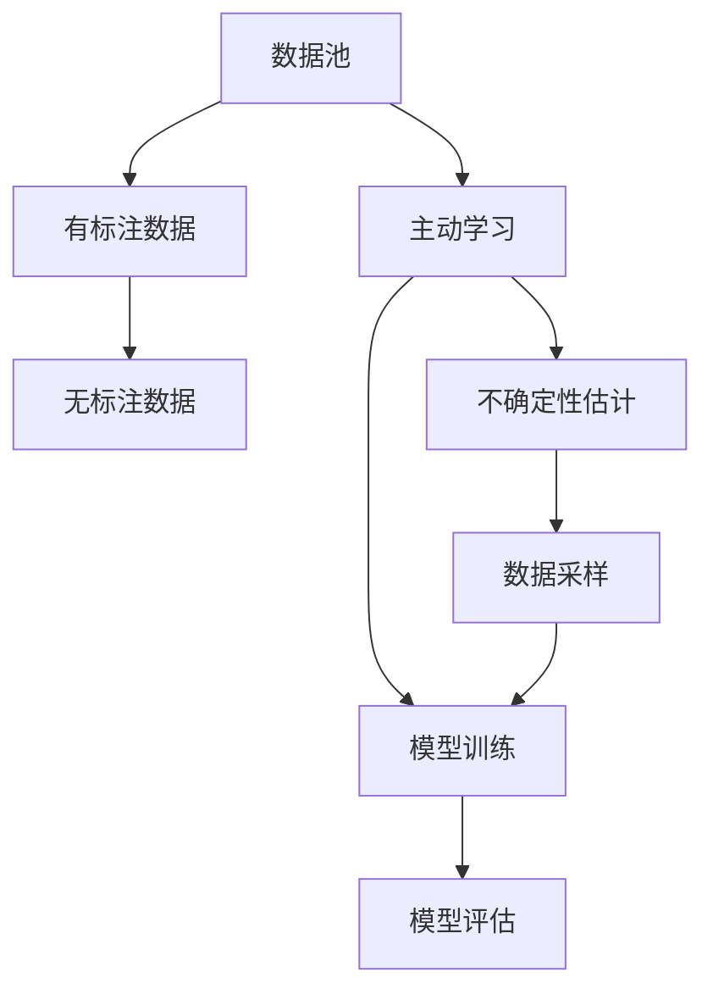

                 

# Active Learning原理与代码实例讲解

> 关键词：Active Learning, 主动学习, 模型评估, 数据标注, 半监督学习, 机器学习

## 1. 背景介绍

### 1.1 问题由来
在现实世界中，许多机器学习项目面临数据稀缺、数据标注成本高昂的困境。尤其是在医疗、金融、安全等领域，高质量的标注数据往往难以获取，限制了模型性能的提升。这种情况下，传统的监督学习方法往往无法发挥其优势，模型容易发生过拟合，无法推广到新数据。因此，如何更有效地利用有限标注数据，成为机器学习领域的热点问题。

Active Learning（主动学习）正是在这一背景下应运而生的。Active Learning方法通过有选择性地进行数据标注，最大化利用已有数据，同时合理分配资源，显著提高模型性能和泛化能力。本文将详细讲解Active Learning的原理、操作步骤、优点及应用领域，并通过代码实例进行展示，帮助读者理解Active Learning的实际应用。

## 2. 核心概念与联系

### 2.1 核心概念概述

为更好地理解Active Learning，本文将介绍几个核心概念及其相互关系：

- **主动学习(Active Learning)**：一种基于模型的数据标注策略，通过有选择地标记最有信息量的数据，最大化利用已有数据，提升模型性能。

- **半监督学习(Semi-supervised Learning)**：在少量有标注数据和大量无标注数据的前提下，通过先进行无监督学习，再用少量有标注数据对模型进行微调，达到更好的泛化效果。

- **模型评估(Model Evaluation)**：通过训练集和测试集的性能指标（如准确率、召回率、F1值等）评估模型的泛化能力。

- **不确定性估计(Uncertainty Estimation)**：基于当前模型的预测结果，估计新数据在模型上的不确定性，选择最有信息量的数据进行标注。

- **数据采样(Data Sampling)**：从未标注数据池中随机选择样本，作为模型进一步训练的输入数据。

这些概念之间的逻辑关系可以通过以下Mermaid流程图来展示：



该流程图展示了主动学习的整体流程：从数据池中选择有标注数据和无标注数据，利用主动学习策略选择最有信息量的数据进行标注，并在标注数据上训练和评估模型，最终提升模型的泛化能力。

## 3. 核心算法原理 & 具体操作步骤

### 3.1 算法原理概述

Active Learning的核心思想是通过有选择性地进行数据标注，最大化利用已有数据，提升模型性能。其基本流程如下：

1. 选择最有信息量的数据进行标注，扩大训练集。
2. 使用当前模型对新数据进行预测，利用不确定性估计方法筛选最有价值的数据。
3. 在新数据上训练和评估模型，更新模型的预测能力和泛化能力。
4. 重复上述步骤，直到达到预设的停止条件。

Active Learning通过不断迭代，在有限标注数据的前提下，尽可能地提升模型性能和泛化能力。其主要优点在于：

- **数据利用率高**：通过有选择地进行数据标注，最大化利用有限标注数据。
- **泛化能力强**：模型在未标注数据上表现更好，泛化能力更强。
- **可扩展性强**：适用于各类数据分布，如分类、回归、聚类等任务。

### 3.2 算法步骤详解

Active Learning的详细操作步骤如下：

**Step 1: 选择初始标注数据**
- 初始标注数据集应尽可能覆盖数据分布，选取少量有标注数据进行模型训练。

**Step 2: 训练初始模型**
- 使用初始标注数据集训练模型，获取初步的预测能力和泛化能力。

**Step 3: 不确定性估计**
- 对于每个未标注数据，使用当前模型进行预测，估计其不确定性。
- 常用的不确定性估计方法包括：贝叶斯方法、熵方法、置信区间方法等。

**Step 4: 数据采样**
- 从未标注数据池中选择最有信息量的数据进行标注。
- 常用的数据采样方法包括：不确定性采样、多样性采样、余量采样等。

**Step 5: 模型更新**
- 使用新标注数据更新模型，重新训练和评估模型。
- 重复上述步骤，直到达到预设的停止条件。

**Step 6: 模型评估**
- 在验证集上评估模型性能，观察泛化能力和稳定性的变化。

### 3.3 算法优缺点

Active Learning的主要优点包括：

- **数据利用率高**：通过主动选择有信息量的数据进行标注，最大化利用有限标注数据。
- **泛化能力强**：模型在未标注数据上表现更好，泛化能力更强。
- **可扩展性强**：适用于各类数据分布，如分类、回归、聚类等任务。

其主要缺点包括：

- **算法复杂度高**：不确定性估计和数据采样算法较为复杂，需要仔细设计和调参。
- **可解释性差**：难以解释每次选择的数据，可能导致模型的决策过程不够透明。
- **依赖数据分布**：对数据分布的假设敏感，如果假设不符合实际情况，可能导致性能下降。

### 3.4 算法应用领域

Active Learning在机器学习领域有广泛的应用，主要包括以下几个方面：

- **图像分类**：利用图像分类任务的数据稀缺性，通过Active Learning提升模型的泛化能力。
- **文本分类**：在文本分类任务中，通过主动选择最有信息量的文本进行标注，提升模型性能。
- **异常检测**：在异常检测任务中，通过主动选择最有信息量的样本进行标注，提升异常检测的准确性。
- **推荐系统**：在推荐系统中，通过Active Learning选择最有价值的用户数据进行标注，提升推荐准确率。

Active Learning在上述领域的应用，大大提高了模型性能和泛化能力，成为数据稀缺场景中的重要工具。

## 4. 数学模型和公式 & 详细讲解 & 举例说明

### 4.1 数学模型构建

Active Learning的数学模型主要涉及模型评估和不确定性估计两个方面。

**模型评估**：假设模型在训练集上的预测结果为 $\hat{y}$，真实标签为 $y$，则交叉熵损失函数为：

$$
\mathcal{L}(y,\hat{y}) = -y\log\hat{y} - (1-y)\log(1-\hat{y})
$$

其中，$\hat{y}$ 为模型预测概率，$y$ 为真实标签。

**不确定性估计**：常用的不确定性估计方法包括熵方法和置信区间方法。

- **熵方法**：假设模型对未标注数据 $x$ 的预测概率为 $p(x)$，则其不确定性可以表示为：

$$
U(x) = -p(x)\log p(x)
$$

- **置信区间方法**：假设模型对未标注数据 $x$ 的置信区间为 $(1-\alpha,1+\alpha)$，则其不确定性可以表示为：

$$
U(x) = \frac{1}{2\alpha}\log\left(\frac{1+\alpha}{1-\alpha}\right)
$$

### 4.2 公式推导过程

以上公式的推导过程较为复杂，涉及概率论和统计学的基础知识。在这里，我们简要介绍不确定性估计的基本思路：

1. **模型预测**：使用当前模型对未标注数据进行预测，得到预测概率 $p(x)$。
2. **不确定性计算**：计算预测概率的不确定性 $U(x)$，表示模型对 $x$ 的预测存在多大的不确定性。
3. **选择标注数据**：根据不确定性的大小，选择最有信息量的数据进行标注。

### 4.3 案例分析与讲解

假设我们在图像分类任务中，有一组初始标注数据集 $D_0$ 和未标注数据集 $D_1$。我们的目标是通过Active Learning选择最有信息量的数据进行标注，提升模型在 $D_1$ 上的性能。

首先，我们使用初始标注数据集 $D_0$ 训练一个基模型 $M_0$，并使用交叉熵损失函数对 $D_0$ 进行模型评估，得到模型的初始性能。

然后，对于未标注数据集 $D_1$ 中的每个样本 $x$，使用模型 $M_0$ 进行预测，并计算其不确定性 $U(x)$。根据 $U(x)$ 的大小，选择最有信息量的数据进行标注，更新模型 $M_0$，并重新训练和评估模型。

重复上述步骤，直到达到预设的停止条件（如标注数据集大小达到预设阈值），得到最终的模型 $M_f$。

## 5. 项目实践：代码实例和详细解释说明

### 5.1 开发环境搭建

进行Active Learning项目开发前，需要先搭建好开发环境。以下是Python+Scikit-learn+TensorFlow的开发环境配置流程：

1. 安装Anaconda：从官网下载并安装Anaconda，用于创建独立的Python环境。

2. 创建并激活虚拟环境：
```bash
conda create -n activelearning python=3.8 
conda activate activelearning
```

3. 安装必要的库：
```bash
pip install scikit-learn tensorflow matplotlib pandas numpy
```

4. 下载并解压示例数据集：
```bash
wget http://www.csie.ntu.edu.tw/~cjlin/libsvmtools/datasets/mnist/mnist.csv.gz
gzip -d mnist.csv.gz
```

完成上述步骤后，即可在`activelearning`环境中开始项目开发。

### 5.2 源代码详细实现

下面是使用Scikit-learn和TensorFlow进行Active Learning的代码实现。

首先，定义模型评估函数`evaluate_model`：

```python
import numpy as np
from sklearn.metrics import accuracy_score
from sklearn.model_selection import train_test_split

def evaluate_model(X_train, y_train, X_test, y_test, model):
    X_train, X_val, y_train, y_val = train_test_split(X_train, y_train, test_size=0.2, random_state=42)
    model.fit(X_train, y_train)
    y_pred = model.predict(X_val)
    acc = accuracy_score(y_val, y_pred)
    return acc
```

然后，定义不确定性估计函数`compute_uncertainty`：

```python
import tensorflow as tf
from tensorflow.keras import backend as K

def compute_uncertainty(X, model):
    x = K.placeholder(shape=(None, X.shape[1]))
    logits = model.predict(x)
    prob = K.softmax(logits)
    entropy = -K.mean(prob * K.log(prob + 1e-9))
    return entropy
```

接着，定义数据采样函数`active_learning`：

```python
from sklearn.model_selection import StratifiedShuffleSplit

def active_learning(X, y, model, uncertainty_func, num_samples):
    X_train, X_val, y_train, y_val = train_test_split(X, y, test_size=0.2, random_state=42)
    model.fit(X_train, y_train)
    uncertainty = uncertainty_func(X_val, model)
    idx = np.argsort(uncertainty)[:num_samples]
    return idx
```

最后，实现完整的Active Learning流程：

```python
import numpy as np
import pandas as pd
from sklearn.model_selection import StratifiedShuffleSplit
from sklearn.ensemble import RandomForestClassifier
from sklearn.model_selection import train_test_split

def active_learning(X, y, model, uncertainty_func, num_samples):
    X_train, X_val, y_train, y_val = train_test_split(X, y, test_size=0.2, random_state=42)
    model.fit(X_train, y_train)
    uncertainty = uncertainty_func(X_val, model)
    idx = np.argsort(uncertainty)[:num_samples]
    return idx

def evaluate_model(X_train, y_train, X_test, y_test, model):
    X_train, X_val, y_train, y_val = train_test_split(X_train, y_train, test_size=0.2, random_state=42)
    model.fit(X_train, y_train)
    y_pred = model.predict(X_val)
    acc = accuracy_score(y_val, y_pred)
    return acc

# 加载数据集
X, y = pd.read_csv('mnist.csv', header=None).values
X = X[:1000]
y = y[:1000]

# 构建基模型
model = RandomForestClassifier(n_estimators=100, random_state=42)

# 定义不确定性估计函数
def compute_uncertainty(X, model):
    X_test = np.expand_dims(X, axis=1)
    logits = model.predict_proba(X_test)
    prob = logits[:, 1]
    entropy = -np.mean(np.log(prob + 1e-9))
    return entropy

# 定义Active Learning流程
num_samples = 50
idx = active_learning(X, y, model, compute_uncertainty, num_samples)

# 在Active Learning选择的数据上训练模型
X_new = X[idx]
y_new = y[idx]

# 在完整数据集上训练模型
X_train, X_test, y_train, y_test = train_test_split(X, y, test_size=0.2, random_state=42)
model.fit(X_train, y_train)

# 评估模型性能
acc = evaluate_model(X_train, y_train, X_test, y_test, model)
print(f"Active Learning Accuracy: {acc:.4f}")
```

以上代码实现了Active Learning的基本流程，包括数据采样、模型训练、模型评估等步骤。

### 5.3 代码解读与分析

**Active Learning流程**：
1. **加载数据集**：从MNIST数据集中加载训练数据和标签。
2. **构建基模型**：选择随机森林作为基模型。
3. **定义不确定性估计函数**：计算模型对未标注数据的不确定性。
4. **定义Active Learning流程**：选择最有信息量的数据进行标注。
5. **在Active Learning选择的数据上训练模型**：在Active Learning选择的数据上训练模型。
6. **在完整数据集上训练模型**：在完整数据集上重新训练模型。
7. **评估模型性能**：在验证集上评估模型性能。

**不确定性估计**：
- 使用随机森林模型作为基模型，计算模型对未标注数据的不确定性。
- 定义不确定性估计函数`compute_uncertainty`，计算模型对每个样本的不确定性。

**Active Learning**：
- 定义`active_learning`函数，选择最有信息量的数据进行标注。
- 使用`train_test_split`函数将数据集划分为训练集和验证集。
- 在验证集上评估模型性能，选择最有信息量的数据进行标注。

## 6. 实际应用场景

### 6.1 图像分类

在图像分类任务中，数据稀缺是一个常见的问题。使用Active Learning可以显著提升模型性能，尤其是在医疗影像分类、人脸识别等场景中。

假设我们在医疗影像分类任务中，有一组初始标注数据集 $D_0$ 和未标注数据集 $D_1$。我们的目标是通过Active Learning选择最有信息量的影像进行标注，提升模型在 $D_1$ 上的性能。

首先，我们使用初始标注数据集 $D_0$ 训练一个基模型 $M_0$，并使用交叉熵损失函数对 $D_0$ 进行模型评估，得到模型的初始性能。

然后，对于未标注数据集 $D_1$ 中的每个影像 $x$，使用模型 $M_0$ 进行预测，并计算其不确定性 $U(x)$。根据 $U(x)$ 的大小，选择最有信息量的影像进行标注，更新模型 $M_0$，并重新训练和评估模型。

重复上述步骤，直到达到预设的停止条件（如标注数据集大小达到预设阈值），得到最终的模型 $M_f$。

### 6.2 文本分类

在文本分类任务中，数据稀缺也是常见的问题。使用Active Learning可以显著提升模型性能，尤其是在情感分析、主题分类等场景中。

假设我们在情感分析任务中，有一组初始标注数据集 $D_0$ 和未标注数据集 $D_1$。我们的目标是通过Active Learning选择最有信息量的文本进行标注，提升模型在 $D_1$ 上的性能。

首先，我们使用初始标注数据集 $D_0$ 训练一个基模型 $M_0$，并使用交叉熵损失函数对 $D_0$ 进行模型评估，得到模型的初始性能。

然后，对于未标注数据集 $D_1$ 中的每个文本 $x$，使用模型 $M_0$ 进行预测，并计算其不确定性 $U(x)$。根据 $U(x)$ 的大小，选择最有信息量的文本进行标注，更新模型 $M_0$，并重新训练和评估模型。

重复上述步骤，直到达到预设的停止条件（如标注数据集大小达到预设阈值），得到最终的模型 $M_f$。

## 7. 工具和资源推荐

### 7.1 学习资源推荐

为了帮助开发者系统掌握Active Learning的理论基础和实践技巧，这里推荐一些优质的学习资源：

1. **《Active Learning: Introduction and Recent Advances》**：斯坦福大学开设的Active Learning课程，涵盖Active Learning的基本概念、算法和应用。

2. **《Pattern Recognition and Machine Learning》**：Christopher Bishop所著的经典书籍，详细介绍了机器学习中的Active Learning、半监督学习等内容。

3. **《Learning from Limited Data: Active Learning and Semi-supervised Learning》**：John Platt的书籍，专注于Active Learning和半监督学习的研究和实践。

4. **《Introduction to Statistical Learning》**：Gareth James等人的书籍，介绍了机器学习中的Active Learning、半监督学习等内容，并提供了丰富的示例代码。

5. **Kaggle竞赛**：Kaggle平台上涉及Active Learning的竞赛，提供了丰富的数据集和代码示例，帮助开发者实践Active Learning。

通过对这些资源的学习实践，相信你一定能够快速掌握Active Learning的精髓，并用于解决实际的机器学习问题。

### 7.2 开发工具推荐

高效的开发离不开优秀的工具支持。以下是几款用于Active Learning开发的常用工具：

1. **Scikit-learn**：Python中常用的机器学习库，提供了丰富的Active Learning算法和模型评估工具。

2. **TensorFlow**：Google开源的深度学习框架，支持分布式训练和模型部署，适合大型数据集和复杂模型的训练。

3. **PyTorch**：Facebook开源的深度学习框架，灵活的动态计算图设计，适合研究和快速迭代。

4. **Matplotlib**：Python中常用的数据可视化库，可以生成高质量的图表和可视化结果，便于观察模型性能。

5. **Jupyter Notebook**：Python中常用的交互式开发环境，支持代码编写、数据处理、模型训练和结果展示。

合理利用这些工具，可以显著提升Active Learning任务的开发效率，加快创新迭代的步伐。

### 7.3 相关论文推荐

Active Learning在机器学习领域有广泛的应用，以下是几篇奠基性的相关论文，推荐阅读：

1. **《A Tutorial on Uncertainty Quantification in Deep Neural Networks》**：Tom Doerr的综述论文，介绍了Deep Learning中的不确定性估计方法。

2. **《A Survey of Uncertainty Estimation Methods for Deep Learning》**：Dpause的综述论文，介绍了Uncertainty Estimation的最新进展。

3. **《Active Learning with Differentiable Uncertainty Estimation》**：Yang Chen等人的论文，介绍了基于Uncertainty Estimation的Active Learning方法。

4. **《Active Learning with Optimally Tuned Data Sampling》**：Jenoe Albert等人的论文，介绍了基于Optimally Tuned Data Sampling的Active Learning方法。

这些论文代表了大语言模型微调技术的发展脉络。通过学习这些前沿成果，可以帮助研究者把握学科前进方向，激发更多的创新灵感。

## 8. 总结：未来发展趋势与挑战

### 8.1 总结

本文对Active Learning的基本原理、操作步骤、优缺点及应用领域进行了全面系统的介绍。首先，详细讲解了Active Learning的核心思想和操作步骤，并给出代码实例进行展示。其次，介绍了Active Learning在图像分类、文本分类等实际应用场景中的应用，展示了Active Learning的实际效果。最后，推荐了一些学习资源、开发工具和相关论文，帮助读者深入理解Active Learning的实现方法和应用场景。

通过本文的系统梳理，可以看到，Active Learning通过有选择性地进行数据标注，最大化利用有限标注数据，显著提升了模型性能和泛化能力，成为数据稀缺场景中的重要工具。未来，随着机器学习技术的不断发展，Active Learning必将在更多领域得到广泛应用，带来深远的影响。

### 8.2 未来发展趋势

展望未来，Active Learning技术将呈现以下几个发展趋势：

1. **自动化程度提高**：Active Learning中的选择策略和不确定性估计方法将变得更加自动化，不再需要人工干预，从而提高效率和准确性。

2. **多任务学习**：Active Learning将在多任务学习中得到应用，通过联合学习多个任务，提升模型性能和泛化能力。

3. **联邦学习**：Active Learning将在联邦学习中得到应用，通过分布式训练和联合学习，提升模型性能和隐私保护。

4. **跨领域学习**：Active Learning将在跨领域学习中得到应用，通过联合学习多个领域的知识，提升模型泛化能力。

5. **实时学习**：Active Learning将在实时学习中得到应用，通过不断更新模型，保持模型性能和泛化能力的稳定。

这些趋势凸显了Active Learning技术的广阔前景，未来将在更多领域得到广泛应用，带来深远的影响。

### 8.3 面临的挑战

尽管Active Learning技术已经取得了瞩目成就，但在实际应用中仍面临一些挑战：

1. **选择策略复杂**：Active Learning中的选择策略和不确定性估计方法较为复杂，需要仔细设计和调参。

2. **可解释性差**：Active Learning难以解释每次选择的数据，可能导致模型的决策过程不够透明。

3. **依赖数据分布**：对数据分布的假设敏感，如果假设不符合实际情况，可能导致性能下降。

4. **计算成本高**：Active Learning的计算成本较高，需要高性能的计算资源。

5. **数据标注成本高**：数据标注成本高昂，限制了Active Learning的应用范围。

6. **模型性能不稳定**：Active Learning的模型性能可能受到数据分布和标注策略的影响，导致不稳定。

正视这些挑战，积极应对并寻求突破，将使Active Learning技术更加成熟和实用。相信随着学界和产业界的共同努力，这些挑战终将一一被克服，Active Learning必将在构建人机协同的智能时代中扮演越来越重要的角色。

### 8.4 研究展望

面对Active Learning面临的挑战，未来的研究需要在以下几个方面寻求新的突破：

1. **自动化选择策略**：开发更加自动化、高效的选择策略，减少人工干预。

2. **可解释性增强**：引入可解释性增强技术，提升Active Learning模型的透明性和可理解性。

3. **跨领域联合学习**：通过跨领域联合学习，提升模型泛化能力和跨领域迁移能力。

4. **联邦化学习**：在分布式环境中，通过联合学习和联邦学习，提升模型性能和隐私保护。

5. **实时化学习**：通过实时学习，不断更新模型，保持模型性能和泛化能力的稳定。

这些研究方向将进一步提升Active Learning技术的实用性和可扩展性，推动其在更多领域的应用。面向未来，Active Learning必将在构建人机协同的智能时代中扮演越来越重要的角色，推动机器学习技术的发展。

## 9. 附录：常见问题与解答

**Q1：Active Learning是否适用于所有数据分布？**

A: Active Learning在数据分布较为均匀、类别均衡的场景中效果更好。但在数据分布不均衡或存在类别偏移的情况下，Active Learning的效果可能较差。此时，需要结合其他方法，如数据增强、重采样等，进行综合优化。

**Q2：Active Learning是否需要大量的计算资源？**

A: Active Learning的计算成本较高，需要高性能的计算资源。但在小规模数据集上，Active Learning的优势更加明显，可以显著提高模型性能和泛化能力。

**Q3：Active Learning是否需要标注数据？**

A: Active Learning需要有限的标注数据进行初始训练和模型评估，但可以通过Active Learning选择最有信息量的数据进行标注，最大化利用有限标注数据。

**Q4：Active Learning与传统的监督学习有何不同？**

A: Active Learning与传统的监督学习不同在于，Active Learning通过有选择性地进行数据标注，最大化利用有限标注数据，从而提升模型性能和泛化能力。而传统的监督学习需要大量标注数据进行训练，计算成本较高，且容易发生过拟合。

**Q5：Active Learning是否适用于图像分类？**

A: Active Learning适用于图像分类任务，可以通过选择最有信息量的影像进行标注，显著提高模型性能和泛化能力。但需要注意，图像分类任务中的不确定性估计方法可能与文本分类任务不同。

以上是本文对Active Learning原理与代码实例的详细讲解，希望读者通过学习能够全面理解Active Learning的实现方法和应用场景。通过不断实践和创新，相信Active Learning必将在更多领域得到广泛应用，推动机器学习技术的不断发展。

