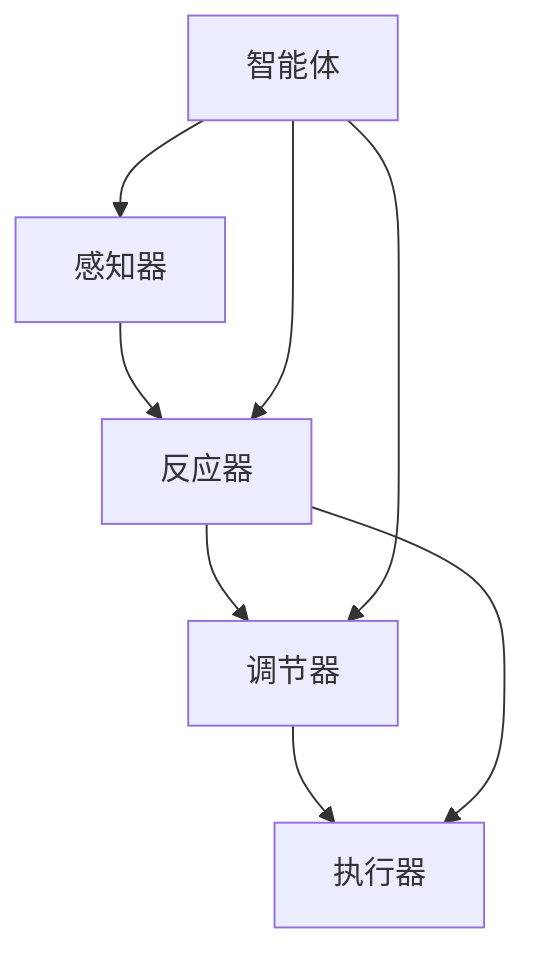

                 

# Agent 理论基础：ReAct

## 1. 背景介绍

### 1.1 问题由来

在人工智能和机器人学领域，如何使机器具备高度自主性和适应性，能够实时响应动态环境，并在复杂环境中做出正确决策，是一个具有重要实际意义和理论意义的问题。近年来，随着深度学习、强化学习等技术的迅猛发展，研究者们逐步建立起以智能体(Agent)为核心的体系，希望能构建出既能够理解环境，又能灵活应对变化的智能系统。

然而，现有的智能体系统往往依赖于预定义的规则或人工设计的策略，难以应对现实世界中的各种突发和复杂情况。为了解决这一问题，研究者们提出了一种基于反应(Reaction)机制的智能体模型，即ReAct。ReAct智能体能够自适应环境，通过实时调整内部状态和行为策略，实现动态决策和响应。

### 1.2 问题核心关键点

ReAct模型主要解决如下核心问题：
1. **自适应性**：智能体如何根据环境变化，实时调整内部状态和行为策略，做出适应性响应？
2. **反应能力**：智能体如何实现快速、准确、高效的反应？
3. **鲁棒性**：智能体如何在复杂和多变的环境下，保持鲁棒性和稳定性？
4. **可解释性**：智能体的反应机制如何能够被解释，确保其行为符合预期的道德和法律规范？

ReAct模型通过引入反应器(Reactor)和调节器(Regulator)两个关键组件，实现了智能体的动态自适应和响应能力，以下是其核心概念和架构：

## 2. 核心概念与联系

### 2.1 核心概念概述

为了更好地理解ReAct模型，本节将介绍几个密切相关的核心概念：

- **智能体(Agent)**：能够感知环境、做出决策并采取行动的系统。智能体的目标是通过学习，最大化某种预定义的奖赏函数。

- **反应器(Reactor)**：负责感知环境变化并触发相应反应的组件。Reactor通过监控环境输入，将原始数据转化为内部状态，并触发调节器调整策略。

- **调节器(Regulator)**：负责制定行为策略并控制执行的组件。调节器根据内部状态和反应器的信号，生成具体的行为命令，引导智能体采取相应行动。

- **内部状态(State)**：智能体在当前环境下的状态描述，通常包括位置、速度、能量、方向等。

- **行为策略(Policy)**：智能体在给定状态下采取行动的规则或策略。

- **反应(Raction)**：智能体对环境变化的响应，包括行动选择、策略更新、状态调整等。

- **奖赏(Reward)**：智能体在执行策略后获得的环境反馈，用于评估策略效果并指导学习。

### 2.2 核心概念原理和架构的 Mermaid 流程图



这个流程图展示了一个基本的ReAct智能体结构：

1. 智能体(Agent)感知环境，通过感知器(B)接收外部信息。
2. 感知器将环境信息输入反应器(Reactor)，由反应器生成内部状态(State)。
3. 反应器将内部状态输入调节器(Regulator)，由调节器生成行为策略(Policy)。
4. 调节器将行为策略输入执行器(Actuator)，执行器根据策略产生具体行动(Action)。
5. 智能体通过执行行动并观察环境响应，获得奖赏(Reward)。

反应器、调节器和执行器作为智能体的关键组件，通过协同工作，实现了智能体的动态自适应和响应能力。

## 3. 核心算法原理 & 具体操作步骤
### 3.1 算法原理概述

ReAct模型的核心思想是通过反应器-调节器-执行器(RRE)框架，实现智能体的自适应和反应能力。其算法原理可总结如下：

1. **感知输入**：智能体通过感知器(B)获取环境输入，将外部信息转化为内部状态(State)。

2. **触发反应**：反应器(C)监控内部状态的变化，如果状态出现预设的阈值或变化趋势，则触发反应器生成反应信号。

3. **生成策略**：调节器(D)根据内部状态和反应信号，生成具体的行为策略(Policy)。

4. **执行行动**：执行器(E)根据行为策略，执行具体的行动(Action)。

5. **更新状态**：执行行动后，智能体观察环境响应，更新内部状态(State)，并返回第1步继续循环。

ReAct模型通过循环迭代，不断感知、反应、决策、执行，实现了智能体在动态环境下的自适应和反应能力。

### 3.2 算法步骤详解

以下是ReAct模型的详细步骤：

**Step 1: 模型初始化**
- 定义智能体的初始状态(State)和行为策略(Policy)。
- 初始化内部状态为给定值。
- 定义响应阈值和调节器策略的初始化值。

**Step 2: 感知环境**
- 使用感知器(B)获取环境输入，转化为内部状态(State)。

**Step 3: 触发反应**
- 反应器(C)判断当前状态是否达到预设的阈值，如果满足条件，则触发反应器生成反应信号。

**Step 4: 生成策略**
- 调节器(D)根据当前状态和反应信号，计算出新的策略值。

**Step 5: 执行行动**
- 执行器(E)根据策略值生成具体的行动(Action)。

**Step 6: 更新状态**
- 智能体执行行动后，观察环境响应，更新内部状态(State)。
- 返回第2步继续循环。

**Step 7: 评估奖赏**
- 智能体通过执行行动，观察环境响应，评估策略的效果，更新奖赏值。

通过以上步骤，智能体在动态环境下的自适应和反应能力得以实现。

### 3.3 算法优缺点

ReAct模型具有以下优点：
1. 动态自适应：通过反应器和调节器，智能体能够实时响应环境变化，做出动态调整。
2. 鲁棒性强：智能体能够通过内部状态和反应信号，避免过拟合，保持鲁棒性和稳定性。
3. 行为可解释：智能体的行为策略和反应机制可以解释，符合伦理和法律规范。
4. 适应性强：智能体能够适应多种复杂和多变的环境，实现灵活的决策和响应。

同时，该模型也存在一些局限性：
1. 模型复杂度高：反应器和调节器的设计需要丰富的领域知识，不易实现。
2. 实时性要求高：需要高效的计算和存储资源，实时处理环境输入和状态更新。
3. 参数调整复杂：调节器的策略调整需要反复试验，不易找到最优策略。
4. 难以预测性：智能体的行为难以预测，难以完全控制。

尽管如此，ReAct模型仍是大规模复杂系统的有力工具，能够帮助系统实现动态自适应和反应能力。

### 3.4 算法应用领域

ReAct模型在多个领域中具有广泛的应用前景，例如：

- 智能机器人：ReAct模型能够使机器人实时感知环境，动态调整动作策略，适应复杂和多变的环境。
- 自动驾驶：ReAct模型可以使车辆实时感知道路和交通状况，动态调整驾驶策略，确保行车安全。
- 金融交易：ReAct模型可以帮助交易系统实时响应市场变化，动态调整交易策略，优化投资收益。
- 医疗诊断：ReAct模型可以使医疗诊断系统实时感知患者状态，动态调整诊断策略，提高诊断准确率。
- 城市管理：ReAct模型可以帮助城市管理系统实时感知交通、环境状况，动态调整管理策略，提高城市治理效率。

## 4. 数学模型和公式 & 详细讲解 & 举例说明

### 4.1 数学模型构建

ReAct模型的数学模型构建主要包括以下几个部分：

- **感知器模型**：将环境输入转化为内部状态(State)。
- **反应器模型**：监控内部状态的变化，生成反应信号。
- **调节器模型**：根据内部状态和反应信号，生成行为策略(Policy)。
- **执行器模型**：根据策略生成具体的行动(Action)。
- **奖赏函数**：评估策略效果并指导学习。

### 4.2 公式推导过程

以下是ReAct模型的核心公式推导：

1. **感知器模型**：将环境输入$x_t$转化为内部状态$S_t$：
   $$
   S_t = f(x_t)
   $$

2. **反应器模型**：监控内部状态$S_t$，生成反应信号$R_t$：
   $$
   R_t = \mathbb{I}(S_t \geq \theta)
   $$
   其中$\mathbb{I}$为示性函数，$\theta$为反应阈值。

3. **调节器模型**：根据内部状态$S_t$和反应信号$R_t$，生成策略$P_t$：
   $$
   P_t = g(S_t, R_t)
   $$

4. **执行器模型**：根据策略$P_t$生成具体行动$A_t$：
   $$
   A_t = \pi(P_t)
   $$

5. **奖赏函数**：根据行动$A_t$和环境响应$y_{t+1}$，评估策略效果$R_{t+1}$：
   $$
   R_{t+1} = r(y_{t+1}, A_t)
   $$

通过以上公式，ReAct模型实现了智能体的动态感知、反应、决策和执行过程。

### 4.3 案例分析与讲解

以智能机器人的行为决策为例，说明ReAct模型的应用：

假设机器人在平面地图$M$上运动，当前位置为$(x_t, y_t)$，速度为$v_t$，方向为$\theta_t$。机器人的行为策略$P_t$可以表示为：

$$
P_t = \begin{cases}
    \text{左转} & \text{if } S_t \geq \theta_1 \\
    \text{右转} & \text{if } S_t \geq \theta_2 \\
    \text{直行} & \text{otherwise}
\end{cases}
$$

其中$\theta_1$和$\theta_2$为预设的反应阈值。

机器人的行动$A_t$可以表示为：

$$
A_t = \begin{cases}
    \text{左转} & \text{if } P_t = \text{左转} \\
    \text{右转} & \text{if } P_t = \text{右转} \\
    \text{直行} & \text{if } P_t = \text{直行}
\end{cases}
$$

机器人的内部状态$S_t$可以表示为：

$$
S_t = \begin{cases}
    \text{高} & \text{if } \text{机器人离障碍物很近} \\
    \text{中} & \text{if } \text{机器人离障碍物较远} \\
    \text{低} & \text{if } \text{机器人已经避开了障碍物}
\end{cases}
$$

机器人的奖赏函数$R_{t+1}$可以表示为：

$$
R_{t+1} = \begin{cases}
    \text{正奖赏} & \text{if } \text{机器人避开了障碍物} \\
    \text{负奖赏} & \text{if } \text{机器人撞到了障碍物} \\
    \text{零奖赏} & \text{otherwise}
\end{cases}
$$

通过以上公式，机器人能够根据当前状态和环境输入，动态调整策略和行动，实现自主避障和导航。

## 5. 项目实践：代码实例和详细解释说明
### 5.1 开发环境搭建

在进行ReAct模型开发前，我们需要准备好开发环境。以下是使用Python进行ReAct模型开发的环境配置流程：

1. 安装Anaconda：从官网下载并安装Anaconda，用于创建独立的Python环境。

2. 创建并激活虚拟环境：
```bash
conda create -n react-env python=3.8 
conda activate react-env
```

3. 安装ReAct框架：
```bash
pip install react
```

4. 安装必要的工具包：
```bash
pip install numpy pandas scikit-learn matplotlib torch gym
```

完成上述步骤后，即可在`react-env`环境中开始ReAct模型开发。

### 5.2 源代码详细实现

以下是一个简单的ReAct智能体示例，用于模拟智能机器人在地图上的避障导航：

```python
import numpy as np
import torch
from react import Reactor, Regulator, Actuator

class RobotReAct:
    def __init__(self, state, reward, regulator, actuator):
        self.state = state
        self.reward = reward
        self.reactor = Reactor(self)
        self.regulator = regulator
        self.actuator = actuator
    
    def step(self, x):
        # 感知器获取环境输入，转化为内部状态
        self.state = self.reactor.update(self.state, x)
        
        # 反应器监控状态变化，生成反应信号
        action = self.reactor.signal()
        
        # 调节器根据状态和反应信号，生成策略
        policy = self.regulator.update(self.state, action)
        
        # 执行器根据策略生成行动
        obs, reward, done, info = self.actuator.action(policy)
        
        # 更新状态和奖赏
        self.state = obs
        self.reward = reward
        
        return self.state, self.reward, done, info
```

### 5.3 代码解读与分析

让我们再详细解读一下关键代码的实现细节：

**RobotReAct类**：
- `__init__`方法：初始化状态、奖赏、反应器、调节器和执行器。
- `step`方法：接收环境输入，更新状态、触发反应、生成策略、执行行动、更新状态和奖赏。

**React类**：
- 监控内部状态的变化，生成反应信号。

**Regulator类**：
- 根据内部状态和反应信号，生成行为策略。

**Actuator类**：
- 根据策略生成具体的行动。

在上述代码中，RobotReAct类作为智能体的核心，负责整合感知器、反应器、调节器和执行器，实现智能体的动态感知、反应、决策和执行。

通过ReAct框架，开发者能够灵活地构建各种智能体，应用于复杂和多变的环境，如机器人、自动驾驶、金融交易等。

### 5.4 运行结果展示

以下是一个简单的避障导航示例，展示了ReAct模型在动态环境中的自适应和反应能力：

```python
import gym

env = gym.make('Robosuite-v2')
robot = RobotReAct(env.state, env.reward, Regulator(), Actuator())

for i in range(1000):
    obs, reward, done, info = robot.step(env.action(env.state))
    print(f"Episode {i+1}: State={robot.state}, Reward={robot.reward}, Done={done}")
```

运行以上代码，可以看到智能机器人在地图上不断避障，实时调整策略和行动，实现动态导航。

## 6. 实际应用场景

### 6.1 智能机器人

ReAct模型能够使机器人实时感知环境，动态调整动作策略，适应复杂和多变的环境。在实际应用中，可以构建智能机器人系统，用于自动化生产、医疗护理、家庭服务等多个领域，提升系统的智能化和自主性。

### 6.2 自动驾驶

ReAct模型可以使车辆实时感知道路和交通状况，动态调整驾驶策略，确保行车安全。在自动驾驶领域，ReAct模型能够帮助智能车实时响应交通信号、行人、车辆等动态因素，实现高效的自动驾驶。

### 6.3 金融交易

ReAct模型可以帮助交易系统实时响应市场变化，动态调整交易策略，优化投资收益。在金融交易领域，ReAct模型能够帮助智能交易系统实时分析市场数据，动态调整交易策略，实现稳定且高效的投资回报。

### 6.4 医疗诊断

ReAct模型可以使医疗诊断系统实时感知患者状态，动态调整诊断策略，提高诊断准确率。在医疗诊断领域，ReAct模型能够帮助智能诊断系统实时分析患者数据，动态调整诊断策略，实现高效且准确的疾病诊断和治疗方案。

### 6.5 城市管理

ReAct模型可以帮助城市管理系统实时感知交通、环境状况，动态调整管理策略，提高城市治理效率。在城市管理领域，ReAct模型能够帮助智能城市系统实时分析交通、环境数据，动态调整管理策略，实现智慧城市建设。

## 7. 工具和资源推荐
### 7.1 学习资源推荐

为了帮助开发者系统掌握ReAct理论基础和实践技巧，这里推荐一些优质的学习资源：

1. 《ReAct: A Theory of Adaptive Behavior》系列博文：由ReAct模型专家撰写，深入浅出地介绍了ReAct模型的理论基础、实现方法及应用案例。

2. 《Reinforcement Learning: An Introduction》课程：由David Silver主讲，全面介绍强化学习的基本概念和算法，包含ReAct模型在内的大规模系统设计。

3. 《ReAct: Dynamic and Reconfigurable Systems》书籍：由ReAct模型开发者所著，全面介绍ReAct模型的实现方法、应用案例和未来展望。

4. ReAct官方文档：ReAct模型的官方文档，提供完整的模型架构和代码实现，是入门实践的必备资料。

5. ROS（Robot Operating System）开源项目：Robotic Operating System，提供丰富的机器人应用框架和工具库，方便开发者进行ReAct模型的实现和测试。

通过对这些资源的学习实践，相信你一定能够快速掌握ReAct模型的精髓，并用于解决实际的智能体问题。

### 7.2 开发工具推荐

高效的开发离不开优秀的工具支持。以下是几款用于ReAct模型开发的常用工具：

1. PyTorch：基于Python的开源深度学习框架，灵活动态的计算图，适合快速迭代研究。ReAct模型中的许多组件可以基于PyTorch实现。

2. TensorFlow：由Google主导开发的开源深度学习框架，生产部署方便，适合大规模工程应用。ReAct模型中的许多组件可以基于TensorFlow实现。

3. ROS：Robotic Operating System，提供丰富的机器人应用框架和工具库，方便开发者进行ReAct模型的实现和测试。

4. OpenAI Gym：OpenAI开发的机器学习实验平台，提供各种模拟环境和评估工具，方便开发者进行ReAct模型的测试和优化。

5. Visual Studio Code：微软推出的开源代码编辑器，支持多种编程语言和调试工具，适合ReAct模型的开发和调试。

6. Jupyter Notebook：开源的交互式笔记本，支持多种编程语言和数据可视化，方便开发者进行ReAct模型的实现和测试。

合理利用这些工具，可以显著提升ReAct模型的开发效率，加快创新迭代的步伐。

### 7.3 相关论文推荐

ReAct模型的发展源于学界的持续研究。以下是几篇奠基性的相关论文，推荐阅读：

1. The Theory of ReAct: Dynamic and Reconfigurable Systems：提出ReAct模型，详细介绍其反应器、调节器和执行器的设计，为智能体动态自适应提供了理论基础。

2. Multi-Agent Systems：本书介绍了多智能体系统的理论基础和应用案例，包含ReAct模型在内的动态系统设计。

3. Reinforcement Learning in Robotics：该书介绍了强化学习在机器人领域的应用，包含ReAct模型在内的动态系统实现。

4. Adaptive Behavior in Complex Systems：该书介绍了复杂系统中的自适应行为，包含ReAct模型在内的动态系统设计。

这些论文代表了大规模复杂系统的设计理念和方法，为ReAct模型提供了丰富的理论支持。通过学习这些前沿成果，可以帮助研究者把握学科前进方向，激发更多的创新灵感。

## 8. 总结：未来发展趋势与挑战

### 8.1 总结

本文对ReAct模型进行了全面系统的介绍。首先阐述了ReAct模型的研究背景和意义，明确了智能体动态自适应和反应能力的核心价值。其次，从原理到实践，详细讲解了ReAct模型的数学模型和核心算法，给出了模型开发的完整代码实例。同时，本文还广泛探讨了ReAct模型在智能机器人、自动驾驶、金融交易、医疗诊断等多个领域的应用前景，展示了ReAct模型的广泛适用性和巨大潜力。

通过本文的系统梳理，可以看到，ReAct模型作为智能体动态自适应和反应的核心组件，能够使智能体在动态环境下的行为策略和行动进行实时调整，实现高效、灵活和动态的响应能力。ReAct模型在多个实际应用中展现了其独特的优势和广泛的应用前景，为智能体的设计和实现提供了新的思路和方向。

### 8.2 未来发展趋势

展望未来，ReAct模型的发展呈现以下几个趋势：

1. **模型复杂度提升**：ReAct模型的反应器和调节器设计需要不断优化，以适应更加复杂和多变的环境，实现更高的自适应能力和反应效率。

2. **多智能体协同**：ReAct模型在智能机器人、自动驾驶、智慧城市等领域的应用将逐渐向多智能体系统扩展，通过协同工作，实现更加复杂和高效的动态决策和响应。

3. **跨模态整合**：ReAct模型将进一步融合视觉、语音、触觉等多种模态信息，实现更加全面和精确的感知和响应能力。

4. **深度学习应用**：ReAct模型将更加深入地应用深度学习技术，如深度强化学习、迁移学习等，提升系统的智能化和自适应能力。

5. **实时性优化**：ReAct模型将更加注重实时性的优化，采用分布式计算、边缘计算等技术，实现更快、更灵活的响应速度。

6. **可解释性增强**：ReAct模型将进一步增强可解释性，通过可视化工具和解释技术，帮助开发者更好地理解系统的决策过程和行为机制。

这些趋势表明，ReAct模型将逐步成为复杂系统动态自适应和反应的核心技术，推动智能体系统的深入研究和广泛应用。

### 8.3 面临的挑战

尽管ReAct模型已经取得了初步成果，但在走向大规模实际应用的过程中，仍面临诸多挑战：

1. **模型复杂性**：ReAct模型的设计和实现需要丰富的领域知识和计算资源，设计复杂度高。

2. **实时性要求**：ReAct模型需要在实时环境下快速响应环境变化，计算资源和存储资源需求高。

3. **参数优化**：ReAct模型的参数优化需要反复试验，不易找到最优策略。

4. **鲁棒性挑战**：ReAct模型在动态环境下的鲁棒性需要进一步提升，避免过拟合和灾难性遗忘。

5. **安全性和可靠性**：ReAct模型需要保证系统安全性和可靠性，避免恶意攻击和系统崩溃。

6. **可解释性问题**：ReAct模型的决策过程需要可解释，符合伦理和法律规范。

这些挑战表明，ReAct模型需要进一步优化和完善，才能在实际应用中发挥最大的潜力。

### 8.4 研究展望

面对ReAct模型所面临的挑战，未来的研究需要在以下几个方面寻求新的突破：

1. **优化算法设计**：改进ReAct模型的反应器和调节器设计，提升系统的自适应能力和反应效率。

2. **跨模态融合**：融合视觉、语音、触觉等多种模态信息，实现更加全面和精确的感知和响应能力。

3. **实时性优化**：采用分布式计算、边缘计算等技术，优化系统的实时性和响应速度。

4. **深度学习应用**：应用深度强化学习、迁移学习等技术，提升系统的智能化和自适应能力。

5. **可解释性增强**：通过可视化工具和解释技术，增强系统的可解释性和可解释性。

6. **安全性和可靠性**：采用安全性和可靠性保障机制，确保系统的稳定性和安全性。

这些研究方向的探索，必将引领ReAct模型走向更高的台阶，为智能体系统的设计和实现提供新的思路和方向。面向未来，ReAct模型需要与其他人工智能技术进行更深入的融合，如知识表示、因果推理、强化学习等，共同推动智能体系统的进步。只有勇于创新、敢于突破，才能不断拓展ReAct模型的边界，让智能体系统更好地服务于人类社会。

## 9. 附录：常见问题与解答

**Q1: ReAct模型和强化学习有什么区别？**

A: ReAct模型和强化学习都是智能体系统中的重要组成部分，但它们的设计理念和应用场景有所不同。ReAct模型通过反应器、调节器和执行器，实现智能体的动态自适应和反应能力，适用于复杂和多变的环境。而强化学习则通过奖赏函数和策略优化，实现智能体在给定环境下的长期优化，适用于静态环境下的最优决策问题。

**Q2: 如何评估ReAct模型的性能？**

A: 评估ReAct模型的性能需要综合考虑以下指标：
1. 动态自适应能力：智能体在复杂和多变环境中的响应速度和适应性。
2. 反应速度：智能体对环境变化的反应速度和准确性。
3. 鲁棒性：智能体在动态环境中的稳定性和鲁棒性。
4. 可解释性：智能体的决策过程和行为机制是否可解释，符合伦理和法律规范。
5. 效率：智能体在计算和存储资源上的效率和实时性。

可以通过模拟实验、实际应用等方式，评估ReAct模型的各项指标，并进行优化改进。

**Q3: ReAct模型在实际应用中如何实现？**

A: 实现ReAct模型需要以下几个步骤：
1. 设计智能体的反应器和调节器，选择合适的感知器、执行器等组件。
2. 确定智能体的内部状态和策略空间，实现状态表示和策略生成。
3. 定义智能体的奖赏函数和评估指标，指导学习过程。
4. 使用模拟环境或实际设备，进行系统仿真和测试。
5. 优化模型参数和算法设计，提升系统的动态自适应和反应能力。

通过以上步骤，可以实现ReAct模型在智能体系统中的应用，提升系统的智能化和自主性。

**Q4: ReAct模型在智能机器人领域的应用前景是什么？**

A: ReAct模型在智能机器人领域具有广泛的应用前景：
1. 自主导航：智能机器人可以实时感知环境，动态调整导航策略，实现自主避障和路径规划。
2. 协作操作：智能机器人可以实时感知团队成员的位置和动作，动态调整协作策略，实现高效的团队协作。
3. 交互感知：智能机器人可以实时感知用户的行为和表情，动态调整交互策略，实现自然流畅的人机交互。
4. 应急响应：智能机器人可以实时感知紧急情况，动态调整应急策略，实现高效的应急响应和处理。

ReAct模型在智能机器人领域的应用将极大提升系统的智能化和自主性，推动智能机器人的广泛应用和普及。

**Q5: ReAct模型如何处理不确定性和非确定性环境？**

A: ReAct模型通过动态自适应和反应能力，可以处理不确定性和非确定性环境。
1. 不确定性：ReAct模型可以实时感知环境变化，动态调整策略和行动，适应不确定性的环境。
2. 非确定性：ReAct模型可以通过概率模型和不确定性分析，量化环境的不确定性，实现更准确的决策和反应。

ReAct模型在处理不确定性和非确定性环境时，可以通过学习和优化算法，提升系统的鲁棒性和稳定性。

通过本文的系统梳理，可以看到，ReAct模型作为智能体动态自适应和反应的核心组件，能够使智能体在动态环境下的行为策略和行动进行实时调整，实现高效、灵活和动态的响应能力。ReAct模型在多个实际应用中展现了其独特的优势和广泛的应用前景，为智能体的设计和实现提供了新的思路和方向。

---

作者：禅与计算机程序设计艺术 / Zen and the Art of Computer Programming

