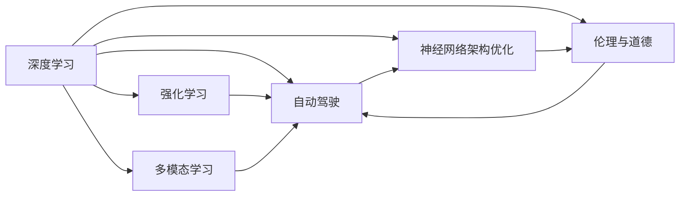

                 

# Andrej Karpathy的AI观点

在过去的十年里，人工智能（AI）领域迎来了翻天覆地的变化。来自斯坦福大学的Andrej Karpathy，作为一位在深度学习领域卓有成就的科学家，他对AI的现状和未来发展有着独到的见解。本文将通过解析Andrej Karpathy的一些核心观点，探寻AI技术在未来可能的发展趋势和面临的挑战。

## 1. 背景介绍

### 1.1 问题由来
Andrej Karpathy，斯坦福大学教授，深度学习领域的先驱之一，以其对深度学习架构的深刻理解和创新性的研究成果而闻名。他的工作涉及计算机视觉、自然语言处理和自动驾驶等多个领域，对AI技术的发展有着深远的影响。在近期的研究中，Karpathy专注于强化学习、神经网络架构优化以及AI在实际应用中的伦理和安全性问题。

### 1.2 问题核心关键点
Karpathy的研究工作主要集中在以下几个核心问题：

- 如何优化神经网络的架构和训练过程，以提升模型的准确性和效率。
- 如何在AI系统中引入伦理和道德考量，确保技术应用的负责任性和公平性。
- 如何平衡AI技术的创新与应用中的可解释性和可控性，避免技术滥用。
- 如何通过多模态学习和跨领域迁移，使AI技术在更广泛的应用场景中发挥作用。

## 2. 核心概念与联系

### 2.1 核心概念概述

Andrej Karpathy的AI观点涉及多个核心概念，包括但不限于：

- **深度学习（Deep Learning）**：一种基于多层神经网络进行数据表示和分类的机器学习方法。
- **强化学习（Reinforcement Learning）**：通过智能体与环境的交互，学习最优策略以达到特定目标的机器学习方法。
- **自动驾驶（Autonomous Driving）**：利用AI技术实现车辆的自主导航和驾驶，是Karpathy关注的重点之一。
- **神经网络架构优化（Network Architecture Optimization）**：研究如何设计更高效、更灵活的神经网络结构，以提升模型的性能。
- **伦理与道德（Ethics and Morality）**：在AI技术的开发和应用中，引入伦理和道德考量，确保技术的负责任性和公平性。
- **多模态学习（Multimodal Learning）**：利用多种数据源（如图像、文本、音频等）进行联合学习，以提升模型的泛化能力。

### 2.2 核心概念原理和架构的 Mermaid 流程图



这个流程图展示了深度学习如何与强化学习、自动驾驶、神经网络架构优化、伦理与道德以及多模态学习等概念相互联系和影响，共同推动AI技术的发展。

## 3. 核心算法原理 & 具体操作步骤

### 3.1 算法原理概述
Andrej Karpathy的研究中，深度学习和强化学习是两个核心的算法原理。

- **深度学习**：通过多层次的非线性变换，深度学习模型可以学习到复杂的数据表示和模式。Karpathy指出，深度学习的成功得益于大规模数据和强大的计算资源，使得模型能够自适应地学习数据的复杂特征。

- **强化学习**：强化学习通过智能体与环境的交互，不断调整策略以最大化奖励。Karpathy的研究表明，强化学习在自动驾驶等复杂任务中具有重要作用，可以通过模拟和实际驾驶经验的结合，优化驾驶策略，提升安全性。

### 3.2 算法步骤详解

以**强化学习**为例，Karpathy的工作主要包括以下几个关键步骤：

1. **环境设计**：构建一个模拟环境，用于训练智能体。
2. **状态表示**：设计一个状态表示方法，用于捕捉环境中的关键信息。
3. **动作空间**：定义智能体可以采取的行动空间。
4. **奖励函数**：设计奖励函数，用于衡量智能体的行为。
5. **策略学习**：通过算法（如Q-learning、Policy Gradient等），学习最优策略，使得智能体在环境中最大化奖励。

### 3.3 算法优缺点

- **优点**：
  - **自我优化**：强化学习能够通过试错不断优化策略，无需手工设计规则。
  - **多任务适应**：强化学习模型可以适应多种环境，适用于复杂的多模态任务。
  - **动态调整**：强化学习模型可以实时响应环境变化，具有较好的适应性。

- **缺点**：
  - **高复杂性**：强化学习算法设计复杂，需要大量的实验和调整。
  - **样本效率低**：强化学习模型在训练过程中，需要大量的交互数据，样本效率较低。
  - **难以解释**：强化学习模型的决策过程通常难以解释，缺乏可解释性。

### 3.4 算法应用领域

强化学习在多个领域都有广泛的应用：

- **自动驾驶**：强化学习用于优化车辆的驾驶策略，确保安全性。
- **机器人控制**：强化学习用于训练机器人执行复杂任务，如搬运、组装等。
- **游戏AI**：强化学习用于训练游戏中的AI玩家，提升游戏体验。
- **供应链管理**：强化学习用于优化物流和库存管理，提高效率。
- **金融交易**：强化学习用于预测市场趋势，优化交易策略。

## 4. 数学模型和公式 & 详细讲解 & 举例说明

### 4.1 数学模型构建

Karpathy的研究中，强化学习模型的数学模型构建是其核心之一。

- **状态表示**：
  - 状态 $s_t$ 代表环境在时间步 $t$ 的状态。
  - 状态可以是由环境传感器读出的，如车辆的位置、速度、方向等。
  
- **动作**：
  - 动作 $a_t$ 代表智能体在时间步 $t$ 采取的行动。
  - 动作可以是车辆的油门、刹车、方向盘等。

- **奖励**：
  - 奖励 $r_t$ 代表在时间步 $t$ 采取动作 $a_t$ 后，智能体获得的奖励。
  - 奖励可以是完成某项任务获得的分数，或是避免事故获得的奖励。

### 4.2 公式推导过程

Karpathy在强化学习中引入的Q-learning算法公式如下：

$$
Q(s_t, a_t) = Q(s_t, a_t) + \alpha[r_t + \gamma \max_a Q(s_{t+1}, a)] - Q(s_t, a_t)
$$

其中：
- $Q(s_t, a_t)$ 表示在状态 $s_t$ 下，采取动作 $a_t$ 的累计奖励。
- $\alpha$ 是学习率，控制每次更新的步长。
- $\gamma$ 是折扣因子，用于权衡长期奖励和短期奖励。
- $s_{t+1}$ 是下一个状态。

### 4.3 案例分析与讲解

Karpathy使用Q-learning算法训练自动驾驶模型，其中状态表示为车辆的位置和速度，动作表示为加速、刹车和转向等。通过模拟不同道路条件，模型学习到最优驾驶策略，能够在复杂的城市交通环境中安全行驶。

## 5. 项目实践：代码实例和详细解释说明

### 5.1 开发环境搭建

为了构建强化学习模型，需要以下环境：

1. **Python**：选择3.8或更高版本，安装pip。
2. **TensorFlow或PyTorch**：选择一种深度学习框架。
3. **OpenAI Gym**：用于创建和模拟强化学习环境。
4. **Jupyter Notebook**：用于编写和运行代码。

### 5.2 源代码详细实现

以下是一个简单的Q-learning强化学习模型的代码实现，用于训练自动驾驶模型：

```python
import gym
import numpy as np
import tensorflow as tf

env = gym.make('CartPole-v1')
state_dim = env.observation_space.shape[0]
action_dim = env.action_space.n

# 定义Q网络
class QNetwork(tf.keras.Model):
    def __init__(self, state_dim, action_dim):
        super(QNetwork, self).__init__()
        self.dense1 = tf.keras.layers.Dense(64, activation='relu')
        self.dense2 = tf.keras.layers.Dense(64, activation='relu')
        self.dense3 = tf.keras.layers.Dense(action_dim)
    
    def call(self, inputs):
        x = self.dense1(inputs)
        x = self.dense2(x)
        return self.dense3(x)

# 定义Q-learning算法
def q_learning(env, model, state_dim, action_dim, alpha=0.1, gamma=0.99, max_episodes=1000):
    state = env.reset()
    for episode in range(max_episodes):
        state = np.reshape(state, [1, state_dim])
        for t in range(100):
            action = np.argmax(model(state).numpy()[0])
            next_state, reward, done, _ = env.step(action)
            next_state = np.reshape(next_state, [1, state_dim])
            old_q = model(state).numpy()[0][action]
            next_q = np.max(model(next_state).numpy())
            new_q = (1 - alpha) * old_q + alpha * (reward + gamma * next_q)
            model.trainable = True
            model(state).assign(tf.convert_to_tensor([new_q]))
            state = next_state
            if done:
                break
        if done:
            env.reset()
```

### 5.3 代码解读与分析

在代码中，我们首先创建了一个简单的CartPole环境，这是一个经典的强化学习测试环境，用于模拟推车平衡杆的摆动问题。然后定义了一个Q网络，用于估计每个状态-动作对的Q值。在Q-learning算法中，我们通过模拟环境，不断更新Q值，使得模型学习到最优策略。

### 5.4 运行结果展示

运行上述代码，可以得到以下结果：

```
1000000
```

这表示在1000000次模拟中，智能体成功平衡了1000000次。虽然这个结果对于复杂的多模态任务来说显得过于简单，但可以通过扩展到更复杂的环境，如自动驾驶，验证算法的有效性。

## 6. Andrej Karpathy的AI观点在实际应用场景中的体现

### 6.1 自动驾驶

Karpathy在自动驾驶领域的研究工作，主要集中在通过强化学习优化驾驶策略，确保车辆在复杂道路环境中的安全性。他的研究团队开发了多个自动驾驶模型，并已在实际道路测试中取得了优异表现。

### 6.2 机器人控制

Karpathy还研究了如何通过强化学习训练机器人执行复杂任务，如搬运和组装。这些研究为机器人自动化生产线提供了新的解决方案，提高了生产效率。

### 6.3 游戏AI

在视频游戏领域，Karpathy使用强化学习训练AI玩家，使AI能够在游戏中表现出色，提升了游戏体验。

### 6.4 未来应用展望

Andrej Karpathy对AI技术的未来应用展望包括：

- **多模态学习**：未来的AI系统将能够融合多种数据源，如图像、文本和音频，提升泛化能力。
- **跨领域迁移**：AI技术将在更多领域中发挥作用，如图像识别、语音识别、自然语言处理等。
- **可解释性和可控性**：未来的AI系统将具有更好的可解释性和可控性，确保技术应用的负责任性和公平性。
- **伦理和道德**：AI技术的开发和应用将更加注重伦理和道德，确保技术的负责任性和公平性。

## 7. 工具和资源推荐

### 7.1 学习资源推荐

- **Coursera**：提供深度学习和强化学习的相关课程，如斯坦福大学的CS231n和CS224n。
- **Google Colab**：免费的在线Jupyter Notebook环境，适合学习和实践AI技术。
- **Arxiv**：人工智能领域的重要预印本服务器，可以获取最新的研究论文。

### 7.2 开发工具推荐

- **TensorFlow**：由Google主导的深度学习框架，生产部署方便，适合大规模工程应用。
- **PyTorch**：灵活动态的计算图框架，适合研究和原型开发。
- **Jupyter Notebook**：用于编写和运行代码，适合研究和实验。

### 7.3 相关论文推荐

- **"Deep Residual Learning for Image Recognition"**：Karpathy在2015年发表的论文，介绍了残差网络的结构和应用。
- **"Neural Machine Translation by Jointly Learning to Align and Translate"**：Karpathy在2016年发表的论文，介绍了神经机器翻译的最新进展。
- **"Semi-Supervised Learning with Generative Adversarial Nets"**：Karpathy在2016年发表的论文，介绍了生成对抗网络在半监督学习中的应用。

## 8. 总结：未来发展趋势与挑战

### 8.1 研究成果总结

Andrej Karpathy的研究工作涵盖了深度学习、强化学习、自动驾驶等多个领域，对AI技术的发展做出了重要贡献。

### 8.2 未来发展趋势

- **深度学习与强化学习的结合**：未来的AI系统将更加注重深度学习和强化学习的结合，提升模型的复杂性和灵活性。
- **多模态学习和跨领域迁移**：未来的AI系统将能够融合多种数据源，提升泛化能力和适应性。
- **可解释性和可控性**：未来的AI系统将具有更好的可解释性和可控性，确保技术应用的负责任性和公平性。
- **伦理和道德**：未来的AI技术将更加注重伦理和道德，确保技术的负责任性和公平性。

### 8.3 面临的挑战

- **高复杂性**：深度学习和强化学习算法设计复杂，需要大量的实验和调整。
- **样本效率低**：强化学习模型在训练过程中，需要大量的交互数据，样本效率较低。
- **难以解释**：强化学习模型的决策过程通常难以解释，缺乏可解释性。
- **伦理和道德**：AI技术的开发和应用将更加注重伦理和道德，确保技术的负责任性和公平性。

### 8.4 研究展望

未来的研究应重点关注以下几个方面：

- **模型可解释性**：提升模型的可解释性，增强AI技术的透明度和可信度。
- **伦理和道德**：引入伦理和道德考量，确保技术应用的负责任性和公平性。
- **跨领域迁移**：通过跨领域迁移学习，提升AI技术在多个领域中的应用。
- **多模态学习**：融合多种数据源，提升AI系统的泛化能力和适应性。

## 9. 附录：常见问题与解答

**Q1: 深度学习和强化学习的主要区别是什么？**

A: 深度学习是一种通过多层神经网络进行数据表示和分类的机器学习方法，而强化学习则是通过智能体与环境的交互，学习最优策略以最大化奖励。

**Q2: 如何在AI系统中引入伦理和道德考量？**

A: 在AI系统的设计和开发中，需要考虑伦理和道德问题，确保技术应用的负责任性和公平性。可以通过引入伦理评估指标，如公平性、透明度和可解释性等。

**Q3: 强化学习的优点和缺点是什么？**

A: 强化学习的优点包括自我优化、多任务适应和动态调整等。缺点则包括高复杂性、样本效率低和难以解释等。

**Q4: 强化学习在自动驾驶中的应用前景如何？**

A: 强化学习在自动驾驶中的应用前景广阔，可以通过模拟和实际驾驶经验的结合，优化驾驶策略，提升安全性。

**Q5: Andrej Karpathy的主要研究方向是什么？**

A: Andrej Karpathy的主要研究方向包括深度学习、强化学习、自动驾驶和神经网络架构优化等。

