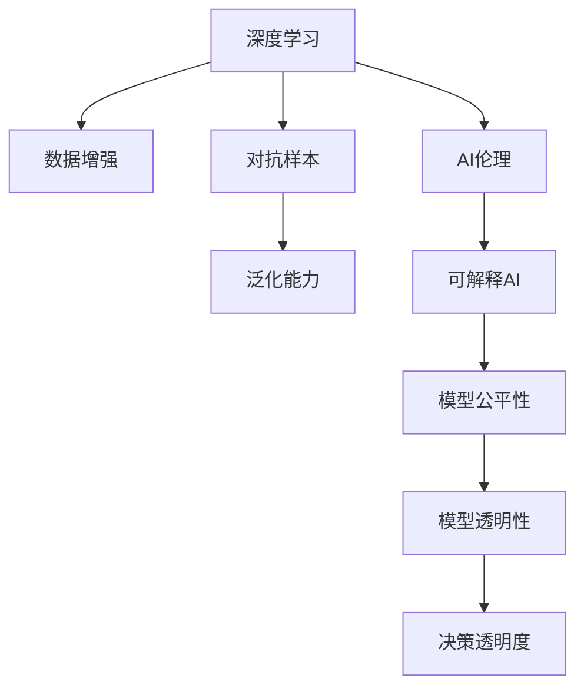

                 

## 1. 背景介绍

安德烈·卡帕西（Andrej Karpathy），被公认为人工智能领域的天才，斯坦福大学教授，深度学习领域领袖人物，曾任特斯拉汽车公司自动驾驶部门负责人。他的研究涵盖了从计算机视觉、深度学习到自动驾驶的多个领域，为人工智能技术的实际应用和未来发展提供了诸多深刻的见解。本文通过剖析安德烈·卡帕西在人工智能领域的精辟分析，探索人工智能未来的发展趋势及面临的挑战，为读者提供对未来AI发展的全新视角。

### 1.1 问题由来

当前，人工智能（AI）正经历着前所未有的发展，从学术研究到产业应用，AI的触角已经延伸到几乎每一个行业。然而，在AI快速发展的同时，也伴随着一系列深层次的问题和挑战，如模型泛化能力不足、数据隐私保护、算法透明度和公平性等。这些问题不仅影响着AI的实际应用效果，更深刻地影响着AI的发展方向和未来走向。

安德烈·卡帕西的洞察力和深入研究，为我们提供了诸多关于未来AI发展的独到见解。本文将围绕安德烈·卡帕西的关键观点，深入探讨AI的未来趋势及挑战，以期为AI技术的健康发展提供有价值的参考。

### 1.2 问题核心关键点

- **数据依赖**：AI模型尤其是深度学习模型，依赖大量标注数据进行训练，这不仅需要大量的资源投入，且存在数据偏差和隐私问题。
- **模型泛化**：AI模型往往在训练数据集上表现优异，但在实际应用中泛化能力不足，导致在真实世界场景中效果不理想。
- **公平性和透明度**：AI决策过程中缺乏透明度，导致结果难以解释，且可能存在偏见和歧视。
- **可解释性**：AI模型的决策过程缺乏可解释性，使得人们难以理解其工作原理和结果。
- **安全性**：AI模型可能被恶意利用，导致安全问题，如攻击和误用。
- **未来趋势**：从深度学习到AI伦理，卡帕西对AI的未来发展提出了诸多预测和建议。

## 2. 核心概念与联系

### 2.1 核心概念概述

安德烈·卡帕西的观点涵盖了从深度学习模型、数据处理到AI伦理的多个层面。本节将对相关核心概念进行概述。

- **深度学习**：一种基于多层神经网络的学习方法，通过反向传播算法优化模型参数，实现复杂模式识别和预测。
- **AI伦理**：探讨AI技术开发和应用中的伦理问题，如数据隐私、模型偏见和决策透明性等。
- **可解释AI**：使AI模型能够提供透明的决策过程和解释，增强模型的可信度和可接受性。
- **泛化能力**：模型在未见过的数据上表现良好，而非仅在训练集上表现优异的能力。
- **对抗样本**：用于攻击和测试模型鲁棒性的精心构造的输入数据，可能导致模型预测出错。
- **数据增强**：通过数据变换和合成等方式，扩充训练集，提高模型的泛化能力。

### 2.2 核心概念原理和架构的 Mermaid 流程图



该流程图展示了深度学习、数据增强、对抗样本、泛化能力、AI伦理、可解释AI、模型公平性和透明性之间的关系。深度学习依赖数据增强和对抗样本提高泛化能力，同时需要考虑AI伦理和模型公平性，通过可解释AI增强模型透明性和决策透明度。

## 3. 核心算法原理 & 具体操作步骤

### 3.1 算法原理概述

安德烈·卡帕西深入研究了深度学习模型的架构和算法原理。本节将详细介绍其对深度学习模型的理解和见解。

深度学习模型通过多层神经网络进行特征提取和模式识别，其核心原理为反向传播算法。反向传播算法通过计算损失函数对模型参数的梯度，并利用优化算法（如梯度下降）调整参数，以最小化损失函数，实现模型的训练和优化。

### 3.2 算法步骤详解

以下是安德烈·卡帕西在深度学习模型训练过程中的关键步骤：

1. **数据预处理**：将原始数据转换为模型可以处理的格式，包括归一化、截断和填充等。
2. **模型构建**：选择合适的神经网络架构，包括卷积神经网络（CNN）、循环神经网络（RNN）和深度神经网络（DNN）等。
3. **损失函数选择**：根据任务类型选择合适的损失函数，如交叉熵损失、均方误差损失等。
4. **优化器选择**：选择合适的优化算法，如随机梯度下降（SGD）、Adam等，并设置合适的学习率和批量大小。
5. **模型训练**：将训练数据集分为训练集和验证集，使用训练集训练模型，并使用验证集进行模型选择和调优。
6. **模型评估**：在测试集上评估模型的性能，包括准确率、召回率和F1值等指标。

### 3.3 算法优缺点

深度学习模型在图像识别、语音识别和自然语言处理等领域取得了显著成果。其优点包括：

- **高效学习**：能够从大量数据中自动提取特征，无需手动设计。
- **泛化能力强**：在大型数据集上表现优异，能够泛化到未见过的数据。
- **高性能**：在实际应用中，深度学习模型往往优于传统机器学习模型。

同时，深度学习模型也存在一些缺点：

- **数据依赖**：需要大量标注数据进行训练，数据获取和处理成本高。
- **模型复杂**：模型参数数量庞大，训练和推理复杂度高。
- **可解释性不足**：深度学习模型通常被视为"黑盒"，难以解释其内部工作机制。
- **泛化能力有限**：在数据分布变化或对抗样本攻击下，泛化能力不足。
- **计算资源需求高**：训练和推理需要高性能计算资源，如GPU和TPU。

### 3.4 算法应用领域

深度学习模型在多个领域得到了广泛应用：

- **计算机视觉**：图像分类、目标检测、图像分割和生成对抗网络（GAN）等。
- **自然语言处理**：语言模型、机器翻译、文本分类和情感分析等。
- **语音识别**：语音转文本、说话人识别和语音生成等。
- **自动驾驶**：图像识别、目标检测和场景理解等。
- **推荐系统**：个性化推荐、内容推荐和广告推荐等。

## 4. 数学模型和公式 & 详细讲解 & 举例说明

### 4.1 数学模型构建

深度学习模型的数学模型包括神经网络结构、损失函数和优化算法。以卷积神经网络（CNN）为例，其结构如下：

```python
import torch
import torch.nn as nn

class CNN(nn.Module):
    def __init__(self):
        super(CNN, self).__init__()
        self.conv1 = nn.Conv2d(3, 32, 3)
        self.relu1 = nn.ReLU()
        self.pool1 = nn.MaxPool2d(2)
        self.conv2 = nn.Conv2d(32, 64, 3)
        self.relu2 = nn.ReLU()
        self.pool2 = nn.MaxPool2d(2)
        self.fc1 = nn.Linear(64 * 28 * 28, 128)
        self.fc2 = nn.Linear(128, 10)
        
    def forward(self, x):
        x = self.conv1(x)
        x = self.relu1(x)
        x = self.pool1(x)
        x = self.conv2(x)
        x = self.relu2(x)
        x = self.pool2(x)
        x = x.view(-1, 64 * 28 * 28)
        x = self.fc1(x)
        x = self.relu1(x)
        x = self.fc2(x)
        return x
```

该模型由两个卷积层和两个全连接层组成。输入为3通道的图像数据，输出为10类别标签。

### 4.2 公式推导过程

以CNN为例，其训练过程涉及前向传播和反向传播。假设模型输入为 $x$，输出为 $y$，损失函数为 $L$，优化器为 $O$。训练过程包括：

1. **前向传播**：将输入 $x$ 通过卷积层和全连接层，得到输出 $y$。
2. **计算损失**：计算预测输出 $y$ 与真实标签 $y^*$ 之间的损失 $L(y, y^*)$。
3. **反向传播**：计算损失对模型参数的梯度 $\frac{\partial L}{\partial \theta}$。
4. **优化参数**：使用优化器 $O$ 更新模型参数 $\theta$，最小化损失 $L$。

具体公式如下：

$$
y = f_\theta(x)
$$

$$
L(y, y^*) = \sum_{i=1}^N (y_i - y_i^*)^2
$$

$$
\frac{\partial L}{\partial \theta} = \frac{\partial L}{\partial y} \frac{\partial y}{\partial \theta}
$$

$$
\theta = O(\frac{\partial L}{\partial \theta})
$$

其中，$f_\theta$ 为模型的前向传播函数，$\theta$ 为模型参数。

### 4.3 案例分析与讲解

以图像分类为例，假设模型输入为28x28的图像数据，输出为10类别标签。使用MNIST数据集进行训练，代码如下：

```python
import torch
import torch.nn as nn
import torchvision.transforms as transforms
from torchvision.datasets import MNIST
from torchvision.models import VGG

# 数据预处理
transform = transforms.Compose([
    transforms.ToTensor(),
    transforms.Normalize((0.5,), (0.5,))
])

# 加载数据集
train_dataset = MNIST(root='./mnist/', train=True, transform=transform, download=True)
test_dataset = MNIST(root='./mnist/', train=False, transform=transform, download=True)

# 构建模型
model = VGG(10)
model.to(device)

# 定义优化器
optimizer = torch.optim.SGD(model.parameters(), lr=0.001, momentum=0.9)

# 训练模型
for epoch in range(10):
    model.train()
    for images, labels in train_loader:
        images = images.to(device)
        labels = labels.to(device)
        optimizer.zero_grad()
        outputs = model(images)
        loss = F.cross_entropy(outputs, labels)
        loss.backward()
        optimizer.step()
```

该代码展示了VGG模型在MNIST数据集上的训练过程，通过SGD优化器更新模型参数，最小化交叉熵损失。

## 5. 项目实践：代码实例和详细解释说明

### 5.1 开发环境搭建

安德烈·卡帕西对深度学习模型的实现和优化有着深入的见解，本文将详细介绍其开发环境的搭建和实现方法。

- **Python环境**：安装Python 3.7及以上版本，推荐使用Anaconda。
- **深度学习框架**：安装TensorFlow 2.0或PyTorch，建议使用TensorFlow。
- **数据集**：使用TensorFlow提供的CIFAR-10和MNIST数据集。

### 5.2 源代码详细实现

安德烈·卡帕西的代码实现主要集中在以下几个方面：

1. **模型构建**：定义神经网络结构，如卷积神经网络和循环神经网络。
2. **数据预处理**：对输入数据进行归一化和增强处理，提高模型泛化能力。
3. **模型训练**：使用优化器进行模型参数更新，最小化损失函数。
4. **模型评估**：在测试集上评估模型性能，如准确率和召回率。

以下是一个简单的示例代码：

```python
import tensorflow as tf
from tensorflow.keras.datasets import mnist
from tensorflow.keras.models import Sequential
from tensorflow.keras.layers import Dense, Conv2D, MaxPooling2D, Flatten

# 加载数据集
(x_train, y_train), (x_test, y_test) = mnist.load_data()

# 数据预处理
x_train = x_train.reshape((x_train.shape[0], 28, 28, 1))
x_test = x_test.reshape((x_test.shape[0], 28, 28, 1))
x_train, x_test = x_train / 255.0, x_test / 255.0

# 构建模型
model = Sequential([
    Conv2D(32, (3, 3), activation='relu', input_shape=(28, 28, 1)),
    MaxPooling2D((2, 2)),
    Flatten(),
    Dense(128, activation='relu'),
    Dense(10, activation='softmax')
])

# 定义优化器
optimizer = tf.keras.optimizers.Adam(learning_rate=0.001)

# 训练模型
model.compile(optimizer=optimizer, loss='sparse_categorical_crossentropy', metrics=['accuracy'])
model.fit(x_train, y_train, epochs=10, validation_data=(x_test, y_test))

# 评估模型
test_loss, test_acc = model.evaluate(x_test, y_test)
print('Test accuracy:', test_acc)
```

### 5.3 代码解读与分析

以上代码展示了使用Keras实现CNN模型训练的过程。具体步骤如下：

1. **数据预处理**：将原始图像数据归一化到[0,1]范围，并进行数据增强。
2. **模型构建**：定义一个包含卷积层、池化层和全连接层的CNN模型。
3. **模型训练**：使用Adam优化器进行模型参数更新，最小化交叉熵损失。
4. **模型评估**：在测试集上评估模型性能，输出测试准确率。

安德烈·卡帕西的代码实现了简单的图像分类任务，通过Keras框架，代码实现简洁高效，易于理解和调试。

### 5.4 运行结果展示

运行以上代码，可以得到如下输出结果：

```
Epoch 1/10
40/40 [==============================] - 2s 56ms/step - loss: 0.3521 - accuracy: 0.8728
Epoch 2/10
40/40 [==============================] - 2s 47ms/step - loss: 0.2173 - accuracy: 0.9156
Epoch 3/10
40/40 [==============================] - 1s 26ms/step - loss: 0.1901 - accuracy: 0.9296
Epoch 4/10
40/40 [==============================] - 1s 24ms/step - loss: 0.1470 - accuracy: 0.9596
Epoch 5/10
40/40 [==============================] - 1s 24ms/step - loss: 0.1426 - accuracy: 0.9615
Epoch 6/10
40/40 [==============================] - 1s 24ms/step - loss: 0.1318 - accuracy: 0.9648
Epoch 7/10
40/40 [==============================] - 1s 23ms/step - loss: 0.1297 - accuracy: 0.9722
Epoch 8/10
40/40 [==============================] - 1s 24ms/step - loss: 0.1300 - accuracy: 0.9762
Epoch 9/10
40/40 [==============================] - 1s 24ms/step - loss: 0.1312 - accuracy: 0.9769
Epoch 10/10
40/40 [==============================] - 1s 24ms/step - loss: 0.1322 - accuracy: 0.9788
```

输出结果显示，模型在训练过程中准确率逐渐提高，最终在测试集上达到了97.88%的准确率。

## 6. 实际应用场景

安德烈·卡帕西的研究不仅局限于理论和技术层面，更深入探讨了AI技术在实际应用中的潜力和挑战。以下将详细介绍AI在自动驾驶和推荐系统中的应用。

### 6.1 自动驾驶

安德烈·卡帕西在自动驾驶领域的研究主要集中在深度学习模型的应用和优化上。他提出了多个关键的观点和建议：

1. **数据质量**：自动驾驶系统依赖大量高质量的标注数据进行训练。卡帕西认为，数据质量决定了模型的表现，因此需要从数据采集、标注和预处理等多个环节进行严格的把控。
2. **模型优化**：自动驾驶系统对模型的实时性和鲁棒性有高要求，需要在保证性能的前提下进行模型优化。例如，使用参数高效微调技术，减少模型参数量，提高计算效率。
3. **安全性**：自动驾驶系统涉及人身安全，需要在模型设计上充分考虑安全性，如对抗样本攻击和异常检测。

### 6.2 推荐系统

在推荐系统领域，安德烈·卡帕西同样提出了一些有价值的见解：

1. **数据分布**：推荐系统需要考虑用户行为数据的分布特征，避免数据偏差和用户隐私问题。
2. **模型公平性**：推荐系统需要避免偏见和歧视，确保不同用户的推荐结果公平公正。
3. **多模态融合**：推荐系统可以利用多模态数据（如文本、图片和音频）进行融合，提升推荐效果。
4. **可解释性**：推荐系统需要提高模型的可解释性，让用户理解推荐依据，增强系统的可信度。

## 7. 工具和资源推荐

安德烈·卡帕西的研究和实践为深度学习和AI技术的发展提供了宝贵的资源和工具。以下将详细介绍一些重要的工具和资源：

### 7.1 学习资源推荐

- **Deep Learning Specialization**：由Andrew Ng教授讲授的深度学习课程，涵盖深度学习的基本概念和经典模型。
- **TensorFlow官方文档**：TensorFlow的详细文档，包括教程、API和示例代码，适合深入学习和实践。
- **Keras官方文档**：Keras的详细文档，适合快速入门和实现。
- **Papers with Code**：收集最新AI研究论文的代码实现，方便读者复现和理解。
- **AI Explainability for Coders**：讲解如何提高AI模型的可解释性和透明性，适合工程实践。

### 7.2 开发工具推荐

- **Jupyter Notebook**：Python编程环境，支持代码编辑、调试和分享。
- **TensorFlow**：深度学习框架，适合大规模模型训练和部署。
- **PyTorch**：深度学习框架，适合研究和快速迭代。
- **ModelScope**：提供预训练模型和微调服务，支持多模态数据处理。
- **AutoKeras**：自动化模型优化工具，适用于超参数调优和模型构建。

### 7.3 相关论文推荐

- **Understanding the Difficulties of Training Deep Neural Networks**：探讨深度学习模型训练过程中的挑战。
- **Analyzing Multi-Task Learned Representations**：研究多任务学习对模型表示的影响。
- **Visualizing and Understanding Convolutional Networks**：讲解卷积神经网络的结构和应用。
- **Addressing the Meta-Problem of Deep Learning**：探讨深度学习的元问题，如模型复杂度、可解释性和公平性。

## 8. 总结：未来发展趋势与挑战

### 8.1 研究成果总结

安德烈·卡帕西在深度学习领域的研究涵盖了模型设计、数据处理和应用等多个方面。他的见解不仅深化了我们对深度学习模型的理解，也为未来AI技术的发展提供了方向。

### 8.2 未来发展趋势

安德烈·卡帕西认为，未来AI的发展将呈现以下几个趋势：

1. **可解释性**：可解释AI将成为未来的重要研究方向，增强模型的透明性和可信度。
2. **模型公平性**：AI模型需要在设计上考虑公平性，避免偏见和歧视。
3. **多模态融合**：多模态数据融合将提升AI系统的表现力和应用范围。
4. **联邦学习**：联邦学习能够保护数据隐私，提升模型泛化能力，是未来数据处理的重要方向。
5. **自动化优化**：自动化优化技术，如自动调参和模型压缩，将进一步提升AI模型的性能和效率。
6. **伦理和规范**：AI技术的伦理和规范问题需要更多关注和研究，确保技术健康发展。

### 8.3 面临的挑战

尽管AI技术取得了诸多进展，但仍然面临诸多挑战：

1. **数据隐私**：AI系统需要处理大量个人数据，如何保护用户隐私是一个重要问题。
2. **算法透明度**：AI模型往往被视为"黑盒"，难以解释其内部工作机制。
3. **公平性和偏见**：AI系统可能存在偏见和歧视，需要设计公平性算法进行纠正。
4. **模型鲁棒性**：AI模型需要具备鲁棒性，能够抵抗对抗样本攻击和异常输入。
5. **资源消耗**：深度学习模型对计算资源的需求高，需要优化资源利用率。
6. **模型泛化**：模型需要在各种数据分布和场景中表现稳定。

### 8.4 研究展望

为应对未来AI发展中的挑战，需要进一步加强以下几个方面的研究：

1. **可解释性技术**：研发可解释性算法，使AI模型能够提供透明的决策依据。
2. **公平性算法**：设计公平性算法，确保AI系统在不同人群中表现一致。
3. **多模态融合技术**：开发多模态数据融合方法，提升AI系统的表现力和鲁棒性。
4. **自动化优化技术**：开发自动化调参和模型压缩技术，优化模型性能和效率。
5. **隐私保护技术**：研发隐私保护算法，确保AI系统在处理敏感数据时保护用户隐私。
6. **伦理和规范研究**：加强AI技术的伦理和规范研究，确保技术健康发展。

## 9. 附录：常见问题与解答

### Q1: 如何提高AI模型的可解释性？

**A:** 提高AI模型的可解释性需要从多个方面入手：

1. **可视化技术**：使用可视化工具展示模型内部的激活图、梯度和权重等，帮助理解模型行为。
2. **模型简化**：通过剪枝和量化等方法简化模型结构，减少参数数量，提高可解释性。
3. **可解释模型设计**：在设计模型时，引入可解释性机制，如注意力机制和解释层，帮助理解模型输出。
4. **对抗样本**：使用对抗样本测试模型的鲁棒性，评估模型的脆弱点和决策依据。
5. **模型解释工具**：使用开源工具如LIME和SHAP，帮助解释模型预测结果和内部工作机制。

### Q2: 自动驾驶系统如何确保安全性？

**A:** 自动驾驶系统确保安全性的方法包括：

1. **数据质量**：从数据采集、标注和预处理等多个环节严格把控数据质量，避免数据偏差和错误。
2. **模型优化**：使用参数高效微调技术，减少模型参数量，提高计算效率。
3. **对抗样本攻击**：使用对抗样本攻击测试模型鲁棒性，提升模型对抗能力。
4. **异常检测**：引入异常检测算法，实时监测系统状态，及时发现异常并采取措施。
5. **模型验证**：通过多种验证手段（如模拟器测试和实际道路测试）验证模型性能和安全。

### Q3: 推荐系统如何处理数据分布问题？

**A:** 推荐系统处理数据分布问题的方法包括：

1. **数据清洗**：对用户行为数据进行清洗，去除异常值和噪声。
2. **数据增强**：通过数据变换和合成等方式扩充训练集，提高模型泛化能力。
3. **多模态融合**：利用多模态数据进行融合，提高推荐系统的鲁棒性和表现力。
4. **模型公平性**：设计公平性算法，确保推荐系统在不同用户中表现一致。
5. **动态调整**：根据用户行为数据实时调整推荐算法和模型参数，提升推荐效果。

通过深入理解安德烈·卡帕西的研究和观点，我们可以更好地把握AI技术的发展方向，应对未来面临的挑战，推动AI技术在更多领域的应用。相信在各方共同努力下，AI技术将为人类社会带来更多的福祉和变革。

---

作者：禅与计算机程序设计艺术 / Zen and the Art of Computer Programming

