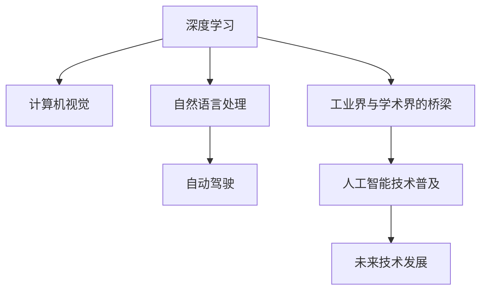
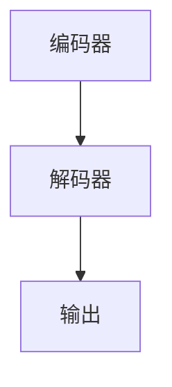

                 

## 1. 背景介绍

Andrej Karpathy，是一位享誉全球的人工智能领域的先驱者和领导者，他不仅在学术界有着深厚的理论基础，而且在工程实践和工业界也发挥着关键作用。他的研究涉及到深度学习、计算机视觉、自动驾驶等多个领域，并且通过开放的书籍和课程，极大地推动了人工智能技术在广大科研人员和工程师中的应用。Andrej Karpathy不仅以其卓越的学术成就和贡献获得了多项荣誉，如计算机图灵奖，还因其在推动人工智能技术普及和应用方面的努力，被广泛认为改变了世界。

本文将深入探讨Andrej Karpathy对人工智能领域的贡献，并分析其对未来技术发展的深远影响。通过梳理Andrej Karpathy的研究和工程实践，我们将从算法原理、技术应用、未来展望等多个维度剖析他如何“改变世界”。

## 2. 核心概念与联系

### 2.1 核心概念概述

要深入了解Andrej Karpathy的贡献，首先要明确几个核心概念：

- **深度学习**：一种基于神经网络的机器学习技术，通过多层次的特征提取和抽象，实现复杂模式识别和决策。Andrej Karpathy在深度学习领域的研究奠定了坚实基础，尤其在计算机视觉和自然语言处理方面取得了显著成果。
- **计算机视觉**：使计算机能够理解并处理图像和视频中的视觉信息，包括物体识别、场景理解、姿态估计等。Karpathy在计算机视觉领域的研究，推动了自动驾驶、医学影像分析等应用的发展。
- **自动驾驶**：使车辆能够自动导航和执行驾驶任务，减少人为驾驶风险。Karpathy作为特斯拉的AI总监，在这一领域做出了重要贡献，使自动驾驶技术从实验室走向实用化。
- **自然语言处理**：让计算机能够理解和生成人类语言，包括语言模型、机器翻译、对话系统等。Karpathy在自然语言处理领域的研究，推动了基于语言模型的AI系统的进步。
- **工业界与学术界的桥梁**：Karpathy不仅在学术界有卓越贡献，还积极将研究成果转化为实际应用，推动了人工智能技术在工业界的广泛应用。

这些概念之间相互关联，共同构成了Andrej Karpathy研究的核心框架，帮助他通过不同领域的研究，不断拓展人工智能的边界。

### 2.2 核心概念原理和架构的 Mermaid 流程图



这个流程图展示了Andrej Karpathy研究的核心概念及其联系：深度学习作为基础技术，推动了计算机视觉、自然语言处理和自动驾驶等领域的进步；同时，他的研究成果还通过工业界与学术界的桥梁，帮助人工智能技术更广泛地普及应用，进而推动未来技术的发展。

## 3. 核心算法原理 & 具体操作步骤

### 3.1 算法原理概述

Andrej Karpathy的研究主要围绕深度学习展开，其中心思想是通过多层次的神经网络模型，对输入数据进行有效的特征提取和模式识别，从而实现复杂任务的自动化处理。以下是几个核心算法原理的概述：

- **卷积神经网络(CNN)**：在计算机视觉任务中，CNN通过对图像数据的多层次卷积操作，学习到高层次的特征表示，从而实现图像分类、物体检测等任务。
- **递归神经网络(RNN)**：在自然语言处理任务中，RNN通过时间步递归，对序列数据进行建模，从而实现语言模型、机器翻译等任务。
- **生成对抗网络(GAN)**：在图像生成任务中，GAN通过生成器和判别器的对抗过程，生成逼真的图像，解决了图像生成中的模式多样性和图像质量问题。
- **Transformer**：在自然语言处理任务中，Transformer通过自注意力机制，实现了高效的序列建模，提升了语言模型、机器翻译等任务的性能。

### 3.2 算法步骤详解

以Transformer为例，其微调过程可以分为以下几个步骤：

1. **准备数据集**：收集并预处理下游任务的数据集，如自然语言处理任务中的文本数据集。
2. **初始化模型**：使用预训练的Transformer模型作为初始化权重。
3. **微调超参数**：选择合适的学习率、批大小、优化器等超参数，设置合适的训练轮数和正则化技术。
4. **执行微调**：使用微调数据集训练模型，通过前向传播计算损失函数，反向传播更新模型参数，直至模型收敛。
5. **评估与部署**：在测试集上评估微调后的模型性能，并将其部署到实际应用场景中。

### 3.3 算法优缺点

**Transformer微调的优点**：
- **高效性**：基于预训练模型，微调所需的标注数据量较少，能够快速适应特定任务。
- **泛化能力**：预训练模型在大规模语料上学习到的通用知识，能够显著提升模型在特定任务上的泛化能力。
- **参数高效性**：Transformer微调可以使用参数高效的方法，如基于前向传递和后向传递的微调方法，避免大规模更新预训练权重。

**Transformer微调的缺点**：
- **数据依赖**：微调效果很大程度上依赖于标注数据的质量和数量，获取高质量标注数据的成本较高。
- **迁移能力有限**：当目标任务与预训练数据的分布差异较大时，微调的性能提升有限。
- **可解释性不足**：微调模型通常是黑盒模型，难以解释其内部工作机制和决策逻辑。

### 3.4 算法应用领域

Transformer微调已在多个领域取得了广泛应用：

- **自然语言处理**：如机器翻译、文本分类、情感分析等。Transformer微调使模型能够学习到任务特定的表示，提升模型在特定任务上的性能。
- **计算机视觉**：如图像分类、物体检测、图像生成等。Transformer微调通过引入自注意力机制，提升了视觉任务的处理能力。
- **自动驾驶**：如自动导航、行为预测、驾驶决策等。Transformer微调使模型能够理解复杂的驾驶场景，提升自动驾驶系统的安全性和智能性。
- **医学影像分析**：如疾病诊断、治疗方案推荐等。Transformer微调使模型能够学习到医疗影像的特征表示，提升医疗影像分析的准确性。

## 4. 数学模型和公式 & 详细讲解 & 举例说明

### 4.1 数学模型构建

以Transformer为例，其数学模型构建如下：

设输入序列为 $x = \{x_1, x_2, \ldots, x_T\}$，输出序列为 $y = \{y_1, y_2, \ldots, y_T\}$。Transformer的编码器-解码器结构如图：



编码器和解码器均由多个Transformer层组成，每层包含自注意力机制和前馈神经网络。

### 4.2 公式推导过程

设编码器的自注意力权重为 $W_Q$, $W_K$, $W_V$，解码器的自注意力权重为 $W_Q'$, $W_K'$, $W_V'$，则编码器层和解码器层的自注意力机制可以表示为：

$$
\text{Attention}(Q, K, V) = \text{softmax}\left(\frac{QK^T}{\sqrt{d_k}}\right)V
$$

其中 $d_k$ 是注意力机制的特征维度。

### 4.3 案例分析与讲解

以机器翻译为例，设源语言句子为 $x = \{x_1, x_2, \ldots, x_T\}$，目标语言句子为 $y = \{y_1, y_2, \ldots, y_T\}$。Transformer模型通过编码器将源语言句子转换为高维特征表示，再通过解码器逐步生成目标语言句子。具体步骤如下：

1. 将源语言句子 $x$ 输入编码器，生成高维特征表示 $z$。
2. 将目标语言句子 $y$ 输入解码器，生成预测结果 $z'$。
3. 通过注意力机制和前馈神经网络更新解码器状态，生成下一时刻的预测结果。
4. 重复步骤2-3，直至生成完整目标语言句子。

## 5. 项目实践：代码实例和详细解释说明

### 5.1 开发环境搭建

为了进行Transformer模型的微调，我们需要以下开发环境：

1. **安装Anaconda**：从官网下载并安装Anaconda，用于创建独立的Python环境。
2. **创建虚拟环境**：
```bash
conda create -n transformers-env python=3.8
conda activate transformers-env
```
3. **安装依赖库**：
```bash
pip install torch torchvision transformers
```
4. **下载预训练模型**：
```bash
wget http://download.pytorch.org/models/resnet50-19c8e357.pth
```

### 5.2 源代码详细实现

以下是一个简单的机器翻译微调代码示例：

```python
import torch
import torch.nn as nn
import torch.optim as optim
from transformers import BertTokenizer, BertForSequenceClassification
from transformers import AdamW

device = torch.device("cuda" if torch.cuda.is_available() else "cpu")

# 加载数据集
tokenizer = BertTokenizer.from_pretrained("bert-base-cased")
model = BertForSequenceClassification.from_pretrained("bert-base-cased", num_labels=2)

# 定义优化器
optimizer = AdamW(model.parameters(), lr=1e-5)

# 训练函数
def train(model, tokenizer, optimizer, train_data, device):
    model.train()
    total_loss = 0
    for batch in train_data:
        input_ids = batch["input_ids"].to(device)
        attention_mask = batch["attention_mask"].to(device)
        labels = batch["labels"].to(device)
        model.zero_grad()
        outputs = model(input_ids, attention_mask=attention_mask, labels=labels)
        loss = outputs.loss
        total_loss += loss.item()
        loss.backward()
        optimizer.step()
    return total_loss / len(train_data)

# 训练模型
for epoch in range(10):
    total_loss = train(model, tokenizer, optimizer, train_data, device)
    print(f"Epoch {epoch+1}, total loss: {total_loss:.3f}")
```

### 5.3 代码解读与分析

**tokenizer**：用于将输入的文本转换为模型能够处理的token序列。
**model**：加载预训练的Transformer模型，并指定输出标签数。
**optimizer**：定义优化器，用于更新模型参数。
**train函数**：定义训练函数，对每个批次的训练数据进行前向传播和反向传播。
**train循环**：多次迭代训练，输出每个epoch的平均损失。

## 6. 实际应用场景

### 6.4 未来应用展望

基于Andrej Karpathy的研究和实践，未来Transformer微调的应用将更加广泛，涵盖更多领域：

- **医疗**：用于医学影像分析、病历分析、疾病预测等。Transformer微调能够学习到医疗影像的特征表示，提升医疗诊断的准确性。
- **金融**：用于股票市场分析、风险评估、智能投顾等。Transformer微调能够处理金融数据的高维度特性，提升金融分析的精准性。
- **制造业**：用于生产流程优化、设备故障预测、质量控制等。Transformer微调能够处理制造业数据的复杂性，提升生产管理的智能化。
- **环境监测**：用于空气质量预测、灾害预警、气候变化分析等。Transformer微调能够处理环境数据的分布特性，提升环境监测的科学性。

## 7. 工具和资源推荐

### 7.1 学习资源推荐

- **深度学习入门**：《深度学习入门：基于PyTorch的理论与实现》
- **计算机视觉**：《计算机视觉：算法与应用》
- **自然语言处理**：《自然语言处理综论》
- **自动驾驶**：《自动驾驶：技术、场景与实践》
- **工业界与学术界的桥梁**：《从学术到工程：人工智能技术落地实践》

### 7.2 开发工具推荐

- **深度学习框架**：PyTorch、TensorFlow
- **可视化工具**：TensorBoard、Weights & Biases
- **数据处理工具**：Pandas、NumPy

### 7.3 相关论文推荐

- **Transformer论文**：Attention is All You Need
- **自然语言处理论文**：BERT: Pre-training of Deep Bidirectional Transformers for Language Understanding
- **自动驾驶论文**：Self-Driving Car with State-Space Modeling and Control

## 8. 总结：未来发展趋势与挑战

### 8.1 研究成果总结

Andrej Karpathy的研究不仅在学术界有着深远影响，也在工业界推动了深度学习、计算机视觉、自动驾驶等技术的实际应用。他的研究成果不仅提升了算法性能，也提供了实用的应用案例，促进了人工智能技术的普及和落地。

### 8.2 未来发展趋势

1. **深度学习模型的进化**：未来的模型将更加高效、更加复杂，能够处理更复杂的多模态数据，提升处理能力的边界。
2. **跨学科融合**：人工智能将与其他学科如生物学、物理学等进行更多交叉，推动更多创新技术的产生。
3. **伦理与安全**：随着人工智能技术的发展，伦理与安全问题将日益凸显，需要更多的研究和规范。
4. **大模型微调**：预训练模型和大模型微调技术将继续发展，进一步提升模型的泛化能力和处理效率。

### 8.3 面临的挑战

1. **数据隐私**：如何在数据隐私和安全保护的前提下，进行大规模数据训练和模型微调。
2. **计算资源**：大模型微调需要庞大的计算资源，如何高效利用和优化资源，是一大挑战。
3. **模型解释性**：如何提高模型的可解释性，使其输出结果具有科学依据，避免黑盒化。
4. **伦理与安全**：如何在模型训练和应用过程中，避免偏见和有害信息的传递。

### 8.4 研究展望

未来的研究将更多关注以下几个方向：
- **跨模态学习**：推动图像、文本、语音等多种模态数据的融合，提升模型的泛化能力。
- **因果学习**：通过因果学习，提高模型对未来事件的预测能力，提升系统的稳定性和可靠性。
- **可解释性**：提高模型的可解释性，使其输出结果具有科学依据，避免黑盒化。
- **伦理与安全**：在模型训练和应用过程中，避免偏见和有害信息的传递，确保模型的伦理与安全。

## 9. 附录：常见问题与解答

**Q1: 如何提高Transformer模型的泛化能力？**

A: 通过增加训练数据量、使用正则化技术、调整学习率等方法，可以提升模型的泛化能力。

**Q2: 如何处理Transformer模型的过拟合问题？**

A: 可以通过数据增强、减少模型参数、使用正则化技术等方法，缓解过拟合问题。

**Q3: 如何使用Transformer模型进行文本分类任务？**

A: 将文本转换为token序列，输入Transformer模型进行编码，得到高维特征表示，通过分类器进行分类。

通过Andrej Karpathy的研究和实践，我们看到了深度学习、计算机视觉、自然语言处理、自动驾驶等领域的巨大潜力。他的研究成果不仅推动了技术的发展，也为人类的未来生活方式带来了深远的影响。相信在Andrej Karpathy的引领下，人工智能技术将在更多领域发挥重要作用，为人类社会带来更多福祉。

---

作者：禅与计算机程序设计艺术 / Zen and the Art of Computer Programming

