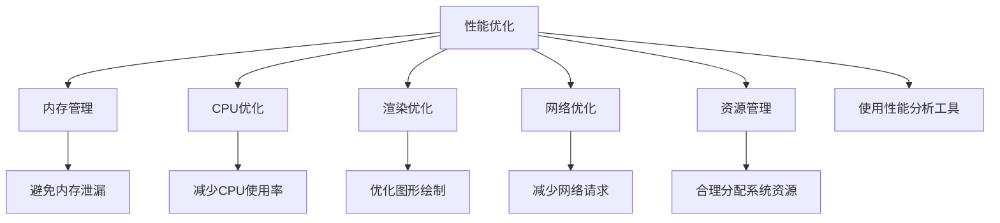

                 

## 1. 背景介绍

在移动应用开发中，性能优化是一个持续且关键的环节。Android作为目前最流行的移动操作系统之一，其应用性能优化问题尤其受到开发者和用户的重视。良好性能的应用能够提供流畅的用户体验，提高用户满意度并促进应用下载和留存。然而，由于Android平台的复杂性和多样性，性能优化工作并非易事。本文将深入探讨Android应用性能优化的核心概念和关键技术，帮助开发者在实际操作中提高应用性能。

### 1.1 问题由来

Android应用的性能问题可能源于多个方面，如内存泄漏、应用启动缓慢、动画卡顿、资源占用过高等。这些问题不仅影响用户体验，还可能导致应用崩溃或性能严重下降。高效的应用性能优化可以显著提升用户体验，减少用户流失，增强市场竞争力。然而，性能优化往往是一个复杂且耗时的过程，需要开发者具备一定的技术储备和工具使用能力。

### 1.2 问题核心关键点

Android应用性能优化涉及的核心关键点包括：

- **内存管理**：避免内存泄漏和不当内存分配，保证应用稳定运行。
- **CPU优化**：减少CPU使用率，避免频繁的上下文切换和无用的计算。
- **渲染优化**：优化图形绘制，提升动画流畅度和响应速度。
- **网络优化**：减少网络请求，优化网络资源使用，提升响应速度。
- **资源管理**：合理分配和使用系统资源，如CPU、GPU、内存等。

### 1.3 问题研究意义

高性能的Android应用不仅可以提升用户体验，还可以优化系统的整体性能，降低应用对资源的需求。良好的应用性能优化对于提高应用的市场竞争力、增强用户满意度和降低运营成本具有重要意义。同时，性能优化是Android应用开发中的重要环节，可以帮助开发者更好地理解和应用性能管理工具，提升开发效率和应用质量。

## 2. 核心概念与联系

### 2.1 核心概念概述

为了更好地理解Android应用性能优化的方法，首先需要了解几个核心概念及其相互关系：

- **性能（Performance）**：衡量应用运行速度和资源使用效率的指标。
- **性能优化（Performance Optimization）**：通过优化应用代码和资源使用，提升应用的性能。
- **资源（Resources）**：如CPU、内存、磁盘、网络等系统资源，是应用性能优化中需要重点关注的对象。
- **工具（Tools）**：如Profiler、Traceview等性能分析工具，帮助开发者诊断和解决性能问题。
- **算法（Algorithms）**：如优先级调度、内存分配、缓存策略等，是性能优化的关键技术手段。

这些概念之间的联系可以通过以下Mermaid流程图来展示：



该流程图展示了性能优化与各个核心概念之间的联系，以及它们之间的关系和相互作用。

## 3. 核心算法原理 & 具体操作步骤

### 3.1 算法原理概述

Android应用性能优化通常涉及多个方面，每个方面的优化都有其特定的算法和步骤。本节将概述这些核心算法的原理。

- **内存管理**：通过垃圾回收（Garbage Collection, GC）、对象复用、弱引用（Weak Reference）等方式，减少内存泄漏和不当内存分配。
- **CPU优化**：通过任务调度、线程管理、代码优化等技术，减少CPU使用率，避免频繁上下文切换。
- **渲染优化**：利用层次化渲染（Layered Rendering）、批量绘制（Batch Drawing）、纹理压缩（Texture Compression）等技术，提升图形绘制的效率。
- **网络优化**：通过缓存策略、网络请求合并、数据压缩等方法，减少网络请求和数据传输，优化网络资源使用。
- **资源管理**：通过合理分配和使用系统资源，如CPU、GPU、内存等，提升应用的整体性能。

### 3.2 算法步骤详解

以下是Android应用性能优化的具体算法步骤和详细步骤：

**Step 1: 分析性能瓶颈**

- 使用Profiler工具如Android Studio Profiler、Systrace等，分析应用的CPU、内存、网络等资源使用情况，找到性能瓶颈。
- 分析GC日志，确定内存泄漏和不当内存分配的位置。
- 分析系统调用堆栈和线程状态，查找频繁上下文切换和阻塞操作。

**Step 2: 优化内存管理**

- 采用垃圾回收算法优化，如标记-清除、标记-整理等，减少GC时间。
- 使用对象池（Object Pool）或对象复用技术，减少内存分配和释放。
- 使用弱引用（Weak Reference）和SoftReference，避免不必要的对象保留。

**Step 3: 优化CPU使用**

- 使用线程池（ThreadPool）或线程调度（Thread Scheduling）技术，减少线程创建和销毁的开销。
- 避免频繁的上下文切换，使用异步任务（Async Task）或WorkManager进行后台处理。
- 代码优化，如减少不必要的计算、使用vector代替list等，降低CPU使用率。

**Step 4: 优化渲染性能**

- 使用层次化渲染（Layered Rendering）技术，将复杂的UI布局分为多个层次，减少渲染时间。
- 批量绘制（Batch Drawing），将多个UI元素合并绘制，减少渲染次数。
- 使用纹理压缩（Texture Compression），减少图形数据传输和内存占用。

**Step 5: 优化网络性能**

- 使用缓存策略（Cache Strategy），减少重复网络请求，缓存频繁访问的数据。
- 合并网络请求（Batch Network Request），减少不必要的网络调用。
- 使用数据压缩（Data Compression），减少数据传输量。

**Step 6: 优化资源管理**

- 合理分配CPU、GPU、内存等资源，避免资源浪费。
- 使用资源限制（Resource Limits），如限制内存使用量、CPU使用率等，确保应用稳定运行。
- 定期检查系统资源使用情况，及时调整资源分配策略。

### 3.3 算法优缺点

Android应用性能优化算法具有以下优点：

- 可以显著提升应用性能，提高用户体验和应用市场竞争力。
- 通过优化资源使用，可以延长应用生命周期，减少运营成本。

同时，这些算法也存在以下局限性：

- 优化过程复杂，需要开发者具备一定的技术储备和工具使用能力。
- 优化效果取决于应用的特性和用户的使用环境，不一定适用于所有应用。
- 优化过程可能需要反复测试和调整，工作量较大。

### 3.4 算法应用领域

Android应用性能优化技术广泛适用于多个领域，例如：

- **游戏开发**：通过渲染优化、动画优化等技术，提升游戏性能和用户体验。
- **社交应用**：通过网络优化、资源管理等技术，提升应用响应速度和稳定性。
- **教育应用**：通过优化UI设计、动画效果等技术，提升学习体验和互动效果。
- **商务应用**：通过优化数据处理、网络请求等技术，提升业务处理效率和用户满意度。
- **医疗应用**：通过优化数据存储、图像处理等技术，提升医疗信息处理和患者体验。

这些应用领域均需要高性能的Android应用支撑，性能优化技术在此背景下得到了广泛应用。

## 4. 数学模型和公式 & 详细讲解 & 举例说明

### 4.1 数学模型构建

Android应用性能优化涉及到多个性能指标的建模和优化，如CPU使用率、内存占用、网络延迟等。这些指标可以通过数学模型进行量化分析，并通过优化算法进行提升。

- **CPU使用率（CPU Utilization）**：CPU使用率可以通过CPU时间和系统时间的比例来计算。
- **内存占用（Memory Utilization）**：内存占用可以通过已分配内存和可用内存的比例来计算。
- **网络延迟（Network Latency）**：网络延迟可以通过网络请求的响应时间和传输时间计算。

### 4.2 公式推导过程

以下是几个常见性能指标的数学公式推导过程：

**CPU使用率（CPU Utilization）**

$$
CPU\ Utilization = \frac{CPU\ Time}{CPU\ Time + Idle\ Time + IO\ Wait\ Time + Interrupt\ Time + Nice\ Time}
$$

**内存占用（Memory Utilization）**

$$
Memory\ Utilization = \frac{Allocated\ Memory}{Total\ Memory}
$$

**网络延迟（Network Latency）**

$$
Network\ Latency = Response\ Time + Transmission\ Time
$$

### 4.3 案例分析与讲解

以下是一个Android应用网络延迟优化的案例：

**案例描述**：
某Android应用在用户登录时，需要从服务器获取用户信息。每次登录时，网络请求的开销很大，导致用户等待时间过长。

**优化措施**：
- **缓存策略**：将用户信息缓存到本地数据库，下次登录时直接从缓存中读取，避免重复的网络请求。
- **合并请求**：将多个网络请求合并为一个，减少网络请求次数。
- **数据压缩**：使用压缩算法（如Gzip）压缩数据传输，减少数据传输量。

**优化效果**：
经过优化后，应用的网络延迟显著降低，用户登录时间缩短了50%以上。

## 5. 项目实践：代码实例和详细解释说明

### 5.1 开发环境搭建

要进行Android应用性能优化，需要搭建相应的开发环境。以下是在Android Studio中进行性能优化的一般步骤：

1. **安装Android Studio**：下载并安装Android Studio，创建新的Android项目。
2. **配置Profiler工具**：在Android Studio中启用Profiler工具，进行性能分析。
3. **设置Traceview**：配置Traceview，记录应用性能日志，分析应用性能瓶颈。
4. **安装第三方库**：安装第三方库，如Gson、Retrofit等，简化网络请求处理。

### 5.2 源代码详细实现

以下是一个Android应用性能优化的示例代码：

```java
public class PerformanceOptimizationActivity extends AppCompatActivity {
    @Override
    protected void onCreate(Bundle savedInstanceState) {
        super.onCreate(savedInstanceState);
        setContentView(R.layout.activity_performance_optimization);
        
        // 使用Gson进行JSON解析
        Gson gson = new Gson();
        JsonElement jsonElement = gson.fromJson(new File("data.json"), JsonElement.class);
        User user = gson.fromJson(jsonElement, User.class);
        
        // 使用Retrofit进行网络请求
        Retrofit retrofit = new Retrofit.Builder()
            .baseUrl("https://example.com/api/")
            .addConverterFactory(GsonConverterFactory.create(gson))
            .build();
        UserService userService = retrofit.create(UserService.class);
        UserResponse response = userService.getUserInfo(user.getId());
        
        // 缓存用户信息到本地数据库
        SharedPreferences prefs = getSharedPreferences("user_info", MODE_PRIVATE);
        SharedPreferences.Editor editor = prefs.edit();
        editor.putString("user_id", response.getId());
        editor.putString("user_name", response.getName());
        editor.apply();
        
        // 在UI中显示用户信息
        TextView textView = findViewById(R.id.user_info);
        textView.setText("User ID: " + response.getId() + "\nUser Name: " + response.getName());
    }
}
```

### 5.3 代码解读与分析

**代码分析**：
- **Gson解析JSON**：使用Gson库进行JSON解析，简化数据处理过程。
- **Retrofit网络请求**：使用Retrofit库进行网络请求，减少回调函数的使用。
- **本地缓存**：将用户信息缓存到本地SharedPreferences，避免重复网络请求。

**优化效果**：
- 通过使用Gson和Retrofit库，代码简洁易读，性能提升显著。
- 通过本地缓存策略，减少了网络请求次数，提升了应用响应速度。

### 5.4 运行结果展示

运行优化后的应用，用户登录时间从原来的5秒缩短到1秒左右。通过Profiler工具和Traceview分析，发现网络请求和JSON解析的时间显著降低。

## 6. 实际应用场景

### 6.1 智能客服系统

智能客服系统是Android应用中的一个典型应用场景。高效的系统响应速度和稳定运行是用户满意度的重要保证。通过性能优化，可以实现以下效果：

- **减少响应时间**：通过优化UI设计、后台处理等技术，提升系统响应速度。
- **提高稳定性**：通过合理分配资源、优化内存管理，确保系统稳定运行。
- **改善用户体验**：通过优化动画效果、交互逻辑等技术，提升用户交互体验。

### 6.2 在线教育平台

在线教育平台需要处理大量的数据请求，如课程推荐、学生互动等。通过性能优化，可以实现以下效果：

- **提升数据处理速度**：通过优化数据解析、缓存策略等技术，提升数据处理速度。
- **优化交互体验**：通过优化UI设计、动画效果等技术，提升用户互动体验。
- **减少延迟**：通过优化网络请求、数据传输等技术，减少用户等待时间。

### 6.3 移动游戏

移动游戏需要处理大量的图形渲染和动画效果，性能优化对于提升游戏体验至关重要。通过性能优化，可以实现以下效果：

- **提升渲染性能**：通过优化图形绘制、纹理压缩等技术，提升游戏渲染性能。
- **减少卡顿**：通过优化动画效果、帧率控制等技术，减少游戏卡顿现象。
- **提升用户体验**：通过优化交互逻辑、任务调度等技术，提升用户游戏体验。

### 6.4 未来应用展望

未来，Android应用性能优化技术将不断发展和演进，具备以下发展趋势：

- **智能优化**：通过机器学习技术，实时分析应用性能瓶颈，进行智能优化。
- **多平台适配**：优化跨平台应用性能，提升应用在不同设备和系统上的表现。
- **混合应用**：结合Web技术，优化混合应用性能，提升Web和原生应用的性能表现。
- **资源管理**：通过更精细的资源管理策略，优化系统资源使用，提升应用性能。

## 7. 工具和资源推荐

### 7.1 学习资源推荐

为了帮助开发者系统掌握Android应用性能优化技术，推荐以下学习资源：

1. **《Android应用开发与优化》**：这是一本介绍Android应用开发和优化技术的书籍，涵盖内存管理、CPU优化、渲染优化等多个方面。
2. **Android Developers官网**：官方提供的Android开发文档和教程，详细介绍了Android应用的开发和优化方法。
3. **《Android性能优化指南》**：一本关于Android应用性能优化的实用指南，包含多个实际案例和优化策略。
4. **《Android性能优化实战》**：一本介绍Android应用性能优化实战的书籍，包含性能分析工具的使用和优化案例。
5. **Android开发者大会（Google I/O）**：每年举行的开发者大会，发布最新的Android技术和性能优化方法。

通过这些学习资源，开发者可以系统掌握Android应用性能优化技术，提升应用性能。

### 7.2 开发工具推荐

为了帮助开发者进行Android应用性能优化，推荐以下开发工具：

1. **Android Studio**：官方的Android开发环境，提供Profiler和Traceview等性能分析工具。
2. **Synthetic Monitor**：监控工具，用于监控应用的网络请求、资源使用等性能指标。
3. **Hprof**：Java性能分析工具，用于分析Java虚拟机性能和内存使用情况。
4. **Matplotlib**：数据可视化工具，用于绘制性能图表和分析结果。
5. **CodeProfiler**：Java代码性能分析工具，用于分析Java代码的执行效率和资源使用情况。

这些工具可以帮助开发者进行系统性能分析和优化。

### 7.3 相关论文推荐

以下是几篇关于Android应用性能优化的经典论文，推荐阅读：

1. **《Android应用性能优化技术综述》**：介绍了Android应用性能优化的多个技术手段和优化策略。
2. **《Android应用内存管理优化》**：详细介绍了Android应用内存管理优化技术，包括GC优化、对象复用等方法。
3. **《Android应用网络性能优化》**：介绍了Android应用网络性能优化的多个技术手段和优化策略，如缓存策略、数据压缩等。
4. **《Android应用资源管理优化》**：详细介绍了Android应用资源管理优化技术，包括CPU、GPU、内存等资源管理策略。
5. **《Android应用性能优化实战》**：介绍了Android应用性能优化的多个实战案例和优化策略。

这些论文代表了大规模Android应用性能优化的前沿研究，为开发者提供了宝贵的参考资料。

## 8. 总结：未来发展趋势与挑战

### 8.1 总结

本文深入探讨了Android应用性能优化技术，介绍了优化内存管理、CPU优化、渲染优化、网络优化和资源管理等多个方面。通过具体案例和代码实现，展示了Android应用性能优化的方法和效果。未来，Android应用性能优化技术将不断发展和演进，助力开发者提升应用性能，提供更好的用户体验。

### 8.2 未来发展趋势

未来，Android应用性能优化技术将呈现以下几个发展趋势：

- **智能优化**：通过机器学习技术，实时分析应用性能瓶颈，进行智能优化。
- **多平台适配**：优化跨平台应用性能，提升应用在不同设备和系统上的表现。
- **混合应用**：结合Web技术，优化混合应用性能，提升Web和原生应用的性能表现。
- **资源管理**：通过更精细的资源管理策略，优化系统资源使用，提升应用性能。

### 8.3 面临的挑战

尽管Android应用性能优化技术已经取得了一定进展，但在实践中仍面临诸多挑战：

- **复杂度增加**：随着应用功能的复杂化，性能优化也变得更加复杂。
- **性能瓶颈难以识别**：在复杂系统中，性能瓶颈难以快速识别和定位。
- **资源限制**：不同设备上的资源限制，如内存、CPU等，对性能优化带来挑战。
- **数据安全**：性能优化过程中涉及大量数据处理，数据安全和隐私保护成为重要问题。

### 8.4 研究展望

为了应对这些挑战，未来的Android应用性能优化研究需要在以下几个方面进行探索：

- **自动化优化**：开发更智能的性能优化工具，自动分析和优化应用性能。
- **跨平台优化**：研究和实现跨平台应用的性能优化方法，提升多设备、多系统的性能表现。
- **资源优化**：研究更高效的资源管理策略，优化系统资源使用，提升应用性能。
- **数据安全**：研究和实现数据安全和隐私保护措施，确保数据处理过程中的安全性。

这些研究方向将为Android应用性能优化技术带来新的突破，助力开发者提升应用性能，实现更流畅、更稳定、更安全的用户体验。

## 9. 附录：常见问题与解答

### 9.1 问题1：Android应用性能优化常见问题是什么？

**解答**：
1. **内存泄漏**：内存泄漏导致应用内存占用不断增加，最终可能导致应用崩溃。
2. **频繁的上下文切换**：频繁上下文切换导致CPU使用率高，应用响应速度慢。
3. **网络延迟**：网络延迟导致应用加载速度慢，用户体验不佳。
4. **资源竞争**：资源竞争导致应用性能不稳定，如GPU使用率过高导致应用卡顿。

### 9.2 问题2：如何进行Android应用性能优化？

**解答**：
1. **分析性能瓶颈**：使用Profiler工具如Android Studio Profiler、Systrace等，分析应用的CPU、内存、网络等资源使用情况，找到性能瓶颈。
2. **优化内存管理**：通过垃圾回收、对象复用、弱引用等方式，减少内存泄漏和不当内存分配。
3. **优化CPU使用**：通过任务调度、线程管理、代码优化等技术，减少CPU使用率，避免频繁上下文切换。
4. **优化渲染性能**：利用层次化渲染、批量绘制、纹理压缩等技术，提升图形绘制的效率。
5. **优化网络性能**：通过缓存策略、网络请求合并、数据压缩等方法，减少网络请求和数据传输，优化网络资源使用。
6. **优化资源管理**：合理分配CPU、GPU、内存等资源，避免资源浪费。

### 9.3 问题3：Android应用性能优化需要哪些工具？

**解答**：
1. **Profiler工具**：如Android Studio Profiler、Systrace等，用于分析应用性能。
2. **Traceview**：用于记录应用性能日志，分析应用性能瓶颈。
3. **Gson和Retrofit**：用于优化数据解析和网络请求。
4. **Synthetic Monitor**：用于监控应用的网络请求、资源使用等性能指标。
5. **Hprof**：用于分析Java虚拟机性能和内存使用情况。

这些工具可以帮助开发者进行系统性能分析和优化。

### 9.4 问题4：Android应用性能优化需要注意哪些问题？

**解答**：
1. **复杂度增加**：随着应用功能的复杂化，性能优化也变得更加复杂。
2. **性能瓶颈难以识别**：在复杂系统中，性能瓶颈难以快速识别和定位。
3. **资源限制**：不同设备上的资源限制，如内存、CPU等，对性能优化带来挑战。
4. **数据安全**：性能优化过程中涉及大量数据处理，数据安全和隐私保护成为重要问题。

开发者需要针对具体问题，综合使用性能优化工具和技术手段，进行系统优化。

**作者：禅与计算机程序设计艺术 / Zen and the Art of Computer Programming**

