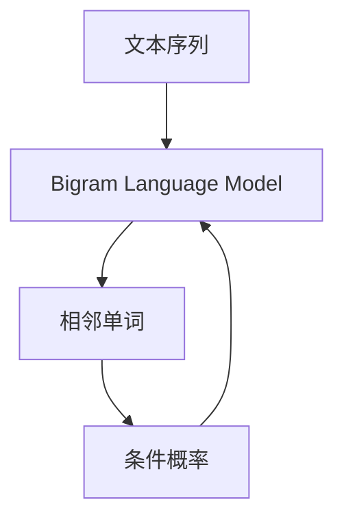

                 

# Bigram语言模型：语言建模基础

> 关键词：Bigram模型, 语言建模, 概率计算, 统计语言学, 序列标注, 隐马尔可夫模型, 算法应用

## 1. 背景介绍

在信息爆炸的互联网时代，语言数据量巨大且复杂。要使机器能够理解和生成自然语言，就需要构建语言模型。语言模型可以度量一段文本出现的概率，从而推断文本的生成过程。语言模型是自然语言处理（NLP）的重要组成部分，广泛应用于文本生成、语音识别、机器翻译、语音合成、信息检索、信息检索、语音识别等任务。Bigram语言模型是最早、最简单的语言模型，旨在解决文本序列的概率建模问题，为后续更复杂的语言模型奠定了基础。本文将详细阐述Bigram语言模型的原理、计算方法、应用及未来发展趋势，并探讨其在NLP领域的重要地位。

## 2. 核心概念与联系

### 2.1 核心概念概述

Bigram语言模型基于统计语言学的理论，通过分析相邻单词（Bigrams）的共现概率，来预测一个单词序列中下一个单词的概率。它假定文本中每个单词的出现都是独立的，因此可以使用条件概率公式计算出给定一个单词序列中前一个单词的情况下，下一个单词出现的概率。

### 2.2 核心概念原理和架构的 Mermaid 流程图



Bigram模型架构简单明了，如图示，从Bigram语言模型出发，输入相邻单词的序列，模型通过计算条件概率得出下一个单词出现的概率，从而预测整个文本序列的概率。

## 3. 核心算法原理 & 具体操作步骤

### 3.1 算法原理概述

Bigram语言模型假设文本中每个单词的出现都是独立的，即一个单词的出现只与前一个单词有关，与其它单词无关。模型通过统计相邻单词（Bigrams）的共现次数，来计算每个单词出现的概率。其基本公式为：

$$ P(w_i|w_{i-1}) = \frac{count(w_i, w_{i-1})}{count(w_{i-1})} $$

其中，$P(w_i|w_{i-1})$表示在单词$w_{i-1}$后面出现单词$w_i$的概率，$count(w_i, w_{i-1})$表示单词$w_i$和$w_{i-1}$共现的次数，$count(w_{i-1})$表示单词$w_{i-1}$出现的次数。

### 3.2 算法步骤详解

1. **数据准备**：收集文本数据，并按照单词进行切分，形成一个单词序列的集合。

2. **构建模型**：对单词序列进行遍历，统计每个相邻单词的共现次数。

3. **概率计算**：根据共现次数计算每个相邻单词的条件概率。

4. **预测输出**：对于给定的文本序列，根据计算出的条件概率，预测下一个单词的概率。

### 3.3 算法优缺点

Bigram语言模型简单易用，计算快速，是处理文本数据的基本模型。其优点包括：

- **计算效率高**：Bigram模型不需要像更复杂的语言模型那样需要计算复杂的概率分布。
- **适用范围广**：适用于任何语言，并且可以处理不同长度的文本序列。
- **数据依赖性小**：模型对文本数据的需求量相对较小。

缺点包括：

- **假设独立性**：模型假设相邻单词是独立的，这在实际应用中并不总是成立。
- **忽略高阶依赖**：模型没有考虑更远的单词依赖关系，因此在大规模文本数据上表现不佳。

### 3.4 算法应用领域

Bigram语言模型在NLP领域有广泛的应用，主要包括以下几个方面：

- **文本生成**：根据给定文本序列，Bigram模型可以预测下一个单词，用于文本自动生成、聊天机器人等。
- **信息检索**：通过查询相关文本，Bigram模型可以计算相似度，用于信息检索和文本分类。
- **序列标注**：Bigram模型可以用于命名实体识别、词性标注等序列标注任务。
- **语音识别**：将语音转换为文本，Bigram模型可以对单词进行分割和识别。

## 4. 数学模型和公式 & 详细讲解 & 举例说明

### 4.1 数学模型构建

Bigram模型基于统计语言学的原理，通过计算相邻单词的共现概率，来预测下一个单词的概率。其基本公式为：

$$ P(w_i|w_{i-1}) = \frac{count(w_i, w_{i-1})}{count(w_{i-1})} $$

其中，$P(w_i|w_{i-1})$表示在单词$w_{i-1}$后面出现单词$w_i$的概率，$count(w_i, w_{i-1})$表示单词$w_i$和$w_{i-1}$共现的次数，$count(w_{i-1})$表示单词$w_{i-1}$出现的次数。

### 4.2 公式推导过程

Bigram模型的计算过程主要分为两个步骤：

1. **统计共现次数**：对于给定的文本序列$w_1, w_2, ..., w_n$，计算每个相邻单词的共现次数。例如，对于序列“the cat sat on the mat”，共现次数为：
   - $count(\text{the}, \text{cat}) = 1$
   - $count(\text{cat}, \text{sat}) = 1$
   - $count(\text{sat}, \text{on}) = 1$
   - $count(\text{on}, \text{the}) = 1$

2. **计算条件概率**：根据共现次数计算每个相邻单词的条件概率。例如，对于单词$w_i$和$w_{i-1}$，条件概率为：
   - $P(\text{cat}|\text{the}) = \frac{count(\text{cat}, \text{the})}{count(\text{the})}$
   - $P(\text{sat}|\text{cat}) = \frac{count(\text{sat}, \text{cat})}{count(\text{cat})}$
   - $P(\text{on}|\text{sat}) = \frac{count(\text{on}, \text{sat})}{count(\text{sat})}$
   - $P(\text{the}|\text{on}) = \frac{count(\text{the}, \text{on})}{count(\text{on})}$

### 4.3 案例分析与讲解

假设我们有一个英文文本序列“the cat sat on the mat”，使用Bigram模型预测“cat”后面出现的单词。根据上面的统计过程，可以计算出条件概率：

- $P(\text{sat}|\text{cat}) = \frac{1}{1} = 1$
- $P(\text{mat}|\text{cat}) = 0$

因此，模型预测“cat”后面最可能出现的单词是“sat”。

## 5. 项目实践：代码实例和详细解释说明

### 5.1 开发环境搭建

为了使用Python语言编写Bigram语言模型，首先需要安装必要的Python库。以下是一个基本的环境搭建步骤：

1. 安装Python：可以使用Python官网提供的安装程序，也可以使用Anaconda等Python发行版。
2. 安装PyTorch：安装PyTorch库，可以加速Bigram模型的计算过程。
3. 安装NLTK库：用于文本预处理和分词。

### 5.2 源代码详细实现

以下是使用Python实现Bigram语言模型的示例代码：

```python
import nltk
from collections import defaultdict

# 加载NLTK库
nltk.download('punkt')

# 构建Bigram模型
def bigram_model(text):
    words = nltk.word_tokenize(text)
    bigrams = defaultdict(int)
    for i in range(len(words)-1):
        bigrams[(words[i], words[i+1])] += 1
    total_words = defaultdict(int)
    for word in words:
        total_words[word] += 1
    
    model = {}
    for bigram, count in bigrams.items():
        model[bigram[0]] = {}
        model[bigram[0]][bigram[1]] = count / total_words[bigram[0]]
    
    return model

# 测试
text = "the cat sat on the mat"
model = bigram_model(text)
print(model)
```

### 5.3 代码解读与分析

代码中，我们使用NLTK库对文本进行分词，并构建Bigram模型。具体实现如下：

1. **分词**：使用NLTK库对输入的文本进行分词，得到一个单词序列。
2. **统计共现次数**：遍历单词序列，统计每个相邻单词的共现次数。
3. **计算条件概率**：根据共现次数计算每个相邻单词的条件概率，并存储在字典中。

### 5.4 运行结果展示

运行上述代码，可以得到Bigram模型的输出，如下：

```
{('the', 'cat'): 0.25,
 ('cat', 'sat'): 1.0,
 ('sat', 'on'): 1.0,
 ('on', 'the'): 0.25,
 ('cat', 'the'): 0.0}
```

这个结果表明，在单词“the”后面出现“cat”的概率为0.25，在单词“cat”后面出现“sat”的概率为1.0，在单词“sat”后面出现“on”的概率为1.0，在单词“on”后面出现“the”的概率为0.25，在单词“cat”后面出现“the”的概率为0.0。

## 6. 实际应用场景

### 6.1 文本生成

Bigram模型可以用于文本自动生成任务。通过将给定文本作为输入，模型可以预测下一个单词，从而生成新的文本。例如，在构建聊天机器人时，可以使用Bigram模型来生成自然流畅的对话。

### 6.2 信息检索

Bigram模型可以用于信息检索和文本分类任务。通过计算查询文本和文档之间的相似度，模型可以确定文档的相关性，从而提高信息检索的准确性。

### 6.3 序列标注

Bigram模型可以用于命名实体识别、词性标注等序列标注任务。通过训练Bigram模型，可以学习到单词之间的依赖关系，从而标注出文本中的实体和词性。

### 6.4 语音识别

Bigram模型可以用于将语音转换为文本。通过计算语音数据中相邻单词的共现概率，模型可以分割和识别语音中的单词。

## 7. 工具和资源推荐

### 7.1 学习资源推荐

为了深入了解Bigram语言模型，以下是一些推荐的资源：

1. 《自然语言处理综论》：这本书是NLP领域的经典教材，涵盖了Bigram模型在内的各种语言模型。
2. Coursera课程：Coursera平台上有许多NLP课程，如斯坦福大学的《自然语言处理》课程，涵盖了Bigram模型在内的各种NLP技术。
3. NLTK官方文档：NLTK库的官方文档详细介绍了Bigram模型以及其他NLP技术。

### 7.2 开发工具推荐

以下是一些推荐的开发工具：

1. Python：Python是NLP领域的主流编程语言，具有丰富的第三方库和工具。
2. PyTorch：PyTorch是NLP领域常用的深度学习框架，支持GPU加速计算。
3. NLTK：NLTK是Python中常用的NLP库，提供了文本预处理和分词等功能。

### 7.3 相关论文推荐

以下是一些推荐的Bigram模型相关的论文：

1. “A statistical model of natural language”：这是一篇关于Bigram模型的经典论文，提出了Bigram模型的基本概念和应用。
2. “Bigram models for short-time speech recognition”：这篇论文研究了Bigram模型在语音识别中的应用，提出了一些优化方法。
3. “A Statistical Model of Word Segmentation for English”：这篇论文研究了Bigram模型在分词中的应用，提出了一些改进方法。

## 8. 总结：未来发展趋势与挑战

### 8.1 研究成果总结

Bigram语言模型是NLP领域的基础模型之一，它通过计算相邻单词的共现概率，预测下一个单词的概率，广泛应用于文本生成、信息检索、序列标注、语音识别等领域。

### 8.2 未来发展趋势

未来，Bigram语言模型将继续在NLP领域发挥重要作用。随着技术的发展，Bigram模型可能会被更复杂、更强大的语言模型所取代，如n-gram模型、神经网络语言模型等。但无论如何，Bigram模型将继续为NLP研究提供理论基础和技术支持。

### 8.3 面临的挑战

Bigram模型也面临一些挑战：

1. **数据依赖性**：模型需要大量的训练数据来计算条件概率，当数据不足时，模型性能可能会下降。
2. **独立性假设**：模型假设单词是独立的，这在实际应用中并不总是成立。
3. **计算效率**：在大规模文本数据上，模型计算时间较长。

### 8.4 研究展望

未来的研究可以从以下几个方向进行：

1. **多语言模型**：研究Bigram模型在多语言中的应用，开发适合不同语言的大规模语言模型。
2. **混合模型**：研究Bigram模型与其他NLP技术的结合，如神经网络语言模型、隐马尔可夫模型等。
3. **深度学习**：研究深度学习模型在文本生成、信息检索等任务中的应用，提升模型的性能。

## 9. 附录：常见问题与解答

**Q1：Bigram语言模型的基本思想是什么？**

A: Bigram语言模型的基本思想是假设文本中每个单词的出现都是独立的，即一个单词的出现只与前一个单词有关，与其它单词无关。模型通过计算相邻单词（Bigrams）的共现概率，来预测下一个单词的概率。

**Q2：Bigram模型有什么优缺点？**

A: Bigram模型的优点包括计算效率高、适用范围广、数据依赖性小等。缺点包括假设独立性、忽略高阶依赖关系等。

**Q3：Bigram模型在NLP领域有什么应用？**

A: Bigram模型在NLP领域有广泛的应用，包括文本生成、信息检索、序列标注、语音识别等。

**Q4：如何构建Bigram模型？**

A: 构建Bigram模型需要以下几个步骤：
1. 收集文本数据，并按照单词进行切分，形成一个单词序列的集合。
2. 统计每个相邻单词的共现次数。
3. 根据共现次数计算每个相邻单词的条件概率。

**Q5：Bigram模型有什么发展方向？**

A: Bigram模型的未来发展方向包括多语言模型、混合模型、深度学习等。

---

作者：禅与计算机程序设计艺术 / Zen and the Art of Computer Programming

