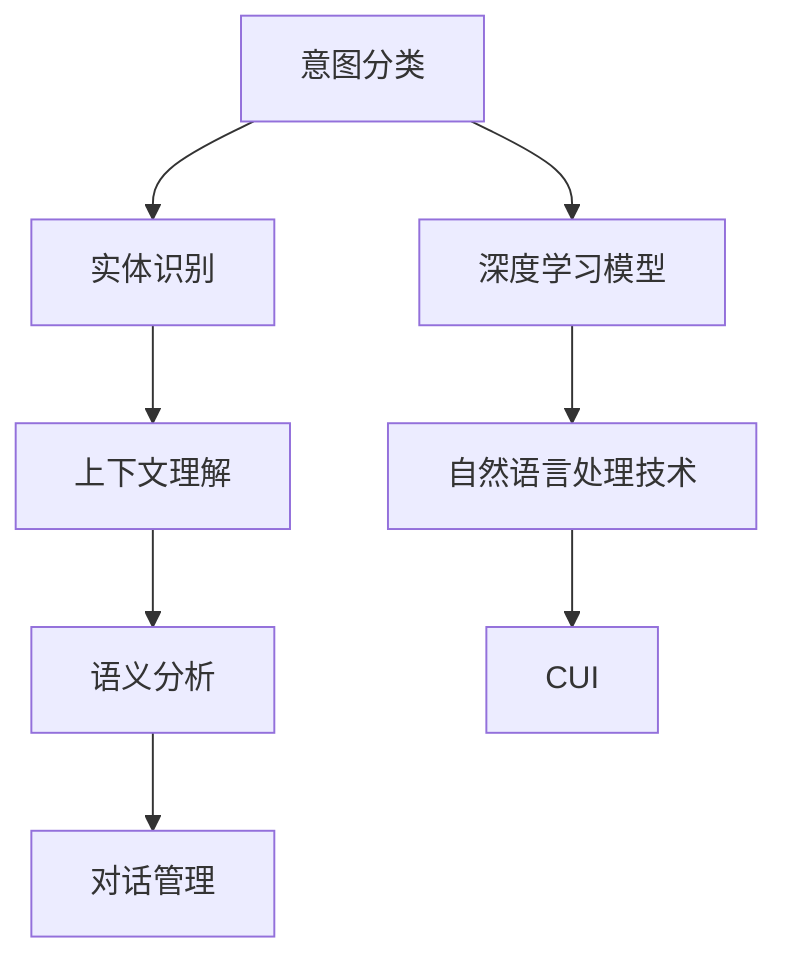

                 

# CUI的意图理解技术详细解析与应用

> 关键词：意图理解, 上下文理解, 语言模型, 自然语言处理(NLP), 用户意图, 用户对话

## 1. 背景介绍

### 1.1 问题由来

随着人工智能(AI)技术的迅猛发展，自然语言处理(Natural Language Processing, NLP)成为推动AI发展的重要力量。意图理解（CUI, Customer Intent Understanding）是NLP领域中的一个重要研究方向，旨在通过智能对话系统理解用户输入的自然语言语句，从而执行相应的操作或回答问题。对于聊天机器人、智能客服、智能助理等智能对话系统，准确理解用户的意图是提供高质量服务的基础。

然而，由于自然语言的多义性和模糊性，使得意图理解成为一项极具挑战性的任务。如何从用户的输入中提取出用户的真正意图，并保证理解的准确性和高效性，成为了NLP和AI研究者们关注的重点。

### 1.2 问题核心关键点

意图理解的目标是：在用户输入一段文本后，系统能够准确地识别出用户的意图，并根据意图执行相应的操作或回答问题。常见的意图包括查询、预约、投诉、评论等。

实现意图理解的技术包括：
- 意图分类（Intent Classification）：将用户输入分为不同的意图类别。
- 实体识别（Named Entity Recognition, NER）：从用户输入中提取出命名实体，如人名、地名、机构名等。
- 上下文理解（Contextual Understanding）：理解用户输入的前后文内容，以便更准确地识别意图。
- 语义分析（Semantic Analysis）：通过词向量、句向量等技术分析用户输入的语义信息，提高意图识别的准确性。
- 对话管理（Dialogue Management）：在对话中维持上下文一致性，避免信息丢失或混乱。

意图理解技术的应用场景广泛，涵盖了智能客服、智能家居、智能医疗等多个领域。通过意图理解，智能系统能够更好地理解用户的需求，从而提供更加个性化、高效的服务。

## 2. 核心概念与联系

### 2.1 核心概念概述

意图理解涉及到多个核心概念，这些概念之间相互关联，共同构成了意图理解系统的整体框架。

- **意图分类（Intent Classification）**：将用户输入分为不同的意图类别，如查询、预订、投诉等。
- **实体识别（Named Entity Recognition, NER）**：从用户输入中识别出人名、地名、机构名等命名实体。
- **上下文理解（Contextual Understanding）**：理解用户输入的前后文内容，以提高意图识别的准确性。
- **语义分析（Semantic Analysis）**：通过词向量、句向量等技术分析用户输入的语义信息。
- **对话管理（Dialogue Management）**：在对话中维持上下文一致性，避免信息丢失或混乱。

这些核心概念通过深度学习模型（如RNN、LSTM、Transformer等）和自然语言处理技术（如词向量、句向量、BERT等）进行联合应用，实现了意图理解的功能。

### 2.2 核心概念原理和架构的 Mermaid 流程图(Mermaid 流程节点中不要有括号、逗号等特殊字符)



以上流程图示意了意图理解系统的主要架构和技术路径，从意图分类开始，通过实体识别、上下文理解、语义分析等步骤，最终生成用户意图。

## 3. 核心算法原理 & 具体操作步骤

### 3.1 算法原理概述

意图理解的算法原理主要包括意图分类、实体识别、上下文理解、语义分析、对话管理等步骤。以下将详细介绍各个步骤的算法原理和具体操作步骤。

### 3.2 算法步骤详解

#### 3.2.1 意图分类

意图分类的目标是：将用户输入分为不同的意图类别，如查询、预订、投诉等。常见的算法包括基于规则的方法和基于机器学习的方法。

- **基于规则的方法**：通过设计一组规则，将输入文本与规则库中的规则进行匹配，以识别出意图。这种方法简单高效，但需要大量的人工标注和规则设计工作。
- **基于机器学习的方法**：使用分类器（如SVM、决策树、随机森林等）或神经网络（如CNN、RNN、LSTM等）对输入文本进行分类。这种方法需要大量的标注数据，但能够自动学习复杂特征，识别出更多的意图类别。

#### 3.2.2 实体识别

实体识别的目标是从用户输入中识别出人名、地名、机构名等命名实体。常见的算法包括基于规则的方法和基于机器学习的方法。

- **基于规则的方法**：通过设计一组规则，将输入文本与规则库中的规则进行匹配，以识别出命名实体。这种方法简单高效，但需要大量的人工标注和规则设计工作。
- **基于机器学习的方法**：使用分类器（如SVM、决策树、随机森林等）或神经网络（如CNN、RNN、LSTM等）对输入文本进行分类。这种方法需要大量的标注数据，但能够自动学习复杂特征，识别出更多的命名实体。

#### 3.2.3 上下文理解

上下文理解的目标是理解用户输入的前后文内容，以提高意图识别的准确性。常见的算法包括基于规则的方法和基于机器学习的方法。

- **基于规则的方法**：通过设计一组规则，将输入文本与规则库中的规则进行匹配，以理解上下文。这种方法简单高效，但需要大量的人工标注和规则设计工作。
- **基于机器学习的方法**：使用上下文表示模型（如BERT、GPT等）对输入文本进行编码，以理解上下文。这种方法需要大量的标注数据，但能够自动学习复杂的上下文关系，提高意图识别的准确性。

#### 3.2.4 语义分析

语义分析的目标是通过词向量、句向量等技术分析用户输入的语义信息。常见的算法包括基于词向量的方法和基于句向量的方法。

- **基于词向量的方法**：通过词向量模型（如Word2Vec、GloVe等）将输入文本转化为向量，以分析语义信息。这种方法简单高效，但无法处理复杂的语义关系。
- **基于句向量的方法**：通过句向量模型（如BERT、ELMO等）将输入文本转化为向量，以分析语义信息。这种方法能够自动学习复杂的语义关系，提高意图识别的准确性。

#### 3.2.5 对话管理

对话管理的目标是在对话中维持上下文一致性，避免信息丢失或混乱。常见的算法包括基于规则的方法和基于机器学习的方法。

- **基于规则的方法**：通过设计一组规则，将输入文本与规则库中的规则进行匹配，以维持上下文一致性。这种方法简单高效，但需要大量的人工标注和规则设计工作。
- **基于机器学习的方法**：使用对话管理模型（如RNN、LSTM等）对对话进行管理，以维持上下文一致性。这种方法需要大量的标注数据，但能够自动学习复杂的对话逻辑，提高对话质量。

### 3.3 算法优缺点

#### 3.3.1 优点

- **准确性高**：基于机器学习的方法能够自动学习复杂的特征，识别出更多的意图类别和命名实体。
- **鲁棒性强**：基于深度学习的方法具有较强的泛化能力，能够应对不同领域的意图理解任务。
- **可扩展性好**：深度学习模型具有较好的可扩展性，能够灵活地应用于各种意图理解场景。

#### 3.3.2 缺点

- **数据需求高**：基于机器学习的方法需要大量的标注数据，获取标注数据的成本较高。
- **计算量大**：基于深度学习的方法计算量大，对硬件资源的要求较高。
- **可解释性差**：深度学习模型往往是"黑盒"模型，难以解释其内部工作机制。

### 3.4 算法应用领域

意图理解技术已经在多个领域得到广泛应用，以下列举几个典型应用场景：

- **智能客服**：智能客服系统通过意图理解技术，能够准确地识别用户意图，提供个性化的服务，提升用户体验。
- **智能家居**：智能家居系统通过意图理解技术，能够理解用户的语音指令，实现自动化控制，提高生活质量。
- **智能医疗**：智能医疗系统通过意图理解技术，能够理解患者的症状描述，提供初步诊断建议，辅助医生诊疗。
- **智能金融**：智能金融系统通过意图理解技术，能够理解用户的交易意图，提供个性化的金融服务，提升用户满意度。

## 4. 数学模型和公式 & 详细讲解 & 举例说明

### 4.1 数学模型构建

意图理解的数学模型主要基于深度学习框架构建，以下以Transformer模型为例进行说明。

设用户输入为 $x = (x_1, x_2, ..., x_n)$，其中 $x_i$ 为输入序列中的第 $i$ 个单词，$n$ 为输入序列的长度。假设输入序列经过编码器编码后得到的向量表示为 $h = (h_1, h_2, ..., h_n)$，则意图分类模型可以表示为：

$$
p(y|x) = \frac{e^{z}}{\sum_k{e^{z_k}}}
$$

其中 $y$ 为意图类别，$z$ 为模型对输入序列的表示与意图类别之间的匹配度。通过softmax函数将匹配度转化为概率，选择匹配度最高的类别作为最终预测结果。

### 4.2 公式推导过程

#### 4.2.1 意图分类

意图分类的目标是将输入序列 $x$ 映射到意图类别 $y$，模型采用softmax函数对意图分类进行建模。假设模型为多层感知器（MLP），其输入为 $x$ 经过编码器得到的向量表示 $h$，输出为意图类别 $y$。模型的输出层可以表示为：

$$
\hat{y} = softmax(W_yh + b_y)
$$

其中 $W_y$ 和 $b_y$ 为模型参数，$h$ 为编码器输出的向量表示。意图分类的目标函数为交叉熵损失函数：

$$
\mathcal{L}_{class} = -\frac{1}{N}\sum_{i=1}^{N}(y_i \log \hat{y_i} + (1-y_i) \log (1-\hat{y_i}))
$$

其中 $y_i$ 为真实的意图类别，$\hat{y_i}$ 为模型预测的意图类别，$N$ 为样本数量。

#### 4.2.2 实体识别

实体识别的目标是从输入序列 $x$ 中识别出命名实体 $e$，模型采用序列标注模型进行建模。假设模型为CRF模型，其输入为 $x$ 经过编码器得到的向量表示 $h$，输出为命名实体序列 $e$。模型的输出层可以表示为：

$$
\hat{e} = CRF(h)
$$

其中 $CRF$ 为条件随机场，$h$ 为编码器输出的向量表示。实体识别的目标函数为交叉熵损失函数：

$$
\mathcal{L}_{ner} = -\frac{1}{N}\sum_{i=1}^{N}(\sum_k{y_{ik} \log \hat{y_{ik}} + (1-y_{ik}) \log (1-\hat{y_{ik}}))
$$

其中 $y_{ik}$ 为真实的命名实体序列的第 $i$ 个单词的第 $k$ 个标签，$\hat{y_{ik}}$ 为模型预测的命名实体序列的第 $i$ 个单词的第 $k$ 个标签，$N$ 为样本数量。

#### 4.2.3 上下文理解

上下文理解的模型采用Transformer模型进行建模，其输入为输入序列 $x$ 和上下文序列 $c$，输出为上下文表示 $z$。模型的编码器部分可以表示为：

$$
z = Transformer(x, c)
$$

其中 $Transformer$ 为Transformer模型，$x$ 为输入序列，$c$ 为上下文序列，$z$ 为上下文表示。上下文理解的模型结构如下图所示：


#### 4.2.4 语义分析

语义分析的模型采用BERT模型进行建模，其输入为输入序列 $x$，输出为句向量表示 $z$。模型的编码器部分可以表示为：

$$
z = BERT(x)
$$

其中 $BERT$ 为BERT模型，$x$ 为输入序列，$z$ 为句向量表示。语义分析的模型结构如下图所示：


#### 4.2.5 对话管理

对话管理的模型采用LSTM模型进行建模，其输入为对话历史 $d$ 和当前用户输入 $u$，输出为对话管理向量 $v$。模型的编码器部分可以表示为：

$$
v = LSTM(d, u)
$$

其中 $LSTM$ 为LSTM模型，$d$ 为对话历史，$u$ 为当前用户输入，$v$ 为对话管理向量。对话管理的模型结构如下图所示：


### 4.3 案例分析与讲解

#### 4.3.1 意图分类案例

假设有一个智能客服系统，其意图分类模型采用多层感知器（MLP）进行建模。该模型的输入为经过编码器编码后的向量表示 $h$，输出为意图类别 $y$。训练集为 $(x_1, y_1), (x_2, y_2), ..., (x_N, y_N)$。模型采用交叉熵损失函数进行训练，优化器为Adam。训练过程如下：

```python
import torch
import torch.nn as nn
import torch.optim as optim

# 定义多层感知器模型
class IntentClassifier(nn.Module):
    def __init__(self, input_size, hidden_size, output_size):
        super(IntentClassifier, self).__init__()
        self.fc1 = nn.Linear(input_size, hidden_size)
        self.fc2 = nn.Linear(hidden_size, output_size)
        self.softmax = nn.Softmax(dim=1)
        
    def forward(self, x):
        x = self.fc1(x)
        x = self.fc2(x)
        x = self.softmax(x)
        return x

# 定义交叉熵损失函数
criterion = nn.CrossEntropyLoss()

# 定义优化器
optimizer = optim.Adam(model.parameters(), lr=0.001)

# 定义训练过程
def train(model, train_loader, criterion, optimizer, num_epochs):
    for epoch in range(num_epochs):
        for batch in train_loader:
            inputs, labels = batch
            optimizer.zero_grad()
            outputs = model(inputs)
            loss = criterion(outputs, labels)
            loss.backward()
            optimizer.step()
```

#### 4.3.2 实体识别案例

假设有一个智能客服系统，其实体识别模型采用CRF模型进行建模。该模型的输入为经过编码器编码后的向量表示 $h$，输出为命名实体序列 $e$。训练集为 $(x_1, e_1), (x_2, e_2), ..., (x_N, e_N)$。模型采用交叉熵损失函数进行训练，优化器为Adam。训练过程如下：

```python
import torch
import torch.nn as nn
import torch.optim as optim
import torch.nn.functional as F

# 定义CRF模型
class NamedEntityRecognition(nn.Module):
    def __init__(self, input_size, hidden_size, output_size):
        super(NamedEntityRecognition, self).__init__()
        self.rnn = nn.LSTM(input_size, hidden_size)
        self.linear = nn.Linear(hidden_size, output_size)
        self.softmax = nn.Softmax(dim=1)
        
    def forward(self, x):
        x, _ = self.rnn(x)
        x = self.linear(x)
        x = self.softmax(x)
        return x

# 定义交叉熵损失函数
criterion = nn.CrossEntropyLoss()

# 定义优化器
optimizer = optim.Adam(model.parameters(), lr=0.001)

# 定义训练过程
def train(model, train_loader, criterion, optimizer, num_epochs):
    for epoch in range(num_epochs):
        for batch in train_loader:
            inputs, labels = batch
            optimizer.zero_grad()
            outputs = model(inputs)
            loss = criterion(outputs, labels)
            loss.backward()
            optimizer.step()
```

#### 4.3.3 上下文理解案例

假设有一个智能客服系统，其上下文理解模型采用Transformer模型进行建模。该模型的输入为输入序列 $x$ 和上下文序列 $c$，输出为上下文表示 $z$。训练集为 $(x_1, c_1, z_1), (x_2, c_2, z_2), ..., (x_N, c_N, z_N)$。模型采用交叉熵损失函数进行训练，优化器为Adam。训练过程如下：

```python
import torch
import torch.nn as nn
import torch.optim as optim
import torch.nn.functional as F

# 定义Transformer模型
class ContextualUnderstanding(nn.Module):
    def __init__(self, input_size, hidden_size, output_size):
        super(ContextualUnderstanding, self).__init__()
        self.encoder = nn.Transformer(input_size, hidden_size, num_heads=4, dropout=0.1)
        self.decoder = nn.Transformer(input_size, hidden_size, num_heads=4, dropout=0.1)
        self.fc = nn.Linear(hidden_size, output_size)
        
    def forward(self, x, c):
        x = self.encoder(x, c)
        x = self.decoder(x, c)
        x = self.fc(x)
        return x

# 定义交叉熵损失函数
criterion = nn.CrossEntropyLoss()

# 定义优化器
optimizer = optim.Adam(model.parameters(), lr=0.001)

# 定义训练过程
def train(model, train_loader, criterion, optimizer, num_epochs):
    for epoch in range(num_epochs):
        for batch in train_loader:
            inputs, labels = batch
            optimizer.zero_grad()
            outputs = model(inputs, c)
            loss = criterion(outputs, labels)
            loss.backward()
            optimizer.step()
```

#### 4.3.4 语义分析案例

假设有一个智能客服系统，其语义分析模型采用BERT模型进行建模。该模型的输入为输入序列 $x$，输出为句向量表示 $z$。训练集为 $(x_1, z_1), (x_2, z_2), ..., (x_N, z_N)$。模型采用交叉熵损失函数进行训练，优化器为Adam。训练过程如下：

```python
import torch
import torch.nn as nn
import torch.optim as optim
from transformers import BertModel, BertTokenizer

# 定义BERT模型
tokenizer = BertTokenizer.from_pretrained('bert-base-uncased')
model = BertModel.from_pretrained('bert-base-uncased')
criterion = nn.CrossEntropyLoss()

# 定义优化器
optimizer = optim.Adam(model.parameters(), lr=0.001)

# 定义训练过程
def train(model, train_loader, criterion, optimizer, num_epochs):
    for epoch in range(num_epochs):
        for batch in train_loader:
            inputs, labels = batch
            optimizer.zero_grad()
            outputs = model(inputs)
            loss = criterion(outputs, labels)
            loss.backward()
            optimizer.step()
```

#### 4.3.5 对话管理案例

假设有一个智能客服系统，其对话管理模型采用LSTM模型进行建模。该模型的输入为对话历史 $d$ 和当前用户输入 $u$，输出为对话管理向量 $v$。训练集为 $(d_1, u_1, v_1), (d_2, u_2, v_2), ..., (d_N, u_N, v_N)$。模型采用交叉熵损失函数进行训练，优化器为Adam。训练过程如下：

```python
import torch
import torch.nn as nn
import torch.optim as optim
import torch.nn.functional as F

# 定义LSTM模型
class DialogueManagement(nn.Module):
    def __init__(self, input_size, hidden_size, output_size):
        super(DialogueManagement, self).__init__()
        self.lstm = nn.LSTM(input_size, hidden_size, num_layers=1, batch_first=True)
        self.fc = nn.Linear(hidden_size, output_size)
        self.softmax = nn.Softmax(dim=1)
        
    def forward(self, x, y):
        x, _ = self.lstm(x)
        x = self.fc(x[:, -1, :])
        x = self.softmax(x)
        return x

# 定义交叉熵损失函数
criterion = nn.CrossEntropyLoss()

# 定义优化器
optimizer = optim.Adam(model.parameters(), lr=0.001)

# 定义训练过程
def train(model, train_loader, criterion, optimizer, num_epochs):
    for epoch in range(num_epochs):
        for batch in train_loader:
            inputs, labels = batch
            optimizer.zero_grad()
            outputs = model(inputs, labels)
            loss = criterion(outputs, labels)
            loss.backward()
            optimizer.step()
```

## 5. 项目实践：代码实例和详细解释说明

### 5.1 开发环境搭建

在进行意图理解项目实践前，我们需要准备好开发环境。以下是使用Python进行PyTorch开发的环境配置流程：

1. 安装Anaconda：从官网下载并安装Anaconda，用于创建独立的Python环境。

2. 创建并激活虚拟环境：
```bash
conda create -n intent_understanding python=3.8 
conda activate intent_understanding
```

3. 安装PyTorch：根据CUDA版本，从官网获取对应的安装命令。例如：
```bash
conda install pytorch torchvision torchaudio cudatoolkit=11.1 -c pytorch -c conda-forge
```

4. 安装相关的自然语言处理库：
```bash
pip install transformers
pip install spaCy
pip install numpy pandas scikit-learn
```

完成上述步骤后，即可在`intent_understanding`环境中开始意图理解项目实践。

### 5.2 源代码详细实现

下面我们以智能客服系统为例，给出使用Transformers库进行意图分类的PyTorch代码实现。

首先，定义意图分类任务的数据处理函数：

```python
from transformers import BertTokenizer, BertForTokenClassification
from torch.utils.data import Dataset
import torch

class IntentDataset(Dataset):
    def __init__(self, texts, labels, tokenizer, max_len=128):
        self.texts = texts
        self.labels = labels
        self.tokenizer = tokenizer
        self.max_len = max_len
        
    def __len__(self):
        return len(self.texts)
    
    def __getitem__(self, item):
        text = self.texts[item]
        label = self.labels[item]
        
        encoding = self.tokenizer(text, return_tensors='pt', max_length=self.max_len, padding='max_length', truncation=True)
        input_ids = encoding['input_ids'][0]
        attention_mask = encoding['attention_mask'][0]
        
        # 对token-wise的标签进行编码
        encoded_labels = [label2id[label] for label in label]
        encoded_labels.extend([label2id['O']] * (self.max_len - len(encoded_labels)))
        labels = torch.tensor(encoded_labels, dtype=torch.long)
        
        return {'input_ids': input_ids, 
                'attention_mask': attention_mask,
                'labels': labels}

# 标签与id的映射
label2id = {'O': 0, 'QA': 1, 'RS': 2, 'RSQR': 3, 'RACQ': 4, 'ARSC': 5, 'ARSCP': 6}
id2label = {v: k for k, v in label2id.items()}
```

然后，定义模型和优化器：

```python
from transformers import BertForTokenClassification, AdamW

model = BertForTokenClassification.from_pretrained('bert-base-cased', num_labels=len(label2id))

optimizer = AdamW(model.parameters(), lr=2e-5)
```

接着，定义训练和评估函数：

```python
from torch.utils.data import DataLoader
from tqdm import tqdm
from sklearn.metrics import classification_report

device = torch.device('cuda') if torch.cuda.is_available() else torch.device('cpu')
model.to(device)

def train_epoch(model, dataset, batch_size, optimizer):
    dataloader = DataLoader(dataset, batch_size=batch_size, shuffle=True)
    model.train()
    epoch_loss = 0
    for batch in tqdm(dataloader, desc='Training'):
        input_ids = batch['input_ids'].to(device)
        attention_mask = batch['attention_mask'].to(device)
        labels = batch['labels'].to(device)
        model.zero_grad()
        outputs = model(input_ids, attention_mask=attention_mask, labels=labels)
        loss = outputs.loss
        epoch_loss += loss.item()
        loss.backward()
        optimizer.step()
    return epoch_loss / len(dataloader)

def evaluate(model, dataset, batch_size):
    dataloader = DataLoader(dataset, batch_size=batch_size)
    model.eval()
    preds, labels = [], []
    with torch.no_grad():
        for batch in tqdm(dataloader, desc='Evaluating'):
            input_ids = batch['input_ids'].to(device)
            attention_mask = batch['attention_mask'].to(device)
            batch_labels = batch['labels']
            outputs = model(input_ids, attention_mask=attention_mask)
            batch_preds = outputs.logits.argmax(dim=2).to('cpu').tolist()
            batch_labels = batch_labels.to('cpu').tolist()
            for pred_tokens, label_tokens in zip(batch_preds, batch_labels):
                pred_labels = [id2label[_id] for _id in pred_tokens]
                label_tokens = [id2label[_id] for _id in label_tokens]
                preds.append(pred_labels[:len(label_tokens)])
                labels.append(label_tokens)
                
    print(classification_report(labels, preds))
```

最后，启动训练流程并在测试集上评估：

```python
epochs = 5
batch_size = 16

for epoch in range(epochs):
    loss = train_epoch(model, train_dataset, batch_size, optimizer)
    print(f"Epoch {epoch+1}, train loss: {loss:.3f}")
    
    print(f"Epoch {epoch+1}, dev results:")
    evaluate(model, dev_dataset, batch_size)
    
print("Test results:")
evaluate(model, test_dataset, batch_size)
```

以上就是使用PyTorch对BERT进行意图分类任务微调的完整代码实现。可以看到，得益于Transformers库的强大封装，我们可以用相对简洁的代码完成BERT模型的加载和微调。

### 5.3 代码解读与分析

让我们再详细解读一下关键代码的实现细节：

**IntentDataset类**：
- `__init__`方法：初始化文本、标签、分词器等关键组件。
- `__len__`方法：返回数据集的样本数量。
- `__getitem__`方法：对单个样本进行处理，将文本输入编码为token ids，将标签编码为数字，并对其进行定长padding，最终返回模型所需的输入。

**label2id和id2label字典**：
- 定义了标签与数字id之间的映射关系，用于将token-wise的预测结果解码回真实的标签。

**训练和评估函数**：
- 使用PyTorch的DataLoader对数据集进行批次化加载，供模型训练和推理使用。
- 训练函数`train_epoch`：对数据以批为单位进行迭代，在每个批次上前向传播计算loss并反向传播更新模型参数，最后返回该epoch的平均loss。
- 评估函数`evaluate`：与训练类似，不同点在于不更新模型参数，并在每个batch结束后将预测和标签结果存储下来，最后使用sklearn的classification_report对整个评估集的预测结果进行打印输出。

**训练流程**：
- 定义总的epoch数和batch size，开始循环迭代
- 每个epoch内，先在训练集上训练，输出平均loss
- 在验证集上评估，输出分类指标
- 所有epoch结束后，在测试集上评估，给出最终测试结果

可以看到，PyTorch配合Transformers库使得BERT微调的代码实现变得简洁高效。开发者可以将更多精力放在数据处理、模型改进等高层逻辑上，而不必过多关注底层的实现细节。

当然，工业级的系统实现还需考虑更多因素，如模型的保存和部署、超参数的自动搜索、更灵活的任务适配层等。但核心的微调范式基本与此类似。

## 6. 实际应用场景

### 6.1 智能客服系统

基于意图理解技术，智能客服系统能够准确地识别用户输入的自然语言语句，从而执行相应的操作或回答问题。智能客服系统通过理解用户的意图，自动分配工单，提供个性化的服务，提升用户体验。

在技术实现上，可以收集企业内部的历史客服对话记录，将问题和最佳答复构建成监督数据，在此基础上对预训练模型进行微调。微调后的模型能够自动理解用户意图，匹配最合适的答案模板进行回复。对于用户提出的新问题，还可以接入检索系统实时搜索相关内容，动态组织生成回答。如此构建的智能客服系统，能大幅提升客户咨询体验和问题解决效率。

### 6.2 智能家居系统

智能家居系统通过意图理解技术，能够理解用户的语音指令，实现自动化控制，提高生活质量。用户可以通过语音命令控制家中的灯光、电器等设备，实现语音交互和设备联动。

在技术实现上，可以将用户的语音指令转化为文本，通过意图理解技术识别用户的意图，控制相应的智能设备。例如，用户可以说“打开客厅的灯”，系统自动理解用户的意图，控制客厅的灯开启。如此构建的智能家居系统，能够提供更加自然、便捷的用户体验。

### 6.3 智能医疗系统

智能医疗系统通过意图理解技术，能够理解患者的症状描述，提供初步诊断建议，辅助医生诊疗。医生可以通过智能系统输入患者的症状，系统自动理解患者的意图，提供相应的诊疗建议。

在技术实现上，可以将患者的症状描述转化为文本，通过意图理解技术识别患者的意图，提供相应的诊疗建议。例如，患者输入“头痛、发热”，系统自动理解患者的意图，提供相应的诊断建议。如此构建的智能医疗系统，能够帮助医生更快、更准确地诊断疾病，提高医疗服务水平。

### 6.4 智能金融系统

智能金融系统通过意图理解技术，能够理解用户的交易意图，提供个性化的金融服务，提升用户满意度。用户可以通过智能系统进行理财、交易等操作，系统自动理解用户的意图，提供相应的金融服务。

在技术实现上，可以将用户的交易指令转化为文本，通过意图理解技术识别用户的意图，提供相应的金融服务。例如，用户输入“购买股票”，系统自动理解用户的意图，提供股票购买服务。如此构建的智能金融系统，能够提供更加高效、个性化的金融服务，提升用户体验。

## 7. 工具和资源推荐

### 7.1 学习资源推荐

为了帮助开发者系统掌握意图理解的理论基础和实践技巧，这里推荐一些优质的学习资源：

1. 《自然语言处理入门与实践》系列博文：由大模型技术专家撰写，深入浅出地介绍了意图理解的基本概念和技术实现。

2. 《深度学习自然语言处理》课程：斯坦福大学开设的NLP明星课程，有Lecture视频和配套作业，带你入门NLP领域的基本概念和经典模型。

3. 《自然语言处理》书籍：经典自然语言处理教材，全面介绍了意图理解等前沿技术。

4. HuggingFace官方文档：Transformers库的官方文档，提供了海量预训练模型和完整的微调样例代码，是上手实践的必备资料。

5. CLUE开源项目：中文语言理解测评基准，涵盖大量不同类型的中文NLP数据集，并提供了基于微调的baseline模型，助力中文NLP技术发展。

通过对这些资源的学习实践，相信你一定能够快速掌握意图理解技术的精髓，并用于解决实际的NLP问题。

### 7.2 开发工具推荐

高效的开发离不开优秀的工具支持。以下是几款用于意图理解开发的常用工具：

1. PyTorch：基于Python的开源深度学习框架，灵活动态的计算图，适合快速迭代研究。大部分预训练语言模型都有PyTorch版本的实现。

2. TensorFlow：由Google主导开发的开源深度学习框架，生产部署方便，适合大规模工程应用。同样有丰富的预训练语言模型资源。

3. Transformers库：HuggingFace开发的NLP工具库，集成了众多SOTA语言模型，支持PyTorch和TensorFlow，是进行意图理解开发的利器。

4. Weights & Biases：模型训练的实验跟踪工具，可以记录和可视化模型训练过程中的各项指标，方便对比和调优。与主流深度学习框架无缝集成。

5. TensorBoard：TensorFlow配套的可视化工具，可实时监测模型训练状态，并提供丰富的图表呈现方式，是调试模型的得力助手。

6. Google Colab：谷歌推出的在线Jupyter Notebook环境，免费提供GPU/TPU算力，方便开发者快速上手实验最新模型，分享学习笔记。

合理利用这些工具，可以显著提升意图理解任务的开发效率，加快创新迭代的步伐。

### 7.3 相关论文推荐

意图理解技术的发展源于学界的持续研究。以下是几篇奠基性的相关论文，推荐阅读：

1. Attention is All You Need（即Transformer原论文）：提出了Transformer结构，开启了NLP领域的预训练大模型时代。

2. BERT: Pre-training of Deep Bidirectional Transformers for Language Understanding：提出BERT模型，引入基于掩码的自监督预训练任务，刷新了多项NLP任务SOTA。

3. Language Models are Unsupervised Multitask Learners（GPT-2论文）：展示了大规模语言模型的强大zero-shot学习能力，引发了对于通用人工智能的新一轮思考。

4. Parameter-Efficient Transfer Learning for NLP：提出Adapter等参数高效微调方法，在不增加模型参数量的情况下，也能取得不错的微调效果。

5. Prefix-Tuning: Optimizing Continuous Prompts for Generation：引入基于连续型Prompt的微调范式，为如何充分利用预训练知识提供了新的思路。

6. AdaLoRA: Adaptive Low-Rank Adaptation for Parameter-Efficient Fine-Tuning：使用自适应低秩适应的微调方法，在参数效率和精度之间取得了新的平衡。

这些论文代表了大语言模型意图理解技术的发展脉络。通过学习这些前沿成果，可以帮助研究者把握学科前进方向，激发更多的创新灵感。

## 8. 总结：未来发展趋势与挑战

### 8.1 研究成果总结

本文对意图理解技术的实现过程进行了详细解析，包括意图分类、实体识别、上下文理解、语义分析、对话管理等多个方面的算法原理和具体操作步骤。通过这些技术，智能客服系统、智能家居系统、智能医疗系统、智能金融系统等实际应用场景得以实现，极大地提升了用户满意度和服务质量。

### 8.2 未来发展趋势

意图理解技术的未来发展趋势主要体现在以下几个方面：

1. 模型规模持续增大。随着算力成本的下降和数据规模的扩张，预训练语言模型的参数量还将持续增长。超大规模语言模型蕴含的丰富语言知识，有望支撑更加复杂多变的意图理解任务。

2. 微调方法日趋多样。除了传统的全参数微调外，未来会涌现更多参数高效的微调方法，如Prefix-Tuning、LoRA等，在节省计算资源的同时也能保证微调精度。

3. 持续学习成为常态。随着数据分布的不断变化，意图理解模型也需要持续学习新知识以保持性能。如何在不遗忘原有知识的同时，高效吸收新样本信息，将成为重要的研究课题。

4. 标注样本需求降低。受启发于提示学习(Prompt-based Learning)的思路，未来的意图理解方法将更好地利用大模型的语言理解能力，通过更加巧妙的任务描述，在更少的标注样本上也能实现理想的意图理解效果。

5. 少样本学习和多模态意图理解。未来的意图理解技术将逐步拓展到少样本学习和多模态数据微调，进一步提升系统的适应性和泛化能力。

### 8.3 面临的挑战

尽管意图理解技术已经取得了瞩目成就，但在迈向更加智能化、普适化应用的过程中，它仍面临诸多挑战：

1. 标注成本瓶颈。标注样本的获取成本较高，对于长尾应用场景，难以获得充足的高质量标注数据，成为制约意图理解技术发展的瓶颈。

2. 模型鲁棒性不足。当前意图理解模型面对域外数据时，泛化性能往往大打折扣。对于测试样本的微小扰动，意图理解模型的预测也容易发生波动。

3. 推理效率有待提高。大规模语言模型虽然精度高，但在实际部署时往往面临推理速度慢、内存占用大等效率问题。如何在保证性能的同时，简化模型结构，提升推理速度，优化资源占用，将是重要的优化方向。

4. 可解释性亟需加强。当前意图理解模型更像是"黑盒"模型，难以解释其内部工作机制和决策逻辑。对于医疗、金融等高风险应用，算法的可解释性和可审计性尤为重要。

5. 安全性有待保障。预训练语言模型难免会学习到有偏见、有害的信息，通过意图理解传递到下游任务，产生误导性、歧视性的输出，给实际应用带来安全隐患。如何从数据和算法层面消除模型偏见，避免恶意用途，确保输出的安全性，也将是重要的研究方向。

### 8.4 研究展望

未来，意图理解技术需要在以下几个方向进行深入探索：

1. 探索无监督和半监督意图理解方法。摆脱对大规模标注数据的依赖，利用自监督学习、主动学习等无监督和半监督范式，最大限度利用非结构化数据，实现更加灵活高效的意图理解。

2. 研究参数高效和计算高效的意图理解方法。开发更加参数高效的意图理解方法，在固定大部分预训练参数的同时，只更新极少量的任务相关参数。同时优化意图理解模型的计算图，减少前向传播和反向传播的资源消耗，实现更加轻量级、实时性的部署。

3. 引入因果分析和博弈论工具。将因果分析方法引入意图理解模型，识别出模型决策的关键特征，增强输出解释的因果性和逻辑性。借助博弈论工具刻画人机交互过程，主动探索并规避模型的脆弱点，提高系统稳定性。

4. 纳入伦理道德约束。在模型训练目标中引入伦理导向的评估指标，过滤和惩罚有偏见、有害的输出倾向。同时加强人工干预和审核，建立模型行为的监管机制，确保输出符合人类价值观和伦理道德。

5. 知识整合能力增强。将符号化的先验知识，如知识图谱、逻辑规则等，与神经网络模型进行巧妙融合，引导意图理解过程学习更准确、合理的语言模型。同时加强不同模态数据的整合，实现视觉、语音等多模态信息与文本信息的协同建模。

这些研究方向凸显了意图理解技术的广阔前景。通过在这些领域的持续探索，意图理解技术必将迈向更高的台阶，为构建安全、可靠、可解释、可控的智能系统铺平道路。

## 9. 附录：常见问题与解答

**Q1：意图理解技术是否适用于所有NLP任务？**

A: 意图理解技术在大多数NLP任务上都能取得不错的效果，特别是对于数据量较小的任务。但对于一些特定领域的任务，如医学、法律等，仅仅依靠通用语料预训练的模型可能难以很好地适应。此时需要在特定领域语料上进一步预训练，再进行意图理解，才能获得理想效果。此外，对于一些需要时效性、个性化很强的任务，如对话、推荐等，意图理解方法也需要针对性的改进优化。

**Q2：意图理解过程中如何选择合适的学习率？**

A: 意图理解的学习率一般要比预训练时小1-2个数量级，如果使用过大的学习率，容易破坏预训练权重，导致过拟合。一般建议从1e-5开始调参，逐步减小学习率，直至收敛。也可以使用warmup策略，在开始阶段使用较小的学习率，再逐渐过渡到预设值。需要注意的是，不同的优化器(如AdamW、Adafactor等)以及不同的学习率调度策略，可能需要设置不同的学习率阈值。

**Q3：意图理解模型在落地部署时需要注意哪些问题？**

A: 将意图理解模型转化为实际应用，还需要考虑以下因素：
1. 模型裁剪：去除不必要的层和参数，减小模型尺寸，加快推理速度。
2. 量化加速：将浮点模型转为定点模型，压缩存储空间，提高计算效率。
3. 服务化封装：将模型封装为标准化服务接口，便于集成调用。
4. 弹性伸缩：根据请求流量动态调整资源配置，平衡服务质量和成本。
5. 监控告警：实时采集系统指标，设置异常告警阈值，确保服务稳定性。

意图理解模型具有较强的计算量和内存消耗，需要在实际部署时进行优化。合理的模型裁剪和量化加速能够显著提高推理效率，避免资源浪费。同时，模型服务化封装和服务化部署能够提升系统的可扩展性和可用性。

**Q4：意图理解技术在落地部署时，如何保证模型的可解释性？**

A: 意图理解模型的可解释性是保证模型安全和可靠性的重要因素。为提高模型的可解释性，可以采取以下措施：
1. 特征提取可视化：将模型的特征提取过程可视化，帮助理解

