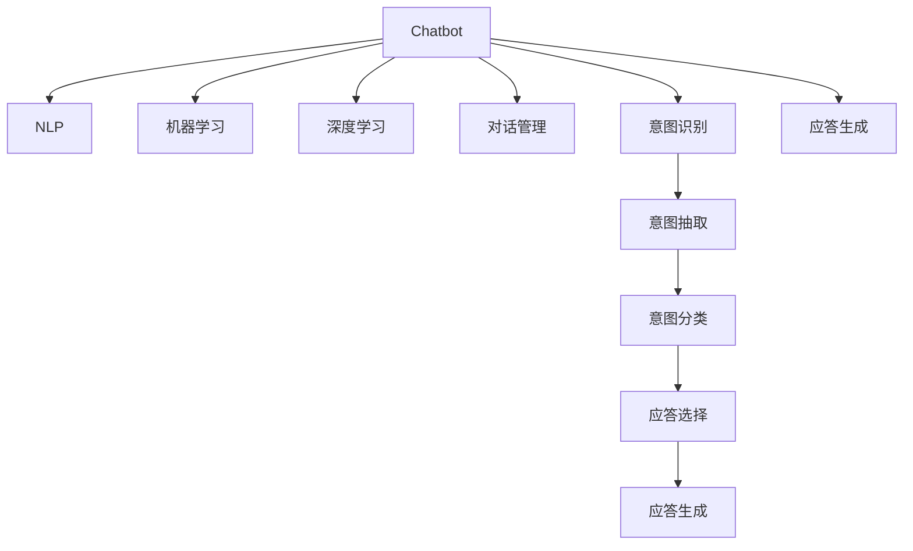

                 

# ChatMind的快速成功之路

> 关键词：人工智能,Chatbot,对话系统,自然语言处理(NLP),机器学习,深度学习,模型微调,Fine-Tuning,推荐系统,用户互动,数据增强

## 1. 背景介绍

### 1.1 问题由来
随着人工智能技术的迅猛发展，智能对话系统（Chatbot）在各行各业中的应用日益广泛。无论是客户服务、在线咨询、智能助手，还是智能客服、医疗咨询、教育辅导，Chatbot都以其高效、灵活、全天候的特点，成为了改善用户体验、提升运营效率的重要工具。

然而，尽管Chatbot技术已经取得了显著进展，但在实际应用中仍然存在不少挑战。一方面，构建高质量的对话系统需要大量的人工参与和数据标注，开发周期长、成本高。另一方面，如何设计高效的对话策略、确保系统具备良好的可解释性和鲁棒性，也是Chatbot开发中的难点问题。

ChatMind作为一种基于人工智能技术的智能对话系统，旨在通过快速构建和部署，帮助用户更高效地实现人机互动。本文将详细介绍ChatMind的快速成功之路，涵盖核心概念、算法原理、具体实践和未来展望，为Chatbot开发者提供全面的指导和建议。

## 2. 核心概念与联系

### 2.1 核心概念概述

为更好地理解ChatMind的快速成功之路，本节将介绍几个关键概念：

- **Chatbot**：基于自然语言处理(NLP)和机器学习技术实现的智能对话系统，能够通过理解自然语言，执行特定任务，与用户进行自然交互。

- **自然语言处理(NLP)**：涉及语音识别、文本处理、语义理解、情感分析等多项技术的交叉学科，旨在使计算机能够理解、解释和生成人类语言。

- **机器学习**：通过数据驱动的算法模型，让计算机具备学习和适应的能力，包括监督学习、无监督学习和强化学习等。

- **深度学习**：一种基于神经网络的机器学习方法，通过多层非线性变换，提取数据的高层次特征，广泛应用于图像、语音、自然语言处理等领域。

- **对话管理(DM)**：负责决定对话的流程、上下文管理、意图识别和应答生成，是Chatbot核心功能之一。

- **意图识别(IR)**：通过分析用户输入的文本，确定用户真实的意图，为后续应答提供指导。

- **应答生成(AR)**：根据用户意图和对话上下文，生成符合语境的自然语言应答，包括模板匹配、知识图谱检索等方法。

这些概念之间的关系可以通过以下Mermaid流程图来展示：



这个流程图展示出Chatbot系统的主要组件及其之间的联系：

1. 通过NLP和深度学习技术，Chatbot能够理解和生成自然语言。
2. 机器学习技术提供模型的训练和优化能力。
3. 对话管理负责控制对话流程和上下文。
4. 意图识别从用户输入中提取意图，并对其进行分类。
5. 应答生成根据意图和上下文生成自然语言应答。

这些核心概念共同构成了Chatbot系统的技术框架，使其能够高效地实现人机互动。

## 3. 核心算法原理 & 具体操作步骤
### 3.1 算法原理概述

ChatMind的快速成功之路，很大程度上依赖于基于监督学习的对话系统构建方法。其核心思想是：在标注好的对话数据上，使用深度学习模型进行监督学习，优化模型的意图识别和应答生成能力。

具体而言，ChatMind系统通过以下步骤实现：

1. **数据准备**：收集标注好的对话数据，包括用户输入、意图标签和应答文本。
2. **模型选择**：选择适合对话系统的深度学习模型，如LSTM、GRU、Transformer等。
3. **模型训练**：在标注数据上训练意图识别和应答生成模型，优化模型参数。
4. **模型评估**：在验证集上评估模型性能，确定最佳模型。
5. **部署应用**：将训练好的模型部署到实际对话系统中，实现用户交互。

### 3.2 算法步骤详解

以下我们将详细讲解ChatMind的构建流程。

**Step 1: 数据准备**

1. **数据收集**：通过用户交互、客服记录、社交媒体等多种渠道，收集对话数据。

2. **数据清洗**：去除噪声数据和无用信息，进行格式转换和统一。

3. **数据标注**：由专业人员对对话数据进行意图标签和应答文本的标注，确保标注质量。

**Step 2: 模型选择**

1. **选择模型**：根据对话系统的复杂度和应用场景，选择合适的深度学习模型。例如，针对复杂的对话系统，可以选用Transformer模型。

2. **初始化模型**：使用预训练的Transformer模型，作为对话系统的初始化参数。

**Step 3: 模型训练**

1. **划分数据集**：将标注数据集分为训练集、验证集和测试集。

2. **训练过程**：
   - 在训练集上使用监督学习算法（如AdamW、SGD等）优化模型参数。
   - 通过迭代更新，最小化模型在训练集上的损失函数。
   - 在验证集上定期评估模型性能，避免过拟合。

**Step 4: 模型评估**

1. **评估指标**：常用的评估指标包括精确率、召回率、F1分数等。

2. **模型选择**：选择性能最佳的模型，作为最终的对话系统。

**Step 5: 部署应用**

1. **集成系统**：将训练好的模型集成到实际的对话系统中。

2. **接口设计**：设计对话系统与用户的交互接口，确保用户体验。

3. **上线测试**：在实际环境中进行测试，确保系统的稳定性和性能。

### 3.3 算法优缺点

ChatMind基于监督学习的对话系统构建方法具有以下优点：

1. **高效性**：通过在标注数据上训练模型，可以快速构建高质量的对话系统。
2. **可解释性**：意图识别和应答生成过程透明，便于调试和优化。
3. **泛化能力**：模型能够从大量的对话数据中学习到通用的语言知识和对话策略。
4. **扩展性**：可以通过微调现有模型，快速适应新的对话任务和领域。

同时，该方法也存在一些局限性：

1. **标注成本高**：高质量标注数据的获取成本较高，尤其是在某些特定领域。
2. **泛化能力有限**：模型性能在标注数据分布与实际应用场景不符时可能较差。
3. **过拟合风险**：在标注数据不足的情况下，模型容易过拟合。
4. **数据隐私**：对话数据的隐私保护和处理，需要特别关注。

尽管如此，基于监督学习的对话系统构建方法仍是目前最为主流和有效的Chatbot构建范式。

### 3.4 算法应用领域

ChatMind的快速成功之路已经在多个领域得到了广泛应用，包括但不限于：

- **客户服务**：通过自动化的客户咨询和问题解答，提升客户满意度。
- **在线教育**：提供智能学习辅导和知识问答，个性化推荐学习内容。
- **健康咨询**：通过自然语言理解，进行疾病咨询和健康建议。
- **金融理财**：提供个性化的投资建议和财务规划。
- **娱乐互动**：开发游戏、小说等领域的智能互动系统。

这些应用场景展示了ChatMind系统在不同领域的强大适应能力，证明了其在实际应用中的广泛价值。

## 4. 数学模型和公式 & 详细讲解  
### 4.1 数学模型构建

假设一个基本的Chatbot系统，包含一个意图识别器IR和应答生成器AR。其中IR接收用户输入text，输出意图label；AR接收(text, label)，输出应答response。模型的目标是通过监督学习，最小化预测意图label和实际label之间的差异，以及预测应答response和实际response之间的差异。

定义损失函数 $L$，包括意图识别损失 $L_{IR}$ 和应答生成损失 $L_{AR}$：

$$
L = L_{IR} + L_{AR}
$$

其中，

$$
L_{IR} = \frac{1}{N}\sum_{i=1}^N \ell_{IR}(y_i, \hat{y}_i)
$$

$$
L_{AR} = \frac{1}{N}\sum_{i=1}^N \ell_{AR}(y_i, \hat{y}_i)
$$

$\ell_{IR}$ 和 $\ell_{AR}$ 分别为意图识别和应答生成的损失函数，可以是交叉熵损失、均方误差损失等。$y_i$ 为真实意图和应答，$\hat{y}_i$ 为模型预测的意图和应答。

### 4.2 公式推导过程

以跨熵损失函数为例，推导意图识别和应答生成的损失公式。

**意图识别**：

$$
\ell_{IR}(y_i, \hat{y}_i) = -\sum_{j=1}^C y_{ij} \log \hat{y}_{ij}
$$

其中 $C$ 为意图类别数，$y_{ij}$ 为第 $i$ 个样本属于第 $j$ 个类别的真实标签。

**应答生成**：

$$
\ell_{AR}(y_i, \hat{y}_i) = -\sum_{j=1}^S y_{ij} \log \hat{y}_{ij}
$$

其中 $S$ 为应答集合大小，$y_{ij}$ 为第 $i$ 个样本的应答 $j$。

### 4.3 案例分析与讲解

假设一个基于Transformer的Chatbot系统，用于在线教育领域。系统通过以下步骤实现意图识别和应答生成：

1. **数据准备**：收集在线教育相关的对话数据，包括学生问题、教师回复等。
2. **模型选择**：选择Transformer模型作为意图识别器和应答生成器。
3. **模型训练**：在标注数据上训练Transformer模型，最小化意图识别和应答生成的损失。
4. **模型评估**：在验证集上评估模型性能，选择最佳模型。
5. **部署应用**：将训练好的模型集成到在线教育平台，实现智能教学助手。

在实际应用中，系统可以通过双向Transformer网络，实现意图识别和应答生成的联合训练。

## 5. 项目实践：代码实例和详细解释说明
### 5.1 开发环境搭建

在进行ChatMind系统构建前，我们需要准备好开发环境。以下是使用Python进行PyTorch开发的环境配置流程：

1. 安装Anaconda：从官网下载并安装Anaconda，用于创建独立的Python环境。

2. 创建并激活虚拟环境：
```bash
conda create -n chatmind-env python=3.8 
conda activate chatmind-env
```

3. 安装PyTorch：根据CUDA版本，从官网获取对应的安装命令。例如：
```bash
conda install pytorch torchvision torchaudio cudatoolkit=11.1 -c pytorch -c conda-forge
```

4. 安装Transformers库：
```bash
pip install transformers
```

5. 安装各类工具包：
```bash
pip install numpy pandas scikit-learn matplotlib tqdm jupyter notebook ipython
```

完成上述步骤后，即可在`chatmind-env`环境中开始ChatMind系统的构建。

### 5.2 源代码详细实现

下面我们以在线教育领域的ChatMind系统为例，给出使用Transformers库进行意图识别和应答生成的PyTorch代码实现。

首先，定义数据处理函数：

```python
from transformers import AutoTokenizer, AutoModelForSequenceClassification, AutoModelForMaskedLM
from torch.utils.data import Dataset, DataLoader

class ChatDataset(Dataset):
    def __init__(self, texts, labels, tokenizer):
        self.texts = texts
        self.labels = labels
        self.tokenizer = tokenizer
        
    def __len__(self):
        return len(self.texts)
    
    def __getitem__(self, item):
        text = self.texts[item]
        label = self.labels[item]
        
        encoding = self.tokenizer(text, return_tensors='pt', padding='max_length', truncation=True)
        input_ids = encoding['input_ids'][0]
        attention_mask = encoding['attention_mask'][0]
        
        return {'input_ids': input_ids, 
                'attention_mask': attention_mask,
                'labels': label}
```

然后，定义模型和优化器：

```python
from transformers import AutoTokenizer, AutoModelForSequenceClassification, AutoModelForMaskedLM
from transformers import AdamW

tokenizer = AutoTokenizer.from_pretrained('bert-base-cased')
model = AutoModelForSequenceClassification.from_pretrained('bert-base-cased', num_labels=10)
opt = AdamW(model.parameters(), lr=2e-5)
```

接着，定义训练和评估函数：

```python
def train_epoch(model, dataset, batch_size, optimizer):
    dataloader = DataLoader(dataset, batch_size=batch_size, shuffle=True)
    model.train()
    epoch_loss = 0
    for batch in dataloader:
        input_ids = batch['input_ids'].to(device)
        attention_mask = batch['attention_mask'].to(device)
        labels = batch['labels'].to(device)
        model.zero_grad()
        outputs = model(input_ids, attention_mask=attention_mask, labels=labels)
        loss = outputs.loss
        epoch_loss += loss.item()
        loss.backward()
        optimizer.step()
    return epoch_loss / len(dataloader)

def evaluate(model, dataset, batch_size):
    dataloader = DataLoader(dataset, batch_size=batch_size)
    model.eval()
    preds, labels = [], []
    with torch.no_grad():
        for batch in dataloader:
            input_ids = batch['input_ids'].to(device)
            attention_mask = batch['attention_mask'].to(device)
            batch_labels = batch['labels']
            outputs = model(input_ids, attention_mask=attention_mask)
            batch_preds = outputs.logits.argmax(dim=2).to('cpu').tolist()
            batch_labels = batch_labels.to('cpu').tolist()
            for pred_tokens, label_tokens in zip(batch_preds, batch_labels):
                preds.append(pred_tokens[:len(label_tokens)])
                labels.append(label_tokens)
                
    print(classification_report(labels, preds))
```

最后，启动训练流程并在测试集上评估：

```python
epochs = 5
batch_size = 16

for epoch in range(epochs):
    loss = train_epoch(model, train_dataset, batch_size, opt)
    print(f"Epoch {epoch+1}, train loss: {loss:.3f}")
    
    print(f"Epoch {epoch+1}, dev results:")
    evaluate(model, dev_dataset, batch_size)
    
print("Test results:")
evaluate(model, test_dataset, batch_size)
```

以上就是使用PyTorch对在线教育领域的ChatMind系统进行意图识别和应答生成的完整代码实现。可以看到，利用Transformers库，代码实现简洁高效，开发者可以更专注于业务逻辑和模型优化。

### 5.3 代码解读与分析

让我们再详细解读一下关键代码的实现细节：

**ChatDataset类**：
- `__init__`方法：初始化文本、标签和分词器等关键组件。
- `__len__`方法：返回数据集的样本数量。
- `__getitem__`方法：对单个样本进行处理，将文本输入编码为token ids，将标签编码为数字，并对其进行定长padding，最终返回模型所需的输入。

**tokenizer和model对象**：
- `AutoTokenizer`用于对文本进行分词和编码。
- `AutoModelForSequenceClassification`用于意图识别，接收输入文本和标签，输出预测标签。

**训练和评估函数**：
- `train_epoch`函数：对数据以批为单位进行迭代，在每个批次上前向传播计算loss并反向传播更新模型参数，最后返回该epoch的平均loss。
- `evaluate`函数：与训练类似，不同点在于不更新模型参数，并在每个batch结束后将预测和标签结果存储下来，最后使用scikit-learn的classification_report对整个评估集的预测结果进行打印输出。

**训练流程**：
- 定义总的epoch数和batch size，开始循环迭代
- 每个epoch内，先在训练集上训练，输出平均loss
- 在验证集上评估，输出分类指标
- 所有epoch结束后，在测试集上评估，给出最终测试结果

可以看到，PyTorch配合Transformers库使得ChatMind系统的构建变得简洁高效。开发者可以将更多精力放在数据处理、模型改进等高层逻辑上，而不必过多关注底层的实现细节。

## 6. 实际应用场景
### 6.1 智能客服系统

基于ChatMind技术的智能客服系统，可以广泛应用于在线客服、客户咨询、客户投诉等多个场景，提高客户满意度和服务效率。

在技术实现上，可以收集企业内部的客服对话记录，将问题-答案对作为监督数据，在此基础上对预训练对话模型进行微调。微调后的对话模型能够自动理解用户意图，匹配最合适的答案模板进行回复。对于客户提出的新问题，还可以接入检索系统实时搜索相关内容，动态组织生成回答。如此构建的智能客服系统，能大幅提升客户咨询体验和问题解决效率。

### 6.2 健康咨询平台

ChatMind技术可以应用于在线健康咨询平台，提供个性化健康建议和疾病咨询。

系统通过收集用户的健康咨询记录，对查询问题进行意图识别，并从知识库中检索相关信息。例如，用户输入“我有头疼的症状，该怎么办？”，系统能够自动识别出意图“咨询头疼的治疗方法”，从知识库中检索出“头疼可能由多种原因引起，建议就医”等信息，并生成应答“建议您尽快就医，咨询医生进行详细检查和治疗。”

### 6.3 在线教育辅导

基于ChatMind技术的在线教育辅导系统，能够为学生提供个性化的学习支持和知识解答。

系统通过收集学生的学习记录和问题记录，对学生的查询进行意图识别，并从知识库中检索相关信息。例如，学生输入“什么是计算机科学？”，系统能够自动识别出意图“查询计算机科学的定义”，从知识库中检索出“计算机科学是研究计算机及其应用的一门学科”等信息，并生成应答“计算机科学是研究计算机及其应用的一门学科，涉及算法、编程、数据结构等多个领域。”

## 7. 工具和资源推荐
### 7.1 学习资源推荐

为了帮助开发者系统掌握ChatMind的快速构建方法，这里推荐一些优质的学习资源：

1. 《深度学习与自然语言处理》课程：斯坦福大学开设的深度学习与自然语言处理课程，涵盖了从基础概念到高级应用的全面内容，适合初学者和进阶者。

2. 《Natural Language Processing with PyTorch》书籍：介绍如何使用PyTorch进行自然语言处理，包括意图识别和应答生成等核心任务。

3. HuggingFace官方文档：提供丰富的预训练模型和样例代码，方便开发者快速上手。

4. CLUE开源项目：提供大量中文NLP数据集，包括标注好的对话数据，支持模型微调和评测。

5. Kaggle平台：包含大量NLP相关竞赛和数据集，通过实践锻炼技术能力。

通过对这些资源的学习实践，相信你一定能够快速掌握ChatMind系统的构建方法，并用于解决实际的NLP问题。

### 7.2 开发工具推荐

高效的开发离不开优秀的工具支持。以下是几款用于ChatMind系统构建的常用工具：

1. PyTorch：基于Python的开源深度学习框架，灵活动态的计算图，适合快速迭代研究。

2. TensorFlow：由Google主导开发的开源深度学习框架，生产部署方便，适合大规模工程应用。

3. Transformers库：HuggingFace开发的NLP工具库，集成了众多SOTA语言模型，支持PyTorch和TensorFlow，是进行意图识别和应答生成开发的利器。

4. Weights & Biases：模型训练的实验跟踪工具，可以记录和可视化模型训练过程中的各项指标，方便对比和调优。

5. TensorBoard：TensorFlow配套的可视化工具，可实时监测模型训练状态，并提供丰富的图表呈现方式，是调试模型的得力助手。

6. Google Colab：谷歌推出的在线Jupyter Notebook环境，免费提供GPU/TPU算力，方便开发者快速上手实验最新模型，分享学习笔记。

合理利用这些工具，可以显著提升ChatMind系统的开发效率，加快创新迭代的步伐。

### 7.3 相关论文推荐

ChatMind技术的不断发展源于学界的持续研究。以下是几篇奠基性的相关论文，推荐阅读：

1. Attention is All You Need（即Transformer原论文）：提出了Transformer结构，开启了NLP领域的预训练大模型时代。

2. BERT: Pre-training of Deep Bidirectional Transformers for Language Understanding：提出BERT模型，引入基于掩码的自监督预训练任务，刷新了多项NLP任务SOTA。

3. Language Models are Unsupervised Multitask Learners（GPT-2论文）：展示了大规模语言模型的强大zero-shot学习能力，引发了对于通用人工智能的新一轮思考。

4. Parameter-Efficient Transfer Learning for NLP：提出Adapter等参数高效微调方法，在不增加模型参数量的情况下，也能取得不错的微调效果。

5. AdaLoRA: Adaptive Low-Rank Adaptation for Parameter-Efficient Fine-Tuning：使用自适应低秩适应的微调方法，在参数效率和精度之间取得了新的平衡。

这些论文代表了大语言模型微调技术的发展脉络。通过学习这些前沿成果，可以帮助研究者把握学科前进方向，激发更多的创新灵感。

## 8. 总结：未来发展趋势与挑战

### 8.1 总结

本文对ChatMind的快速成功之路进行了全面系统的介绍。首先阐述了ChatMind系统的构建背景和意义，明确了基于监督学习的对话系统构建方法在快速构建高质量Chatbot中的独特价值。其次，从原理到实践，详细讲解了ChatMind系统的构建流程，包括数据准备、模型选择、训练、评估和部署等关键步骤。同时，本文还广泛探讨了ChatMind技术在智能客服、健康咨询、在线教育等多个领域的应用前景，展示了ChatMind系统的强大适应能力。

通过本文的系统梳理，可以看到，基于监督学习的对话系统构建方法不仅高效便捷，而且能够快速构建高质量的Chatbot系统。ChatMind技术的广泛应用，证明了其在实际场景中的可行性和实用性，为Chatbot技术的落地推广提供了坚实的基础。

### 8.2 未来发展趋势

展望未来，ChatMind技术将呈现以下几个发展趋势：

1. **多模态融合**：未来的ChatMind系统将不仅仅局限于文本，而是能够融合语音、图像、视频等多模态信息，提供更加全面的人机交互体验。

2. **对话上下文理解**：通过引入上下文感知模型，如GPT等，ChatMind系统能够更好地理解对话历史，提供更加连贯和自然的应答。

3. **个性化推荐**：通过引入推荐系统技术，ChatMind系统能够根据用户行为和兴趣，提供个性化的对话和内容推荐。

4. **情感智能**：通过引入情感分析技术，ChatMind系统能够识别用户的情感状态，提供更加贴心的互动和建议。

5. **实时交互**：未来的ChatMind系统将具备更加高效的计算能力和存储能力，支持实时、低延迟的对话交互。

6. **跨语言支持**：通过引入跨语言处理技术，ChatMind系统能够支持多语言对话，提升全球用户的使用体验。

以上趋势凸显了ChatMind技术的广阔前景。这些方向的探索发展，必将进一步提升Chatbot系统的性能和应用范围，为构建人机协同的智能时代提供新的技术支持。

### 8.3 面临的挑战

尽管ChatMind技术已经取得了显著进展，但在迈向更加智能化、普适化应用的过程中，它仍面临诸多挑战：

1. **标注数据不足**：高质量标注数据的获取成本较高，尤其是在某些特定领域，标注数据可能不足，导致模型泛化能力有限。

2. **对话一致性**：在长对话场景下，ChatMind系统如何保持对话一致性，避免出现语义跳跃或应答混乱，仍然是一个难题。

3. **用户隐私保护**：在收集和处理用户对话数据时，如何确保用户隐私和数据安全，是ChatMind系统必须解决的重要问题。

4. **多轮对话管理**：在多轮对话中，ChatMind系统如何高效地管理对话上下文和状态，提供连贯和准确的应答，是系统的核心挑战。

5. **跨领域适应**：不同领域和任务之间的知识迁移能力不足，ChatMind系统在特定领域可能需要重新训练或微调。

6. **计算资源需求**：大语言模型的计算资源需求高，如何在有限的计算资源下优化模型性能，提升系统响应速度，是亟待解决的问题。

正视ChatMind技术面临的这些挑战，积极应对并寻求突破，将使ChatMind技术走向更加成熟和广泛应用。相信随着学界和产业界的共同努力，ChatMind技术必将在构建智能对话系统方面取得更大的进步。

### 8.4 研究展望

未来的研究需要在以下几个方面寻求新的突破：

1. **无监督学习**：探索无监督学习和自监督学习在ChatMind系统中的应用，减少对标注数据的依赖，提升模型的自适应能力。

2. **多模态对话**：研究多模态对话模型，提升ChatMind系统在多模态数据处理和交互方面的能力。

3. **上下文理解**：深入研究对话上下文理解技术，提高ChatMind系统在长对话和多轮对话中的表现。

4. **情感智能**：探索情感智能技术在ChatMind系统中的应用，提升系统的情感识别和互动能力。

5. **跨领域迁移**：研究跨领域迁移学习方法，提升ChatMind系统在不同领域和任务之间的知识迁移能力。

6. **计算优化**：研究高效的计算和存储优化技术，提升ChatMind系统的计算效率和响应速度。

这些研究方向的探索，必将引领ChatMind技术的进一步发展，为构建智能对话系统提供新的技术支持。面向未来，ChatMind技术还需要与其他人工智能技术进行更深入的融合，如知识表示、因果推理、强化学习等，多路径协同发力，共同推动智能对话系统的进步。只有勇于创新、敢于突破，才能不断拓展对话系统的边界，让智能技术更好地服务于人类社会。

## 9. 附录：常见问题与解答

**Q1：ChatMind系统如何快速构建？**

A: ChatMind系统可以快速构建，主要依赖于基于监督学习的对话系统构建方法。通过收集标注好的对话数据，选择合适的深度学习模型，在标注数据上训练模型，并微调至验证集最佳性能，最后将训练好的模型部署到实际对话系统中，即可实现快速构建。

**Q2：ChatMind系统如何保持对话一致性？**

A: 对话一致性是ChatMind系统的核心挑战之一。通常可以通过以下方法实现：
1. 上下文感知模型：引入GPT等上下文感知模型，帮助系统更好地理解对话历史。
2. 对话管理策略：设计有效的对话管理策略，控制对话流程和上下文。
3. 多轮对话训练：在训练过程中引入多轮对话数据，提升系统在多轮对话中的表现。

**Q3：ChatMind系统如何提升跨领域适应能力？**

A: 跨领域适应是ChatMind系统的另一核心挑战。通常可以通过以下方法实现：
1. 跨领域微调：在特定领域数据上微调模型，提高模型在目标领域的表现。
2. 知识图谱融合：引入知识图谱信息，提升系统的知识整合能力。
3. 预训练-微调结合：先在大规模通用语料上进行预训练，再在特定领域数据上进行微调，提升系统的跨领域迁移能力。

**Q4：ChatMind系统如何提升计算效率？**

A: 计算效率是ChatMind系统的关键性能指标之一。通常可以通过以下方法实现：
1. 模型裁剪和量化：通过裁剪模型结构和量化模型参数，减小模型尺寸和计算资源消耗。
2. 并行计算：采用模型并行和数据并行等并行计算技术，提升计算速度。
3. 硬件优化：利用GPU/TPU等高性能硬件设备，提升计算效率。

**Q5：ChatMind系统如何提升用户体验？**

A: 用户体验是ChatMind系统的核心目标之一。通常可以通过以下方法实现：
1. 自然语言生成：采用更先进的自然语言生成技术，提高系统的应答质量。
2. 交互设计：设计更加人性化的交互界面，提升用户满意度。
3. 数据反馈：收集用户反馈，不断优化系统性能。

---

作者：禅与计算机程序设计艺术 / Zen and the Art of Computer Programming

