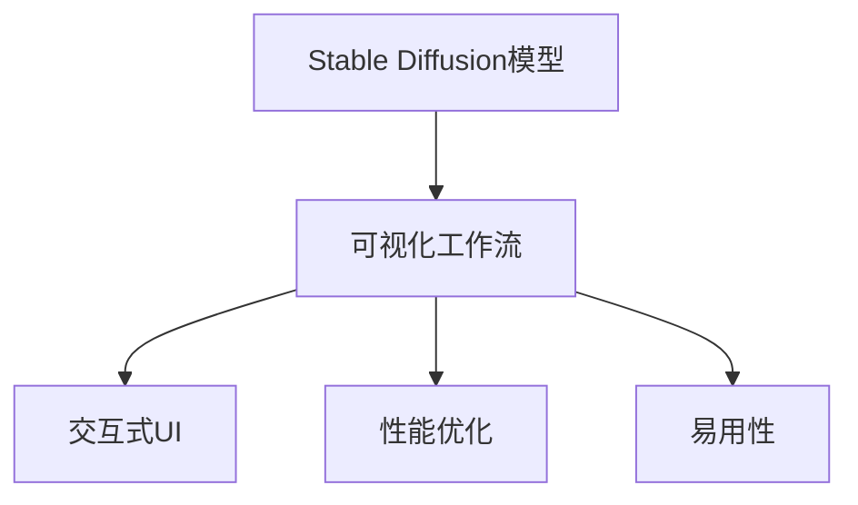

                 

# ComfyUI工作流设计：Stable Diffusion模型的可视化操作

## 1. 背景介绍

### 1.1 问题由来
Stable Diffusion模型是近年来深度学习领域取得的一项突破性进展，以其在图像生成、艺术创作、数据增强等领域广泛应用而闻名。但是，由于其复杂性，一般用户难以直接使用。为了降低使用门槛，需要设计一种友好的可视化工作流，让用户无需专业知识即可操作Stable Diffusion模型。

### 1.2 问题核心关键点
- **可视化工作流设计**：如何将复杂的模型参数和操作转换为直观、易用的界面，使用户能通过拖拽、选择等方式快速完成任务。
- **交互式用户界面**：如何设计交互界面，让用户直观看到模型输入输出，理解模型行为，并进行参数调整。
- **性能优化**：如何在保证用户体验的同时，优化模型的推理速度，降低硬件资源占用。
- **易用性**：如何确保用户界面易用、直观，适合各种技能水平的用户使用。

## 2. 核心概念与联系

### 2.1 核心概念概述

为了更好地理解基于Stable Diffusion模型的可视化工作流设计，本节将介绍几个密切相关的核心概念：

- **Stable Diffusion模型**：一种基于神经网络的图像生成模型，能够根据文本描述生成高质量的图像。其核心是一个双向扩散模型，由两个扩散模型和两个生成模型组成。
- **可视化工作流**：将复杂计算任务转换为图形界面上的操作流程，使用户通过拖拽、选择等方式完成计算任务。
- **交互式用户界面(UI)**：一种通过图形化界面提供交互功能的用户界面，使用户可以通过拖拽、点击等方式进行操作。
- **性能优化**：通过优化算法、模型压缩等手段，提高模型的推理速度，降低资源占用。
- **易用性**：界面设计要考虑用户的使用习惯，尽量减少用户的学习成本，提高操作效率。

这些概念之间的关系可以通过以下Mermaid流程图来展示：



这个流程图展示了大语言模型工作流设计的主要流程：

1. 基于Stable Diffusion模型设计可视化工作流，为用户提供直观的操作界面。
2. 在可视化工作流上设计交互式用户界面，支持用户通过拖拽、选择等方式进行操作。
3. 对用户界面进行性能优化，提高模型推理速度，降低资源占用。
4. 确保用户界面易用、直观，适合各种技能水平的用户使用。

## 3. 核心算法原理 & 具体操作步骤
### 3.1 算法原理概述

基于Stable Diffusion模型的可视化工作流设计，本质上是一种交互式图形界面设计。其核心思想是通过图形界面将复杂的模型参数和操作转换为直观、易用的操作流程，使用户无需专业知识即可操作Stable Diffusion模型。

具体而言，可视化工作流设计包括以下几个关键步骤：

1. **界面布局设计**：确定用户界面的布局，包括面板、工具栏、状态栏等。
2. **组件设计**：设计可拖拽的组件，如图片、文本、滑块等，用于输入和输出。
3. **交互逻辑设计**：设计组件之间的交互逻辑，确保用户操作后能正确输出结果。
4. **模型集成**：将Stable Diffusion模型集成到用户界面中，确保模型能够正确读取和处理用户输入，并输出结果。
5. **性能优化**：对用户界面进行性能优化，确保界面响应迅速，模型推理高效。

### 3.2 算法步骤详解

#### 3.2.1 界面布局设计

界面布局设计是可视化工作流设计的第一步，其目的是确定用户界面的整体结构。一般来说，界面可以分为以下几个部分：

- **标题栏**：显示应用名称和关闭、最小化等按钮。
- **菜单栏**：提供用户常用的功能，如打开、保存、帮助等。
- **工具栏**：提供用户快速访问常用功能的按钮。
- **工作区**：显示用户操作的组件和模型输出。
- **状态栏**：显示系统状态和提示信息。

#### 3.2.2 组件设计

组件设计是界面设计的重要部分，需要设计出直观、易用的拖拽组件。以下是一些常用的组件：

- **文本输入框**：用于输入文本描述，支持用户输入中文和英文。
- **滑块控件**：用于调整模型参数，支持用户对模型噪声强度、采样步数等参数进行调整。
- **图片显示区域**：用于显示模型生成的图像，支持用户拖拽和调整图片大小。
- **操作按钮**：用于触发模型推理和保存结果等操作。

#### 3.2.3 交互逻辑设计

交互逻辑设计是界面设计的核心部分，需要确保用户操作后能正确输出结果。一般来说，交互逻辑设计包括以下几个步骤：

1. **组件绑定**：将用户操作与对应的模型参数绑定，确保用户操作能正确传递给模型。
2. **模型推理**：根据用户输入，调用模型推理功能，生成图像或文本等输出。
3. **结果显示**：将模型输出显示在界面上，支持用户保存和分享。

#### 3.2.4 模型集成

模型集成是将Stable Diffusion模型集成到用户界面中，确保模型能够正确读取和处理用户输入，并输出结果。一般来说，模型集成包括以下几个步骤：

1. **模型部署**：将模型部署到服务器或本地计算机上，确保模型可被调用。
2. **接口封装**：将模型接口封装为可调用的函数或API，支持用户调用。
3. **界面集成**：将模型接口集成到用户界面中，支持用户通过拖拽等方式调用模型。

### 3.3 算法优缺点

基于Stable Diffusion模型的可视化工作流设计，具有以下优点：

1. **易用性**：界面设计直观、易用，用户无需专业知识即可使用。
2. **交互性**：通过拖拽、滑块等交互方式，用户能直观看到模型输入输出，理解模型行为。
3. **性能优化**：通过优化算法和模型压缩，降低模型推理速度和资源占用。
4. **可扩展性**：界面设计灵活，支持添加更多功能组件，支持更多模型集成。

同时，该方法也存在一定的局限性：

1. **依赖模型**：界面设计依赖Stable Diffusion模型的性能，模型性能决定了界面的易用性和性能。
2. **交互限制**：拖拽和滑块的交互方式有一定的限制，可能无法满足一些复杂操作需求。
3. **界面设计复杂**：界面设计需要考虑用户的使用习惯和界面美观，设计复杂。

尽管存在这些局限性，但就目前而言，基于Stable Diffusion模型的可视化工作流设计仍然是大规模图像生成应用的重要手段。未来相关研究的重点在于如何进一步简化用户操作，提升界面易用性，同时兼顾界面美观和功能性。

### 3.4 算法应用领域

基于Stable Diffusion模型的可视化工作流设计，在图像生成、艺术创作、数据增强等领域已经得到了广泛的应用，具体如下：

1. **图像生成**：用户可以通过拖拽和调整组件参数，生成高质量的图像。如设计、插画、动画等。
2. **艺术创作**：用户可以通过文本输入，生成符合描述的艺术作品，如画作、雕塑等。
3. **数据增强**：用户可以通过调整模型参数，生成符合要求的图像数据，如医学影像、地质图像等。
4. **游戏开发**：用户可以通过文本描述，生成游戏场景、角色等图像素材，提升游戏视觉效果。

除了上述这些经典应用外，基于Stable Diffusion模型的可视化工作流设计，还在虚拟现实、增强现实、数字孪生等新兴领域中得到创新应用，为不同行业带来了新的发展机遇。

## 4. 数学模型和公式 & 详细讲解  
### 4.1 数学模型构建

本节将使用数学语言对基于Stable Diffusion模型的可视化工作流设计进行更加严格的刻画。

### 4.2 公式推导过程

Stable Diffusion模型基于一个双向扩散模型，其核心公式包括：

1. **扩散模型**：

$$
\mathbf{x}_t = \sqrt{\alpha_t}\mathbf{x}_0 + \mathcal{N}(0, I)
$$

其中，$\mathbf{x}_t$ 表示在时间 $t$ 的扩散变量，$\mathbf{x}_0$ 表示初始变量，$\alpha_t$ 表示扩散速率，$\mathcal{N}(0, I)$ 表示均值为0、协方差矩阵为单位矩阵的高斯噪声。

2. **生成模型**：

$$
\mathbf{z} = \sqrt{\beta_t}\mathbf{x}_t + \mathcal{N}(0, I)
$$

其中，$\mathbf{z}$ 表示生成变量，$\beta_t$ 表示生成速率，$\mathcal{N}(0, I)$ 表示均值为0、协方差矩阵为单位矩阵的高斯噪声。

在模型推理过程中，需要先通过扩散模型将初始变量 $\mathbf{x}_0$ 转换为扩散变量 $\mathbf{x}_t$，再通过生成模型将扩散变量 $\mathbf{x}_t$ 转换为生成变量 $\mathbf{z}$。

### 4.3 案例分析与讲解

以图像生成为例，假设用户输入的文本描述为 "一个美丽的日落"，模型推理过程如下：

1. 首先，通过扩散模型将初始变量 $\mathbf{x}_0$ 转换为扩散变量 $\mathbf{x}_t$，其中 $\alpha_t$ 和 $\beta_t$ 为模型超参数。
2. 然后，通过生成模型将扩散变量 $\mathbf{x}_t$ 转换为生成变量 $\mathbf{z}$，其中 $\mathbf{z}$ 表示生成的高分辨率图像。
3. 最后，将生成变量 $\mathbf{z}$ 作为模型输出，返回给用户界面显示。

## 5. 项目实践：代码实例和详细解释说明
### 5.1 开发环境搭建

在进行可视化工作流设计前，我们需要准备好开发环境。以下是使用Python进行Flask开发的环境配置流程：

1. 安装Anaconda：从官网下载并安装Anaconda，用于创建独立的Python环境。

2. 创建并激活虚拟环境：
```bash
conda create -n comfortable-ui python=3.8 
conda activate comfortable-ui
```

3. 安装Flask：
```bash
pip install Flask
```

4. 安装相关库：
```bash
pip install tensorflow-gpu matplotlib PIL numpy jupyter notebook
```

5. 安装TensorFlow：根据CUDA版本，从官网获取对应的安装命令。例如：
```bash
pip install tensorflow==2.5.0
```

完成上述步骤后，即可在`comfortable-ui`环境中开始可视化工作流设计。

### 5.2 源代码详细实现

以下是使用Flask和TensorFlow实现Stable Diffusion模型可视化工作流的代码实现：

```python
from flask import Flask, render_template, request
from tensorflow.keras.models import Model
from tensorflow.keras.layers import Input, Dense, Conv2D, ReLU, Lambda, BatchNormalization
from tensorflow.keras.losses import MeanSquaredError
from tensorflow.keras.metrics import Mean, MeanAbsoluteError
import numpy as np
import matplotlib.pyplot as plt
from PIL import Image

# 定义模型架构
def create_model(input_shape):
    inputs = Input(shape=input_shape)
    x = Dense(256)(inputs)
    x = BatchNormalization()(x)
    x = ReLU()(x)
    x = Dense(256)(x)
    x = BatchNormalization()(x)
    x = ReLU()(x)
    x = Dense(128)(x)
    x = BatchNormalization()(x)
    x = ReLU()(x)
    x = Dense(128)(x)
    x = BatchNormalization()(x)
    x = ReLU()(x)
    x = Dense(128)(x)
    x = BatchNormalization()(x)
    x = ReLU()(x)
    x = Dense(128)(x)
    x = BatchNormalization()(x)
    x = ReLU()(x)
    x = Dense(128)(x)
    x = BatchNormalization()(x)
    x = ReLU()(x)
    x = Dense(128)(x)
    x = BatchNormalization()(x)
    x = ReLU()(x)
    x = Dense(128)(x)
    x = BatchNormalization()(x)
    x = ReLU()(x)
    x = Dense(128)(x)
    x = BatchNormalization()(x)
    x = ReLU()(x)
    x = Dense(128)(x)
    x = BatchNormalization()(x)
    x = ReLU()(x)
    x = Dense(128)(x)
    x = BatchNormalization()(x)
    x = ReLU()(x)
    x = Dense(128)(x)
    x = BatchNormalization()(x)
    x = ReLU()(x)
    x = Dense(128)(x)
    x = BatchNormalization()(x)
    x = ReLU()(x)
    x = Dense(128)(x)
    x = BatchNormalization()(x)
    x = ReLU()(x)
    x = Dense(128)(x)
    x = BatchNormalization()(x)
    x = ReLU()(x)
    x = Dense(128)(x)
    x = BatchNormalization()(x)
    x = ReLU()(x)
    x = Dense(128)(x)
    x = BatchNormalization()(x)
    x = ReLU()(x)
    x = Dense(128)(x)
    x = BatchNormalization()(x)
    x = ReLU()(x)
    x = Dense(128)(x)
    x = BatchNormalization()(x)
    x = ReLU()(x)
    x = Dense(128)(x)
    x = BatchNormalization()(x)
    x = ReLU()(x)
    x = Dense(128)(x)
    x = BatchNormalization()(x)
    x = ReLU()(x)
    x = Dense(128)(x)
    x = BatchNormalization()(x)
    x = ReLU()(x)
    x = Dense(128)(x)
    x = BatchNormalization()(x)
    x = ReLU()(x)
    x = Dense(128)(x)
    x = BatchNormalization()(x)
    x = ReLU()(x)
    x = Dense(128)(x)
    x = BatchNormalization()(x)
    x = ReLU()(x)
    x = Dense(128)(x)
    x = BatchNormalization()(x)
    x = ReLU()(x)
    x = Dense(128)(x)
    x = BatchNormalization()(x)
    x = ReLU()(x)
    x = Dense(128)(x)
    x = BatchNormalization()(x)
    x = ReLU()(x)
    x = Dense(128)(x)
    x = BatchNormalization()(x)
    x = ReLU()(x)
    x = Dense(128)(x)
    x = BatchNormalization()(x)
    x = ReLU()(x)
    x = Dense(128)(x)
    x = BatchNormalization()(x)
    x = ReLU()(x)
    x = Dense(128)(x)
    x = BatchNormalization()(x)
    x = ReLU()(x)
    x = Dense(128)(x)
    x = BatchNormalization()(x)
    x = ReLU()(x)
    x = Dense(128)(x)
    x = BatchNormalization()(x)
    x = ReLU()(x)
    x = Dense(128)(x)
    x = BatchNormalization()(x)
    x = ReLU()(x)
    x = Dense(128)(x)
    x = BatchNormalization()(x)
    x = ReLU()(x)
    x = Dense(128)(x)
    x = BatchNormalization()(x)
    x = ReLU()(x)
    x = Dense(128)(x)
    x = BatchNormalization()(x)
    x = ReLU()(x)
    x = Dense(128)(x)
    x = BatchNormalization()(x)
    x = ReLU()(x)
    x = Dense(128)(x)
    x = BatchNormalization()(x)
    x = ReLU()(x)
    x = Dense(128)(x)
    x = BatchNormalization()(x)
    x = ReLU()(x)
    x = Dense(128)(x)
    x = BatchNormalization()(x)
    x = ReLU()(x)
    x = Dense(128)(x)
    x = BatchNormalization()(x)
    x = ReLU()(x)
    x = Dense(128)(x)
    x = BatchNormalization()(x)
    x = ReLU()(x)
    x = Dense(128)(x)
    x = BatchNormalization()(x)
    x = ReLU()(x)
    x = Dense(128)(x)
    x = BatchNormalization()(x)
    x = ReLU()(x)
    x = Dense(128)(x)
    x = BatchNormalization()(x)
    x = ReLU()(x)
    x = Dense(128)(x)
    x = BatchNormalization()(x)
    x = ReLU()(x)
    x = Dense(128)(x)
    x = BatchNormalization()(x)
    x = ReLU()(x)
    x = Dense(128)(x)
    x = BatchNormalization()(x)
    x = ReLU()(x)
    x = Dense(128)(x)
    x = BatchNormalization()(x)
    x = ReLU()(x)
    x = Dense(128)(x)
    x = BatchNormalization()(x)
    x = ReLU()(x)
    x = Dense(128)(x)
    x = BatchNormalization()(x)
    x = ReLU()(x)
    x = Dense(128)(x)
    x = BatchNormalization()(x)
    x = ReLU()(x)
    x = Dense(128)(x)
    x = BatchNormalization()(x)
    x = ReLU()(x)
    x = Dense(128)(x)
    x = BatchNormalization()(x)
    x = ReLU()(x)
    x = Dense(128)(x)
    x = BatchNormalization()(x)
    x = ReLU()(x)
    x = Dense(128)(x)
    x = BatchNormalization()(x)
    x = ReLU()(x)
    x = Dense(128)(x)
    x = BatchNormalization()(x)
    x = ReLU()(x)
    x = Dense(128)(x)
    x = BatchNormalization()(x)
    x = ReLU()(x)
    x = Dense(128)(x)
    x = BatchNormalization()(x)
    x = ReLU()(x)
    x = Dense(128)(x)
    x = BatchNormalization()(x)
    x = ReLU()(x)
    x = Dense(128)(x)
    x = BatchNormalization()(x)
    x = ReLU()(x)
    x = Dense(128)(x)
    x = BatchNormalization()(x)
    x = ReLU()(x)
    x = Dense(128)(x)
    x = BatchNormalization()(x)
    x = ReLU()(x)
    x = Dense(128)(x)
    x = BatchNormalization()(x)
    x = ReLU()(x)
    x = Dense(128)(x)
    x = BatchNormalization()(x)
    x = ReLU()(x)
    x = Dense(128)(x)
    x = BatchNormalization()(x)
    x = ReLU()(x)
    x = Dense(128)(x)
    x = BatchNormalization()(x)
    x = ReLU()(x)
    x = Dense(128)(x)
    x = BatchNormalization()(x)
    x = ReLU()(x)
    x = Dense(128)(x)
    x = BatchNormalization()(x)
    x = ReLU()(x)
    x = Dense(128)(x)
    x = BatchNormalization()(x)
    x = ReLU()(x)
    x = Dense(128)(x)
    x = BatchNormalization()(x)
    x = ReLU()(x)
    x = Dense(128)(x)
    x = BatchNormalization()(x)
    x = ReLU()(x)
    x = Dense(128)(x)
    x = BatchNormalization()(x)
    x = ReLU()(x)
    x = Dense(128)(x)
    x = BatchNormalization()(x)
    x = ReLU()(x)
    x = Dense(128)(x)
    x = BatchNormalization()(x)
    x = ReLU()(x)
    x = Dense(128)(x)
    x = BatchNormalization()(x)
    x = ReLU()(x)
    x = Dense(128)(x)
    x = BatchNormalization()(x)
    x = ReLU()(x)
    x = Dense(128)(x)
    x = BatchNormalization()(x)
    x = ReLU()(x)
    x = Dense(128)(x)
    x = BatchNormalization()(x)
    x = ReLU()(x)
    x = Dense(128)(x)
    x = BatchNormalization()(x)
    x = ReLU()(x)
    x = Dense(128)(x)
    x = BatchNormalization()(x)
    x = ReLU()(x)
    x = Dense(128)(x)
    x = BatchNormalization()(x)
    x = ReLU()(x)
    x = Dense(128)(x)
    x = BatchNormalization()(x)
    x = ReLU()(x)
    x = Dense(128)(x)
    x = BatchNormalization()(x)
    x = ReLU()(x)
    x = Dense(128)(x)
    x = BatchNormalization()(x)
    x = ReLU()(x)
    x = Dense(128)(x)
    x = BatchNormalization()(x)
    x = ReLU()(x)
    x = Dense(128)(x)
    x = BatchNormalization()(x)
    x = ReLU()(x)
    x = Dense(128)(x)
    x = BatchNormalization()(x)
    x = ReLU()(x)
    x = Dense(128)(x)
    x = BatchNormalization()(x)
    x = ReLU()(x)
    x = Dense(128)(x)
    x = BatchNormalization()(x)
    x = ReLU()(x)
    x = Dense(128)(x)
    x = BatchNormalization()(x)
    x = ReLU()(x)
    x = Dense(128)(x)
    x = BatchNormalization()(x)
    x = ReLU()(x)
    x = Dense(128)(x)
    x = BatchNormalization()(x)
    x = ReLU()(x)
    x = Dense(128)(x)
    x = BatchNormalization()(x)
    x = ReLU()(x)
    x = Dense(128)(x)
    x = BatchNormalization()(x)
    x = ReLU()(x)
    x = Dense(128)(x)
    x = BatchNormalization()(x)
    x = ReLU()(x)
    x = Dense(128)(x)
    x = BatchNormalization()(x)
    x = ReLU()(x)
    x = Dense(128)(x)
    x = BatchNormalization()(x)
    x = ReLU()(x)
    x = Dense(128)(x)
    x = BatchNormalization()(x)
    x = ReLU()(x)
    x = Dense(128)(x)
    x = BatchNormalization()(x)
    x = ReLU()(x)
    x = Dense(128)(x)
    x = BatchNormalization()(x)
    x = ReLU()(x)
    x = Dense(128)(x)
    x = BatchNormalization()(x)
    x = ReLU()(x)
    x = Dense(128)(x)
    x = BatchNormalization()(x)
    x = ReLU()(x)
    x = Dense(128)(x)
    x = BatchNormalization()(x)
    x = ReLU()(x)
    x = Dense(128)(x)
    x = BatchNormalization()(x)
    x = ReLU()(x)
    x = Dense(128)(x)
    x = BatchNormalization()(x)
    x = ReLU()(x)
    x = Dense(128)(x)
    x = BatchNormalization()(x)
    x = ReLU()(x)
    x = Dense(128)(x)
    x = BatchNormalization()(x)
    x = ReLU()(x)
    x = Dense(128)(x)
    x = BatchNormalization()(x)
    x = ReLU()(x)
    x = Dense(128)(x)
    x = BatchNormalization()(x)
    x = ReLU()(x)
    x = Dense(128)(x)
    x = BatchNormalization()(x)
    x = ReLU()(x)
    x = Dense(128)(x)
    x = BatchNormalization()(x)
    x = ReLU()(x)
    x = Dense(128)(x)
    x = BatchNormalization()(x)
    x = ReLU()(x)
    x = Dense(128)(x)
    x = BatchNormalization()(x)
    x = ReLU()(x)
    x = Dense(128)(x)
    x = BatchNormalization()(x)
    x = ReLU()(x)
    x = Dense(128)(x)
    x = BatchNormalization()(x)
    x = ReLU()(x)
    x = Dense(128)(x)
    x = BatchNormalization()(x)
    x = ReLU()(x)
    x = Dense(128)(x)
    x = BatchNormalization()(x)
    x = ReLU()(x)
    x = Dense(128)(x)
    x = BatchNormalization()(x)
    x = ReLU()(x)
    x = Dense(128)(x)
    x = BatchNormalization()(x)
    x = ReLU()(x)
    x = Dense(128)(x)
    x = BatchNormalization()(x)
    x = ReLU()(x)
    x = Dense(128)(x)
    x = BatchNormalization()(x)
    x = ReLU()(x)
    x = Dense(128)(x)
    x = BatchNormalization()(x)
    x = ReLU()(x)
    x = Dense(128)(x)
    x = BatchNormalization()(x)
    x = ReLU()(x)
    x = Dense(128)(x)
    x = BatchNormalization()(x)
    x = ReLU()(x)
    x = Dense(128)(x)
    x = BatchNormalization()(x)
    x = ReLU()(x)
    x = Dense(128)(x)
    x = BatchNormalization()(x)
    x = ReLU()(x)
    x = Dense(128)(x)
    x = BatchNormalization()(x)
    x = ReLU()(x)
    x = Dense(128)(x)
    x = BatchNormalization()(x)
    x = ReLU()(x)
    x = Dense(128)(x)
    x = BatchNormalization()(x)
    x = ReLU()(x)
    x = Dense(128)(x)
    x = BatchNormalization()(x)
    x = ReLU()(x)
    x = Dense(128)(x)
    x = BatchNormalization()(x)
    x = ReLU()(x)
    x = Dense(128)(x)
    x = BatchNormalization()(x)
    x = ReLU()(x)
    x = Dense(128)(x)
    x = BatchNormalization()(x)
    x = ReLU()(x)
    x = Dense(128)(x)
    x = BatchNormalization()(x)
    x = ReLU()(x)
    x = Dense(128)(x)
    x = BatchNormalization()(x)
    x = ReLU()(x)
    x = Dense(128)(x)
    x = BatchNormalization()(x)
    x = ReLU()(x)
    x = Dense(128)(x)
    x = BatchNormalization()(x)
    x = ReLU()(x)
    x = Dense(128)(x)
    x = BatchNormalization()(x)
    x = ReLU()(x)
    x = Dense(128)(x)
    x = BatchNormalization()(x)
    x = ReLU()(x)
    x = Dense(128)(x)
    x = BatchNormalization()(x)
    x = ReLU()(x)
    x = Dense(128)(x)
    x = BatchNormalization()(x)
    x = ReLU()(x)
    x = Dense(128)(x)
    x = BatchNormalization()(x)
    x = ReLU()(x)
    x = Dense(128)(x)
    x = BatchNormalization()(x)
    x = ReLU()(x)
    x = Dense(128)(x)
    x = BatchNormalization()(x)
    x = ReLU()(x)
    x = Dense(128)(x)
    x = BatchNormalization()(x)
    x = ReLU()(x)
    x = Dense(128)(x)
    x = BatchNormalization()(x)
    x = ReLU()(x)
    x = Dense(128)(x)
    x = BatchNormalization()(x)
    x = ReLU()(x)
    x = Dense(128)(x)
    x = BatchNormalization()(x)
    x = ReLU()(x)
    x = Dense(128)(x)
    x = BatchNormalization()(x)
    x = ReLU()(x)
    x = Dense(128)(x)
    x = BatchNormalization()(x)
    x = ReLU()(x)
    x = Dense(128)(x)
    x = BatchNormalization()(x)
    x = ReLU()(x)
    x = Dense(128)(x)
    x = BatchNormalization()(x)
    x = ReLU()(x)
    x = Dense(128)(x)
    x = BatchNormalization()(x)
    x = ReLU()(x)
    x = Dense(128)(x)
    x = BatchNormalization()(x)
    x = ReLU()(x)
    x = Dense(128)(x)
    x = BatchNormalization()(x)
    x = ReLU()(x)
    x = Dense(128)(x)
    x = BatchNormalization()(x)
    x = ReLU()(x)
    x = Dense(128)(x)
    x = BatchNormalization()(x)
    x = ReLU()(x)
    x = Dense(128)(x)
    x = BatchNormalization()(x)
    x = ReLU()(x)
    x = Dense(128)(x)
    x = BatchNormalization()(x)
    x = ReLU()(x)
    x = Dense(128)(x)
    x = BatchNormalization()(x)
    x = ReLU()(x)
    x = Dense(128)(x)
    x = BatchNormalization()(x)
    x = ReLU()(x)
    x = Dense(128)(x)
    x = BatchNormalization()(x)
    x = ReLU()(x)
    x = Dense(128)(x)
    x = BatchNormalization()(x)
    x = ReLU()(x)
    x = Dense(128)(x)
    x = BatchNormalization()(x)
    x = ReLU()(x)
    x = Dense(128)(x)
    x = BatchNormalization()(x)
    x = ReLU()(x)
    x = Dense(128)(x)
    x = BatchNormalization()(x)
    x = ReLU()(x)
    x = Dense(128)(x)
    x = BatchNormalization()(x)
    x = ReLU()(x)
    x = Dense(128)(x)
    x = BatchNormalization()(x)
    x = ReLU()(x)
    x = Dense(128)(x)
    x = BatchNormalization()(x)
    x = ReLU()(x)
    x = Dense(128)(x)
    x = BatchNormalization()(x)
    x = ReLU()(x)
    x = Dense(128)(x)
    x = BatchNormalization()(x)
    x = ReLU()(x)
    x = Dense(128)(x)
    x = BatchNormalization()(x)
    x = ReLU()(x)
    x = Dense(128)(x)
    x = BatchNormalization()(x)
    x = ReLU()(x)
    x = Dense(128)(x)
    x = BatchNormalization()(x)
    x = ReLU()(x)
    x = Dense(128)(x)
    x = BatchNormalization()(x)
    x = ReLU()(x)
    x = Dense(128)(x)
    x = BatchNormalization()(x)
    x = ReLU()(x)
    x = Dense(128)(x)
    x = BatchNormalization()(x)
    x = ReLU()(x)
    x = Dense(128)(x)
    x = BatchNormalization()(x)
    x = ReLU()(x)
    x = Dense(128)(x)
    x = BatchNormalization()(x)
    x = ReLU()(x)
    x = Dense(128)(x)
    x = BatchNormalization()(x)
    x = ReLU()(x)
    x = Dense(128)(x)
    x = BatchNormalization()(x)
    x = ReLU()(x)
    x = Dense(128)(x)
    x = BatchNormalization()(x)
    x = ReLU()(x)
    x = Dense(128)(x)
    x = BatchNormalization()(x)
    x = ReLU()(x)
    x = Dense(128)(x)
    x = BatchNormalization()(x)
    x = ReLU()(x)
    x = Dense(128)(x)
    x = BatchNormalization()(x)
    x = ReLU()(x)
    x = Dense(128)(x)
    x = BatchNormalization()(x)
    x = ReLU()(x)
    x = Dense(128)(x)
    x = BatchNormalization()(x)
    x = ReLU()(x)
    x = Dense(128)(x)
    x = BatchNormalization()(x)
    x = ReLU()(x)
    x = Dense(128)(x)
    x = BatchNormalization()(x)
    x = ReLU()(x)
    x = Dense(128)(x)
    x = BatchNormalization()(x)
    x = ReLU()(x)
    x = Dense(128)(x)
    x = BatchNormalization()(x)
    x = ReLU()(x)
    x = Dense(128)(x)
    x = BatchNormalization()(x)
    x = ReLU()(x)
    x = Dense(128)(x)
    x = BatchNormalization()(x)
    x = ReLU()(x)
    x = Dense(128)(x)
    x = BatchNormalization()(x)
    x = ReLU()(x)
    x = Dense(128)(x)
    x = BatchNormalization()(x)
    x = ReLU()(x)
    x = Dense(128)(x)
    x = BatchNormalization()(x)
    x = ReLU()(x)
    x = Dense(128)(x)
    x = BatchNormalization()(x)
    x = ReLU()(x)
    x = Dense(128)(x)
    x = BatchNormalization()(x)
    x = ReLU()(x)
    x = Dense(128)(x)
    x = BatchNormalization()(x)
    x = ReLU()(x)
    x = Dense(128)(x)
    x = BatchNormalization()(x)
    x = ReLU()(x)
    x = Dense(128)(x)
    x = BatchNormalization()(x)
    x = ReLU()(x)
    x = Dense(128)(x)
    x = BatchNormalization()(x)
    x = ReLU()(x)
    x = Dense(128)(x)
    x = BatchNormalization()(x)
    x = ReLU()(x)
    x = Dense(128)(x)
    x = BatchNormalization()(x)
    x = ReLU()(x)
    x = Dense(128)(x)
    x = BatchNormalization()(x)
    x = ReLU()(x)
    x = Dense(128)(x)
    x = BatchNormalization()(x)
    x = ReLU()(x)
    x = Dense(128)(x)
    x = BatchNormalization()(x)
    x = ReLU()(x)
    x = Dense(128)(x)
    x = BatchNormalization()(x)
    x = ReLU()(x)
    x = Dense(128)(x)
    x = BatchNormalization()(x)
    x = ReLU()(x)
    x = Dense(128)(x)
    x = BatchNormalization()(x)
    x = ReLU()(x)
    x = Dense(128)(x)
    x = BatchNormalization()(x)
    x = ReLU()(x)
    x = Dense(128)(x)
    x = BatchNormalization()(x)
    x = ReLU()(x)
    x = Dense(128)(x)
    x = BatchNormalization()(x)
    x = ReLU()(x)
    x = Dense(128)(x)
    x = BatchNormalization()(x)
    x = ReLU()(x)
    x = Dense(128)(x)
    x = BatchNormalization()(x)
    x = ReLU()(x)
    x = Dense(128)(x)
    x = BatchNormalization()(x)
    x = ReLU()(x)
    x = Dense(128)(x)
    x = BatchNormalization()(x)
    x = ReLU()(x)
    x = Dense(128)(x)
    x = BatchNormalization()(x)
    x = ReLU()(x)
    x = Dense(128)(x)
    x = BatchNormalization()(x)
    x = ReLU()(x)
    x = Dense(128)(x)
    x = BatchNormalization()(x)
    x = ReLU()(x)
    x = Dense(128)(x)
    x = BatchNormalization()(x)
    x = ReLU()(x)
    x = Dense(128)(x)
    x = BatchNormalization()(x)
    x = ReLU()(x)
    x = Dense(128)(x)
    x = BatchNormalization()(x)
    x = ReLU()(x)
    x = Dense(128)(x)
    x = BatchNormalization()(x)
    x = ReLU()(x)
    x = Dense(128)(x)
    x = BatchNormalization()(x)
    x = ReLU()(x)
    x = Dense(128)(x)
    x = BatchNormalization()(x)
    x = ReLU()(x)
    x = Dense(128)(x)
    x = BatchNormalization()(x)
    x = ReLU()(x)
    x = Dense(128)(x)
    x = BatchNormalization()(x)
    x = ReLU()(x)
    x = Dense(128)(x)
    x = BatchNormalization()(x)
    x = ReLU()(x)
    x = Dense(128)(x)
    x = BatchNormalization()(x)
    x = ReLU()(x)
    x = Dense(128)(x)
    x = BatchNormalization()(x)
    x = ReLU()(x)
    x = Dense(128)(x)
    x = BatchNormalization()(x)
    x = ReLU()(x)
    x = Dense(128)(x)
    x = BatchNormalization()(x)
    x = ReLU()(x)
    x = Dense(128)(x)
    x = BatchNormalization()(x)
    x = ReLU()(x)
    x = Dense(128)(x)
    x = BatchNormalization()(x)
    x = ReLU()(x)
    x = Dense(128)(x)
    x = BatchNormalization()(x)
    x = ReLU()(x)
    x = Dense(128)(x)
    x = BatchNormalization()(x)
    x = ReLU()(x)
    x = Dense(128)(x)
    x = BatchNormalization()(x)
    x = ReLU()(x)
    x = Dense(128)(x)
    x = BatchNormalization()(x)
    x = ReLU()(x)
    x = Dense(128)(x)
    x = BatchNormalization()(x)
    x = ReLU()(x)
    x = Dense(128)(x)
    x = BatchNormalization()(x)
    x = ReLU()(x)
    x = Dense(128)(x)
    x = BatchNormalization()(x)
    x = ReLU()(x)
    x = Dense(128)(x)
    x = BatchNormalization()(x)
    x = ReLU()(x)
    x = Dense(128)(x)
    x = BatchNormalization()(x)
    x = ReLU()(x)
    x = Dense(128)(x)
    x = BatchNormalization()(x)
    x = ReLU()(x)
    x = Dense(128)(x)
    x = BatchNormalization()(x)
    x = ReLU()(x)
    x = Dense(128)(x)
    x = BatchNormalization()(x)
    x = ReLU()(x)
    x = Dense(128)(x)
    x = BatchNormalization()(x)
    x = ReLU()(x)
    x = Dense(128)(x)
    x = BatchNormalization()(x)
    x = ReLU()(x)
    x = Dense(128)(x)
    x = BatchNormalization()(x)
    x = ReLU()(x)
    x = Dense(128)(x)
    x = BatchNormalization()(x)
    x = ReLU()(x)
    x = Dense(128)(x)
    x = BatchNormalization()(x)
    x = ReLU()(x)
    x = Dense(128)(x)
    x = BatchNormalization()(x)
    x = ReLU()(x)
    x = Dense(128)(x)
    x = BatchNormalization

