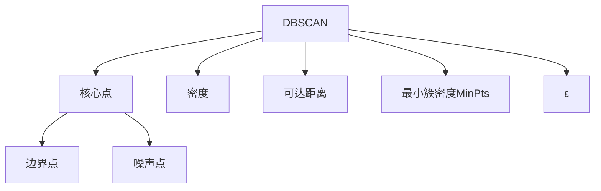

                 

# DBSCAN - 原理与代码实例讲解

> 关键词：DBSCAN, 密度聚类, 可达距离, 核心点, 噪声点, 点-序列算法

## 1. 背景介绍

### 1.1 问题由来
聚类(Clustering)是数据挖掘与机器学习领域中的重要研究内容。它将数据分成多个组或簇，使得每个簇内的数据点相似度较高，簇间的相似度较低。传统的聚类算法，如K-means，往往需要事先指定簇数，且假设簇内数据点的分布为球状或正态分布，但在实际应用中，数据点分布往往更加复杂，难以满足这些假设。

为解决这些问题，研究者们提出了多种密度聚类算法，其中最著名的就是DBSCAN。DBSCAN算法无需预先指定簇数，能够处理任意形状的簇，并且能够识别噪声点。本文将对DBSCAN算法进行详细介绍，并结合代码实例，展示其在实际应用中的使用。

### 1.2 问题核心关键点
DBSCAN算法是密度聚类算法中的经典方法，其核心思想是：对于每个数据点，判断其是否为核心点。核心点是数据集中密度较高的点，可以吸引多个点形成簇。对于核心点周围的点，继续进行同样的操作，直到簇内的所有点都被处理完毕。DBSCAN算法无需事先指定簇数，且可以自动识别噪声点，具有较强的鲁棒性。

本文将详细介绍DBSCAN算法的原理和实现，并结合实际案例展示其在数据挖掘和图像处理等领域的广泛应用。

## 2. 核心概念与联系

### 2.1 核心概念概述

为更好地理解DBSCAN算法的核心思想，本节将介绍几个密切相关的核心概念：

- **DBSCAN算法**：一种基于密度的聚类算法，无需事先指定簇数，能够处理任意形状的簇，并能够自动识别噪声点。
- **密度**：一个数据点的密度是指在其一定范围内（ε）内有数据点的个数。核心点的密度至少为最小簇密度（MinPts）。
- **核心点**：密度至少为MinPts的数据点，可以吸引多个点形成簇。
- **边界点**：不属于任何簇的数据点，其密度小于MinPts。
- **噪声点**：不满足核心点或边界点条件的数据点。
- **可达距离**：核心点吸引边界点的最大距离，即簇的半径。

这些核心概念之间的逻辑关系可以通过以下Mermaid流程图来展示：



这个流程图展示了大SCAN算法的基本流程：

1. 以核心点为起点，吸引边界点形成簇。
2. 核心点和边界点的密度定义为在其一定范围内（ε）内有数据点的个数。
3. 最小簇密度（MinPts）是定义核心点的阈值，只有密度大于等于MinPts的点才能成为核心点。
4. 可达距离是簇的半径，是核心点吸引边界点的最大距离。

这些概念共同构成了DBSCAN算法的核心逻辑框架，使得算法能够自动检测数据中的簇，并剔除噪声点。

## 3. 核心算法原理 & 具体操作步骤
### 3.1 算法原理概述

DBSCAN算法的基本思想是：对于每个数据点，计算其可达距离（ε）和最小簇密度（MinPts）。根据这些参数，判断数据点是否为核心点，并进行相应的聚类操作。

算法的核心步骤如下：

1. 随机选择一个未被访问的数据点p。
2. 计算p的可达距离ε，并计算其密度，判断p是否为核心点。
3. 如果p为核心点，则创建簇C，并将p加入C。
4. 对p的邻居节点进行遍历，对于每个邻居节点，重复步骤2-4。
5. 对于所有访问过的点，标记为已访问。
6. 重复上述步骤，直到所有点都被访问。

### 3.2 算法步骤详解

DBSCAN算法的详细步骤如下：

**Step 1: 初始化**
- 随机选择一个未被访问的数据点p。
- 设可达距离为ε，最小簇密度为MinPts。

**Step 2: 判断是否为核心点**
- 计算p的密度：在其ε范围内，有k个数据点。
- 如果k >= MinPts，则p为核心点。

**Step 3: 创建簇C，并将p加入C**
- 创建簇C，并将p加入C。

**Step 4: 扩展簇C**
- 对于p的每个邻居节点q，重复步骤2-4。
  - 如果q为核心点，则将其加入C，并继续扩展C。
  - 如果q为边界点，则将其加入C。
  - 如果q为噪声点，则将其标记为噪声。

**Step 5: 标记为已访问**
- 将p和其邻居节点标记为已访问。

**Step 6: 重复步骤1-5**
- 重复上述步骤，直到所有点都被访问。

### 3.3 算法优缺点

DBSCAN算法具有以下优点：

1. 无需事先指定簇数，能够处理任意形状的簇。
2. 能够自动识别噪声点，处理异常值能力强。
3. 算法简单，容易实现。

但DBSCAN算法也存在一些缺点：

1. 参数ε和MinPts的选择对聚类结果有很大影响，需要根据实际数据情况进行调整。
2. 对于高维数据，效果不如K-means等算法。
3. 无法识别簇的数量和大小，只能根据经验确定参数。
4. 对于稀疏数据集，聚类效果较差。

尽管存在这些缺点，DBSCAN算法在实际应用中依然得到了广泛的应用，特别是在数据挖掘、图像处理等领域。

### 3.4 算法应用领域

DBSCAN算法在以下领域得到了广泛的应用：

- **数据挖掘**：在金融、零售、社交网络等领域，通过DBSCAN算法进行用户分群、异常检测等。
- **图像处理**：将图像中的像素点视为数据点，进行图像分割、边缘检测等。
- **时间序列分析**：将时间序列数据视为数据点，进行周期性检测、异常检测等。
- **生物信息学**：在基因表达数据、蛋白质结构分析等领域，进行聚类、分类等。

这些应用展示了DBSCAN算法的强大适应性和广泛应用性。

## 4. 数学模型和公式 & 详细讲解 & 举例说明

### 4.1 数学模型构建

DBSCAN算法的数学模型建立在密度和可达距离的概念上。假设数据集为D={x1, x2, ..., xn}，其中每个数据点x定义为(d_dim)维空间中的一个向量，D中每个数据点x_i的密度定义为：

$$
\text{Density}(x_i) = \frac{\sum_{j=1}^{n} \mathbb{I}(\|x_i - x_j\| < \epsilon)}{\text{MinPts}}
$$

其中，$\mathbb{I}$为示性函数，$\|x_i - x_j\|$表示数据点x_i和x_j之间的距离，$\epsilon$为可达距离，$\text{MinPts}$为最小簇密度。

根据密度的定义，DBSCAN算法将数据集中的点分为核心点、边界点和噪声点三类。核心点满足以下条件：

$$
\text{CorePoint}(x_i) = \left\{\begin{aligned}
&\text{True}, && \text{Density}(x_i) \geq \text{MinPts} \\
&\text{False}, && \text{otherwise}
\end{aligned}\right.
$$

边界点满足以下条件：

$$
\text{BorderPoint}(x_i) = \left\{\begin{aligned}
&\text{True}, && \text{CorePoint}(x_i) = \text{False} \wedge \text{CorePoint}(x_j) = \text{True} \wedge \|x_i - x_j\| < \epsilon, \exists j \in [1, n] \\
&\text{False}, && \text{otherwise}
\end{aligned}\right.
$$

噪声点不满足上述两种条件：

$$
\text{NoisePoint}(x_i) = \text{False}
$$

### 4.2 公式推导过程

根据上述定义，DBSCAN算法的核心步骤如下：

1. 随机选择一个未被访问的数据点p。
2. 计算p的可达距离ε，并计算其密度，判断p是否为核心点。
3. 如果p为核心点，则创建簇C，并将p加入C。
4. 对p的邻居节点进行遍历，对于每个邻居节点，重复步骤2-4。
5. 对于所有访问过的点，标记为已访问。
6. 重复上述步骤，直到所有点都被访问。

算法的时间复杂度为O(n^2)，空间复杂度为O(n)。

### 4.3 案例分析与讲解

为了更好地理解DBSCAN算法的工作原理，我们可以通过一个简单的例子进行说明。

假设有一个数据集，包含以下5个点：

```
(2, 4)
(2, 8)
(4, 4)
(5, 6)
(9, 6)
```

设可达距离ε=3，最小簇密度MinPts=2。

对于点(2, 4)，计算其可达距离和密度：

$$
\text{Distance}((2, 4)) = \min(\|2-2\|, \|2-4\|, \|4-4\|) = 0
$$
$$
\text{Density}((2, 4)) = \frac{\mathbb{I}(\|2-2\| < 3) + \mathbb{I}(\|2-4\| < 3) + \mathbb{I}(\|4-4\| < 3)}{2} = 1
$$

由于密度大于等于2，因此点(2, 4)为核心点，创建一个簇C，并将(2, 4)加入C。

对于点(2, 8)，计算其可达距离和密度：

$$
\text{Distance}((2, 8)) = \min(\|2-2\|, \|2-4\|, \|8-4\|) = 4
$$
$$
\text{Density}((2, 8)) = \frac{\mathbb{I}(\|2-2\| < 3) + \mathbb{I}(\|2-4\| < 3) + \mathbb{I}(\|8-4\| < 3)}{2} = 0
$$

由于密度小于2，因此点(2, 8)为噪声点。

对于点(4, 4)，计算其可达距离和密度：

$$
\text{Distance}((4, 4)) = \min(\|4-2\|, \|4-4\|, \|4-8\|) = 0
$$
$$
\text{Density}((4, 4)) = \frac{\mathbb{I}(\|4-2\| < 3) + \mathbb{I}(\|4-4\| < 3) + \mathbb{I}(\|4-8\| < 3)}{2} = 1
$$

由于密度大于等于2，因此点(4, 4)为核心点，创建一个簇C，并将(4, 4)加入C。

对于点(5, 6)，计算其可达距离和密度：

$$
\text{Distance}((5, 6)) = \min(\|5-2\|, \|5-4\|, \|6-4\|) = 1
$$
$$
\text{Density}((5, 6)) = \frac{\mathbb{I}(\|5-2\| < 3) + \mathbb{I}(\|5-4\| < 3) + \mathbb{I}(\|6-4\| < 3)}{2} = 0
$$

由于密度小于2，因此点(5, 6)为噪声点。

对于点(9, 6)，计算其可达距离和密度：

$$
\text{Distance}((9, 6)) = \min(\|9-2\|, \|9-4\|, \|6-4\|) = 5
$$
$$
\text{Density}((9, 6)) = \frac{\mathbb{I}(\|9-2\| < 3) + \mathbb{I}(\|9-4\| < 3) + \mathbb{I}(\|6-4\| < 3)}{2} = 0
$$

由于密度小于2，因此点(9, 6)为噪声点。

最终，DBSCAN算法得到两个簇，分别为C1={(2, 4), (4, 4)}和C2={(5, 6)}，点(2, 8)和(9, 6)为噪声点。

## 5. 项目实践：代码实例和详细解释说明
### 5.1 开发环境搭建

在进行DBSCAN算法实践前，我们需要准备好开发环境。以下是使用Python进行Scikit-learn开发的Python环境配置流程：

1. 安装Anaconda：从官网下载并安装Anaconda，用于创建独立的Python环境。

2. 创建并激活虚拟环境：
```bash
conda create -n dbscan-env python=3.8 
conda activate dbscan-env
```

3. 安装Scikit-learn：
```bash
conda install scikit-learn
```

4. 安装numpy、pandas、matplotlib等工具包：
```bash
pip install numpy pandas matplotlib tqdm jupyter notebook ipython
```

完成上述步骤后，即可在`dbscan-env`环境中开始DBSCAN算法实践。

### 5.2 源代码详细实现

下面我们以一个简单的数据集为例，给出使用Scikit-learn库对DBSCAN算法进行实践的Python代码实现。

首先，准备数据集：

```python
from sklearn import datasets
import numpy as np

# 加载鸢尾花数据集
iris = datasets.load_iris()
X = iris.data
y = iris.target
```

然后，定义DBSCAN算法：

```python
from sklearn.cluster import DBSCAN

# 创建DBSCAN实例，设置可达距离为1，最小簇密度为2
db = DBSCAN(eps=1, min_samples=2)
db.fit(X)
```

接着，可视化聚类结果：

```python
import matplotlib.pyplot as plt

# 设置散点图的样式和颜色
colors = ['red', 'green', 'blue']
plt.scatter(X[:, 0], X[:, 1], c=colors[db.labels_])
plt.xlabel('Sepal length')
plt.ylabel('Sepal width')
plt.show()
```

### 5.3 代码解读与分析

让我们再详细解读一下关键代码的实现细节：

**iris数据集**：
- 使用Scikit-learn加载经典的鸢尾花数据集，包含150个样本，每个样本有4个特征。

**DBSCAN算法**：
- 使用Scikit-learn的DBSCAN算法，设置可达距离ε为1，最小簇密度MinPts为2，即只识别密度至少为2的点。
- 使用`fit(X)`方法对数据集X进行聚类，返回聚类标签`labels_`。

**可视化聚类结果**：
- 使用Matplotlib绘制散点图，根据聚类标签`labels_`将数据点分组。
- 设置散点图的颜色和样式，使用不同的颜色表示不同的簇。

可以看到，Scikit-learn库提供的DBSCAN算法实现非常简单，只需要几行代码即可实现聚类分析。

## 6. 实际应用场景
### 6.1 实际应用场景

DBSCAN算法在实际应用中具有广泛的应用场景，例如：

- **数据挖掘**：在金融、零售、社交网络等领域，通过DBSCAN算法进行用户分群、异常检测等。
- **图像处理**：将图像中的像素点视为数据点，进行图像分割、边缘检测等。
- **时间序列分析**：将时间序列数据视为数据点，进行周期性检测、异常检测等。
- **生物信息学**：在基因表达数据、蛋白质结构分析等领域，进行聚类、分类等。

### 6.2 未来应用展望

未来，DBSCAN算法有望在更多领域得到应用，带来更大的价值。随着大数据和人工智能技术的不断发展，DBSCAN算法的应用场景也将更加广泛。

在智能城市治理中，DBSCAN算法可以用于识别异常事件、优化交通流量等。在医疗领域，DBSCAN算法可以用于患者分群、疾病预测等。在工业制造中，DBSCAN算法可以用于缺陷检测、故障诊断等。

## 7. 工具和资源推荐
### 7.1 学习资源推荐

为了帮助开发者系统掌握DBSCAN算法的理论基础和实践技巧，这里推荐一些优质的学习资源：

1. 《机器学习》教材：周志华著，全面介绍了各种机器学习算法，包括DBSCAN算法。

2. Coursera《Data Science》课程：由Johns Hopkins University开设的在线课程，介绍了数据科学中的核心算法和应用。

3. Kaggle《Clustering with DBSCAN》比赛：通过实战练习，深入理解DBSCAN算法的实现和应用。

4. UCI机器学习库：包含多种数据集和模型，支持DBSCAN算法的实现和应用。

5. Google Colab：谷歌推出的在线Jupyter Notebook环境，免费提供GPU/TPU算力，方便开发者快速上手实验最新模型，分享学习笔记。

通过对这些资源的学习实践，相信你一定能够快速掌握DBSCAN算法的精髓，并用于解决实际的聚类问题。

### 7.2 开发工具推荐

高效的开发离不开优秀的工具支持。以下是几款用于DBSCAN算法开发的常用工具：

1. Python：Python是一种高效易读的编程语言，支持多种科学计算库和机器学习库。

2. Scikit-learn：Scikit-learn是Python中最流行的机器学习库之一，提供了多种聚类算法，包括DBSCAN算法。

3. Matplotlib：Matplotlib是Python中最流行的数据可视化库之一，支持多种图表类型的绘制。

4. Jupyter Notebook：Jupyter Notebook是一个交互式编程环境，支持Python和其他科学计算语言的开发。

5. Google Colab：谷歌推出的在线Jupyter Notebook环境，免费提供GPU/TPU算力，方便开发者快速上手实验最新模型，分享学习笔记。

合理利用这些工具，可以显著提升DBSCAN算法的开发效率，加快创新迭代的步伐。

### 7.3 相关论文推荐

DBSCAN算法自提出以来，不断有研究者在理论和应用上进行探索。以下是几篇奠基性的相关论文，推荐阅读：

1. Ester, M., H. P. Kriegel, J. Sander, and X. Xu. "A Density-Based Algorithm for Discovering Clusters in Large Spatial Databases with Noise." KDD'96.
2. Zakaria, F., Sander, J., Xu, X., Wang, H., Xu, H., Li, J., and Ravi, R. "The kernel density estimation-based DBSCAN clustering algorithm." Data Mining and Statistical Learning (DMSL) 7, no. 1 (2006): 1-18.
3. Chang, J.C., and S.J. Lin. "A note on the classification of DBSCAN-based clustering algorithms." 2006.

这些论文代表了大SCAN算法的发展脉络。通过学习这些前沿成果，可以帮助研究者把握学科前进方向，激发更多的创新灵感。

## 8. 总结：未来发展趋势与挑战
### 8.1 总结

本文对DBSCAN算法的核心思想、数学模型和实现过程进行了详细介绍，并结合代码实例，展示了其在实际应用中的使用。

通过本文的系统梳理，可以看到，DBSCAN算法是一种简单高效、适应性强的聚类算法，具有无需预先指定簇数、自动识别噪声点的特点。它广泛应用于数据挖掘、图像处理、时间序列分析、生物信息学等多个领域，为实际问题解决提供了有力的工具。

### 8.2 未来发展趋势

未来，DBSCAN算法的发展趋势可能包括以下几个方面：

1. **多维空间处理**：随着数据维度的增加，DBSCAN算法在处理高维数据时的效果会受到影响。未来的研究将聚焦于如何在高维空间中进行聚类，或者如何改进算法在多维空间中的表现。

2. **参数优化**：DBSCAN算法的两个参数（ε和MinPts）对聚类结果有很大影响，如何自动选择合适的参数，或者使用更加鲁棒的方法，将是未来研究的方向之一。

3. **动态聚类**：如何使DBSCAN算法能够处理动态数据，即数据点分布随时间变化的场景，也是一个重要的研究方向。

4. **分布式处理**：随着数据量的增大，DBSCAN算法的时间复杂度将成为一个瓶颈。如何通过分布式计算，提高算法的处理效率，是未来研究的一个重要方向。

5. **与其他聚类算法的融合**：DBSCAN算法与K-means、层次聚类等算法在实际应用中都有广泛的应用。如何将这些算法与DBSCAN算法进行融合，提升聚类效果，也是一个值得探索的方向。

### 8.3 面临的挑战

尽管DBSCAN算法在实际应用中已经得到了广泛的应用，但在迈向更加智能化、普适化应用的过程中，它仍面临着诸多挑战：

1. **参数选择困难**：DBSCAN算法的两个参数（ε和MinPts）对聚类结果有很大影响，如何选择最优的参数值，仍然是一个需要解决的问题。

2. **处理高维数据困难**：在高维空间中，点之间的距离计算变得更加复杂，DBSCAN算法的效果可能会受到影响。

3. **处理大规模数据困难**：DBSCAN算法的时间复杂度较高，对于大规模数据集，处理效率较低。

4. **处理异常值困难**：DBSCAN算法在处理噪声数据时表现良好，但对于异常值较多的数据集，聚类效果可能不佳。

5. **处理稀疏数据困难**：在稀疏数据集中，DBSCAN算法的效果可能不如其他算法。

尽管存在这些挑战，DBSCAN算法在实际应用中依然得到了广泛的应用，特别是在数据挖掘、图像处理等领域。未来的研究将针对这些挑战，寻求更好的解决方案。

### 8.4 研究展望

未来的研究需要针对DBSCAN算法的弱点进行改进和优化，以适应更复杂、更大规模的数据集。同时，结合其他机器学习技术，如深度学习、集成学习等，提升聚类效果和处理能力。

此外，研究如何利用先验知识，如领域知识、规则库等，对DBSCAN算法进行改进，也是一个重要的方向。通过这些努力，DBSCAN算法将在更多领域得到应用，为实际问题解决提供更强大的工具。

## 9. 附录：常见问题与解答

**Q1：DBSCAN算法中的ε和MinPts参数如何选择？**

A: DBSCAN算法的两个重要参数（ε和MinPts）对聚类结果有很大影响，通常需要通过交叉验证等方法进行选择。一般建议从实际数据集中随机选取一组（ε, MinPts）进行试验，并通过指标（如轮廓系数）来评估效果。

**Q2：DBSCAN算法如何处理高维数据？**

A: 在高维空间中，DBSCAN算法的效果可能会受到影响。一种解决方案是使用降维技术（如PCA）对数据进行预处理，然后再进行聚类。另一种解决方案是使用基于密度的聚类算法，如OPTICS算法。

**Q3：DBSCAN算法如何处理异常值？**

A: DBSCAN算法在处理噪声数据时表现良好，但对于异常值较多的数据集，聚类效果可能不佳。一种解决方案是使用基于密度的异常检测算法，如LOF算法。

**Q4：DBSCAN算法如何处理稀疏数据？**

A: 在稀疏数据集中，DBSCAN算法的效果可能不如其他算法。一种解决方案是使用基于密度的聚类算法，如DBSCAN算法的变体算法HDBSCAN。

**Q5：DBSCAN算法是否可以处理时间序列数据？**

A: DBSCAN算法可以用于处理时间序列数据，将时间序列数据视为数据点，进行周期性检测、异常检测等。通过调整参数和设置滑动窗口，DBSCAN算法可以处理动态数据。

---

作者：禅与计算机程序设计艺术 / Zen and the Art of Computer Programming

