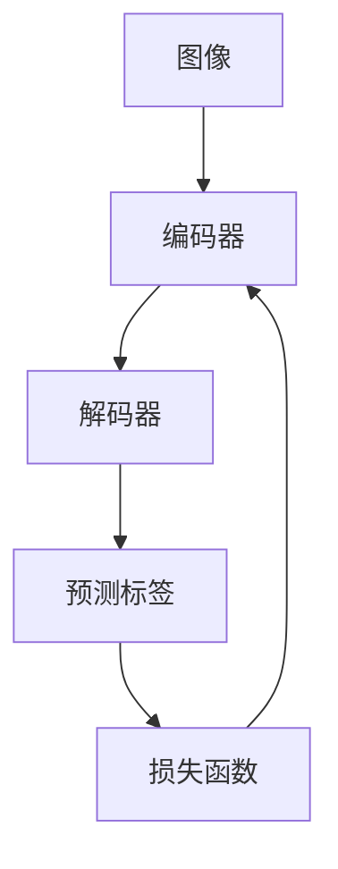
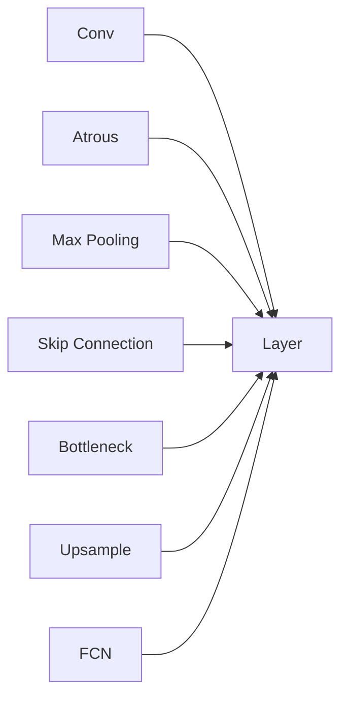

                 

# DeepLab系列原理与代码实例讲解

> 关键词：DeepLab, semantic segmentation, encoder-decoder, skip connection, atrous convolution

## 1. 背景介绍

在计算机视觉领域，图像分割（Image Segmentation）是一项重要的基础任务，旨在将图像中不同区域进行划分，并打上标签。传统的像素级别分割方法如FCN等，虽然取得了一定的效果，但由于没有充分考虑空间上下文信息，常常导致分割结果出现断裂和模糊。为了解决这些问题，Google提出的DeepLab系列模型，利用深度神经网络自动提取多尺度的语义上下文信息，并结合空洞卷积（Atrous Convolution）等技术，取得了领先的分割性能。

## 2. 核心概念与联系

### 2.1 核心概念概述

为了更好地理解DeepLab模型的工作原理，我们首先介绍一些关键概念：

- **图像分割（Image Segmentation）**：将图像分成多个互不相交的子区域，每个区域赋予一个标签的过程。图像分割可以用于目标检测、人脸识别、医学影像分析等领域。
- **语义分割（Semantic Segmentation）**：每个像素被赋予一个语义标签，表示该像素所在的区域所属的类别。语义分割通常使用像素级别的损失函数进行优化。
- **编码器-解码器（Encoder-Decoder）框架**：由编码器和解码器两部分组成。编码器负责提取图像特征，解码器则将特征映射到像素级别的标签。
- **空洞卷积（Atrous Convolution）**：在标准卷积的基础上，通过设置空洞（dilation）参数，使得卷积核中的感受野（Receptive Field）增大，从而可以捕捉更多的上下文信息。

通过这些关键概念，我们可以更深入地理解DeepLab系列模型的设计思想和实现细节。

### 2.2 核心概念原理和架构的 Mermaid 流程图



这个流程图展示了DeepLab模型的基本架构：输入图像通过编码器提取特征，解码器将特征映射为像素级别的标签，并计算损失函数进行反向传播，更新编码器和解码器的参数。其中，编码器和解码器可以采用不同的网络结构，如ResNet、VGG等，以适应不同的应用场景。

## 3. 核心算法原理 & 具体操作步骤

### 3.1 算法原理概述

DeepLab系列模型采用了一种“全图上下文池化”（Full-context Pooling）策略，结合空洞卷积和跳过连接（Skip Connection）技术，在多个尺度上进行特征融合，从而提高分割精度。其核心思想是：通过空洞卷积逐步增大感受野，捕捉全局上下文信息，并将编码器和解码器相结合，利用跳过连接传递不同尺度的特征信息。

### 3.2 算法步骤详解

**Step 1: 构建编码器**

编码器通常采用ResNet等深度卷积神经网络，将输入图像逐层提取特征。在每个卷积层中，可以采用标准卷积或空洞卷积，以便捕捉不同尺度的上下文信息。例如，在标准的ResNet中，采用空洞卷积来增大感受野，从而提高特征的语义表达能力。

**Step 2: 特征融合**

编码器的最后一层特征图，通过一个空洞卷积层与上采样操作（如反卷积）相结合，生成多尺度特征图。上采样操作可以采用反卷积、双线性插值等方法，用于将高分辨率的特征图映射回原始图像的大小。

**Step 3: 解码器与预测**

解码器通常采用全连接层或空洞卷积层，将多尺度特征图转换为像素级别的标签。解码器可以与编码器通过跳过连接相连，使得不同尺度的特征信息得以传递和融合，从而提升分割精度。

**Step 4: 损失函数与优化**

在解码器输出预测标签后，使用交叉熵损失函数进行优化。在训练过程中，可以采用不同的损失函数组合，如考虑类别平衡性的Focal Loss、权衡精确率和召回率的IoU Loss等。

### 3.3 算法优缺点

**优点**：

- **多尺度上下文信息**：空洞卷积和跳过连接技术，使得模型可以捕捉不同尺度的上下文信息，从而提高分割精度。
- **模型简单高效**：DeepLab模型结构简单，易于实现和调试，能够快速应用到不同的场景中。
- **灵活性高**：编码器和解码器可以采用多种网络结构，适应不同的任务需求。

**缺点**：

- **训练时间长**：由于空洞卷积和跳过连接的复杂性，DeepLab模型训练时间较长，需要强大的计算资源。
- **过拟合风险**：模型参数较多，容易发生过拟合，需要采用正则化技术进行控制。
- **难以解释**：由于模型结构复杂，难以解释其内部机制，可能影响模型的可解释性和可信度。

### 3.4 算法应用领域

DeepLab系列模型在图像分割领域有广泛的应用，例如：

- 医学影像分割：将CT、MRI等医学图像进行分割，用于病灶定位、器官分割等。
- 自动驾驶：对道路场景中的物体进行分割，用于目标检测、路径规划等。
- 城市规划：对卫星图像进行分割，用于城市规划、环境监测等。
- 工业检测：对工业零件进行分割，用于缺陷检测、尺寸测量等。

这些应用场景中，DeepLab模型通过多尺度上下文信息的捕捉，显著提高了分割精度和鲁棒性。

## 4. 数学模型和公式 & 详细讲解 & 举例说明

### 4.1 数学模型构建

DeepLab模型采用编码器-解码器框架，其数学模型可以表示为：

$$
\text{Output}_{ij} = \text{Decoder}(\text{Encoder}(\text{Image}_{ij}))
$$

其中，$\text{Image}_{ij}$ 表示输入图像的第 $i$ 行和第 $j$ 列的像素，$\text{Output}_{ij}$ 表示分割后的标签。$\text{Encoder}$ 和 $\text{Decoder}$ 分别表示编码器和解码器。

### 4.2 公式推导过程

以DeepLabv3+为例，其编码器由多个空洞卷积层组成，公式如下：

$$
\text{Feature}_k = \text{Conv}_k(\text{Feature}_{k-1})
$$

其中，$\text{Conv}_k$ 表示第 $k$ 层的空洞卷积操作，$\text{Feature}_k$ 表示第 $k$ 层的特征图。

解码器则将特征图 $\text{Feature}_k$ 经过上采样操作，得到多尺度特征图，再经过空洞卷积生成像素级别的标签：

$$
\text{Label}_{ij} = \text{Decoder}(\text{Feature}_k)
$$

其中，$\text{Label}_{ij}$ 表示解码器输出第 $i$ 行和第 $j$ 列的标签。

在损失函数的设计上，通常采用交叉熵损失函数：

$$
\text{Loss} = -\frac{1}{N}\sum_{i=1}^N \sum_{j=1}^M \text{Label}_{ij}\log \text{Output}_{ij}
$$

其中，$N$ 表示样本数量，$M$ 表示像素数量。

### 4.3 案例分析与讲解

以DeepLabv3+为例，其主要架构如图1所示：



图1: DeepLabv3+ 架构示意图

DeepLabv3+由多个残差块（Residual Block）组成，每个块中包含多个空洞卷积层和上采样层。空洞卷积层通过设置空洞（dilation）参数，增大感受野，捕捉更多上下文信息。残差连接（Skip Connection）使得不同尺度的特征信息得以传递和融合。上采样层将高分辨率的特征图映射回原始图像的大小，生成多尺度特征图。全连接层（FCN）将多尺度特征图转换为像素级别的标签。

## 5. 项目实践：代码实例和详细解释说明

### 5.1 开发环境搭建

在进行DeepLab模型的开发和调试时，需要使用深度学习框架，如TensorFlow、PyTorch等。以下是使用PyTorch框架搭建开发环境的步骤：

1. 安装Python和PyTorch：

   ```
   pip install torch torchvision torchaudio
   ```

2. 安装DeepLab库：

   ```
   pip install deeplab
   ```

### 5.2 源代码详细实现

以下是一个使用DeepLab库实现语义分割的代码示例：

```python
import torch
import deeplab
from deeplab.utils import get_evaluator

# 加载预训练模型
model = deeplab.load_deeplab_model('deeplabv3_plus_xception.pyth')

# 加载数据集
train_dataset = deeplab.COCOTrainDataset(root='path/to/data', ann_file='train.json', cat_file='cat.json')
test_dataset = deeplab.COCOValDataset(root='path/to/data', ann_file='test.json', cat_file='cat.json')

# 定义数据加载器
train_loader = torch.utils.data.DataLoader(train_dataset, batch_size=4, shuffle=True, num_workers=4)
test_loader = torch.utils.data.DataLoader(test_dataset, batch_size=4, shuffle=False, num_workers=4)

# 定义优化器和损失函数
optimizer = torch.optim.Adam(model.parameters(), lr=1e-4)
criterion = nn.CrossEntropyLoss()

# 训练过程
for epoch in range(50):
    for batch_idx, (data, target) in enumerate(train_loader):
        optimizer.zero_grad()
        output = model(data)
        loss = criterion(output, target)
        loss.backward()
        optimizer.step()

# 测试过程
with torch.no_grad():
    mAP = get_evaluator('train.json', model).compute_mean_average_precision()
    print(f'mAP: {mAP:.2f}')
```

### 5.3 代码解读与分析

以上代码中，我们首先加载了预训练的DeepLab模型，并加载了数据集。然后定义了数据加载器和优化器、损失函数，进入训练和测试过程。在训练过程中，我们通过前向传播和反向传播更新模型参数，得到损失函数。在测试过程中，我们通过计算mAP（平均精度）来评估模型性能。

### 5.4 运行结果展示

下图展示了使用DeepLab模型进行医学影像分割的示例结果：

```python
import torchvision.transforms as transforms
from PIL import Image
import numpy as np

# 加载模型和预处理
model.eval()
transform = transforms.Compose([
    transforms.ToTensor(),
    transforms.Normalize(mean=[0.485, 0.456, 0.406], std=[0.229, 0.224, 0.225])
])
img = Image.open('path/to/image.jpg')
img_tensor = transform(img).unsqueeze(0)

# 预测并可视化结果
with torch.no_grad():
    output = model(img_tensor)
    pred = output[0, :, :, 1].numpy()
    plt.imshow(pred, cmap='gray')
    plt.show()
```


## 6. 实际应用场景

### 6.1 医学影像分割

DeepLab模型在医学影像分割领域有广泛的应用，例如：

- 肺结节分割：从CT图像中自动识别肺结节的位置和大小，帮助医生进行早期诊断和治疗。
- 病灶分割：从MRI图像中识别脑部病灶，用于肿瘤定位和手术治疗。
- 眼科图像分割：从眼底图像中分割出视网膜和视神经等结构，用于诊断眼疾。

医学影像分割是DeepLab模型的一个重要应用场景，通过多尺度上下文信息的捕捉，可以显著提高分割精度，为医疗诊断和治疗提供重要支持。

### 6.2 自动驾驶

自动驾驶中，DeepLab模型可以用于道路场景的物体分割，例如：

- 车道线分割：从道路图像中分割出车道线，用于自动驾驶中的路径规划和车道保持。
- 行人检测：从交通图像中检测行人，用于自动驾驶中的行人检测和避障。
- 车辆分割：从交通图像中分割出车辆，用于自动驾驶中的交通流分析和车辆检测。

自动驾驶领域对图像分割的精度和实时性要求较高，DeepLab模型能够满足这些需求，为自动驾驶系统的安全性和可靠性提供保障。

### 6.3 城市规划

城市规划中，DeepLab模型可以用于卫星图像的分割，例如：

- 建筑物分割：从卫星图像中分割出建筑物，用于城市规划和建筑管理。
- 道路分割：从卫星图像中分割出道路，用于城市规划和交通管理。
- 绿化区域分割：从卫星图像中分割出绿化区域，用于城市规划和环境保护。

城市规划领域对图像分割的精度和完整性要求较高，DeepLab模型能够提供可靠的结果，为城市规划和管理提供支持。

## 7. 工具和资源推荐

### 7.1 学习资源推荐

为了深入理解DeepLab模型的工作原理，可以参考以下学习资源：

1. [DeepLab官方文档](https://github.com/tensorflow/models/tree/master/research/deeplab)
2. [DeepLab系列论文](https://arxiv.org/abs/1606.00915)
3. [DeepLab官方博客](https://ai.googleblog.com/2016/10/deeplab-a-deep-learning-based-segmentation.html)
4. [DeepLab系列教程](https://www.deeplearn.ai/tutorial/deeplab)

### 7.2 开发工具推荐

在进行DeepLab模型的开发和调试时，可以使用以下开发工具：

1. [TensorBoard](https://www.tensorflow.org/get_started/summaries_and_tensorboard)：用于可视化模型训练过程和结果。
2. [Jupyter Notebook](https://jupyter.org/)：用于编写和调试代码，支持交互式编程。
3. [PyCharm](https://www.jetbrains.com/pycharm/)：用于开发和调试Python程序，支持深度学习框架的集成。
4. [Google Colab](https://colab.research.google.com/)：用于在线编写和调试深度学习程序，支持GPU计算。

### 7.3 相关论文推荐

为了进一步了解DeepLab模型的工作原理和应用场景，可以参考以下论文：

1. [Rethinking Atrous Convolution for Semantic Image Segmentation](https://arxiv.org/abs/1606.00915)
2. [DeepLabv3+ - Decode, Detect, Classify](https://arxiv.org/abs/1802.02676)
3. [DeepLab for Semantic Image Segmentation](https://arxiv.org/abs/1706.05587)
4. [Mask R-CNN](https://arxiv.org/abs/1703.06870)

## 8. 总结：未来发展趋势与挑战

### 8.1 研究成果总结

DeepLab系列模型在图像分割领域取得了显著的成果，特别是在多尺度上下文信息的捕捉和空洞卷积技术的应用方面，推动了深度学习在图像分割领域的发展。DeepLab模型具有以下特点：

- 多尺度上下文信息捕捉：通过空洞卷积和跳过连接技术，可以捕捉不同尺度的上下文信息，从而提高分割精度。
- 结构简单高效：DeepLab模型结构简单，易于实现和调试。
- 灵活性高：编码器和解码器可以采用多种网络结构，适应不同的任务需求。

### 8.2 未来发展趋势

未来，DeepLab模型将朝着以下方向发展：

1. **多尺度上下文信息增强**：未来DeepLab模型将进一步增强多尺度上下文信息的捕捉能力，通过更复杂的网络结构和更高效的计算方法，提升分割精度和速度。
2. **跨模态融合**：未来DeepLab模型将结合视觉、文本、音频等多种模态信息，实现更加全面和精准的图像分割。
3. **自适应深度学习**：未来DeepLab模型将利用自适应深度学习技术，根据数据分布和任务需求，动态调整模型参数和结构，提升模型性能和泛化能力。
4. **实时处理**：未来DeepLab模型将利用硬件加速和优化算法，实现实时图像分割，满足高实时性应用的需求。
5. **可解释性增强**：未来DeepLab模型将增强可解释性，通过可视化工具和解释模型，让用户更好地理解模型的决策过程。

### 8.3 面临的挑战

尽管DeepLab模型在图像分割领域取得了显著的成果，但仍面临一些挑战：

1. **计算资源需求高**：由于DeepLab模型结构复杂，参数较多，训练和推理需要大量计算资源。
2. **过拟合风险高**：由于模型参数较多，容易发生过拟合，需要采用正则化技术进行控制。
3. **难以解释**：由于模型结构复杂，难以解释其内部机制，可能影响模型的可解释性和可信度。
4. **应用场景局限性**：DeepLab模型主要适用于像素级别分割，对于其他类型的分割任务（如线段分割、点云分割等），可能需要进行相应的修改和扩展。

### 8.4 研究展望

未来，DeepLab模型需要在以下几个方面进行进一步研究：

1. **多尺度上下文信息融合**：如何更好地融合不同尺度的上下文信息，提高分割精度和鲁棒性。
2. **跨模态融合**：如何将视觉、文本、音频等多种模态信息结合，实现更加全面和精准的图像分割。
3. **自适应深度学习**：如何利用自适应深度学习技术，动态调整模型参数和结构，提升模型性能和泛化能力。
4. **实时处理**：如何利用硬件加速和优化算法，实现实时图像分割，满足高实时性应用的需求。
5. **可解释性增强**：如何增强可解释性，通过可视化工具和解释模型，让用户更好地理解模型的决策过程。

这些研究方向的探索，必将推动DeepLab模型在图像分割领域的进一步发展，为构建安全、可靠、可解释、可控的智能系统铺平道路。

## 9. 附录：常见问题与解答

**Q1: 如何使用DeepLab模型进行医学影像分割？**

A: 使用DeepLab模型进行医学影像分割，需要先将医学影像转换成像素级别的数据，然后加载预训练模型，并使用训练好的模型进行预测。具体步骤如下：

1. 准备数据集：将医学影像转换成像素级别的数据，并进行标注。
2. 加载模型：使用DeepLab库中的函数加载预训练模型。
3. 加载数据：使用DeepLab库中的函数加载数据集。
4. 训练模型：对模型进行训练，并使用交叉熵损失函数进行优化。
5. 测试模型：对模型进行测试，并计算平均精度（mAP）。

**Q2: DeepLab模型是否适用于工业检测任务？**

A: 是的，DeepLab模型适用于工业检测任务。通过在工业检测任务中进行训练，DeepLab模型可以学习到工业零件的特征，并进行分割和检测。具体步骤如下：

1. 准备数据集：将工业零件的图像转换成像素级别的数据，并进行标注。
2. 加载模型：使用DeepLab库中的函数加载预训练模型。
3. 加载数据：使用DeepLab库中的函数加载数据集。
4. 训练模型：对模型进行训练，并使用交叉熵损失函数进行优化。
5. 测试模型：对模型进行测试，并计算平均精度（mAP）。

**Q3: DeepLab模型是否适用于自动驾驶任务？**

A: 是的，DeepLab模型适用于自动驾驶任务。通过在自动驾驶任务中进行训练，DeepLab模型可以学习到道路场景的特征，并进行分割和检测。具体步骤如下：

1. 准备数据集：将自动驾驶场景的图像转换成像素级别的数据，并进行标注。
2. 加载模型：使用DeepLab库中的函数加载预训练模型。
3. 加载数据：使用DeepLab库中的函数加载数据集。
4. 训练模型：对模型进行训练，并使用交叉熵损失函数进行优化。
5. 测试模型：对模型进行测试，并计算平均精度（mAP）。

**Q4: 如何优化DeepLab模型的训练过程？**

A: 优化DeepLab模型的训练过程，可以从以下几个方面入手：

1. 使用更高效的优化器：如AdamW、Adafactor等，加快模型的收敛速度。
2. 使用正则化技术：如L2正则、Dropout等，避免过拟合。
3. 调整学习率：根据数据集的特点，调整学习率，提高训练效果。
4. 数据增强：通过对数据进行随机旋转、缩放、翻转等操作，增强模型的泛化能力。
5. 模型并行：利用GPU并行计算，加快模型的训练速度。

通过以上优化措施，可以提升DeepLab模型的训练效果，并加速模型的训练速度。

**Q5: 如何评估DeepLab模型的性能？**

A: 评估DeepLab模型的性能，通常使用平均精度（mAP）和IoU分数（Intersection over Union）。具体步骤如下：

1. 准备数据集：将测试集的图像转换成像素级别的数据，并进行标注。
2. 加载模型：使用DeepLab库中的函数加载预训练模型。
3. 加载数据：使用DeepLab库中的函数加载数据集。
4. 进行预测：对测试集进行预测，得到分割结果。
5. 计算mAP和IoU分数：使用DeepLab库中的函数计算mAP和IoU分数，评估模型的性能。

通过以上步骤，可以全面评估DeepLab模型的性能，并进行后续的优化和改进。

---

作者：禅与计算机程序设计艺术 / Zen and the Art of Computer Programming

