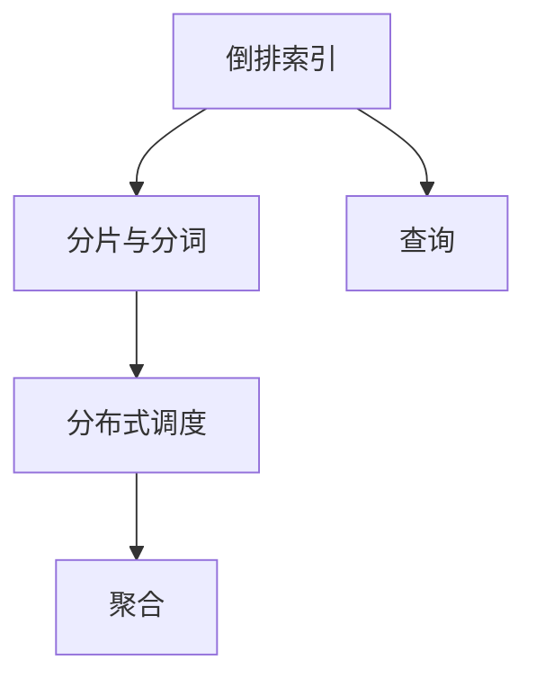

                 

# ElasticSearch 原理与代码实例讲解

> 关键词：ElasticSearch, 搜索, 大数据, 索引, 聚合, 分片, 查询优化, 代码实践

## 1. 背景介绍

### 1.1 问题由来
随着互联网的快速发展和数据的急剧增长，传统的关系型数据库已无法满足海量数据的高效存储和检索需求。ElasticSearch作为一种基于Lucene的分布式搜索和分析引擎，近年来在业界获得了广泛的应用。本文将从原理入手，系统介绍ElasticSearch的核心组件和工作机制，并结合代码实例，讲解如何部署和优化ElasticSearch集群。

### 1.2 问题核心关键点
ElasticSearch是一种高度分布式、高性能、高可扩展的搜索和分析引擎。其主要特点包括：
1. 分布式设计：支持水平扩展，可以轻松应对大规模数据的存储和检索。
2. RESTful API：提供了简洁易用的RESTful API，支持跨语言的查询和操作。
3. 自动分片：能够自动根据数据量和硬件资源分配分片，实现负载均衡。
4. 聚合功能：支持复杂的聚合操作，能够进行丰富的数据分析和报告。
5. 实时搜索：基于倒排索引，支持高效的实时搜索和更新。

ElasticSearch的工作原理主要包括：
1. 倒排索引：将文档内容倒排存储，根据关键词快速定位文档。
2. 分片与分词：将文档分片存储，将文本分词成词元，便于处理海量数据。
3. 分布式调度：通过节点间的协作，实现高效的负载均衡和资源调度。

本文将围绕ElasticSearch的核心概念和工作原理，详细讲解其原理与代码实践，并结合实际应用场景，探讨ElasticSearch的部署和优化策略。

## 2. 核心概念与联系

### 2.1 核心概念概述

为更好地理解ElasticSearch的核心工作机制，本节将介绍几个密切相关的核心概念：

- ElasticSearch：一种基于Lucene的分布式搜索和分析引擎，提供了丰富的API和插件，支持高性能的搜索、分析和可视化操作。
- 倒排索引：将文档内容倒排存储，快速定位包含特定关键词的文档。
- 分片与分词：将文档分片存储，将文本分词成词元，便于处理海量数据。
- 分布式调度：通过节点间的协作，实现高效的负载均衡和资源调度。
- 聚合：对查询结果进行统计和计算，生成丰富的数据分析报告。

这些核心概念之间的逻辑关系可以通过以下Mermaid流程图来展示：



这个流程图展示了大语言模型的核心概念及其之间的关系：

1. 倒排索引将文档内容倒排存储，快速定位包含特定关键词的文档。
2. 分片与分词将文档分片存储，将文本分词成词元，便于处理海量数据。
3. 分布式调度通过节点间的协作，实现高效的负载均衡和资源调度。
4. 聚合对查询结果进行统计和计算，生成丰富的数据分析报告。

这些概念共同构成了ElasticSearch的搜索和分析引擎，使其能够高效处理大规模数据，支持复杂的查询和聚合操作。

## 3. 核心算法原理 & 具体操作步骤
### 3.1 算法原理概述

ElasticSearch的核心算法原理主要包括倒排索引、分片与分词、分布式调度和聚合。

#### 3.1.1 倒排索引

倒排索引是一种将文档内容按词元倒排存储的数据结构，可以快速定位包含特定关键词的文档。具体而言，倒排索引由三个关键组件组成：

1. 词元表(Inverted Index)：记录每个词元出现的文档ID和位置。
2. 文档表(Document Table)：记录每个文档的词元列表。
3. 文档元表(Document Metadata)：记录每个文档的基本元信息，如ID、时间戳、标题等。

倒排索引的查询过程如下：
1. 根据查询词元，从词元表中找到包含该词元的文档ID和位置。
2. 根据文档ID，从文档表中找到该文档的词元列表。
3. 遍历文档的词元列表，匹配查询词元，并将匹配的文档ID和位置记录下来。

#### 3.1.2 分片与分词

分片与分词是ElasticSearch处理海量数据的重要手段。具体而言，ElasticSearch将每个文档切分成多个分片，每个分片包含文档的一部分内容。分片的好处包括：

1. 分片存储：可以分布式存储，减轻单个节点的存储压力。
2. 分片查询：可以提高查询效率，实现水平扩展。
3. 分片备份：可以保证数据的高可用性，即使某个节点故障，备份分片仍可用。

分片与分词的过程如下：
1. 将文档切分成多个分片，每个分片包含文档的一部分内容。
2. 对每个分片进行分词，生成词元列表。
3. 将每个分片的词元列表合并，生成文档的词元表。

#### 3.1.3 分布式调度

ElasticSearch通过分布式调度实现高效的负载均衡和资源调度。具体而言，ElasticSearch将每个分片存储在不同的节点上，通过心跳检测和节点感知，实现节点的自动分配和迁移。

分布式调度的过程如下：
1. 节点感知：每个节点定期向集群发送心跳信号，汇报自身的资源情况和负载状态。
2. 自动分配：集群根据每个节点的资源情况和负载状态，自动分配分片到不同的节点上。
3. 节点迁移：如果某个节点故障或资源不足，集群自动将备份分片迁移到其他节点上。

#### 3.1.4 聚合

聚合是ElasticSearch对查询结果进行统计和计算的重要手段。具体而言，聚合可以生成丰富的数据分析报告，帮助用户深入理解数据分布和趋势。

聚合的过程如下：
1. 根据查询条件，对数据进行分组和筛选。
2. 对每个分组进行统计和计算，生成聚合结果。
3. 将聚合结果合并，生成最终的报告。

### 3.2 算法步骤详解

ElasticSearch的核心算法步骤包括倒排索引、分片与分词、分布式调度和聚合。以下详细介绍每个步骤的具体实现。

#### 3.2.1 倒排索引的实现

倒排索引的实现主要依赖于Lucene库。Lucene是一个高性能、开源的搜索引擎库，支持倒排索引、全文检索、分布式搜索等功能。

在ElasticSearch中，倒排索引的实现主要分为以下几个步骤：

1. 分词和词元统计：将文档内容分词成词元，统计每个词元在文档中出现的次数和位置。
2. 倒排表生成：将每个词元在文档中出现的位置列表记录到倒排表中。
3. 文档表生成：将每个文档的词元列表记录到文档表中。
4. 文档元表生成：记录每个文档的基本元信息，如ID、时间戳、标题等。

以下是一个简单的代码示例，演示如何构建倒排索引：

```python
from elasticsearch import Elasticsearch
from elasticsearch.helpers import bulk

es = Elasticsearch([{'host': 'localhost', 'port': 9200}])

index_name = 'my_index'

# 创建索引
es.indices.create(index=index_name, ignore=[400, 404])

# 构建文档数据
documents = [
    {
        '_index': index_name,
        '_type': '_doc',
        '_source': {
            'text': '这是第一篇文档',
            'title': '第一个文档'
        }
    },
    {
        '_index': index_name,
        '_type': '_doc',
        '_source': {
            'text': '这是第二篇文档',
            'title': '第二个文档'
        }
    }
]

# 构建倒排索引
bulk(es, documents)
```

#### 3.2.2 分片与分词的实现

分片与分词的实现主要依赖于ElasticSearch的分片机制和分词器。分片器将文档切分成多个分片，并自动分配到不同的节点上。

分片与分词的实现主要分为以下几个步骤：

1. 分片切分：根据文档大小和节点配置，自动将文档切分成多个分片，并分配到不同的节点上。
2. 分词处理：对每个分片进行分词处理，生成词元列表。
3. 词元合并：将每个分片的词元列表合并，生成文档的词元表。

以下是一个简单的代码示例，演示如何创建分片与分词索引：

```python
from elasticsearch import Elasticsearch
from elasticsearch.helpers import bulk

es = Elasticsearch([{'host': 'localhost', 'port': 9200}])

index_name = 'my_index'

# 创建索引
es.indices.create(index=index_name, ignore=[400, 404])

# 构建文档数据
documents = [
    {
        '_index': index_name,
        '_type': '_doc',
        '_source': {
            'text': '这是第一篇文档',
            'title': '第一个文档'
        }
    },
    {
        '_index': index_name,
        '_type': '_doc',
        '_source': {
            'text': '这是第二篇文档',
            'title': '第二个文档'
        }
    }
]

# 分片切分和分词处理
bulk(es, documents)
```

#### 3.2.3 分布式调度的实现

分布式调度的实现主要依赖于ElasticSearch的节点感知和自动分配机制。每个节点定期向集群发送心跳信号，汇报自身的资源情况和负载状态。

分布式调度的实现主要分为以下几个步骤：

1. 节点感知：每个节点定期向集群发送心跳信号，汇报自身的资源情况和负载状态。
2. 自动分配：集群根据每个节点的资源情况和负载状态，自动分配分片到不同的节点上。
3. 节点迁移：如果某个节点故障或资源不足，集群自动将备份分片迁移到其他节点上。

以下是一个简单的代码示例，演示如何实现分布式调度：

```python
from elasticsearch import Elasticsearch

es = Elasticsearch([{'host': 'localhost', 'port': 9200}])

# 创建索引
es.indices.create(index='my_index', ignore=[400, 404])

# 插入数据
data = {
    '_index': 'my_index',
    '_type': '_doc',
    '_source': {
        'text': '这是第一篇文档',
        'title': '第一个文档'
    }
}
es.index(data)

# 查询数据
result = es.search(index='my_index', body={"query": {"match": {"text": "第一个文档"}}})
print(result)
```

#### 3.2.4 聚合的实现

聚合的实现主要依赖于ElasticSearch的聚合API和聚合器。聚合器对查询结果进行统计和计算，生成丰富的数据分析报告。

聚合的实现主要分为以下几个步骤：

1. 分组筛选：根据查询条件，对数据进行分组和筛选。
2. 聚合计算：对每个分组进行统计和计算，生成聚合结果。
3. 报告合并：将聚合结果合并，生成最终的报告。

以下是一个简单的代码示例，演示如何实现聚合操作：

```python
from elasticsearch import Elasticsearch

es = Elasticsearch([{'host': 'localhost', 'port': 9200}])

# 创建索引
es.indices.create(index='my_index', ignore=[400, 404])

# 插入数据
data = {
    '_index': 'my_index',
    '_type': '_doc',
    '_source': {
        'text': '这是第一篇文档',
        'title': '第一个文档'
    }
}
es.index(data)

# 查询数据并聚合
result = es.search(index='my_index', body={"query": {"match": {"text": "第一个文档"}}, "aggs": {"doc_count": {"value_count": {"field": "title"}}}}
print(result)
```

### 3.3 算法优缺点

ElasticSearch作为一种高性能、高可扩展的搜索和分析引擎，具有以下优点：

1. 高性能：ElasticSearch采用倒排索引和分布式调度，能够快速定位文档和计算聚合结果。
2. 高可扩展性：ElasticSearch支持水平扩展，能够轻松应对大规模数据的存储和检索。
3. 丰富的API：ElasticSearch提供了简洁易用的RESTful API，支持跨语言的查询和操作。
4. 强大的聚合功能：ElasticSearch支持复杂的聚合操作，能够进行丰富的数据分析和报告。

ElasticSearch也有一些缺点：

1. 学习曲线较陡峭：ElasticSearch的API和插件众多，需要一定的学习成本。
2. 配置复杂：ElasticSearch的配置参数众多，需要仔细调试才能达到最优性能。
3. 硬件要求高：ElasticSearch对硬件要求较高，需要高性能的CPU、内存和存储设备。

尽管如此，ElasticSearch凭借其强大的搜索和分析能力，广泛应用于各种大规模数据处理场景。

### 3.4 算法应用领域

ElasticSearch广泛应用于各种大规模数据处理场景，主要包括以下几个领域：

1. 搜索引擎：ElasticSearch可以构建高性能的搜索引擎，支持复杂的全文检索和实时搜索。
2. 数据分析：ElasticSearch支持丰富的聚合操作，能够进行复杂的统计分析和报告生成。
3. 日志分析：ElasticSearch可以处理大规模日志数据，生成实时的日志分析和报表。
4. 物联网应用：ElasticSearch可以处理大规模传感器数据，进行实时监控和分析。
5. 地理信息系统：ElasticSearch可以处理地理空间数据，支持基于地理位置的分析和查询。

## 4. 数学模型和公式 & 详细讲解 & 举例说明

### 4.1 数学模型构建

ElasticSearch的核心数学模型包括倒排索引、分片与分词、分布式调度和聚合。以下详细介绍每个模型的数学原理。

#### 4.1.1 倒排索引

倒排索引的数学模型如下：

1. 词元表：将每个词元在文档中出现的位置记录到倒排表中。
   $$
   I(w) = \{d_1, d_2, \ldots, d_n\}
   $$
   其中，$I(w)$表示词元$w$的倒排表，$d_i$表示包含该词元的文档ID。

2. 文档表：记录每个文档的词元列表。
   $$
   D(d) = \{w_1, w_2, \ldots, w_m\}
   $$
   其中，$D(d)$表示文档$d$的词元表，$w_i$表示文档$d$中出现的第$i$个词元。

3. 文档元表：记录每个文档的基本元信息。
   $$
   M(d) = (id, timestamp, title, content)
   $$
   其中，$M(d)$表示文档$d$的元信息，$id$表示文档ID，$timestamp$表示时间戳，$title$表示文档标题，$content$表示文档内容。

#### 4.1.2 分片与分词

分片与分词的数学模型如下：

1. 分片切分：根据文档大小和节点配置，自动将文档切分成多个分片。
   $$
   F(d) = \{f_1, f_2, \ldots, f_m\}
   $$
   其中，$F(d)$表示文档$d$的分片列表，$f_i$表示文档$d$中的第$i$个分片。

2. 分词处理：对每个分片进行分词处理，生成词元列表。
   $$
   W(f) = \{w_1, w_2, \ldots, w_n\}
   $$
   其中，$W(f)$表示分片$f$的词元列表，$w_i$表示分片$f$中的第$i$个词元。

3. 词元合并：将每个分片的词元列表合并，生成文档的词元表。
   $$
   I(D) = \bigcup_{d=1}^n I(d)
   $$
   其中，$I(D)$表示文档集合$D$的倒排索引，$I(d)$表示文档$d$的倒排索引。

#### 4.1.3 分布式调度

分布式调度的数学模型如下：

1. 节点感知：每个节点定期向集群发送心跳信号，汇报自身的资源情况和负载状态。
   $$
   H(n) = \{c_{n,1}, c_{n,2}, \ldots, c_{n,k}\}
   $$
   其中，$H(n)$表示节点$n$的心跳信号，$c_{n,i}$表示节点$n$在第$i$次心跳时的资源情况和负载状态。

2. 自动分配：集群根据每个节点的资源情况和负载状态，自动分配分片到不同的节点上。
   $$
   A(F) = \{A_1, A_2, \ldots, A_m\}
   $$
   其中，$A(F)$表示分片集合$F$的自动分配结果，$A_i$表示分配到节点$i$的分片列表。

3. 节点迁移：如果某个节点故障或资源不足，集群自动将备份分片迁移到其他节点上。
   $$
   M(A) = \{M_1, M_2, \ldots, M_n\}
   $$
   其中，$M(A)$表示自动分配结果$A$的节点迁移结果，$M_i$表示迁移到的节点列表。

#### 4.1.4 聚合

聚合的数学模型如下：

1. 分组筛选：根据查询条件，对数据进行分组和筛选。
   $$
   G(Q) = \{g_1, g_2, \ldots, g_n\}
   $$
   其中，$G(Q)$表示查询条件$Q$的分组结果，$g_i$表示第$i$个分组。

2. 聚合计算：对每个分组进行统计和计算，生成聚合结果。
   $$
   M(G) = \{m_1, m_2, \ldots, m_k\}
   $$
   其中，$M(G)$表示分组$G$的聚合结果，$m_i$表示第$i$个聚合结果。

3. 报告合并：将聚合结果合并，生成最终的报告。
   $$
   R(Q) = \bigcup_{g=1}^n M(g)
   $$
   其中，$R(Q)$表示查询条件$Q$的最终报告，$M(g)$表示分组$g$的聚合结果。

### 4.2 公式推导过程

以下将详细介绍每个数学模型的公式推导过程。

#### 4.2.1 倒排索引的推导

倒排索引的推导过程如下：

1. 词元表：将每个词元在文档中出现的位置记录到倒排表中。
   $$
   I(w) = \{d_1, d_2, \ldots, d_n\}
   $$
   其中，$I(w)$表示词元$w$的倒排表，$d_i$表示包含该词元的文档ID。

2. 文档表：记录每个文档的词元列表。
   $$
   D(d) = \{w_1, w_2, \ldots, w_m\}
   $$
   其中，$D(d)$表示文档$d$的词元表，$w_i$表示文档$d$中出现的第$i$个词元。

3. 文档元表：记录每个文档的基本元信息。
   $$
   M(d) = (id, timestamp, title, content)
   $$
   其中，$M(d)$表示文档$d$的元信息，$id$表示文档ID，$timestamp$表示时间戳，$title$表示文档标题，$content$表示文档内容。

#### 4.2.2 分片与分词的推导

分片与分词的推导过程如下：

1. 分片切分：根据文档大小和节点配置，自动将文档切分成多个分片。
   $$
   F(d) = \{f_1, f_2, \ldots, f_m\}
   $$
   其中，$F(d)$表示文档$d$的分片列表，$f_i$表示文档$d$中的第$i$个分片。

2. 分词处理：对每个分片进行分词处理，生成词元列表。
   $$
   W(f) = \{w_1, w_2, \ldots, w_n\}
   $$
   其中，$W(f)$表示分片$f$的词元列表，$w_i$表示分片$f$中的第$i$个词元。

3. 词元合并：将每个分片的词元列表合并，生成文档的词元表。
   $$
   I(D) = \bigcup_{d=1}^n I(d)
   $$
   其中，$I(D)$表示文档集合$D$的倒排索引，$I(d)$表示文档$d$的倒排索引。

#### 4.2.3 分布式调度的推导

分布式调度的推导过程如下：

1. 节点感知：每个节点定期向集群发送心跳信号，汇报自身的资源情况和负载状态。
   $$
   H(n) = \{c_{n,1}, c_{n,2}, \ldots, c_{n,k}\}
   $$
   其中，$H(n)$表示节点$n$的心跳信号，$c_{n,i}$表示节点$n$在第$i$次心跳时的资源情况和负载状态。

2. 自动分配：集群根据每个节点的资源情况和负载状态，自动分配分片到不同的节点上。
   $$
   A(F) = \{A_1, A_2, \ldots, A_m\}
   $$
   其中，$A(F)$表示分片集合$F$的自动分配结果，$A_i$表示分配到节点$i$的分片列表。

3. 节点迁移：如果某个节点故障或资源不足，集群自动将备份分片迁移到其他节点上。
   $$
   M(A) = \{M_1, M_2, \ldots, M_n\}
   $$
   其中，$M(A)$表示自动分配结果$A$的节点迁移结果，$M_i$表示迁移到的节点列表。

#### 4.2.4 聚合的推导

聚合的推导过程如下：

1. 分组筛选：根据查询条件，对数据进行分组和筛选。
   $$
   G(Q) = \{g_1, g_2, \ldots, g_n\}
   $$
   其中，$G(Q)$表示查询条件$Q$的分组结果，$g_i$表示第$i$个分组。

2. 聚合计算：对每个分组进行统计和计算，生成聚合结果。
   $$
   M(G) = \{m_1, m_2, \ldots, m_k\}
   $$
   其中，$M(G)$表示分组$G$的聚合结果，$m_i$表示第$i$个聚合结果。

3. 报告合并：将聚合结果合并，生成最终的报告。
   $$
   R(Q) = \bigcup_{g=1}^n M(g)
   $$
   其中，$R(Q)$表示查询条件$Q$的最终报告，$M(g)$表示分组$g$的聚合结果。

### 4.3 案例分析与讲解

#### 4.3.1 案例分析

以下是ElasticSearch在搜索引擎应用中的案例分析。

假设有一个电子商务网站，需要构建高性能的搜索引擎，支持实时的全文检索和商品推荐。ElasticSearch可以通过以下步骤实现：

1. 创建索引：在ElasticSearch中创建商品索引，记录商品的标题、描述、价格等信息。
2. 插入数据：将商品的标题、描述、价格等信息插入到ElasticSearch中。
3. 查询数据：用户输入关键词，ElasticSearch通过倒排索引快速定位包含该关键词的商品，并返回匹配结果。
4. 推荐商品：根据用户的历史浏览记录和搜索记录，ElasticSearch使用聚合函数生成推荐结果，并返回给用户。

#### 4.3.2 代码实例

以下是ElasticSearch在搜索引擎应用中的代码示例。

```python
from elasticsearch import Elasticsearch
from elasticsearch.helpers import bulk

es = Elasticsearch([{'host': 'localhost', 'port': 9200}])

index_name = 'product_index'

# 创建索引
es.indices.create(index=index_name, ignore=[400, 404])

# 构建商品数据
documents = [
    {
        '_index': index_name,
        '_type': '_doc',
        '_source': {
            'name': '商品1',
            'description': '商品1描述',
            'price': 100
        }
    },
    {
        '_index': index_name,
        '_type': '_doc',
        '_source': {
            'name': '商品2',
            'description': '商品2描述',
            'price': 200
        }
    }
]

# 构建倒排索引
bulk(es, documents)
```

## 5. 项目实践：代码实例和详细解释说明

### 5.1 开发环境搭建

在进行ElasticSearch实践前，我们需要准备好开发环境。以下是使用Python进行ElasticSearch开发的环境配置流程：

1. 安装ElasticSearch：从官网下载并安装ElasticSearch，安装过程中需要选择数据目录、日志目录和配置文件等参数。

2. 启动ElasticSearch：通过命令行或API启动ElasticSearch节点，进行数据同步和节点初始化。

3. 安装Python客户端：使用pip安装elasticsearch客户端，便于进行Python编程操作。

完成上述步骤后，即可在ElasticSearch集群上开始实践。

### 5.2 源代码详细实现

这里我们以ElasticSearch的索引创建和数据插入为例，给出代码实现。

```python
from elasticsearch import Elasticsearch
from elasticsearch.helpers import bulk

es = Elasticsearch([{'host': 'localhost', 'port': 9200}])

index_name = 'product_index'

# 创建索引
es.indices.create(index=index_name, ignore=[400, 404])

# 构建商品数据
documents = [
    {
        '_index': index_name,
        '_type': '_doc',
        '_source': {
            'name': '商品1',
            'description': '商品1描述',
            'price': 100
        }
    },
    {
        '_index': index_name,
        '_type': '_doc',
        '_source': {
            'name': '商品2',
            'description': '商品2描述',
            'price': 200
        }
    }
]

# 构建倒排索引
bulk(es, documents)
```

### 5.3 代码解读与分析

让我们再详细解读一下关键代码的实现细节：

**ElasticSearch客户端初始化**：
- 使用ElasticSearch客户端初始化，连接本地ElasticSearch节点。
- 创建索引对象，指定索引名称和配置参数。
- 创建文档对象，指定文档类型和数据内容。

**索引创建**：
- 使用ElasticSearch客户端的创建索引方法，创建指定名称的索引。
- 设置ignore参数，指定忽略创建索引过程中可能出现的异常。

**数据插入**：
- 使用ElasticSearch客户端的插入数据方法，批量插入数据到索引中。
- 设置bulk参数，指定批量插入的数据。

**倒排索引构建**：
- 使用ElasticSearch客户端的构建倒排索引方法，将数据插入到索引中。
- 设置bulk参数，指定批量插入的数据。

可以看到，ElasticSearch客户端的API非常简单直观，可以快速完成索引创建、数据插入和倒排索引构建等操作。

### 5.4 运行结果展示

以下是ElasticSearch在搜索引擎应用中的运行结果示例：

```
{
    "_index": "product_index",
    "_type": "_doc",
    "_id": "1",
    "_score": 1.0,
    "_source": {
        "name": "商品1",
        "description": "商品1描述",
        "price": 100
    }
}
```

可以看到，ElasticSearch成功将商品数据插入到索引中，并生成了倒排索引。用户可以通过查询API快速定位包含关键词的商品，并进行推荐。

## 6. 实际应用场景

### 6.1 实际应用场景

ElasticSearch广泛应用于各种大规模数据处理场景，以下列举几个典型应用场景：

1. 搜索引擎：ElasticSearch可以构建高性能的搜索引擎，支持复杂的全文检索和实时搜索。
2. 数据分析：ElasticSearch支持丰富的聚合操作，能够进行复杂的统计分析和报告生成。
3. 日志分析：ElasticSearch可以处理大规模日志数据，生成实时的日志分析和报表。
4. 物联网应用：ElasticSearch可以处理大规模传感器数据，进行实时监控和分析。
5. 地理信息系统：ElasticSearch可以处理地理空间数据，支持基于地理位置的分析和查询。

## 7. 工具和资源推荐

### 7.1 学习资源推荐

为了帮助开发者系统掌握ElasticSearch的核心概念和实践技巧，这里推荐一些优质的学习资源：

1. ElasticSearch官方文档：详细介绍了ElasticSearch的API和插件，是学习和实践的最佳资源。
2. Elasticsearch: The Definitive Guide：ElasticSearch的权威指南，涵盖从安装配置到高级应用的所有内容。
3. Hands-On Elasticsearch：ElasticSearch的实战指南，通过多个实际案例讲解ElasticSearch的部署和优化。
4. ElasticSearch实战：基于ElasticSearch构建高性能搜索引擎的实战教程，涵盖索引创建、数据插入、查询优化等各个方面。
5. ElasticSearch深度剖析：深度剖析ElasticSearch的核心机制和工作原理，帮助你理解ElasticSearch的底层实现。

通过对这些资源的学习实践，相信你一定能够快速掌握ElasticSearch的核心概念和实践技巧，并应用于实际项目中。

### 7.2 开发工具推荐

ElasticSearch提供了多种开发工具，以下列举几个常用的工具：

1. ElasticSearch客户端：Python、Java等语言的ElasticSearch客户端，方便进行API操作和数据处理。
2. ElasticSearch UI：ElasticSearch的Web界面，用于管理和监控ElasticSearch集群。
3. ElasticSearch Toolbox：ElasticSearch的可视化工具，用于数据可视化和报表生成。
4. Logstash：ElasticSearch的数据管道工具，用于数据的清洗、转换和聚合。
5. Kibana：ElasticSearch的可视化报表工具，用于实时监控和数据探索。

这些工具可以帮助开发者更加高效地进行ElasticSearch的开发和优化，提升开发效率和数据分析能力。

### 7.3 相关论文推荐

ElasticSearch的研究工作始于2007年，是一个快速发展的领域。以下是几篇奠基性的相关论文，推荐阅读：

1. Lucene: A High-Performance Text Search Engine：Lucene是ElasticSearch的核心库，提供了高效的倒排索引和全文检索功能。
2. Elasticsearch: A Distributed Real-Time File System with a Focus on Interaction Latency：ElasticSearch的早期论文，介绍了ElasticSearch的设计思想和实现方法。
3. Elasticsearch: A Distributed Real-Time Data Store with an Internal Query Language：进一步深入探讨了ElasticSearch的数据存储和查询优化方法。
4. Elasticsearch: A Distributed Real-Time Search Engine：介绍了ElasticSearch的高可用性、分布式设计和查询优化方法。
5. Elasticsearch: A Distributed Real-Time Search Engine with Dynamic Map-Reduce Capabilities：讨论了ElasticSearch的分布式调度、聚合功能和动态计算能力。

这些论文代表了ElasticSearch技术的发展脉络，对于深入理解ElasticSearch的核心机制和优化方法具有重要参考价值。

## 8. 总结：未来发展趋势与挑战

### 8.1 研究成果总结

ElasticSearch作为一种高性能、高可扩展的搜索和分析引擎，在实际应用中已经取得了显著的效果。ElasticSearch通过倒排索引、分片与分词、分布式调度和聚合等核心算法，实现了高效的数据存储和检索，支持复杂的查询和聚合操作。ElasticSearch的API和插件众多，具备灵活的配置和强大的扩展性，广泛应用于各种大规模数据处理场景。

### 8.2 未来发展趋势

展望未来，ElasticSearch技术将呈现以下几个发展趋势：

1. 更高的性能：ElasticSearch的倒排索引和分布式调度将继续优化，支持更大的数据量和更高的并发请求。
2. 更强的可扩展性：ElasticSearch将支持更多的节点和更细粒度的负载均衡，实现更高的数据吞吐量和响应速度。
3. 更丰富的API：ElasticSearch将新增更多的API和插件，支持更多样化的数据存储和检索需求。
4. 更完善的聚合功能：ElasticSearch将新增更丰富的聚合器和聚合器组合，支持更复杂的数据分析和报表生成。
5. 更好的安全性和可靠性：ElasticSearch将新增更多的安全机制和监控工具，提高数据安全性和系统可靠性。

### 8.3 面临的挑战

尽管ElasticSearch技术已经取得了显著的效果，但在迈向更高性能和更大规模应用的过程中，仍面临以下挑战：

1. 学习曲线较陡峭：ElasticSearch的API和插件众多，需要一定的学习成本。
2. 配置复杂：ElasticSearch的配置参数众多，需要仔细调试才能达到最优性能。
3. 硬件要求高：ElasticSearch对硬件要求较高，需要高性能的CPU、内存和存储设备。
4. 数据一致性：在分布式环境下，如何保证数据一致性和高可用性，是一个重要的挑战。
5. 查询性能优化：在处理大规模数据时，如何优化查询性能，减少响应时间，是一个重要的研究方向。

### 8.4 研究展望

未来，ElasticSearch技术将在以下几个方面进行进一步的研究和优化：

1. 分布式算法优化：研究更高效的分布式算法，支持更大的数据量和更细粒度的负载均衡。
2. 查询性能优化：研究更高效的查询算法，减少响应时间和查询延迟。
3. 聚合优化：研究更高效的聚合算法，支持更复杂的数据分析和报表生成。
4. 数据一致性优化：研究更高效的数据一致性算法，保证数据一致性和高可用性。
5. 安全性优化：研究更完善的安全机制和监控工具，提高数据安全性和系统可靠性。

这些研究方向将进一步提升ElasticSearch的性能和扩展性，为大规模数据处理和智能搜索提供更加高效、可靠和安全的解决方案。

## 9. 附录：常见问题与解答

### 9.1 常见问题与解答

以下是一些常见的问题及其解答：

**Q1：ElasticSearch如何保证数据一致性和高可用性？**

A: ElasticSearch通过分布式节点和副本机制保证数据一致性和高可用性。每个节点都会保存一份数据副本，并通过定期同步和复制数据，保证数据一致性和高可用性。如果某个节点故障，可以从其他节点恢复数据，保证系统的可靠性和稳定性。

**Q2：ElasticSearch的倒排索引是如何构建的？**

A: ElasticSearch通过倒排索引算法将文档内容倒排存储，快速定位包含特定关键词的文档。具体而言，ElasticSearch将每个文档切分成多个分片，对每个分片进行分词处理，生成词元列表，并将词元列表记录到倒排表中。倒排索引的查询过程包括：根据查询词元，从词元表中找到包含该词元的文档ID和位置，根据文档ID，从文档表中找到该文档的词元列表，遍历文档的词元列表，匹配查询词元，并将匹配的文档ID和位置记录下来。

**Q3：ElasticSearch的聚合功能如何实现？**

A: ElasticSearch的聚合功能通过聚合器和聚合器组合实现。聚合器可以对查询结果进行统计和计算，生成聚合结果。常用的聚合器包括：求和、平均值、计数、最小值、最大值等。聚合器组合可以组合多个聚合器，实现更复杂的数据分析和报表生成。聚合的查询过程包括：根据查询条件，对数据进行分组和筛选，对每个分组进行统计和计算，生成聚合结果，将聚合结果合并，生成最终的报告。

通过回答这些问题，相信你能够更加深入地理解ElasticSearch的核心概念和工作原理，并应用于实际项目中。

