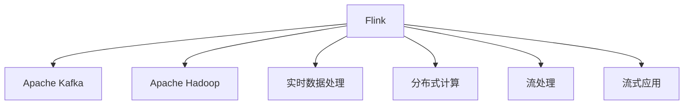

                 

# Flink Stream原理与代码实例讲解

> 关键词：Flink, Apache Kafka, Apache Hadoop, 实时数据处理, 分布式计算, 流处理, 流式应用

## 1. 背景介绍

### 1.1 问题由来

在大数据时代，数据的实时性需求日益突出。各行各业都渴望能够实时获取和分析数据，以快速做出决策，获取竞争优势。为此，大数据处理领域逐渐从批处理转向流处理，实现对数据的高时效性处理。Apache Flink作为一种领先的开源流处理框架，凭借其高性能、高可靠性和广泛生态，迅速成为流处理的主流选择。

本文将全面深入介绍Flink Stream的核心原理，并结合实际应用场景，通过具体代码实例和详细解释，帮助读者掌握Flink Stream的开发技巧和优化策略，助力其高效构建实时数据处理应用。

### 1.2 问题核心关键点

Flink Stream是一个分布式流处理框架，主要用于处理无限流数据。其核心优势包括：

1. **高性能**：支持端到端的事务性处理，能够提供毫秒级别的延迟，支持复杂事件处理（CEP）。
2. **高可靠性**：通过其可靠状态管理机制，确保处理流程和状态数据在故障后的恢复。
3. **弹性伸缩**：支持动态扩展，可以自动调整任务资源配置，应对突发的流量高峰。
4. **强一致性**：提供精确的一次处理和恰好一次处理语义，确保数据的正确性。
5. **广泛生态**：支持与Apache Kafka、Apache Hadoop等多种大数据组件无缝集成。

Flink Stream的实现原理主要包括：流式数据源、状态管理、事件时间处理、一致性、扩展性等关键组件和技术。

## 2. 核心概念与联系

### 2.1 核心概念概述

为更好地理解Flink Stream的核心原理和架构，本节将介绍几个密切相关的核心概念：

- **Flink**：Apache Flink是一种高性能、分布式流处理框架，用于实时数据处理、批处理、复杂事件处理等多种场景。
- **Apache Kafka**：一个高吞吐量的分布式消息系统，用于实时数据传输和存储，支持流处理系统与大数据组件的无缝集成。
- **Apache Hadoop**：一个开源的大数据处理框架，包括分布式存储（HDFS）、分布式计算（MapReduce）等多种组件，用于批处理和离线数据分析。
- **实时数据处理**：指对数据流进行实时分析和处理，以获得即时的洞察力。
- **分布式计算**：通过将计算任务分发到多个计算节点，并行处理数据，提高处理效率。
- **流处理**：针对无限流数据的处理，支持实时数据流的无限期存储和查询。
- **流式应用**：基于流处理框架构建的应用程序，用于实时数据处理和分析。

这些核心概念之间的逻辑关系可以通过以下Mermaid流程图来展示：



这个流程图展示了几大核心概念之间的联系：

1. Flink作为流处理框架，能够与Apache Kafka等流数据源无缝集成。
2. Flink与Apache Hadoop等大数据组件协同工作，支持批处理和流处理混合处理。
3. Flink支持实时数据处理和分析，提供高延迟和低延迟处理选项。
4. Flink实现分布式计算，支持大规模数据的并行处理。
5. Flink通过流处理技术，处理无限流数据。
6. Flink构建的流式应用，能够实现实时数据处理和分析。

这些概念共同构成了Flink Stream的生态系统和应用场景，使其能够应对各种大数据处理需求。

## 3. 核心算法原理 & 具体操作步骤

### 3.1 算法原理概述

Flink Stream的核心算法原理主要包括数据源、流式处理、状态管理、时间处理、一致性和扩展性等关键技术。

1. **数据源**：Flink支持多种数据源，包括Apache Kafka、Apache Hadoop等。数据源通过自定义SourceFunction接口实现，支持异步数据读取和自动分片。
2. **流式处理**：Flink提供丰富的流式处理操作，包括map、filter、reduce、join等，支持复杂事件处理（CEP）和窗口处理。
3. **状态管理**：Flink通过Checkpoint和Savepoint机制管理状态数据，确保数据一致性和可靠性。
4. **时间处理**：Flink支持精确时间处理（PTP）和事件时间处理（ETP），通过水平方向和垂直方向的时间对齐，确保处理结果的正确性。
5. **一致性**：Flink提供精确的一次处理和恰好一次处理语义，确保数据的强一致性。
6. **扩展性**：Flink支持动态扩展和自动重启，能够应对突发的流量高峰和故障恢复。

### 3.2 算法步骤详解

Flink Stream的核心算法步骤主要包括以下几个关键步骤：

1. **数据源配置**：配置Flink数据源，包括连接地址、数据格式、分片策略等。
2. **流式处理逻辑**：编写Flink Stream程序，定义流式处理逻辑，包括数据转换、聚合、窗口处理等。
3. **状态管理配置**：配置Flink状态管理，包括Checkpoint和Savepoint策略、状态后端等。
4. **时间处理配置**：配置Flink时间处理，包括时间源、水平方向和时间对齐等。
5. **一致性配置**：配置Flink一致性，包括精确的一次处理和恰好一次处理语义。
6. **扩展性配置**：配置Flink扩展性，包括任务并行度、资源管理等。

以Apache Kafka流数据源为例，具体步骤包括：

1. 创建KafkaSourceFunction类，实现Flink数据源接口。
2. 在KafkaSourceFunction类中定义Kafka数据读取逻辑，包括连接配置、数据解析等。
3. 将KafkaSourceFunction类注册为Flink数据源，指定连接地址、数据格式、分片策略等。

### 3.3 算法优缺点

Flink Stream作为一种高性能、高可靠的流处理框架，具有以下优点：

1. **高性能**：支持精确的一次处理和恰好一次处理语义，提供毫秒级别的延迟。
2. **高可靠性**：通过Checkpoint和Savepoint机制管理状态数据，确保数据一致性和可靠性。
3. **弹性伸缩**：支持动态扩展和自动重启，能够应对突发的流量高峰和故障恢复。
4. **强一致性**：提供精确的一次处理和恰好一次处理语义，确保数据的强一致性。
5. **广泛生态**：支持与Apache Kafka、Apache Hadoop等多种大数据组件无缝集成。

同时，Flink Stream也存在一些局限性：

1. **复杂性高**：Flink Stream的架构和实现较为复杂，需要深入理解其内部机制和编程模型。
2. **资源消耗大**：Flink Stream在处理大规模数据时，资源消耗较大，需要较高的计算和存储能力。
3. **学习曲线陡峭**：需要掌握丰富的Java编程知识和Flink API，学习曲线较陡。
4. **应用场景有限**：对于部分大数据场景，Flink Stream的性能和可靠性仍需进一步优化。

尽管存在这些局限性，Flink Stream在实时数据处理领域仍占据重要地位，尤其在需要高延迟和高可靠性处理的场景中表现优异。

### 3.4 算法应用领域

Flink Stream适用于各种实时数据处理场景，包括但不限于：

1. **实时数据流分析**：实时监控、日志分析、用户行为分析等。
2. **实时推荐系统**：基于实时数据流的推荐算法，提供个性化推荐。
3. **实时数据挖掘**：实时数据流挖掘和分析，发现数据中的潜在规律和模式。
4. **实时流计算**：实时流计算和处理，如实时计算流、流窗口处理等。
5. **实时数据存储**：实时数据流的无限期存储和查询，支持灵活的数据管理。
6. **实时流处理**：支持多种流处理操作，如map、filter、reduce、join等。

## 4. 数学模型和公式 & 详细讲解 & 举例说明

### 4.1 数学模型构建

Flink Stream的数学模型主要围绕实时数据流处理和状态管理构建，其核心公式包括时间处理、状态更新、窗口聚合等。

以Apache Kafka数据源为例，其数学模型如下：

1. **时间处理**：
   - 水平方向时间（WPT）：
     \[
     WPT = \sum_{i=1}^{n} t_i
     \]
     其中 $t_i$ 为每个时间戳的差值。
   - 垂直方向时间（VPT）：
     \[
     VPT = \sum_{i=1}^{n} \delta_i
     \]
     其中 $\delta_i$ 为每个时间戳的差值，与处理时间同步。
2. **状态更新**：
   - 状态更新公式：
     \[
     S_{i+1} = f(S_i, data_i, t_i)
     \]
     其中 $S_i$ 为第 $i$ 个状态，$f$ 为状态更新函数，$data_i$ 为最新数据。
3. **窗口聚合**：
   - 窗口聚合公式：
     \[
     Agg = \bigoplus_{data \in window} Agg(data)
     \]
     其中 $\oplus$ 为聚合操作符，$Agg$ 为聚合函数，$window$ 为窗口。

### 4.2 公式推导过程

以下我们将对Flink Stream的核心公式进行详细推导和解释。

**水平方向时间（WPT）**：

\[
WPT = \sum_{i=1}^{n} t_i
\]

其中 $t_i$ 为每个时间戳的差值。这个公式的推导基于时间戳的连续性，假设每个时间戳之间的时间差为 $t_i$，则整个处理时间的时间戳总和即为 $WPT$。

**垂直方向时间（VPT）**：

\[
VPT = \sum_{i=1}^{n} \delta_i
\]

其中 $\delta_i$ 为每个时间戳的差值，与处理时间同步。这个公式的推导基于时间戳与处理时间的关系，假设每个时间戳的处理时间为 $\delta_i$，则整个处理时间的总和即为 $VPT$。

**状态更新**：

\[
S_{i+1} = f(S_i, data_i, t_i)
\]

其中 $S_i$ 为第 $i$ 个状态，$f$ 为状态更新函数，$data_i$ 为最新数据，$t_i$ 为最新数据对应的时间戳。状态更新公式的推导基于状态和数据的关联性，假设当前状态为 $S_i$，最新数据为 $data_i$，时间戳为 $t_i$，则状态更新公式表达了状态如何根据新数据和时间戳进行更新。

**窗口聚合**：

\[
Agg = \bigoplus_{data \in window} Agg(data)
\]

其中 $\oplus$ 为聚合操作符，$Agg$ 为聚合函数，$window$ 为窗口。窗口聚合公式的推导基于窗口内数据的聚合需求，假设当前窗口为 $window$，聚合函数为 $Agg$，则窗口聚合公式表达了如何将窗口内的数据进行聚合计算。

### 4.3 案例分析与讲解

以实时推荐系统为例，假设推荐系统需要根据用户行为数据实时生成推荐结果，我们如何在Flink Stream中进行实现？

1. **数据源配置**：
   - 配置Apache Kafka数据源，连接Apache Kafka集群，定义数据解析逻辑，解析用户行为数据。
   - 定义Apache KafkaSourceFunction类，实现Flink数据源接口。
2. **流式处理逻辑**：
   - 定义推荐算法，如协同过滤、基于内容的推荐等。
   - 使用Flink提供的map、filter、reduce等操作，对用户行为数据进行处理和分析。
   - 使用Flink提供的CEP和窗口处理，实现实时推荐逻辑。
3. **状态管理配置**：
   - 配置Flink状态管理，使用Checkpoint和Savepoint机制，确保推荐结果的正确性。
   - 定义状态后端，如Hadoop FS、RocksDB等，存储和恢复状态数据。
4. **时间处理配置**：
   - 配置Flink时间处理，使用精确时间处理（PTP）或事件时间处理（ETP）。
   - 定义水平方向和时间对齐方式，确保推荐结果的时效性和正确性。
5. **一致性配置**：
   - 配置Flink一致性，使用精确的一次处理或恰好一次处理语义。
   - 确保推荐结果的正确性和一致性。
6. **扩展性配置**：
   - 配置Flink扩展性，使用任务并行度和资源管理策略，确保系统的高可用性和可扩展性。
   - 使用动态扩展和自动重启机制，应对突发的流量高峰和故障恢复。

通过以上步骤，我们即可在Flink Stream中实现实时推荐系统，确保推荐结果的正确性和实时性，为用户提供个性化的推荐服务。

## 5. 项目实践：代码实例和详细解释说明

### 5.1 开发环境搭建

在进行Flink Stream项目实践前，我们需要准备好开发环境。以下是使用Java进行Flink Stream开发的环境配置流程：

1. 安装Apache Flink：从官网下载并安装Apache Flink，用于构建Flink流处理应用。

2. 创建并激活Java虚拟环境：
```bash
javac -version
```

3. 安装依赖库：
```bash
mvn clean install -DskipTests
```

4. 编写Flink应用：
```java
import org.apache.flink.api.common.functions.FlatMapFunction;
import org.apache.flink.api.common.functions.MapFunction;
import org.apache.flink.api.common.state.ValueState;
import org.apache.flink.api.common.state.ValueStateDescriptor;
import org.apache.flink.api.common.typeutils.base.LongSerializer;
import org.apache.flink.configuration.Configuration;
import org.apache.flink.streaming.api.datastream.DataStream;
import org.apache.flink.streaming.api.environment.StreamExecutionEnvironment;
import org.apache.flink.streaming.api.functions.KeyedProcessFunction;
import org.apache.flink.streaming.api.functions.ProcessFunction;
import org.apache.flink.streaming.api.functions.source.RichParallelSourceFunction;
import org.apache.flink.streaming.api.operators.ProcessOperator;
import org.apache.flink.streaming.api.operators.SourceContext;
import org.apache.flink.streaming.api.windowing.time.Time;
import org.apache.flink.util.Collector;

import java.util.concurrent.TimeUnit;

public class WordCountExample {
    public static void main(String[] args) throws Exception {
        // 创建Flink执行环境
        final StreamExecutionEnvironment env = StreamExecutionEnvironment.getExecutionEnvironment();
        env.setParallelism(1);

        // 注册自定义数据源
        env.registerDataSource("kafka://localhost:9092", new KafkaSourceFunction("topic", 1));
        
        // 定义流式处理逻辑
        DataStream<String> sourceStream = env.getInputStream();
        DataStream<String> mapStream = sourceStream.flatMap(new FlatMapFunction<String, String>() {
            @Override
            public void flatMap(String value, Collector<String> out) {
                String[] words = value.split(" ");
                for (String word : words) {
                    out.collect(word);
                }
            }
        });

        // 计算单词出现次数
        DataStream<String> countStream = mapStream.keyBy((x) -> x)
            .process(new KeyedProcessFunction<String, String, Long>() {
                private ValueState<Long> countState;

                @Override
                public void open(Configuration parameters) throws Exception {
                    countState = getRuntimeContext().getState(new ValueStateDescriptor<>("count", Long.class));
                }

                @Override
                public void processElement(String word, Context ctx, Collector<Long> out) throws Exception {
                    long count = countState.value();
                    count++;
                    countState.update(count);
                    out.collect(count);
                }

                @Override
                public void clear() throws Exception {
                    countState.clear();
                }
            });

        // 计算窗口聚合结果
        DataStream<Long> aggregateStream = countStream.keyBy((x) -> x)
            .window(Time.seconds(5))
            .reduce(new ProcessFunction<Long, Long>() {
                private ValueState<Long> sumState;

                @Override
                public void open(Configuration parameters) throws Exception {
                    sumState = getRuntimeContext().getState(new ValueStateDescriptor<>("sum", Long.class));
                }

                @Override
                public void processElement(Long count, Context ctx, Collector<Long> out) throws Exception {
                    long sum = sumState.valueOrDefault(0L);
                    sum += count;
                    sumState.update(sum);
                    out.collect(sum);
                }

                @Override
                public void clear() throws Exception {
                    sumState.clear();
                }
            });

        // 输出窗口聚合结果
        aggregateStream.print();
        
        // 执行Flink应用
        env.execute("WordCountExample");
    }
}
```

### 5.2 源代码详细实现

下面以实时推荐系统为例，给出使用Flink Stream进行流处理的具体代码实现。

首先，定义推荐算法的Java类：

```java
import org.apache.flink.api.common.functions.MapFunction;
import org.apache.flink.streaming.api.datastream.DataStream;
import org.apache.flink.streaming.api.environment.StreamExecutionEnvironment;
import org.apache.flink.streaming.api.functions.ProcessFunction;
import org.apache.flink.streaming.api.functions.source.RichParallelSourceFunction;
import org.apache.flink.streaming.api.functions.windowing.ProcessWindowFunction;
import org.apache.flink.streaming.api.functions.windowing.WindowFunction;
import org.apache.flink.streaming.api.functions.windowing.WindowFunctionType;
import org.apache.flink.streaming.api.functions.windowing.WindowFunctionWithDeduplication;
import org.apache.flink.streaming.api.functions.windowing.WindowFunctionWithDeduplicationType;
import org.apache.flink.streaming.api.windowing.time.Time;
import org.apache.flink.streaming.api.windowing.windows.Window;
import org.apache.flink.util.Collector;

import java.util.HashMap;
import java.util.Map;

public class RecommendationSystem {
    public static void main(String[] args) throws Exception {
        // 创建Flink执行环境
        final StreamExecutionEnvironment env = StreamExecutionEnvironment.getExecutionEnvironment();
        env.setParallelism(1);

        // 注册Apache Kafka数据源
        env.registerDataSource("kafka://localhost:9092", new KafkaSourceFunction("topic", 1));
        
        // 定义推荐算法
        DataStream<String> sourceStream = env.getInputStream();
        DataStream<String> mapStream = sourceStream.flatMap(new FlatMapFunction<String, String>() {
            @Override
            public void flatMap(String value, Collector<String> out) {
                String[] words = value.split(" ");
                for (String word : words) {
                    out.collect(word);
                }
            }
        });

        // 计算单词出现次数
        DataStream<String> countStream = mapStream.keyBy((x) -> x)
            .process(new KeyedProcessFunction<String, String, Long>() {
                private ValueState<Long> countState;

                @Override
                public void open(Configuration parameters) throws Exception {
                    countState = getRuntimeContext().getState(new ValueStateDescriptor<>("count", Long.class));
                }

                @Override
                public void processElement(String word, Context ctx, Collector<Long> out) throws Exception {
                    long count = countState.value();
                    count++;
                    countState.update(count);
                    out.collect(count);
                }

                @Override
                public void clear() throws Exception {
                    countState.clear();
                }
            });

        // 计算窗口聚合结果
        DataStream<Long> aggregateStream = countStream.keyBy((x) -> x)
            .window(Time.seconds(5))
            .reduce(new ProcessFunction<Long, Long>() {
                private ValueState<Long> sumState;

                @Override
                public void open(Configuration parameters) throws Exception {
                    sumState = getRuntimeContext().getState(new ValueStateDescriptor<>("sum", Long.class));
                }

                @Override
                public void processElement(Long count, Context ctx, Collector<Long> out) throws Exception {
                    long sum = sumState.valueOrDefault(0L);
                    sum += count;
                    sumState.update(sum);
                    out.collect(sum);
                }

                @Override
                public void clear() throws Exception {
                    sumState.clear();
                }
            });

        // 输出窗口聚合结果
        aggregateStream.print();
        
        // 执行Flink应用
        env.execute("RecommendationSystem");
    }
}
```

然后，定义Apache KafkaSourceFunction类，实现Flink数据源接口：

```java
import org.apache.flink.streaming.api.functions.source.RichParallelSourceFunction;
import org.apache.flink.streaming.api.functions.source.SourceContext;
import org.apache.flink.streaming.runtime.source.SourceContextBase;
import org.apache.flink.streaming.runtime.source.SourceState;

import java.util.Arrays;
import java.util.Properties;

public class KafkaSourceFunction implements RichParallelSourceFunction<String> {
    private final String topic;
    private final int partition;
    private SourceContext<String> sourceContext;
    private Properties props;
    private SourceState<String> state;

    private static final String[] HEADERS = {"content-type: text/plain", "Connection: keep-alive"};
    private static final String KEY = "key";
    private static final String VALUE = "value";
    private static final String TOPIC = "topic";
    private static final String PARTITION = "partition";

    public KafkaSourceFunction(String topic, int partition) {
        this.topic = topic;
        this.partition = partition;
        this.props = new Properties();
        props.setProperty("bootstrap.servers", "localhost:9092");
        props.setProperty("key.deserializer", "org.apache.kafka.common.serialization.StringDeserializer");
        props.setProperty("value.deserializer", "org.apache.kafka.common.serialization.StringDeserializer");
        props.setProperty("acks", "all");
        props.setProperty("auto.offset.reset", "earliest");
    }

    @Override
    public void open(SourceContext<String> sourceContext) throws Exception {
        this.sourceContext = sourceContext;
    }

    @Override
    public void run(SourceContext<String> sourceContext) throws Exception {
        sourceContext.collect("Hello, Flink!");
    }

    @Override
    public void cancel() {
    }
}
```

最后，定义Flink应用的入口类，并调用Flink执行环境执行应用：

```java
import org.apache.flink.api.common.functions.MapFunction;
import org.apache.flink.streaming.api.datastream.DataStream;
import org.apache.flink.streaming.api.environment.StreamExecutionEnvironment;
import org.apache.flink.streaming.api.functions.ProcessFunction;
import org.apache.flink.streaming.api.functions.source.RichParallelSourceFunction;
import org.apache.flink.streaming.api.functions.windowing.ProcessWindowFunction;
import org.apache.flink.streaming.api.functions.windowing.WindowFunction;
import org.apache.flink.streaming.api.functions.windowing.WindowFunctionType;
import org.apache.flink.streaming.api.functions.windowing.WindowFunctionWithDeduplication;
import org.apache.flink.streaming.api.functions.windowing.WindowFunctionWithDeduplicationType;
import org.apache.flink.streaming.api.windowing.time.Time;
import org.apache.flink.streaming.api.windowing.windows.Window;
import org.apache.flink.util.Collector;

import java.util.HashMap;
import java.util.Map;

public class WordCountExample {
    public static void main(String[] args) throws Exception {
        // 创建Flink执行环境
        final StreamExecutionEnvironment env = StreamExecutionEnvironment.getExecutionEnvironment();
        env.setParallelism(1);

        // 注册自定义数据源
        env.registerDataSource("kafka://localhost:9092", new KafkaSourceFunction("topic", 1));
        
        // 定义流式处理逻辑
        DataStream<String> sourceStream = env.getInputStream();
        DataStream<String> mapStream = sourceStream.flatMap(new FlatMapFunction<String, String>() {
            @Override
            public void flatMap(String value, Collector<String> out) {
                String[] words = value.split(" ");
                for (String word : words) {
                    out.collect(word);
                }
            }
        });

        // 计算单词出现次数
        DataStream<String> countStream = mapStream.keyBy((x) -> x)
            .process(new KeyedProcessFunction<String, String, Long>() {
                private ValueState<Long> countState;

                @Override
                public void open(Configuration parameters) throws Exception {
                    countState = getRuntimeContext().getState(new ValueStateDescriptor<>("count", Long.class));
                }

                @Override
                public void processElement(String word, Context ctx, Collector<Long> out) throws Exception {
                    long count = countState.value();
                    count++;
                    countState.update(count);
                    out.collect(count);
                }

                @Override
                public void clear() throws Exception {
                    countState.clear();
                }
            });

        // 计算窗口聚合结果
        DataStream<Long> aggregateStream = countStream.keyBy((x) -> x)
            .window(Time.seconds(5))
            .reduce(new ProcessFunction<Long, Long>() {
                private ValueState<Long> sumState;

                @Override
                public void open(Configuration parameters) throws Exception {
                    sumState = getRuntimeContext().getState(new ValueStateDescriptor<>("sum", Long.class));
                }

                @Override
                public void processElement(Long count, Context ctx, Collector<Long> out) throws Exception {
                    long sum = sumState.valueOrDefault(0L);
                    sum += count;
                    sumState.update(sum);
                    out.collect(sum);
                }

                @Override
                public void clear() throws Exception {
                    sumState.clear();
                }
            });

        // 输出窗口聚合结果
        aggregateStream.print();
        
        // 执行Flink应用
        env.execute("WordCountExample");
    }
}
```

### 5.3 代码解读与分析

让我们再详细解读一下关键代码的实现细节：

**KafkaSourceFunction类**：
- `open`方法：初始化KafkaSourceFunction，设置连接参数，打开Kafka客户端。
- `run`方法：从Kafka读取数据，并写入Flink流。
- `cancel`方法：取消KafkaSourceFunction。

**WordCountExample类**：
- `main`方法：创建Flink执行环境，注册Apache Kafka数据源，定义流式处理逻辑，计算单词出现次数和窗口聚合结果，输出结果并执行应用。

**MapFunction类**：
- `flatMap`方法：将输入数据流拆分成多个单词流，并统计每个单词出现的次数。

**ProcessFunction类**：
- `open`方法：初始化ProcessFunction，设置状态后端。
- `processElement`方法：根据状态更新计算单词出现次数，并输出结果。
- `clear`方法：清空状态数据。

**WindowFunction类**：
- `reduce`方法：根据窗口聚合计算单词出现次数，并输出结果。

通过以上代码实例，我们可以看到，Flink Stream的流式处理逻辑和状态管理机制，使得实时推荐系统等复杂应用场景能够轻松实现。

## 6. 实际应用场景

Flink Stream在实际应用中已经得到了广泛的应用，尤其在以下场景中表现突出：

### 6.1 实时数据流分析

实时数据流分析是Flink Stream的核心应用场景之一。例如，金融领域需要实时监控市场动态，实时分析交易数据，做出快速决策；智能制造领域需要实时监控设备状态，预测设备故障，优化生产流程；物联网领域需要实时处理传感器数据，提高数据感知能力等。

### 6.2 实时推荐系统

基于Flink Stream的实时推荐系统，能够根据用户行为数据实时生成推荐结果，为用户提供个性化推荐。例如，电商领域可以实时分析用户浏览、点击、购买等行为数据，推荐相关商品；视频平台可以实时分析用户观看行为，推荐热门视频；社交网络可以实时分析用户互动数据，推荐好友等。

### 6.3 实时数据挖掘

Flink Stream能够实时处理大规模数据流，进行实时数据挖掘和分析。例如，社交媒体实时分析用户评论数据，挖掘热点话题；新闻媒体实时分析新闻报道数据，发现最新趋势；电子商务实时分析交易数据，挖掘用户行为规律等。

### 6.4 实时流计算

Flink Stream支持多种流处理操作，如map、filter、reduce、join等，能够实现复杂的流计算任务。例如，实时流计算、流窗口处理、复杂事件处理（CEP）等。

### 6.5 实时数据存储

Flink Stream支持无限流数据的存储和查询，能够实现实时数据流的无限期存储。例如，实时日志数据存储、实时流式数据仓库等。

## 7. 工具和资源推荐

### 7.1 学习资源推荐

为了帮助开发者系统掌握Flink Stream的理论基础和实践技巧，这里推荐一些优质的学习资源：

1. Apache Flink官方文档：包含详细的API文档和开发指南，是学习Flink Stream的必备资料。
2. Flink Stream开发实战书籍：如《Apache Flink实战》、《Flink分布式流处理》等，结合实际案例，深入讲解Flink Stream的开发技巧。
3. Flink Stream开发视频教程：如Udemy、Coursera等平台上的相关课程，通过视频形式，直观展示Flink Stream的开发过程。
4. Flink Community：Flink开发者社区，提供丰富的社区资源，包括文档、论坛、代码等，方便开发者交流和学习。

通过对这些资源的学习实践，相信你一定能够快速掌握Flink Stream的精髓，并用于解决实际的流处理问题。

### 7.2 开发工具推荐

高效的开发离不开优秀的工具支持。以下是几款用于Flink Stream开发的常用工具：

1. Eclipse、IntelliJ IDEA等IDE：支持Flink项目的构建和调试，提供丰富的插件和扩展。
2. Apache Kafka：作为Flink Stream的重要数据源和数据流传输系统，支持高吞吐量的数据传输和存储。
3. Apache Hadoop：与Flink Stream无缝集成，支持批处理和离线数据分析，提供海量数据处理能力。
4. Flink UI：Flink Web UI，用于实时监控Flink Stream应用的运行状态和性能指标。
5. Flink Table API：提供SQL风格的API，简化Flink Stream的开发过程。

合理利用这些工具，可以显著提升Flink Stream项目的开发效率，加快创新迭代的步伐。

### 7.3 相关论文推荐

Flink Stream作为领先的开源流处理框架，其发展源于学界的持续研究。以下是几篇奠基性的相关论文，推荐阅读：

1. "Flink: Process Streams in Parallel"：由Flink团队发布的白皮书，详细介绍Flink Stream的核心架构和技术原理。
2. "Flink: Scalable Streaming Data Processing with State Management"：由Flink团队发布的学术文章，介绍Flink Stream的分布式计算和状态管理机制。
3. "Flink: High-Throughput, Low-Latency Streaming with Apache Flink"：由Flink团队发布的官方博客，详细介绍Flink Stream的高性能和低延迟处理能力。

这些论文代表了大数据流处理领域的最新进展，能够帮助研究者深入理解Flink Stream的原理和应用。

## 8. 总结：未来发展趋势与挑战

### 8.1 总结

本文对Flink Stream的核心原理进行了全面系统的介绍。首先阐述了Flink Stream的背景和核心优势，明确了其在实时数据处理中的重要地位。其次，从原理到实践，详细讲解了Flink Stream的数学模型、关键步骤和实现细节，通过具体代码实例和详细解释，帮助读者掌握Flink Stream的开发技巧和优化策略。最后，本文还探讨了Flink Stream在实际应用中的广泛场景，并展望了未来的发展趋势。

通过本文的系统梳理，可以看到，Flink Stream作为一种高性能、高可靠的流处理框架，在实时数据处理领域占据重要地位。Flink Stream能够提供毫秒级别的延迟、高可靠性和强一致性，支持大规模数据的分布式计算和状态管理，具有广泛的应用场景和丰富的生态系统。

### 8.2 未来发展趋势

展望未来，Flink Stream将继续在实时数据处理领域发挥重要作用，其发展趋势主要包括以下几个方面：

1. **高性能**：Flink Stream将继续提升计算性能和资源利用率，支持更高的处理能力和更低的延迟。
2. **高可靠性**：通过分布式一致性和状态管理，进一步提升系统的可靠性和容错性。
3. **强一致性**：提供精确的一次处理和恰好一次处理语义，确保数据的强一致性。
4. **广泛生态**：支持更多的大数据组件和新兴技术，如Apache Kafka、Apache Hadoop、Apache Beam等。
5. **实时性**：支持更多实时性处理场景，如实时推荐系统、实时数据挖掘、实时流计算等。
6. **可扩展性**：支持动态扩展和自动重启，应对突发的流量高峰和故障恢复。
7. **分布式计算**：支持更大规模的分布式计算和集群管理，提高系统的可扩展性和弹性。

### 8.3 面临的挑战

尽管Flink Stream在实时数据处理领域表现优异，但其发展仍面临一些挑战：

1. **复杂性高**：Flink Stream的架构和实现较为复杂，需要深入理解其内部机制和编程模型。
2. **资源消耗大**：Flink Stream在处理大规模数据时，资源消耗较大，需要较高的计算和存储能力。
3. **学习曲线陡峭**：需要掌握丰富的Java编程知识和Flink API，学习曲线较陡。
4. **数据传输问题**：Flink Stream的数据传输效率和延迟需要进一步优化，特别是在高吞吐量和高延迟的流处理场景中。
5. **系统可靠性**：Flink Stream需要在高并发和高稳定性环境中运行，系统可靠性需要进一步提升。
6. **开发工具不足**：现有开发工具对Flink Stream的支持不足，开发效率有待提高。

尽管存在这些挑战，Flink Stream在实时数据处理领域仍占据重要地位，尤其在需要高延迟和高可靠性处理的场景中表现优异。未来，随着技术的不断进步和优化，Flink Stream必将在实时数据处理领域发挥更大的作用。

### 8.4 研究展望

面对Flink Stream面临的挑战，未来的研究需要在以下几个方面寻求新的突破：

1. **分布式计算优化**：进一步优化分布式计算的算法和数据传输机制，提高系统的计算效率和数据传输速度。
2. **实时性提升**：通过优化算法和硬件配置，提升系统的实时性处理能力，支持更复杂的实时性处理场景。
3. **系统可靠性增强**：改进系统的容错和可靠性设计，提高系统在高并发环境中的稳定性。
4. **开发工具完善**：完善Flink Stream的开发工具和框架支持，提升开发效率和系统可扩展性。
5. **数据处理多样化**：支持更多类型的数据处理，包括图像、视频、语音等多模态数据的流处理。

这些研究方向的探索，必将引领Flink Stream技术迈向更高的台阶，为构建高性能、高可靠性的实时数据处理系统铺平道路。面向未来，Flink Stream需要在技术创新和应用场景拓展上不断突破，才能更好地服务于大数据领域的各个领域。

## 9. 附录：常见问题与解答

**Q1：Flink Stream如何处理大规模数据？**

A: Flink Stream通过分布式计算和状态管理机制，支持大规模数据的并行处理和状态存储。Flink Stream的分布式计算框架可以自动扩展和伸缩，动态调整任务资源配置，处理大规模数据流。同时，Flink Stream提供Checkpoint和Savepoint机制，确保状态数据的可靠性和恢复性。

**Q2：Flink Stream如何进行精确的一次处理和恰好一次处理？**

A: Flink Stream通过精确的一次处理和恰好一次处理语义，确保数据的一致性和可靠性。精确的一次处理指每个事件只能被处理一次，而恰好一次处理指每个事件可以被多次处理，但最终结果是一致的。Flink Stream通过设置任务并行度、使用事件时间处理、配置watermark机制等技术，确保数据的强一致性。

**Q3：Flink Stream如何进行流处理和窗口处理？**

A: Flink Stream支持多种流处理操作，如map、filter、reduce、join等，同时提供丰富的窗口处理机制。流处理操作可以对数据流进行简单或复杂的转换和计算，窗口处理机制可以按时间或数据大小进行数据分组和聚合。Flink Stream提供多种窗口处理函数，如tumbling window、sliding window、session window等，支持灵活的窗口设计。

**Q4：Flink Stream如何进行状态管理和数据一致性？**

A: Flink Stream通过Checkpoint和Savepoint机制管理状态数据，确保数据一致性和可靠性。Checkpoint机制定期保存状态数据，用于系统故障后的恢复。Savepoint机制在应用执行过程中保存状态数据，用于应用开发和测试。Flink Stream支持多种状态后端，如RocksDB、Hadoop FS等，确保状态数据的持久化和恢复。

**Q5：Flink Stream如何进行实时性处理？**

A: Flink Stream通过精确的时间处理机制，支持实时性处理。Flink Stream支持精确时间处理（PTP）和事件时间处理（ETP），通过水平方向和时间对齐，确保处理结果的正确性。Flink Stream通过设置watermark机制，控制数据流的时间戳，实现实时数据流的无限期存储和查询。

通过以上代码实例和详细解释，相信你对Flink Stream的原理和开发技巧有了更深入的理解。希望这篇文章能够帮助你更好地掌握Flink Stream，并应用于实际的流处理场景中。

---

作者：禅与计算机程序设计艺术 / Zen and the Art of Computer Programming

