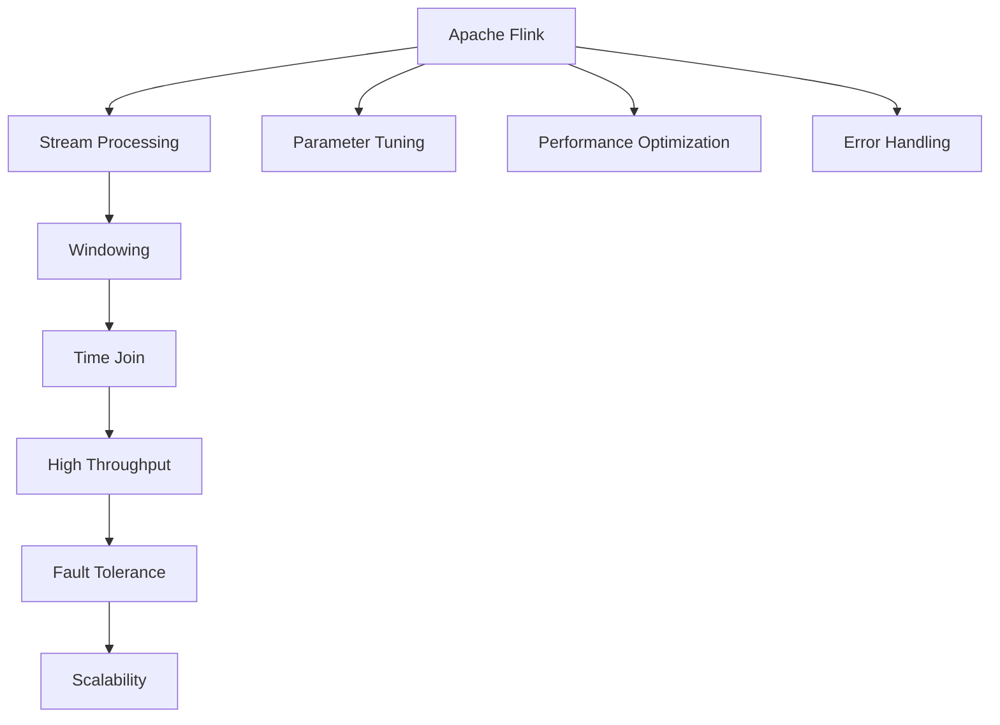

                 

# Flink Window原理与代码实例讲解

> 关键词：Apache Flink, Stream Processing, Windowing, Time Join, High Throughput, Fault Tolerance, Scalability

## 1. 背景介绍

### 1.1 问题由来
在数据流处理领域，实时数据流的处理和分析是至关重要的。Apache Flink 作为一项开源流处理平台，其核心组件之一的 Window 机制在处理实时数据流时起着关键作用。Window 机制允许 Flink 对数据流中的元素进行分组和聚合，从而实现复杂的数据处理需求，如时间窗口聚合、滑动窗口等。

然而，尽管 Window 机制对于实时数据流处理至关重要，但 Window 原理及其应用在实际项目中仍然存在许多挑战。如何高效地使用 Window 机制，如何优化和调整 Window 参数，如何在实际项目中实现高吞吐量和低延迟，这些问题对于 Flink 开发者来说仍需深入理解。

### 1.2 问题核心关键点
1. 时间窗口的划分：如何根据业务需求和数据特性，选择合适的窗口类型和窗口大小。
2. 数据聚合与关联：如何在不同的窗口之间进行数据聚合和关联，如时间窗口的合并和滑动窗口的跨时关联。
3. 性能优化：如何在保证高吞吐量和低延迟的前提下，优化 Window 处理性能。
4. 容错与可靠：如何在处理错误和数据丢失的情况下，保证 Window 处理的正确性和可靠性。
5. 扩展性与可维护性：如何在保证系统性能和容错性的同时，提升代码的可读性和可维护性。

## 2. 核心概念与联系

### 2.1 核心概念概述

为了更好地理解 Flink Window 机制，本节将介绍几个相关核心概念：

- **Apache Flink**：Apache Flink 是一个开源的分布式流处理框架，支持批处理和流处理，适用于各种数据流应用场景。
- **Stream Processing**：数据流处理，即对实时数据流进行处理和分析，以支持各种业务场景，如实时计费、实时监控、实时推荐等。
- **Windowing**：窗口机制，即将实时数据流按照时间间隔进行分组，在每个分组中进行聚合计算。
- **Time Join**：时间窗口的关联和合并，使得跨窗口的数据聚合和关联成为可能。
- **High Throughput**：高吞吐量，即在数据流处理过程中，每秒处理的记录数。
- **Fault Tolerance**：容错性，即在处理过程中遇到错误和数据丢失时，系统能自动恢复和重新计算。
- **Scalability**：扩展性，即系统在处理大规模数据流时，能动态调整资源配置，保证性能和稳定性。

这些概念之间的联系和作用通过以下 Mermaid 流程图来展示：



这个流程图展示了大数据流处理中各概念之间的关系：

1. Apache Flink 提供流处理能力，作为整个处理框架的基础。
2. 窗口机制（Windowing）将数据流按照时间间隔分组，支持复杂的数据聚合需求。
3. 时间关联（Time Join）使得跨窗口的数据聚合和关联成为可能，丰富了窗口处理的功能。
4. 高吞吐量（High Throughput）是流处理的核心目标，窗口机制的应用有助于提高处理效率。
5. 容错性（Fault Tolerance）保证在数据丢失和错误情况下，系统能够恢复并重新计算。
6. 扩展性（Scalability）使得系统能够动态调整资源配置，满足处理大规模数据流的需求。

在实际应用中，开发人员需要根据业务需求选择合适的窗口类型和大小，并通过参数调整和性能优化，确保数据流处理的正确性和高效性。

## 3. 核心算法原理 & 具体操作步骤
### 3.1 算法原理概述

Flink 中的窗口机制是一种在时间序列上对数据进行分组和聚合的操作。其核心思想是按照时间间隔对数据流进行分组，并在每个分组内进行聚合计算。窗口的大小和类型由用户定义，常见的窗口类型包括时间窗口、滑动窗口、会话窗口等。

假设数据流中元素以顺序的形式流式到达，每个元素包含一个时间戳（Timestamp）和一个值。Flink 会将元素按照时间戳进行分组，并计算每个分组的聚合结果。窗口机制主要分为以下步骤：

1. 分组：将具有相同时间戳区间的数据元素分为一组，即窗口。
2. 聚合计算：对每个窗口内的数据元素进行聚合计算，如求和、求平均值、最大值等。
3. 窗口函数：将每个窗口的聚合结果应用于预定义的窗口函数，如计算滑动窗口的累积值。

Flink 中的窗口机制支持时间窗口和滑动窗口两种类型。时间窗口（Time Window）是按照固定时间间隔进行分组的，而滑动窗口（Sliding Window）是按照指定的时间间隔和窗口大小进行分组的。滑动窗口通常用于对数据进行滑动计算，如对时间序列数据进行滑动平均值计算。

### 3.2 算法步骤详解

#### 时间窗口（Time Window）

1. **分组**：将数据流中的元素按照时间戳分组，例如按照每 5 秒为一个窗口。
2. **聚合计算**：对每个窗口内的数据元素进行聚合计算，如对滑动窗口内的元素求和。
3. **窗口函数**：对每个窗口的聚合结果应用窗口函数，如计算滑动窗口的累积和。

**代码实现**：

```java
DataStream<String> input = env.addSource(new FlinkKafkaConsumer<>(props));
DataStream<Tuple2<Long, Integer>> windowed = input
        .keyBy("key")
        .timeWindow(Time.seconds(5))
        .sum(1);
```

#### 滑动窗口（Sliding Window）

1. **分组**：将数据流中的元素按照时间戳分组，例如按照每 5 秒为一个窗口，每次滑动 2 秒。
2. **聚合计算**：对每个窗口内的数据元素进行聚合计算，如对滑动窗口内的元素求和。
3. **窗口函数**：对每个窗口的聚合结果应用窗口函数，如计算滑动窗口的累积和。

**代码实现**：

```java
DataStream<String> input = env.addSource(new FlinkKafkaConsumer<>(props));
DataStream<Tuple2<Long, Integer>> windowed = input
        .keyBy("key")
        .timeWindow(Time.seconds(5), Time.seconds(2))
        .sum(1);
```

### 3.3 算法优缺点

Flink 的 Window 机制在实际应用中具有以下优点：

1. **灵活性高**：支持多种窗口类型和聚合函数，能够满足不同业务场景的需求。
2. **可扩展性强**：可以动态调整窗口大小和类型，适应数据流处理需求的变化。
3. **高吞吐量**：通过并行处理和优化算法，支持大规模数据流的处理需求。

同时，该机制也存在以下缺点：

1. **复杂度高**：实现复杂的窗口操作需要编写复杂的代码，增加了开发难度。
2. **延迟高**：窗口计算的延迟取决于窗口大小和数据量，处理大数据流时延迟较高。
3. **资源消耗高**：窗口机制需要占用较多的内存和计算资源，可能导致系统性能下降。

### 3.4 算法应用领域

Flink 的 Window 机制广泛应用于各种实时数据流处理场景，例如：

- **金融领域**：实时监控市场数据，计算每 5 秒的股票价格变化。
- **电商领域**：实时计算每分钟的订单量和订单金额，分析销售趋势。
- **交通领域**：实时监控交通流量，计算每 10 分钟的车流量数据。
- **社交媒体**：实时分析社交媒体数据，计算每小时的热门话题和讨论量。
- **智能推荐**：实时推荐系统，根据用户行为数据计算每 30 秒的推荐结果。

除了上述这些经典场景外，Flink 的 Window 机制还可以应用到更多领域，如智能制造、智慧城市、物联网等，为各行各业提供实时数据分析和决策支持。

## 4. 数学模型和公式 & 详细讲解 & 举例说明

### 4.1 数学模型构建

假设数据流中元素按照时间戳 $t$ 流式到达，每个元素包含一个值 $x_i$ 和一个时间戳 $t_i$。Flink 中的窗口机制可以表示为以下数学模型：

$$
\begin{aligned}
W &= \{x_i| t_i \in [t_0, t_0+\delta t) \\
A &= \text{Agg}(W) \\
F &= \text{Function}(A)
\end{aligned}
$$

其中 $W$ 表示时间窗口，$A$ 表示窗口内元素的聚合结果，$F$ 表示窗口函数，$\delta t$ 表示窗口大小。

### 4.2 公式推导过程

假设数据流中的元素按顺序流式到达，每个元素包含一个时间戳 $t$ 和一个值 $x_i$。Flink 中的窗口机制可以表示为以下数学模型：

$$
\begin{aligned}
W &= \{x_i| t_i \in [t_0, t_0+\delta t) \\
A &= \text{Agg}(W) \\
F &= \text{Function}(A)
\end{aligned}
$$

其中 $W$ 表示时间窗口，$A$ 表示窗口内元素的聚合结果，$F$ 表示窗口函数，$\delta t$ 表示窗口大小。

假设数据流中的元素以 $(x_i, t_i)$ 的形式到达，$x_i$ 表示元素的值，$t_i$ 表示元素的时间戳。Flink 中的窗口机制可以表示为以下数学模型：

$$
\begin{aligned}
W &= \{(x_i, t_i)| t_i \in [t_0, t_0+\delta t) \\
A &= \text{Agg}(W) \\
F &= \text{Function}(A)
\end{aligned}
$$

其中 $W$ 表示时间窗口，$A$ 表示窗口内元素的聚合结果，$F$ 表示窗口函数，$\delta t$ 表示窗口大小。

### 4.3 案例分析与讲解

假设数据流中包含交易记录，每个记录包含订单 ID、交易时间、交易金额等信息。我们需要计算每 5 秒的订单总额和订单数量。

1. **分组**：将数据流中的记录按照交易时间分组，每个分组包含 5 秒内的所有订单记录。
2. **聚合计算**：对每个分组内的订单记录进行聚合计算，例如求和和计数。
3. **窗口函数**：将每个分组的聚合结果应用窗口函数，例如计算滑动窗口的累积总额和数量。

**代码实现**：

```java
DataStream<Transaction> input = env.addSource(new FlinkKafkaConsumer<>(props));
DataStream<Tuple2<Long, Integer>> windowed = input
        .keyBy("orderId")
        .timeWindow(Time.seconds(5))
        .sum(1)
        .count();
```

在这个例子中，我们使用 Flink 的时间窗口机制，将数据流中的交易记录按照交易时间分组，并计算每个分组的订单总额和订单数量。通过窗口函数，我们可以实现对时间序列数据的滑动计算，从而支持复杂的业务需求。

## 5. 项目实践：代码实例和详细解释说明
### 5.1 开发环境搭建

在 Flink 的开发过程中，我们需要安装 Flink 的开发环境，并配置好相关的参数。以下是 Flink 的开发环境配置流程：

1. 安装 Java JDK：Flink 需要 Java 8 或更高版本。
2. 安装 Scala：Flink 支持 Scala 作为语言的实现，需要安装 Scala 的最新版本。
3. 安装 Maven：Flink 使用 Maven 进行依赖管理和打包。
4. 安装 Flink 的开发包：从 Flink 官网下载最新版本的 Flink 开发包。
5. 配置环境变量：设置 Java、Scala、Maven 和 Flink 的路径，配置好系统环境。

完成上述步骤后，即可在 Flink 开发环境中进行代码开发和调试。

### 5.2 源代码详细实现

接下来，我们将以 Flink 的时间窗口机制为例，给出代码实现和详细解释。

首先，我们需要定义数据流和窗口的大小和类型：

```java
DataStream<String> input = env.addSource(new FlinkKafkaConsumer<>(props));
DataStream<Tuple2<Long, Integer>> windowed = input
        .keyBy("key")
        .timeWindow(Time.seconds(5))
        .sum(1);
```

在这个例子中，我们使用 Kafka 作为数据源，将数据流中的字符串转换为元组类型，并按照 key 进行分组。然后，我们将数据流按照 5 秒的时间窗口进行分组，并计算每个窗口内的元素和。最后，我们应用窗口函数，将每个窗口的元素和作为结果输出。

### 5.3 代码解读与分析

在这个例子中，我们使用了 Flink 的时间窗口机制，实现了对数据流中的元素按照时间戳进行分组和聚合计算。

1. **分组**：我们通过 `keyBy("key")` 方法对数据流中的元素按照 key 进行分组，即按照订单 ID 进行分组。
2. **聚合计算**：我们通过 `timeWindow(Time.seconds(5))` 方法将数据流按照 5 秒的时间窗口进行分组，并对每个窗口内的元素进行求和。
3. **窗口函数**：我们通过 `sum(1)` 方法计算每个窗口内的元素和，并将其作为结果输出。

在实际应用中，我们可以根据业务需求调整窗口的大小和类型，以达到最佳的性能和效率。

### 5.4 运行结果展示

在 Flink 的开发环境中，我们可以通过 `env.execute()` 方法启动数据流处理程序，并观察运行结果。例如，我们可以使用以下代码来启动 Flink 程序并输出结果：

```java
env.execute("Flink Window Example");
```

在启动程序后，我们可以通过查看输出结果来验证窗口机制的实现效果。

## 6. 实际应用场景
### 6.1 金融领域

在金融领域，实时数据流的处理和分析是至关重要的。Flink 的 Window 机制可以用于实时监控市场数据，计算每 5 秒的股票价格变化，分析市场趋势和风险。

具体而言，我们可以将交易数据按照时间戳进行分组，并计算每个窗口内的订单总额和订单数量。通过滑动窗口的滑动计算，我们可以计算股票价格的累积值，分析价格变化趋势，并根据价格变化进行交易策略的调整。

### 6.2 电商领域

在电商领域，实时订单数据的处理和分析是业务运营的基础。Flink 的 Window 机制可以用于实时计算每分钟的订单量和订单金额，分析销售趋势和客户行为。

具体而言，我们可以将订单数据按照时间戳进行分组，并计算每个窗口内的订单总额和订单数量。通过滑动窗口的滑动计算，我们可以计算每分钟的订单量和订单金额，分析销售趋势和客户行为，并根据销售数据进行库存管理、广告投放和推荐系统优化。

### 6.3 交通领域

在交通领域，实时交通数据的处理和分析是智慧交通的基础。Flink 的 Window 机制可以用于实时监控交通流量，计算每 10 分钟的车流量数据，分析交通拥堵情况和优化交通调度。

具体而言，我们可以将车流量数据按照时间戳进行分组，并计算每个窗口内的车流量数据。通过滑动窗口的滑动计算，我们可以计算每 10 分钟的车流量数据，分析交通拥堵情况，并根据车流量数据进行交通调度优化，如调整交通信号灯、发布交通公告等。

### 6.4 未来应用展望

随着 Flink 的不断发展和应用场景的不断扩展，Window 机制在未来将有更多的应用前景。以下是我们对未来应用展望的几个方面：

1. **实时流处理**：实时流处理是 Flink 的核心应用场景之一。随着数据量的不断增长和业务需求的不断变化，实时流处理的需求将更加重要。Window 机制将在实时流处理中发挥更大的作用。
2. **复杂事件处理**：复杂的业务场景需要处理大量的事件数据。Flink 的 Window 机制可以用于处理复杂的事件数据，支持复杂的事件关联和聚合计算。
3. **分布式计算**：Flink 的分布式计算能力使得 Window 机制能够处理大规模的数据流。未来，Window 机制将在分布式计算中发挥更大的作用，支持大规模数据流的处理和分析。
4. **实时数据融合**：Flink 的 Window 机制可以用于实时数据融合，支持多源数据的聚合和计算，提升数据的价值和利用率。
5. **智能推荐系统**：Flink 的 Window 机制可以用于实时推荐系统，支持基于历史数据和实时数据的智能推荐，提升用户体验和满意度。

总之，Flink 的 Window 机制在未来将有更广泛的应用前景，支持更多类型的业务场景和数据处理需求。

## 7. 工具和资源推荐
### 7.1 学习资源推荐

为了帮助开发者系统掌握 Flink Window 机制的理论基础和实践技巧，这里推荐一些优质的学习资源：

1. **《Flink 实战》书籍**：由 Flink 团队成员撰写，系统介绍了 Flink 的基本原理、核心组件和开发实践。
2. **Flink 官方文档**：Flink 的官方文档详细介绍了 Window 机制的使用方法和最佳实践。
3. **Flink 社区博客**：Flink 社区的博客提供了丰富的案例和实践经验，可以参考其中的 Window 机制应用案例。
4. **Kafka 官方文档**：Kafka 作为 Flink 的数据源之一，其官方文档详细介绍了 Kafka 的使用方法和最佳实践，可以辅助开发人员更好地使用 Kafka 数据源。
5. **Apache Spark 官方文档**：Apache Spark 是 Flink 的竞争对手之一，其官方文档详细介绍了 Spark Streaming 的时间窗口机制，可以对比和借鉴其中的实现思路。

通过对这些资源的学习实践，相信你一定能够快速掌握 Flink Window 机制的理论基础和实践技巧，并用于解决实际的业务问题。

### 7.2 开发工具推荐

高效的开发离不开优秀的工具支持。以下是几款用于 Flink 开发的工具：

1. **Flink 开发环境**：Flink 的开发环境包括 Java、Scala、Maven 和开发包。
2. **Kafka 数据源**：Kafka 是 Flink 常用的数据源之一，提供高效的分布式消息传递能力。
3. **JIRA 项目管理工具**：JIRA 提供了项目管理和版本控制功能，可以辅助开发人员更好地管理和跟踪任务。
4. **Git 版本控制**：Git 提供了版本控制和协作开发的功能，可以辅助开发人员更好地管理代码和协作开发。
5. **Docker 容器化部署**：Docker 提供了容器化部署功能，可以方便地将 Flink 程序部署到生产环境。

合理利用这些工具，可以显著提升 Flink 开发和部署的效率，加快创新迭代的步伐。

### 7.3 相关论文推荐

Flink Window 机制的研究源于学界的持续研究。以下是几篇奠基性的相关论文，推荐阅读：

1. **Flink: A Framework for Everyday Data Stream Processing**：Flink 的架构设计和核心组件介绍。
2. **Stream Processing Systems: A Tutorial**：Stream Processing 系统的教程，介绍了数据流处理的原理和应用场景。
3. **Time-aware Stream Processing with Apache Flink**：Flink 的时间窗口机制的详细说明，介绍了 Window 机制的使用方法和最佳实践。
4. **Streaming in Flink: Techniques and Architectures**：Flink 流处理技术介绍，介绍了实时流处理和复杂事件处理的技术和架构。
5. **Flink's Time-based State Management**：Flink 的时间管理机制介绍，介绍了 Flink 的时间管理和状态管理的技术和原理。

这些论文代表了大数据流处理中 Window 机制的发展脉络。通过学习这些前沿成果，可以帮助研究者把握学科前进方向，激发更多的创新灵感。

## 8. 总结：未来发展趋势与挑战

### 8.1 总结

本文对 Apache Flink 的 Window 机制进行了全面系统的介绍。首先阐述了 Window 机制在实时数据流处理中的重要性，明确了 Window 机制在提高数据处理效率、满足业务需求方面的独特价值。其次，从原理到实践，详细讲解了 Flink 的时间窗口机制的数学模型和实现方法，给出了具体的代码实现和详细解释。同时，本文还探讨了 Window 机制在金融、电商、交通等多个领域的应用前景，展示了 Window 机制的广泛应用潜力。此外，本文精选了 Window 机制的学习资源和开发工具，力求为读者提供全方位的技术指引。

通过本文的系统梳理，可以看到，Apache Flink 的 Window 机制在实时数据流处理中起着关键作用，极大地拓展了数据流处理的性能和应用范围，为各种业务场景提供了高效的数据处理能力。未来，伴随 Flink 的不断发展和应用场景的不断扩展，Window 机制将会有更广泛的应用前景。

### 8.2 未来发展趋势

展望未来，Flink 的 Window 机制将呈现以下几个发展趋势：

1. **实时流处理**：实时流处理是 Flink 的核心应用场景之一。随着数据量的不断增长和业务需求的不断变化，实时流处理的需求将更加重要。Window 机制将在实时流处理中发挥更大的作用，支持复杂的事件数据处理和聚合计算。
2. **复杂事件处理**：复杂的业务场景需要处理大量的事件数据。Flink 的 Window 机制可以用于处理复杂的事件数据，支持复杂的事件关联和聚合计算，提升数据处理的效率和准确性。
3. **分布式计算**：Flink 的分布式计算能力使得 Window 机制能够处理大规模的数据流。未来，Window 机制将在分布式计算中发挥更大的作用，支持大规模数据流的处理和分析。
4. **实时数据融合**：Flink 的 Window 机制可以用于实时数据融合，支持多源数据的聚合和计算，提升数据的价值和利用率。
5. **智能推荐系统**：Flink 的 Window 机制可以用于实时推荐系统，支持基于历史数据和实时数据的智能推荐，提升用户体验和满意度。

以上趋势凸显了 Flink 的 Window 机制在大数据流处理中的重要地位和广阔前景。这些方向的探索发展，必将进一步提升 Flink 的性能和应用范围，为各行各业提供更加高效和灵活的数据处理能力。

### 8.3 面临的挑战

尽管 Flink 的 Window 机制已经取得了巨大的成功，但在实际应用中仍然面临诸多挑战：

1. **数据量过大**：大规模数据流的处理需要高性能的硬件设备和优化算法，可能存在性能瓶颈和资源消耗高的问题。
2. **数据分布不均**：数据流的分布不均可能导致窗口计算的延迟和性能下降。
3. **窗口大小和类型选择**：如何选择合适的时间窗口大小和类型，以达到最佳的性能和效率，需要根据业务需求和数据特性进行调整。
4. **系统稳定性和容错性**：在数据丢失和错误情况下，如何保证 Window 处理的正确性和可靠性，需要加强系统稳定性和容错性。
5. **代码复杂度和可维护性**：Window 机制的实现需要编写复杂的代码，增加了开发难度和维护成本。

面对这些挑战，未来的研究需要在以下几个方面寻求新的突破：

1. **优化算法和硬件资源**：通过优化算法和提高硬件性能，解决大规模数据流处理的性能瓶颈和资源消耗高的问题。
2. **数据分布优化**：优化数据流的分布，减少数据分布不均导致的延迟和性能下降。
3. **自适应窗口机制**：引入自适应窗口机制，根据数据流特性动态调整窗口大小和类型，以达到最佳的性能和效率。
4. **强化容错性和系统稳定性**：加强系统的容错性和稳定性，保证在数据丢失和错误情况下，能够恢复和重新计算。
5. **提高代码可读性和可维护性**：优化代码结构和设计，提高代码的可读性和可维护性。

这些研究方向的探索，必将引领 Flink 的 Window 机制迈向更高的台阶，为大数据流处理提供更加高效和灵活的处理能力。

### 8.4 研究展望

面对 Flink 的 Window 机制所面临的种种挑战，未来的研究需要在以下几个方面寻求新的突破：

1. **优化算法和硬件资源**：通过优化算法和提高硬件性能，解决大规模数据流处理的性能瓶颈和资源消耗高的问题。
2. **数据分布优化**：优化数据流的分布，减少数据分布不均导致的延迟和性能下降。
3. **自适应窗口机制**：引入自适应窗口机制，根据数据流特性动态调整窗口大小和类型，以达到最佳的性能和效率。
4. **强化容错性和系统稳定性**：加强系统的容错性和稳定性，保证在数据丢失和错误情况下，能够恢复和重新计算。
5. **提高代码可读性和可维护性**：优化代码结构和设计，提高代码的可读性和可维护性。

这些研究方向将推动 Flink 的 Window 机制不断进步，提升大数据流处理的性能和应用范围，为各行各业提供更加高效和灵活的数据处理能力。

## 9. 附录：常见问题与解答

**Q1：Flink 的 Window 机制是如何处理数据流的？**

A: Flink 的 Window 机制通过将数据流中的元素按照时间戳分组，并在每个分组中进行聚合计算，从而实现对数据流的处理。

**Q2：如何在 Flink 中实现滑动窗口？**

A: 在 Flink 中实现滑动窗口，可以使用 `timeWindow(Time.seconds(5), Time.seconds(2))` 方法，其中第一个参数表示窗口大小，第二个参数表示窗口滑动的时间间隔。

**Q3：Flink 的 Window 机制如何处理数据丢失和错误？**

A: Flink 的 Window 机制支持容错性和可靠性，可以在数据丢失和错误情况下重新计算。Flink 使用 Checkpoint 机制来保证数据的可靠性和一致性，并在数据丢失时进行自动恢复。

**Q4：Flink 的 Window 机制如何处理大规模数据流？**

A: Flink 的 Window 机制可以处理大规模数据流，通过并行处理和优化算法，支持高吞吐量和低延迟的实时数据处理。Flink 还支持分布式计算，可以在多节点集群上处理大规模数据流。

**Q5：Flink 的 Window 机制如何优化性能？**

A: 为了优化 Flink 的 Window 机制性能，可以使用优化算法、硬件资源调整、数据分布优化等方法。例如，可以使用自适应窗口机制、优化 Checkpoint 策略、使用分布式计算等方法，提升系统性能和可靠性。

这些问题的解答，可以帮助开发者更好地理解 Flink Window 机制的实现原理和应用方法，从而在实际项目中实现高效率、高可靠性的数据流处理。

---

作者：禅与计算机程序设计艺术 / Zen and the Art of Computer Programming

