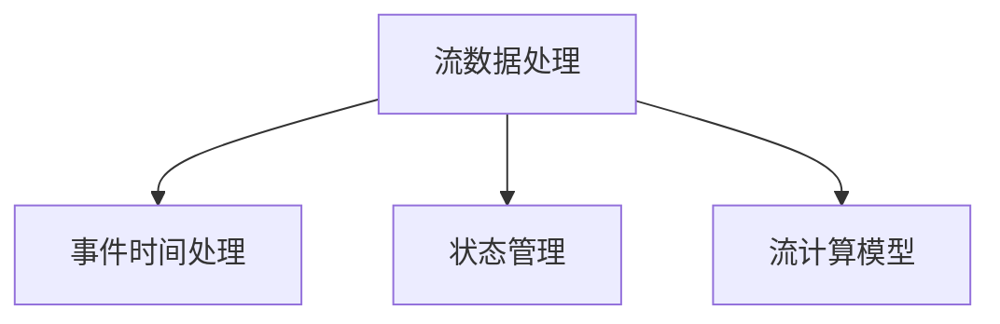

                 

# Flink原理与代码实例讲解

> 关键词：Apache Flink, 分布式流处理, 批处理, 窗口操作, 状态管理, 流式数据处理, 开源流计算框架

## 1. 背景介绍

### 1.1 问题由来
在现代大数据时代，数据处理需求日益复杂多样，传统批处理框架如Hadoop、Spark等已难以满足实时、高效、灵活的计算需求。Apache Flink作为一款开源流计算框架，凭借其低延迟、高吞吐率、可伸缩性、分布式等优势，迅速崛起为流处理领域的领军选手。

Flink最初由Berlin Research Group于2007年提出，并于2008年开始开源。Flink的核心理念是实现数据流的一次性处理。无论数据是流式传输还是静态文件，都可以用统一的方式来处理。它支持数据流的一次性处理，支持批处理、流处理、混合处理和增量计算等多种计算模型。

Flink以其高性能、易于使用和强大的编程模型在业界赢得了广泛的认可，已经在金融、电子商务、广告、物联网、新闻媒体等领域得到广泛应用。掌握Flink技术，对于开发者和运维工程师而言，是提升自身技术栈、参与大型数据处理项目的关键一步。

### 1.2 问题核心关键点
Flink的核心原理和架构可以分为以下几个关键点：
1. **流数据处理模型**：Flink的流数据处理模型包括批处理、流处理、混合处理和增量计算。流处理模型是其核心，支持低延迟、高吞吐率的数据流处理。
2. **分布式计算框架**：Flink采用分布式计算架构，将计算任务分布到集群中的多个节点上，提高处理效率。
3. **事件时间处理**：Flink支持事件时间处理，可以处理延迟数据和乱序数据，适用于实时流处理场景。
4. **状态管理**：Flink采用分布式状态管理机制，支持状态存储、检查点和容错处理，保证数据的一致性和可靠性。
5. **集成与生态系统**：Flink通过Kafka、Spark、Hadoop、AWS等集成，拓展了数据处理的应用场景。

## 2. 核心概念与联系

### 2.1 核心概念概述

为了更好地理解Flink的核心原理和架构，本节将介绍几个密切相关的核心概念：

- **流数据处理**：Flink的核心特性，即处理实时流数据，支持低延迟、高吞吐率、可伸缩性的流处理。
- **事件时间处理**：Flink的另一个重要特性，支持延迟数据和乱序数据的处理，适用于复杂的实时流处理场景。
- **状态管理**：Flink的分布式状态管理机制，包括状态存储、检查点和容错处理，保证数据的一致性和可靠性。
- **流计算模型**：Flink支持多种计算模型，包括批处理、流处理、混合处理和增量计算，支持多样化的数据处理需求。

这些核心概念之间的逻辑关系可以通过以下Mermaid流程图来展示：



这个流程图展示了两大核心概念之间的逻辑关系：

1. 流数据处理是Flink的核心，可以处理实时流数据，支持低延迟、高吞吐率、可伸缩性的流处理。
2. 事件时间处理是在流处理基础上进行的扩展，支持延迟数据和乱序数据的处理，适用于复杂的实时流处理场景。
3. 状态管理是Flink的分布式状态管理机制，包括状态存储、检查点和容错处理，保证数据的一致性和可靠性。
4. 流计算模型是Flink支持的多样化的数据处理需求，包括批处理、流处理、混合处理和增量计算。

这些核心概念共同构成了Flink的流处理框架，使其能够在各种场景下处理大规模数据流。通过理解这些核心概念，我们可以更好地把握Flink的工作原理和优化方向。

## 3. 核心算法原理 & 具体操作步骤
### 3.1 算法原理概述

Flink的流数据处理模型基于事件驱动和基于时间的处理。Flink的核心算法包括：

- **事件驱动处理**：基于事件的顺序和触发器，对数据进行处理。
- **基于时间处理**：基于时间窗口和触发器，对数据进行处理。

Flink支持两种时间模型：处理时间和事件时间。处理时间是指数据到达处理节点的系统时间，事件时间是指数据产生的时间。事件时间处理可以处理延迟数据和乱序数据，适用于复杂的实时流处理场景。

Flink的流计算模型包括批处理、流处理、混合处理和增量计算。批处理是指对历史数据进行一次性处理；流处理是指对实时数据进行流式处理；混合处理是指将批处理和流处理结合，进行增量计算；增量计算是指对历史数据进行增量处理。

Flink的分布式计算架构采用“计算节点+数据节点”的模式，每个节点都可以处理一部分计算任务，并与其他节点协同工作。Flink支持分布式计算，可以处理大规模的数据流。

### 3.2 算法步骤详解

Flink的流数据处理步骤包括以下几个关键步骤：

**Step 1: 数据源和数据集**  
- 数据源是Flink流处理的基础。Flink支持多种数据源，如Kafka、Spark、Hadoop等。
- 数据集是Flink流处理的输入数据。Flink支持多种数据集格式，如JSON、XML、CSV等。

**Step 2: 数据流处理**  
- 数据流处理是Flink流处理的核心。Flink提供多种数据流处理操作，如映射、过滤、聚合、连接、窗口等。
- Flink的流处理操作支持并行处理，可以提高处理效率。

**Step 3: 状态管理**  
- 状态管理是Flink的分布式状态管理机制。Flink支持多种状态存储方式，如文件系统、Redis、RocksDB等。
- Flink支持检查点机制，可以保证数据的一致性和可靠性。

**Step 4: 容错处理**  
- Flink支持容错处理机制，可以在节点故障时重新计算丢失的数据。
- Flink支持异常处理机制，可以处理数据处理过程中的异常情况。

### 3.3 算法优缺点

Flink的流数据处理模型具有以下优点：

- **低延迟**：Flink支持低延迟的流处理，可以处理实时数据。
- **高吞吐率**：Flink支持高吞吐率的流处理，可以处理大规模数据流。
- **可伸缩性**：Flink支持分布式计算，可以处理大规模数据流。

Flink的流数据处理模型也存在以下缺点：

- **复杂性**：Flink的流处理模型较为复杂，需要一定的学习成本。
- **资源占用**：Flink的流处理模型需要较多的资源，如内存、CPU等。
- **稳定性**：Flink的流处理模型需要保证系统的稳定性，需要一定的运维成本。

### 3.4 算法应用领域

Flink的流数据处理模型在以下几个领域得到了广泛的应用：

- **实时数据处理**：Flink支持实时数据处理，适用于实时流数据的处理场景，如广告推荐、实时数据监控等。
- **复杂事件处理**：Flink支持复杂事件处理，可以处理复杂的事件数据，适用于金融风险控制、实时数据分析等场景。
- **分布式计算**：Flink支持分布式计算，可以处理大规模的数据流，适用于大数据分析、实时数据存储等场景。
- **增量计算**：Flink支持增量计算，可以处理历史数据的增量更新，适用于数据挖掘、数据分析等场景。

## 4. 数学模型和公式 & 详细讲解 & 举例说明
### 4.1 数学模型构建

Flink的流数据处理模型基于事件驱动和基于时间的处理。Flink的核心算法包括：

- **事件驱动处理**：基于事件的顺序和触发器，对数据进行处理。
- **基于时间处理**：基于时间窗口和触发器，对数据进行处理。

Flink支持两种时间模型：处理时间和事件时间。处理时间是指数据到达处理节点的系统时间，事件时间是指数据产生的时间。事件时间处理可以处理延迟数据和乱序数据，适用于复杂的实时流处理场景。

Flink的流计算模型包括批处理、流处理、混合处理和增量计算。批处理是指对历史数据进行一次性处理；流处理是指对实时数据进行流式处理；混合处理是指将批处理和流处理结合，进行增量计算；增量计算是指对历史数据进行增量处理。

Flink的分布式计算架构采用“计算节点+数据节点”的模式，每个节点都可以处理一部分计算任务，并与其他节点协同工作。Flink支持分布式计算，可以处理大规模的数据流。

### 4.2 公式推导过程

以下是Flink事件时间处理的公式推导过程：

假设事件数据流为 $d_i(t_i)$，处理时间为 $t_p$，事件时间为 $t_e$。则事件时间处理的公式为：

$$
d_i(t_e) = d_i(t_p) + \Delta t
$$

其中 $\Delta t$ 是事件时间与处理时间的差值。在Flink中，可以使用事件时间处理解决延迟数据和乱序数据的问题。

### 4.3 案例分析与讲解

下面以Flink的实时数据处理为例，进行案例分析：

假设有一个实时数据流 $d(t)$，实时计算流数据流 $d_c(t)$。实时数据流 $d(t)$ 的计算公式为：

$$
d_c(t) = \sum_{t_i=t_0}^{t} d_i(t_i)
$$

其中 $t_0$ 是实时数据流的开始时间。在Flink中，可以使用事件时间处理解决延迟数据和乱序数据的问题。例如，可以使用事件时间窗口对实时数据流进行聚合，得到事件时间流 $d_e(t)$。实时数据流 $d_c(t)$ 的计算公式变为：

$$
d_c(t) = \sum_{t_i=t_0}^{t} d_e_i(t_i)
$$

其中 $t_0$ 是事件时间流的开始时间。通过事件时间处理，Flink可以处理延迟数据和乱序数据，适用于复杂的实时流处理场景。

## 5. 项目实践：代码实例和详细解释说明
### 5.1 开发环境搭建

在进行Flink项目开发前，我们需要准备好开发环境。以下是使用Python进行Flink开发的环境配置流程：

1. 安装Java：从官网下载并安装Java Runtime Environment。
2. 安装Flink：从官网下载并安装Flink，选择适合自己操作系统的安装包。
3. 安装Python库：安装Apache Flink Python API，可以从GitHub上获取源代码安装。

完成上述步骤后，即可在Flink环境中开始项目开发。

### 5.2 源代码详细实现

下面以Flink的实时数据处理为例，给出使用Python API进行实时数据处理代码的实现：

```python
from pyflink.datastream import StreamExecutionEnvironment
from pyflink.table import StreamTableEnvironment

# 创建Flink环境
env = StreamExecutionEnvironment.get_execution_environment()
table_env = StreamTableEnvironment.create(env)

# 数据源
data_source = env.add_source(KafkaSource(...))

# 数据流处理
data_stream = env.add_source(data_source)

# 数据集
data_set = table_env.from_elements(data_stream)

# 实时数据处理
result = data_set.map(lambda x: x+1)

# 输出结果
table_env.execute("实时数据处理")
```

### 5.3 代码解读与分析

让我们再详细解读一下关键代码的实现细节：

**StreamExecutionEnvironment**：
- 创建Flink环境，用于管理计算任务。

**StreamTableEnvironment**：
- 创建Flink表环境，用于处理SQL语句。

**KafkaSource**：
- 从Kafka数据源获取实时数据流，支持Kafka的多种配置方式。

**StreamingDataStream**：
- 对实时数据流进行处理，支持多种数据流处理操作，如映射、过滤、聚合、连接、窗口等。

**StreamingDataStream.map**：
- 对实时数据流进行映射操作，例如增加1，支持多种映射函数。

**StreamTableEnvironment.execute**：
- 执行SQL语句，将结果输出到指定节点。

可以看到，Flink的实时数据处理代码相对简洁高效，开发者可以将更多精力放在数据处理逻辑和SQL语句的编写上，而不必过多关注底层的实现细节。

## 6. 实际应用场景
### 6.1 实时数据处理

Flink的实时数据处理广泛应用于实时数据分析、实时监控、实时推荐等场景中。传统的数据处理框架如Hadoop、Spark等，虽然可以处理批数据，但无法满足实时数据分析的需求。而Flink支持实时数据处理，可以处理实时流数据，适用于实时数据分析、实时监控等场景。

在实时数据分析场景中，Flink可以实时获取数据流，对其进行实时处理和分析，生成实时报表和图表，支持实时监控和预警。例如，可以使用Flink实时处理金融数据，生成实时交易报表，支持风险控制和实时监控。

在实时推荐场景中，Flink可以实时获取用户行为数据，对其进行实时处理和分析，生成推荐结果，支持实时推荐系统。例如，可以使用Flink实时处理用户行为数据，生成实时推荐结果，支持实时广告推荐。

### 6.2 复杂事件处理

Flink的复杂事件处理广泛应用于金融风险控制、实时数据分析等场景中。传统的数据处理框架如Hadoop、Spark等，虽然可以处理批数据，但无法处理复杂事件数据。而Flink支持复杂事件处理，可以处理复杂的事件数据，适用于金融风险控制、实时数据分析等场景。

在金融风险控制场景中，Flink可以实时获取金融交易数据，对其进行复杂事件处理，生成风险报告，支持风险控制和实时监控。例如，可以使用Flink实时处理金融交易数据，生成风险报告，支持实时风险控制。

在实时数据分析场景中，Flink可以实时获取数据流，对其进行复杂事件处理，生成实时报表和图表，支持实时监控和预警。例如，可以使用Flink实时处理金融数据，生成实时报表，支持实时监控。

### 6.3 分布式计算

Flink的分布式计算广泛应用于大数据分析、实时数据存储等场景中。传统的数据处理框架如Hadoop、Spark等，虽然可以处理批数据，但无法处理大规模数据流。而Flink支持分布式计算，可以处理大规模数据流，适用于大数据分析、实时数据存储等场景。

在大数据分析场景中，Flink可以处理大规模数据流，对其进行分布式计算，生成分析结果，支持大数据分析。例如，可以使用Flink处理大规模金融数据，生成分析结果，支持大数据分析。

在实时数据存储场景中，Flink可以处理实时数据流，对其进行分布式存储，支持实时数据存储。例如，可以使用Flink处理实时金融数据，生成实时存储结果，支持实时数据存储。

### 6.4 未来应用展望

随着Flink技术的不断演进，其在多个领域的应用将不断拓展，为各行各业带来新的变革。

在金融领域，Flink的实时数据处理和复杂事件处理，可以提升金融交易的实时性和准确性，支持金融风险控制和实时监控。

在医疗领域，Flink的实时数据处理和大数据分析，可以提升医疗数据的实时性和准确性，支持医疗数据分析和实时监控。

在物联网领域，Flink的实时数据处理和大数据分析，可以提升物联网数据的实时性和准确性，支持物联网数据分析和实时监控。

此外，在广告、新闻媒体、物联网等众多领域，Flink的实时数据处理和大数据分析，将不断拓展其应用范围，为各行各业带来新的变革。

## 7. 工具和资源推荐
### 7.1 学习资源推荐

为了帮助开发者系统掌握Flink技术，这里推荐一些优质的学习资源：

1. Flink官方文档：Flink官方文档是学习Flink技术的最佳资源，涵盖了Flink的各个方面，包括安装、配置、使用等。

2. Flink中文文档：Flink中文文档是Flink官方文档的中文版，更适合中文用户学习。

3. Flink培训课程：Flink培训课程是Flink官方提供的培训资源，包括视频课程、实战项目等。

4. Apache Flink社区：Apache Flink社区是Flink用户交流和分享的平台，提供丰富的学习资源和支持。

5. Flink Meetup：Flink Meetup是Flink用户交流和分享的平台，提供丰富的学习资源和支持。

通过对这些资源的学习实践，相信你一定能够快速掌握Flink技术的精髓，并用于解决实际的Flink问题。

### 7.2 开发工具推荐

高效的开发离不开优秀的工具支持。以下是几款用于Flink开发常用的工具：

1. IntelliJ IDEA：由JetBrains开发的一款IDE，支持Flink的开发和调试。

2. Eclipse：支持Flink的开发和调试，提供丰富的插件和工具。

3. PyCharm：由JetBrains开发的一款IDE，支持Flink的开发和调试。

4. PySpark：由Apache Spark提供的一款工具，支持Flink与Spark的集成开发。

5. PyFlink：由Apache Flink提供的一款工具，支持Flink的Python API开发。

6. Flink Job Manager：Flink Job Manager是Flink的调度管理工具，支持Flink作业的监控和管理。

7. Flink Table Planner：Flink Table Planner是Flink的SQL规划工具，支持SQL语句的优化和执行。

合理利用这些工具，可以显著提升Flink开发的效率，加快创新迭代的步伐。

### 7.3 相关论文推荐

Flink技术的发展源于学界的持续研究。以下是几篇奠基性的相关论文，推荐阅读：

1. Apache Flink: Unified Stream Processing Framework：Flink的原论文，详细介绍了Flink的架构和算法。

2. Flow and Process Model in Apache Flink：详细介绍了Flink的事件驱动处理和基于时间处理。

3. High Throughput in Apache Flink：详细介绍了Flink的高吞吐率处理和流式处理。

4. Fault Tolerance in Apache Flink：详细介绍了Flink的容错处理和状态管理。

这些论文代表了大数据技术的发展脉络。通过学习这些前沿成果，可以帮助研究者把握学科前进方向，激发更多的创新灵感。

## 8. 总结：未来发展趋势与挑战
### 8.1 总结

本文对Apache Flink流数据处理模型进行了全面系统的介绍。首先阐述了Flink流数据处理模型的核心原理和架构，明确了流数据处理、事件时间处理、状态管理、流计算模型等关键概念。其次，从原理到实践，详细讲解了Flink的流数据处理模型的数学原理和关键步骤，给出了流数据处理代码的完整实现。同时，本文还广泛探讨了Flink在实时数据处理、复杂事件处理、分布式计算等领域的实际应用，展示了Flink技术的广泛应用前景。此外，本文精选了Flink技术的各类学习资源，力求为读者提供全方位的技术指引。

通过本文的系统梳理，可以看到，Apache Flink流数据处理模型正在成为大数据处理领域的重要范式，极大地提升了数据处理的实时性、灵活性和可伸缩性。Flink的流数据处理模型在未来将面临更多的挑战，但通过不断创新和优化，相信Flink必将在构建智能系统、实现数字化转型中扮演越来越重要的角色。

### 8.2 未来发展趋势

展望未来，Apache Flink流数据处理模型将呈现以下几个发展趋势：

1. **性能优化**：Flink将继续优化性能，提升流处理的速度和稳定性。
2. **生态系统扩展**：Flink将进一步扩展生态系统，支持更多的数据源和存储系统。
3. **应用场景拓展**：Flink将拓展到更多领域，如医疗、物联网、智能制造等。
4. **新特性的引入**：Flink将引入更多新特性，如流式SQL、增量计算等。
5. **与其他技术的集成**：Flink将与其他大数据技术进行更深入的集成，如Spark、Hadoop等。
6. **分布式计算的优化**：Flink将优化分布式计算，支持更高效、更灵活的分布式计算框架。

以上趋势凸显了Apache Flink流数据处理技术的广阔前景。这些方向的探索发展，必将进一步提升Flink系统的性能和应用范围，为大数据处理带来新的变革。

### 8.3 面临的挑战

尽管Apache Flink流数据处理模型已经取得了瞩目成就，但在迈向更加智能化、普适化应用的过程中，它仍面临着诸多挑战：

1. **资源占用**：Flink的流处理模型需要较多的资源，如内存、CPU等，如何优化资源使用是未来的一大挑战。
2. **稳定性**：Flink的流处理模型需要保证系统的稳定性，如何处理异常情况，保障数据的一致性是未来的一大挑战。
3. **应用复杂性**：Flink的流处理模型较为复杂，需要一定的学习成本，如何简化应用复杂性，降低使用门槛是未来的一大挑战。
4. **数据一致性**：Flink的流处理模型需要保证数据的一致性，如何处理延迟数据和乱序数据是未来的一大挑战。
5. **应用拓展性**：Flink的流处理模型需要支持更多的应用场景，如何拓展应用场景是未来的一大挑战。

Flink需要不断优化性能、生态系统和应用复杂性，才能满足日益增长的应用需求。未来，Flink的研究方向将聚焦于分布式计算优化、数据一致性保障、应用场景拓展等方向。

### 8.4 研究展望

展望未来，Apache Flink流数据处理技术的研究方向将聚焦于以下几个方面：

1. **分布式计算优化**：Flink将继续优化分布式计算，支持更高效、更灵活的分布式计算框架。
2. **数据一致性保障**：Flink将继续优化数据一致性保障机制，处理延迟数据和乱序数据。
3. **应用场景拓展**：Flink将继续拓展应用场景，支持更多的应用场景，如医疗、物联网等。
4. **新特性的引入**：Flink将继续引入更多新特性，如流式SQL、增量计算等。
5. **与其他技术的集成**：Flink将继续与其他大数据技术进行更深入的集成，如Spark、Hadoop等。

这些研究方向将进一步提升Flink系统的性能和应用范围，为大数据处理带来新的变革。相信随着Flink技术的不断演进，Flink必将在构建智能系统、实现数字化转型中扮演越来越重要的角色。

## 9. 附录：常见问题与解答
----------------------------------------------------------------

**Q1：Flink与Spark有什么不同？**

A: Flink和Spark都是大数据处理框架，但它们的处理模型不同。Spark处理批数据，Flink处理流数据。Flink支持低延迟、高吞吐率、可伸缩性的流处理，适用于实时数据处理场景。Spark支持批处理，适用于批数据处理场景。

**Q2：Flink支持哪些数据源？**

A: Flink支持多种数据源，如Kafka、Spark、Hadoop等。Flink的数据源支持多种配置方式，可以根据不同的应用场景选择合适的数据源。

**Q3：Flink的状态管理机制是什么？**

A: Flink的状态管理机制包括状态存储、检查点和容错处理。Flink支持多种状态存储方式，如文件系统、Redis、RocksDB等。Flink支持检查点机制，可以在节点故障时重新计算丢失的数据。Flink支持容错处理机制，可以在节点故障时恢复数据。

**Q4：Flink的流处理模型有哪些优点？**

A: Flink的流处理模型具有以下优点：
1. 低延迟：Flink支持低延迟的流处理，可以处理实时数据。
2. 高吞吐率：Flink支持高吞吐率的流处理，可以处理大规模数据流。
3. 可伸缩性：Flink支持分布式计算，可以处理大规模数据流。

**Q5：Flink的应用场景有哪些？**

A: Flink的应用场景包括：
1. 实时数据处理：适用于实时数据分析、实时监控等场景。
2. 复杂事件处理：适用于金融风险控制、实时数据分析等场景。
3. 分布式计算：适用于大数据分析、实时数据存储等场景。

通过这些问题和解答，相信你对Flink的流处理模型有更深入的了解。掌握Flink技术，对于开发者和运维工程师而言，是提升自身技术栈、参与大型数据处理项目的关键一步。

