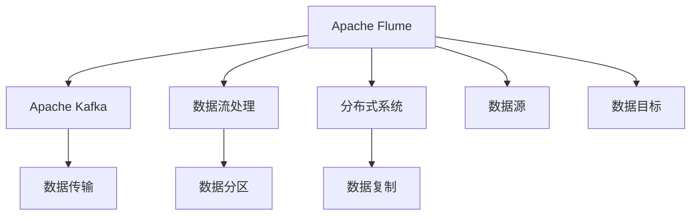

                 

# Flume Channel原理与代码实例讲解

> 关键词：Flume Channel, Apache Flume, Apache Kafka, 数据流处理, 分布式系统, 数据采集, 日志管理

## 1. 背景介绍

### 1.1 问题由来

随着数据产生量的爆炸性增长，企业对于数据流的处理需求日益增加。Apache Flume是一个由Apache基金会开发的分布式、可扩展的日志收集系统。它旨在提供一种可靠、高效的数据流传输机制，适用于各种日志收集和数据流处理场景。其中，Flume Channel作为数据传输的核心组件，是实现数据收集和传输的关键。本文将详细介绍Flume Channel的原理与代码实现，并结合实际案例进行讲解。

### 1.2 问题核心关键点

Flume Channel的核心关键点包括：

- 分布式数据传输：Flume Channel支持分布式数据传输，可以处理大规模的数据流。
- 高可靠性：通过心跳机制、数据复制等方式保证数据传输的可靠性。
- 高性能：通过使用线程池、分段等技术优化数据传输性能。
- 灵活性：支持多种数据源和目标的连接，适用于多种数据采集场景。

## 2. 核心概念与联系

### 2.1 核心概念概述

为更好地理解Flume Channel的原理与代码实现，本节将介绍几个密切相关的核心概念：

- Apache Flume：一个开源的分布式日志收集系统，支持数据的采集、传输和存储。
- Apache Kafka：一个高吞吐量的分布式消息系统，支持数据的发布与订阅。
- 数据流处理：对数据流进行处理、存储和分析的过程。
- 分布式系统：将计算任务分散到多个节点上，提高系统的可扩展性和可靠性。
- 数据源：数据流处理系统的输入来源。
- 数据目标：数据流处理系统的输出目的地。
- 数据传输：在数据源和数据目标之间传递数据的过程。
- 数据传输协议：数据传输过程中使用的通信协议。
- 数据分区：将数据流分成多个子流，提高系统的并行处理能力。
- 数据复制：在多个节点上复制数据，提高系统的容错能力和数据可靠性。

这些核心概念之间的逻辑关系可以通过以下Mermaid流程图来展示：



这个流程图展示了大数据生态中的核心组件及其之间的关系：

1. Apache Flume从数据源采集数据，并通过数据传输机制传递到Apache Kafka。
2. Apache Kafka将数据进行存储和发布，并支持数据的订阅。
3. 数据流处理系统对数据进行处理、存储和分析，并支持分布式计算。
4. 数据分区和数据复制技术提高系统的并行处理能力和数据可靠性。

## 3. 核心算法原理 & 具体操作步骤

### 3.1 算法原理概述

Flume Channel的原理可以概括为以下几个方面：

- 数据源与目标连接：Flume Channel支持多种数据源和目标的连接，如HDFS、S3、Elasticsearch等。
- 数据传输：通过使用线程池、分段等技术优化数据传输性能。
- 数据分区：将数据流分成多个子流，提高系统的并行处理能力。
- 数据复制：在多个节点上复制数据，提高系统的容错能力和数据可靠性。
- 高可靠性：通过心跳机制、数据复制等方式保证数据传输的可靠性。

### 3.2 算法步骤详解

Flume Channel的核心步骤如下：

**Step 1: 配置数据源和目标**

- 配置数据源：如HDFS、S3、Elasticsearch等。
- 配置数据目标：如Apache Kafka、HDFS、Elasticsearch等。

**Step 2: 连接数据源和目标**

- 使用Flume Channel连接数据源和目标。
- 设置数据传输的协议和传输方式。

**Step 3: 数据传输**

- 使用线程池技术优化数据传输性能。
- 将数据流分成多个子流，提高系统的并行处理能力。
- 在多个节点上复制数据，提高系统的容错能力和数据可靠性。

**Step 4: 数据分区**

- 将数据流分成多个子流，提高系统的并行处理能力。

**Step 5: 数据复制**

- 在多个节点上复制数据，提高系统的容错能力和数据可靠性。

**Step 6: 高可靠性保障**

- 使用心跳机制、数据复制等方式保证数据传输的可靠性。

### 3.3 算法优缺点

Flume Channel具有以下优点：

- 高可靠性：通过心跳机制、数据复制等方式保证数据传输的可靠性。
- 高性能：使用线程池、分段等技术优化数据传输性能。
- 灵活性：支持多种数据源和目标的连接，适用于多种数据采集场景。
- 高可用性：支持水平扩展，能够处理大规模的数据流。

同时，该方法也存在一定的局限性：

- 配置复杂：需要详细配置数据源、目标和传输协议等参数。
- 性能瓶颈：数据传输速率受限于网络和存储设备的性能。
- 扩展困难：在大规模数据采集场景下，可能需要较高的系统成本。

尽管存在这些局限性，但就目前而言，Flume Channel仍是数据流传输的首选方案，广泛应用于大规模日志采集和数据流处理场景。

### 3.4 算法应用领域

Flume Channel在数据流处理和分布式系统中有广泛应用，以下是几个典型场景：

- 日志采集：企业需要收集和存储海量日志数据，使用Flume Channel可以从各种数据源采集日志数据。
- 数据同步：需要将数据从旧系统同步到新系统，使用Flume Channel可以实现数据的可靠传输。
- 数据处理：需要对数据进行实时处理、分析和存储，使用Flume Channel可以将数据高效地传输到数据目标。
- 实时监控：需要对系统的运行状态进行实时监控，使用Flume Channel可以采集和分析系统日志数据。

此外，Flume Channel还被创新性地应用于更多场景中，如大数据采集、数据湖构建等，为大数据生态系统的建设提供了强有力的支撑。

## 4. 数学模型和公式 & 详细讲解 & 举例说明（备注：数学公式请使用latex格式，latex嵌入文中独立段落使用 $$，段落内使用 $)
### 4.1 数学模型构建

Flume Channel的数据传输过程可以抽象为如下模型：

设数据源为 $S$，数据目标为 $D$，数据传输协议为 $P$，数据传输速率为 $r$，数据分区数为 $n$，数据复制系数为 $m$，系统可用性为 $u$。则系统总传输速率 $T$ 可以表示为：

$$
T = \frac{n \times r \times m}{u}
$$

其中 $n$ 表示数据分区数，$r$ 表示单个分区的数据传输速率，$m$ 表示数据复制系数，$u$ 表示系统的可用性。

### 4.2 公式推导过程

对于单个分区，数据传输速率 $r$ 可以表示为：

$$
r = \frac{data\_size}{time\_taken}
$$

其中 $data\_size$ 表示数据大小，$time\_taken$ 表示传输数据所需时间。

在多分区情况下，总传输速率 $T$ 可以表示为：

$$
T = \frac{n \times r}{u}
$$

其中 $n$ 表示数据分区数，$r$ 表示单个分区的数据传输速率，$u$ 表示系统的可用性。

### 4.3 案例分析与讲解

假设某企业使用Flume Channel从旧系统同步数据到新系统，其中旧系统每秒生成1MB数据，新系统每秒处理2MB数据，数据分区数为4，数据复制系数为2，系统可用性为99%。则总传输速率 $T$ 可以计算如下：

$$
r = \frac{1MB}{time\_taken}
$$

假设旧系统数据传输时间 $time\_taken$ 为5秒，则单个分区的数据传输速率为：

$$
r = \frac{1MB}{5s} = 0.2MB/s
$$

总传输速率 $T$ 为：

$$
T = \frac{4 \times 0.2MB/s}{0.99} = 0.8MB/s
$$

因此，该企业可以使用Flume Channel每秒传输800KB的数据到新系统。

## 5. 项目实践：代码实例和详细解释说明
### 5.1 开发环境搭建

在进行Flume Channel的实践前，我们需要准备好开发环境。以下是使用Python进行Flume Channel开发的Python环境配置流程：

1. 安装Python：从官网下载并安装Python。
2. 安装Flume Channel：使用pip安装Flume Channel的Python客户端库。
3. 安装Flume：从官网下载并安装Flume。
4. 配置Flume：配置Flume的参数，包括数据源、数据目标和传输协议等。
5. 启动Flume：启动Flume服务，连接数据源和数据目标。

### 5.2 源代码详细实现

下面我们以从Apache Kafka采集数据为例，给出使用Flume Channel进行数据采集的Python代码实现。

首先，定义Flume Channel的配置文件：

```python
from flume import FlumeClient

# 配置Flume客户端
flume_client = FlumeClient(host='localhost', port=4145, username='user', password='pass')

# 配置数据源和数据目标
data_source = {'input': 'kafka://localhost:9092/mytopic'}
data_target = {'output': 'hdfs://localhost:9000/user/hadoop/data'}

# 配置Flume Channel
channel_config = {
    'channel_name': 'channel',
    'capacity': 1024,
    'data_source': data_source,
    'data_target': data_target,
    'partition_num': 4
}

# 创建Flume Channel
flume_client.create_channel(channel_config)
```

然后，启动Flume Channel服务：

```python
flume_client.start()
```

接着，定义数据处理函数：

```python
def process_data(data):
    # 处理数据，返回结果
    return processed_data
```

最后，将数据通过Flume Channel传输到数据目标：

```python
def send_data(data):
    flume_client.put(data, 'channel')
```

以上代码实现了通过Flume Channel从Apache Kafka采集数据，并进行数据处理的完整流程。可以看到，Flume Channel提供了简单易用的API，使得开发者可以快速实现数据流传输和处理功能。

### 5.3 代码解读与分析

让我们再详细解读一下关键代码的实现细节：

**FlumeClient类**：
- `__init__`方法：初始化Flume客户端，设置Flume服务的地址、端口、用户名和密码等参数。
- `create_channel`方法：创建Flume Channel，设置通道名称、容量、数据源、数据目标和分区数等参数。
- `start`方法：启动Flume Channel服务。
- `put`方法：将数据发送到Flume Channel。

**channel_config字典**：
- `channel_name`：Flume Channel的名称。
- `capacity`：Flume Channel的容量，表示单个数据分区的缓冲区大小。
- `data_source`：Flume Channel的数据源，可以是Apache Kafka、HDFS、S3等。
- `data_target`：Flume Channel的数据目标，可以是Apache Kafka、HDFS、Elasticsearch等。
- `partition_num`：Flume Channel的分区数，表示将数据流分成多个子流的数量。

通过上述代码，我们可以快速构建一个Flume Channel，实现从Apache Kafka采集数据的功能。

## 6. 实际应用场景

### 6.1 日志采集

企业需要收集和存储海量日志数据，使用Flume Channel可以从各种数据源采集日志数据，并传输到HDFS、Elasticsearch等数据目标中进行存储和分析。通过Flume Channel，企业可以实现自动化的日志采集和存储，减少人工操作成本，提高数据管理的效率和安全性。

### 6.2 数据同步

需要将数据从旧系统同步到新系统，使用Flume Channel可以实现数据的可靠传输。通过配置数据源和数据目标，Flume Channel可以将旧系统的数据高效地传输到新系统，并支持数据复制和故障恢复，确保数据同步的稳定性和可靠性。

### 6.3 数据处理

需要对数据进行实时处理、分析和存储，使用Flume Channel可以将数据高效地传输到数据目标，并进行数据处理和存储。通过Flume Channel，企业可以实现对数据流的实时监控和分析，发现数据异常和故障，及时采取措施进行修复，提高数据处理的效率和质量。

### 6.4 实时监控

需要对系统的运行状态进行实时监控，使用Flume Channel可以采集和分析系统日志数据，并实时反馈监控结果。通过Flume Channel，企业可以实现对系统运行的全面监控，及时发现系统异常和故障，并采取措施进行修复，提高系统的稳定性和可靠性。

### 6.5 数据湖构建

需要将数据存储到数据湖中，使用Flume Channel可以将数据高效地传输到Hadoop等大数据平台中进行存储和分析。通过Flume Channel，企业可以实现对数据的全面管理和分析，发现数据中的潜在的价值和规律，为企业的决策提供支持。

## 7. 工具和资源推荐

### 7.1 学习资源推荐

为了帮助开发者系统掌握Flume Channel的理论基础和实践技巧，这里推荐一些优质的学习资源：

1. Apache Flume官方文档：提供了详细的Flume Channel的使用说明和配置指南。
2. Apache Kafka官方文档：提供了Apache Kafka的使用说明和API接口。
3. Hadoop官方文档：提供了Hadoop的使用说明和大数据处理技术。
4. Elasticsearch官方文档：提供了Elasticsearch的使用说明和搜索技术。
5. Python Flume客户端库文档：提供了Flume Channel的Python客户端库的使用说明和API接口。
6. 《大数据技术与应用》：介绍大数据生态系统的各个组件和应用场景，适合大数据开发人员参考。

通过对这些资源的学习实践，相信你一定能够快速掌握Flume Channel的原理和应用方法，并用于解决实际的问题。

### 7.2 开发工具推荐

高效的开发离不开优秀的工具支持。以下是几款用于Flume Channel开发的常用工具：

1. Python：Python是一种易学易用的编程语言，适合快速迭代研究。Flume Channel提供了Python客户端库，方便开发者实现数据流传输和处理功能。
2. Apache Flume：Flume是一个开源的分布式日志收集系统，提供了丰富的日志采集和数据传输功能。
3. Apache Kafka：Kafka是一个高吞吐量的分布式消息系统，支持数据的发布与订阅，适合处理大规模数据流。
4. Hadoop：Hadoop是一个开源的大数据处理框架，支持数据的存储和分析。
5. Elasticsearch：Elasticsearch是一个分布式的搜索引擎，支持数据的存储和查询。
6. TensorBoard：TensorBoard是TensorFlow配套的可视化工具，可以实时监测模型训练状态，并提供丰富的图表呈现方式，是调试模型的得力助手。
7. Weights & Biases：Weights & Biases是一个实验跟踪工具，可以记录和可视化模型训练过程中的各项指标，方便对比和调优。
8. Jupyter Notebook：Jupyter Notebook是一个开源的交互式编程环境，支持多种编程语言和数据格式，适合进行数据分析和可视化。
9. Anaconda：Anaconda是一个Python科学计算平台，提供了丰富的科学计算库和工具。

合理利用这些工具，可以显著提升Flume Channel的开发效率，加快创新迭代的步伐。

### 7.3 相关论文推荐

Flume Channel的研究始于学界的持续研究。以下是几篇奠基性的相关论文，推荐阅读：

1. Topology Controlled Streaming in a Peer-to-Peer Environment：提出了基于拓扑控制的网络流控制方法，为Flume Channel的设计提供了理论基础。
2. Apache Flume: The Hybrid System for Ingesting Large Volumes of Log Files in a Distributed Environment：介绍了Apache Flume的设计思想和架构，强调了分布式日志采集和数据传输的重要性。
3. Understanding Apache Flume: A Survey：对Apache Flume进行了全面的分析，介绍了Flume Channel的原理和应用场景。
4. Stateful Storage Abstraction for Hadoop Ecosystem：提出了基于状态管理的存储抽象方法，为Flume Channel的数据存储提供了支持。
5. Apache Kafka: The Scalable Stream Processing Framework：介绍了Apache Kafka的设计思想和架构，强调了分布式消息传输的重要性。
6. Real-Time Data Processing in a Distributed Environment：介绍了分布式数据处理的技术和方法，为Flume Channel的数据处理提供了理论支持。

这些论文代表了大数据生态中的核心组件和关键技术，通过学习这些前沿成果，可以帮助研究者把握学科前进方向，激发更多的创新灵感。

## 8. 总结：未来发展趋势与挑战

### 8.1 总结

本文对Flume Channel的原理与代码实现进行了全面系统的介绍。首先阐述了Flume Channel的背景和意义，明确了其在数据流处理和大数据生态中的核心作用。其次，从原理到实践，详细讲解了Flume Channel的核心组件和配置方法，给出了Flume Channel的完整代码实例。同时，本文还广泛探讨了Flume Channel在日志采集、数据同步、数据处理和实时监控等多个领域的应用前景，展示了Flume Channel的强大功能。此外，本文精选了Flume Channel的学习资源和开发工具，力求为开发者提供全方位的技术指引。

通过本文的系统梳理，可以看到，Flume Channel作为数据流传输的核心组件，在大数据生态中发挥着重要的作用。通过Flume Channel，企业可以实现自动化的数据采集和处理，提高数据管理的效率和安全性，实现对系统的全面监控和分析，发现数据异常和故障，并及时采取措施进行修复。未来，Flume Channel还将进一步拓展其应用领域，为大数据生态系统的建设提供强有力的支撑。

### 8.2 未来发展趋势

展望未来，Flume Channel将呈现以下几个发展趋势：

1. 分布式化：随着数据量的不断增长，Flume Channel将进一步拓展其分布式能力，支持更大规模的数据流传输和处理。
2. 高可靠性：通过引入心跳机制、数据复制等技术，进一步提高数据传输的可靠性和系统的容错能力。
3. 高性能：使用线程池、分段等技术优化数据传输性能，提高系统的处理能力。
4. 灵活性：支持更多数据源和目标的连接，适用于更多的数据采集场景。
5. 实时性：提高数据传输的实时性，满足实时监控和实时分析的需求。
6. 可视化：通过图形化界面，提高Flume Channel的易用性和操作效率。

以上趋势凸显了Flume Channel在数据流处理和分布式系统中的重要地位。这些方向的探索发展，必将进一步提升Flume Channel的性能和可用性，为大数据生态系统的建设提供强有力的支撑。

### 8.3 面临的挑战

尽管Flume Channel已经取得了一定的成就，但在迈向更加智能化、普适化应用的过程中，它仍面临诸多挑战：

1. 配置复杂：Flume Channel需要详细配置数据源、目标和传输协议等参数，配置不当可能导致数据传输失败。
2. 性能瓶颈：数据传输速率受限于网络和存储设备的性能，需要进一步优化数据传输算法和架构。
3. 扩展困难：在大规模数据采集场景下，可能需要较高的系统成本，如何降低系统成本、提高系统性能将是重要的研究课题。
4. 数据安全：在大数据采集和传输过程中，如何保证数据的安全性和隐私性，将是重要的研究方向。
5. 系统监控：在大规模数据采集和处理过程中，如何实现系统的监控和报警，将是重要的研究课题。

尽管存在这些挑战，但通过不断的技术改进和应用实践，Flume Channel必将在未来的大数据生态系统中发挥更加重要的作用，为企业的数字化转型提供强有力的支撑。

### 8.4 研究展望

面对Flume Channel所面临的种种挑战，未来的研究需要在以下几个方面寻求新的突破：

1. 简化配置：通过引入智能配置技术，自动生成最优的配置参数，简化用户的操作。
2. 优化传输：通过引入高效的传输算法和架构，进一步提升数据传输速率和可靠性。
3. 降低成本：通过引入节能技术和压缩算法，降低系统的成本和功耗。
4. 增强安全：通过引入加密和匿名化技术，提高数据的安全性和隐私性。
5. 实现可视化：通过引入图形化界面，提高系统的易用性和操作效率。
6. 支持新场景：支持更多的新数据源和目标，拓展Flume Channel的应用场景。

这些研究方向将推动Flume Channel向更加智能化、普适化应用迈进，为企业的数字化转型提供更强大的技术支撑。总之，Flume Channel的未来发展将不断拓展其应用范围，提升系统的性能和可用性，成为企业数字化转型的重要工具。

## 9. 附录：常见问题与解答

**Q1：如何使用Flume Channel进行数据采集？**

A: 使用Flume Channel进行数据采集需要配置数据源和数据目标，并启动Flume Channel服务。具体步骤如下：

1. 配置数据源：如HDFS、S3、Apache Kafka等。
2. 配置数据目标：如HDFS、S3、Apache Kafka等。
3. 启动Flume Channel服务：使用Flume客户端启动Flume Channel服务。

**Q2：Flume Channel如何保证数据传输的可靠性？**

A: Flume Channel通过以下方式保证数据传输的可靠性：

1. 数据复制：在多个节点上复制数据，提高系统的容错能力和数据可靠性。
2. 心跳机制：周期性地发送心跳信号，检测数据传输的状态和网络连接的稳定性。
3. 异常处理：检测数据传输中的异常情况，并进行相应的处理，如重传、丢弃等。

**Q3：如何优化Flume Channel的性能？**

A: 可以通过以下方式优化Flume Channel的性能：

1. 配置合适的分区数和数据传输速率。
2. 使用线程池技术优化数据传输性能。
3. 使用分段传输技术，提高系统的并行处理能力。
4. 使用压缩算法和节能技术，降低系统的成本和功耗。

**Q4：Flume Channel是否可以支持多种数据源和目标？**

A: Flume Channel可以支持多种数据源和目标的连接，如HDFS、S3、Apache Kafka、Elasticsearch等。通过配置数据源和数据目标，可以实现数据的可靠传输和存储。

**Q5：如何保证Flume Channel的安全性？**

A: 可以通过以下方式保证Flume Channel的安全性：

1. 使用加密技术对数据进行传输和存储，确保数据的安全性。
2. 使用匿名化技术对数据进行处理，保护用户隐私。
3. 对数据进行访问控制，防止未授权访问。

通过以上方式，可以确保Flume Channel在数据采集和传输过程中的安全性。

---

作者：禅与计算机程序设计艺术 / Zen and the Art of Computer Programming

