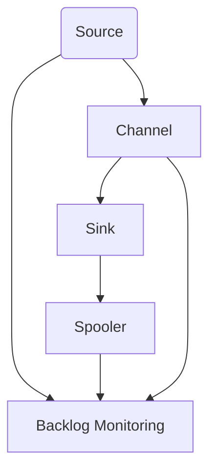

                 

# Flume原理与代码实例讲解

## 1. 背景介绍

### 1.1 问题由来
随着大数据时代的到来，企业对数据处理的需求日益增长。传统的数据采集和处理方式往往需要耗费大量时间和人力，且难以适应大规模数据流的处理需求。Flume作为一个分布式、可靠的数据收集系统，能够高效地处理大规模数据流，为大数据分析提供了坚实的基础。

### 1.2 问题核心关键点
Flume的核心在于其数据收集和传输的可靠性和稳定性。它通过多个组件协同工作，将数据从各种数据源收集并传输到目标系统，如Hadoop、ElasticSearch等。Flume的组件包括Source、Channel、Sink等，每个组件都有其独特的职责和作用，协同完成数据的收集和传输任务。

### 1.3 问题研究意义
Flume以其高效的数据采集和传输能力，在各大互联网公司如阿里巴巴、谷歌等广泛应用，成为大数据处理的标配。了解和掌握Flume的原理和使用方法，对于大数据处理初学者和资深工程师来说都具有重要意义。

## 2. 核心概念与联系

### 2.1 核心概念概述

Flume的核心概念主要包括以下几个方面：

- **Source**：数据源，负责从各种数据源收集数据，包括文件、日志、网络等。
- **Channel**：数据缓存区，负责暂存从Source收集的数据，等待传输到Sink。
- **Sink**：数据接收器，负责将Channel中的数据传输到目标系统，如Hadoop、ElasticSearch等。
- **Spooler**：数据传输器，负责定时从Channel中读取数据，并传输到Sink。
- **Backlog Monitoring**：用于监控Channel中未处理数据量的工具。

这些核心概念构成了Flume的基本框架，使得Flume能够高效、稳定地处理大规模数据流。

### 2.2 核心概念原理和架构的 Mermaid 流程图



这个流程图展示了Flume的基本数据流模型：

1. **Source**：从各种数据源收集数据。
2. **Channel**：暂存收集的数据。
3. **Sink**：将数据传输到目标系统。
4. **Spooler**：定时从Channel中读取数据并传输。
5. **Backlog Monitoring**：监控未处理数据的数量。

这些组件协同工作，确保数据能够高效、可靠地从Source传输到Sink。

## 3. 核心算法原理 & 具体操作步骤

### 3.1 算法原理概述
Flume的核心算法主要围绕数据收集和传输的可靠性和稳定性展开。其算法原理包括以下几个方面：

- **数据分片和聚合**：为了处理大规模数据流，Flume将数据分片并逐片传输，同时将不同来源的数据进行聚合，以减少网络传输的复杂性。
- **通道缓存和Spooler**：通过Channel缓存和Spooler定时传输，确保数据的稳定性和可靠性。
- **错误处理和重试机制**：在数据传输过程中，如果出现错误，Flume会自动重试，确保数据的完整性。
- **线程池和定时器**：使用线程池和定时器，提高数据传输的效率和可靠性。

### 3.2 算法步骤详解

Flume的算法步骤可以分为以下几个主要阶段：

**Step 1: 配置Flume配置文件**
Flume通过配置文件来配置各个组件的参数，例如Source的收集方式、Channel的缓存大小、Sink的目标系统等。

**Step 2: 启动Source和Channel**
Source负责从各种数据源收集数据，Channel负责暂存数据。在配置文件的基础上，启动Source和Channel，开始数据收集和缓存。

**Step 3: 启动Spooler和Sink**
Spooler定时从Channel中读取数据，并传输到Sink，Sink负责将数据接收并传输到目标系统。

**Step 4: 监控和优化**
Flume提供了Backlog Monitoring工具，实时监控Channel中的数据量，及时发现和处理未处理数据。

### 3.3 算法优缺点
Flume的优点在于其高效、稳定、可靠的数据收集和传输能力，支持大规模数据流的处理。但同时，它也存在一些缺点：

- **配置复杂**：Flume的配置文件较为复杂，需要了解其各个组件的参数含义和使用方法。
- **扩展性有限**：虽然Flume能够处理大规模数据流，但其扩展性有限，难以支持更多并发连接和高并发场景。
- **功能相对单一**：Flume主要功能集中在数据收集和传输，对于数据的实时处理和分析功能较弱。

### 3.4 算法应用领域
Flume主要应用于以下几个领域：

- **日志收集和分析**：从日志文件、网络日志等数据源收集数据，并进行分析。
- **数据流传输**：将数据流从Source传输到目标系统，如Hadoop、ElasticSearch等。
- **实时数据采集**：从实时数据源如消息队列、Web服务器等收集数据。

Flume在互联网公司和大数据处理中广泛应用，为数据处理提供了重要的基础设施。

## 4. 数学模型和公式 & 详细讲解 & 举例说明

### 4.1 数学模型构建

Flume的核心数学模型主要涉及数据传输和错误处理的机制。以下是Flume的核心数学模型：

$$
\text{数据传输率} = \frac{\text{总数据量}}{\text{总时间}}
$$

$$
\text{错误率} = \frac{\text{错误数据量}}{\text{总数据量}}
$$

其中，数据传输率表示单位时间内传输的数据量，错误率表示传输过程中出现错误的概率。

### 4.2 公式推导过程

在Flume中，数据的传输和错误处理是通过Spooler和Sink组件协同完成的。Spooler负责定时从Channel中读取数据，并将其传输到Sink。假设Channel的缓存大小为C，Spooler的传输速率为R，Sink的处理速率为S，数据传输的错误率为E。则Spooler和Sink的传输过程可以表示为：

$$
\text{总数据量} = C \times R \times T + E \times C
$$

其中，$T$ 表示Spooler的传输时间，$E$ 表示数据的错误率。则数据传输率可以表示为：

$$
\text{数据传输率} = \frac{C \times R \times T + E \times C}{T}
$$

通过优化R和T，可以最大化数据传输率，同时最小化错误率。

### 4.3 案例分析与讲解

假设Flume的Channel缓存大小为100MB，Spooler的传输速率为1MB/s，Sink的处理速率为0.8MB/s，数据的错误率为0.02。则Spooler和Sink的传输过程可以表示为：

$$
\text{总数据量} = 100 \times 1 \times 1 + 0.02 \times 100 = 100 + 2 = 102 \text{MB}
$$

则数据传输率可以表示为：

$$
\text{数据传输率} = \frac{100 + 2}{1} = 102 \text{MB/s}
$$

通过优化Spooler的传输速率和Sink的处理速率，可以进一步提升数据传输率，同时控制错误率。

## 5. 项目实践：代码实例和详细解释说明

### 5.1 开发环境搭建

在进行Flume项目开发前，需要准备好开发环境。以下是使用Python进行Flume开发的环境配置流程：

1. 安装Anaconda：从官网下载并安装Anaconda，用于创建独立的Python环境。

2. 创建并激活虚拟环境：
```bash
conda create -n flume-env python=3.8 
conda activate flume-env
```

3. 安装PyTorch：根据CUDA版本，从官网获取对应的安装命令。例如：
```bash
conda install pytorch torchvision torchaudio cudatoolkit=11.1 -c pytorch -c conda-forge
```

4. 安装Flume库：
```bash
pip install flume
```

5. 安装各类工具包：
```bash
pip install numpy pandas scikit-learn matplotlib tqdm jupyter notebook ipython
```

完成上述步骤后，即可在`flume-env`环境中开始Flume项目开发。

### 5.2 源代码详细实现

以下是一个使用Python实现的Flume项目示例，用于从日志文件收集数据，并将其传输到Hadoop：

```python
from flume import FlumeSource, FlumeChannel, FlumeSink
import pydoop.hdfs as hdfs
import pydoop.conf as conf
import pydoop.io as io

# 配置FlumeSource和FlumeChannel
source = FlumeSource('log-source', 'flume-source')
channel = FlumeChannel('log-channel', 'flume-channel')

# 配置FlumeSink
sink = FlumeSink('hdfs-sink', 'hdfs://localhost:9000/user/flume-output')

# 启动FlumeSource和FlumeChannel
source.start()
channel.start()

# 启动Spooler和Sink
spooler = conf.Spooler('spooler')
sink.start()

# 连接HDFS
hdfs_connect = hdfs.HdfsClient('localhost:9000', '/user/flume-output')
io.connect(hdfs_connect)

# 读取日志文件并写入HDFS
with open('logs.txt', 'r') as f:
    lines = f.readlines()
    for line in lines:
        io.write(line.encode('utf-8'), 'log-channel')

# 停止FlumeSource和FlumeChannel
source.stop()
channel.stop()
```

### 5.3 代码解读与分析

让我们再详细解读一下关键代码的实现细节：

**FlumeSource**：负责从日志文件收集数据，并将其放入Channel缓存中。

**FlumeChannel**：负责暂存从Source收集的数据，等待传输到Sink。

**FlumeSink**：负责将数据传输到HDFS。

**Spooler**：定时从Channel中读取数据，并传输到Sink。

**io.write**：将数据写入HDFS。

**io.connect**：连接到HDFS。

在实际应用中，Flume通常需要与Hadoop、ElasticSearch等大数据处理系统进行集成，将数据传输到目标系统中。

## 6. 实际应用场景

### 6.1 日志收集和分析

Flume可以用于从日志文件中收集数据，并将其传输到Hadoop等系统中进行分析。例如，企业可以使用Flume从Web服务器、数据库等系统中收集日志数据，然后进行分析，以监控系统运行状态、性能等。

### 6.2 数据流传输

Flume可以将数据流从Source传输到Sink，用于各种数据处理系统。例如，互联网公司可以使用Flume从Web服务器收集用户请求数据，然后传输到ElasticSearch中进行存储和分析。

### 6.3 实时数据采集

Flume可以从实时数据源如消息队列、Web服务器等收集数据，并进行实时处理。例如，社交媒体平台可以使用Flume从用户评论、帖子等数据源收集数据，并进行实时情感分析。

### 6.4 未来应用展望

随着大数据处理需求的不断增加，Flume在互联网公司和大数据处理中的应用将更加广泛。未来的Flume将进一步优化数据传输的可靠性和效率，支持更多类型的Source和Sink，提高系统的扩展性和可维护性。

## 7. 工具和资源推荐

### 7.1 学习资源推荐

为了帮助开发者系统掌握Flume的理论基础和实践技巧，这里推荐一些优质的学习资源：

1. 《Flume官方文档》：Flume的官方文档提供了详细的使用说明和示例代码，是学习Flume的最佳入门资源。

2. 《大数据技术与应用》课程：课程详细介绍了Flume、Hadoop、Spark等大数据技术，是学习大数据处理的系统资源。

3. 《Flume实战》书籍：该书详细介绍了Flume的使用场景和最佳实践，适合Flume开发和维护人员阅读。

4. 《Flume与Hadoop生态系统》课程：课程详细介绍了Flume与Hadoop生态系统的集成应用，适合大数据处理工程师学习。

5. Hadoop官网博客：Hadoop官网博客提供了大量关于Flume的使用案例和最佳实践，是学习Flume的实用资源。

通过对这些资源的学习实践，相信你一定能够快速掌握Flume的精髓，并用于解决实际的Flume问题。

### 7.2 开发工具推荐

高效的开发离不开优秀的工具支持。以下是几款用于Flume开发常用的工具：

1. PyTorch：基于Python的开源深度学习框架，灵活动态的计算图，适合快速迭代研究。

2. TensorFlow：由Google主导开发的开源深度学习框架，生产部署方便，适合大规模工程应用。

3. Apache Flume：Apache Flume是Flume的官方实现，提供了高性能、可靠的数据收集和传输能力。

4. Weights & Biases：模型训练的实验跟踪工具，可以记录和可视化模型训练过程中的各项指标，方便对比和调优。

5. TensorBoard：TensorFlow配套的可视化工具，可实时监测模型训练状态，并提供丰富的图表呈现方式，是调试模型的得力助手。

6. Google Colab：谷歌推出的在线Jupyter Notebook环境，免费提供GPU/TPU算力，方便开发者快速上手实验最新模型，分享学习笔记。

合理利用这些工具，可以显著提升Flume项目的开发效率，加快创新迭代的步伐。

### 7.3 相关论文推荐

Flume的发展历程中涌现了大量优秀的论文，以下是几篇奠基性的相关论文，推荐阅读：

1. "Flume: A fast, reliable, and scalable distributed log collection and aggregation system"（Flume论文）：详细介绍了Flume的核心组件和工作原理，是Flume的基础论文。

2. "Large-scale log collection with Flume: experiences at LinkedIn"（Flume在LinkedIn的使用经验）：介绍了Flume在实际应用中的使用经验和优化技巧，适合Flume开发和维护人员阅读。

3. "Flume: Stream Processing for Hadoop"（Flume与Hadoop生态系统集成）：介绍了Flume与Hadoop生态系统的集成应用，适合大数据处理工程师学习。

4. "Streaming Log Processing with Flume: The LinkedIn Experience"（LinkedIn使用Flume的经验）：详细介绍了Flume在LinkedIn的应用案例和优化技巧，是Flume的实用参考资源。

这些论文代表了大数据处理的发展脉络，通过学习这些前沿成果，可以帮助研究者把握学科前进方向，激发更多的创新灵感。

## 8. 总结：未来发展趋势与挑战

### 8.1 总结

本文对Flume原理和代码实例进行了详细讲解。首先介绍了Flume的开发背景和核心概念，然后深入分析了Flume的算法原理和操作步骤，并通过代码实例展示了Flume的实际应用。此外，本文还探讨了Flume的未来应用前景和面临的挑战。

通过本文的系统梳理，可以看到，Flume作为大数据处理的重要组件，具有高效、稳定、可靠的数据收集和传输能力，能够适应大规模数据流的处理需求。Flume在互联网公司和大数据处理中的应用前景广阔，但同时需要面对配置复杂、扩展性有限等挑战。未来，通过持续优化和创新，Flume有望在更多领域得到广泛应用，成为大数据处理不可或缺的工具。

### 8.2 未来发展趋势

展望未来，Flume的发展趋势如下：

1. **高性能优化**：随着数据处理需求的不断增加，Flume需要进一步优化其性能，提高数据传输的速率和可靠性。

2. **扩展性提升**：提高Flume的扩展性，支持更多并发连接和高并发场景，以满足大规模数据处理的需求。

3. **功能丰富化**：增加Flume的功能模块，如数据清洗、实时分析等，提升Flume的综合处理能力。

4. **跨平台支持**：支持更多类型的操作系统和平台，提高Flume的部署灵活性。

5. **自动化管理**：引入自动化管理工具，提高Flume的易用性和可维护性。

6. **开源社区活跃**：积极与开源社区合作，推动Flume的发展和创新。

以上趋势将推动Flume向更加高效、稳定、可扩展的方向发展，为大数据处理提供更加强大的基础设施。

### 8.3 面临的挑战

尽管Flume在大数据处理中发挥了重要作用，但在迈向更加智能化、普适化应用的过程中，它仍面临着诸多挑战：

1. **配置复杂**：Flume的配置文件较为复杂，需要了解其各个组件的参数含义和使用方法。

2. **扩展性有限**：虽然Flume能够处理大规模数据流，但其扩展性有限，难以支持更多并发连接和高并发场景。

3. **功能相对单一**：Flume主要功能集中在数据收集和传输，对于数据的实时处理和分析功能较弱。

4. **维护成本高**：Flume的维护和优化需要较高的技术水平和人力投入，难以应对快速变化的需求。

5. **跨平台兼容性**：Flume在跨平台兼容性方面存在一定挑战，需要进一步优化。

6. **安全性和可靠性**：Flume需要更高的安全性和可靠性，以确保数据传输的安全和稳定。

这些挑战将需要Flume社区和开发者共同努力，不断优化和改进Flume，以适应更广泛的应用需求。

### 8.4 研究展望

为了应对Flume面临的挑战，未来的研究需要在以下几个方面寻求新的突破：

1. **自动化配置**：开发自动化配置工具，简化Flume的安装和配置过程。

2. **分布式优化**：引入分布式优化技术，提高Flume的扩展性和可维护性。

3. **实时处理优化**：开发实时处理模块，提升Flume的实时数据处理能力。

4. **跨平台支持**：支持更多类型的操作系统和平台，提高Flume的部署灵活性。

5. **安全性增强**：加强Flume的安全性和可靠性，确保数据传输的安全和稳定。

6. **社区合作**：积极与开源社区合作，推动Flume的发展和创新。

这些研究方向的探索，将推动Flume向更加高效、稳定、可扩展的方向发展，为大数据处理提供更加强大的基础设施。

## 9. 附录：常见问题与解答

**Q1：Flume配置复杂，如何简化配置过程？**

A: Flume的配置文件较为复杂，可以通过以下方法简化配置过程：

1. 使用工具生成配置文件：可以使用工具如Flume CLI或Flume Editor生成配置文件，减少手工配置的工作量。

2. 参考官方配置示例：可以参考Flume官方提供的配置示例，减少配置过程中的错误和遗漏。

3. 使用自动化配置工具：开发自动化配置工具，如Flume Configurator，简化Flume的安装和配置过程。

**Q2：Flume扩展性有限，如何提升扩展性？**

A: Flume扩展性有限，可以通过以下方法提升扩展性：

1. 引入分布式架构：将Flume引入分布式架构中，如Hadoop、Spark等，提高系统的扩展性。

2. 优化Source和Sink：优化Source和Sink的实现，提高其处理能力和并发性。

3. 使用流式处理技术：使用流式处理技术，提高数据的实时处理能力。

4. 引入缓存机制：使用缓存机制，提高数据的传输速率和可靠性。

**Q3：Flume功能相对单一，如何扩展功能？**

A: Flume功能相对单一，可以通过以下方法扩展功能：

1. 引入数据清洗模块：增加数据清洗模块，提高数据的处理质量和完整性。

2. 开发实时分析模块：开发实时分析模块，提高数据的实时处理能力。

3. 支持多种数据源：支持多种数据源，如Kafka、RabbitMQ等，提高系统的灵活性和可扩展性。

4. 引入数据可视化：引入数据可视化模块，提高数据的可视化和分析能力。

**Q4：Flume维护成本高，如何降低维护成本？**

A: Flume维护成本高，可以通过以下方法降低维护成本：

1. 自动化监控和报警：引入自动化监控和报警机制，及时发现和处理异常情况，减少维护工作量。

2. 引入自动恢复机制：引入自动恢复机制，确保系统的稳定性和可靠性。

3. 优化配置和管理：优化配置和管理，提高系统的可维护性和可管理性。

4. 引入自动化配置工具：开发自动化配置工具，简化Flume的安装和配置过程。

**Q5：Flume跨平台兼容性有限，如何提升兼容性？**

A: Flume跨平台兼容性有限，可以通过以下方法提升兼容性：

1. 引入跨平台兼容模块：增加跨平台兼容模块，支持更多类型的操作系统和平台。

2. 优化Source和Sink的实现：优化Source和Sink的实现，提高其跨平台兼容性和性能。

3. 引入容器化技术：引入容器化技术，如Docker，提高Flume的部署灵活性。

**Q6：Flume安全性不足，如何增强安全性？**

A: Flume安全性不足，可以通过以下方法增强安全性：

1. 引入访问控制机制：引入访问控制机制，限制系统的访问权限。

2. 加密数据传输：加密数据传输，确保数据传输的安全性。

3. 引入审计机制：引入审计机制，记录和监控系统的操作和数据访问。

4. 引入自动化监控和报警：引入自动化监控和报警机制，及时发现和处理安全漏洞。

这些方法可以帮助Flume提高安全性和可靠性，确保数据的传输和处理安全。

---

作者：禅与计算机程序设计艺术 / Zen and the Art of Computer Programming

