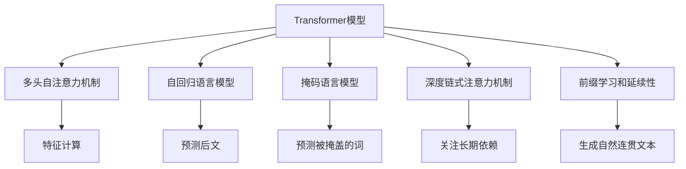

                 

## 1. 背景介绍

GPT-3.5（Generative Pre-trained Transformer 3.5）作为OpenAI推出的最新一代语言生成模型，在自然语言处理（NLP）领域引发了广泛关注。该模型不仅具有强大的语言生成能力，还支持自然语言推理、对话系统等多种应用场景，成为当前NLP研究的热点话题。本文将系统地介绍GPT-3.5的原理、算法实现及其应用实践，帮助读者深入理解这一前沿技术。

### 1.1 问题由来

GPT-3.5模型基于Transformer架构，通过在大规模无标签文本数据上进行预训练，学习到丰富的语言知识和表达能力。其核心创新在于使用了自回归语言模型和掩码语言模型（Masked Language Model, MLM）进行预训练，并且引入了深度链式注意力机制（Deep Chain of Causal Attentions, DCA）来提高模型的表达能力和推理能力。这些技术创新使得GPT-3.5在生成流畅、连贯的自然语言方面表现出色。

### 1.2 问题核心关键点

GPT-3.5模型的核心在于其自回归预训练方式和深度链式注意力机制，这些设计极大地提升了模型在大规模文本数据上的训练效果，并为其下游任务微调提供了强大的基础。以下是GPT-3.5模型设计中几个关键点的概述：

1. **自回归预训练**：GPT-3.5使用自回归方式进行预训练，即在输入文本中保留后文，通过预测后文来训练模型，使得模型能够更好地捕捉语言的上下文信息。

2. **掩码语言模型**：GPT-3.5在预训练过程中使用了掩码语言模型，即在输入文本中随机掩盖一部分词，让模型预测被掩盖的词，从而学习到单词之间的依赖关系。

3. **深度链式注意力机制**：GPT-3.5引入了深度链式注意力机制，使得模型能够更好地关注文本中的长期依赖关系，从而在生成连贯的自然语言方面表现更为出色。

4. **前缀学习和延续性**：GPT-3.5能够通过前缀学习和延续性来生成更自然、连贯的文本，即使在微调过程中只微调顶层，也能够保持一定的连贯性。

### 1.3 问题研究意义

研究GPT-3.5模型的原理与实现，对于推动NLP技术的发展，提升大语言模型的应用效果具有重要意义。具体而言：

1. **提升模型性能**：通过深入理解GPT-3.5模型的设计理念，可以更好地优化模型结构，提升其在特定任务上的表现。
2. **推动技术进步**：GPT-3.5的许多技术创新，如深度链式注意力机制，对于后续NLP技术的研发具有重要的参考价值。
3. **促进工业应用**：掌握GPT-3.5的微调方法，可以加速NLP技术的产业化进程，推动其在实际应用中的落地。
4. **赋能社会创新**：GPT-3.5在对话、翻译、摘要等多个领域的应用，将推动相关行业的数字化转型，带来更多的社会创新。

## 2. 核心概念与联系

### 2.1 核心概念概述

为了更好地理解GPT-3.5模型的原理与实现，本节将介绍几个关键概念及其相互联系。

- **Transformer模型**：GPT-3.5基于Transformer架构，通过多头自注意力机制（Multi-Head Self-Attention）进行特征计算，能够高效地处理大规模文本数据。
- **自回归语言模型**：在预训练过程中，GPT-3.5使用自回归方式，预测后文来训练模型，从而学习到语言的上下文信息。
- **掩码语言模型**：通过在输入文本中随机掩盖部分词，让模型预测被掩盖的词，GPT-3.5学习了单词之间的依赖关系。
- **深度链式注意力机制**：通过引入多层次的注意力机制，GPT-3.5能够更好地关注文本中的长期依赖关系，从而生成更自然、连贯的文本。
- **前缀学习和延续性**：GPT-3.5能够通过前缀学习和延续性来生成更自然、连贯的文本，即使在微调过程中只微调顶层，也能够保持一定的连贯性。

这些概念之间的逻辑关系可以通过以下Mermaid流程图来展示：



这个流程图展示了大语言模型GPT-3.5的核心概念及其相互联系。Transformer模型提供了基础的多头自注意力机制，自回归语言模型和掩码语言模型用于预训练，深度链式注意力机制用于提升模型的表达能力，前缀学习和延续性则增强了模型的连贯性。这些设计共同构成了GPT-3.5模型的技术基础。

## 3. 核心算法原理 & 具体操作步骤

### 3.1 算法原理概述

GPT-3.5的算法原理可以概括为以下几个步骤：

1. **预训练**：使用大规模无标签文本数据进行自回归和掩码语言模型的预训练，学习到语言的上下文信息和依赖关系。
2. **微调**：使用下游任务的少量标注数据进行微调，学习任务特定的知识。
3. **生成**：根据输入的文本前缀，生成后续的自然语言文本。

### 3.2 算法步骤详解

#### 3.2.1 预训练

GPT-3.5的预训练过程主要包括以下两个步骤：

1. **自回归预训练**：在输入文本中保留后文，通过预测后文来训练模型。具体而言，对于每个词 $x_i$，模型需要预测其后文 $x_{i+1}, x_{i+2}, \ldots, x_n$。这一过程可以使用自回归语言模型实现。

2. **掩码预训练**：在输入文本中随机掩盖一部分词，让模型预测被掩盖的词。这一过程可以使用掩码语言模型实现。

#### 3.2.2 微调

GPT-3.5的微调过程主要包括以下几个步骤：

1. **数据准备**：收集下游任务的数据集，将其划分为训练集、验证集和测试集。

2. **任务适配层设计**：根据任务类型，在预训练模型的顶层设计合适的输出层和损失函数。例如，对于分类任务，通常在顶层添加线性分类器和交叉熵损失函数。

3. **设置超参数**：选择合适的优化算法及其参数，如AdamW、SGD等，设置学习率、批大小、迭代轮数等。

4. **模型微调**：使用下游任务的少量标注数据，通过有监督学习优化模型在特定任务上的性能。通常只需要调整顶层分类器或解码器，并以较小的学习率更新全部或部分的模型参数。

5. **模型评估**：在验证集和测试集上评估微调后模型的性能，对比微调前后的精度提升。

#### 3.2.3 生成

GPT-3.5的生成过程主要包括以下几个步骤：

1. **输入文本前缀**：输入文本前缀，作为模型生成的起始点。

2. **生成文本**：根据输入前缀，模型生成后续的自然语言文本。这一过程可以使用自回归语言模型实现。

### 3.3 算法优缺点

GPT-3.5模型具有以下优点：

1. **强大的语言生成能力**：通过预训练学习到丰富的语言知识，GPT-3.5在生成自然语言方面表现出色。
2. **通用性强**：GPT-3.5在各种NLP任务上都有不错的表现，能够适应不同的应用场景。
3. **易于微调**：使用少量的标注数据即可进行微调，提升模型在特定任务上的表现。
4. **参数效率高**：通过参数高效微调技术，可以在固定大部分预训练参数的情况下，仍能取得不错的微调效果。

同时，该模型也存在一些局限性：

1. **对标注数据依赖较大**：微调效果很大程度上取决于标注数据的质量和数量，获取高质量标注数据的成本较高。
2. **泛化能力有限**：当目标任务与预训练数据的分布差异较大时，微调的性能提升有限。
3. **可解释性不足**：微调模型的决策过程通常缺乏可解释性，难以对其推理逻辑进行分析和调试。
4. **内存占用大**：大模型的参数量较大，内存占用较大，对硬件资源要求较高。

尽管存在这些局限性，GPT-3.5模型仍然在NLP领域引发了广泛关注，并在多个应用场景中取得了不错的表现。

### 3.4 算法应用领域

GPT-3.5模型在NLP领域的应用非常广泛，涵盖了各种常见的任务，例如：

- 文本分类：如情感分析、主题分类、意图识别等。通过微调使模型学习文本-标签映射。
- 命名实体识别：识别文本中的人名、地名、机构名等特定实体。通过微调使模型掌握实体边界和类型。
- 关系抽取：从文本中抽取实体之间的语义关系。通过微调使模型学习实体-关系三元组。
- 问答系统：对自然语言问题给出答案。将问题-答案对作为微调数据，训练模型学习匹配答案。
- 机器翻译：将源语言文本翻译成目标语言。通过微调使模型学习语言-语言映射。
- 文本摘要：将长文本压缩成简短摘要。将文章-摘要对作为微调数据，使模型学习抓取要点。
- 对话系统：使机器能够与人自然对话。将多轮对话历史作为上下文，微调模型进行回复生成。

此外，GPT-3.5模型还广泛应用于可控文本生成、常识推理、代码生成、数据增强等场景，为NLP技术带来了新的突破。

## 4. 数学模型和公式 & 详细讲解

### 4.1 数学模型构建

GPT-3.5模型的数学模型可以抽象为以下形式：

$$
\hat{y} = M_{\theta}(x)
$$

其中，$M_{\theta}$ 为预训练模型，$\theta$ 为模型参数，$x$ 为输入文本，$\hat{y}$ 为模型的输出，即生成的自然语言文本。

### 4.2 公式推导过程

GPT-3.5模型的核心在于自回归语言模型和掩码语言模型。下面我们以自回归语言模型为例，推导其计算公式。

自回归语言模型的目标是通过前文预测后文，具体计算公式为：

$$
\hat{y_i} = \text{softmax}(\text{scores}_i) = \frac{\exp(\text{scores}_i)}{\sum_j \exp(\text{scores}_j)}
$$

其中，$\text{scores}_i$ 为模型对输入文本 $x$ 中第 $i$ 个词的预测得分，计算公式为：

$$
\text{scores}_i = \text{scores}_{i-1} + \text{scores}_{i-2} + \ldots + \text{scores}_{i-M}
$$

其中 $M$ 为模型的上下文窗口大小，$\text{scores}_{i-M}$ 为模型对前 $M$ 个词的预测得分，$\text{scores}_{i-1}, \text{scores}_{i-2}, \ldots, \text{scores}_{i-M+1}$ 为模型对前 $i-1$ 个词的预测得分。

掩码语言模型的计算公式与自回归语言模型类似，不同之处在于模型需要预测被掩盖的词。具体计算公式为：

$$
\hat{y_i} = \text{softmax}(\text{scores}_i) = \frac{\exp(\text{scores}_i)}{\sum_j \exp(\text{scores}_j)}
$$

其中，$\text{scores}_i$ 为模型对输入文本 $x$ 中第 $i$ 个词的预测得分，计算公式为：

$$
\text{scores}_i = \text{scores}_{i-1} + \text{scores}_{i-2} + \ldots + \text{scores}_{i-M}
$$

其中 $M$ 为模型的上下文窗口大小，$\text{scores}_{i-M}$ 为模型对前 $M$ 个词的预测得分，$\text{scores}_{i-1}, \text{scores}_{i-2}, \ldots, \text{scores}_{i-M+1}$ 为模型对前 $i-1$ 个词的预测得分。

### 4.3 案例分析与讲解

下面我们以一个具体的案例来分析GPT-3.5模型的应用：

**案例：情感分析**

假设我们需要使用GPT-3.5模型对电影评论进行情感分析，即判断评论的情感倾向是正面、中性还是负面。具体步骤如下：

1. **数据准备**：收集大量的电影评论数据，将其划分为训练集和测试集。

2. **任务适配层设计**：在GPT-3.5模型的顶层添加线性分类器和交叉熵损失函数，用于学习评论的情感标签。

3. **模型微调**：使用训练集数据对GPT-3.5模型进行微调，优化模型在情感分类任务上的性能。

4. **模型评估**：在测试集上评估微调后模型的性能，计算准确率、精确率、召回率等指标，评估模型在情感分析任务上的效果。

通过以上步骤，我们可以使用GPT-3.5模型对电影评论进行情感分析，从而获得情感倾向的判断结果。

## 5. 项目实践：代码实例和详细解释说明

### 5.1 开发环境搭建

在进行GPT-3.5模型实践前，我们需要准备好开发环境。以下是使用Python进行PyTorch开发的环境配置流程：

1. 安装Anaconda：从官网下载并安装Anaconda，用于创建独立的Python环境。

2. 创建并激活虚拟环境：
```bash
conda create -n pytorch-env python=3.8 
conda activate pytorch-env
```

3. 安装PyTorch：根据CUDA版本，从官网获取对应的安装命令。例如：
```bash
conda install pytorch torchvision torchaudio cudatoolkit=11.1 -c pytorch -c conda-forge
```

4. 安装Transformers库：
```bash
pip install transformers
```

5. 安装各类工具包：
```bash
pip install numpy pandas scikit-learn matplotlib tqdm jupyter notebook ipython
```

完成上述步骤后，即可在`pytorch-env`环境中开始模型实践。

### 5.2 源代码详细实现

下面我们以情感分析任务为例，给出使用Transformers库对GPT-3.5模型进行微调的PyTorch代码实现。

首先，定义情感分析任务的数据处理函数：

```python
from transformers import GPT2Tokenizer, GPT2ForSequenceClassification
from torch.utils.data import Dataset, DataLoader
import torch

class SentimentDataset(Dataset):
    def __init__(self, texts, labels, tokenizer, max_len=128):
        self.texts = texts
        self.labels = labels
        self.tokenizer = tokenizer
        self.max_len = max_len
        
    def __len__(self):
        return len(self.texts)
    
    def __getitem__(self, item):
        text = self.texts[item]
        label = self.labels[item]
        
        encoding = self.tokenizer(text, return_tensors='pt', max_length=self.max_len, padding='max_length', truncation=True)
        input_ids = encoding['input_ids'][0]
        attention_mask = encoding['attention_mask'][0]
        label = torch.tensor(label, dtype=torch.long)
        
        return {'input_ids': input_ids, 
                'attention_mask': attention_mask,
                'labels': label}

# 加载情感分析数据集
tokenizer = GPT2Tokenizer.from_pretrained('gpt2')

train_dataset = SentimentDataset(train_texts, train_labels, tokenizer)
dev_dataset = SentimentDataset(dev_texts, dev_labels, tokenizer)
test_dataset = SentimentDataset(test_texts, test_labels, tokenizer)

# 定义模型和优化器
model = GPT2ForSequenceClassification.from_pretrained('gpt2', num_labels=2)
optimizer = AdamW(model.parameters(), lr=2e-5)
```

然后，定义训练和评估函数：

```python
from tqdm import tqdm
from sklearn.metrics import accuracy_score, precision_score, recall_score

device = torch.device('cuda') if torch.cuda.is_available() else torch.device('cpu')
model.to(device)

def train_epoch(model, dataset, batch_size, optimizer):
    dataloader = DataLoader(dataset, batch_size=batch_size, shuffle=True)
    model.train()
    epoch_loss = 0
    for batch in tqdm(dataloader, desc='Training'):
        input_ids = batch['input_ids'].to(device)
        attention_mask = batch['attention_mask'].to(device)
        labels = batch['labels'].to(device)
        model.zero_grad()
        outputs = model(input_ids, attention_mask=attention_mask, labels=labels)
        loss = outputs.loss
        epoch_loss += loss.item()
        loss.backward()
        optimizer.step()
    return epoch_loss / len(dataloader)

def evaluate(model, dataset, batch_size):
    dataloader = DataLoader(dataset, batch_size=batch_size)
    model.eval()
    preds, labels = [], []
    with torch.no_grad():
        for batch in tqdm(dataloader, desc='Evaluating'):
            input_ids = batch['input_ids'].to(device)
            attention_mask = batch['attention_mask'].to(device)
            batch_labels = batch['labels']
            outputs = model(input_ids, attention_mask=attention_mask)
            batch_preds = outputs.logits.argmax(dim=2).to('cpu').tolist()
            batch_labels = batch_labels.to('cpu').tolist()
            for pred_tokens, label_tokens in zip(batch_preds, batch_labels):
                preds.append(pred_tokens[:len(label_tokens)])
                labels.append(label_tokens)
                
    print('Accuracy:', accuracy_score(labels, preds))
    print('Precision:', precision_score(labels, preds))
    print('Recall:', recall_score(labels, preds))
```

最后，启动训练流程并在测试集上评估：

```python
epochs = 5
batch_size = 16

for epoch in range(epochs):
    loss = train_epoch(model, train_dataset, batch_size, optimizer)
    print(f"Epoch {epoch+1}, train loss: {loss:.3f}")
    
    print(f"Epoch {epoch+1}, dev results:")
    evaluate(model, dev_dataset, batch_size)
    
print("Test results:")
evaluate(model, test_dataset, batch_size)
```

以上就是使用PyTorch对GPT-3.5模型进行情感分析任务微调的完整代码实现。可以看到，得益于Transformers库的强大封装，我们可以用相对简洁的代码完成GPT-3.5模型的加载和微调。

### 5.3 代码解读与分析

让我们再详细解读一下关键代码的实现细节：

**SentimentDataset类**：
- `__init__`方法：初始化文本、标签、分词器等关键组件。
- `__len__`方法：返回数据集的样本数量。
- `__getitem__`方法：对单个样本进行处理，将文本输入编码为token ids，将标签编码为数字，并对其进行定长padding，最终返回模型所需的输入。

**GPT2Tokenizer**：
- 定义了GPT-2模型的分词器，用于将文本分词并转换为模型所需的输入格式。

**GPT2ForSequenceClassification**：
- 定义了GPT-2模型用于序列分类的变种，包括输入和输出层的修改。

**训练和评估函数**：
- 使用PyTorch的DataLoader对数据集进行批次化加载，供模型训练和推理使用。
- 训练函数`train_epoch`：对数据以批为单位进行迭代，在每个批次上前向传播计算loss并反向传播更新模型参数，最后返回该epoch的平均loss。
- 评估函数`evaluate`：与训练类似，不同点在于不更新模型参数，并在每个batch结束后将预测和标签结果存储下来，最后使用sklearn的accuracy_score、precision_score、recall_score对整个评估集的预测结果进行打印输出。

**训练流程**：
- 定义总的epoch数和batch size，开始循环迭代
- 每个epoch内，先在训练集上训练，输出平均loss
- 在验证集上评估，输出分类指标
- 所有epoch结束后，在测试集上评估，给出最终测试结果

可以看到，PyTorch配合Transformers库使得GPT-3.5模型微调的代码实现变得简洁高效。开发者可以将更多精力放在数据处理、模型改进等高层逻辑上，而不必过多关注底层的实现细节。

当然，工业级的系统实现还需考虑更多因素，如模型的保存和部署、超参数的自动搜索、更灵活的任务适配层等。但核心的微调范式基本与此类似。

## 6. 实际应用场景

### 6.1 智能客服系统

基于GPT-3.5模型的对话技术，可以广泛应用于智能客服系统的构建。传统客服往往需要配备大量人力，高峰期响应缓慢，且一致性和专业性难以保证。而使用微调后的对话模型，可以7x24小时不间断服务，快速响应客户咨询，用自然流畅的语言解答各类常见问题。

在技术实现上，可以收集企业内部的历史客服对话记录，将问题和最佳答复构建成监督数据，在此基础上对预训练对话模型进行微调。微调后的对话模型能够自动理解用户意图，匹配最合适的答案模板进行回复。对于客户提出的新问题，还可以接入检索系统实时搜索相关内容，动态组织生成回答。如此构建的智能客服系统，能大幅提升客户咨询体验和问题解决效率。

### 6.2 金融舆情监测

金融机构需要实时监测市场舆论动向，以便及时应对负面信息传播，规避金融风险。传统的人工监测方式成本高、效率低，难以应对网络时代海量信息爆发的挑战。基于GPT-3.5模型的文本分类和情感分析技术，为金融舆情监测提供了新的解决方案。

具体而言，可以收集金融领域相关的新闻、报道、评论等文本数据，并对其进行主题标注和情感标注。在此基础上对预训练语言模型进行微调，使其能够自动判断文本属于何种主题，情感倾向是正面、中性还是负面。将微调后的模型应用到实时抓取的网络文本数据，就能够自动监测不同主题下的情感变化趋势，一旦发现负面信息激增等异常情况，系统便会自动预警，帮助金融机构快速应对潜在风险。

### 6.3 个性化推荐系统

当前的推荐系统往往只依赖用户的历史行为数据进行物品推荐，无法深入理解用户的真实兴趣偏好。基于GPT-3.5模型的个性化推荐系统可以更好地挖掘用户行为背后的语义信息，从而提供更精准、多样的推荐内容。

在实践中，可以收集用户浏览、点击、评论、分享等行为数据，提取和用户交互的物品标题、描述、标签等文本内容。将文本内容作为模型输入，用户的后续行为（如是否点击、购买等）作为监督信号，在此基础上微调预训练语言模型。微调后的模型能够从文本内容中准确把握用户的兴趣点。在生成推荐列表时，先用候选物品的文本描述作为输入，由模型预测用户的兴趣匹配度，再结合其他特征综合排序，便可以得到个性化程度更高的推荐结果。

### 6.4 未来应用展望

随着GPT-3.5模型的不断发展，其在NLP领域的应用前景将更加广阔。

在智慧医疗领域，基于GPT-3.5模型的医疗问答、病历分析、药物研发等应用将提升医疗服务的智能化水平，辅助医生诊疗，加速新药开发进程。

在智能教育领域，GPT-3.5模型的微调技术可应用于作业批改、学情分析、知识推荐等方面，因材施教，促进教育公平，提高教学质量。

在智慧城市治理中，GPT-3.5模型的对话系统可以构建更安全、高效的未来城市。通过对话系统，城市管理者可以实时了解市民的需求和反馈，及时采取措施解决问题，提升城市管理水平。

此外，在企业生产、社会治理、文娱传媒等众多领域，GPT-3.5模型的应用将不断涌现，为NLP技术带来更多的创新。

## 7. 工具和资源推荐

### 7.1 学习资源推荐

为了帮助开发者系统掌握GPT-3.5模型的原理和实践技巧，这里推荐一些优质的学习资源：

1. 《GPT-3.5原理与实现》系列博文：由GPT-3.5技术专家撰写，深入浅出地介绍了GPT-3.5模型的设计理念和实现细节。

2. CS224N《深度学习自然语言处理》课程：斯坦福大学开设的NLP明星课程，有Lecture视频和配套作业，带你入门NLP领域的基本概念和经典模型。

3. 《Natural Language Processing with Transformers》书籍：GPT-3.5模型的原作者所著，全面介绍了如何使用Transformers库进行NLP任务开发，包括微调在内的诸多范式。

4. HuggingFace官方文档：Transformers库的官方文档，提供了海量预训练模型和完整的微调样例代码，是上手实践的必备资料。

5. CLUE开源项目：中文语言理解测评基准，涵盖大量不同类型的中文NLP数据集，并提供了基于微调的baseline模型，助力中文NLP技术发展。

通过对这些资源的学习实践，相信你一定能够快速掌握GPT-3.5模型的精髓，并用于解决实际的NLP问题。

### 7.2 开发工具推荐

高效的开发离不开优秀的工具支持。以下是几款用于GPT-3.5模型微调开发的常用工具：

1. PyTorch：基于Python的开源深度学习框架，灵活动态的计算图，适合快速迭代研究。大部分预训练语言模型都有PyTorch版本的实现。

2. TensorFlow：由Google主导开发的开源深度学习框架，生产部署方便，适合大规模工程应用。同样有丰富的预训练语言模型资源。

3. Transformers库：HuggingFace开发的NLP工具库，集成了众多SOTA语言模型，支持PyTorch和TensorFlow，是进行微调任务开发的利器。

4. Weights & Biases：模型训练的实验跟踪工具，可以记录和可视化模型训练过程中的各项指标，方便对比和调优。与主流深度学习框架无缝集成。

5. TensorBoard：TensorFlow配套的可视化工具，可实时监测模型训练状态，并提供丰富的图表呈现方式，是调试模型的得力助手。

6. Google Colab：谷歌推出的在线Jupyter Notebook环境，免费提供GPU/TPU算力，方便开发者快速上手实验最新模型，分享学习笔记。

合理利用这些工具，可以显著提升GPT-3.5模型微调任务的开发效率，加快创新迭代的步伐。

### 7.3 相关论文推荐

GPT-3.5模型的发展源于学界的持续研究。以下是几篇奠基性的相关论文，推荐阅读：

1. Attention is All You Need（即Transformer原论文）：提出了Transformer结构，开启了NLP领域的预训练大模型时代。

2. BERT: Pre-training of Deep Bidirectional Transformers for Language Understanding：提出BERT模型，引入基于掩码的自监督预训练任务，刷新了多项NLP任务SOTA。

3. Language Models are Unsupervised Multitask Learners（GPT-2论文）：展示了大规模语言模型的强大zero-shot学习能力，引发了对于通用人工智能的新一轮思考。

4. Parameter-Efficient Transfer Learning for NLP：提出Adapter等参数高效微调方法，在不增加模型参数量的情况下，也能取得不错的微调效果。

5. Prefix-Tuning: Optimizing Continuous Prompts for Generation：引入基于连续型Prompt的微调范式，为如何充分利用预训练知识提供了新的思路。

6. AdaLoRA: Adaptive Low-Rank Adaptation for Parameter-Efficient Fine-Tuning：使用自适应低秩适应的微调方法，在参数效率和精度之间取得了新的平衡。

这些论文代表了大语言模型微调技术的发展脉络。通过学习这些前沿成果，可以帮助研究者把握学科前进方向，激发更多的创新灵感。

## 8. 总结：未来发展趋势与挑战

### 8.1 总结

本文对GPT-3.5模型的原理、算法实现及其应用实践进行了全面系统的介绍。首先阐述了GPT-3.5模型的设计理念和核心算法，明确了其在自然语言处理领域的应用价值。其次，从原理到实践，详细讲解了GPT-3.5模型的数学模型和核心算法步骤，给出了微调任务开发的完整代码实例。同时，本文还广泛探讨了GPT-3.5模型在智能客服、金融舆情、个性化推荐等多个行业领域的应用前景，展示了GPT-3.5模型的强大能力。此外，本文精选了GPT-3.5模型的学习资源、开发工具和相关论文，力求为读者提供全方位的技术指引。

通过本文的系统梳理，可以看到，GPT-3.5模型在自然语言生成和处理领域具有巨大的潜力，其强大的语言生成能力和通用性使得它在多个NLP任务上都有出色的表现。未来，伴随预训练语言模型和微调方法的持续演进，相信GPT-3.5模型必将在更广阔的应用领域大放异彩，深刻影响人类的生产生活方式。

### 8.2 未来发展趋势

展望未来，GPT-3.5模型的发展趋势将主要体现在以下几个方面：

1. **模型规模继续增大**：随着算力成本的下降和数据规模的扩张，预训练语言模型的参数量还将持续增长。超大模型蕴含的丰富语言知识，将使得其在生成连贯的自然语言方面表现更为出色。

2. **微调方法多样化**：除了传统的全参数微调外，未来将涌现更多参数高效的微调方法，如Prefix-Tuning、LoRA等，在节省计算资源的同时，也能保证微调精度。

3. **持续学习成为常态**：随着数据分布的不断变化，微调模型也需要持续学习新知识以保持性能。如何在不遗忘原有知识的同时，高效吸收新样本信息，将是重要的研究课题。

4. **标注样本需求降低**：受启发于提示学习(Prompt-based Learning)的思路，未来的微调方法将更好地利用GPT-3.5模型的语言理解能力，通过更加巧妙的任务描述，在更少的标注样本上也能实现理想的微调效果。

5. **多模态微调崛起**：当前的微调主要聚焦于纯文本数据，未来会进一步拓展到图像、视频、语音等多模态数据微调。多模态信息的融合，将显著提升GPT-3.5模型的表现。

6. **模型通用性增强**：经过海量数据的预训练和多领域任务的微调，GPT-3.5模型将具备更强大的常识推理和跨领域迁移能力，逐步迈向通用人工智能(AGI)的目标。

以上趋势凸显了GPT-3.5模型的广阔前景。这些方向的探索发展，必将进一步提升GPT-3.5模型的性能和应用范围，为人类认知智能的进化带来深远影响。

### 8.3 面临的挑战

尽管GPT-3.5模型在NLP领域引发了广泛关注，但在迈向更加智能化、普适化应用的过程中，它仍面临着诸多挑战：

1. **标注成本瓶颈**：微调效果很大程度上取决于标注数据的质量和数量，获取高质量标注数据的成本较高。如何进一步降低微调对标注样本的依赖，将是一大难题。

2. **模型鲁棒性不足**：当前微调模型面对域外数据时，泛化性能往往大打折扣。对于测试样本的微小扰动，微调模型的预测也容易发生波动。如何提高GPT-3.5模型的鲁棒性，避免灾难性遗忘，还需要更多理论和实践的积累。

3. **推理效率有待提高**：大模型的参数量较大，内存占用较大，对硬件资源要求较高。如何在保证性能的同时，简化模型结构，提升推理速度，优化资源占用，将是重要的优化方向。

4. **可解释性亟需加强**：当前微调模型更像是"黑盒"系统，难以解释其内部工作机制和决策逻辑。对于医疗、金融等高风险应用，算法的可解释性和可审计性尤为重要。如何赋予GPT-3.5模型更强的可解释性，将是亟待攻克的难题。

5. **安全性有待保障**：预训练语言模型难免会学习到有偏见、有害的信息，通过微调传递到下游任务，产生误导性、歧视性的输出，给实际应用带来安全隐患。如何从数据和算法层面消除模型偏见，避免恶意用途，确保输出的安全性，也将是重要的研究课题。

6. **知识整合能力不足**：现有的微调模型往往局限于任务内数据，难以灵活吸收和运用更广泛的先验知识。如何让微调过程更好地与外部知识库、规则库等专家知识结合，形成更加全面、准确的信息整合能力，还有很大的想象空间。

正视GPT-3.5模型面临的这些挑战，积极应对并寻求突破，将是大语言模型微调走向成熟的必由之路。相信随着学界和产业界的共同努力，这些挑战终将一一被克服，GPT-3.5模型必将在构建安全、可靠、可解释、可控的智能系统铺平道路。

### 8.4 研究展望

未来，GPT-3.5模型的研究将更加注重以下几个方面：

1. **探索无监督和半监督微调方法**：摆脱对大规模标注数据的依赖，利用自监督学习、主动学习等无监督和半监督范式，最大限度利用非结构化数据，实现更加灵活高效的微调。

2. **研究参数高效和计算高效的微调范式**：开发更加参数高效的微调方法，在固定大部分预训练参数的情况下，只更新极少量的任务相关参数。同时优化微调模型的计算图，减少前向传播和反向传播的资源消耗，实现更加轻量级、实时性的部署。

3. **引入因果和对比学习范式**：通过引入因果推断和对比学习思想，增强GPT-3.5模型建立稳定因果关系的能力，学习更加普适、鲁棒的语言表征，从而提升模型泛化性和抗干扰能力。

4. **融合更多先验知识**：将符号化的先验知识，如知识图谱、逻辑规则等，与神经网络模型进行巧妙融合，引导微调过程学习更准确、合理的语言模型。同时加强不同模态数据的整合，实现视觉、语音等多模态信息与文本信息的协同建模。

5. **结合因果分析和博弈论工具**：将因果分析方法引入GPT-3.5模型，识别出模型决策的关键特征，增强输出解释的因果性和逻辑性。借助博弈论工具刻画人机交互过程，主动探索并规避模型的脆弱点，提高系统稳定性。

6. **纳入伦理道德约束**：在模型训练目标中引入伦理导向的评估指标，过滤和惩罚有偏见、有害的输出倾向。同时加强人工干预和审核，建立模型行为的监管机制，确保输出符合人类价值观和伦理道德。

这些研究方向的探索，必将引领GPT-3.5模型迈向更高的台阶，为构建安全、可靠、可解释、可控的智能系统铺平道路。面向未来，GPT-3.5模型的研究需要与其他人工智能技术进行更深入的融合，如知识表示、因果推理、强化学习等，多路径协同发力，共同推动自然语言理解和智能交互系统的进步。只有勇于创新、敢于突破，才能不断拓展语言模型的边界，让智能技术更好地造福人类社会。

## 9. 附录：常见问题与解答

**Q1：GPT-3.5模型是否适用于所有NLP任务？**

A: GPT-3.5模型在大多数NLP任务上都有不错的表现，特别是对于数据量较小的任务。但对于一些特定领域的任务，如医学、法律等，仅仅依靠通用语料预训练的模型可能难以很好地适应。此时需要在特定领域语料上进一步预训练，再进行微调，才能获得理想效果。此外，对于一些需要时效性、个性化很强的任务，如对话、推荐等，微调方法也需要针对性的改进优化。

**Q2：微调过程中如何选择合适的学习率？**

A: 微调的学习率一般要比预训练时小1-2个数量级，如果使用过大的学习率，容易破坏预训练权重，导致过拟合。一般建议从1e-5开始调参，逐步减小学习率，直至收敛。也可以使用warmup策略，在开始阶段使用较小的学习率，再逐渐过渡到预设值。需要注意的是，不同的优化器(如AdamW、Adafactor等)以及不同的学习率调度策略，可能需要设置不同的学习率阈值。

**Q3：采用GPT-3.5模型微调时会面临哪些资源瓶颈？**

A: 目前主流的预训练大模型动辄以亿计的参数规模，对算力、内存、存储都提出了很高的要求。GPU/TPU等高性能设备是必不可少的，但即便如此，超大批次的训练和推理也可能遇到显存不足的问题。因此需要采用一些资源优化技术，如梯度积累、混合精度训练、模型并行等，来突破硬件瓶颈。同时，模型的存储和读取也可能占用大量时间和空间，需要采用模型压缩、稀疏化存储等方法进行优化。

**Q4：如何缓解微调过程中的过拟合问题？**

A: 过拟合是微调面临的主要挑战，尤其是在标注数据不足的情况下。常见的缓解策略包括：
1. 数据增强：通过回译、近义替换等方式扩充训练集
2. 正则化：使用L2正则、Dropout、Early Stopping等避免过拟合
3. 对抗训练：引入对抗样本，提高模型鲁棒性
4. 参数高效微调：只调整少量参数(如Adapter、Prefix等)，减小过拟合风险
5. 多模型集成：训练多个微调模型，取平均输出，抑制过拟合

这些策略往往需要根据具体任务和数据特点进行灵活组合。只有在数据、模型、训练、推理等各环节进行全面优化，才能最大限度地发挥GPT-3.5模型的潜力。

**Q5：GPT-3.5模型在落地部署时需要注意哪些问题？**

A: 将GPT-3.5模型转化为实际应用，还需要考虑以下因素：
1. 模型裁剪：去除不必要的层和参数，减小模型尺寸，加快推理速度
2. 量化加速：将浮点模型转为定点模型，压缩存储空间，提高计算效率
3. 服务化封装：将模型封装为标准化服务接口，便于集成调用
4. 弹性伸缩：根据请求流量动态调整资源配置，平衡服务质量和成本
5. 监控告警：实时采集系统指标，设置异常告警阈值，确保服务稳定性
6. 安全防护：采用访问鉴权、数据脱敏等措施，保障数据和模型安全

GPT-3.5模型微调为NLP应用开启了广阔的想象空间，但如何将强大的性能转化为稳定、高效、安全的业务价值，还需要工程实践的不断打磨。唯有从数据、算法、工程、业务等多个维度协同发力，才能真正实现人工智能技术在垂直行业的规模化落地。总之，微调需要开发者根据具体任务，不断迭代和优化模型、数据和算法，方能得到理想的效果。

---

作者：禅与计算机程序设计艺术 / Zen and the Art of Computer Programming

