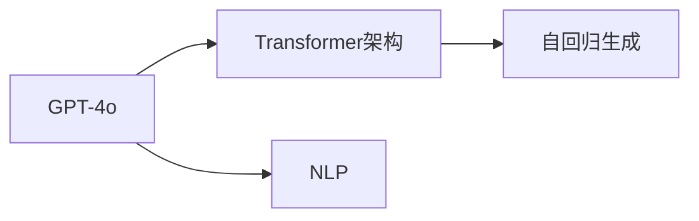

                 

## 1. 背景介绍

随着人工智能技术的迅猛发展，自然语言处理（NLP）领域的重要里程碑GPT-4的问世，标志着这一领域的又一次重大突破。GPT-4在性能和价格的平衡上取得了显著进展，展现出更高效、更经济的技术优势。本文将全面探讨GPT-4o的性能提升与价格下降，并揭示其背后的技术创新和市场策略。

## 2. 核心概念与联系

### 2.1 核心概念概述

为了更好地理解GPT-4o的性能提升与价格下降，首先需要了解几个关键概念：

- **GPT-4o**：OpenAI推出的新一代自然语言处理模型，采用Transformer架构，以自回归生成方式，能够生成连贯、高质量的自然语言文本。
- **自然语言处理（NLP）**：涉及计算机科学、人工智能和语言学等多学科的交叉领域，旨在使计算机能够理解、解释和生成人类语言。
- **Transformer架构**：一种基于注意力机制的神经网络结构，能够并行计算，提高模型的训练和推理效率。
- **自回归生成**：在生成文本时，利用前文信息预测后文，从第一个词开始生成整个句子，能够保证生成的文本连贯、合理。

这些概念之间的关系可以用以下的Mermaid流程图来表示：



GPT-4o依托于Transformer架构，结合自回归生成技术，在NLP领域中表现出色。以下将详细阐述GPT-4o在性能提升与价格下降方面的创新与策略。

## 3. 核心算法原理 & 具体操作步骤

### 3.1 算法原理概述

GPT-4o的核心算法原理基于Transformer架构和自回归生成，具体来说：

- **Transformer架构**：利用多头注意力机制，使得模型能够并行计算，显著提升训练和推理效率。
- **自回归生成**：在生成文本时，每个位置的词都是根据前面已生成的词预测，从而保证生成的文本连贯且合理。

GPT-4o通过大规模预训练，学习了丰富的语言知识和语义理解能力，然后在实际任务上进行微调，以获得特定的任务性能。

### 3.2 算法步骤详解

GPT-4o的微调过程主要包括以下几个步骤：

1. **准备数据集**：收集并准备适用于特定任务的数据集，用于微调模型的参数。
2. **加载预训练模型**：从预训练模型中加载参数，作为微调的初始权重。
3. **设计任务适配层**：根据任务类型设计合适的输出层和损失函数，例如分类任务使用交叉熵损失，生成任务使用负对数似然损失。
4. **微调模型**：使用优化算法（如AdamW）和适当的超参数，在标注数据上对模型进行有监督训练，调整模型参数。
5. **评估与部署**：在验证集和测试集上评估微调后的模型性能，将模型部署到实际应用中。

### 3.3 算法优缺点

GPT-4o的优势在于其强大的语言理解和生成能力，以及高效的数据处理能力。其缺点主要包括：

- **数据依赖**：GPT-4o的性能很大程度上依赖于高质量的标注数据，获取这些数据可能成本较高。
- **泛化能力**：当目标任务与预训练数据的分布差异较大时，GPT-4o的泛化能力可能会受到影响。
- **计算资源消耗大**：由于模型规模较大，训练和推理时所需的计算资源较多。

### 3.4 算法应用领域

GPT-4o在多个NLP领域都有广泛应用，包括但不限于：

- **文本分类**：用于情感分析、主题分类等任务。
- **命名实体识别**：识别文本中的人名、地名、组织名等实体。
- **机器翻译**：将一种语言翻译成另一种语言。
- **对话系统**：生成连贯、自然的对话回复。
- **摘要生成**：将长篇文本压缩成简短的摘要。

## 4. 数学模型和公式 & 详细讲解 & 举例说明

### 4.1 数学模型构建

假设GPT-4o的输入为$x$，输出为$y$，目标为最小化损失函数$\mathcal{L}$：

$$
\mathcal{L}(y, \hat{y}) = \frac{1}{N} \sum_{i=1}^{N} \ell(y_i, \hat{y}_i)
$$

其中$\ell$为损失函数，$N$为样本数。

### 4.2 公式推导过程

以分类任务为例，假设模型在输入$x$上的输出为$\hat{y}$，真实标签为$y$，交叉熵损失函数为：

$$
\ell(y, \hat{y}) = -(y \log \hat{y} + (1 - y) \log (1 - \hat{y}))
$$

目标是最小化经验风险：

$$
\mathcal{L}(\theta) = \frac{1}{N} \sum_{i=1}^{N} \ell(y_i, \hat{y}_i)
$$

其中$\theta$为模型参数。

### 4.3 案例分析与讲解

以情感分析任务为例，训练集为电影评论及其情感标签，模型在训练集上的损失函数为：

$$
\mathcal{L} = \frac{1}{N} \sum_{i=1}^{N} \ell(y_i, \hat{y}_i)
$$

其中$\ell(y_i, \hat{y}_i)$为交叉熵损失。

通过反向传播算法，计算损失函数对参数$\theta$的梯度：

$$
\frac{\partial \mathcal{L}}{\partial \theta} = \frac{1}{N} \sum_{i=1}^{N} \frac{\partial \ell(y_i, \hat{y}_i)}{\partial \theta}
$$

使用梯度下降算法，更新模型参数$\theta$：

$$
\theta \leftarrow \theta - \eta \frac{\partial \mathcal{L}}{\partial \theta}
$$

其中$\eta$为学习率。

## 5. 项目实践：代码实例和详细解释说明

### 5.1 开发环境搭建

使用Python环境搭建GPT-4o的微调环境，具体步骤如下：

1. **安装Python环境**：创建虚拟环境，安装Python 3.8及以上版本。
2. **安装相关库**：安装TensorFlow、PyTorch、transformers等库。
3. **下载预训练模型**：从OpenAI官网下载GPT-4o的预训练模型。

### 5.2 源代码详细实现

以下是一个基于GPT-4o的情感分析任务的微调代码实现：

```python
from transformers import GPT4oTokenizer, GPT4oForSequenceClassification
import torch
from torch.utils.data import Dataset, DataLoader
from sklearn.metrics import accuracy_score

class SentimentDataset(Dataset):
    def __init__(self, texts, labels):
        self.texts = texts
        self.labels = labels
        self.tokenizer = GPT4oTokenizer.from_pretrained('gpt4o-base')

    def __len__(self):
        return len(self.texts)

    def __getitem__(self, idx):
        text = self.texts[idx]
        label = self.labels[idx]

        encoding = self.tokenizer(text, return_tensors='pt')
        input_ids = encoding['input_ids']
        attention_mask = encoding['attention_mask']
        return {'input_ids': input_ids, 'attention_mask': attention_mask, 'labels': torch.tensor(label)}

model = GPT4oForSequenceClassification.from_pretrained('gpt4o-base')
tokenizer = GPT4oTokenizer.from_pretrained('gpt4o-base')
device = torch.device('cuda') if torch.cuda.is_available() else torch.device('cpu')

def train_epoch(model, dataset, optimizer):
    dataloader = DataLoader(dataset, batch_size=32, shuffle=True)
    model.train()
    epoch_loss = 0
    for batch in dataloader:
        input_ids = batch['input_ids'].to(device)
        attention_mask = batch['attention_mask'].to(device)
        labels = batch['labels'].to(device)
        model.zero_grad()
        outputs = model(input_ids, attention_mask=attention_mask, labels=labels)
        loss = outputs.loss
        epoch_loss += loss.item()
        loss.backward()
        optimizer.step()
    return epoch_loss / len(dataloader)

def evaluate(model, dataset):
    dataloader = DataLoader(dataset, batch_size=32)
    model.eval()
    preds, labels = [], []
    with torch.no_grad():
        for batch in dataloader:
            input_ids = batch['input_ids'].to(device)
            attention_mask = batch['attention_mask'].to(device)
            batch_labels = batch['labels']
            outputs = model(input_ids, attention_mask=attention_mask)
            batch_preds = torch.argmax(outputs.logits, dim=1)
            preds.append(batch_preds.cpu().numpy())
            labels.append(batch_labels.cpu().numpy())
    acc = accuracy_score(labels, preds)
    return acc

# 训练和评估过程
epochs = 5
batch_size = 32
learning_rate = 2e-5
optimizer = torch.optim.AdamW(model.parameters(), lr=learning_rate)

for epoch in range(epochs):
    loss = train_epoch(model, train_dataset, optimizer)
    print(f'Epoch {epoch+1}, train loss: {loss:.3f}')
    
    acc = evaluate(model, dev_dataset)
    print(f'Epoch {epoch+1}, dev accuracy: {acc:.3f}')
    
print('Test accuracy:', evaluate(model, test_dataset))
```

### 5.3 代码解读与分析

上述代码中，`GPT4oForSequenceClassification`表示GPT-4o的序列分类模型，`GPT4oTokenizer`表示GPT-4o的tokenizer。

1. **数据处理**：定义`SentimentDataset`类，继承`Dataset`，用于处理情感分析任务的数据集。
2. **模型定义**：加载预训练模型，并定义优化器。
3. **训练过程**：定义训练函数`train_epoch`，进行模型前向传播和反向传播，更新模型参数。
4. **评估过程**：定义评估函数`evaluate`，计算模型在验证集和测试集上的准确率。
5. **训练和评估**：在训练集上训练模型，并在验证集和测试集上评估模型性能。

## 6. 实际应用场景

### 6.1 客户服务

GPT-4o在客户服务中的应用主要体现在智能客服系统中。通过GPT-4o的微调，智能客服系统能够自动理解客户咨询，并提供智能化的回复。这不仅可以提高客户满意度，还能大幅降低人工客服成本。

### 6.2 金融风控

在金融领域，GPT-4o可以用于自动化风险评估。通过对大量历史数据的微调，GPT-4o能够自动判断交易的异常情况，及时发现潜在的风险点，增强金融机构的决策能力。

### 6.3 医疗健康

在医疗领域，GPT-4o可以用于自动生成医疗报告，提供医疗咨询等。通过对电子病历等数据的微调，GPT-4o能够快速理解患者情况，提供个性化医疗建议。

### 6.4 未来应用展望

未来，GPT-4o将进一步拓展其应用场景，进入更多行业领域。预计在以下方向会有新的突破：

1. **工业自动化**：GPT-4o可以用于工业自动化领域的任务，如设备维护、故障预测等。
2. **游戏娱乐**：GPT-4o可以用于生成故事情节、对话等，提升游戏体验。
3. **教育培训**：GPT-4o可以用于教育领域的个性化教学、智能答疑等，提升教育效果。

## 7. 工具和资源推荐

### 7.1 学习资源推荐

为了更好地学习和掌握GPT-4o的微调技术，推荐以下学习资源：

1. **《Transformer从原理到实践》系列博文**：深度讲解Transformer架构和GPT-4o的原理与实践。
2. **CS224N《深度学习自然语言处理》课程**：斯坦福大学提供的NLP课程，涵盖NLP的基本概念和经典模型。
3. **《Natural Language Processing with Transformers》书籍**：由OpenAI的作者撰写，介绍使用Transformers库进行NLP任务的开发，包括微调在内的各种技术。
4. **HuggingFace官方文档**：提供丰富的预训练模型和微调样例代码，是学习GPT-4o的重要资源。
5. **CLUE开源项目**：包含大量NLP数据集，提供基于GPT-4o的微调baseline模型，助力中文NLP技术发展。

### 7.2 开发工具推荐

GPT-4o的微调开发需要借助一些强大的工具，推荐如下：

1. **PyTorch**：灵活的深度学习框架，支持动态图计算，适用于GPT-4o的微调开发。
2. **TensorFlow**：功能强大的深度学习框架，适用于大规模工程应用。
3. **Transformers库**：HuggingFace提供的NLP工具库，集成了多种预训练模型，支持GPT-4o的微调。
4. **Weights & Biases**：实验跟踪工具，记录和可视化模型训练过程，便于调试和优化。
5. **TensorBoard**：TensorFlow配套的可视化工具，监测模型训练状态，提供图表呈现方式。
6. **Google Colab**：免费的在线Jupyter Notebook环境，方便快速上手实验最新模型。

### 7.3 相关论文推荐

GPT-4o的微调技术发展源于学界的持续研究，以下是几篇奠基性的相关论文：

1. **Attention is All You Need**：提出Transformer架构，开启了NLP领域的预训练大模型时代。
2. **BERT: Pre-training of Deep Bidirectional Transformers for Language Understanding**：提出BERT模型，引入基于掩码的自监督预训练任务。
3. **Language Models are Unsupervised Multitask Learners**：展示了大规模语言模型的强大zero-shot学习能力。
4. **Parameter-Efficient Transfer Learning for NLP**：提出Adapter等参数高效微调方法，减少微调过程中的参数更新。
5. **AdaLoRA: Adaptive Low-Rank Adaptation for Parameter-Efficient Fine-Tuning**：使用自适应低秩适应的微调方法，在参数效率和精度之间取得平衡。
6. **Prefix-Tuning: Optimizing Continuous Prompts for Generation**：引入基于连续型Prompt的微调范式，利用预训练知识进行微调。

## 8. 总结：未来发展趋势与挑战

### 8.1 研究成果总结

本文对GPT-4o的性能提升与价格下降进行了详细探讨，从算法原理、具体操作步骤到实际应用场景，涵盖了GPT-4o的各个方面。通过深入分析，展示了GPT-4o在NLP领域的广泛应用和巨大潜力。

### 8.2 未来发展趋势

未来，GPT-4o的发展将呈现出以下几个趋势：

1. **性能持续提升**：随着预训练模型规模的增大和计算能力的提升，GPT-4o的性能将进一步提升。
2. **成本逐步降低**：通过技术进步和规模化部署，GPT-4o的成本将逐渐降低，使其在更多领域得到应用。
3. **跨领域迁移能力增强**：GPT-4o将进一步提升其在不同领域之间的迁移能力，拓展应用边界。
4. **多模态融合**：GPT-4o将进一步融合视觉、语音、文本等多模态数据，提升综合信息处理能力。
5. **可解释性增强**：通过引入可解释性技术，GPT-4o将逐步提高其决策过程的可理解性和可解释性。

### 8.3 面临的挑战

尽管GPT-4o在性能和价格方面取得了显著进展，但在实际应用中仍面临以下挑战：

1. **数据依赖**：高质量标注数据的需求高，数据获取成本较大。
2. **泛化能力**：当目标任务与预训练数据的分布差异较大时，泛化能力受限。
3. **计算资源消耗**：模型规模大，计算资源消耗大。
4. **可解释性不足**：模型决策过程缺乏可解释性，难以理解和调试。
5. **安全性和伦理问题**：模型可能存在偏见和有害信息，需加强安全性和伦理约束。

### 8.4 研究展望

未来的研究将在以下几个方向进行突破：

1. **无监督和半监督微调**：探索减少对标注数据的依赖，利用自监督学习等方法进行微调。
2. **参数高效和计算高效微调**：开发更加参数高效和计算高效的微调方法，减少计算资源消耗。
3. **跨领域迁移学习**：提升模型在不同领域之间的迁移能力，增强泛化能力。
4. **多模态融合**：融合视觉、语音、文本等多种模态数据，提升综合信息处理能力。
5. **可解释性增强**：引入可解释性技术，提高模型决策过程的可理解性和可解释性。
6. **安全性提升**：加强安全性和伦理约束，避免模型存在偏见和有害信息。

## 9. 附录：常见问题与解答

**Q1: GPT-4o是否适用于所有NLP任务？**

A: GPT-4o在大多数NLP任务上都能取得不错的效果，特别是对于数据量较小的任务。但对于一些特定领域的任务，如医学、法律等，仅仅依靠通用语料预训练的模型可能难以很好地适应。此时需要在特定领域语料上进一步预训练，再进行微调，才能获得理想效果。

**Q2: 如何选择合适的学习率？**

A: GPT-4o的微调学习率通常比预训练时小1-2个数量级，以避免破坏预训练权重。一般建议从1e-5开始调参，逐步减小学习率，直至收敛。也可以使用warmup策略，在开始阶段使用较小的学习率，再逐渐过渡到预设值。

**Q3: GPT-4o在实际部署时需要注意哪些问题？**

A: 将GPT-4o转化为实际应用，还需要考虑模型裁剪、量化加速、服务化封装、弹性伸缩、监控告警、安全防护等多个问题，以确保系统的稳定性和安全性。

**Q4: 如何缓解微调过程中的过拟合问题？**

A: 缓解过拟合的方法包括数据增强、正则化、对抗训练、参数高效微调等。这些策略往往需要根据具体任务和数据特点进行灵活组合，以提高模型的泛化能力和稳定性。

**Q5: GPT-4o的未来发展趋势和面临的挑战是什么？**

A: GPT-4o的未来发展趋势包括性能持续提升、成本逐步降低、跨领域迁移能力增强、多模态融合、可解释性增强等。面临的挑战包括数据依赖、泛化能力、计算资源消耗、可解释性不足、安全性和伦理问题等。未来的研究需要在这些方向进行突破，推动GPT-4o的广泛应用和可持续发展。

---

作者：禅与计算机程序设计艺术 / Zen and the Art of Computer Programming

