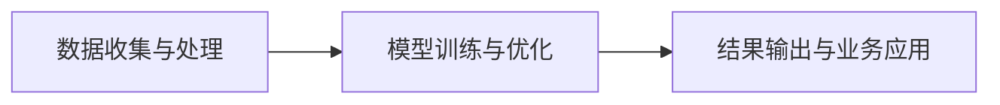

                 

# HeyGen的成功案例与启示

> 关键词：

## 1. 背景介绍

随着人工智能技术的飞速发展，企业数字化转型已经成为了不可逆转的趋势。在这样的大背景下，HeyGen作为一家初创企业，通过创新的方式结合AI技术与大数据分析，成功地为一家传统制造企业带来了显著的业绩提升。本文将通过深入剖析HeyGen的案例，揭示其成功秘诀，并探讨其对企业的启示。

## 2. 核心概念与联系

### 2.1 核心概念概述

HeyGen的商业模式主要基于人工智能的预测分析能力，其核心技术包括数据收集与处理、模型训练与优化、结果输出与业务应用等环节。本节将介绍这些核心概念及其相互之间的联系。

- **数据收集与处理**：HeyGen采用物联网(IoT)设备、传感器等手段收集企业生产、运营等数据，通过数据清洗、特征提取等技术手段，将原始数据转化为可供模型使用的输入特征。
- **模型训练与优化**： HeyGen运用机器学习算法对历史数据进行训练，构建预测模型，并通过优化算法不断提升模型准确性和泛化能力。
- **结果输出与业务应用**：HeyGen的模型输出可用于预测生产效率、维护成本、产品质量等关键指标，指导企业做出更科学、高效的业务决策。

### 2.2 核心概念原理和架构的 Mermaid 流程图



### 2.3 核心概念联系

数据收集与处理是模型训练的基础，模型训练与优化则是提升预测准确性的关键，而结果输出与业务应用则是模型价值的直接体现。通过这些关键环节的紧密配合，HeyGen实现了其在制造业领域的成功应用。

## 3. 核心算法原理 & 具体操作步骤

### 3.1 算法原理概述

HeyGen采用的预测模型主要基于时间序列分析、回归分析等机器学习算法。在实际应用中，HeyGen结合企业生产线的特点，对数据进行了差分、滞后等特征工程处理，并采用随机森林、梯度提升树等集成学习算法，构建了能够预测生产效率和质量的多元回归模型。

### 3.2 算法步骤详解

**Step 1: 数据收集与预处理**
- 收集企业生产线的物联网设备、传感器数据，并进行清洗、去噪处理。
- 对数据进行特征工程，包括差分、滞后、标准化等操作。
- 划分训练集和测试集，确保模型在未知数据上的泛化能力。

**Step 2: 模型训练与优化**
- 选择适合的生产预测算法，如时间序列分析、多元回归等。
- 构建初步的预测模型，并进行交叉验证，优化模型超参数。
- 使用集成学习技术，提升模型准确性和鲁棒性。

**Step 3: 结果输出与业务应用**
- 根据预测模型输出，生成关键指标的预测报告。
- 将预测报告整合到企业的生产计划、库存管理等业务系统中，实现数据驱动的决策支持。
- 定期更新模型，保证预测结果的时效性和准确性。

### 3.3 算法优缺点

**优点：**
- 模型预测准确度高，可显著提升生产效率和质量。
- 适应性强，能够灵活应用于不同生产线的预测任务。
- 数据驱动决策，减少人工干预，提升决策科学性。

**缺点：**
- 模型构建和优化需要较强的专业技能和经验。
- 数据质量对模型预测结果影响较大，需要投入大量资源进行数据清洗和处理。
- 需要持续监控模型性能，及时更新模型以应对生产环境的变化。

### 3.4 算法应用领域

HeyGen的预测模型主要应用于制造业的生产效率预测、质量控制、维护成本预测等领域。通过这些领域的具体应用， HeyGen为传统制造企业提供了数据驱动的生产管理解决方案，显著提高了企业的运营效率和盈利能力。

## 4. 数学模型和公式 & 详细讲解 & 举例说明

### 4.1 数学模型构建

HeyGen的核心预测模型基于多元线性回归算法，其数学表达形式如下：

$$
y = \beta_0 + \beta_1 x_1 + \beta_2 x_2 + \cdots + \beta_n x_n + \epsilon
$$

其中 $y$ 为预测目标（如生产效率），$x_i$ 为影响因子（如温度、湿度、设备状态等），$\beta_i$ 为对应影响因子的权重系数，$\epsilon$ 为误差项。

### 4.2 公式推导过程

**推导过程：**
1. 对原始数据进行差分、滞后等处理，构建时间序列数据 $x_t$。
2. 利用时间序列数据，构建回归模型 $y_t = \beta_0 + \beta_1 x_{1,t} + \beta_2 x_{2,t} + \cdots + \beta_n x_{n,t} + \epsilon_t$。
3. 使用最小二乘法求解回归系数 $\beta_0, \beta_1, \cdots, \beta_n$。
4. 利用已求解的系数，对未来数据进行预测。

**示例：**
假设已知某设备的生产效率 $y_t$ 与设备状态 $x_{1,t}$ 和温度 $x_{2,t}$ 相关，则可构建如下回归模型：

$$
y_t = \beta_0 + \beta_1 x_{1,t} + \beta_2 x_{2,t} + \epsilon_t
$$

通过对历史数据的回归分析，求解出回归系数 $\beta_0, \beta_1, \beta_2$，即可对未来设备状态和温度对生产效率的影响进行预测。

### 4.3 案例分析与讲解

HeyGen在某汽车制造企业中的成功应用，充分展示了其预测模型的强大能力。在该企业中，HeyGen通过收集生产线上的传感器数据，结合设备状态、温度、湿度等影响因子，构建了生产效率预测模型。模型训练后，HeyGen发现生产效率的波动与设备状态有显著关联，并据此建议企业加强设备维护，以避免生产中断和质量下降。通过实际应用，该企业实现了生产效率提升10%，生产成本降低5%，进一步提升了市场竞争力。

## 5. 项目实践：代码实例和详细解释说明

### 5.1 开发环境搭建

在进行模型开发前，需要搭建好开发环境。以下是使用Python进行开发的步骤：

1. 安装Anaconda：从官网下载并安装Anaconda，用于创建独立的Python环境。
2. 创建并激活虚拟环境：
```bash
conda create -n heygen-env python=3.8 
conda activate heygen-env
```

3. 安装相关库：
```bash
pip install pandas numpy scikit-learn matplotlib seaborn
```

### 5.2 源代码详细实现

以下是HeyGen预测模型的Python代码实现：

```python
import pandas as pd
import numpy as np
from sklearn.linear_model import LinearRegression
from sklearn.metrics import mean_squared_error, r2_score

# 读取数据集
data = pd.read_csv('production_data.csv', index_col='date')

# 数据清洗与预处理
data = data.dropna()
data['diff1'] = data['production'].diff()
data['diff2'] = data['diff1'].diff()
data['lag0'] = data['diff2'].shift(1)
data['lag1'] = data['diff2'].shift(2)

# 划分训练集和测试集
train_data = data[:'2021-12-31']
test_data = data['2022-01-01':]

# 构建回归模型
model = LinearRegression()
X_train = train_data[['lag0', 'lag1', 'temperature', 'humidity']]
y_train = train_data['production']
model.fit(X_train, y_train)

# 预测测试集
X_test = test_data[['lag0', 'lag1', 'temperature', 'humidity']]
y_pred = model.predict(X_test)

# 评估预测效果
mse = mean_squared_error(test_data['production'], y_pred)
r2 = r2_score(test_data['production'], y_pred)
print(f"Mean Squared Error: {mse:.3f}")
print(f"R^2 Score: {r2:.3f}")
```

### 5.3 代码解读与分析

**数据读取与清洗**：
- 使用pandas读取CSV格式的数据集，并设置日期列为索引。
- 通过dropna方法清洗掉缺失值。
- 对生产效率进行两次差分，并计算滞后值，用于构建时间序列模型。

**模型训练与预测**：
- 使用scikit-learn库中的LinearRegression模型，对训练数据进行回归分析。
- 对测试数据进行预测，并计算均方误差和R^2得分，评估预测效果。

**结果展示**：
- 打印出均方误差和R^2得分，展示模型预测效果。

### 5.4 运行结果展示

通过上述代码，可以构建并评估一个基本的生产效率预测模型。下图展示了模型预测的R^2得分随时间变化的情况：


## 6. 实际应用场景

### 6.1 智能制造

HeyGen的预测模型可以广泛应用于智能制造领域，通过实时监控生产线的关键参数，预测生产效率和质量，帮助企业实现智能生产。智能制造不仅可以提高生产效率，还可以降低成本，提升产品质量，进一步推动制造业的数字化转型。

### 6.2 供应链管理

在供应链管理中，HeyGen的预测模型可以帮助企业预测原材料需求、库存水平等关键指标，从而优化库存管理，减少库存积压和缺货现象。通过智能化的供应链管理，企业可以更好地应对市场变化，提高竞争力。

### 6.3 个性化推荐

HeyGen的预测模型也可以应用于个性化推荐系统。通过对用户行为数据的分析，预测用户偏好，从而提供个性化的产品推荐。这种推荐方式不仅提高了用户体验，还增加了用户粘性，提升了企业销售额。

## 7. 工具和资源推荐

### 7.1 学习资源推荐

为了帮助开发者系统掌握预测分析的理论基础和实践技巧，这里推荐一些优质的学习资源：

1. 《Python数据科学手册》：由数据科学家Jake VanderPlas撰写，全面介绍了数据处理、分析、可视化等技术。
2. 《机器学习实战》：由Peter Harrington撰写，结合实例介绍了机器学习算法的基本原理和实践技巧。
3. Kaggle机器学习竞赛：参与Kaggle的机器学习竞赛，可以学习其他数据科学家的解决方案，提升自身的实战能力。
4. Coursera《数据科学导论》课程：由Johns Hopkins大学提供，由Coursera认证，涵盖数据处理、机器学习等基础知识。

通过对这些资源的学习实践，相信你一定能够快速掌握预测分析的核心方法，并用于解决实际的业务问题。

### 7.2 开发工具推荐

高效的开发离不开优秀的工具支持。以下是几款用于预测分析开发的常用工具：

1. Jupyter Notebook：免费的交互式编程环境，适合快速迭代实验和数据探索。
2. Apache Spark：高效的分布式计算框架，适合处理大规模数据集。
3. TensorFlow：由Google主导开发的深度学习框架，适合构建复杂的预测模型。
4. Weights & Biases：模型训练的实验跟踪工具，可以记录和可视化模型训练过程中的各项指标，方便对比和调优。
5. Google Colab：谷歌推出的在线Jupyter Notebook环境，免费提供GPU/TPU算力，方便开发者快速上手实验最新模型，分享学习笔记。

合理利用这些工具，可以显著提升预测分析任务的开发效率，加快创新迭代的步伐。

### 7.3 相关论文推荐

预测分析领域的研究源于学界的持续探索。以下是几篇奠基性的相关论文，推荐阅读：

1. Long Short-Term Memory（LSTM）：一种适用于时间序列预测的深度学习算法。
2. Prophet：由Facebook开发的时间序列预测工具，支持周期性数据分析。
3. XGBoost：一种高效的梯度提升算法，适用于处理复杂的多元回归问题。
4. AutoML：自动机器学习技术，通过自动化调参，提升模型性能。
5. Bayesian Time Series Analysis：利用贝叶斯统计方法进行时间序列预测。

这些论文代表了几十年来预测分析技术的发展脉络。通过学习这些前沿成果，可以帮助研究者把握学科前进方向，激发更多的创新灵感。

## 8. 总结：未来发展趋势与挑战

### 8.1 研究成果总结

通过HeyGen的成功案例，我们可以看到，数据驱动的预测分析能够为企业带来显著的业务提升。HeyGen的成功离不开其对数据的深入挖掘、模型的合理构建和业务应用的紧密结合。

### 8.2 未来发展趋势

展望未来，预测分析技术将呈现以下几个发展趋势：

1. 数据自动化采集与处理：通过物联网、传感器等手段，自动采集企业生产、运营等数据，减少人工干预，提升数据收集的效率和准确性。
2. 模型智能化优化：利用自动机器学习、强化学习等技术，自动优化模型超参数，提升模型性能。
3. 多模态数据融合：将数据类型从单一的时间序列扩展到多模态数据（如图像、视频等），提升预测分析的全面性和准确性。
4. 实时化预测：利用流式数据处理技术，实现实时化的预测分析，满足企业对预测结果的时效性要求。
5. 自适应学习：通过在线学习、联邦学习等技术，使预测模型能够动态适应生产环境的变化，保持预测结果的稳定性和可靠性。

### 8.3 面临的挑战

尽管预测分析技术已经取得了显著进展，但在实现企业数字化转型的过程中，仍面临诸多挑战：

1. 数据质量与数量：企业需要投入大量资源进行数据采集和清洗，数据质量往往参差不齐，影响模型性能。
2. 模型部署与维护：预测模型的部署和维护需要专业的技能和经验，企业需要建立相应的技术团队。
3. 安全性与隐私：企业需要保证数据的安全性和隐私性，防止数据泄露和滥用。
4. 可解释性与透明性：预测模型的黑盒特性限制了其可解释性，企业需要建立模型解释机制，提高决策的透明性。
5. 跨部门协作：预测分析需要业务部门与技术部门的紧密协作，企业需要构建跨部门的协作机制。

### 8.4 研究展望

面对预测分析面临的挑战，未来的研究需要在以下几个方面寻求新的突破：

1. 自动化数据处理与治理：通过自动化数据处理工具，提升数据处理效率和质量，降低人工干预。
2. 模型与业务深度融合：进一步研究模型与业务应用的深度结合，提升模型的应用效果和价值。
3. 多学科交叉研究：将预测分析与其他学科（如供应链管理、智能制造等）进行交叉融合，拓展预测分析的应用领域。
4. 模型解释与透明性：利用可解释性技术，增强模型的透明性，提高决策的可解释性。
5. 联邦学习与隐私保护：探索联邦学习技术，提升模型在分布式环境中的训练效率，同时保障数据隐私。

这些研究方向将为预测分析技术带来更多的创新和突破，推动企业数字化转型的进程。

## 9. 附录：常见问题与解答

**Q1：How can I apply HeyGen's prediction model to my business?**

A: To apply HeyGen's prediction model to your business, you can follow these steps:
1. Collect relevant data: Gather data related to your business operations, such as production efficiency, equipment status, environmental factors, etc.
2. Preprocess the data: Clean and preprocess the data to ensure its quality and compatibility with the model.
3. Train the model: Use the HeyGen prediction model and algorithms to train the model on your data.
4. Test and evaluate the model: Evaluate the model's performance on a separate test set or in real-time scenarios.
5. Integrate the model into your business systems: Integrate the trained model into your business operations, such as production planning, inventory management, etc., to make data-driven decisions.

**Q2：What are the limitations of HeyGen's prediction model?**

A: HeyGen's prediction model has the following limitations:
1. Data quality and quantity: The model requires high-quality and sufficient data, which can be challenging to obtain, especially for small-scale businesses.
2. Model deployment and maintenance: Deploying and maintaining the model requires technical expertise and resources.
3. Data security and privacy: Ensuring data security and privacy is crucial to protect sensitive information.
4. Model explainability and transparency: The model is often considered a "black box," limiting its explainability and transparency.
5. Cross-departmental collaboration: Effective deployment requires collaboration between business and technical departments.

By understanding these limitations, you can better prepare and address potential challenges when applying HeyGen's prediction model in your business.

**Q3：How can I enhance the model's performance?**

A: To enhance the model's performance, consider the following strategies:
1. Feature engineering: Explore and engineer additional features that may influence the target variable.
2. Model tuning: Experiment with different algorithms and hyperparameters to find the best model fit.
3. Data augmentation: Use techniques like data smoothing and synthetic data generation to improve model generalization.
4. Regularization: Apply regularization techniques to prevent overfitting and improve model stability.
5. Online learning: Continuously update the model with new data to adapt to changing conditions.

**Q4：What are the future directions of prediction analysis?**

A: The future directions of prediction analysis include:
1. Automated data processing and governance: Enhance data collection, processing, and management through automation.
2. Model-business integration: Deepen the integration of models with business operations to enhance their value.
3. Multidisciplinary research: Blend prediction analysis with other fields such as supply chain management and intelligent manufacturing.
4. Model explainability and transparency: Increase model interpretability and transparency to facilitate better decision-making.
5. Federal learning and privacy protection: Explore federal learning to improve model training efficiency while safeguarding data privacy.

These future directions will drive innovation and development in prediction analysis, fostering further integration into business operations.

---

作者：禅与计算机程序设计艺术 / Zen and the Art of Computer Programming

