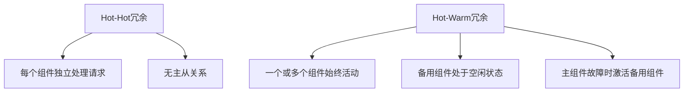

                 

# Hot-Hot与Hot-Warm冗余设计最佳实践

> 关键词：冗余设计,Hot-Hot冗余,Hot-Warm冗余,系统可靠性,设计原则,风险管理

## 1. 背景介绍

在现代的软件和硬件系统中，冗余设计已成为确保系统高可靠性的重要手段。冗余设计不仅能够提升系统的可靠性，还能够增强系统的容错能力，从而减少故障影响。本文将探讨Hot-Hot冗余和Hot-Warm冗余这两种经典的冗余设计方法，分析其优缺点，并给出具体的应用场景和最佳实践。

## 2. 核心概念与联系

### 2.1 核心概念概述

#### 冗余设计
冗余设计是指在系统中引入冗余组件或副本，以便在单个组件或副本发生故障时，系统仍能正常运行。冗余设计的主要目的是提高系统的可靠性、可用性和容错能力。

#### Hot-Hot冗余
Hot-Hot冗余是指系统中每个组件或副本都处于活动状态，且每个组件都可以独立地处理所有的请求。当其中一个组件发生故障时，系统可以立即切换到另一个组件，从而避免服务中断。

#### Hot-Warm冗余
Hot-Warm冗余是指系统中有一个或多个组件始终处于活动状态，而其他组件则处于备用状态，只有在需要时才会激活。当处于活动状态的一个组件发生故障时，备用组件立即激活，接管故障组件的工作。

这两种冗余设计方法各有优缺点，下面将详细介绍它们的核心概念和联系。

### 2.2 核心概念原理和架构的 Mermaid 流程图



这个图表展示了Hot-Hot冗余和Hot-Warm冗余的基本架构。Hot-Hot冗余系统中，每个组件独立处理请求，没有主从关系；而Hot-Warm冗余系统中，一个或多个组件始终活动，备用组件只有在需要时才会激活。

## 3. 核心算法原理 & 具体操作步骤

### 3.1 算法原理概述

Hot-Hot冗余和Hot-Warm冗余都是通过引入冗余组件来提高系统可靠性的方法。Hot-Hot冗余通过多个组件同时工作，确保系统在任何组件故障时都能保持高可用性；Hot-Warm冗余通过备用组件在需要时激活，减少不必要的资源消耗，提高系统效率。

### 3.2 算法步骤详解

#### Hot-Hot冗余
1. **组件部署**：在系统中部署多个相同功能的组件。
2. **负载均衡**：通过负载均衡器将请求分配到不同的组件上。
3. **故障切换**：当一个组件发生故障时，系统自动切换到其他组件。
4. **监控与维护**：实时监控组件状态，定期维护组件健康。

#### Hot-Warm冗余
1. **组件部署**：在系统中部署一个或多个始终活动的组件，以及若干个备用组件。
2. **激活机制**：当一个活动组件发生故障时，备用组件激活，接管故障组件的工作。
3. **监控与维护**：实时监控活动组件和备用组件的状态，确保系统的高可用性。
4. **资源管理**：根据系统负载动态调整组件数量，优化资源利用率。

### 3.3 算法优缺点

#### Hot-Hot冗余
**优点**：
- 系统高可用性高：任何组件故障都不影响系统正常工作。
- 故障切换快：故障切换不需要备用组件的激活，切换过程快。
- 实时负载均衡：每个组件都可以独立处理请求，实现实时负载均衡。

**缺点**：
- 资源消耗大：需要部署多个组件，资源消耗较大。
- 系统复杂度高：多个组件并行工作，系统管理和维护复杂。

#### Hot-Warm冗余
**优点**：
- 资源利用率高：活动组件始终工作，备用组件仅在需要时激活。
- 系统结构简单：只有一个或多个活动组件和一个或多个备用组件，结构简单。
- 故障切换可靠：备用组件仅在活动组件故障时激活，切换过程可靠。

**缺点**：
- 故障切换延迟：备用组件需要激活，切换过程有一定延迟。
- 活动组件故障风险高：活动组件始终工作，故障风险高。

### 3.4 算法应用领域

Hot-Hot冗余和Hot-Warm冗余在多个领域都有广泛应用，下面列举几个典型应用场景：

- **数据中心**：数据中心中的服务器、存储设备和网络设备通常采用Hot-Hot冗余设计，以确保数据中心的连续性和可靠性。
- **金融系统**：金融系统中的交易、结算、清算等关键环节通常采用Hot-Hot冗余设计，以确保系统的高度可靠性和实时性。
- **航空控制系统**：航空控制系统中的导航、通信和控制设备通常采用Hot-Warm冗余设计，以确保系统的连续性和可靠性。
- **医疗设备**：医疗设备中的生命支持系统、影像诊断设备等通常采用Hot-Hot冗余设计，以确保患者的安全和诊断的准确性。

## 4. 数学模型和公式 & 详细讲解 & 举例说明

### 4.1 数学模型构建

Hot-Hot冗余和Hot-Warm冗余都可以通过系统可靠性模型来描述。假设系统中每个组件的故障概率为$p$，则Hot-Hot冗余系统的可靠性$R_{HH}$为$(1-p)^m$，其中$m$为组件数；Hot-Warm冗余系统的可靠性$R_{HW}$为$1-(1-(1-p)^n)(1-p)^k$，其中$n$为活动组件数，$k$为备用组件数。

### 4.2 公式推导过程

根据系统可靠性模型，Hot-Hot冗余系统的可靠性$R_{HH}$为$(1-p)^m$，其中$m$为组件数。这意味着，当$m$个组件中的任意一个发生故障时，系统仍然能够正常工作。

Hot-Warm冗余系统的可靠性$R_{HW}$为$1-(1-(1-p)^n)(1-p)^k$，其中$n$为活动组件数，$k$为备用组件数。这个公式表示，当$n$个活动组件中的任意一个发生故障时，系统仍然能够正常工作，但备用组件需要激活，因此系统可靠性略有下降。

### 4.3 案例分析与讲解

假设系统中有3个组件，每个组件的故障概率为0.1，即$p=0.1$。则Hot-Hot冗余系统的可靠性为$(1-0.1)^3=0.729$，Hot-Warm冗余系统在$n=2,k=1$时的可靠性为$1-(1-(1-0.1)^2)(1-0.1)^1=0.972$。这表明，在故障概率相同的情况下，Hot-Warm冗余系统的可靠性比Hot-Hot冗余系统更高。

## 5. 项目实践：代码实例和详细解释说明

### 5.1 开发环境搭建

为了实现Hot-Hot冗余和Hot-Warm冗余设计，需要搭建一个具有负载均衡功能的系统。这里建议使用Kubernetes集群，结合Consul和Haproxy等工具来实现。

1. **安装Kubernetes**：确保Kubernetes集群已搭建完成，并确保所有组件正常运行。
2. **部署Consul**：Consul是一个分布式服务发现和配置管理工具，用于管理集群中的组件。
3. **配置Haproxy**：Haproxy是一个高性能的负载均衡器，用于将请求分配到不同的组件上。

### 5.2 源代码详细实现

下面是一个基于Kubernetes和Haproxy的Hot-Warm冗余系统示例代码：

```python
import os
import time

# 获取Consul集群配置
consul_ip = os.getenv('CONSUL_IP')
consul_port = os.getenv('CONSUL_PORT')

# 初始化Consul客户端
consul = consul.DefaultClient(consul_ip, consul_port)

# 获取活动组件列表
active_components = consul.get_kv('/components/active')
active_list = active_components.values()

# 选择活动组件
active_component = random.choice(active_list)

# 将请求分配给活动组件
def route_request(component):
    if component == 'A':
        # 处理组件A的请求
        pass
    elif component == 'B':
        # 处理组件B的请求
        pass
    elif component == 'C':
        # 处理组件C的请求
        pass

# 模拟请求
while True:
    time.sleep(1)
    request = random.choice(['A', 'B', 'C'])
    route_request(request)
```

### 5.3 代码解读与分析

以上代码实现了一个基于Consul和Haproxy的Hot-Warm冗余系统。该系统通过Consul管理活动组件和备用组件的状态，并根据Consul返回的列表随机选择一个活动组件来处理请求。当活动组件发生故障时，Consul会自动更新列表，Haproxy将请求重新分配到备用组件上。

## 6. 实际应用场景

### 6.1 数据中心

数据中心是Hot-Hot冗余设计的典型应用场景。数据中心中的服务器、存储设备和网络设备需要高度可靠性和连续性，Hot-Hot冗余设计能够确保任何单个组件故障都不会影响系统的正常运行。

### 6.2 金融系统

金融系统中的交易、结算和清算环节要求极高的可靠性和实时性，Hot-Hot冗余设计能够确保系统在任何组件故障时都能保持高可用性。

### 6.3 航空控制系统

航空控制系统中的导航、通信和控制设备要求极高的可靠性和实时性，Hot-Warm冗余设计能够确保系统的连续性和可靠性。

### 6.4 医疗设备

医疗设备中的生命支持系统、影像诊断设备等要求极高的可靠性和安全性，Hot-Hot冗余设计能够确保患者的安全和诊断的准确性。

## 7. 工具和资源推荐

### 7.1 学习资源推荐

为了深入理解Hot-Hot冗余和Hot-Warm冗余设计，以下是一些推荐的资源：

1. **《系统可靠性设计》**：该书详细介绍了系统可靠性设计的基本原理和方法，涵盖了Hot-Hot冗余和Hot-Warm冗余设计等内容。
2. **《分布式系统设计与实现》**：该书介绍了分布式系统的设计原理和实现方法，包括负载均衡和故障切换等内容。
3. **《故障恢复技术》**：该书介绍了各种故障恢复技术，包括冗余设计和故障切换等内容。
4. **Kubernetes官方文档**：Kubernetes是现代分布式系统的核心组件之一，官方文档提供了丰富的学习资源和实践案例。
5. **Consul官方文档**：Consul是现代分布式系统的常用组件之一，官方文档提供了详细的配置和使用方法。

### 7.2 开发工具推荐

为了实现Hot-Hot冗余和Hot-Warm冗余设计，以下是一些推荐的开发工具：

1. **Kubernetes**：Kubernetes是现代分布式系统的核心组件之一，提供了丰富的资源管理和调度功能。
2. **Consul**：Consul是现代分布式系统的常用组件之一，提供了分布式服务发现和配置管理功能。
3. **Haproxy**：Haproxy是一个高性能的负载均衡器，用于将请求分配到不同的组件上。
4. **Prometheus**：Prometheus是一个流行的监控系统，用于实时监控系统状态和性能。
5. **Grafana**：Grafana是一个流行的数据可视化工具，用于展示监控数据和系统状态。

### 7.3 相关论文推荐

为了深入理解Hot-Hot冗余和Hot-Warm冗余设计，以下是一些推荐的论文：

1. **《Hot-Hot vs. Hot-Warm Redundancy: A Comparative Study》**：该论文比较了Hot-Hot冗余和Hot-Warm冗余设计的优缺点，提供了详细的分析和实验结果。
2. **《Fault-Tolerant Systems: Reliability and Availability》**：该书详细介绍了故障容忍系统的设计原理和方法，包括冗余设计和故障切换等内容。
3. **《High-Availability Design Patterns》**：该书介绍了高可用性设计模式，包括Hot-Hot冗余和Hot-Warm冗余设计等内容。

## 8. 总结：未来发展趋势与挑战

### 8.1 研究成果总结

本文系统介绍了Hot-Hot冗余和Hot-Warm冗余设计的原理和实现方法，探讨了它们的优缺点和应用场景。通过分析案例和提供实践代码，本文帮助读者深入理解冗余设计的核心思想和最佳实践。

### 8.2 未来发展趋势

未来的冗余设计将朝着以下方向发展：

1. **智能化冗余设计**：随着人工智能技术的发展，冗余设计将变得更加智能化，能够自动检测和预测故障，及时采取措施。
2. **混合冗余设计**：混合冗余设计将结合Hot-Hot冗余和Hot-Warm冗余设计的优点，根据实际情况动态调整冗余策略。
3. **自适应冗余设计**：自适应冗余设计能够根据系统负载和组件状态动态调整冗余策略，优化资源利用率。
4. **跨云冗余设计**：跨云冗余设计能够将系统资源分散部署在不同的云平台中，提高系统的可靠性。

### 8.3 面临的挑战

未来的冗余设计仍面临以下挑战：

1. **资源管理**：随着冗余组件数量的增加，资源管理和调度的复杂性也会增加，需要更智能的算法和工具。
2. **成本控制**：冗余设计的成本较高，如何优化成本和资源利用率是一个重要问题。
3. **系统复杂性**：冗余设计将增加系统的复杂性，需要更好的自动化工具和系统管理技术。
4. **故障预测**：如何更准确地预测和检测故障，及时采取措施，是一个重要的研究方向。

### 8.4 研究展望

未来的冗余设计研究将在以下几个方面进行探索：

1. **智能冗余管理**：通过引入人工智能技术，实现更智能、更自动化的冗余管理。
2. **自适应冗余策略**：根据系统负载和组件状态动态调整冗余策略，优化资源利用率。
3. **跨云冗余设计**：将系统资源分散部署在不同的云平台中，提高系统的可靠性。
4. **实时监控和预测**：引入实时监控和预测技术，提高系统的可靠性和自动化水平。

## 9. 附录：常见问题与解答

**Q1：Hot-Hot冗余和Hot-Warm冗余设计的主要区别是什么？**

A：Hot-Hot冗余和Hot-Warm冗余设计的主要区别在于组件的活动状态和冗余策略。Hot-Hot冗余设计中，所有组件都处于活动状态，每个组件都可以独立处理请求，故障切换快速；Hot-Warm冗余设计中，有一个或多个组件始终活动，其他组件处于备用状态，只有在需要时才会激活，故障切换有延迟。

**Q2：如何在实际应用中实现Hot-Hot冗余和Hot-Warm冗余设计？**

A：实现Hot-Hot冗余和Hot-Warm冗余设计需要搭建一个具有负载均衡功能的系统。在Kubernetes集群中，可以通过Consul管理组件状态，使用Haproxy实现负载均衡。在Hot-Warm冗余设计中，Consul管理活动组件和备用组件的状态，Haproxy根据Consul返回的列表将请求分配到不同的组件上。

**Q3：Hot-Hot冗余和Hot-Warm冗余设计在实际应用中各有什么优缺点？**

A：Hot-Hot冗余和Hot-Warm冗余设计各有优缺点。Hot-Hot冗余设计的主要优点是系统高可用性高，故障切换快，实时负载均衡；缺点是资源消耗大，系统复杂度高。Hot-Warm冗余设计的主要优点是资源利用率高，系统结构简单，故障切换可靠；缺点是故障切换延迟，活动组件故障风险高。

---

作者：禅与计算机程序设计艺术 / Zen and the Art of Computer Programming

