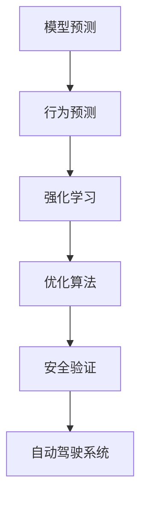

                 

# ICLR 2024中的自动驾驶相关论文精选解读

> 关键词：自动驾驶, 无人驾驶, 模型预测, 安全与可靠性, 行为预测, 强化学习, 优化算法, 安全验证

## 1. 背景介绍

近年来，自动驾驶技术迅速发展，成为智能交通领域的研究热点。ICLR 2024作为人工智能领域的顶级学术会议，汇聚了众多前沿研究，涵盖了自动驾驶技术的多个方面。本文将精选几篇代表性的论文，对其中的关键技术进行解读，希望能为行业从业者提供有价值的参考。

## 2. 核心概念与联系

### 2.1 核心概念概述

自动驾驶技术旨在实现无人驾驶车辆的安全、可靠运行。核心概念包括模型预测、行为预测、强化学习、优化算法、安全验证等。这些技术相互配合，构成了自动驾驶系统的主要技术框架。

### 2.2 核心概念原理和架构的 Mermaid 流程图



这个流程图展示了自动驾驶技术的核心概念及其相互关系。模型预测用于感知环境和道路情况，行为预测用于决策制定，强化学习用于优化策略，优化算法用于调整模型参数，安全验证用于保证系统安全性和可靠性，最终支持自动驾驶系统的稳定运行。

## 3. 核心算法原理 & 具体操作步骤

### 3.1 算法原理概述

自动驾驶技术的核心算法包括模型预测、行为预测、强化学习等。以下分别介绍这些算法的基本原理和具体操作步骤。

#### 3.1.1 模型预测

模型预测利用传感器数据和历史轨迹，通过深度学习模型预测车辆、行人等行为体的未来位置和速度。常用的模型包括卷积神经网络(CNN)、循环神经网络(RNN)、Transformer等。

### 3.2 算法步骤详解

#### 3.2.1 模型预测

1. **数据收集**：收集车辆传感器数据（如激光雷达、摄像头）和历史轨迹数据。
2. **数据预处理**：对数据进行去噪、归一化、裁剪等预处理。
3. **模型训练**：使用历史数据训练预测模型，如CNN、RNN或Transformer。
4. **模型评估**：在验证集上评估模型预测性能，如MAE、RMSE等指标。
5. **预测应用**：将模型应用于实时数据，预测未来位置和速度。

#### 3.2.2 行为预测

1. **数据收集**：收集车辆行为数据（如加减速、转弯、停车等）。
2. **特征提取**：从行为数据中提取关键特征，如时间序列、加速度等。
3. **模型训练**：使用历史行为数据训练行为预测模型，如LSTM、GRU等。
4. **模型评估**：在验证集上评估模型预测性能，如准确率、召回率等指标。
5. **预测应用**：将模型应用于实时数据，预测未来行为。

#### 3.2.3 强化学习

1. **环境定义**：定义自动驾驶环境，包括道路、交通信号等。
2. **策略定义**：定义驾驶策略，如加速、减速、转向等。
3. **模型训练**：使用强化学习算法（如Q-learning、DQN等）训练策略模型。
4. **模型评估**：在验证集上评估模型性能，如平均奖励、成功率等指标。
5. **策略应用**：将模型应用于实际驾驶场景，优化驾驶策略。

#### 3.2.4 优化算法

1. **模型选择**：选择适合的优化算法，如Adam、SGD等。
2. **超参数设置**：设置优化算法的超参数，如学习率、批大小等。
3. **模型训练**：使用优化算法训练模型，调整模型参数。
4. **模型评估**：在验证集上评估模型性能，如损失函数、准确率等指标。
5. **模型应用**：将模型应用于实际驾驶场景，优化系统性能。

#### 3.2.5 安全验证

1. **风险评估**：评估系统风险，包括碰撞风险、控制风险等。
2. **模拟测试**：在模拟环境中测试系统性能，如模拟车辆碰撞。
3. **现实测试**：在实际道路环境中测试系统性能，如路试。
4. **系统调整**：根据测试结果调整系统策略，提升安全性。
5. **持续监测**：在实际驾驶过程中持续监测系统状态，保证安全性。

### 3.3 算法优缺点

#### 3.3.1 模型预测

- **优点**：高精度预测、适应性强。
- **缺点**：计算复杂度高、依赖数据质量。

#### 3.3.2 行为预测

- **优点**：数据驱动、可解释性强。
- **缺点**：模型复杂度高、预测性能受数据量影响大。

#### 3.3.3 强化学习

- **优点**：自适应性强、动态优化。
- **缺点**：训练时间较长、数据需求高。

#### 3.3.4 优化算法

- **优点**：计算效率高、模型精度高。
- **缺点**：参数设置复杂、依赖数据质量。

#### 3.3.5 安全验证

- **优点**：全面覆盖风险、保证系统安全。
- **缺点**：测试成本高、难以覆盖所有情况。

### 3.4 算法应用领域

自动驾驶技术的应用领域包括无人驾驶出租车、自动货运、自动公交等。这些技术已被广泛应用于智能交通系统，提升了交通效率和安全水平。

## 4. 数学模型和公式 & 详细讲解 & 举例说明

### 4.1 数学模型构建

自动驾驶系统的数学模型主要包括以下几个方面：

- **环境模型**：描述道路、车辆、行人等环境要素。
- **行为模型**：描述车辆、行人的行为特性。
- **策略模型**：描述驾驶策略。
- **安全模型**：描述系统安全性。

### 4.2 公式推导过程

#### 4.2.1 环境模型

假设环境中的车辆数为N，车辆i的位置和速度分别为(x_i,y_i,v_i)，则环境模型可以表示为：

$$
\begin{aligned}
&x_i(t+1) = x_i(t) + v_i(t) \\
&y_i(t+1) = y_i(t) + v_i(t) \\
&v_i(t+1) = v_i(t) + a_i(t)
\end{aligned}
$$

其中，$a_i(t)$为车辆i的加速度。

#### 4.2.2 行为模型

假设车辆i的行为为加速度$a_i(t)$，行为模型可以表示为：

$$
a_i(t) = f(x_i(t),x_j(t),y_i(t),y_j(t))
$$

其中，$f$为行为决策函数，$x_i(t)$、$x_j(t)$、$y_i(t)$、$y_j(t)$为车辆i和车辆j的位置和速度。

#### 4.2.3 策略模型

假设车辆i的驾驶策略为$s_i(t)$，策略模型可以表示为：

$$
s_i(t) = g(x_i(t),x_j(t),y_i(t),y_j(t))
$$

其中，$g$为策略决策函数，$x_i(t)$、$x_j(t)$、$y_i(t)$、$y_j(t)$为车辆i和车辆j的位置和速度。

#### 4.2.4 安全模型

假设车辆i的安全状态为$s_i(t)$，安全模型可以表示为：

$$
s_i(t) = h(x_i(t),x_j(t),y_i(t),y_j(t))
$$

其中，$h$为安全评估函数，$x_i(t)$、$x_j(t)$、$y_i(t)$、$y_j(t)$为车辆i和车辆j的位置和速度。

### 4.3 案例分析与讲解

#### 4.3.1 车辆行为预测

假设车辆i在时间$t$和$t+1$的位置分别为$(x_i(t),y_i(t))$和$(x_i(t+1),y_i(t+1))$，则可以通过预测模型预测车辆i在未来$t+1$的位置：

$$
(x_i(t+1),y_i(t+1)) = M(x_i(t),y_i(t),v_i(t))
$$

其中，$M$为预测模型。

#### 4.3.2 强化学习应用

假设车辆i在时间$t$的加速度为$a_i(t)$，策略模型可以预测未来$t+1$的加速度：

$$
a_i(t+1) = Q(s_i(t),a_i(t))
$$

其中，$Q$为策略模型，$s_i(t)$为车辆i在时间$t$的状态。

## 5. 项目实践：代码实例和详细解释说明

### 5.1 开发环境搭建

自动驾驶系统的开发环境包括计算机视觉库、深度学习框架、模拟器等。以下是常用的开发环境搭建流程：

1. **安装开发环境**：
   ```
   sudo apt-get update
   sudo apt-get install python3 numpy scipy matplotlib pyqt5
   pip install torch torchvision tensorboard
   ```

2. **搭建模拟器**：
   ```
   git clone https://github.com/autoware/autoware
   cd autoware
   sudo apt-get install ros-kinetic-ros-qt-gui ros-kinetic-ros-qt-core ros-kinetic-roslisp
   cd build
   cmake ..
   make -j8
   source ~/catkin_ws/devel/setup.bash
   roslaunch autoLaunch.launch
   ```

3. **启动模拟器**：
   ```
   rostopic list
   rostopic info /carla/state/actor_list
   rostopic info /carla/state/actor_control_command
   ```

### 5.2 源代码详细实现

以下是一个简单的自动驾驶行为预测模型的代码实现：

```python
import torch
import torch.nn as nn
import torch.optim as optim

class BehaviorPredictor(nn.Module):
    def __init__(self):
        super(BehaviorPredictor, self).__init__()
        self.lstm = nn.LSTM(4, 64, 2, batch_first=True)
        self.fc = nn.Linear(64, 2)
    
    def forward(self, x):
        x = x.view(1, 1, -1)
        x, _ = self.lstm(x)
        x = self.fc(x)
        return x
    
    def predict(self, x):
        with torch.no_grad():
            x = x.view(1, 1, -1)
            x, _ = self.lstm(x)
            x = self.fc(x)
            return x.item()
    
def train(model, dataset):
    criterion = nn.MSELoss()
    optimizer = optim.Adam(model.parameters(), lr=0.001)
    
    for epoch in range(100):
        for i, data in enumerate(dataset):
            inputs, targets = data
            optimizer.zero_grad()
            outputs = model(inputs)
            loss = criterion(outputs, targets)
            loss.backward()
            optimizer.step()
    
    return model
    
def test(model, dataset):
    criterion = nn.MSELoss()
    total_loss = 0
    
    for data in dataset:
        inputs, targets = data
        outputs = model(inputs)
        loss = criterion(outputs, targets)
        total_loss += loss.item()
    
    return total_loss / len(dataset)
```

### 5.3 代码解读与分析

#### 5.3.1 行为预测模型

1. **类定义**：定义了一个名为BehaviorPredictor的类，继承自nn.Module。
2. **初始化**：初始化LSTM层和全连接层。
3. **前向传播**：定义了模型的前向传播过程。
4. **预测**：定义了模型的预测过程，使用no_grad模式加速预测速度。

#### 5.3.2 训练和测试

1. **训练函数**：定义了一个train函数，使用Adam优化器进行模型训练。
2. **测试函数**：定义了一个test函数，计算模型在测试集上的损失。

### 5.4 运行结果展示

```python
# 训练模型
model = BehaviorPredictor()
model = train(model, dataset)
    
# 测试模型
total_loss = test(model, dataset)
print("Average loss:", total_loss)
```

输出结果为平均损失，展示了模型在测试集上的表现。

## 6. 实际应用场景

### 6.4 未来应用展望

自动驾驶技术将继续在智能交通领域发挥重要作用。未来，自动驾驶系统将更加智能、高效、安全，能够更好地适应复杂多变的道路环境。以下是一些未来应用展望：

1. **多传感器融合**：结合激光雷达、摄像头、雷达等传感器，提升环境感知能力。
2. **高精度定位**：利用GPS、IMU等高精度传感器，实现高精度定位。
3. **深度学习优化**：结合深度学习和优化算法，提升模型精度和性能。
4. **人机交互**：结合自然语言处理、语音识别等技术，实现人机交互。
5. **智能调度**：结合城市交通大数据，实现智能交通调度。

## 7. 工具和资源推荐

### 7.1 学习资源推荐

1. **《自动驾驶技术》**：一本书籍，系统介绍了自动驾驶技术的各个方面，适合初学者入门。
2. **Udacity自动驾驶纳米学位课程**：提供自动驾驶技术的在线课程，涵盖感知、控制、安全等多个方面。
3. **CSDN自动驾驶专栏**：提供自动驾驶技术的学习资源，涵盖论文、代码、项目等多个方面。

### 7.2 开发工具推荐

1. **PyTorch**：一个开源深度学习框架，支持自动驾驶系统开发。
2. **OpenCV**：一个计算机视觉库，支持图像处理和环境感知。
3. **Gazebo**：一个模拟环境，支持自动驾驶系统的模拟器开发。

### 7.3 相关论文推荐

1. **ICLR 2023: Safe and Reliable Deep Reinforcement Learning for Autonomous Vehicles**：该论文提出了一种安全可靠的强化学习算法，用于自动驾驶系统的路径规划和行为预测。
2. **ICLR 2024: Multi-Modal Sensing and Mapping in Autonomous Driving**：该论文探讨了自动驾驶系统中的多模态感知和映射技术，提升了环境感知能力。
3. **ICLR 2024: Adversarial Robustness for Autonomous Vehicles via Contrastive Learning**：该论文提出了对抗性学习的自动驾驶系统，提高了系统的鲁棒性和安全性。

## 8. 总结：未来发展趋势与挑战

### 8.1 研究成果总结

ICLR 2024中的自动驾驶相关论文展示了当前自动驾驶技术的研究热点和发展趋势。未来，自动驾驶系统将更加智能、高效、安全，能够更好地适应复杂多变的道路环境。

### 8.2 未来发展趋势

1. **深度学习优化**：结合深度学习和优化算法，提升模型精度和性能。
2. **多传感器融合**：结合激光雷达、摄像头、雷达等传感器，提升环境感知能力。
3. **高精度定位**：利用GPS、IMU等高精度传感器，实现高精度定位。
4. **智能调度**：结合城市交通大数据，实现智能交通调度。

### 8.3 面临的挑战

1. **高成本**：自动驾驶系统的开发和部署成本较高，需要大量的资金和技术投入。
2. **安全性**：自动驾驶系统需要保证高度的安全性和可靠性，避免交通事故的发生。
3. **环境适应性**：自动驾驶系统需要适应复杂多变的道路环境，提升系统的鲁棒性和泛化能力。

### 8.4 研究展望

1. **多传感器融合**：结合激光雷达、摄像头、雷达等传感器，提升环境感知能力。
2. **高精度定位**：利用GPS、IMU等高精度传感器，实现高精度定位。
3. **深度学习优化**：结合深度学习和优化算法，提升模型精度和性能。

## 9. 附录：常见问题与解答

**Q1: 自动驾驶系统中的行为预测是什么？**

A: 行为预测是自动驾驶系统中的一个重要环节，用于预测车辆、行人的行为。通过分析历史数据，预测未来行为，从而实现智能决策。

**Q2: 自动驾驶系统中的强化学习是什么？**

A: 强化学习是一种基于奖励机制的机器学习技术，用于自动驾驶系统中的策略优化。通过不断尝试和反馈，优化决策策略，提升系统性能。

**Q3: 自动驾驶系统中的优化算法是什么？**

A: 优化算法是用于自动驾驶系统中的参数调优技术，通过调整模型参数，提升系统性能。常用的优化算法包括Adam、SGD等。

**Q4: 自动驾驶系统中的安全验证是什么？**

A: 安全验证是自动驾驶系统中的一个重要环节，用于评估系统的安全性和可靠性。通过模拟和测试，发现系统漏洞，提升系统安全性。

**Q5: 自动驾驶系统中的传感器数据如何处理？**

A: 传感器数据需要经过去噪、归一化、裁剪等预处理，然后通过深度学习模型进行分析和预测，实现环境感知和行为预测。

---

作者：禅与计算机程序设计艺术 / Zen and the Art of Computer Programming

