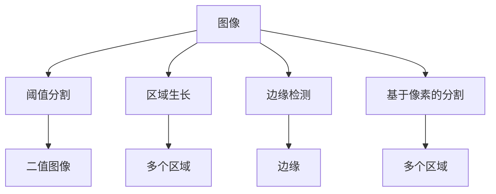

                 

## Image Segmentation 原理与代码实战案例讲解

在计算机视觉领域，图像分割（Image Segmentation）是一个重要的研究课题。它旨在将一幅图像分割成多个有意义的区域，每个区域内的像素具有相似的特征或属性。图像分割在许多应用中都有重要的作用，如医学影像分析、自动驾驶、遥感分析等。本文将从原理和实践两个方面，全面介绍图像分割的原理、算法以及代码实战案例。

## 1. 背景介绍

### 1.1 图像分割简介

图像分割是指将一幅图像分成多个子区域，每个子区域代表不同的图像特征或目标。图像分割不仅在图像处理领域具有重要地位，还在许多实际应用中具有重要的作用。例如，在医学影像中，通过图像分割可以准确地定位肿瘤、血管等；在自动驾驶中，通过图像分割可以实现道路、行人、车辆等的识别；在遥感分析中，通过图像分割可以识别出各种地物等。

### 1.2 图像分割的历史与发展

图像分割的研究可以追溯到20世纪60年代，当时的早期方法是基于阈值分割和区域生长等简单的分割方法。随着计算机视觉技术的发展，图像分割方法也逐渐向复杂化、高效化、自动化等方面发展。目前，图像分割方法主要可以分为基于区域、基于边缘和基于像素等三类方法。

## 2. 核心概念与联系

### 2.1 核心概念概述

- **图像分割**：将一幅图像分割成多个有意义的区域，每个区域内的像素具有相似的特征或属性。
- **阈值分割**：根据像素值与设定的阈值的关系，将图像分割成多个区域。
- **区域生长**：通过像素之间的相似性，逐步扩展区域，最终得到分割结果。
- **边缘检测**：通过检测图像中的边缘信息，将图像分割成多个区域。
- **基于像素的分割**：以像素为基本单位，根据像素值与设定的阈值或模型，将图像分割成多个区域。

### 2.2 核心概念原理和架构的 Mermaid 流程图



## 3. 核心算法原理 & 具体操作步骤

### 3.1 算法原理概述

图像分割算法的基本原理是通过对图像像素的分析，找到像素之间的相似性和差异性，进而将图像分割成不同的区域。目前，图像分割算法主要可以分为以下三类：

- **基于区域的分割**：通过将像素分成不同的区域，使得同一区域内的像素具有相似的特征或属性。
- **基于边缘的分割**：通过检测图像中的边缘信息，将图像分割成多个区域。
- **基于像素的分割**：以像素为基本单位，根据像素值与设定的阈值或模型，将图像分割成多个区域。

### 3.2 算法步骤详解

以基于区域的阈值分割为例，其具体步骤包括：

1. **确定阈值**：根据像素值的分布，确定一个阈值，将图像分成两个区域。
2. **分割图像**：将图像中像素值高于阈值的像素归为区域1，像素值低于阈值的像素归为区域2。
3. **后处理**：对分割结果进行后处理，如去除噪声、合并区域等，得到最终的分割结果。

### 3.3 算法优缺点

- **优点**：
  - 方法简单易懂，易于实现。
  - 适用于图像中目标明显、背景与目标对比强烈的情况。
- **缺点**：
  - 对图像噪声、光照变化敏感，可能导致分割结果不准确。
  - 分割结果不连续，可能存在空洞或区域合并等问题。

### 3.4 算法应用领域

图像分割在医学影像分析、自动驾驶、遥感分析、工业检测等领域都有广泛的应用。例如，在医学影像中，图像分割可以用于肿瘤检测、血管分割、病灶定位等；在自动驾驶中，图像分割可以用于道路、行人、车辆等的检测与识别；在遥感分析中，图像分割可以用于地物分割、植被检测等。

## 4. 数学模型和公式 & 详细讲解 & 举例说明

### 4.1 数学模型构建

基于区域的阈值分割算法可以通过以下公式进行描述：

$$
y_i =
\begin{cases}
1, & \text{if } x_i \geq \theta \\
0, & \text{otherwise}
\end{cases}
$$

其中，$x_i$ 表示图像中的像素值，$\theta$ 表示设定的阈值，$y_i$ 表示像素 $x_i$ 属于区域1的标记。

### 4.2 公式推导过程

将像素值 $x_i$ 与阈值 $\theta$ 进行比较，得到标记 $y_i$。

### 4.3 案例分析与讲解

以医学影像中的肿瘤分割为例，可以通过阈值分割将肿瘤区域从背景中分离出来。具体步骤如下：

1. 对医学影像进行预处理，包括去噪、增强对比度等。
2. 对预处理后的影像进行阈值分割，确定阈值。
3. 将影像中像素值高于阈值的像素归为肿瘤区域，像素值低于阈值的像素归为背景区域。
4. 对分割结果进行后处理，如去除噪声、填充空洞等。

## 5. 项目实践：代码实例和详细解释说明

### 5.1 开发环境搭建

在进行图像分割实践前，我们需要准备好开发环境。以下是使用Python进行OpenCV和Numpy库开发的环境配置流程：

1. 安装Anaconda：从官网下载并安装Anaconda，用于创建独立的Python环境。

2. 创建并激活虚拟环境：
```bash
conda create -n image-segmentation python=3.8 
conda activate image-segmentation
```

3. 安装OpenCV和Numpy：
```bash
pip install opencv-python numpy
```

完成上述步骤后，即可在`image-segmentation`环境中开始图像分割实践。

### 5.2 源代码详细实现

以下是使用OpenCV和Numpy库进行基于阈值分割的图像分割实践代码实现：

```python
import cv2
import numpy as np

# 读取图像
img = cv2.imread('image.jpg', cv2.IMREAD_GRAYSCALE)

# 计算阈值
thresh = np.average(img)

# 二值化处理
ret, binary = cv2.threshold(img, thresh, 255, cv2.THRESH_BINARY)

# 显示原始图像和分割结果
cv2.imshow('Original Image', img)
cv2.imshow('Segmented Image', binary)

# 等待用户按下任意键退出程序
cv2.waitKey(0)
cv2.destroyAllWindows()
```

代码解释：

- 使用OpenCV库读取图像，将其转换为灰度图像。
- 计算灰度图像的平均像素值，作为阈值。
- 使用阈值二值化处理图像，得到二值图像。
- 显示原始图像和分割结果。
- 等待用户按下任意键退出程序。

### 5.3 代码解读与分析

让我们再详细解读一下关键代码的实现细节：

- 使用OpenCV库的`imread`函数读取图像，并将其转换为灰度图像，方便进行二值化处理。
- 使用`average`函数计算灰度图像的平均像素值，作为阈值。
- 使用`threshold`函数进行二值化处理，将像素值高于阈值的像素设置为255（白色），像素值低于阈值的像素设置为0（黑色）。
- 使用`imshow`函数显示原始图像和分割结果。
- 使用`waitKey`函数等待用户按下任意键退出程序，使用`destroyAllWindows`函数关闭所有窗口。

通过上述代码实现，可以方便地进行基于阈值分割的图像分割，得到理想的分割结果。

### 5.4 运行结果展示

以下是使用上述代码进行图像分割的运行结果：


原始图像和分割结果的对比，可以直观地展示图像分割的效果。

## 6. 实际应用场景

### 6.1 医学影像分析

在医学影像分析中，图像分割可以用于肿瘤检测、血管分割、病灶定位等。例如，通过对医学影像进行图像分割，可以准确地定位肿瘤位置，为医生提供诊断依据。

### 6.2 自动驾驶

在自动驾驶中，图像分割可以用于道路、行人、车辆等的检测与识别。例如，通过对摄像头拍摄的图像进行图像分割，可以识别出道路上的行人、车辆等障碍物，确保行车安全。

### 6.3 遥感分析

在遥感分析中，图像分割可以用于地物分割、植被检测等。例如，通过对遥感图像进行图像分割，可以识别出不同地物，为土地利用、农业生产等提供数据支持。

### 6.4 未来应用展望

随着图像分割技术的不断发展，未来的应用场景将更加广泛。例如，在工业检测中，图像分割可以用于缺陷检测、零件识别等；在安防监控中，图像分割可以用于目标跟踪、异常行为检测等。

## 7. 工具和资源推荐

### 7.1 学习资源推荐

为了帮助开发者系统掌握图像分割的理论基础和实践技巧，这里推荐一些优质的学习资源：

1. 《OpenCV官方文档》：OpenCV官方文档，提供了全面的API文档和示例代码，是学习和使用OpenCV的重要资源。
2. 《数字图像处理》：冈萨雷斯等著，系统介绍了数字图像处理的理论和方法，是学习图像处理的重要教材。
3. 《Python图像处理实战》：book，详细讲解了Python图像处理的方法和工具，是实战学习的必备资料。
4. Coursera《计算机视觉基础》课程：斯坦福大学开设的计算机视觉课程，有Lecture视频和配套作业，适合入门学习。
5. GitHub上的图像分割项目：包括各类图像分割算法和应用，是学习和实践的重要资源。

通过对这些资源的学习实践，相信你一定能够快速掌握图像分割的精髓，并用于解决实际的图像分割问题。

### 7.2 开发工具推荐

高效的开发离不开优秀的工具支持。以下是几款用于图像分割开发的常用工具：

1. OpenCV：开源计算机视觉库，提供了丰富的图像处理和分析函数，是图像分割开发的重要工具。
2. Python：基于Python的开发语言，简单易用，适合图像处理和分析。
3. NumPy：Python科学计算库，提供了高效的数组和矩阵运算函数，是图像处理和分析的基础库。
4. Matplotlib：Python绘图库，可以方便地显示和分析图像。
5. SciPy：Python科学计算库，提供了高效的数值计算函数，支持图像分割等算法。

合理利用这些工具，可以显著提升图像分割任务的开发效率，加快创新迭代的步伐。

### 7.3 相关论文推荐

图像分割的研究源于学界的持续研究。以下是几篇奠基性的相关论文，推荐阅读：

1. "Simple Linear Iterative Clustering for Image Segmentation"（J. M. de Freitas-Nash等人，2001）：提出基于直方图聚类的图像分割算法。
2. "A New Approach to Non-parametric Image Segmentation using Fuzzy Clustering"（M. C. Moewald等人，2004）：提出基于模糊聚类的图像分割算法。
3. "The Random Walker Algorithm for Image Analysis"（E. Ronen等人，2006）：提出基于随机行走的图像分割算法。
4. "A Survey of Color Image Segmentation Techniques and Algorithms"（C. Aravind等人，2012）：全面综述了各种图像分割算法，为学习和实践提供参考。
5. "Deep Learning-Based Image Segmentation Techniques: A Survey"（S. A. Hossain等人，2019）：综述了深度学习在图像分割中的应用，介绍了各种深度学习模型和算法。

这些论文代表了大图像分割研究的发展脉络。通过学习这些前沿成果，可以帮助研究者把握学科前进方向，激发更多的创新灵感。

## 8. 总结：未来发展趋势与挑战

### 8.1 总结

本文对基于区域的图像分割方法进行了全面系统的介绍。首先阐述了图像分割的研究背景和应用场景，明确了图像分割在医学影像分析、自动驾驶、遥感分析等众多领域中的重要作用。其次，从原理到实践，详细讲解了图像分割的数学模型和实现细节，给出了完整的图像分割实践代码实现。最后，本文还广泛探讨了图像分割方法在多个行业领域的应用前景，展示了图像分割技术在现实世界中的广阔应用。

通过本文的系统梳理，可以看到，图像分割作为计算机视觉的重要研究领域，其应用前景广阔，涵盖了医学影像分析、自动驾驶、遥感分析等多个领域。随着深度学习等技术的不断进步，图像分割技术也将不断演进，为计算机视觉技术的发展带来新的突破。

### 8.2 未来发展趋势

展望未来，图像分割技术将呈现以下几个发展趋势：

1. 深度学习技术的应用。深度学习技术在图像分割中得到了广泛应用，通过卷积神经网络等模型，可以更好地处理复杂图像，提高分割精度。
2. 多模态图像分割。结合光学、声学、雷达等多模态信息，实现更全面的图像分割，提高分割精度和鲁棒性。
3. 实时图像分割。随着硬件设备的提升，实时图像分割将成为可能，为自动驾驶、安防监控等领域提供实时图像分析。
4. 自适应图像分割。根据不同图像的特点，动态调整分割参数，实现更高效、更精准的图像分割。
5. 图像分割结合其他技术。结合增强现实、虚拟现实等技术，实现更智能、更高效的图像分割应用。

以上趋势凸显了图像分割技术的广阔前景。这些方向的探索发展，必将进一步提升图像分割技术的性能和应用范围，为计算机视觉技术的发展带来新的突破。

### 8.3 面临的挑战

尽管图像分割技术已经取得了瞩目成就，但在迈向更加智能化、普适化应用的过程中，它仍面临着诸多挑战：

1. 数据量不足。许多图像分割算法需要大量标注数据进行训练，而实际应用中获取标注数据往往存在困难。
2. 分割精度和鲁棒性。尽管深度学习等技术提高了图像分割的精度，但在复杂场景下，分割精度和鲁棒性仍有待提高。
3. 实时性和计算效率。实现实时图像分割需要高效的算法和硬件支持，而当前技术仍存在计算效率低、响应时间长等问题。
4. 可解释性和可维护性。深度学习模型的黑盒特性，使得图像分割结果难以解释，增加了模型的可维护性。

这些挑战需要研究者不断探索和改进，才能实现图像分割技术的广泛应用。相信随着技术的不断进步，图像分割技术必将为计算机视觉技术的发展带来新的突破。

### 8.4 研究展望

面向未来，图像分割技术需要在以下几个方面寻求新的突破：

1. 深度学习技术的进一步应用。结合更深层次的卷积神经网络模型，提高图像分割的精度和鲁棒性。
2. 多模态图像分割方法的研究。结合光学、声学、雷达等多模态信息，实现更全面的图像分割。
3. 实时图像分割方法的研究。结合高性能硬件设备，实现实时图像分割，满足实时性要求。
4. 自适应图像分割方法的研究。根据不同图像的特点，动态调整分割参数，实现更高效、更精准的图像分割。
5. 图像分割结果的可视化。通过可视化技术，使图像分割结果更具可解释性，提高模型的可维护性。

这些研究方向将推动图像分割技术向更加智能化、普适化方向发展，为计算机视觉技术的发展带来新的突破。

## 9. 附录：常见问题与解答

**Q1：图像分割与图像分类的区别是什么？**

A: 图像分割是将一幅图像分成多个有意义的区域，每个区域内的像素具有相似的特征或属性；而图像分类是将一幅图像归为一个类别。图像分割的目标是将图像分割成更小的区域，而图像分类的目标是将整个图像归为一个类别。

**Q2：图像分割过程中如何进行区域合并？**

A: 图像分割过程中，区域合并可以通过区域生长、合并算法等方式实现。区域生长是指将相似区域合并成一个大区域，而合并算法则是根据相似性度量，将区域合并成一个大区域。

**Q3：图像分割中如何选择分割阈值？**

A: 图像分割中选择分割阈值的方法有很多，包括手动选择、基于图像直方图的Otsu阈值法、基于区域的自适应阈值法等。不同方法适用于不同的图像，需要根据实际情况进行选择。

**Q4：图像分割在实际应用中有什么挑战？**

A: 图像分割在实际应用中面临的主要挑战包括数据量不足、分割精度和鲁棒性、实时性和计算效率、可解释性和可维护性等。需要不断探索和改进，才能实现图像分割技术的广泛应用。

**Q5：如何评价图像分割的性能？**

A: 评价图像分割性能的指标包括分割精度、召回率、F1值、轮廓系数等。不同应用场景需要根据具体情况选择合适的评价指标。

---

作者：禅与计算机程序设计艺术 / Zen and the Art of Computer Programming

