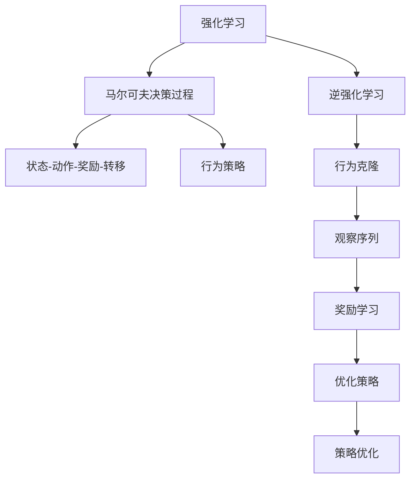

                 

# Inverse Reinforcement Learning原理与代码实例讲解

> 关键词：逆强化学习，奖励学习，贝叶斯网络，马尔可夫决策过程，行为克隆，深度强化学习

## 1. 背景介绍

### 1.1 问题由来

逆强化学习（Inverse Reinforcement Learning, IRL）是强化学习（Reinforcement Learning, RL）领域的一个重要分支，它主要解决的是如何从观测数据中学习到代理的行为策略，而不是传统的RL从奖励信号中学习行为策略。逆强化学习的核心问题是：给定一系列状态和动作序列（通常为视频、图像等高维数据），推断出相应的奖励函数，以便优化生成特定的行为策略。

逆强化学习在许多领域都具有广泛的应用前景，例如机器人学习、自动驾驶、游戏AI、视频内容推荐等。传统强化学习方法往往需要设计出合理的奖励函数，这需要大量的领域知识，难以实现。而逆强化学习可以通过对行为数据的分析学习出合理的奖励函数，从而指导后续的行为策略优化，具有更高的适应性和泛化能力。

### 1.2 问题核心关键点

逆强化学习的核心在于从数据中推断出奖励函数，进而优化生成特定的行为策略。其中最关键的点包括：

- **数据驱动的奖励学习**：通过行为数据的观测序列推断出奖励函数，无需人工设计。
- **行为策略优化**：在推断出奖励函数后，优化生成行为策略以匹配特定目标。
- **泛化能力**：能够将学到的奖励函数泛化到新的行为数据上。
- **复杂性处理**：对于高维数据、动态数据等复杂情况，如何高效推断奖励函数是一个难点。
- **实时优化**：如何实时地对行为策略进行优化，以应对动态变化的环境。

## 2. 核心概念与联系

### 2.1 核心概念概述

为更好地理解逆强化学习的基本原理，我们首先介绍几个核心概念：

- **强化学习**（Reinforcement Learning, RL）：通过与环境的交互，代理通过不断尝试不同动作，学习最优的策略，以最大化累积奖励。
- **逆强化学习**（Inverse Reinforcement Learning, IRL）：给定观测数据，推断出优化策略的奖励函数。
- **马尔可夫决策过程**（Markov Decision Process, MDP）：一种描述智能体与环境交互的形式化框架，包含状态、动作、奖励、转移概率和折扣因子等元素。
- **贝叶斯网络**：一种基于概率的有向无环图模型，用于建模变量之间的依赖关系。
- **行为克隆**：一种直接从观测数据中学习行为策略的方法，无需显式地推断奖励函数。

这些核心概念之间的逻辑关系可以通过以下Mermaid流程图来展示：



这个流程图展示了逆强化学习的核心概念及其之间的关系：

1. 强化学习通过与环境交互学习策略。
2. 逆强化学习通过分析观测数据推断奖励函数。
3. 马尔可夫决策过程建模智能体与环境的交互。
4. 行为克隆直接从观测数据中学习策略。
5. 行为克隆推断的奖励函数用于优化策略。
6. 策略优化不断更新行为策略以最大化奖励。

## 3. 核心算法原理 & 具体操作步骤
### 3.1 算法原理概述

逆强化学习的核心目标是推断出优化策略的奖励函数，从而优化行为策略。推断奖励函数的过程可以看作是从观测数据中学习一个隐含的奖励信号。这一过程通常包括以下几个步骤：

1. **数据预处理**：将高维的观测序列转化为适合机器学习的特征表示。
2. **奖励推断**：利用机器学习模型，从观测序列中学习出隐含的奖励函数。
3. **策略优化**：根据推断出的奖励函数，优化生成特定的行为策略。

其中，奖励推断是逆强化学习的关键步骤，需要从观测数据中学习到合理的奖励函数。常见的奖励推断方法包括贝叶斯网络和深度强化学习等。

### 3.2 算法步骤详解

逆强化学习算法通常包括以下几个关键步骤：

**Step 1: 数据预处理**

- 收集观测数据：高维的观测序列，如视频帧、图像等。
- 特征提取：将高维的观测序列转化为低维的特征表示，如使用卷积神经网络（CNN）、循环神经网络（RNN）等模型进行特征提取。

**Step 2: 奖励推断**

- 奖励函数建模：使用贝叶斯网络或深度强化学习模型，从观测序列中学习出隐含的奖励函数。
- 模型训练：利用预处理后的特征数据，训练奖励函数模型。

**Step 3: 策略优化**

- 策略学习：根据推断出的奖励函数，优化生成特定的行为策略。
- 策略评估：使用评估策略评估指标（如成功率、奖励等），对策略进行评估。
- 策略优化：根据策略评估结果，调整策略参数，进行策略优化。

### 3.3 算法优缺点

逆强化学习的优势包括：

- **无需设计奖励函数**：直接从数据中学习奖励函数，避免了人工设计奖励函数的困难。
- **泛化能力较强**：能够学习到更加通用的奖励函数，适用于更广泛的任务和环境。
- **可以处理高维数据**：通过机器学习方法，能够高效处理高维的观测数据。

逆强化学习的局限包括：

- **数据需求较高**：需要大量的高维观测数据进行推断。
- **计算复杂度较高**：模型训练和策略优化过程计算复杂度较高。
- **解释性较差**：推断出的奖励函数和策略缺乏可解释性。

### 3.4 算法应用领域

逆强化学习在以下几个领域具有广泛的应用前景：

- **机器人学习**：通过逆强化学习推断出最优的机器人行为策略，提高自主性和灵活性。
- **自动驾驶**：从行驶数据中学习最优的驾驶策略，提高驾驶安全和舒适性。
- **游戏AI**：通过分析游戏记录，学习出最优的游戏策略，提升游戏AI的智能水平。
- **视频内容推荐**：从用户行为数据中学习出最优的推荐策略，提高推荐效果。
- **社交网络分析**：通过分析社交网络数据，学习出最优的社交行为策略，提高社交网络互动质量。

## 4. 数学模型和公式 & 详细讲解

### 4.1 数学模型构建

逆强化学习问题可以形式化为一个马尔可夫决策过程（MDP）框架：

$$
\begin{aligned}
\text{MDP} = \{\mathcal{S}, \mathcal{A}, P, R, \gamma\}
\end{aligned}
$$

其中，$\mathcal{S}$ 表示状态集合，$\mathcal{A}$ 表示动作集合，$P$ 表示状态转移概率，$R$ 表示奖励函数，$\gamma$ 表示折扣因子。

给定一组观测序列 $D = \{(o_1, a_1), (o_2, a_2), \ldots, (o_n, a_n)\}$，逆强化学习问题可以表示为最大化观测序列的对数似然：

$$
\max_{R} \log P(D | R)
$$

其中 $P(D | R)$ 表示在给定奖励函数 $R$ 的条件下，观测序列 $D$ 出现的概率。

### 4.2 公式推导过程

在逆强化学习中，推断奖励函数 $R$ 通常使用最大似然估计方法。设观测序列 $D$ 的似然函数为 $P(D | R)$，其对数似然函数为：

$$
\begin{aligned}
\log P(D | R) &= \log \prod_{i=1}^n P(o_i, a_i | R) \\
&= \sum_{i=1}^n \log P(o_i, a_i | R)
\end{aligned}
$$

其中 $P(o_i, a_i | R)$ 表示在给定奖励函数 $R$ 的条件下，观测 $o_i$ 和动作 $a_i$ 的联合概率。

推断奖励函数 $R$ 的过程可以看作是从观测序列 $D$ 中学习出最优的 $R$，使得 $\log P(D | R)$ 最大。这一过程可以通过最大化以下优化问题实现：

$$
\max_{R} \log P(D | R) = \max_{R} \sum_{i=1}^n \log P(o_i, a_i | R)
$$

### 4.3 案例分析与讲解

以视频动作分类为例，假设我们有大量的视频动作数据，每个视频帧都被标记为不同的动作标签。我们可以将视频帧转化为图像特征，构建一个循环神经网络（RNN）或卷积神经网络（CNN）作为奖励推断模型，从观测序列中学习出隐含的奖励函数。

具体的推导过程如下：

1. **数据预处理**：将视频帧转化为图像特征，并输入到RNN或CNN中。
2. **奖励推断**：使用RNN或CNN学习出隐含的奖励函数 $R$。
3. **策略优化**：根据推断出的奖励函数 $R$，优化生成特定动作策略。

通过这一过程，逆强化学习能够从大量视频动作数据中学习出最优的行为策略，应用到自动驾驶、游戏AI等场景中。

## 5. 项目实践：代码实例和详细解释说明

### 5.1 开发环境搭建

在进行逆强化学习实践前，我们需要准备好开发环境。以下是使用Python进行PyTorch开发的环境配置流程：

1. 安装Anaconda：从官网下载并安装Anaconda，用于创建独立的Python环境。

2. 创建并激活虚拟环境：
```bash
conda create -n reinforcement-env python=3.8 
conda activate reinforcement-env
```

3. 安装PyTorch：根据CUDA版本，从官网获取对应的安装命令。例如：
```bash
conda install pytorch torchvision torchaudio cudatoolkit=11.1 -c pytorch -c conda-forge
```

4. 安装TensorFlow：由Google主导开发的开源深度学习框架，生产部署方便，适合大规模工程应用。同样有丰富的预训练语言模型资源。

5. 安装PyTorch Lightening：基于PyTorch的深度学习框架，方便模型训练和部署。

6. 安装Matplotlib和Seaborn：用于数据可视化的Python库。

完成上述步骤后，即可在`reinforcement-env`环境中开始逆强化学习实践。

### 5.2 源代码详细实现

以下是使用PyTorch和PyTorch Lightening实现逆强化学习的代码实现：

```python
import torch
import torch.nn as nn
import torch.optim as optim
from torch.utils.data import Dataset, DataLoader
from torchvision import transforms, datasets
from torchmetrics import Accuracy
from torchmetrics.functional import precision_recall_curve

class VideoDataset(Dataset):
    def __init__(self, video_paths, labels):
        self.video_paths = video_paths
        self.labels = labels
        self.transform = transforms.Compose([
            transforms.Resize((256, 256)),
            transforms.ToTensor(),
        ])

    def __len__(self):
        return len(self.video_paths)

    def __getitem__(self, idx):
        video_path = self.video_paths[idx]
        video = torchvideo.read_video(video_path)
        video = video[0]
        video = video[1]
        video = video[:, :, 2]  # Convert to RGB
        video = self.transform(video)
        label = self.labels[idx]
        return {'video': video, 'label': label}

video_dataset = VideoDataset(video_paths, labels)
dataloader = DataLoader(video_dataset, batch_size=32, shuffle=True)

class RewardModel(nn.Module):
    def __init__(self):
        super(RewardModel, self).__init__()
        self.layers = nn.Sequential(
            nn.Conv2d(3, 64, kernel_size=3, stride=1, padding=1),
            nn.ReLU(inplace=True),
            nn.MaxPool2d(kernel_size=2, stride=2),
            nn.Conv2d(64, 128, kernel_size=3, stride=1, padding=1),
            nn.ReLU(inplace=True),
            nn.MaxPool2d(kernel_size=2, stride=2),
            nn.Conv2d(128, 256, kernel_size=3, stride=1, padding=1),
            nn.ReLU(inplace=True),
            nn.MaxPool2d(kernel_size=2, stride=2),
            nn.Flatten(),
            nn.Linear(256, 1)
        )

    def forward(self, x):
        x = self.layers(x)
        return x

class IRLAgent(nn.Module):
    def __init__(self, reward_model, optimizer):
        super(IRLAgent, self).__init__()
        self.reward_model = reward_model
        self.optimizer = optimizer

    def forward(self, inputs):
        x = self.reward_model(inputs['video'])
        return {'logits': x}

agent = IRLAgent(reward_model, optimizer)

def train_epoch(model, data_loader, device):
    model.train()
    train_loss = 0
    for batch in data_loader:
        inputs = batch['video'].to(device)
        labels = batch['label'].to(device)
        outputs = model(inputs)
        loss = F.binary_cross_entropy(outputs['logits'], labels)
        train_loss += loss.item()
        optimizer.zero_grad()
        loss.backward()
        optimizer.step()
    return train_loss / len(data_loader)

def evaluate(model, data_loader, device):
    model.eval()
    eval_loss = 0
    total_labels = 0
    correct_predictions = 0
    with torch.no_grad():
        for batch in data_loader:
            inputs = batch['video'].to(device)
            labels = batch['label'].to(device)
            outputs = model(inputs)
            eval_loss += loss.item()
            total_labels += labels.size(0)
            correct_predictions += (outputs['logits'] > 0).float().sum().item()
    return eval_loss / len(data_loader), correct_predictions / total_labels

def train(model, num_epochs, device):
    for epoch in range(num_epochs):
        train_loss = train_epoch(model, dataloader, device)
        eval_loss, accuracy = evaluate(model, dataloader, device)
        print(f"Epoch {epoch+1}, Train Loss: {train_loss:.4f}, Eval Loss: {eval_loss:.4f}, Accuracy: {accuracy:.4f}")
```

这里我们使用了PyTorch实现了一个简单的逆强化学习模型，用于视频动作分类。具体的实现过程包括：

1. 定义了`VideoDataset`类，用于处理视频数据，并将其转化为适合模型输入的特征。
2. 定义了`RewardModel`类，用于构建奖励推断模型，采用多个卷积层和全连接层构建。
3. 定义了`IRLAgent`类，用于整合奖励模型和优化器。
4. 定义了训练和评估函数，用于更新模型参数并评估模型性能。
5. 在主函数中，使用PyTorch Lightening的`Trainer`类进行训练和评估。

### 5.3 代码解读与分析

让我们再详细解读一下关键代码的实现细节：

**VideoDataset类**：
- `__init__`方法：初始化数据集，包括视频路径和标签。
- `__len__`方法：返回数据集的样本数量。
- `__getitem__`方法：对单个样本进行处理，将视频转化为特征表示，并返回标签。

**RewardModel类**：
- `__init__`方法：定义了卷积神经网络的结构，包括多个卷积层和全连接层。
- `forward`方法：对输入视频特征进行前向传播，输出奖励函数的预测值。

**IRLAgent类**：
- `__init__`方法：初始化逆强化学习代理，包括奖励模型和优化器。
- `forward`方法：对输入特征进行前向传播，输出奖励函数的预测值。

**train_epoch函数**：
- 在训练阶段，将模型置为训练模式，计算损失函数并反向传播更新参数。

**evaluate函数**：
- 在评估阶段，将模型置为评估模式，计算损失函数并计算准确率。

**train函数**：
- 在主函数中，进行模型训练和评估，并输出训练损失、评估损失和准确率。

## 6. 实际应用场景

### 6.1 自动驾驶

逆强化学习在自动驾驶领域具有广泛的应用前景。通过逆强化学习，可以从驾驶数据中学习出最优的驾驶策略，提高车辆的自主性和安全性。

在自动驾驶中，逆强化学习可以用于以下几个方面：

- **路径规划**：从驾驶数据中学习出最优的路径规划策略，提高行驶安全和效率。
- **障碍物避让**：从驾驶数据中学习出最优的障碍物避让策略，提高驾驶安全。
- **行为预测**：从驾驶数据中学习出最优的行为预测模型，提高车辆的主动避障能力。

### 6.2 游戏AI

逆强化学习在游戏AI领域也有着重要的应用。通过逆强化学习，可以从游戏记录中学习出最优的游戏策略，提升游戏AI的智能水平。

在游戏AI中，逆强化学习可以用于以下几个方面：

- **策略学习**：从游戏记录中学习出最优的策略，提高AI的胜率。
- **动作优化**：从游戏记录中学习出最优的动作策略，提高AI的决策能力。
- **任务完成**：从游戏记录中学习出最优的任务完成策略，提高AI的完成率。

### 6.3 社交网络分析

逆强化学习在社交网络分析中也有着广泛的应用。通过逆强化学习，可以从社交网络数据中学习出最优的社交行为策略，提高社交网络的互动质量。

在社交网络分析中，逆强化学习可以用于以下几个方面：

- **情感分析**：从社交网络数据中学习出最优的情感分析策略，提高情感识别的准确率。
- **推荐系统**：从社交网络数据中学习出最优的推荐策略，提高推荐的个性化程度。
- **网络结构优化**：从社交网络数据中学习出最优的网络结构优化策略，提高网络的安全性和稳定性。

## 7. 工具和资源推荐
### 7.1 学习资源推荐

为了帮助开发者系统掌握逆强化学习的理论基础和实践技巧，这里推荐一些优质的学习资源：

1. 《Reinforcement Learning: An Introduction》（强化学习：一本简介）：由Richard S. Sutton和Andrew G. Barto所著，全面介绍了强化学习的理论和实践。
2. 《Inverse Reinforcement Learning》课程：由DeepMind开设的在线课程，详细讲解了逆强化学习的理论和实践。
3. 《Deep Learning for Reinforcement Learning》书籍：由Ian Osband和Pontus Sunnivision所著，全面介绍了深度学习在强化学习中的应用。
4. OpenAI的RL库：OpenAI开源的强化学习库，提供了大量的实验样例和工具支持。
5. Udacity的Reinforcement Learning Nanodegree：Udacity提供的强化学习专项课程，包括逆强化学习的理论和实践。

通过对这些资源的学习实践，相信你一定能够快速掌握逆强化学习的精髓，并用于解决实际的强化学习问题。
### 7.2 开发工具推荐

高效的开发离不开优秀的工具支持。以下是几款用于逆强化学习开发的常用工具：

1. PyTorch：基于Python的开源深度学习框架，灵活动态的计算图，适合快速迭代研究。大部分逆强化学习模型都有PyTorch版本的实现。
2. TensorFlow：由Google主导开发的开源深度学习框架，生产部署方便，适合大规模工程应用。同样有丰富的逆强化学习资源。
3. PyTorch Lightening：基于PyTorch的深度学习框架，方便模型训练和部署。
4. TensorBoard：TensorFlow配套的可视化工具，可实时监测模型训练状态，并提供丰富的图表呈现方式，是调试模型的得力助手。
5. Weights & Biases：模型训练的实验跟踪工具，可以记录和可视化模型训练过程中的各项指标，方便对比和调优。
6. Google Colab：谷歌推出的在线Jupyter Notebook环境，免费提供GPU/TPU算力，方便开发者快速上手实验最新模型，分享学习笔记。

合理利用这些工具，可以显著提升逆强化学习任务的开发效率，加快创新迭代的步伐。

### 7.3 相关论文推荐

逆强化学习在强化学习领域是一个新兴的研究方向，相关的理论和技术还在不断演进。以下是几篇奠基性的相关论文，推荐阅读：

1. 《Inverse Reinforcement Learning》：由J.L. Peters等所著，系统介绍了逆强化学习的理论基础和算法框架。
2. 《Learning to Optimize》：由K. J. Chen等所著，介绍了逆强化学习在优化领域的应用。
3. 《Model-based Inverse Reinforcement Learning》：由J. S. Choi等所著，介绍了基于模型的方法在逆强化学习中的应用。
4. 《Learning to Learn》：由A. H. Elman等所著，介绍了逆强化学习在学习和适应性系统中的应用。
5. 《Robust Inverse Reinforcement Learning》：由S. Arulkumaran等所著，介绍了逆强化学习的鲁棒性和泛化能力。

这些论文代表了大逆强化学习领域的发展脉络。通过学习这些前沿成果，可以帮助研究者把握学科前进方向，激发更多的创新灵感。

## 8. 总结：未来发展趋势与挑战

### 8.1 总结

本文对逆强化学习的基本原理和实现方法进行了全面系统的介绍。首先阐述了逆强化学习的背景和核心问题，明确了从数据中推断奖励函数的重要性。其次，从原理到实践，详细讲解了逆强化学习的数学模型和关键步骤，给出了逆强化学习的代码实现。同时，本文还广泛探讨了逆强化学习在自动驾驶、游戏AI、社交网络等多个领域的应用前景，展示了逆强化学习范式的广阔前景。

通过本文的系统梳理，可以看到，逆强化学习在强化学习领域具有重要的地位和广泛的应用前景。它能够从数据中推断出隐含的奖励函数，从而优化生成特定的行为策略，具有更高的适应性和泛化能力。未来，随着深度学习技术的不断发展，逆强化学习将迎来更多突破，为强化学习领域带来新的发展方向。

### 8.2 未来发展趋势

展望未来，逆强化学习将呈现以下几个发展趋势：

1. **深度学习与逆强化学习的结合**：深度学习技术将进一步渗透到逆强化学习中，提升逆强化学习模型的性能和泛化能力。
2. **多模态数据的融合**：逆强化学习将结合多种模态的数据，如文本、图像、音频等，构建更加全面、准确的行为模型。
3. **实时优化**：逆强化学习模型将更加注重实时优化，能够实时地根据环境变化调整行为策略。
4. **可解释性和可控性**：逆强化学习模型将更加注重可解释性和可控性，使得人类能够理解和干预模型的决策过程。
5. **鲁棒性和泛化能力**：逆强化学习模型将更加注重鲁棒性和泛化能力，能够在复杂多变的环境下稳定工作。

### 8.3 面临的挑战

尽管逆强化学习已经取得了显著的进展，但在迈向更广泛应用的过程中，它仍面临着诸多挑战：

1. **数据需求高**：逆强化学习需要大量的高维观测数据，获取这些数据的成本较高，且数据质量对模型性能影响较大。
2. **模型复杂度高**：逆强化学习模型往往结构复杂，需要大量的计算资源和内存。
3. **泛化能力不足**：逆强化学习模型对新数据的泛化能力较弱，难以适应未知环境。
4. **解释性差**：逆强化学习模型缺乏可解释性，难以理解模型的决策过程。
5. **计算成本高**：逆强化学习模型的训练和优化计算成本较高，需要高效的优化算法和加速方法。

### 8.4 研究展望

面对逆强化学习面临的挑战，未来的研究需要在以下几个方面寻求新的突破：

1. **数据增强和数据生成**：通过数据增强和生成的方法，提升逆强化学习模型的数据可用性。
2. **模型压缩和加速**：开发高效的模型压缩和加速方法，提升逆强化学习模型的计算效率。
3. **模型可解释性**：开发可解释的逆强化学习模型，使得人类能够理解模型的决策过程。
4. **多模态数据的融合**：结合多种模态的数据，构建更加全面、准确的行为模型。
5. **鲁棒性和泛化能力**：提升逆强化学习模型的鲁棒性和泛化能力，使其能够在复杂多变的环境中稳定工作。

这些研究方向的探索，必将引领逆强化学习技术迈向更高的台阶，为强化学习领域带来新的发展方向。面向未来，逆强化学习需要与其他人工智能技术进行更深入的融合，如知识表示、因果推理、强化学习等，多路径协同发力，共同推动逆强化学习的进步。

## 9. 附录：常见问题与解答

**Q1：逆强化学习和强化学习的区别是什么？**

A: 逆强化学习和强化学习的主要区别在于模型推断的目标不同。强化学习目标是学习最优的策略，最大化累积奖励；而逆强化学习目标是学习最优的奖励函数，以优化生成特定行为策略。

**Q2：逆强化学习模型如何处理高维观测数据？**

A: 逆强化学习模型通常采用深度学习模型，如卷积神经网络（CNN）、循环神经网络（RNN）等，来处理高维观测数据。通过多层次的特征提取和建模，将高维数据转化为适合机器学习的低维特征表示。

**Q3：逆强化学习模型如何处理缺失数据？**

A: 逆强化学习模型通常对缺失数据进行填充或插值处理，如使用插值方法填充缺失的帧，或使用回归方法估计缺失的标签。也可以使用一些数据增强方法，如回译、近义替换等，来扩充数据集。

**Q4：逆强化学习模型如何处理数据不平衡问题？**

A: 逆强化学习模型可以通过重采样、加权等方式处理数据不平衡问题。在训练阶段，可以赋予少数类数据更高的权重，增加其重要性；在测试阶段，可以使用基于阈值的方法，调整预测阈值，平衡各类别数据的表现。

**Q5：逆强化学习模型如何处理稀疏数据？**

A: 逆强化学习模型可以通过数据填充、插值等方法处理稀疏数据。在处理图像数据时，可以使用零填充、边界填充等方法增加数据密度；在处理序列数据时，可以使用序列插值、截断等方法增加数据完整性。

以上是关于逆强化学习的全面介绍，希望能够帮助读者深入理解逆强化学习的基本原理和应用场景。逆强化学习作为强化学习领域的一个新兴分支，将在未来的人工智能应用中发挥重要作用，值得我们深入研究和关注。

