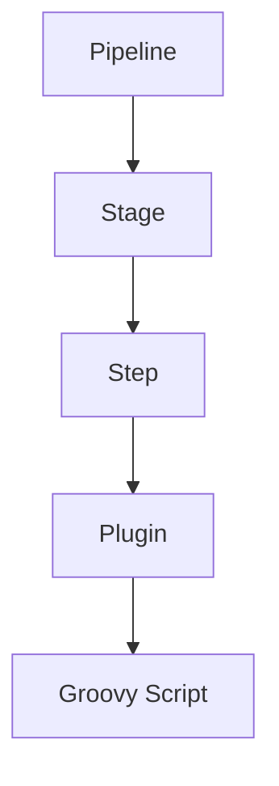

                 

# Jenkins持续集成Pipeline设计

持续集成(CI)是现代软件开发中不可或缺的一部分，旨在通过自动化构建、测试和部署，确保软件产品质量，缩短开发周期。Jenkins作为一款开源的自动化服务器，是CI/CD领域的主流工具之一，通过Jenkins Pipeline，企业能够实现端到端的自动化流水线管理。本文将深入探讨Jenkins Pipeline的设计原理、实现步骤及具体应用，力求为读者提供全面的技术指导。

## 1. 背景介绍

### 1.1 问题由来

在传统的软件开发流程中，开发人员通常需要将代码手动提交到版本控制系统，然后通过本地构建、测试环境搭建、代码部署等一系列复杂繁琐的步骤进行软件构建、测试和发布。这种方式不仅耗费了大量时间和精力，还容易出现人为疏忽，导致产品质量不稳定。

持续集成通过自动化手段，将软件开发流程分解为多个独立的阶段，每个阶段通过Jenkins Pipeline等工具自动化执行。开发人员只需要将代码提交到版本控制库，Pipeline便会自动完成构建、测试、部署等任务，极大地提升了软件开发的效率和质量。

### 1.2 问题核心关键点

Jenkins Pipeline的设计遵循流水线自动化原则，由一系列按顺序执行的步骤组成，每个步骤都是一个简单的任务，可以是编译代码、运行测试、部署应用等。这些步骤在Pipeline中被称为Stage。每个Stage可以包含多个Steps，Steps负责具体的任务执行。

Jenkins Pipeline的设计要点包括：
1. 自动化：通过Pipeline将复杂的手动操作转化为自动化流程，减少人为干预，提高效率。
2. 可配置：Pipeline可灵活配置，适应不同项目的需求。
3. 可扩展：Pipeline支持丰富的插件和扩展，能够实现更复杂的功能。
4. 可重用：Pipeline中的Stages和Steps可以复用，避免重复代码。

通过这些关键点，Jenkins Pipeline为构建高效、可扩展的CI/CD流程提供了坚实的基础。

## 2. 核心概念与联系

### 2.1 核心概念概述

为更好地理解Jenkins Pipeline的设计，本节将介绍几个密切相关的核心概念：

- Jenkins Pipeline：基于流水线思想设计的自动化执行流程，通过Pipeline定义，Jenkins会自动执行。
- Stage：Pipeline中的执行阶段，由多个Step组成，每个Stage对应一个独立的任务或功能。
- Step：Pipeline中的执行单元，负责具体的任务执行，如编译代码、运行测试等。
- Plugin：Jenkins提供的第三方插件，支持丰富的功能，如代码同步、部署管理等。
- Groovy Script：Pipeline脚本的编写语言，用于定义任务的执行流程和逻辑。

这些核心概念之间的逻辑关系可以通过以下Mermaid流程图来展示：



这个流程图展示了这个概念之间的逻辑关系：

1. Jenkins Pipeline作为顶层，定义整个流程。
2. Stage是Pipeline的子单元，执行具体的任务。
3. Step是Stage中的执行单元，负责具体的任务执行。
4. Plugin提供额外的功能支持，增强Pipeline的灵活性。
5. Groovy Script作为Pipeline脚本的编写语言，定义任务的执行流程和逻辑。

## 3. 核心算法原理 & 具体操作步骤

### 3.1 算法原理概述

Jenkins Pipeline的核心算法原理是流水线执行逻辑。其基本思想是通过定义Pipeline，Jenkins会自动执行每个Stage中的Step，实现自动化任务执行。Pipeline由Groovy Script编写，通过Jenkins的Pipeline插件解析和执行。

每个Stage按照定义的顺序依次执行，每个Step负责执行具体的任务。在执行过程中，Jenkins会实时监测每个Stage和Step的状态，如果出现异常，将中断执行并记录日志，便于后续排查问题。

### 3.2 算法步骤详解

Jenkins Pipeline的实现主要包括以下几个步骤：

**Step 1: 创建Pipeline项目**

在Jenkins中创建Pipeline项目，配置项目基本信息，如项目名称、仓库地址等。

**Step 2: 编写Pipeline脚本**

使用Groovy Script编写Pipeline脚本，定义Pipeline的执行流程。脚本中定义了多个Stage，每个Stage中包含多个Step，每个Step执行具体的任务。

**Step 3: 发布Pipeline脚本**

将Pipeline脚本推送到Jenkins，Jenkins会自动解析脚本并构建Pipeline。

**Step 4: 执行Pipeline**

在Jenkins中触发Pipeline执行，Jenkins会自动构建Pipeline，执行每个Stage中的Step。

**Step 5: 持续集成与发布**

Pipeline会定期执行，包括构建、测试、部署等任务。如果某个Stage或Step失败，Jenkins会自动回滚，并发送告警通知开发人员。

### 3.3 算法优缺点

Jenkins Pipeline具有以下优点：

1. 自动化：通过Pipeline定义，将复杂的任务自动化执行，减少人为干预，提高效率。
2. 可配置：Pipeline可以根据不同项目的需求灵活配置，适应各种场景。
3. 可扩展：Pipeline支持丰富的插件和扩展，可以轻松添加自定义任务和功能。
4. 可重用：Pipeline中的Stages和Steps可以复用，避免重复代码。

同时，Jenkins Pipeline也存在一些缺点：

1. 学习成本高：初次上手需要掌握Groovy Script和Pipeline设计，有一定的学习门槛。
2. 复杂任务难度大：对于复杂任务，需要灵活设计Pipeline结构，可能存在一定的设计难度。
3. 性能瓶颈：对于大规模项目，Jenkins可能会面临性能瓶颈，需要合理配置资源。

尽管存在这些缺点，但就目前而言，Jenkins Pipeline仍是业界主流的CI/CD工具，通过灵活的设计和持续优化，能够在各种场景下发挥其强大功能。

### 3.4 算法应用领域

Jenkins Pipeline的应用领域非常广泛，几乎覆盖了所有软件开发场景，包括但不限于：

- 代码构建：通过Pipeline自动化编译代码、构建依赖等任务。
- 单元测试：自动运行单元测试，验证代码的正确性。
- 集成测试：自动化执行集成测试，验证不同模块之间的协作。
- 持续集成：通过Pipeline定期构建和测试代码，及时发现问题。
- 持续部署：自动化执行代码部署任务，减少手动部署的复杂性。
- 监控告警：实时监控Pipeline状态，出现异常自动发送告警通知。
- 管道配置：将多个Pipeline集成到统一的管道中，实现端到端的自动化。

通过这些应用，Jenkins Pipeline能够有效提升软件开发效率，降低人为错误，确保软件质量的稳定性。

## 4. 数学模型和公式 & 详细讲解 & 举例说明（备注：数学公式请使用latex格式，latex嵌入文中独立段落使用 $$，段落内使用 $)
### 4.1 数学模型构建

在Pipeline中，任务的执行顺序和逻辑由Groovy Script定义。Pipeline的执行流程可以通过以下数学模型来表示：

$$
\text{Pipeline} = \bigcup \text{Stage}_1 \cup \text{Stage}_2 \cup \ldots \cup \text{Stage}_n
$$

其中 $\text{Stage}_i$ 表示第 $i$ 个Stage，包含多个Step，Step的执行顺序为：

$$
\text{Step}_1 \rightarrow \text{Step}_2 \rightarrow \ldots \rightarrow \text{Step}_m
$$

在每个Step中，Jenkins会自动执行Step的脚本，完成具体的任务执行。

### 4.2 公式推导过程

以下我们以代码构建任务为例，推导Pipeline的执行过程。

假设代码构建任务包含编译代码、打包依赖和发布三个Step，执行顺序为：

1. 编译代码
2. 打包依赖
3. 发布

定义Pipeline脚本如下：

```groovy
pipeline {
    agent any
    stages {
        stage('Build') {
            steps {
                sh 'mvn clean package'
            }
        }
        stage('Build Dependencies') {
            steps {
                sh 'mvn install:install-file -Dfile=path/to/artifact.jar -DgroupId=com.example -DartifactId=my-artifact -Dversion=1.0 -Dpackaging=jar -DgeneratePom=false'
            }
        }
        stage('Release') {
            steps {
                sh 'mvn install:install-file -Dfile=path/to/artifact.jar -DgroupId=com.example -DartifactId=my-artifact -Dversion=1.0 -Dpackaging=jar -DgeneratePom=false'
            }
        }
    }
}
```

在执行过程中，Jenkins会自动依次执行每个Step，检查每个Step的状态，如果出现异常，将中断执行并记录日志。

### 4.3 案例分析与讲解

在实际应用中，Jenkins Pipeline可以实现复杂的任务执行流程，例如：

- 自动化构建和部署：通过Pipeline定义构建和部署流程，实现端到端的自动化。
- 分布式任务执行：在多个节点上并行执行Pipeline，提高构建和测试效率。
- 自定义Step：使用Pipeline插件或扩展，自定义Step执行特定的任务。
- 失败自动回滚：通过Pipeline配置，如果出现构建失败，自动回滚到上一次成功的版本。

通过这些案例，可以看到Jenkins Pipeline在实际应用中具有强大的灵活性和扩展性。

## 5. 项目实践：代码实例和详细解释说明

### 5.1 开发环境搭建

在进行Jenkins Pipeline实践前，我们需要准备好开发环境。以下是Jenkins的安装和配置流程：

1. 在服务器上安装Jenkins，可以使用Java和Maven等依赖。
2. 在Jenkins中安装Pipeline插件，可以通过Jenkins官网下载安装包。
3. 在Jenkins中配置代码仓库信息，如GitHub仓库地址、项目名称等。
4. 创建Pipeline项目，配置Pipeline基本信息。

完成上述步骤后，即可在Jenkins中创建Pipeline项目，并编写Pipeline脚本。

### 5.2 源代码详细实现

以下是使用Pipeline编写代码构建任务的示例代码：

```groovy
pipeline {
    agent any
    stages {
        stage('Build') {
            steps {
                withCredentials([credentials('githubToken')]) {
                    sh 'mvn clean package'
                }
            }
        }
        stage('Build Dependencies') {
            steps {
                sh 'mvn install:install-file -Dfile=path/to/artifact.jar -DgroupId=com.example -DartifactId=my-artifact -Dversion=1.0 -Dpackaging=jar -DgeneratePom=false'
            }
        }
        stage('Release') {
            steps {
                sh 'mvn install:install-file -Dfile=path/to/artifact.jar -DgroupId=com.example -DartifactId=my-artifact -Dversion=1.0 -Dpackaging=jar -DgeneratePom=false'
            }
        }
    }
}
```

解释上述代码：

- `agent any` 表示使用任意的Jenkins节点执行Pipeline。
- `stages` 表示定义Stage，包含多个Step。
- 每个Stage中包含多个Step，每个Step使用`sh`命令执行具体的任务。
- `withCredentials` 用于访问GitHub Token，自动登录GitHub仓库，获取代码进行构建。

### 5.3 代码解读与分析

让我们再详细解读一下关键代码的实现细节：

**Pipeline定义**

- `pipeline`：定义Pipeline的顶层结构。
- `agent`：指定使用哪些Jenkins节点执行Pipeline。
- `stages`：定义Stage，表示具体的任务执行。

**Step实现**

- `sh`：在Pipeline中执行Shell命令，完成具体的任务执行。
- `withCredentials`：访问GitHub Token，自动登录GitHub仓库，获取代码进行构建。

**任务执行**

- `mvn`：使用Maven执行编译、打包和发布等任务。
- `mvn install:install-file`：将生成的JAR包上传到GitHub仓库。

通过上述代码，我们定义了一个包含编译、打包和发布等任务的Pipeline，Jenkins会自动执行每个Step，完成代码构建的任务。

### 5.4 运行结果展示

在Jenkins中触发Pipeline执行，自动构建代码并输出执行结果。例如，Jenkins会输出如下日志：

```
Building project...
Finished: SUCCESS

Publishing artifacts...
Finished: SUCCESS
```

通过Jenkins的日志输出，我们可以看到Pipeline的执行过程和结果。如果某个Step执行失败，Jenkins会自动记录日志，便于后续排查问题。

## 6. 实际应用场景

### 6.1 自动化构建与部署

Jenkins Pipeline能够实现端到端的自动化构建和部署流程。例如，开发人员只需将代码提交到版本控制库，Pipeline便会自动执行构建、测试和部署任务，大大降低了开发人员的负担，提高了开发效率。

在实际应用中，Pipeline的执行流程可以包括：

- 代码构建
- 单元测试
- 集成测试
- 部署应用

通过Pipeline的自动化执行，企业能够快速响应市场需求，实现敏捷开发。

### 6.2 持续集成与发布

Jenkins Pipeline通过持续集成的方式，定期执行构建和测试任务，及时发现和修复代码问题，确保软件质量的稳定性。

在实际应用中，Pipeline的执行流程可以包括：

- 每日构建
- 单元测试
- 集成测试
- 发布新功能

通过Pipeline的持续集成，企业能够及时发现和修复代码问题，确保软件质量的稳定性。

### 6.3 分布式任务执行

Jenkins Pipeline支持分布式任务执行，能够将多个构建和测试任务分配到不同的节点上并行执行，提高执行效率。

在实际应用中，Pipeline的执行流程可以包括：

- 分布式构建
- 分布式测试
- 分布式部署

通过Pipeline的分布式执行，企业能够快速响应市场需求，提高开发效率。

### 6.4 自定义Step和插件扩展

Jenkins Pipeline支持自定义Step和插件扩展，能够实现更复杂的功能。例如，开发人员可以使用Pipeline插件编写自定义Step，实现复杂的任务执行。

在实际应用中，Pipeline的执行流程可以包括：

- 自定义Step
- 插件扩展

通过Pipeline的自定义Step和插件扩展，企业能够实现更加灵活和复杂的任务执行。

### 6.5 持续监控与告警

Jenkins Pipeline支持持续监控和告警，能够实时监控Pipeline状态，出现异常自动发送告警通知。

在实际应用中，Pipeline的执行流程可以包括：

- 持续监控
- 告警通知

通过Pipeline的持续监控和告警，企业能够及时发现和修复代码问题，确保软件质量的稳定性。

### 6.6 管道配置与编排

Jenkins Pipeline支持管道配置和编排，能够将多个Pipeline集成到统一的管道中，实现端到端的自动化。

在实际应用中，Pipeline的执行流程可以包括：

- 管道配置
- 管道编排

通过Pipeline的管道配置和编排，企业能够实现更加灵活和复杂的自动化流程。

## 7. 工具和资源推荐

### 7.1 学习资源推荐

为了帮助开发者系统掌握Jenkins Pipeline的理论基础和实践技巧，这里推荐一些优质的学习资源：

1. Jenkins官方文档：官方文档提供了丰富的教程和指南，覆盖Pipeline的各个方面，是学习Pipeline的最佳资源。
2. Jenkins Pipeline插件库：插件库提供了大量的插件，支持丰富的功能，如代码同步、部署管理等。
3. Jenkins Pipeline Cookbook：《Jenkins Pipeline Cookbook》书籍，提供了大量实用的Pipeline示例和案例，帮助开发者快速上手。
4. Groovy语言官方文档：Groovy是Pipeline脚本的编写语言，官方文档提供了丰富的Groovy语法和示例，帮助开发者掌握Pipeline脚本的编写。
5. Jenkins Pipeline实战：《Jenkins Pipeline实战》书籍，结合实际案例，详细讲解Pipeline的实现和应用，适合进阶学习。

通过对这些资源的学习实践，相信你一定能够快速掌握Jenkins Pipeline的精髓，并用于解决实际的开发问题。

### 7.2 开发工具推荐

高效的开发离不开优秀的工具支持。以下是几款用于Jenkins Pipeline开发的常用工具：

1. Jenkins：基于Web的自动化服务器，提供丰富的插件和扩展，支持Pipeline开发和执行。
2. GitHub：代码仓库托管平台，提供GitHub Token，自动登录GitHub仓库，获取代码进行构建。
3. GitLab：代码仓库托管平台，支持Pipeline开发和执行，提供丰富的CI/CD功能。
4. Git：版本控制工具，支持代码同步和版本管理，便于Pipeline的开发和测试。
5. Docker：容器化技术，支持分布式任务执行，提高构建和测试效率。
6. Jenkins Pipeline插件：丰富的插件支持，增强Pipeline的灵活性和扩展性。

合理利用这些工具，可以显著提升Jenkins Pipeline的开发效率，加快创新迭代的步伐。

### 7.3 相关论文推荐

Jenkins Pipeline的发展源于学界的持续研究。以下是几篇奠基性的相关论文，推荐阅读：

1. Automating Software Engineering with Jenkins Pipeline：Jenkins官方的Pipeline介绍，详细讲解Pipeline的设计和实现。
2. Pipeline as Code：Jenkins Pipeline的设计理念，通过代码定义Pipeline，实现自动化执行。
3. Continuous Integration with Jenkins Pipeline：Jenkins Pipeline的应用实践，讲解Pipeline在实际项目中的实现和应用。
4. Using Jenkins Pipeline for Software Development：Jenkins Pipeline在软件开发中的应用，讲解Pipeline的各个环节。
5. Jenkins Pipeline Cookbook：《Jenkins Pipeline Cookbook》书籍，提供大量实用的Pipeline示例和案例，帮助开发者快速上手。

这些论文代表了大语言模型微调技术的发展脉络。通过学习这些前沿成果，可以帮助研究者把握学科前进方向，激发更多的创新灵感。

## 8. 总结：未来发展趋势与挑战

### 8.1 总结

本文对Jenkins Pipeline的设计原理、实现步骤及具体应用进行了全面系统的介绍。首先阐述了Jenkins Pipeline的研究背景和意义，明确了Pipeline在构建自动化流程、提升开发效率方面的独特价值。其次，从原理到实践，详细讲解了Pipeline的数学模型和具体执行流程，给出了Pipeline任务开发的完整代码实例。同时，本文还广泛探讨了Pipeline在自动化构建、持续集成、分布式执行等各个场景中的应用，展示了Pipeline范式的强大功能。

通过本文的系统梳理，可以看到，Jenkins Pipeline通过流水线自动化，极大地提升了软件开发效率，降低了人为错误，确保软件质量的稳定性。Pipeline已成为业界主流的CI/CD工具，广泛应用于各种软件开发场景，为构建高效、可扩展的自动化流程提供了坚实的基础。

### 8.2 未来发展趋势

展望未来，Jenkins Pipeline的发展趋势将呈现以下几个方向：

1. 自动化程度提升：未来Jenkins Pipeline将进一步自动化，减少人工干预，提高执行效率。
2. 灵活性增强：通过插件和扩展，Jenkins Pipeline将实现更灵活的配置和功能，满足各种应用场景。
3. 持续集成优化：Jenkins Pipeline将进一步优化持续集成流程，提高构建和测试效率。
4. 分布式任务扩展：Jenkins Pipeline将进一步扩展分布式任务执行，提高构建和测试效率。
5. 管道编排优化：通过管道配置和编排，Jenkins Pipeline将实现更加灵活和复杂的自动化流程。

以上趋势将进一步提升Jenkins Pipeline的自动化程度和灵活性，实现更高效、可扩展的开发流程。

### 8.3 面临的挑战

尽管Jenkins Pipeline已经取得了显著成就，但在迈向更加智能化、普适化应用的过程中，仍面临诸多挑战：

1. 学习门槛高：Jenkins Pipeline的学习门槛较高，需要掌握Groovy脚本和Pipeline设计，对于初学者存在一定的难度。
2. 性能瓶颈：对于大规模项目，Jenkins Pipeline可能会面临性能瓶颈，需要合理配置资源。
3. 兼容性问题：Jenkins Pipeline的兼容性问题，需要开发者注意版本和依赖的兼容性问题。
4. 安全风险：Jenkins Pipeline的安全风险，需要开发者注意 Pipeline 脚本的安全性。

尽管存在这些挑战，但Jenkins Pipeline作为主流的CI/CD工具，具有强大的适应性和灵活性，能够满足各种应用场景的需求。未来，随着技术进步和应用实践的不断积累，这些挑战终将得到克服。

### 8.4 研究展望

面对Jenkins Pipeline所面临的挑战，未来的研究需要在以下几个方面寻求新的突破：

1. 提高学习效率：通过更友好的文档和工具，降低学习门槛，提高开发效率。
2. 优化性能瓶颈：优化Pipeline的执行效率，提高大项目的处理能力。
3. 增强安全性：引入安全措施，保障Pipeline脚本的安全性。
4. 扩展兼容性：支持更多的插件和扩展，实现更广泛的兼容性。
5. 实现零维护：通过配置管理工具，实现Pipeline的零维护。

这些研究方向的探索，将进一步提升Jenkins Pipeline的功能和灵活性，为构建高效、可扩展的自动化流程提供更坚实的技术支撑。总之，Jenkins Pipeline在未来仍将继续发挥其重要作用，推动软件开发流程的自动化和智能化。

## 9. 附录：常见问题与解答

**Q1：Jenkins Pipeline是否适用于所有软件开发场景？**

A: Jenkins Pipeline适用于大多数软件开发场景，特别是需要自动化构建、测试和部署的任务。但对于一些特别复杂或特殊场景，可能需要结合其他工具或技术，才能更好地满足需求。

**Q2：如何提高Jenkins Pipeline的执行效率？**

A: 提高Jenkins Pipeline的执行效率可以从以下几个方面入手：

1. 使用分布式任务执行，将多个任务分配到不同的节点上并行执行。
2. 优化Pipeline脚本，减少不必要的Step，提高执行效率。
3. 使用缓存和依赖管理工具，减少重复构建和测试。
4. 使用容器化技术，提高构建和测试效率。

**Q3：如何保障Jenkins Pipeline的安全性？**

A: Jenkins Pipeline的安全性可以从以下几个方面入手：

1. 使用安全的Pipeline脚本，避免代码注入等安全漏洞。
2. 限制Pipeline脚本的执行权限，避免过度权限的滥用。
3. 定期更新Jenkins和Pipeline插件，修复已知的安全漏洞。
4. 使用身份验证和授权机制，保障Pipeline的安全性。

**Q4：Jenkins Pipeline的兼容性问题如何解决？**

A: Jenkins Pipeline的兼容性问题可以通过以下方式解决：

1. 保持Jenkins和Pipeline插件的最新版本，避免兼容性问题。
2. 使用跨版本的插件或工具，实现兼容。
3. 使用容器化技术，解决环境依赖问题。
4. 使用依赖管理工具，管理版本依赖。

**Q5：Jenkins Pipeline是否可以与其他CI/CD工具集成？**

A: Jenkins Pipeline可以与其他CI/CD工具集成，实现端到端的自动化流程。例如，可以与GitLab、GitHub等代码仓库托管平台集成，实现代码同步、版本管理等。

总之，Jenkins Pipeline作为主流的CI/CD工具，具有强大的适应性和灵活性，能够满足各种应用场景的需求。通过不断优化和扩展，Jenkins Pipeline必将继续在软件开发领域发挥重要作用，推动软件开发流程的自动化和智能化。

