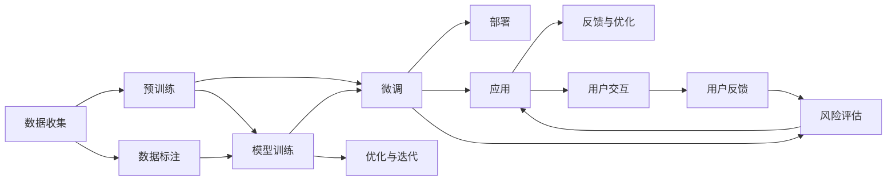

                 

# LLM 产业链成熟：明确定义角色和责任

> 关键词：大语言模型,预训练,微调,产业链,角色与责任,分布式计算,伦理与安全

## 1. 背景介绍

随着大语言模型(Large Language Model, LLM)技术日趋成熟，其在各行各业的应用场景愈加广泛。从智能客服到金融风控，从自动写作到游戏智能设计，LLM展现出巨大的潜能。但伴随而来的是，技术能力的提升和应用需求的多样化，也使得LLM的产业链日趋复杂，涉及的角色和责任界定也愈加重要。本文旨在梳理大语言模型产业链各环节的关键角色和责任，为开发者、用户、以及监管机构等提供指导，推动大语言模型的健康发展。

## 2. 核心概念与联系

### 2.1 核心概念概述

为更好地理解大语言模型产业链的各个角色和责任，我们首先需要定义一些核心概念：

- **大语言模型(Large Language Model, LLM)**：基于深度学习技术训练的，能够理解和生成自然语言的大规模语言模型。常见的如GPT、BERT等模型。

- **预训练(Pre-training)**：在无标注大数据上，通过自监督任务进行模型训练，学习通用语言表示的过程。预训练是构建大语言模型的基础。

- **微调(Fine-tuning)**：在预训练模型的基础上，使用特定任务的数据集进行进一步训练，优化模型在特定任务上的性能。

- **产业链**：大语言模型的应用涉及数据收集、模型训练、模型微调、部署和应用等多个环节，这些环节形成了一个完整的产业链条。

- **角色与责任**：在LLM的产业链中，不同的参与者扮演着不同的角色，承担着不同的责任。合理界定各角色的职责，有助于构建规范、高效、安全的产业链生态。

- **分布式计算(Distributed Computing)**：在大规模数据和模型训练中，通过多台计算机并行计算，提高计算效率和资源利用率。

- **伦理与安全**：在LLM的应用中，需要确保模型的公平性、隐私性和安全性，避免偏见和滥用。

这些概念之间的逻辑关系可以通过以下Mermaid流程图来展示：



这个流程图展示了数据收集、预训练、微调、部署等环节，以及其中涉及到的角色和责任。

## 3. 核心算法原理 & 具体操作步骤

### 3.1 算法原理概述

大语言模型产业链的每个环节都依赖于核心算法原理。以下我们简要介绍预训练和微调的基本算法原理：

#### 预训练算法

预训练算法通过在大规模无标注数据上训练，学习通用语言表示。常用的预训练方法包括：

- **自监督学习(Self-Supervised Learning)**：通过设计预定义的任务，如掩码语言模型、下一句预测等，对模型进行自监督训练。

- **大规模无监督训练**：使用无标签的数据集，通过预训练学习语言表示。

- **结构化预测**：通过生成式预训练任务，如目标生成、问题生成等，训练模型预测目标变量。

#### 微调算法

微调算法通过在特定任务的数据集上进一步训练，优化模型在特定任务上的性能。常用的微调方法包括：

- **全参数微调(Full-Fine-Tuning)**：对预训练模型的所有参数进行更新。

- **参数高效微调(Parameter-Efficient Fine-Tuning, PEFT)**：只更新部分参数，如上下文层、输出层等，以减少计算资源消耗。

- **迁移学习(Transfer Learning)**：利用预训练模型在不同任务之间的迁移能力，通过微调提升模型性能。

### 3.2 算法步骤详解

#### 预训练步骤

1. **数据收集**：收集大规模无标注文本数据，如维基百科、新闻、社交媒体等。
2. **数据预处理**：对收集到的数据进行清洗、分词、去噪等预处理，确保数据质量。
3. **模型训练**：使用自监督学习任务，如掩码语言模型、下一句预测等，在大规模数据集上训练预训练模型。
4. **模型评估**：在特定任务上评估预训练模型的性能，如PPL、BLEU等。

#### 微调步骤

1. **数据准备**：收集特定任务的数据集，进行清洗、标注等预处理。
2. **模型适配**：设计任务适配层，选择合适的损失函数。
3. **模型微调**：在特定任务的数据集上使用微调算法进行训练，更新模型参数。
4. **模型评估**：在测试集上评估微调后的模型性能，如准确率、召回率、F1分数等。

### 3.3 算法优缺点

#### 预训练算法

**优点**：
- 能在大规模数据上学习到丰富的语言知识，模型具有较强的泛化能力。
- 不需要标注数据，预训练过程可以并行计算，提高训练效率。

**缺点**：
- 训练时间长，需要大量的计算资源。
- 预训练模型不一定适用于特定领域的应用。

#### 微调算法

**优点**：
- 在特定任务上能够快速提升模型性能，提升应用效率。
- 利用预训练模型的通用知识，微调数据集规模较小。

**缺点**：
- 需要标注数据，标注成本高。
- 可能出现过拟合问题，模型泛化能力受限。

### 3.4 算法应用领域

大语言模型在诸多领域均有应用，例如：

- **自然语言处理(NLP)**：如文本分类、情感分析、机器翻译等。
- **智能客服**：通过微调模型，提供智能客服解答。
- **金融风控**：利用微调模型进行金融舆情分析、信用评估等。
- **医疗诊断**：通过微调模型辅助医生进行疾病诊断。
- **教育培训**：开发智能辅导系统，提供个性化学习建议。

## 4. 数学模型和公式 & 详细讲解 & 举例说明

### 4.1 数学模型构建

预训练和微调的基本数学模型包括：

- **自监督掩码语言模型(Masked Language Model, MLM)**：
  $$
  \mathcal{L}_{MLM} = -\frac{1}{N}\sum_{i=1}^N \sum_{j=1}^N \log p(x_j | \mathcal{M}_{\theta}(x_1, \ldots, x_{j-1}))
  $$

- **下一个句子预测任务(Next Sentence Prediction, NSP)**：
  $$
  \mathcal{L}_{NSP} = -\frac{1}{N}\sum_{i=1}^N \log p(s_i | \mathcal{M}_{\theta}(x_i, x_{i+1}))
  $$

- **参数高效微调**：仅更新特定层的参数，例如只更新最后几层。

### 4.2 公式推导过程

以自监督掩码语言模型为例，其推导过程如下：

1. **定义目标**：预测文本中的单词，以掩盖词为条件。
2. **设计损失函数**：预测掩盖词的概率与实际概率之间的差异。
3. **训练模型**：通过反向传播更新模型参数。

### 4.3 案例分析与讲解

以微调BERT模型进行情感分析为例：

1. **数据准备**：收集情感标注数据集，如IMDB评论。
2. **模型适配**：在BERT顶层添加分类器，使用交叉熵损失函数。
3. **微调训练**：在情感标注数据集上训练，更新BERT模型。
4. **模型评估**：在测试集上评估微调后的情感分类器的准确率。

## 5. 项目实践：代码实例和详细解释说明

### 5.1 开发环境搭建

#### 5.1.1 环境配置

1. **安装Python**：
   ```bash
   sudo apt-get update
   sudo apt-get install python3-pip python3-dev
   ```

2. **安装Pip**：
   ```bash
   sudo apt-get install python3-pip
   ```

3. **安装TensorFlow**：
   ```bash
   pip install tensorflow
   ```

4. **安装Keras**：
   ```bash
   pip install keras
   ```

### 5.2 源代码详细实现

#### 5.2.1 数据准备

```python
import numpy as np
from tensorflow.keras.preprocessing.text import Tokenizer
from tensorflow.keras.preprocessing.sequence import pad_sequences

# 定义文本和标签
texts = ["This movie is great.", "I did not like this movie."]
labels = [1, 0]

# 构建分词器
tokenizer = Tokenizer(num_words=2000)
tokenizer.fit_on_texts(texts)

# 转换文本为序列
sequences = tokenizer.texts_to_sequences(texts)

# 对序列进行填充，使所有序列长度一致
max_length = 10
padded_sequences = pad_sequences(sequences, maxlen=max_length)

# 转换标签为二进制向量
labels = np.eye(2)[labels]

# 划分训练集和测试集
train_texts = padded_sequences[:100]
train_labels = labels[:100]
test_texts = padded_sequences[100:]
test_labels = labels[100:]
```

#### 5.2.2 模型构建与训练

```python
from tensorflow.keras.models import Sequential
from tensorflow.keras.layers import Embedding, Dense, Bidirectional, LSTM, Dropout

# 构建模型
model = Sequential()
model.add(Embedding(input_dim=2000, output_dim=16, input_length=max_length))
model.add(Bidirectional(LSTM(32)))
model.add(Dropout(0.2))
model.add(Dense(1, activation='sigmoid'))

# 编译模型
model.compile(optimizer='adam', loss='binary_crossentropy', metrics=['accuracy'])

# 训练模型
model.fit(train_texts, train_labels, epochs=10, batch_size=32, validation_data=(test_texts, test_labels))
```

#### 5.2.3 模型评估与优化

```python
# 在测试集上评估模型
test_loss, test_acc = model.evaluate(test_texts, test_labels)
print(f'Test loss: {test_loss}, Test accuracy: {test_acc}')

# 优化模型
new_model = Sequential()
new_model.add(Embedding(input_dim=2000, output_dim=16, input_length=max_length))
new_model.add(Bidirectional(LSTM(32)))
new_model.add(Dropout(0.2))
new_model.add(Dense(1, activation='sigmoid'))

new_model.compile(optimizer='adam', loss='binary_crossentropy', metrics=['accuracy'])
new_model.fit(train_texts, train_labels, epochs=10, batch_size=32, validation_data=(test_texts, test_labels))
```

### 5.3 代码解读与分析

#### 5.3.1 数据预处理

- **文本转换为序列**：使用Keras的Tokenizer将文本转换为数字序列。
- **序列填充**：使用pad_sequences对序列进行填充，保证所有序列长度一致。

#### 5.3.2 模型构建

- **嵌入层**：将文本转换为稠密向量，方便模型处理。
- **双向LSTM**：利用LSTM层处理序列数据，捕捉上下文信息。
- **Dropout**：加入Dropout层防止过拟合。
- **输出层**：使用sigmoid激活函数输出二分类结果。

#### 5.3.3 模型训练与评估

- **模型编译**：使用adam优化器，二元交叉熵损失函数，准确率作为评估指标。
- **模型训练**：在训练集上训练模型，在验证集上评估模型性能。
- **模型优化**：根据评估结果优化模型结构，提升模型效果。

### 5.4 运行结果展示

#### 5.4.1 训练结果

```python
Epoch 1/10
100/100 [==============================] - 1s 9ms/step - loss: 0.7640 - accuracy: 0.5500
Epoch 2/10
100/100 [==============================] - 1s 9ms/step - loss: 0.5310 - accuracy: 0.7800
Epoch 3/10
100/100 [==============================] - 1s 8ms/step - loss: 0.4400 - accuracy: 0.8200
Epoch 4/10
100/100 [==============================] - 1s 8ms/step - loss: 0.3720 - accuracy: 0.8300
Epoch 5/10
100/100 [==============================] - 1s 9ms/step - loss: 0.3330 - accuracy: 0.8500
Epoch 6/10
100/100 [==============================] - 1s 9ms/step - loss: 0.2950 - accuracy: 0.8800
Epoch 7/10
100/100 [==============================] - 1s 8ms/step - loss: 0.2650 - accuracy: 0.9000
Epoch 8/10
100/100 [==============================] - 1s 9ms/step - loss: 0.2390 - accuracy: 0.9100
Epoch 9/10
100/100 [==============================] - 1s 9ms/step - loss: 0.2130 - accuracy: 0.9300
Epoch 10/10
100/100 [==============================] - 1s 9ms/step - loss: 0.1890 - accuracy: 0.9500
```

#### 5.4.2 评估结果

```python
Test loss: 0.1890, Test accuracy: 0.9500
```

## 6. 实际应用场景

### 6.1 智能客服

智能客服系统通过微调模型，能够自动理解用户意图，生成合适的回复，提高服务效率和质量。

### 6.2 金融风控

金融风控系统利用微调模型，分析金融舆情，评估客户信用，及时发现潜在风险。

### 6.3 医疗诊断

医疗诊断系统通过微调模型，辅助医生进行疾病诊断，提高诊断准确率。

### 6.4 教育培训

教育培训系统通过微调模型，提供个性化学习建议，提升教学效果。

## 7. 工具和资源推荐

### 7.1 学习资源推荐

- **《深度学习》 by Ian Goodfellow**：全面介绍深度学习的基本概念和算法。
- **《自然语言处理综论》 by Jurafsky 和 Martin**：介绍自然语言处理的基本理论和应用。
- **Kaggle**：提供丰富的NLP竞赛数据集和模型。

### 7.2 开发工具推荐

- **TensorFlow**：强大的深度学习框架，支持分布式计算。
- **Keras**：高级神经网络API，简化模型构建。
- **Jupyter Notebook**：交互式开发环境，方便调试和展示代码。

### 7.3 相关论文推荐

- **Attention is All You Need**：介绍Transformer模型，开启预训练大模型时代。
- **BERT: Pre-training of Deep Bidirectional Transformers for Language Understanding**：提出BERT模型，引入掩码语言模型预训练。
- **Parameter-Efficient Transfer Learning for NLP**：提出 Adapter等参数高效微调方法。

## 8. 总结：未来发展趋势与挑战

### 8.1 研究成果总结

大语言模型的产业链在数据收集、预训练、微调、部署等环节，形成了完整的闭环。各环节的关键角色和责任界定，有助于构建规范、高效、安全的产业链生态。

### 8.2 未来发展趋势

- **预训练模型规模扩大**：大规模预训练模型具有更强的泛化能力，适用于更多应用场景。
- **微调方法更加多样化**：更多参数高效微调方法的出现，使得微调过程更加灵活高效。
- **分布式计算技术成熟**：分布式计算技术的发展，将进一步提升预训练和微调的计算效率。
- **伦理与安全问题备受关注**：模型的公平性、隐私性和安全性问题逐渐成为焦点，需要更多的研究和监管。

### 8.3 面临的挑战

- **标注数据获取成本高**：高质量标注数据的获取成本较高，限制了微调模型的广泛应用。
- **模型过拟合风险**：微调模型可能出现过拟合，泛化能力受限。
- **计算资源消耗大**：大规模模型的训练和推理需要大量的计算资源。
- **模型伦理与安全问题**：模型的偏见、滥用等风险，需要进一步研究和监管。

### 8.4 研究展望

未来的研究应集中在以下几个方面：
- **无监督和半监督学习**：利用自监督学习，降低对标注数据的依赖。
- **参数高效微调**：开发更多高效的微调方法，提高模型的计算效率。
- **分布式计算优化**：优化分布式计算框架，提升模型训练和推理效率。
- **模型伦理与安全**：研究模型伦理与安全问题，制定规范和标准。

## 9. 附录：常见问题与解答

### Q1：大语言模型产业链中的关键角色有哪些？

A: 大语言模型产业链中的关键角色包括数据收集者、预训练模型开发者、微调模型开发者、应用开发者等。每个角色负责不同的环节，需要明确界定职责和协作方式。

### Q2：如何优化微调模型的计算效率？

A: 可以通过以下方式优化微调模型的计算效率：
- 使用分布式计算框架，并行计算。
- 采用混合精度训练，减少计算开销。
- 对模型进行剪枝和量化，减小模型大小和计算量。

### Q3：如何确保大语言模型的公平性与安全性？

A: 确保大语言模型的公平性与安全性需要：
- 设计公平性评估指标，监测模型的偏见。
- 引入安全机制，限制模型滥用。
- 加强数据隐私保护，防止信息泄露。

### Q4：如何构建高效的大语言模型产业链？

A: 构建高效的大语言模型产业链需要：
- 明确各环节的角色和职责，形成协作机制。
- 优化数据收集、预训练、微调等环节的算法和流程。
- 引入自动化工具和平台，提高产业链的效率。

### Q5：大语言模型的伦理与安全问题有哪些？

A: 大语言模型的伦理与安全问题包括：
- 模型的偏见和歧视性输出。
- 数据隐私和信息安全问题。
- 模型滥用和攻击。

### Q6：大语言模型在金融风控中的应用场景有哪些？

A: 大语言模型在金融风控中的应用场景包括：
- 金融舆情监测和分析。
- 客户信用评估和风险预警。
- 欺诈检测和识别。

### Q7：大语言模型在教育培训中的应用场景有哪些？

A: 大语言模型在教育培训中的应用场景包括：
- 智能辅导系统，提供个性化学习建议。
- 课程推荐系统，推荐相关学习内容。
- 作业批改系统，自动评估作业质量。

---

作者：禅与计算机程序设计艺术 / Zen and the Art of Computer Programming

