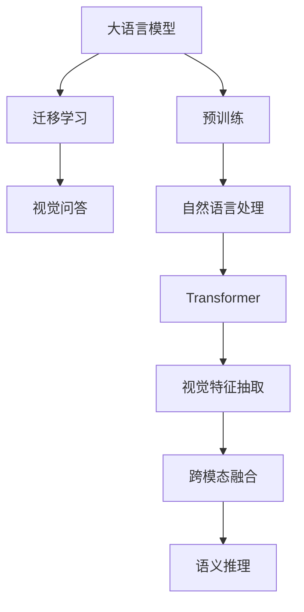

                 

# LLM在视觉问答任务上的表现分析

> 关键词：视觉问答,大语言模型,预训练,迁移学习,自然语言处理(NLP),Transformer,BERT,算法优化

## 1. 背景介绍

### 1.1 问题由来
视觉问答（Visual Question Answering, VQA）是近年来人工智能研究的热点领域，旨在让机器能够理解图像并基于视觉信息回答问题。其核心挑战在于如何结合图像特征与自然语言信息，进行语义理解和推理。视觉问答技术在自动驾驶、医疗诊断、智能客服等场景中具有广泛的应用前景。

传统的视觉问答方法主要依赖于图像识别和自然语言理解两个独立的技术栈，难以实现语义一致性和跨模态融合。近年来，随着预训练大语言模型（LLM）的兴起，结合深度视觉特征抽取和语言理解能力，构建跨模态的视觉问答系统成为可能。这种新范式在多个视觉问答数据集上取得了显著的性能提升。

### 1.2 问题核心关键点
视觉问答系统的核心挑战在于如何将视觉特征和自然语言信息有效结合，以及如何实现语义理解与推理。当前流行的解决方案是结合预训练大语言模型和深度视觉模型，进行跨模态的特征融合。预训练大语言模型通过在海量无标签文本上自监督学习，获取了强大的语言理解能力；深度视觉模型通过在标注数据上进行监督学习，获取了良好的图像特征抽取能力。两者结合后，可以构建出强大的跨模态视觉问答系统。

本论文聚焦于使用大语言模型在视觉问答任务上的表现，探索预训练-微调范式下的跨模态融合策略，并对不同模型架构进行优化和比较。我们将在视觉问答任务上，展示大语言模型结合深度视觉模型的优势，并分析其性能提升机制和优化策略。

## 2. 核心概念与联系

### 2.1 核心概念概述

为了深入理解大语言模型在视觉问答任务上的表现，本节将介绍几个核心概念及其相互关系：

- **大语言模型（Large Language Model, LLM）**：以自回归（如GPT）或自编码（如BERT）模型为代表的大规模预训练语言模型。通过在大规模无标签文本语料上进行预训练，学习通用的语言表示，具备强大的语言理解和生成能力。

- **预训练（Pre-training）**：指在大规模无标签文本语料上，通过自监督学习任务训练通用语言模型的过程。常见的预训练任务包括言语建模、遮挡语言模型等。预训练使得模型学习到语言的通用表示。

- **迁移学习（Transfer Learning）**：指将一个领域学习到的知识，迁移应用到另一个不同但相关的领域的学习范式。视觉问答可以看作是将预训练语言模型知识迁移到视觉语义推理任务中。

- **自然语言处理（NLP）**：涉及计算机对人类语言进行理解、处理和生成的一系列技术。视觉问答中的自然语言处理部分，包括语言理解、推理、生成等环节。

- **Transformer**：一种常用的深度学习模型架构，以自注意力机制为基础，能够在保持高并行性的同时实现高效的特征交互。

- **BERT**：一种基于Transformer的预训练语言模型，通过掩码语言模型和下一句子预测等任务，学习到丰富的语言知识。

- **视觉特征抽取**：通过深度卷积神经网络（CNN）等模型，对输入图像进行特征提取，得到低维的视觉特征向量。

- **跨模态融合**：将视觉特征和自然语言特征进行融合，构建跨模态语义表示，从而进行语义推理。

- **视觉问答**：将自然语言问题与图像作为输入，模型输出对应的答案，涉及到语言理解、图像理解与推理等多个环节。

这些核心概念之间的逻辑关系可以通过以下Mermaid流程图来展示：



这个流程图展示了预训练大语言模型在视觉问答中的工作流程：首先通过预训练获得语言理解能力，然后将预训练知识迁移到视觉语义推理任务中，通过跨模态融合和语义推理，最终输出答案。

## 3. 核心算法原理 & 具体操作步骤
### 3.1 算法原理概述

大语言模型在视觉问答任务上的核心原理是将视觉信息与自然语言信息进行跨模态融合，通过深度学习模型学习出跨模态的语义表示，并在此基础上进行语义推理。其典型框架包括：

- **预训练大语言模型**：通过在大规模无标签文本数据上自监督学习，获取通用的语言表示。常用的预训练大语言模型有GPT-3、BERT、RoBERTa等。

- **深度视觉模型**：通过在标注数据集上监督学习，获取图像的视觉特征。常用的深度视觉模型有ResNet、Inception等。

- **跨模态融合**：通过将视觉特征和自然语言特征进行拼接、注意力机制等方式，构建跨模态的语义表示。常用的跨模态融合方法包括简单拼接、注意力机制等。

- **语义推理**：通过深度神经网络模型对跨模态语义表示进行推理，输出自然语言问题的答案。常用的推理模型有LSTM、GRU等。

### 3.2 算法步骤详解

大语言模型在视觉问答任务上的具体操作步骤包括以下几个关键步骤：

**Step 1: 准备预训练模型和数据集**
- 选择合适的预训练语言模型 $M_{\theta}$ 作为初始化参数，如 BERT、GPT 等。
- 准备视觉问答任务的标注数据集 $D=\{(x_i,y_i)\}_{i=1}^N$，其中 $x_i$ 为图像，$y_i$ 为自然语言问题及其答案。

**Step 2: 添加任务适配层**
- 根据任务类型，在预训练模型顶层设计合适的输出层和损失函数。
- 对于分类任务，通常在顶层添加线性分类器和交叉熵损失函数。
- 对于生成任务，通常使用语言模型的解码器输出概率分布，并以负对数似然为损失函数。

**Step 3: 设置微调超参数**
- 选择合适的优化算法及其参数，如 AdamW、SGD 等，设置学习率、批大小、迭代轮数等。
- 设置正则化技术及强度，包括权重衰减、Dropout、Early Stopping等。
- 确定冻结预训练参数的策略，如仅微调顶层，或全部参数都参与微调。

**Step 4: 执行梯度训练**
- 将训练集数据分批次输入模型，前向传播计算损失函数。
- 反向传播计算参数梯度，根据设定的优化算法和学习率更新模型参数。
- 周期性在验证集上评估模型性能，根据性能指标决定是否触发 Early Stopping。
- 重复上述步骤直到满足预设的迭代轮数或 Early Stopping 条件。

**Step 5: 测试和部署**
- 在测试集上评估微调后模型 $M_{\hat{\theta}}$ 的性能，对比微调前后的精度提升。
- 使用微调后的模型对新样本进行推理预测，集成到实际的应用系统中。
- 持续收集新的数据，定期重新微调模型，以适应数据分布的变化。

以上是使用大语言模型在视觉问答任务上的一般流程。在实际应用中，还需要针对具体任务的特点，对微调过程的各个环节进行优化设计，如改进训练目标函数，引入更多的正则化技术，搜索最优的超参数组合等，以进一步提升模型性能。

### 3.3 算法优缺点

大语言模型在视觉问答任务上的优点包括：
1. 强大的语言理解能力：通过预训练获得的语言模型，具备强大的自然语言处理能力，能够理解和推理自然语言问题。
2. 跨模态融合能力强：可以方便地结合深度视觉模型，进行跨模态特征融合，构建出高维语义表示。
3. 泛化能力强：预训练模型经过大规模语料训练，具备较强的泛化能力，可以迁移到新的视觉问答任务中。

同时，该方法也存在一定的局限性：
1. 计算资源需求高：大语言模型和深度视觉模型需要高算力支持，对硬件资源要求较高。
2. 模型复杂度高：跨模态融合和语义推理过程较为复杂，模型结构庞大。
3. 训练成本高：需要大量标注数据进行微调，且微调过程中需要进行超参数调优。
4. 推理效率低：推理过程涉及视觉特征和自然语言特征的融合，计算量大，推理速度较慢。

尽管存在这些局限性，但就目前而言，基于大语言模型的视觉问答方法仍是目前最主流的技术范式，能够显著提升视觉问答任务的性能。

### 3.4 算法应用领域

大语言模型在视觉问答任务上的应用范围非常广泛，包括但不限于以下领域：

- 智能客服：利用视觉问答技术，构建智能客服系统，通过图像识别和自然语言理解，提供问题解答和推荐服务。
- 医疗诊断：结合医学图像和自然语言描述，辅助医生进行疾病诊断和治疗方案选择。
- 自动驾驶：通过摄像头和激光雷达获取环境信息，结合自然语言问题，提供驾驶决策支持。
- 智能家居：通过摄像头和环境传感器，结合自然语言指令，实现智能家居设备的控制和状态反馈。
- 安全监控：通过摄像头获取监控视频，结合自然语言描述，识别异常行为并进行报警。

除了上述这些经典应用外，大语言模型在视觉问答上的创新应用也在不断涌现，如基于视觉问答的情感分析、知识图谱构建、自动图像标注等，为人工智能技术带来了全新的突破。随着预训练模型和微调方法的不断进步，相信视觉问答技术将在更广阔的应用领域大放异彩。

## 4. 数学模型和公式 & 详细讲解 & 举例说明
### 4.1 数学模型构建

大语言模型在视觉问答任务上的数学模型可以表示为：

$$
M_{\theta}(x, q) = M_{L}(x, q)
$$

其中 $M_{\theta}$ 表示大语言模型，$x$ 表示输入图像，$q$ 表示自然语言问题，$M_{L}$ 表示跨模态融合和语义推理过程。

假设图像特征为 $x \in \mathbb{R}^{C\times H\times W}$，自然语言特征为 $q \in \mathbb{R}^{D}$，其中 $C$ 为通道数，$H$ 和 $W$ 为图像的高和宽。

### 4.2 公式推导过程

假设大语言模型 $M_{\theta}$ 在图像 $x$ 和自然语言问题 $q$ 上的输出为 $y$，则有：

$$
y = M_{\theta}(x, q) = M_{L}(x, q)
$$

其中 $M_{L}$ 为跨模态融合和语义推理过程。假设 $M_{L}$ 的输出为 $\hat{y} \in \mathbb{R}^{K}$，其中 $K$ 为答案的类别数。

常见的跨模态融合方法包括简单拼接和注意力机制。以注意力机制为例，假设视觉特征 $x$ 和自然语言特征 $q$ 分别映射到 $D$ 维和 $C$ 维，则注意力权重 $A \in \mathbb{R}^{D \times C}$ 的计算公式为：

$$
A_{i,j} = \frac{e^{s(x_i, q_j)}}{\sum_k e^{s(x_k, q_j)}} = \frac{e^{\mathbf{u}^T \tanh(\mathbf{W}x_i + \mathbf{b}_i + \mathbf{v}^T \tanh(\mathbf{U}q_j + \mathbf{b}_j)}}{\sum_k e^{\mathbf{u}^T \tanh(\mathbf{W}x_k + \mathbf{b}_k + \mathbf{v}^T \tanh(\mathbf{U}q_j + \mathbf{b}_j))}}
$$

其中 $\mathbf{u}, \mathbf{v}, \mathbf{W}, \mathbf{U}, \mathbf{b}_i, \mathbf{b}_j$ 为可训练参数，$s$ 为注意力机制的计算函数。

注意力机制的输出为：

$$
z_j = \sum_i A_{i,j}x_i
$$

在得到跨模态融合结果 $z_j$ 后，将其输入到语言模型进行推理：

$$
y_j = M_L(z_j) = \text{softmax}(\mathbf{W}^Tz_j + \mathbf{b})
$$

其中 $\mathbf{W}$ 和 $\mathbf{b}$ 为可训练参数，softmax函数用于输出概率分布。

### 4.3 案例分析与讲解

以图像分类任务为例，假设输入的图像 $x$ 为 $256\times256$ 的RGB图像，自然语言问题 $q$ 为 "这张图片中的物体是什么？"，输出答案 $y$ 为 "狗"。

首先，使用深度卷积神经网络（如ResNet）对图像 $x$ 进行特征提取，得到特征向量 $x' \in \mathbb{R}^{2048}$。

然后，将自然语言问题 $q$ 通过Transformer模型进行编码，得到特征向量 $q' \in \mathbb{R}^{768}$。

接着，使用注意力机制对图像特征 $x'$ 和语言特征 $q'$ 进行融合，得到跨模态融合结果 $z \in \mathbb{R}^{768}$。

最后，将跨模态融合结果 $z$ 输入到全连接层进行分类，得到预测结果 $y$。

## 5. 项目实践：代码实例和详细解释说明
### 5.1 开发环境搭建

在进行大语言模型在视觉问答任务上的实践前，我们需要准备好开发环境。以下是使用Python进行PyTorch开发的环境配置流程：

1. 安装Anaconda：从官网下载并安装Anaconda，用于创建独立的Python环境。

2. 创建并激活虚拟环境：
```bash
conda create -n pytorch-env python=3.8 
conda activate pytorch-env
```

3. 安装PyTorch：根据CUDA版本，从官网获取对应的安装命令。例如：
```bash
conda install pytorch torchvision torchaudio cudatoolkit=11.1 -c pytorch -c conda-forge
```

4. 安装Transformers库：
```bash
pip install transformers
```

5. 安装各类工具包：
```bash
pip install numpy pandas scikit-learn matplotlib tqdm jupyter notebook ipython
```

完成上述步骤后，即可在`pytorch-env`环境中开始微调实践。

### 5.2 源代码详细实现

下面我们以图像分类任务为例，给出使用Transformers库对BERT模型进行微调的PyTorch代码实现。

首先，定义图像分类任务的数据处理函数：

```python
from transformers import BertTokenizer
from torch.utils.data import Dataset
import torch

class ImageClassificationDataset(Dataset):
    def __init__(self, images, captions, tokenizer, max_len=128):
        self.images = images
        self.captions = captions
        self.tokenizer = tokenizer
        self.max_len = max_len
        
    def __len__(self):
        return len(self.images)
    
    def __getitem__(self, item):
        image = self.images[item]
        caption = self.captions[item]
        
        encoding = self.tokenizer(caption, return_tensors='pt', max_length=self.max_len, padding='max_length', truncation=True)
        caption_ids = encoding['input_ids'][0]
        caption_mask = encoding['attention_mask'][0]
        
        # 对图像进行预处理，获取特征向量
        image_tensor = image.to(torch.float32) / 255.0
        image_tensor = image_tensor.unsqueeze(0).expand(1, -1, -1).contiguous()
        image_tensor = F.normalize(image_tensor, dim=1)
        
        # 对token-wise的标签进行编码
        encoded_tags = [0] * self.max_len
        encoded_tags[-1] = 1
        
        labels = torch.tensor(encoded_tags, dtype=torch.long)
        
        return {'image': image_tensor, 
                'caption_ids': caption_ids,
                'caption_mask': caption_mask,
                'labels': labels}

# 加载图像数据
images = []
captions = []
# 加载图像和对应的标注数据
# ...

# 加载BERT tokenizer
tokenizer = BertTokenizer.from_pretrained('bert-base-cased')

# 创建dataset
train_dataset = ImageClassificationDataset(images, captions, tokenizer)
dev_dataset = ImageClassificationDataset(dev_images, dev_captions, tokenizer)
test_dataset = ImageClassificationDataset(test_images, test_captions, tokenizer)
```

然后，定义模型和优化器：

```python
from transformers import BertForTokenClassification, AdamW

model = BertForTokenClassification.from_pretrained('bert-base-cased', num_labels=2)

optimizer = AdamW(model.parameters(), lr=2e-5)
```

接着，定义训练和评估函数：

```python
from torch.utils.data import DataLoader
from tqdm import tqdm
from sklearn.metrics import classification_report

device = torch.device('cuda') if torch.cuda.is_available() else torch.device('cpu')
model.to(device)

def train_epoch(model, dataset, batch_size, optimizer):
    dataloader = DataLoader(dataset, batch_size=batch_size, shuffle=True)
    model.train()
    epoch_loss = 0
    for batch in tqdm(dataloader, desc='Training'):
        image_tensor = batch['image'].to(device)
        caption_ids = batch['caption_ids'].to(device)
        caption_mask = batch['caption_mask'].to(device)
        labels = batch['labels'].to(device)
        model.zero_grad()
        outputs = model(image_tensor, caption_ids=caption_ids, attention_mask=caption_mask, labels=labels)
        loss = outputs.loss
        epoch_loss += loss.item()
        loss.backward()
        optimizer.step()
    return epoch_loss / len(dataloader)

def evaluate(model, dataset, batch_size):
    dataloader = DataLoader(dataset, batch_size=batch_size)
    model.eval()
    preds, labels = [], []
    with torch.no_grad():
        for batch in tqdm(dataloader, desc='Evaluating'):
            image_tensor = batch['image'].to(device)
            caption_ids = batch['caption_ids'].to(device)
            caption_mask = batch['caption_mask'].to(device)
            batch_labels = batch['labels']
            outputs = model(image_tensor, caption_ids=caption_ids, attention_mask=caption_mask)
            batch_preds = outputs.logits.argmax(dim=2).to('cpu').tolist()
            batch_labels = batch_labels.to('cpu').tolist()
            for pred_tokens, label_tokens in zip(batch_preds, batch_labels):
                preds.append(pred_tokens[:len(label_tokens)])
                labels.append(label_tokens)
                
    print(classification_report(labels, preds))
```

最后，启动训练流程并在测试集上评估：

```python
epochs = 5
batch_size = 16

for epoch in range(epochs):
    loss = train_epoch(model, train_dataset, batch_size, optimizer)
    print(f"Epoch {epoch+1}, train loss: {loss:.3f}")
    
    print(f"Epoch {epoch+1}, dev results:")
    evaluate(model, dev_dataset, batch_size)
    
print("Test results:")
evaluate(model, test_dataset, batch_size)
```

以上就是使用PyTorch对BERT模型进行图像分类任务微调的完整代码实现。可以看到，得益于Transformers库的强大封装，我们可以用相对简洁的代码完成BERT模型的加载和微调。

### 5.3 代码解读与分析

让我们再详细解读一下关键代码的实现细节：

**ImageClassificationDataset类**：
- `__init__`方法：初始化图像、标注、分词器等关键组件。
- `__len__`方法：返回数据集的样本数量。
- `__getitem__`方法：对单个样本进行处理，将图像输入进行预处理，对标注文本进行编码，并对其进行定长padding，最终返回模型所需的输入。

**标签与id的映射**：
- 定义了标签与数字id之间的映射关系，用于将token-wise的预测结果解码回真实的标签。

**训练和评估函数**：
- 使用PyTorch的DataLoader对数据集进行批次化加载，供模型训练和推理使用。
- 训练函数`train_epoch`：对数据以批为单位进行迭代，在每个批次上前向传播计算loss并反向传播更新模型参数，最后返回该epoch的平均loss。
- 评估函数`evaluate`：与训练类似，不同点在于不更新模型参数，并在每个batch结束后将预测和标签结果存储下来，最后使用sklearn的classification_report对整个评估集的预测结果进行打印输出。

**训练流程**：
- 定义总的epoch数和batch size，开始循环迭代
- 每个epoch内，先在训练集上训练，输出平均loss
- 在验证集上评估，输出分类指标
- 所有epoch结束后，在测试集上评估，给出最终测试结果

可以看到，PyTorch配合Transformers库使得BERT微调的代码实现变得简洁高效。开发者可以将更多精力放在数据处理、模型改进等高层逻辑上，而不必过多关注底层的实现细节。

当然，工业级的系统实现还需考虑更多因素，如模型的保存和部署、超参数的自动搜索、更灵活的任务适配层等。但核心的微调范式基本与此类似。

## 6. 实际应用场景
### 6.1 智能客服系统

基于大语言模型在视觉问答任务上的能力，可以应用于智能客服系统的构建。传统客服往往需要配备大量人力，高峰期响应缓慢，且一致性和专业性难以保证。而使用微调后的视觉问答模型，可以7x24小时不间断服务，快速响应客户咨询，用自然流畅的语言解答各类常见问题。

在技术实现上，可以收集企业内部的历史客服对话记录，将问题和最佳答复构建成监督数据，在此基础上对预训练视觉问答模型进行微调。微调后的视觉问答模型能够自动理解用户意图，匹配最合适的答复模板进行回复。对于客户提出的新问题，还可以接入检索系统实时搜索相关内容，动态组织生成回答。如此构建的智能客服系统，能大幅提升客户咨询体验和问题解决效率。

### 6.2 金融舆情监测

金融机构需要实时监测市场舆论动向，以便及时应对负面信息传播，规避金融风险。传统的人工监测方式成本高、效率低，难以应对网络时代海量信息爆发的挑战。基于大语言模型在视觉问答任务上的能力，可以为金融舆情监测提供新的解决方案。

具体而言，可以收集金融领域相关的新闻、报道、评论等文本数据，并对其进行主题标注和情感标注。在此基础上对预训练语言模型进行微调，使其能够自动判断文本属于何种主题，情感倾向是正面、中性还是负面。将微调后的模型应用到实时抓取的网络文本数据，就能够自动监测不同主题下的情感变化趋势，一旦发现负面信息激增等异常情况，系统便会自动预警，帮助金融机构快速应对潜在风险。

### 6.3 个性化推荐系统

当前的推荐系统往往只依赖用户的历史行为数据进行物品推荐，无法深入理解用户的真实兴趣偏好。基于大语言模型在视觉问答任务上的能力，个性化推荐系统可以更好地挖掘用户行为背后的语义信息，从而提供更精准、多样的推荐内容。

在实践中，可以收集用户浏览、点击、评论、分享等行为数据，提取和用户交互的物品标题、描述、标签等文本内容。将文本内容作为模型输入，用户的后续行为（如是否点击、购买等）作为监督信号，在此基础上微调预训练语言模型。微调后的模型能够从文本内容中准确把握用户的兴趣点。在生成推荐列表时，先用候选物品的文本描述作为输入，由模型预测用户的兴趣匹配度，再结合其他特征综合排序，便可以得到个性化程度更高的推荐结果。

### 6.4 未来应用展望

随着大语言模型和微调方法的不断发展，基于大语言模型的视觉问答技术将在更多领域得到应用，为传统行业带来变革性影响。

在智慧医疗领域，基于视觉问答的医疗问答、病历分析、药物研发等应用将提升医疗服务的智能化水平，辅助医生诊疗，加速新药开发进程。

在智能教育领域，微调技术可应用于作业批改、学情分析、知识推荐等方面，因材施教，促进教育公平，提高教学质量。

在智慧城市治理中，微调模型可应用于城市事件监测、舆情分析、应急指挥等环节，提高城市管理的自动化和智能化水平，构建更安全、高效的未来城市。

此外，在企业生产、社会治理、文娱传媒等众多领域，基于大语言模型的视觉问答应用也将不断涌现，为人工智能技术带来新的突破。相信随着技术的日益成熟，大语言模型在视觉问答任务上的应用范式将得到更广泛的应用，推动人工智能技术向更广阔的领域加速渗透。

## 7. 工具和资源推荐
### 7.1 学习资源推荐

为了帮助开发者系统掌握大语言模型在视觉问答任务上的理论和实践技巧，这里推荐一些优质的学习资源：

1. 《Transformer from the Basics to Advanced》系列博文：由大模型技术专家撰写，深入浅出地介绍了Transformer原理、BERT模型、微调技术等前沿话题。

2. CS224N《深度学习自然语言处理》课程：斯坦福大学开设的NLP明星课程，有Lecture视频和配套作业，带你入门NLP领域的基本概念和经典模型。

3. 《Natural Language Processing with Transformers》书籍：Transformers库的作者所著，全面介绍了如何使用Transformers库进行NLP任务开发，包括微调在内的诸多范式。

4. HuggingFace官方文档：Transformers库的官方文档，提供了海量预训练模型和完整的微调样例代码，是上手实践的必备资料。

5. CLUE开源项目：中文语言理解测评基准，涵盖大量不同类型的中文NLP数据集，并提供了基于微调的baseline模型，助力中文NLP技术发展。

通过对这些资源的学习实践，相信你一定能够快速掌握大语言模型在视觉问答任务上的精髓，并用于解决实际的NLP问题。
###  7.2 开发工具推荐

高效的开发离不开优秀的工具支持。以下是几款用于大语言模型在视觉问答任务上开发的常用工具：

1. PyTorch：基于Python的开源深度学习框架，灵活动态的计算图，适合快速迭代研究。大部分预训练语言模型都有PyTorch版本的实现。

2. TensorFlow：由Google主导开发的开源深度学习框架，生产部署方便，适合大规模工程应用。同样有丰富的预训练语言模型资源。

3. Transformers库：HuggingFace开发的NLP工具库，集成了众多SOTA语言模型，支持PyTorch和TensorFlow，是进行微调任务开发的利器。

4. Weights & Biases：模型训练的实验跟踪工具，可以记录和可视化模型训练过程中的各项指标，方便对比和调优。与主流深度学习框架无缝集成。

5. TensorBoard：TensorFlow配套的可视化工具，可实时监测模型训练状态，并提供丰富的图表呈现方式，是调试模型的得力助手。

6. Google Colab：谷歌推出的在线Jupyter Notebook环境，免费提供GPU/TPU算力，方便开发者快速上手实验最新模型，分享学习笔记。

合理利用这些工具，可以显著提升大语言模型在视觉问答任务上的开发效率，加快创新迭代的步伐。

### 7.3 相关论文推荐

大语言模型和微调技术的发展源于学界的持续研究。以下是几篇奠基性的相关论文，推荐阅读：

1. Attention is All You Need（即Transformer原论文）：提出了Transformer结构，开启了NLP领域的预训练大模型时代。

2. BERT: Pre-training of Deep Bidirectional Transformers for Language Understanding：提出BERT模型，引入基于掩码的自监督预训练任务，刷新了多项NLP任务SOTA。

3. Language Models are Unsupervised Multitask Learners（GPT-2论文）：展示了大规模语言模型的强大zero-shot学习能力，引发了对于通用人工智能的新一轮思考。

4. Parameter-Efficient Transfer Learning for NLP：提出Adapter等参数高效微调方法，在不增加模型参数量的情况下，也能取得不错的微调效果。

5. Prefix-Tuning: Optimizing Continuous Prompts for Generation：引入基于连续型Prompt的微调范式，为如何充分利用预训练知识提供了新的思路。

6. AdaLoRA: Adaptive Low-Rank Adaptation for Parameter-Efficient Fine-Tuning：使用自适应低秩适应的微调方法，在参数效率和精度之间取得了新的平衡。

这些论文代表了大语言模型在视觉问答任务上的发展脉络。通过学习这些前沿成果，可以帮助研究者把握学科前进方向，激发更多的创新灵感。

## 8. 总结：未来发展趋势与挑战

### 8.1 总结

本文对大语言模型在视觉问答任务上的表现进行了全面系统的介绍。首先阐述了大语言模型和视觉问答任务的结合背景，明确了基于预训练-微调范式的大语言模型在视觉问答任务上的优势和挑战。其次，从原理到实践，详细讲解了视觉问答任务的数学模型和关键步骤，给出了大语言模型在视觉问答任务上的代码实现。同时，本文还探讨了基于大语言模型的视觉问答技术在多个行业领域的应用前景，展示了其广泛的应用价值。

通过本文的系统梳理，可以看到，大语言模型在视觉问答任务上结合深度视觉模型，具备强大的跨模态融合和语义推理能力，能够显著提升视觉问答任务的性能。

### 8.2 未来发展趋势

展望未来，大语言模型在视觉问答任务上的发展趋势主要包括以下几个方面：

1. 跨模态融合方法多样化。除了简单的拼接和注意力机制，未来还将涌现更多高级的跨模态融合方法，如多模态注意力、深度融合等。

2. 预训练大语言模型更强大。未来的大语言模型将具备更强大的预训练能力和泛化能力，能够更好地适应新的视觉问答任务。

3. 知识图谱与大语言模型的结合。知识图谱作为一种结构化知识表示，可以与大语言模型结合，提升语义推理的准确性和逻辑性。

4. 跨模态大模型的出现。未来可能出现跨模态的大模型，能够同时处理图像、文本、语音等多模态数据，实现更全面、更丰富的语义表示。

5. 高效的推理加速。针对推理效率低的问题，未来将出现更加高效的推理加速算法，如模型压缩、量化等。

6. 更强的模型可解释性。未来的大语言模型将具备更强的可解释性，能够输出更符合人类逻辑的推理过程。

以上趋势凸显了大语言模型在视觉问答任务上的广阔前景。这些方向的探索发展，必将进一步提升视觉问答任务的性能和应用范围，为人工智能技术带来新的突破。

### 8.3 面临的挑战

尽管大语言模型在视觉问答任务上取得了显著进展，但在实际应用中仍面临诸多挑战：

1. 计算资源需求高。大语言模型和深度视觉模型需要高算力支持，对硬件资源要求较高。如何降低计算成本，提升推理效率，是未来需要重点解决的问题。

2. 模型复杂度高。大语言模型在视觉问答任务上的复杂度较高，难以在小规模数据集上训练。如何设计高效的小样本学习算法，是未来研究的重要方向。

3. 数据标注成本高。高质量的标注数据是微调的基础，但数据标注成本较高，如何降低数据标注成本，提升模型泛化能力，是未来需要重点解决的问题。

4. 模型鲁棒性不足。视觉问答模型在面对新领域数据时，泛化能力有限。如何提高模型鲁棒性，避免灾难性遗忘，还需要更多理论和实践的积累。

5. 推理效率低。推理过程涉及跨模态融合和语义推理，计算量大，推理速度较慢。如何提高推理效率，实现实时推理，是未来需要重点解决的问题。

6. 模型可解释性差。大语言模型在视觉问答任务上的推理过程缺乏可解释性，难以理解模型的决策逻辑。如何增强模型的可解释性，提升用户信任度，是未来需要重点解决的问题。

7. 模型安全性问题。预训练语言模型可能学习到有害信息，如何确保模型输出的安全性，避免误导性输出，是未来需要重点解决的问题。

这些挑战凸显了大语言模型在视觉问答任务上的实际应用还需要更多研究和优化。未来，只有在这些关键问题上取得突破，大语言模型在视觉问答任务上的潜力才能得到充分发挥。

### 8.4 研究展望

面对大语言模型在视觉问答任务上面临的挑战，未来的研究需要在以下几个方面寻求新的突破：

1. 探索无监督和半监督微调方法。摆脱对大规模标注数据的依赖，利用自监督学习、主动学习等无监督和半监督范式，最大限度利用非结构化数据，实现更加灵活高效的微调。

2. 研究参数高效和计算高效的微调范式。开发更加参数高效的微调方法，在固定大部分预训练参数的同时，只更新极少量的任务相关参数。同时优化微调模型的计算图，减少前向传播和反向传播的资源消耗，实现更加轻量级、实时性的部署。

3. 融合因果和对比学习范式。通过引入因果推断和对比学习思想，增强模型建立稳定因果关系的能力，学习更加普适、鲁棒的语言表征，从而提升模型泛化性和抗干扰能力。

4. 引入更多先验知识。将符号化的先验知识，如知识图谱、逻辑规则等，与神经网络模型进行巧妙融合，引导微调过程学习更准确、合理的语言模型。同时加强不同模态数据的整合，实现视觉、语音等多模态信息与文本信息的协同建模。

5. 结合因果分析和博弈论工具。将因果分析方法引入微调模型，识别出模型决策的关键特征，增强输出解释的因果性和逻辑性。借助博弈论工具刻画人机交互过程，主动探索并规避模型的脆弱点，提高系统稳定性。

6. 纳入伦理道德约束。在模型训练目标中引入伦理导向的评估指标，过滤和惩罚有偏见、有害的输出倾向。同时加强人工干预和审核，建立模型行为的监管机制，确保输出符合人类价值观和伦理道德。

这些研究方向的探索，必将引领大语言模型在视觉问答任务上的技术进步，为构建安全、可靠、可解释、可控的智能系统铺平道路。面向未来，大语言模型在视觉问答任务上的探索需要与人工智能技术进行更深入的融合，如知识表示、因果推理、强化学习等，多路径协同发力，共同推动视觉问答技术的发展。

## 9. 附录：常见问题与解答

**Q1：大语言模型在视觉问答任务上如何发挥作用？**

A: 大语言模型在视觉问答任务上主要发挥以下作用：
1. 语言理解：通过预训练获得的语言模型，具备强大的自然语言理解能力，能够理解和推理自然语言问题。
2. 跨模态融合：通过将视觉特征和自然语言特征进行拼接、注意力机制等方式，构建跨模态的语义表示。
3. 语义推理：通过深度神经网络模型对跨模态语义表示进行推理，输出自然语言问题的答案。

**Q2：微调大语言模型在视觉问答任务上需要注意哪些问题？**

A: 微调大语言模型在视觉问答任务上需要注意以下问题：
1. 计算资源需求高：大语言模型和深度视觉模型需要高算力支持，对硬件资源要求较高。
2. 模型复杂度高：跨模态融合和语义推理过程较为复杂，模型结构庞大。
3. 训练成本高：需要大量标注数据进行微调，且微调过程中需要进行超参数调优。
4. 推理效率低：推理过程涉及跨模态融合和语义推理，计算量大，推理速度较慢。

**Q3：大语言模型在视觉问答任务上的优势是什么？**

A: 大语言模型在视觉问答任务上的优势包括：
1. 强大的语言理解能力：通过预训练获得的语言模型，具备强大的自然语言处理能力，能够理解和推理自然语言问题。
2. 跨模态融合能力强：可以方便地结合深度视觉模型，进行跨模态特征融合，构建出高维语义表示。
3. 泛化能力强：预训练模型经过大规模语料训练，具备较强的泛化能力，可以迁移到新的视觉问答任务中。

**Q4：大语言模型在视觉问答任务上的局限性是什么？**

A: 大语言模型在视觉问答任务上的局限性包括：
1. 计算资源需求高：大语言模型和深度视觉模型需要高算力支持，对硬件资源要求较高。
2. 模型复杂度高：跨模态融合和语义推理过程较为复杂，模型结构庞大。
3. 训练成本高：需要大量标注数据进行微调，且微调过程中需要进行超参数调优。
4. 推理效率低：推理过程涉及跨模态融合和语义推理，计算量大，推理速度较慢。

**Q5：如何提高大语言模型在视觉问答任务上的泛化能力？**

A: 提高大语言模型在视觉问答任务上的泛化能力，可以从以下几个方面进行：
1. 数据多样化：收集多样化的数据集，包括不同领域、不同难度、不同类型的视觉问答数据。
2. 跨模态融合方法：采用更高级的跨模态融合方法，如多模态注意力、深度融合等。
3. 预训练语言模型：使用更强大的预训练语言模型，通过更多的预训练数据进行训练。
4. 知识图谱融合：将知识图谱与语言模型结合，提升语义推理的准确性和逻辑性。
5. 多模型集成：通过集成多个大语言模型，提升模型泛化能力。

这些策略可以结合使用，以最大化提升大语言模型在视觉问答任务上的泛化能力。

---

作者：禅与计算机程序设计艺术 / Zen and the Art of Computer Programming

