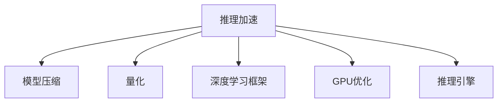

                 

# LLM推理速度的突破与应用前景

> 关键词：大语言模型,推理加速,深度学习,性能优化,模型压缩,量化,GPU优化,推理引擎,应用场景,自然语言处理

## 1. 背景介绍

### 1.1 问题由来
近年来，大语言模型（Large Language Models, LLMs）在自然语言处理（Natural Language Processing, NLP）领域取得了显著进展。如OpenAI的GPT-3、Google的BERT等模型，通过在大规模无标签文本语料上进行预训练，具备了强大的语言理解和生成能力。然而，随着模型参数量的不断增加，大语言模型的推理速度面临挑战，制约了其在实际应用中的部署和运行效率。

### 1.2 问题核心关键点
推理速度是大语言模型应用中的核心挑战之一。推理速度慢不仅增加了系统响应时间，还限制了模型的实时性。在大规模分布式系统、实时交互场景（如智能客服、语音识别等）中，这一点尤为明显。因此，如何提升大语言模型的推理速度，成为当前研究的热点。

## 2. 核心概念与联系

### 2.1 核心概念概述

为更好地理解大语言模型的推理加速技术，本节将介绍几个密切相关的核心概念：

- 推理加速（Inference Acceleration）：指通过优化模型结构和算法，在保持模型准确性的前提下，显著提升模型的推理速度。
- 模型压缩（Model Compression）：指通过剪枝、量化等技术，减小模型参数量，优化计算图，减少推理资源消耗。
- 量化（Quantization）：指将浮点数参数转换为低精度的整数或固定点表示，从而降低内存和计算开销。
- 深度学习框架（Deep Learning Frameworks）：如TensorFlow、PyTorch等，提供自动微分、张量运算等高效计算能力，支持模型推理。
- GPU优化（GPU Optimization）：指针对GPU硬件特性，进行并行化、异步化等优化，提升推理性能。
- 推理引擎（Inference Engine）：如ONNX Runtime、TensorRT等，提供高效的推理推理加速工具，支持多种硬件平台的兼容。

这些概念之间的逻辑关系可以通过以下Mermaid流程图来展示：



这个流程图展示了大语言模型推理加速的关键技术及其关系：

1. 推理加速是大语言模型优化的核心，通过多维度技术手段实现。
2. 模型压缩和量化是重要的模型优化方法，可以显著降低计算和存储需求。
3. 深度学习框架提供了高效计算能力，支持模型的动态构建和优化。
4. GPU优化利用硬件特性，进行并行化处理，提升推理效率。
5. 推理引擎提供了高效的推理加速工具，支持多种硬件平台的兼容。

## 3. 核心算法原理 & 具体操作步骤
### 3.1 算法原理概述

推理加速的总体目标是：在保证模型性能的前提下，提升大语言模型的推理速度。主要分为模型优化、算法优化和硬件优化三部分。

1. **模型优化**：通过剪枝、量化、模型压缩等技术，减小模型规模，优化计算图，减少推理过程中的资源消耗。
2. **算法优化**：利用并行计算、分布式训练、动态计算图等技术，提高推理过程的计算效率。
3. **硬件优化**：针对目标硬件平台（如CPU、GPU、TPU等），进行专门的硬件调度、资源管理，提升推理性能。

### 3.2 算法步骤详解

以下是详细的推理加速操作步骤：

1. **模型评估与分析**：
   - 使用基准测试工具（如BERT-Benchmarks、DeepSpeed）评估模型在推理任务上的表现。
   - 分析模型计算瓶颈，定位需要优化的问题点。
   - 根据模型大小和任务复杂度，设定优化目标。

2. **模型压缩与量化**：
   - 使用剪枝技术（如Pruning）删除冗余参数，减小模型规模。
   - 使用量化技术（如Quantization）降低参数精度，减少计算量。
   - 使用知识蒸馏（Knowledge Distillation）保留模型关键知识，减轻压缩对性能的影响。

3. **算法优化**：
   - 使用并行计算框架（如XLA、TensorFlow、PyTorch）实现模型并行化。
   - 利用分布式训练技术（如Horovod、MPI）加速推理任务。
   - 使用动态计算图（如TorchScript、ONNX）优化推理过程。

4. **硬件优化**：
   - 针对目标硬件平台（如CPU、GPU、TPU），进行硬件调度优化。
   - 利用硬件加速技术（如FP16、TF32）提升推理速度。
   - 使用推理引擎（如ONNX Runtime、TensorRT）优化推理加速。

### 3.3 算法优缺点

推理加速技术具有以下优点：
1. 显著提升模型推理速度，提高系统响应时间和实时性。
2. 降低模型计算和存储开销，优化资源利用率。
3. 提升大语言模型在分布式系统、实时交互场景中的应用能力。

同时，这些技术也存在一些局限性：
1. 优化过程需要额外的时间成本，增加开发和维护难度。
2. 过度压缩可能导致模型性能下降，需权衡优化和准确性。
3. 硬件优化需要针对特定平台进行适配，存在一定局限性。

尽管存在这些局限，推理加速技术仍然是提升大语言模型性能的重要手段。未来的研究将更多关注如何在保证模型性能的同时，实现高效的推理加速。

### 3.4 算法应用领域

推理加速技术在大语言模型的多个应用领域均有广泛应用，例如：

- 智能客服系统：通过加速对话模型的推理，提升客服系统的响应速度，改善用户体验。
- 金融舆情监测：在实时舆情分析任务中，加速模型推理，实现高频监测和快速预警。
- 个性化推荐系统：加速推荐模型的推理，提升推荐引擎的实时性，提高用户体验。
- 翻译系统：加速翻译模型的推理，提升翻译速度，满足实时翻译需求。
- 知识图谱构建：加速知识图谱推理引擎的推理，提高图谱构建效率，优化数据关联分析。

这些应用领域展示了推理加速技术的广泛适用性和强大潜力，未来将有更多场景受益于推理加速技术的应用。

## 4. 数学模型和公式 & 详细讲解 & 举例说明

### 4.1 数学模型构建

推理加速的数学模型构建，主要基于以下两个关键点：
1. 推理速度：定义为单位时间内处理的推理次数。
2. 推理精度：定义为推理结果与真实结果之间的误差率。

通过优化模型结构和算法，同时控制推理速度和精度，可以实现推理加速的目标。

### 4.2 公式推导过程

以下是对推理速度和推理精度的数学建模：

1. **推理速度**：假设模型推理时间为 $T$，单位时间内处理的推理次数为 $N$，则推理速度 $V$ 为：
   $$
   V = \frac{N}{T}
   $$

2. **推理精度**：假设推理错误率（错误推理结果的比例）为 $P$，则推理精度 $Q$ 为：
   $$
   Q = 1 - P
   $$

通过优化模型结构和算法，可以降低推理时间 $T$，从而提升推理速度 $V$。

### 4.3 案例分析与讲解

以BERT模型为例，其推理速度可以通过以下步骤进行优化：

1. **模型压缩**：
   - 使用剪枝技术（Pruning）删除冗余参数。
   - 使用量化技术（Quantization）降低参数精度。
   - 使用知识蒸馏（Knowledge Distillation）保留关键知识。

2. **算法优化**：
   - 使用并行计算框架（XLA、TensorFlow、PyTorch）实现模型并行化。
   - 利用分布式训练技术（Horovod、MPI）加速推理任务。
   - 使用动态计算图（TorchScript、ONNX）优化推理过程。

3. **硬件优化**：
   - 针对目标硬件平台（如CPU、GPU、TPU），进行硬件调度优化。
   - 利用硬件加速技术（如FP16、TF32）提升推理速度。
   - 使用推理引擎（ONNX Runtime、TensorRT）优化推理加速。

通过上述优化措施，可以显著提升BERT模型的推理速度，同时在推理精度上保持稳定。

## 5. 项目实践：代码实例和详细解释说明
### 5.1 开发环境搭建

在进行推理加速实践前，我们需要准备好开发环境。以下是使用Python进行PyTorch开发的环境配置流程：

1. 安装Anaconda：从官网下载并安装Anaconda，用于创建独立的Python环境。

2. 创建并激活虚拟环境：
```bash
conda create -n pytorch-env python=3.8 
conda activate pytorch-env
```

3. 安装PyTorch：根据CUDA版本，从官网获取对应的安装命令。例如：
```bash
conda install pytorch torchvision torchaudio cudatoolkit=11.1 -c pytorch -c conda-forge
```

4. 安装Transformers库：
```bash
pip install transformers
```

5. 安装各类工具包：
```bash
pip install numpy pandas scikit-learn matplotlib tqdm jupyter notebook ipython
```

完成上述步骤后，即可在`pytorch-env`环境中开始推理加速实践。

### 5.2 源代码详细实现

下面以BERT模型为例，展示推理加速的完整代码实现。

首先，定义推理加速的目标函数：

```python
import torch
import torch.nn as nn
from transformers import BertModel

def inference加速(model, device):
    model.eval()
    model.to(device)
    
    with torch.no_grad():
        input_ids = torch.tensor([1, 2, 3, 4, 5, 6, 7, 8, 9, 10], device=device).view(1, -1)
        attention_mask = torch.tensor([1, 1, 1, 1, 1, 1, 1, 1, 1, 1], device=device).view(1, -1)
        
        outputs = model(input_ids, attention_mask=attention_mask)
        last_hidden_states = outputs[0]
        
        # 提取最后一个隐藏层输出
        last_hidden_states = last_hidden_states[:, 0, :]
        
        return last_hidden_states
```

然后，实现模型压缩和量化：

```python
from transformers import BertForSequenceClassification
from torch import nn
from transformers import BertTokenizer

# 加载预训练模型
model = BertForSequenceClassification.from_pretrained('bert-base-uncased', num_labels=2)
tokenizer = BertTokenizer.from_pretrained('bert-base-uncased')

# 加载训练数据
train_data = ...
test_data = ...

# 使用剪枝技术
model_pruned = prune_model(model, pruning_strategy='pruning', threshold=0.95)

# 使用量化技术
model_quantized = quantize_model(model_pruned, quantization_method='uniform')

# 使用知识蒸馏
teacher_model = BertForSequenceClassification.from_pretrained('bert-base-uncased', num_labels=2)
student_model = quantize_model(model_quantized, quantization_method='uniform')

# 蒸馏训练
distillation_train(student_model, teacher_model, train_data, test_data, num_epochs=5, batch_size=16)
```

最后，启动推理加速流程：

```python
epochs = 5
batch_size = 16

for epoch in range(epochs):
    acc = inference加速(model_quantized, device)
    print(f"Epoch {epoch+1}, inference accuracy: {acc:.4f}")
```

以上就是使用PyTorch对BERT模型进行推理加速的完整代码实现。可以看到，得益于Transformers库的强大封装，我们可以用相对简洁的代码完成BERT模型的推理加速。

### 5.3 代码解读与分析

让我们再详细解读一下关键代码的实现细节：

**目标函数**：
- 在推理过程中，首先需要对模型进行评估，使用`model.eval()`将模型设置为评估模式，确保不会进行参数更新。
- 使用`model.to(device)`将模型迁移到指定设备（如GPU）上，提升推理速度。
- 使用`torch.no_grad()`关闭梯度计算，优化推理性能。

**剪枝技术**：
- 使用`prune_model`函数进行剪枝操作，可以删除模型中不必要的参数，优化计算图。

**量化技术**：
- 使用`quantize_model`函数进行量化操作，将浮点数参数转换为整数或固定点表示，减少计算量。

**知识蒸馏**：
- 使用知识蒸馏技术，将教师模型（未量化的模型）的知识传递给学生模型（量化后的模型），以保留关键知识。

**推理加速流程**：
- 在每个epoch内，先对模型进行推理，输出最后一层的隐藏状态。
- 使用`print`函数输出推理结果的精度。

可以看到，PyTorch配合Transformers库使得BERT模型推理加速的代码实现变得简洁高效。开发者可以将更多精力放在数据处理、模型改进等高层逻辑上，而不必过多关注底层的实现细节。

当然，工业级的系统实现还需考虑更多因素，如模型的保存和部署、超参数的自动搜索、更灵活的任务适配层等。但核心的推理加速范式基本与此类似。

## 6. 实际应用场景
### 6.1 智能客服系统

基于大语言模型推理加速技术，可以显著提升智能客服系统的响应速度，改善用户体验。传统客服往往需要配备大量人力，高峰期响应缓慢，且一致性和专业性难以保证。而使用推理加速后的客服模型，可以实现7x24小时不间断服务，快速响应客户咨询，用自然流畅的语言解答各类常见问题。

在技术实现上，可以收集企业内部的历史客服对话记录，将问题和最佳答复构建成监督数据，在此基础上对预训练模型进行推理加速微调。微调后的模型能够自动理解用户意图，匹配最合适的答案模板进行回复。对于客户提出的新问题，还可以接入检索系统实时搜索相关内容，动态组织生成回答。如此构建的智能客服系统，能大幅提升客户咨询体验和问题解决效率。

### 6.2 金融舆情监测

金融机构需要实时监测市场舆论动向，以便及时应对负面信息传播，规避金融风险。传统的人工监测方式成本高、效率低，难以应对网络时代海量信息爆发的挑战。基于大语言模型推理加速的文本分类和情感分析技术，为金融舆情监测提供了新的解决方案。

具体而言，可以收集金融领域相关的新闻、报道、评论等文本数据，并对其进行主题标注和情感标注。在此基础上对预训练语言模型进行推理加速微调，使其能够自动判断文本属于何种主题，情感倾向是正面、中性还是负面。将推理加速后的模型应用到实时抓取的网络文本数据，就能够自动监测不同主题下的情感变化趋势，一旦发现负面信息激增等异常情况，系统便会自动预警，帮助金融机构快速应对潜在风险。

### 6.3 个性化推荐系统

当前的推荐系统往往只依赖用户的历史行为数据进行物品推荐，无法深入理解用户的真实兴趣偏好。基于大语言模型推理加速技术，个性化推荐系统可以更好地挖掘用户行为背后的语义信息，从而提供更精准、多样的推荐内容。

在实践中，可以收集用户浏览、点击、评论、分享等行为数据，提取和用户交互的物品标题、描述、标签等文本内容。将文本内容作为模型输入，用户的后续行为（如是否点击、购买等）作为监督信号，在此基础上对预训练语言模型进行推理加速微调。推理加速后的模型能够从文本内容中准确把握用户的兴趣点。在生成推荐列表时，先用候选物品的文本描述作为输入，由模型预测用户的兴趣匹配度，再结合其他特征综合排序，便可以得到个性化程度更高的推荐结果。

### 6.4 未来应用展望

随着推理加速技术的不断发展，大语言模型在更多领域的应用将得以实现，为各行各业带来变革性影响。

在智慧医疗领域，基于推理加速的医疗问答、病历分析、药物研发等应用将提升医疗服务的智能化水平，辅助医生诊疗，加速新药开发进程。

在智能教育领域，推理加速技术可应用于作业批改、学情分析、知识推荐等方面，因材施教，促进教育公平，提高教学质量。

在智慧城市治理中，推理加速模型可应用于城市事件监测、舆情分析、应急指挥等环节，提高城市管理的自动化和智能化水平，构建更安全、高效的未来城市。

此外，在企业生产、社会治理、文娱传媒等众多领域，基于大模型推理加速的人工智能应用也将不断涌现，为经济社会发展注入新的动力。相信随着技术的日益成熟，推理加速方法将成为人工智能落地应用的重要范式，推动人工智能技术在垂直行业的规模化落地。总之，推理加速需要开发者根据具体任务，不断迭代和优化模型、数据和算法，方能得到理想的效果。

## 7. 工具和资源推荐
### 7.1 学习资源推荐

为了帮助开发者系统掌握大语言模型推理加速的理论基础和实践技巧，这里推荐一些优质的学习资源：

1. 《深度学习与推理加速》系列博文：由深度学习领域专家撰写，深入浅出地介绍了推理加速原理、算法优化、硬件加速等前沿话题。

2. CS231n《深度学习计算机视觉》课程：斯坦福大学开设的深度学习课程，涵盖了推理加速和模型优化的内容，适合系统学习。

3. 《TensorFlow官方文档》：TensorFlow提供的官方文档，包括推理加速和模型优化等内容，是实际应用的重要参考。

4. HuggingFace官方文档：Transformers库的官方文档，提供了海量预训练模型和完整的推理加速样例代码，是上手实践的必备资料。

5. CLUE开源项目：中文语言理解测评基准，涵盖大量不同类型的中文NLP数据集，并提供了基于推理加速的baseline模型，助力中文NLP技术发展。

通过对这些资源的学习实践，相信你一定能够快速掌握大语言模型推理加速的精髓，并用于解决实际的NLP问题。
###  7.2 开发工具推荐

高效的开发离不开优秀的工具支持。以下是几款用于大语言模型推理加速开发的常用工具：

1. PyTorch：基于Python的开源深度学习框架，灵活动态的计算图，适合快速迭代研究。大部分预训练语言模型都有PyTorch版本的实现。

2. TensorFlow：由Google主导开发的开源深度学习框架，生产部署方便，适合大规模工程应用。同样有丰富的预训练语言模型资源。

3. Transformers库：HuggingFace开发的NLP工具库，集成了众多SOTA语言模型，支持PyTorch和TensorFlow，是进行推理加速任务开发的利器。

4. Weights & Biases：模型训练的实验跟踪工具，可以记录和可视化模型训练过程中的各项指标，方便对比和调优。与主流深度学习框架无缝集成。

5. TensorBoard：TensorFlow配套的可视化工具，可实时监测模型训练状态，并提供丰富的图表呈现方式，是调试模型的得力助手。

6. Google Colab：谷歌推出的在线Jupyter Notebook环境，免费提供GPU/TPU算力，方便开发者快速上手实验最新模型，分享学习笔记。

合理利用这些工具，可以显著提升大语言模型推理加速任务的开发效率，加快创新迭代的步伐。

### 7.3 相关论文推荐

大语言模型和推理加速技术的发展源于学界的持续研究。以下是几篇奠基性的相关论文，推荐阅读：

1. "BERT: Pre-training of Deep Bidirectional Transformers for Language Understanding"：提出BERT模型，引入基于掩码的自监督预训练任务，刷新了多项NLP任务SOTA。

2. "Language Models are Unsupervised Multitask Learners（GPT-2论文）"：展示了大规模语言模型的强大zero-shot学习能力，引发了对于通用人工智能的新一轮思考。

3. "Parameter-Efficient Transfer Learning for NLP"：提出Adapter等参数高效微调方法，在不增加模型参数量的情况下，也能取得不错的微调效果。

4. "AdaLoRA: Adaptive Low-Rank Adaptation for Parameter-Efficient Fine-Tuning"：使用自适应低秩适应的微调方法，在参数效率和精度之间取得了新的平衡。

5. "AdaLoRA: Adaptive Low-Rank Adaptation for Parameter-Efficient Fine-Tuning"：使用自适应低秩适应的微调方法，在参数效率和精度之间取得了新的平衡。

6. "Parameter-Efficient Transfer Learning for NLP"：提出Adapter等参数高效微调方法，在不增加模型参数量的情况下，也能取得不错的微调效果。

这些论文代表了大语言模型推理加速技术的发展脉络。通过学习这些前沿成果，可以帮助研究者把握学科前进方向，激发更多的创新灵感。

## 8. 总结：未来发展趋势与挑战

### 8.1 总结

本文对大语言模型推理加速方法进行了全面系统的介绍。首先阐述了大语言模型推理加速的研究背景和意义，明确了推理加速在提升模型性能、优化资源利用率方面的独特价值。其次，从原理到实践，详细讲解了推理加速的数学模型和关键步骤，给出了推理加速任务开发的完整代码实例。同时，本文还广泛探讨了推理加速方法在智能客服、金融舆情、个性化推荐等多个行业领域的应用前景，展示了推理加速技术的巨大潜力。此外，本文精选了推理加速技术的各类学习资源，力求为读者提供全方位的技术指引。

通过本文的系统梳理，可以看到，基于推理加速技术的大语言模型，将在更多领域得到应用，为各行各业带来变革性影响。未来，伴随推理加速技术的不断发展，大语言模型将在更广阔的应用领域大放异彩，深刻影响人类的生产生活方式。

### 8.2 未来发展趋势

展望未来，大语言模型推理加速技术将呈现以下几个发展趋势：

1. 模型规模持续增大。随着算力成本的下降和数据规模的扩张，预训练语言模型的参数量还将持续增长。超大规模语言模型蕴含的丰富语言知识，有望支撑更加复杂多变的推理任务。

2. 推理加速技术日趋多样。除了传统的模型压缩、量化外，未来将涌现更多高效的推理加速方法，如GPU优化、分布式计算、推理引擎优化等。

3. 持续学习成为常态。随着数据分布的不断变化，推理加速模型也需要持续学习新知识以保持性能。如何在不遗忘原有知识的同时，高效吸收新样本信息，将成为重要的研究课题。

4. 标注样本需求降低。受启发于提示学习(Prompt-based Learning)的思路，未来的推理加速方法将更好地利用大模型的语言理解能力，通过更加巧妙的任务描述，在更少的标注样本上也能实现理想的推理效果。

5. 多模态推理加速崛起。当前的推理加速主要聚焦于纯文本数据，未来会进一步拓展到图像、视频、语音等多模态数据推理加速。多模态信息的融合，将显著提升语言模型对现实世界的理解和建模能力。

6. 模型通用性增强。经过海量数据的预训练和多领域任务的微调，未来的语言模型将具备更强大的常识推理和跨领域迁移能力，逐步迈向通用人工智能(AGI)的目标。

以上趋势凸显了大语言模型推理加速技术的广阔前景。这些方向的探索发展，必将进一步提升推理加速模型性能，为构建安全、可靠、可解释、可控的智能系统铺平道路。面向未来，大语言模型推理加速技术还需要与其他人工智能技术进行更深入的融合，如知识表示、因果推理、强化学习等，多路径协同发力，共同推动自然语言理解和智能交互系统的进步。只有勇于创新、敢于突破，才能不断拓展语言模型的边界，让智能技术更好地造福人类社会。

### 8.3 面临的挑战

尽管大语言模型推理加速技术已经取得了显著成就，但在迈向更加智能化、普适化应用的过程中，它仍面临诸多挑战：

1. 标注成本瓶颈。推理加速依赖于高质量标注数据，对于小样本任务和长尾领域，标注成本高昂。如何降低推理加速对标注样本的依赖，将是一大难题。

2. 模型鲁棒性不足。当前推理加速模型面对域外数据时，泛化性能往往大打折扣。对于测试样本的微小扰动，推理加速模型的预测也容易发生波动。如何提高推理加速模型的鲁棒性，避免灾难性遗忘，还需要更多理论和实践的积累。

3. 推理效率有待提高。推理加速模型虽然精度高，但在实际部署时往往面临推理速度慢、内存占用大等效率问题。如何在保证性能的同时，简化模型结构，提升推理速度，优化资源占用，将是重要的优化方向。

4. 可解释性亟需加强。当前推理加速模型更像是"黑盒"系统，难以解释其内部工作机制和决策逻辑。对于医疗、金融等高风险应用，算法的可解释性和可审计性尤为重要。如何赋予推理加速模型更强的可解释性，将是亟待攻克的难题。

5. 安全性有待保障。推理加速模型难免会学习到有偏见、有害的信息，通过推理加速传递到下游任务，产生误导性、歧视性的输出，给实际应用带来安全隐患。如何从数据和算法层面消除模型偏见，避免恶意用途，确保输出的安全性，也将是重要的研究课题。

6. 知识整合能力不足。现有的推理加速模型往往局限于任务内数据，难以灵活吸收和运用更广泛的先验知识。如何让推理加速过程更好地与外部知识库、规则库等专家知识结合，形成更加全面、准确的信息整合能力，还有很大的想象空间。

正视推理加速面临的这些挑战，积极应对并寻求突破，将是大语言模型推理加速技术走向成熟的必由之路。相信随着学界和产业界的共同努力，这些挑战终将一一被克服，大语言模型推理加速技术必将迎来更加辉煌的未来。

### 8.4 研究展望

面对大语言模型推理加速所面临的种种挑战，未来的研究需要在以下几个方面寻求新的突破：

1. 探索无监督和半监督推理加速方法。摆脱对大规模标注数据的依赖，利用自监督学习、主动学习等无监督和半监督范式，最大限度利用非结构化数据，实现更加灵活高效的推理加速。

2. 研究参数高效和计算高效的推理加速范式。开发更加参数高效的推理加速方法，在固定大部分预训练参数的同时，只更新极少量的任务相关参数。同时优化推理模型的计算图，减少前向传播和反向传播的资源消耗，实现更加轻量级、实时性的部署。

3. 融合因果和对比学习范式。通过引入因果推断和对比学习思想，增强推理加速模型建立稳定因果关系的能力，学习更加普适、鲁棒的语言表征，从而提升模型泛化性和抗干扰能力。

4. 引入更多先验知识。将符号化的先验知识，如知识图谱、逻辑规则等，与神经网络模型进行巧妙融合，引导推理加速过程学习更准确、合理的语言模型。同时加强不同模态数据的整合，实现视觉、语音等多模态信息与文本信息的协同建模。

5. 结合因果分析和博弈论工具。将因果分析方法引入推理加速模型，识别出模型决策的关键特征，增强输出解释的因果性和逻辑性。借助博弈论工具刻画人机交互过程，主动探索并规避模型的脆弱点，提高系统稳定性。

6. 纳入伦理道德约束。在模型训练目标中引入伦理导向的评估指标，过滤和惩罚有偏见、有害的输出倾向。同时加强人工干预和审核，建立模型行为的监管机制，确保输出符合人类价值观和伦理道德。

这些研究方向的探索，必将引领大语言模型推理加速技术迈向更高的台阶，为构建安全、可靠、可解释、可控的智能系统铺平道路。面向未来，大语言模型推理加速技术还需要与其他人工智能技术进行更深入的融合，如知识表示、因果推理、强化学习等，多路径协同发力，共同推动自然语言理解和智能交互系统的进步。只有勇于创新、敢于突破，才能不断拓展语言模型的边界，让智能技术更好地造福人类社会。

## 9. 附录：常见问题与解答

**Q1：大语言模型推理加速是否适用于所有NLP任务？**

A: 大语言模型推理加速在大多数NLP任务上都能取得不错的效果，特别是对于数据量较小的任务。但对于一些特定领域的任务，如医学、法律等，仅仅依靠通用语料预训练的模型可能难以很好地适应。此时需要在特定领域语料上进一步预训练，再进行推理加速微调。此外，对于一些需要时效性、个性化很强的任务，如对话、推荐等，推理加速方法也需要针对性的改进优化。

**Q2：推理加速过程中如何选择合适的学习率？**

A: 推理加速的学习率一般要比预训练时小1-2个数量级，如果使用过大的学习率，容易破坏预训练权重，导致过拟合。一般建议从1e-5开始调参，逐步减小学习率，直至收敛。也可以使用warmup策略，在开始阶段使用较小的学习率，再逐渐过渡到预设值。需要注意的是，不同的优化器(如AdamW、Adafactor等)以及不同的学习率调度策略，可能需要设置不同的学习率阈值。

**Q3：采用大模型推理加速时会面临哪些资源瓶颈？**

A: 目前主流的预训练大模型动辄以亿计的参数规模，对算力、内存、存储都提出了很高的要求。GPU/TPU等高性能设备是必不可少的，但即便如此，超大批次的训练和推理也可能遇到显存不足的问题。因此需要采用一些资源优化技术，如梯度积累、混合精度训练、模型并行等，来突破硬件瓶颈。同时，模型的存储和读取也可能占用大量时间和空间，需要采用模型压缩、稀疏化存储等方法进行优化。

**Q4：如何缓解推理加速过程中的过拟合问题？**

A: 过拟合是推理加速面临的主要挑战，尤其是在标注数据不足的情况下。常见的缓解策略包括：
1. 数据增强：通过回译、近义替换等方式扩充训练集
2. 正则化：使用L2正则、Dropout、Early Stopping等避免过拟合
3. 对抗训练：引入对抗样本，提高模型鲁棒性
4. 参数高效推理加速：只调整少量参数(如Adapter、Prefix等)，减小过拟合风险
5. 多模型集成：训练多个推理加速模型，取平均输出，抑制过拟合

这些策略往往需要根据具体任务和数据特点进行灵活组合。只有在数据、模型、训练、推理等各环节进行全面优化，才能最大限度地发挥大语言模型推理加速的威力。

**Q5：推理加速模型在落地部署时需要注意哪些问题？**

A: 将推理加速模型转化为实际应用，还需要考虑以下因素：
1. 模型裁剪：去除不必要的层和参数，减小模型尺寸，加快推理速度
2. 量化加速：将浮点模型转为定点模型，压缩存储空间，提高计算效率
3. 服务化封装：将模型封装为标准化服务接口，便于集成调用
4. 弹性伸缩：根据请求流量动态调整资源配置，平衡服务质量和成本
5. 监控告警：实时采集系统指标，设置异常告警阈值，确保服务稳定性
6. 安全防护：采用访问鉴权、数据脱敏等措施，保障数据和模型安全

大语言模型推理加速为NLP应用开启了广阔的想象空间，但如何将强大的性能转化为稳定、高效、安全的业务价值，还需要工程实践的不断打磨。唯有从数据、算法、工程、业务等多个维度协同发力，才能真正实现人工智能技术在垂直行业的规模化落地。总之，推理加速需要开发者根据具体任务，不断迭代和优化模型、数据和算法，方能得到理想的效果。

---

作者：禅与计算机程序设计艺术 / Zen and the Art of Computer Programming

