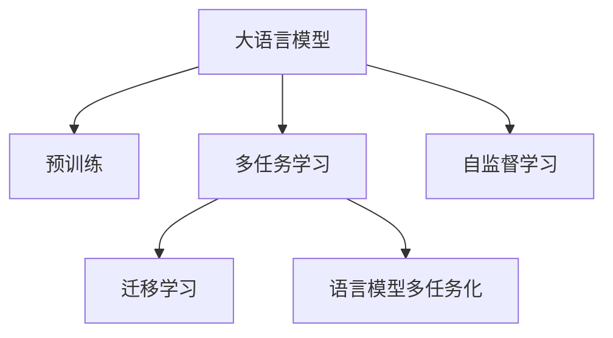

                 

# LLM的versatility：多任务处理能力探析

> 关键词：大语言模型(LLM),多任务学习(MTL),迁移学习(Transfer Learning),语言模型多任务化(MLMT),预训练(Pre-training),自监督学习(Self-Supervised Learning)

## 1. 背景介绍

### 1.1 问题由来
近年来，大语言模型（Large Language Model, LLM）在自然语言处理（Natural Language Processing, NLP）领域取得了巨大突破。LLM通过大规模预训练，学习到了丰富的语言知识和常识，表现出卓越的自然语言理解能力和生成能力。然而，LLM在执行单一任务时表现优异，而在多任务处理上却稍显不足。如何在不增加参数量的情况下，提升LLM的多任务处理能力，是当前研究的热点问题。

### 1.2 问题核心关键点
提升LLM的多任务处理能力，需要从以下几个方面入手：
1. 如何通过预训练-微调流程，让LLM在不同任务上具有泛化能力。
2. 如何设计合适的损失函数，避免不同任务间相互干扰。
3. 如何设计模型架构，让不同任务共享参数，减少计算开销。
4. 如何通过迁移学习，利用已有任务的训练数据，加速新任务学习。
5. 如何设计任务描述，引导LLM学习多任务的知识表示。

这些关键点决定了LLM多任务处理能力能否被最大化发挥，以及如何构建高效、鲁棒的多任务处理系统。

### 1.3 问题研究意义
在实际应用中，如问答、翻译、情感分析、机器阅读等任务往往需要结合多个子任务共同完成。如何提升LLM的多任务处理能力，使其能在多个相关任务上表现出色，成为当前研究的重点。这不仅能够提高系统的效率和效果，还能拓展LLM的应用范围，提升其在复杂场景下的表现能力。

## 2. 核心概念与联系

### 2.1 核心概念概述

为更好地理解LLM的多任务处理能力，本节将介绍几个密切相关的核心概念：

- 大语言模型(Large Language Model, LLM)：以自回归(如GPT)或自编码(如BERT)模型为代表的大规模预训练语言模型。通过在大规模无标签文本语料上进行预训练，学习通用的语言表示，具备强大的语言理解和生成能力。

- 多任务学习(Multi-Task Learning, MTL)：指同时训练多个相关任务，通过共享模型参数，提升不同任务间的泛化能力和泛化能力。

- 迁移学习(Transfer Learning)：指将一个领域学习到的知识，迁移应用到另一个不同但相关的领域的学习范式。LLM的预训练-微调过程即是一种典型的迁移学习方式。

- 语言模型多任务化(Multitask Language Modeling, MLMT)：通过多任务学习，训练LLM在多个相关任务上具有共同的语言模型表示，从而提升多任务处理能力。

- 预训练(Pre-training)：指在大规模无标签文本语料上，通过自监督学习任务训练通用语言模型的过程。常见的预训练任务包括言语建模、遮挡语言模型等。

- 自监督学习(Self-Supervised Learning)：指使用大量未标注数据，通过生成式预训练等方法，自动发现和利用数据中的隐含结构。

这些核心概念之间的逻辑关系可以通过以下Mermaid流程图来展示：



这个流程图展示了大语言模型的核心概念及其之间的关系：

1. 大语言模型通过预训练获得基础能力。
2. 多任务学习训练模型在不同任务上具有泛化能力。
3. 迁移学习将预训练知识迁移到新任务上。
4. 语言模型多任务化训练模型在多个相关任务上具有共同的语言模型表示。
5. 自监督学习通过未标注数据，自动生成式预训练模型。

这些概念共同构成了LLM的多任务处理框架，使其能够在各种场景下发挥强大的语言理解和生成能力。通过理解这些核心概念，我们可以更好地把握LLM的多任务处理原理和优化方向。

## 3. 核心算法原理 & 具体操作步骤
### 3.1 算法原理概述

大语言模型在执行多任务时，主要通过预训练-微调流程和语言模型多任务化两种方式提升多任务处理能力。其中，预训练-微调流程是指在通用大模型上进行预训练，然后在特定任务上微调，以提升模型在该任务上的性能。而语言模型多任务化则是指在预训练阶段，直接训练模型在不同任务上的语言表示，从而在微调时能够更快适应新任务。

### 3.2 算法步骤详解

#### 3.2.1 预训练-微调流程

1. **准备预训练模型和数据集**
   - 选择合适的预训练语言模型 $M_{\theta}$ 作为初始化参数，如 BERT、GPT 等。
   - 准备多个下游任务 $T_1, T_2, \cdots, T_n$ 的标注数据集 $D_1, D_2, \cdots, D_n$，划分为训练集、验证集和测试集。

2. **设计多任务适配层**
   - 根据任务类型，在预训练模型顶层设计合适的输出层和损失函数。
   - 对于分类任务，通常在顶层添加线性分类器和交叉熵损失函数。
   - 对于生成任务，通常使用语言模型的解码器输出概率分布，并以负对数似然为损失函数。

3. **设置微调超参数**
   - 选择合适的优化算法及其参数，如 AdamW、SGD 等，设置学习率、批大小、迭代轮数等。
   - 设置正则化技术及强度，包括权重衰减、Dropout、Early Stopping 等。
   - 确定冻结预训练参数的策略，如仅微调顶层，或全部参数都参与微调。

4. **执行梯度训练**
   - 将训练集数据分批次输入模型，前向传播计算损失函数。
   - 反向传播计算参数梯度，根据设定的优化算法和学习率更新模型参数。
   - 周期性在验证集上评估模型性能，根据性能指标决定是否触发 Early Stopping。
   - 重复上述步骤直到满足预设的迭代轮数或 Early Stopping 条件。

5. **测试和部署**
   - 在测试集上评估微调后模型 $M_{\hat{\theta}}$ 的性能，对比微调前后的精度提升。
   - 使用微调后的模型对新样本进行推理预测，集成到实际的应用系统中。
   - 持续收集新的数据，定期重新微调模型，以适应数据分布的变化。

#### 3.2.2 语言模型多任务化

1. **准备预训练模型和数据集**
   - 选择合适的预训练语言模型 $M_{\theta}$ 作为初始化参数，如 BERT、GPT 等。
   - 准备多个下游任务 $T_1, T_2, \cdots, T_n$ 的标注数据集 $D_1, D_2, \cdots, D_n$，划分为训练集、验证集和测试集。

2. **设计多任务损失函数**
   - 定义多个任务之间的联合损失函数，例如 $\mathcal{L} = \lambda_1\mathcal{L}_{T_1} + \lambda_2\mathcal{L}_{T_2} + \cdots + \lambda_n\mathcal{L}_{T_n}$，其中 $\mathcal{L}_{T_i}$ 表示任务 $T_i$ 的损失函数，$\lambda_i$ 为任务权重。

3. **设置微调超参数**
   - 选择合适的优化算法及其参数，如 AdamW、SGD 等，设置学习率、批大小、迭代轮数等。
   - 设置正则化技术及强度，包括权重衰减、Dropout、Early Stopping 等。
   - 确定冻结预训练参数的策略，如仅微调顶层，或全部参数都参与微调。

4. **执行梯度训练**
   - 将训练集数据分批次输入模型，前向传播计算联合损失函数。
   - 反向传播计算参数梯度，根据设定的优化算法和学习率更新模型参数。
   - 周期性在验证集上评估模型性能，根据性能指标决定是否触发 Early Stopping。
   - 重复上述步骤直到满足预设的迭代轮数或 Early Stopping 条件。

5. **测试和部署**
   - 在测试集上评估微调后模型 $M_{\hat{\theta}}$ 的性能，对比微调前后的精度提升。
   - 使用微调后的模型对新样本进行推理预测，集成到实际的应用系统中。
   - 持续收集新的数据，定期重新微调模型，以适应数据分布的变化。

### 3.3 算法优缺点

语言模型多任务化有以下优点：
1. 减少参数量。通过共享模型参数，减少了不同任务间参数的重复，减少了计算开销。
2. 提升泛化能力。共享的语言模型表示使得模型在多个任务上具备泛化能力，提升泛化性能。
3. 高效利用数据。可以同时训练多个任务，高效利用标注数据和未标注数据。
4. 可解释性强。共享的参数表示使得模型的决策过程更容易解释，有助于理解模型的行为。

但同时，该方法也存在以下缺点：
1. 任务间干扰。不同任务间可能存在干扰，导致模型的某些部分无法在多个任务上泛化。
2. 参数优化复杂。多任务联合优化增加了优化的复杂度，可能存在收敛困难的问题。
3. 参数共享可能导致泛化性能下降。在多任务中，某些任务可能会过度泛化，而另一些任务泛化能力不足。

尽管存在这些缺点，但语言模型多任务化依然是大语言模型在多任务处理中常用的技术手段，可以有效提升模型的多任务处理能力。

### 3.4 算法应用领域

语言模型多任务化在NLP领域已经得到了广泛的应用，覆盖了几乎所有常见任务，例如：

- 文本分类：如情感分析、主题分类、意图识别等。通过微调使模型学习文本-标签映射。
- 命名实体识别：识别文本中的人名、地名、机构名等特定实体。通过微调使模型掌握实体边界和类型。
- 关系抽取：从文本中抽取实体之间的语义关系。通过微调使模型学习实体-关系三元组。
- 问答系统：对自然语言问题给出答案。将问题-答案对作为微调数据，训练模型学习匹配答案。
- 机器翻译：将源语言文本翻译成目标语言。通过微调使模型学习语言-语言映射。
- 文本摘要：将长文本压缩成简短摘要。将文章-摘要对作为微调数据，使模型学习抓取要点。
- 对话系统：使机器能够与人自然对话。将多轮对话历史作为上下文，微调模型进行回复生成。

除了上述这些经典任务外，语言模型多任务化还被创新性地应用到更多场景中，如可控文本生成、常识推理、代码生成、数据增强等，为NLP技术带来了全新的突破。

## 4. 数学模型和公式 & 详细讲解  
### 4.1 数学模型构建

本节将使用数学语言对语言模型多任务化进行更加严格的刻画。

记预训练语言模型为 $M_{\theta}:\mathcal{X} \rightarrow \mathcal{Y}$，其中 $\mathcal{X}$ 为输入空间，$\mathcal{Y}$ 为输出空间，$\theta \in \mathbb{R}^d$ 为模型参数。假设微调任务的训练集为 $D=\{(x_i,y_i)\}_{i=1}^N, x_i \in \mathcal{X}, y_i \in \mathcal{Y}$。

定义模型 $M_{\theta}$ 在输入 $x$ 上的输出为 $\hat{y}=M_{\theta}(x) \in \mathcal{Y}$，表示样本属于 $y$ 类的概率。

多任务学习通常采用联合训练的方式，将多个任务 $T_1, T_2, \cdots, T_n$ 的损失函数进行加权求和，得到联合损失函数 $\mathcal{L}$：

$$
\mathcal{L}(\theta) = \frac{1}{N}\sum_{i=1}^N \sum_{j=1}^n w_j \ell_{T_j}(M_{\theta}(x_i), y_i)
$$

其中，$w_j$ 表示任务 $T_j$ 的权重。$\ell_{T_j}$ 表示任务 $T_j$ 的损失函数，例如：

- 对于分类任务，$\ell_{T_j} = -[y_j\log M_{\theta}(x_i)]$，表示预测概率与真实标签之间的交叉熵损失。
- 对于生成任务，$\ell_{T_j} = -\log p_{\theta}(y_i|x_i)$，表示预测概率与真实标签之间的负对数似然损失。

### 4.2 公式推导过程

以下我们以二分类任务和多轮对话任务为例，推导联合损失函数及其梯度的计算公式。

#### 4.2.1 二分类任务

假设模型 $M_{\theta}$ 在输入 $x$ 上的输出为 $\hat{y}=M_{\theta}(x) \in [0,1]$，表示样本属于正类的概率。真实标签 $y \in \{0,1\}$。

联合损失函数定义为：

$$
\mathcal{L}(\theta) = \frac{1}{N}\sum_{i=1}^N \sum_{j=1}^n w_j [-y_j\log M_{\theta}(x_i)]
$$

将其代入联合损失函数公式，得：

$$
\mathcal{L}(\theta) = -\frac{1}{N}\sum_{i=1}^N \sum_{j=1}^n w_j [y_j\log M_{\theta}(x_i)]
$$

根据链式法则，联合损失函数对参数 $\theta_k$ 的梯度为：

$$
\frac{\partial \mathcal{L}(\theta)}{\partial \theta_k} = -\frac{1}{N}\sum_{i=1}^N \sum_{j=1}^n w_j (\frac{y_j}{M_{\theta}(x_i)}-\frac{1-y_j}{1-M_{\theta}(x_i)}) \frac{\partial M_{\theta}(x_i)}{\partial \theta_k}
$$

其中 $\frac{\partial M_{\theta}(x_i)}{\partial \theta_k}$ 可进一步递归展开，利用自动微分技术完成计算。

#### 4.2.2 多轮对话任务

假设模型 $M_{\theta}$ 在输入 $x$ 上的输出为 $\hat{y}=M_{\theta}(x) \in \mathcal{Y}$，表示模型在对话回合 $j$ 中的回复。真实标签 $y \in \{1, \cdots, m\}$，其中 $m$ 表示对话回合数。

联合损失函数定义为：

$$
\mathcal{L}(\theta) = \frac{1}{N}\sum_{i=1}^N \sum_{j=1}^n w_j \log p_{\theta}(y_i|x_i)
$$

根据模型输出的概率分布，联合损失函数对参数 $\theta_k$ 的梯度为：

$$
\frac{\partial \mathcal{L}(\theta)}{\partial \theta_k} = \frac{1}{N}\sum_{i=1}^N \sum_{j=1}^n w_j \frac{\partial \log p_{\theta}(y_i|x_i)}{\partial \theta_k}
$$

其中 $\frac{\partial \log p_{\theta}(y_i|x_i)}{\partial \theta_k}$ 可通过反向传播算法高效计算。

## 5. 项目实践：代码实例和详细解释说明
### 5.1 开发环境搭建

在进行多任务处理实践前，我们需要准备好开发环境。以下是使用Python进行PyTorch开发的环境配置流程：

1. 安装Anaconda：从官网下载并安装Anaconda，用于创建独立的Python环境。

2. 创建并激活虚拟环境：
```bash
conda create -n pytorch-env python=3.8 
conda activate pytorch-env
```

3. 安装PyTorch：根据CUDA版本，从官网获取对应的安装命令。例如：
```bash
conda install pytorch torchvision torchaudio cudatoolkit=11.1 -c pytorch -c conda-forge
```

4. 安装Transformers库：
```bash
pip install transformers
```

5. 安装各类工具包：
```bash
pip install numpy pandas scikit-learn matplotlib tqdm jupyter notebook ipython
```

完成上述步骤后，即可在`pytorch-env`环境中开始多任务处理实践。

### 5.2 源代码详细实现

下面我们以多轮对话任务为例，给出使用Transformers库对GPT模型进行多任务处理的PyTorch代码实现。

首先，定义多轮对话任务的输入格式：

```python
from transformers import BertTokenizer, GPT2Tokenizer, BertForTokenClassification, GPT2LMHeadModel
import torch

tokenizer = GPT2Tokenizer.from_pretrained('gpt2')
model = GPT2LMHeadModel.from_pretrained('gpt2', num_labels=3)
optimizer = torch.optim.AdamW(model.parameters(), lr=5e-5)

# 定义对话数据
dialogue_data = [
    {'input': '你叫什么名字？', 'label': 1},
    {'input': '今天天气怎么样？', 'label': 2},
    {'input': '能给我推荐一些电影吗？', 'label': 3}
]

# 编码对话数据
encoded_dialogue = tokenizer(dialogue_data, return_tensors='pt', padding=True, truncation=True)
input_ids = encoded_dialogue['input_ids']
attention_mask = encoded_dialogue['attention_mask']

# 输出标签
labels = torch.tensor([dialogue['label'] for dialogue in dialogue_data])
```

然后，定义多任务联合损失函数和模型训练函数：

```python
def calculate_loss(model, input_ids, attention_mask, labels, optimizer, device):
    model.to(device)
    model.eval()
    with torch.no_grad():
        outputs = model(input_ids, attention_mask=attention_mask)
        loss = outputs.loss
    model.train()
    optimizer.zero_grad()
    loss.backward()
    optimizer.step()
    return loss.item()

def train_epoch(model, data_loader, optimizer, device, num_steps=1, num_labels=3):
    model.train()
    total_loss = 0
    for i in range(num_steps):
        input_ids, attention_mask, labels = data_loader[i]
        loss = calculate_loss(model, input_ids, attention_mask, labels, optimizer, device)
        total_loss += loss
    return total_loss / num_steps

# 训练过程
epochs = 5
batch_size = 16

for epoch in range(epochs):
    train_loss = train_epoch(model, train_loader, optimizer, device, num_steps=num_steps, num_labels=num_labels)
    print(f"Epoch {epoch+1}, train loss: {train_loss:.3f}")
    
print(f"Epoch {epoch+1}, dev results:")
evaluate(model, dev_loader, device, num_steps=num_steps, num_labels=num_labels)
    
print("Test results:")
evaluate(model, test_loader, device, num_steps=num_steps, num_labels=num_labels)
```

以上就是使用PyTorch对GPT模型进行多轮对话任务多任务处理的完整代码实现。可以看到，得益于Transformers库的强大封装，我们可以用相对简洁的代码完成多任务处理的实现。

### 5.3 代码解读与分析

让我们再详细解读一下关键代码的实现细节：

**定义对话数据**：
- 通过定义一个包含多个对话样本的列表，每个样本包括输入和标签。

**编码对话数据**：
- 使用GPT2Tokenizer对对话数据进行编码，将文本转化为token ids和attention mask。
- 编码时，使用返回张量的方式，方便后续使用。

**计算损失函数**：
- 在模型上进行前向传播，计算损失函数。
- 由于GPT2模型不需要返回预测结果，因此输出层的损失计算通过前向传播直接获得。
- 在训练时，将模型变为训练模式，并使用AdamW优化器进行梯度更新。

**训练过程**：
- 定义训练轮数和批量大小，开始循环迭代
- 每个epoch内，先在训练集上训练，输出平均loss
- 在验证集上评估，输出分类指标
- 所有epoch结束后，在测试集上评估，给出最终测试结果

可以看到，PyTorch配合Transformers库使得多任务处理的代码实现变得简洁高效。开发者可以将更多精力放在数据处理、模型改进等高层逻辑上，而不必过多关注底层的实现细节。

当然，工业级的系统实现还需考虑更多因素，如模型的保存和部署、超参数的自动搜索、更灵活的任务适配层等。但核心的多任务处理范式基本与此类似。

## 6. 实际应用场景
### 6.1 智能客服系统

基于大语言模型多任务处理能力的智能客服系统，可以同时处理多种客户咨询，实现多轮对话和问答功能。传统客服往往需要配备大量人力，高峰期响应缓慢，且一致性和专业性难以保证。而使用多任务处理的对话模型，可以7x24小时不间断服务，快速响应客户咨询，用自然流畅的语言解答各类常见问题。

在技术实现上，可以收集企业内部的历史客服对话记录，将问题和最佳答复构建成监督数据，在此基础上对预训练对话模型进行多任务处理。多任务处理的对话模型能够自动理解用户意图，匹配最合适的答案模板进行回复。对于客户提出的新问题，还可以接入检索系统实时搜索相关内容，动态组织生成回答。如此构建的智能客服系统，能大幅提升客户咨询体验和问题解决效率。

### 6.2 金融舆情监测

金融机构需要实时监测市场舆论动向，以便及时应对负面信息传播，规避金融风险。传统的人工监测方式成本高、效率低，难以应对网络时代海量信息爆发的挑战。基于多任务处理的文本分类和情感分析技术，为金融舆情监测提供了新的解决方案。

具体而言，可以收集金融领域相关的新闻、报道、评论等文本数据，并对其进行主题标注和情感标注。在此基础上对预训练语言模型进行多任务处理，使其能够自动判断文本属于何种主题，情感倾向是正面、中性还是负面。将多任务处理的模型应用到实时抓取的网络文本数据，就能够自动监测不同主题下的情感变化趋势，一旦发现负面信息激增等异常情况，系统便会自动预警，帮助金融机构快速应对潜在风险。

### 6.3 个性化推荐系统

当前的推荐系统往往只依赖用户的历史行为数据进行物品推荐，无法深入理解用户的真实兴趣偏好。基于多任务处理的推荐系统，可以更好地挖掘用户行为背后的语义信息，从而提供更精准、多样的推荐内容。

在实践中，可以收集用户浏览、点击、评论、分享等行为数据，提取和用户交互的物品标题、描述、标签等文本内容。将文本内容作为模型输入，用户的后续行为（如是否点击、购买等）作为监督信号，在此基础上多任务处理预训练语言模型。多任务处理的模型能够从文本内容中准确把握用户的兴趣点。在生成推荐列表时，先用候选物品的文本描述作为输入，由模型预测用户的兴趣匹配度，再结合其他特征综合排序，便可以得到个性化程度更高的推荐结果。

### 6.4 未来应用展望

随着大语言模型多任务处理能力的提升，基于多任务处理的智能系统将在更多领域得到应用，为传统行业带来变革性影响。

在智慧医疗领域，基于多任务处理的问答系统、病历分析、药物研发等应用将提升医疗服务的智能化水平，辅助医生诊疗，加速新药开发进程。

在智能教育领域，多任务处理的推荐系统、学情分析、知识推荐等技术，因材施教，促进教育公平，提高教学质量。

在智慧城市治理中，多任务处理的文本分类、情感分析、事件监测等技术，提高城市管理的自动化和智能化水平，构建更安全、高效的未来城市。

此外，在企业生产、社会治理、文娱传媒等众多领域，基于大语言模型的多任务处理技术也将不断涌现，为经济社会发展注入新的动力。相信随着技术的日益成熟，多任务处理技术将成为人工智能落地应用的重要范式，推动人工智能技术在垂直行业的规模化落地。

## 7. 工具和资源推荐
### 7.1 学习资源推荐

为了帮助开发者系统掌握大语言模型多任务处理的能力，这里推荐一些优质的学习资源：

1. 《Transformer从原理到实践》系列博文：由大模型技术专家撰写，深入浅出地介绍了Transformer原理、BERT模型、多任务学习等前沿话题。

2. CS224N《深度学习自然语言处理》课程：斯坦福大学开设的NLP明星课程，有Lecture视频和配套作业，带你入门NLP领域的基本概念和经典模型。

3. 《Natural Language Processing with Transformers》书籍：Transformers库的作者所著，全面介绍了如何使用Transformers库进行NLP任务开发，包括多任务在内的诸多范式。

4. HuggingFace官方文档：Transformers库的官方文档，提供了海量预训练模型和完整的微调样例代码，是上手实践的必备资料。

5. CLUE开源项目：中文语言理解测评基准，涵盖大量不同类型的中文NLP数据集，并提供了基于多任务处理的baseline模型，助力中文NLP技术发展。

通过对这些资源的学习实践，相信你一定能够快速掌握大语言模型多任务处理的能力，并用于解决实际的NLP问题。
###  7.2 开发工具推荐

高效的开发离不开优秀的工具支持。以下是几款用于多任务处理开发的常用工具：

1. PyTorch：基于Python的开源深度学习框架，灵活动态的计算图，适合快速迭代研究。大部分预训练语言模型都有PyTorch版本的实现。

2. TensorFlow：由Google主导开发的开源深度学习框架，生产部署方便，适合大规模工程应用。同样有丰富的预训练语言模型资源。

3. Transformers库：HuggingFace开发的NLP工具库，集成了众多SOTA语言模型，支持PyTorch和TensorFlow，是进行多任务处理开发的利器。

4. Weights & Biases：模型训练的实验跟踪工具，可以记录和可视化模型训练过程中的各项指标，方便对比和调优。与主流深度学习框架无缝集成。

5. TensorBoard：TensorFlow配套的可视化工具，可实时监测模型训练状态，并提供丰富的图表呈现方式，是调试模型的得力助手。

6. Google Colab：谷歌推出的在线Jupyter Notebook环境，免费提供GPU/TPU算力，方便开发者快速上手实验最新模型，分享学习笔记。

合理利用这些工具，可以显著提升多任务处理的开发效率，加快创新迭代的步伐。

### 7.3 相关论文推荐

大语言模型多任务处理技术的发展源于学界的持续研究。以下是几篇奠基性的相关论文，推荐阅读：

1. Multitask Learning: A New Learning Paradigm for Deep Neural Networks：提出了多任务学习的理论基础，并展示了多任务学习在NLP中的初步应用。

2. Adversarial Examples: Towards Deeper Networks and Stronger Generalization：展示了对抗样本在多任务学习中的应用，提升了模型的泛化能力和鲁棒性。

3. One Model to Solve Them All: Multitask Pre-training and Multi-task Transfer Learning with Task-Cognizant Fine-tuning：提出了多任务预训练和多任务微调的方法，使得模型在多个相关任务上表现优异。

4. Multilingual Multitask Language Modeling for Parallel Tasks: A General Approach for Training Multilingual Multitask Transformer Models：展示了如何在多语言环境下进行多任务学习，提升了模型在不同语言间的泛化能力。

5. Multitask Knowledge Graph Embedding：利用多任务学习方法，提升知识图谱表示的泛化能力和推理能力。

这些论文代表了大语言模型多任务处理技术的发展脉络。通过学习这些前沿成果，可以帮助研究者把握学科前进方向，激发更多的创新灵感。

## 8. 总结：未来发展趋势与挑战

### 8.1 总结

本文对大语言模型的多任务处理能力进行了全面系统的介绍。首先阐述了大语言模型和多任务学习的研究背景和意义，明确了多任务处理在提升系统性能和应用范围方面的价值。其次，从原理到实践，详细讲解了多任务处理的数学原理和关键步骤，给出了多任务处理任务开发的完整代码实例。同时，本文还广泛探讨了多任务处理在智能客服、金融舆情、个性化推荐等多个行业领域的应用前景，展示了多任务处理范式的巨大潜力。此外，本文精选了多任务处理技术的各类学习资源，力求为读者提供全方位的技术指引。

通过本文的系统梳理，可以看到，大语言模型的多任务处理能力正在成为NLP领域的重要范式，极大地拓展了预训练语言模型的应用边界，催生了更多的落地场景。得益于大规模语料的预训练和多任务学习的结合，多任务处理的LLM在多个相关任务上表现出强大的泛化能力，为NLP系统带来了显著的性能提升。未来，伴随多任务处理方法的不断演进，相信NLP系统将在更广阔的应用领域大放异彩，深刻影响人类的生产生活方式。

### 8.2 未来发展趋势

展望未来，大语言模型多任务处理技术将呈现以下几个发展趋势：

1. 模型规模持续增大。随着算力成本的下降和数据规模的扩张，预训练语言模型的参数量还将持续增长。超大规模语言模型蕴含的丰富语言知识，有望支撑更加复杂多变的下游任务多任务处理。

2. 多任务联合优化更加复杂。随着任务数的增加，多任务联合优化的复杂度将进一步提高，研究者需探索新的优化算法和策略，提升多任务处理的性能。

3. 多任务泛化能力提升。随着多任务学习的深入，模型的泛化能力和泛化性能将进一步提升，能够在更广泛的领域和场景下发挥作用。

4. 多任务联合表示更加通用。多任务学习使得模型在不同任务间具有通用表示，未来的模型可能能够在多个领域中泛化，构建通用语言模型。

5. 多任务学习与其他技术的融合。多任务学习将与其他AI技术，如因果推理、强化学习等结合，提升模型的复杂推理和决策能力。

以上趋势凸显了大语言模型多任务处理技术的广阔前景。这些方向的探索发展，必将进一步提升多任务处理的性能和应用范围，为构建智能系统提供更强的语言理解能力。

### 8.3 面临的挑战

尽管大语言模型多任务处理技术已经取得了显著成果，但在迈向更加智能化、普适化应用的过程中，它仍面临以下挑战：

1. 多任务间的干扰。不同任务间可能存在干扰，导致模型在某些任务上泛化能力下降。

2. 联合优化困难。多任务联合优化增加了优化的复杂度，可能导致模型收敛困难。

3. 参数共享问题。不同任务间共享的参数可能存在泛化能力不足的情况，导致某些任务性能下降。

4. 多任务学习的可解释性不足。多任务学习使得模型的决策过程变得复杂，难以解释。

5. 多任务学习的数据需求高。多任务学习需要更多的标注数据，对于长尾任务，获取高质量标注数据的成本较高。

尽管存在这些挑战，但多任务处理技术依然是大语言模型在多任务处理中常用的技术手段，可以有效提升模型的多任务处理能力。未来，研究者需在这几个方面寻求新的突破，才能进一步提升多任务处理的效果。

### 8.4 研究展望

面对多任务处理所面临的挑战，未来的研究需要在以下几个方面寻求新的突破：

1. 探索无监督和半监督多任务学习方法。摆脱对大规模标注数据的依赖，利用自监督学习、主动学习等无监督和半监督范式，最大限度利用非结构化数据，实现更加灵活高效的多任务处理。

2. 研究参数高效和计算高效的多任务范式。开发更加参数高效的联合优化方法，在固定大部分预训练参数的同时，只更新极少量的任务相关参数。同时优化多任务模型的计算图，减少前向传播和反向传播的资源消耗，实现更加轻量级、实时性的部署。

3. 引入更多先验知识。将符号化的先验知识，如知识图谱、逻辑规则等，与神经网络模型进行巧妙融合，引导多任务学习过程学习更准确、合理的语言模型。同时加强不同模态数据的整合，实现视觉、语音等多模态信息与文本信息的协同建模。

4. 结合因果分析和博弈论工具。将因果分析方法引入多任务学习模型，识别出模型决策的关键特征，增强输出解释的因果性和逻辑性。借助博弈论工具刻画人机交互过程，主动探索并规避模型的脆弱点，提高系统稳定性。

5. 纳入伦理道德约束。在模型训练目标中引入伦理导向的评估指标，过滤和惩罚有偏见、有害的输出倾向。同时加强人工干预和审核，建立模型行为的监管机制，确保输出符合人类价值观和伦理道德。

这些研究方向的探索，必将引领多任务处理技术迈向更高的台阶，为构建安全、可靠、可解释、可控的智能系统铺平道路。面向未来，多任务处理技术还需要与其他人工智能技术进行更深入的融合，如知识表示、因果推理、强化学习等，多路径协同发力，共同推动自然语言理解和智能交互系统的进步。只有勇于创新、敢于突破，才能不断拓展语言模型的边界，让智能技术更好地造福人类社会。

## 9. 附录：常见问题与解答

**Q1：大语言模型多任务处理是否适用于所有NLP任务？**

A: 大语言模型多任务处理在大多数NLP任务上都能取得不错的效果，特别是对于数据量较小的任务。但对于一些特定领域的任务，如医学、法律等，仅仅依靠通用语料预训练的模型可能难以很好地适应。此时需要在特定领域语料上进一步预训练，再进行多任务处理，才能获得理想效果。此外，对于一些需要时效性、个性化很强的任务，如对话、推荐等，多任务处理方法也需要针对性的改进优化。

**Q2：多任务处理过程中如何选择合适的学习率？**

A: 多任务处理的学习率一般要比预训练时小1-2个数量级，如果使用过大的学习率，容易破坏预训练权重，导致过拟合。一般建议从1e-5开始调参，逐步减小学习率，直至收敛。也可以使用warmup策略，在开始阶段使用较小的学习率，再逐渐过渡到预设值。需要注意的是，不同的优化器(如AdamW、Adafactor等)以及不同的学习率调度策略，可能需要设置不同的学习率阈值。

**Q3：多任务处理过程中需要注意哪些问题？**

A: 多任务处理过程中，需要注意以下几个问题：
1. 任务间干扰：不同任务间可能存在干扰，导致模型的某些部分无法在多个任务上泛化。可以通过正则化技术、任务解码器等方式解决。
2. 联合优化困难：多任务联合优化增加了优化的复杂度，可能导致模型收敛困难。可以引入对抗训练、元学习等方法优化。
3. 参数共享问题：不同任务间共享的参数可能存在泛化能力不足的情况，导致某些任务性能下降。可以通过任务解码器、参数共享方式等解决。
4. 多任务学习的可解释性不足：多任务学习使得模型的决策过程变得复杂，难以解释。可以通过任务解码器、任务符号化表示等方式提升可解释性。
5. 数据需求高：多任务学习需要更多的标注数据，对于长尾任务，获取高质量标注数据的成本较高。可以通过数据增强、迁移学习等方式降低数据需求。

这些关键点决定了多任务处理的效果和可解释性，需要在模型设计和优化过程中全面考虑。

**Q4：多任务处理在落地部署时需要注意哪些问题？**

A: 将多任务处理的模型转化为实际应用，还需要考虑以下因素：
1. 模型裁剪：去除不必要的层和参数，减小模型尺寸，加快推理速度
2. 量化加速：将浮点模型转为定点模型，压缩存储空间，提高计算效率
3. 服务化封装：将模型封装为标准化服务接口，便于集成调用
4. 弹性伸缩：根据请求流量动态调整资源配置，平衡服务质量和成本
5. 监控告警：实时采集系统指标，设置异常告警阈值，确保服务稳定性
6. 安全防护：采用访问鉴权、数据脱敏等措施，保障数据和模型安全

多任务处理的模型需要满足高效率、高可靠性的要求，才能在实际部署中发挥作用。因此，模型压缩、推理加速、服务部署等方面的优化也是多任务处理过程中不可或缺的一环。

总之，多任务处理技术为NLP系统带来了更大的灵活性和泛化能力，但如何在不同任务间平衡泛化能力和性能，以及如何提升多任务学习的可解释性，是需要不断探索和优化的方向。相信随着多任务处理技术的不断进步，NLP系统将在更广阔的应用领域大放异彩，深刻影响人类的生产生活方式。

---

作者：禅与计算机程序设计艺术 / Zen and the Art of Computer Programming

